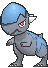
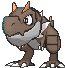
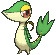
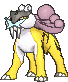
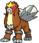
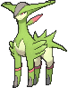
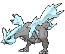

# Encounter Changes

---

## Overview

1. This document covers any changes made to the Gift Pokémon you receive as well as any static encounters within the game e.g. the Kecleon you encounter throughout the game, many legendary Pokémon and even the Wild Pokémon you encounter when Soaring in the Sky.

2. To see these changes, you need to include the DllField.cro file when building your game. However you will only be able to actually use these changes if you're playing with a method that is able to 'patch the RO module', else your game will crash upon trying to launch it. This means for Gateway and HANS users you can't use these changes, but Luma3DS or Citra users should be able to include it with no problems whatsoever.

---

## Files Mentioned

1. DllField - Static Encounter / Gift Pokémon Values

---

## Gift Pokémon changes

| Pokémon | Description                       | Changes |
| :---: | --- | --- |
| 
 [Treecko](../pokemon/treecko.md/)
 | Starter Pokémon | 1. Holds Oran Berry 2. Always has max IVs |
| 
 [Torchic](../pokemon/torchic.md/)
 | Starter Pokémon | 1. Holds Oran Berry 2. Always has max IVs |
| 
 [Mudkip](../pokemon/mudkip.md/)
 | Starter Pokémon | 1. Holds Oran Berry 2. Always has max IVs |
| 
 [Lileep](../pokemon/lileep.md/)
 | Fossil Pokémon | 1. Level increased to 30 2. Always has max IVs |
| 
 [Anorith](../pokemon/anorith.md/)
 | Fossil Pokémon | 1. Level increased to 30 2. Always has max IVs |
| 
 [Aerodactyl](../pokemon/aerodactyl.md/)
 | Fossil Pokémon | 1. Level increased to 30 2. Always has max IVs |
| 
 [Shieldon](../pokemon/shieldon.md/)
 | Fossil Pokémon | 1. Level increased to 30 2. Always has max IVs |
| 
 [Cranidos](../pokemon/cranidos.md/)
 | Fossil Pokémon | 1. Level increased to 30 2. Always has max IVs |
| 
 [Tirtouga](../pokemon/tirtouga.md/)
 | Fossil Pokémon | 1. Level increased to 30 2. Always has max IVs |
| 
 [Archen](../pokemon/archen.md/)
 | Fossil Pokémon | 1. Level increased to 30 2. Always has max IVs |
| 
 [Tyrunt](../pokemon/tyrunt.md/)
 | Fossil Pokémon | 1. Level increased to 30 2. Always has max IVs |
| 
 [Amaura](../pokemon/amaura.md/)
 | Fossil Pokémon | 1. Level increased to 30 2. Always has max IVs |
| 
 [Castform](../pokemon/castform.md/)
 | Weather Institute | 1. Level increased to 40 2. Random nature 3. Max IVs |
| 
 [Camerupt](../pokemon/camerupt.md/)
 | Battle Resort | 1. Level increased to 80 2. Always has max IVs |
| 
 [Sharpedo](../pokemon/sharpedo.md/)
 | Battle Resort | 1. Level increased to 80 2. Always has max IVs |
| 
 [Latias](../pokemon/latias.md/)
 | Route 118 | 1. Level increased to 40 2. Always has max IVs |
| 
 [Latios](../pokemon/latios.md/)
 | Route 118 | 1. Level increased to 40 2. Always has max IVs |
| 
 [Chikorita](../pokemon/chikorita.md/)
 | Gift from Birch | 1. Always has max IVs |
| 
 [Cyndaquil](../pokemon/cyndaquil.md/)
 | Gift from Birch | 1. Always has max IVs |
| 
 [Totodile](../pokemon/totodile.md/)
 | Gift from Birch | 1. Always has max IVs |
| 
 [Turtwig](../pokemon/turtwig.md/)
 | Gift from Birch | 1. Always has max IVs |
| 
 [Chimchar](../pokemon/chimchar.md/)
 | Gift from Birch | 1. Always has max IVs |
| 
 [Piplup](../pokemon/piplup.md/)
 | Gift from Birch | 1. Always has max IVs |
| 
 [Snivy](../pokemon/snivy.md/)
 | Gift from Birch | 1. Always has max IVs |
| 
 [Tepig](../pokemon/tepig.md/)
 | Gift from Birch | 1. Always has max IVs |
| 
 [Oshawott](../pokemon/oshawott.md/)
 | Gift from Birch | 1. Always has max IVs |

---

## Static Encounter Changes

\* Pokémon species also changed. See area changes doc for details.

| Pokémon | Description                       | Changes |
| :---: | --- | --- |
| First Battle on Route | Route 101 | 1. Changed from Lv. 3 Wurmple to Lv. 5 Pidgey |
| 
 [Kecleon](../pokemon/kecleon.md/)
 | Route 119/120 | 1. Level increased to 40 |
| 
 [Voltorb](../pokemon/voltorb.md/)
 | Team Hideout | 1. Level increased to 40 |
| 
 [Electrode](../pokemon/electrode.md/)
 | Team Hideout | 1. Level increased to 50 |
| 
 [Regirock](../pokemon/regirock.md/)
 | Desert Ruins | 1. Level increased to 60 |
| 
 [Regice](../pokemon/regice.md/)
 | Island Cave | 1. Level increased to 60 |
| 
 [Registeel](../pokemon/registeel.md/)
 | Ancient Tomb | 1. Level increased to 60 |
| 
 [Regigigas](../pokemon/regigigas.md/)
 | Island Cave | 1. Level increased to 68 |
| 
 [Kyogre](../pokemon/kyogre.md/)
 | Cave of Origin | 1. Level increased to 65 |
| 
 [Groudon](../pokemon/groudon.md/)
 | Cave of Origin | 1. Level increased to 65 |
| Wild Pokémon | Soaring in the Sky | 1. Level 60 2. Hidden ability 3. Max IV* |
| 
 [Rayquaza](../pokemon/rayquaza.md/)
 | Sky Pillar | 1. Level increased to 75 |
| 
 [Thundurus](../pokemon/thundurus-incarnate.md/)
 | Soaring in the Sky | 1. Level increased to 65 2. Found as Therian forme |
| 
 [Tornadus](../pokemon/tornadus-incarnate.md/)
 | Soaring in the Sky | 1. Level increased to 65 2. Found as Therian forme |
| 
 [Landorus](../pokemon/landorus-incarnate.md/)
 | Soaring in the Sky | 1. Level increased to 68 2. Found as Therian forme |
| 
 [Dialga](../pokemon/dialga.md/)
 | Soaring in the Sky | 1. Level increased to 70 2. Holding Adamant Orb |
| 
 [Palkia](../pokemon/palkia.md/)
 | Soaring in the Sky | 1. Level increased to 70 2. Holding Lustrous Orb |
| 
 [Giratina](../pokemon/giratina-altered.md/)
 | Soaring in the Sky | 1. Level increased to 70 2. Holding Griseous Orb |
| 
 [Raikou](../pokemon/raikou.md/)
 | Trackless Forest | 1. Level increased to 65 |
| 
 [Entei](../pokemon/entei.md/)
 | Trackless Forest | 1. Level increased to 65 |
| 
 [Suicune](../pokemon/suicune.md/)
 | Trackless Forest | 1. Level increased to 65 |
| 
 [Cobalion](../pokemon/cobalion.md/)
 | Pathless Plain | 1. Level increased to 65 |
| 
 [Terrakion](../pokemon/terrakion.md/)
 | Pathless Plain | 1. Level increased to 65 |
| 
 [Virizion](../pokemon/virizion.md/)
 | Pathless Plain | 1. Level increased to 65 |
| 
 [Reshiram](../pokemon/reshiram.md/)
 | Fabled Cave | 1. Level increased to 70 |
| 
 [Zekrom](../pokemon/zekrom.md/)
 | Fabled Cave | 1. Level increased to 70 |
| 
 [Kyurem](../pokemon/kyurem.md/)
 | Gnarled Den | 1. Level increased to 70 |
| 
 [Ho-oh](../pokemon/ho-oh.md/)
 | Sea Mauville | 1. Level increased to 70 2. Has Regenerator |
| 
 [Lugia](../pokemon/lugia.md/)
 | Sea Mauville | 1. Level increased to 70 2. Has Multiscale |
| 
 [Spiritomb](../pokemon/spiritomb.md/)
 | Sea Mauville | 1. Level increased to 60 |
| 
 [Latias](../pokemon/latias.md/)
 | Southern Island | 1. Level increased to 40 |
| 
 [Latios](../pokemon/latios.md/)
 | Southern Island | 1. Level increased to 40 |

