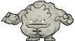
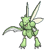
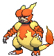
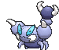
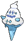
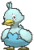
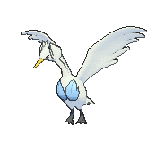
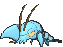

# Evolution Changes

---

## Overview

1. This document covers any changes made to the way a Pokémon evolves. The Pokémon modified can be split into two distinct sections.

2. Any Pokémon with a trade evolution has been modified so that they no longer need to be traded to evolve. There are three distinct subtypes of this evolution:

	- Pokémon that needed to be traded with an item can now use that item like an evolution stone. Evolution items can be found in Slateport Market and Lilycove Department Store, with some exceptions like the Prism Scale (found on Corsola).

	- Pokémon that need a trade with no additional requirements now have a particular level at which they evolve. However, they can also evolve by happiness, keeping the 'any level' evolution they had before. It depends which one you reach first!

	- Pokémon that need to be traded with another Pokémon to evolve are now able to evolve by having that other Pokémon in the party and levelling up. It doesn't make a whole lot of sense, but it's the best we've got!

3. Please note that these new evolution methods are in addition to the trading way, meaning that trading the Pokémon will still evolve it as before.

4. The other type of evolution change is a Pokémon evolution level reduction, as a lot of Pokémon have an evolution level that's too high to keep up with the pace of the game. The majority of Pokémon affected by this change are from Unova where the evolution levels were incredibly high, but levels have also been reduced for Pokémon from the other regions that are caught fairly early but still have an evolution level hovering around 40. Zweilous still holds the title of having the latest evolution, but now evolves at 59 instead of 64 before. All new numbers and the amount subtracted from the old number are listed below.

5. A version of the evolution GARC is available without evolution level reductions is available if preferred. However, level up moves for Pokémon affected by this have been modified to assume that they evolve at the levels listed here.

---

## Files Mentioned

1. a/1/9/2 - Pokémon Evolution Methods

---

## Trade Evolutions

| ### | Unevolved   | Evolved       | New Evolution Methods |
| --- | :---: | :---: | --- |
| 064 | 
 Kadabra
 | 
 Alakazam
 | Level up with 220+ friendship value or at Lv. 36. |
| 067 | 
 Machoke
 | 
 Machamp
 | Level up with 220+ friendship value or at Lv. 39. |
| 075 | 
 Graveler
 | 
 Golem
 | Level up with 220+ friendship value or at Lv. 36. |
| 094 | 
 Haunter
 | 
 Gengar
 | Level up with 220+ friendship value or at Lv. 36. |
| 525 | 
 Boldore
 | 
 Gigalith
 | Level up with 220+ friendship value or at Lv. 36. |
| 533 | 
 Gurdurr
 | 
 Conkeldurr
 | Level up with 220+ friendship value or at Lv. 36. |
| 708 | 
 Phantump
 | 
 Trevenant
 | Level up with 220+ friendship value or at Lv. 23. |
| 710 | 
 Pumpkaboo
 | 
 Gourgeist
 | Level up with 220+ friendship value or at Lv. 23. |

---

## Trade with Item Evolutions

| ### | Unevolved   | Evolved       | New Evolution Methods | Evolution Item Location |
| --- | :---: | :---: | --- | --- |
| 061 | 
 Poliwhirl
 | 
 Politoed
 | Use a King's Rock. | Slateport Market |
| 079 | 
 Slowpoke
 | 
 Slowking
 | Use a King's Rock. | Slateport Market |
| 095 | 
 Onix
 | 
 Steelix
 | Use a Metal Coat. | Slateport Market |
| 112 | 
 Rhydon
 | 
 Rhyperior
 | Use a Protector. | Lilycove Department Store |
| 117 | 
 Seadra
 | 
 Kingdra
 | Use a Dragon Scale. | Slateport Market |
| 123 | 
 Scyther
 | 
 Scizor
 | Use a Metal Coat. | Slateport Market |
| 125 | 
 Electabuzz
 | 
 Electivire
 | Use an Electirizer. | Lilycove Department Store |
| 126 | 
 Magmar
 | 
 Magmortar
 | Use a Magmarizer. | Lilycove Department Store |
| 137 | 
 Porygon
 | 
 Porygon2
 | Use an Up-Grade. | Slateport Market |
| 233 | 
 Porygon2
 | 
 Porygon-Z
 | Use a Dubious Disc. | Lilycove Department Store |
| 349 | 
 Feebas
 | 
 Milotic
 | Use a Prism Scale. | Wild Corsola (50%) |
| 356 | 
 Dusclops
 | 
 Dusknoir
 | Use a Reaper Cloth. | Lilycove Department Store |
| 366 | 
 Clamperl
 | 
 Huntail
 | Use a Deep Sea Tooth. | Slateport Market |
| 366 | 
 Clamperl
 | 
 Gorebyss
 | Use a Deep Sea Scale. | Slateport Market |

---

## Trade with Pokémon Evolutions

| ### | Unevolved   | Evolved       | New Evolution Methods |
| --- | :---: | :---: | --- |
| 588 | 
 Karrablast
 | 
 Escavalier
 | Level up with a Shelmet in the party. |
| 616 | 
 Shelmet
 | 
 Accelgor
 | Level up with a Karrablast in the party. |

---

## Level Adjustments

| ### | Unevolved   | Evolved       | Old    | New    | Diff |
| --- | :---: | :---: | --- | --- | --- |
| 077 | 
 Ponyta
 | 
 Rapidash
 | Lv. 40 | Lv. 37 | - 3 |
| 079 | 
 Slowpoke
 | 
 Slowbro
 | Lv. 37 | Lv. 33 | - 4 |
| 088 | 
 Grimer
 | 
 Muk
 | Lv. 38 | Lv. 35 | - 3 |
| 110 | 
 Koffing
 | 
 Weezing
 | Lv. 35 | Lv. 33 | - 2 |
| 111 | 
 Rhyhorn
 | 
 Rhydon
 | Lv. 42 | Lv. 39 | - 3 |
| 138 | 
 Omanyte
 | 
 Omastar
 | Lv. 40 | Lv. 37 | - 3 |
| 140 | 
 Kabuto
 | 
 Kabutops
 | Lv. 40 | Lv. 37 | - 3 |
| 217 | 
 Slugma
 | 
 Magcargo
 | Lv. 38 | Lv. 33 | - 5 |
| 307 | 
 Meditite
 | 
 Medicham
 | Lv. 37 | Lv. 35 | - 2 |
| 320 | 
 Wailmer
 | 
 Wailord
 | Lv. 40 | Lv. 37 | - 3 |
| 333 | 
 Swablu
 | 
 Altaria
 | Lv. 35 | Lv. 33 | - 2 |
| 345 | 
 Lileep
 | 
 Cradily
 | Lv. 40 | Lv. 37 | - 3 |
| 347 | 
 Anorith
 | 
 Armaldo
 | Lv. 40 | Lv. 37 | - 3 |
| 353 | 
 Shuppet
 | 
 Banette
 | Lv. 37 | Lv. 34 | - 3 |
| 355 | 
 Duskull
 | 
 Dusclops
 | Lv. 37 | Lv. 34 | - 3 |
| 361 | 
 Snorunt
 | 
 Glalie
 | Lv. 42 | Lv. 39 | - 3 |
| 431 | 
 Glameow
 | 
 Purugly
 | Lv. 38 | Lv. 33 | - 5 |
| 451 | 
 Skorupi
 | 
 Drapion
 | Lv. 40 | Lv. 37 | - 3 |
| 453 | 
 Croagunk
 | 
 Toxicroak
 | Lv. 37 | Lv. 35 | - 2 |
| 559 | 
 Scraggy
 | 
 Scrafty
 | Lv. 39 | Lv. 34 | - 5 |
| 568 | 
 Trubbish
 | 
 Garbodor
 | Lv. 36 | Lv. 34 | - 2 |
| 574 | 
 Gothita
 | 
 Gothorita
 | Lv. 32 | Lv. 26 | - 6 |
| 575 | 
 Gothorita
 | 
 Gothitelle
 | Lv. 41 | Lv. 39 | - 2 |
| 577 | 
 Solosis
 | 
 Duosion
 | Lv. 32 | Lv. 26 | - 6 |
| 578 | 
 Duosion
 | 
 Reuniclus
 | Lv. 41 | Lv. 39 | - 2 |
| 582 | 
 Vanillite
 | 
 Vanillish
 | Lv. 35 | Lv. 33 | - 2 |
| 583 | 
 Vanillish
 | 
 Vanilluxe
 | Lv. 47 | Lv. 44 | - 3 |
| 580 | 
 Ducklett
 | 
 Swanna
 | Lv. 35 | Lv. 33 | - 2 |
| 590 | 
 Foongus
 | 
 Amoonguss
 | Lv. 40 | Lv. 37 | - 3 |
| 592 | 
 Frillish
 | 
 Jellicent
 | Lv. 40 | Lv. 37 | - 3 |
| 595 | 
 Joltik
 | 
 Galvantula
 | Lv. 36 | Lv. 33 | - 3 |
| 597 | 
 Ferroseed
 | 
 Ferrothorn
 | Lv. 40 | Lv. 37 | - 3 |
| 599 | 
 Klink
 | 
 Klang
 | Lv. 38 | Lv. 33 | - 5 |
| 600 | 
 Klang
 | 
 Klinklang
 | Lv. 49 | Lv. 44 | - 5 |
| 602 | 
 Tynamo
 | 
 Eelektrik
 | Lv. 39 | Lv. 34 | - 5 |
| 605 | 
 Elgyem
 | 
 Beheeyem
 | Lv. 42 | Lv. 39 | - 3 |
| 607 | 
 Litwick
 | 
 Lampent
 | Lv. 41 | Lv. 34 | - 7 |
| 610 | 
 Axew
 | 
 Fraxure
 | Lv. 42 | Lv. 32 | - 10 |
| 619 | 
 Mienfoo
 | 
 Mienshao
 | Lv. 50 | Lv. 36 | - 14 |
| 622 | 
 Golett
 | 
 Golurk
 | Lv. 43 | Lv. 39 | - 4 |
| 624 | 
 Pawniard
 | 
 Bisharp
 | Lv. 52 | Lv. 37 | - 15 |
| 627 | 
 Rufflet
 | 
 Braviary
 | Lv. 54 | Lv. 39 | - 15 |
| 629 | 
 Vullaby
 | 
 Mandibuzz
 | Lv. 54 | Lv. 39 | - 15 |
| 633 | 
 Deino
 | 
 Zweilous
 | Lv. 50 | Lv. 39 | - 11 |
| 634 | 
 Zweilous
 | 
 Hydreigon
 | Lv. 64 | Lv. 59 | - 5 |
| 636 | 
 Larvesta
 | 
 Volcarona
 | Lv. 59 | Lv. 50 | - 9 |
| 667 | 
 Litleo
 | 
 Pyroar
 | Lv. 35 | Lv. 33 | - 2 |
| 688 | 
 Binacle
 | 
 Barbaracle
 | Lv. 39 | Lv. 34 | - 5 |
| 690 | 
 Skrelp
 | 
 Dragalge
 | Lv. 48 | Lv. 35 | - 13 |
| 692 | 
 Clauncher
 | 
 Clawitzer
 | Lv. 37 | Lv. 33 | - 4 |
| 714 | 
 Noibat
 | 
 Noivern
 | Lv. 48 | Lv. 44 | - 4 |

