# Hoenn Pokémon

---

## [#252 Treecko](../../pokemon/treecko.md/)

**Location**: Route 101, Breed Grovyle

**Ability 2**: Unburden

**Level Up Moves:**

| Moves | Level |     | Cont. | Level |
| ----- | ----- | --- | ----- | ----- |
| Pound | 1 |   | Pursuit | 21 |
| Leer | 3 |   | Energy Ball | 23 |
| Absorb | 5 |   | Slam | 25 |
| Quick Attack | 7 |   | Detect | 27 |
| Mega Drain | 9 |   | Crunch | 29 |
| Dragon Breath | 11 |   | Endeavor | 31 |
| Double Kick | 13 |   | Quick Guard | 33 |
| Grass Whistle | 15 |   | Screech | 35 |
| Agility | 17 |   | Leaf Storm | 37 |
| Giga Drain | 19 |   |   |   |

---

## [#253 Grovyle](../../pokemon/grovyle.md/)

**Location**: Route 119

**Ability 2**: Unburden

**Level Up Moves:**

| Moves | Level |     | Cont. | Level |
| ----- | ----- | --- | ----- | ----- |
| Pound | 1 |   | Pursuit | 24 |
| Leer | 3 |   | Leaf Blade | 27 |
| Absorb | 5 |   | Acrobatics | 30 |
| Quick Attack | 7 |   | Detect | 33 |
| Mega Drain | 9 |   | Crunch | 36 |
| Dragon Breath | 11 |   | Endeavor | 39 |
| Double Kick | 13 |   | X-Scissor | 42 |
| Grass Whistle | 15 |   | Quick Guard | 45 |
| Fury Cutter | 16 |   | Screech | 48 |
| Agility | 18 |   | Leaf Storm | 51 |
| Giga Drain | 21 |   |   |   |

---

## [#254 Sceptile](../../pokemon/sceptile.md/)

**Location**: Evolve Grovyle (Lv. 36)

**Ability 2**: Unburden

**Level Up Moves:**

| Moves | Level |     | Cont. | Level |
| ----- | ----- | --- | ----- | ----- |
| Leaf Storm | 1 |   | Giga Drain | 21 |
| Night Slash | 1 |   | Pursuit | 24 |
| Thunder Punch | 1 |   | Leaf Blade | 27 |
| Pound | 1 |   | Acrobatics | 30 |
| Leer | 3 |   | Detect | 33 |
| Absorb | 5 |   | Dual Chop | 36 |
| Quick Attack | 7 |   | Crunch | 37 |
| Mega Drain | 9 |   | Endeavor | 41 |
| Dragon Breath | 11 |   | X-Scissor | 45 |
| Double Kick | 13 |   | Dragon Pulse | 49 |
| Grass Whistle | 15 |   | Screech | 53 |
| Fury Cutter | 16 |   | Leaf Storm | 57 |
| Agility | 18 |   |   |   |

---

## [#255 Torchic](../../pokemon/torchic.md/)

**Location**: Route 101, Breed Combusken

**Ability 2**: Speed Boost

**Level Up Moves:**

| Moves | Level |     | Cont. | Level |
| ----- | ----- | --- | ----- | ----- |
| Scratch | 1 |   | Flame Burst | 21 |
| Growl | 3 |   | Aerial Ace | 23 |
| Ember | 5 |   | Focus Energy | 25 |
| Sand Attack | 7 |   | Slash | 27 |
| Peck | 9 |   | Bounce | 29 |
| Fire Spin | 11 |   | Flamethrower | 31 |
| Feather Dance | 13 |   | Mirror Move | 33 |
| Flame Charge | 15 |   | Reversal | 35 |
| Night Slash | 17 |   | Fire Blast | 37 |
| Quick Attack | 19 |   |   |   |

---

## [#256 Combusken](../../pokemon/combusken.md/)

**Location**: Route 120

**Ability 2**: Speed Boost

**Level Up Moves:**

| Moves | Level |     | Cont. | Level |
| ----- | ----- | --- | ----- | ----- |
| Scratch | 1 |   | Flame Burst | 24 |
| Growl | 3 |   | Low Kick | 27 |
| Ember | 5 |   | Bulk Up | 30 |
| Sand Attack | 7 |   | Focus Energy | 33 |
| Peck | 9 |   | Slash | 36 |
| Fire Spin | 11 |   | Bounce | 39 |
| Feather Dance | 13 |   | Flamethrower | 42 |
| Flame Charge | 15 |   | Mirror Move | 45 |
| Double Kick | 16 |   | Sky Uppercut | 48 |
| Night Slash | 18 |   | Flare Blitz | 51 |
| Quick Attack | 21 |   |   |   |

---

## [#257 Blaziken](../../pokemon/blaziken.md/)

**Location**: Evolve Combusken (Lv. 36)

**Ability 2**: Speed Boost

**Level Up Moves:**

| Moves | Level |     | Cont. | Level |
| ----- | ----- | --- | ----- | ----- |
| Flare Blitz | 1 |   | Quick Attack | 21 |
| Fire Punch | 1 |   | Flame Burst | 24 |
| Thunder Punch | 1 |   | Low Kick | 27 |
| High Jump Kick | 1 |   | Bulk Up | 30 |
| Growl | 3 |   | Focus Energy | 33 |
| Ember | 5 |   | Blaze Kick | 36 |
| Sand Attack | 7 |   | Slash | 37 |
| Peck | 9 |   | Bounce | 41 |
| Fire Spin | 11 |   | Flamethrower | 45 |
| Feather Dance | 13 |   | Brave Bird | 49 |
| Flame Charge | 15 |   | Sky Uppercut | 53 |
| Double Kick | 16 |   | Flare Blitz | 57 |
| Night Slash | 18 |   |   |   |

---

## [#258 Mudkip](../../pokemon/mudkip.md/)

**Location**: Route 101, Breed Marshtomp

**Ability 2**: Damp

**Level Up Moves:**

| Moves | Level |     | Cont. | Level |
| ----- | ----- | --- | ----- | ----- |
| Tackle | 1 |   | Aqua Tail | 21 |
| Growl | 3 |   | Mud Sport | 23 |
| Water Gun | 5 |   | Whirlpool | 25 |
| Mud-Slap | 7 |   | Sludge Wave | 27 |
| Foresight | 9 |   | Take Down | 29 |
| Bide | 11 |   | Avalanche | 31 |
| Rock Throw | 13 |   | Endeavor | 33 |
| Water Pulse | 15 |   | Mirror Coat | 35 |
| Yawn | 17 |   | Hydro Pump | 37 |
| Protect | 19 |   |   |   |

---

## [#259 Marshtomp](../../pokemon/marshtomp.md/)

**Location**: Route 120

**Ability 2**: Damp

**Level Up Moves:**

| Moves | Level |     | Cont. | Level |
| ----- | ----- | --- | ----- | ----- |
| Tackle | 1 |   | Aqua Tail | 24 |
| Growl | 3 |   | Rock Slide | 27 |
| Water Gun | 5 |   | Muddy Water | 30 |
| Mud-Slap | 7 |   | Sludge Wave | 33 |
| Foresight | 9 |   | Take Down | 36 |
| Bide | 11 |   | Earthquake | 39 |
| Rock Throw | 13 |   | Avalanche | 42 |
| Water Pulse | 15 |   | Endeavor | 45 |
| Mud Shot | 16 |   | Mirror Coat | 48 |
| Yawn | 18 |   | Hydro Pump | 51 |
| Mud Bomb | 21 |   |   |   |

---

## [#260 Swampert](../../pokemon/swampert.md/)

**Location**: Evolve Marshtomp (Lv. 36)

**Ability 2**: Damp

**Level Up Moves:**

| Moves | Level |     | Cont. | Level |
| ----- | ----- | --- | ----- | ----- |
| Hydro Pump | 1 |   | Mud Bomb | 21 |
| Ice Punch | 1 |   | Aqua Tail | 24 |
| Stone Edge | 1 |   | Rock Slide | 27 |
| Tackle | 1 |   | Muddy Water | 30 |
| Growl | 3 |   | Sludge Wave | 33 |
| Water Gun | 5 |   | Hammer Arm | 36 |
| Mud-Slap | 7 |   | Take Down | 37 |
| Foresight | 9 |   | Earthquake | 41 |
| Bide | 11 |   | Avalanche | 45 |
| Rock Throw | 13 |   | Endeavor | 49 |
| Water Pulse | 15 |   | Mirror Coat | 53 |
| Mud Shot | 16 |   | Hydro Pump | 57 |
| Yawn | 18 |   |   |   |

---

## [#261 Poochyena](../../pokemon/poochyena.md/)

**Location**: Route 101

**Level Up Moves:**

| Moves | Level |     | Cont. | Level |
| ----- | ----- | --- | ----- | ----- |
| Tackle | 1 |   | Swagger | 25 |
| Howl | 4 |   | Scary Face | 28 |
| Sand Attack | 7 |   | Take Down | 31 |
| Bite | 10 |   | Taunt | 34 |
| Odor Sleuth | 13 |   | Play Rough | 37 |
| Assurance | 16 |   | Embargo | 40 |
| Roar | 19 |   | Sucker Punch | 43 |
| Crunch | 22 |   |   |   |

---

## [#262 Mightyena](../../pokemon/mightyena.md/)

**Location**: Route 121

**Base Stat Changes:**

| Stat | Base | Change |
| ---- | ---- | ------ |
| Attack | 90 | 110 |
| Speed | 70 | 80 |
| Total | 420 | 450 |

**Level Up Moves:**

| Moves | Level |     | Cont. | Level |
| ----- | ----- | --- | ----- | ----- |
| Sucker Punch | 1 |   | Assurance | 16 |
| Fire Fang | 1 |   | Roar | 20 |
| Thunder Fang | 1 |   | Crunch | 24 |
| Ice Fang | 1 |   | Swagger | 28 |
| Poison Fang | 1 |   | Scary Face | 32 |
| Super Fang | 1 |   | Take Down | 36 |
| Tackle | 1 |   | Taunt | 40 |
| Howl | 4 |   | Play Rough | 44 |
| Sand Attack | 7 |   | Embargo | 48 |
| Bite | 10 |   | Sucker Punch | 52 |
| Odor Sleuth | 13 |   |   |   |

---

## [#263 Zigzagoon](../../pokemon/zigzagoon.md/)

**Location**: Route 101

**Base Stat Changes:**

| Stat | Base | Change |
| ---- | ---- | ------ |
| Attack | 30 | 40 |
| Sp. Attack | 30 | 20 |

**Level Up Moves:**

| Moves | Level |     | Cont. | Level |
| ----- | ----- | --- | ----- | ----- |
| Tackle | 1 |   | Flail | 21 |
| Growl | 1 |   | Seed Bomb | 24 |
| Tail Whip | 5 |   | Bestow | 27 |
| Sand Attack | 7 |   | Take Down | 30 |
| Headbutt | 9 |   | Belly Drum | 33 |
| Baby-Doll Eyes | 11 |   | Rest | 36 |
| Odor Sleuth | 13 |   | Gunk Shot | 39 |
| Covet | 15 |   | Fling | 42 |
| Pin Missile | 17 |   | Extreme Speed | 45 |
| Mud Sport | 19 |   |   |   |

---

## [#264 Linoone](../../pokemon/linoone.md/)

**Location**: Route 101, Route 118

**Base Stat Changes:**

| Stat | Base | Change |
| ---- | ---- | ------ |
| HP | 78 | 80 |
| Attack | 70 | 90 |
| Defense | 61 | 60 |
| Sp. Attack | 50 | 40 |
| Sp. Defense | 61 | 60 |
| Speed | 100 | 110 |
| Total | 420 | 440 |

**Level Up Moves:**

| Moves | Level |     | Cont. | Level |
| ----- | ----- | --- | ----- | ----- |
| Extreme Speed | 1 |   | Mud Sport | 19 |
| Switcheroo | 1 |   | Play Rough | 20 |
| Tackle | 1 |   | Slash | 22 |
| Growl | 1 |   | Seed Bomb | 26 |
| Tail Whip | 5 |   | Bestow | 30 |
| Sand Attack | 7 |   | Double-Edge | 34 |
| Headbutt | 9 |   | Belly Drum | 38 |
| Rototiller | 11 |   | Rest | 42 |
| Odor Sleuth | 13 |   | Gunk Shot | 46 |
| Covet | 15 |   | Fling | 50 |
| Fury Swipes | 17 |   | Extreme Speed | 54 |

---

## [#265 Wurmple](../../pokemon/wurmple.md/)

**Location**: Route 102

**Ability 2**: Run Away

**Level Up Moves:**

| Moves | Level |     | Cont. | Level |
| ----- | ----- | --- | ----- | ----- |
| Tackle | 1 |   | Bug Bite | 3 |
| String Shot | 1 |   | Electroweb | 5 |
| Poison Sting | 1 |   |   |   |

---

## [#266 Silcoon](../../pokemon/silcoon.md/)

**Location**: Evolve Wurmple (Lv. 7)

**Level Up Moves:**

| Moves | Level |     | Cont. | Level |
| ----- | ----- | --- | ----- | ----- |
| Harden | 1 |   | Iron Defense | 9 |
| Harden | 7 |   |   |   |

---

## [#267 Beautifly](../../pokemon/beautifly.md/)

**Location**: Safari Zone

**Ability 2**: Rivalry

**New TM/HMs**: Fly

**Base Stat Changes:**

| Stat | Base | Change |
| ---- | ---- | ------ |
| HP | 60 | 65 |
| Defense | 50 | 55 |
| Sp. Attack | 100 | 120 |
| Sp. Defense | 50 | 55 |
| Speed | 65 | 85 |
| Total | 395 | 450 |

**Level Up Moves:**

| Moves | Level |     | Cont. | Level |
| ----- | ----- | --- | ----- | ----- |
| Gust | 1 |   | Giga Drain | 28 |
| Gust | 10 |   | Bug Buzz | 30 |
| Absorb | 12 |   | Whirlwind | 32 |
| Struggle Bug | 14 |   | Rage | 34 |
| Stun Spore | 16 |   | Energy Ball | 36 |
| Morning Sun | 18 |   | Psychic | 38 |
| Air Cutter | 20 |   | Air Slash | 40 |
| Mega Drain | 22 |   | Quiver Dance | 42 |
| Silver Wind | 24 |   | Hurricane | 44 |
| Attract | 26 |   |   |   |

---

## [#268 Cascoon](../../pokemon/cascoon.md/)

**Location**: Evolve Wurmple (Lv. 7)

**Level Up Moves:**

| Moves | Level |     | Cont. | Level |
| ----- | ----- | --- | ----- | ----- |
| Harden | 1 |   | Iron Defense | 9 |
| Harden | 7 |   |   |   |

---

## [#269 Dustox](../../pokemon/dustox.md/)

**Location**: Safari Zone

**Ability 2**: Compound Eyes

**New TM/HMs**: Fly

**Base Stat Changes:**

| Stat | Base | Change |
| ---- | ---- | ------ |
| Sp. Attack | 50 | 85 |
| Sp. Defense | 90 | 120 |
| Total | 385 | 450 |

**Level Up Moves:**

| Moves | Level |     | Cont. | Level |
| ----- | ----- | --- | ----- | ----- |
| Gust | 1 |   | Light Screen | 26 |
| Gust | 10 |   | Psychic | 28 |
| Confusion | 12 |   | Bug Buzz | 30 |
| Struggle Bug | 14 |   | Toxic | 32 |
| Poison Powder | 16 |   | Protect | 34 |
| Moonlight | 18 |   | Sludge Bomb | 36 |
| Venoshock | 20 |   | Shadow Ball | 38 |
| Psybeam | 22 |   | Roost | 40 |
| Silver Wind | 24 |   | Quiver Dance | 42 |

---

## [#270 Lotad](../../pokemon/lotad.md/)

**Location**: Route 102

**Level Up Moves:**

| Moves | Level |     | Cont. | Level |
| ----- | ----- | --- | ----- | ----- |
| Astonish | 1 |   | Mist | 19 |
| Growl | 1 |   | Nature Power | 22 |
| Absorb | 5 |   | Rain Dance | 25 |
| Bubble | 7 |   | Giga Drain | 28 |
| Natural Gift | 10 |   | Zen Headbutt | 31 |
| Mega Drain | 13 |   | Energy Ball | 34 |
| Bubble Beam | 16 |   |   |   |

---

## [#271 Lombre](../../pokemon/lombre.md/)

**Location**: Safari Zone

**Level Up Moves:**

| Moves | Level |     | Cont. | Level |
| ----- | ----- | --- | ----- | ----- |
| Astonish | 1 |   | Water Sport | 22 |
| Growl | 1 |   | Nature Power | 26 |
| Absorb | 5 |   | Giga Drain | 30 |
| Bubble | 7 |   | Uproar | 34 |
| Fury Swipes | 10 |   | Knock Off | 38 |
| Mega Drain | 13 |   | Zen Headbutt | 42 |
| Fake Out | 14 |   | Energy Ball | 46 |
| Bubble Beam | 18 |   | Hydro Pump | 50 |

---

## [#272 Ludicolo](../../pokemon/ludicolo.md/)

**Location**: Evolve Lombre (Water Stone)

**Level Up Moves:**

| Moves | Level |     | Cont. | Level |
| ----- | ----- | --- | ----- | ----- |
| Ice Punch | 1 |   | Mega Drain | 1 |
| Fire Punch | 1 |   | Nature Power | 1 |
| Thunder Punch | 1 |   | Teeter Dance | 23 |
| Drain Punch | 1 |   | Rain Dance | 38 |
| Astonish | 1 |   | Hydro Pump | 53 |
| Growl | 1 |   |   |   |

---

## [#273 Seedot](../../pokemon/seedot.md/)

**Location**: Route 102

**Level Up Moves:**

| Moves | Level |     | Cont. | Level |
| ----- | ----- | --- | ----- | ----- |
| Bide | 1 |   | Synthesis | 15 |
| Harden | 3 |   | Seed Bomb | 18 |
| Bullet Seed | 6 |   | Sunny Day | 21 |
| Growth | 9 |   | Explosion | 24 |
| Nature Power | 12 |   |   |   |

---

## [#274 Nuzleaf](../../pokemon/nuzleaf.md/)

**Location**: Safari Zone

**Level Up Moves:**

| Moves | Level |     | Cont. | Level |
| ----- | ----- | --- | ----- | ----- |
| Pound | 1 |   | Feint Attack | 19 |
| Harden | 3 |   | Razor Wind | 23 |
| Fake Out | 6 |   | Leaf Blade | 27 |
| Growth | 9 |   | Dark Pulse | 31 |
| Nature Power | 12 |   | Swagger | 35 |
| Razor Leaf | 14 |   | Low Kick | 39 |
| Torment | 15 |   | Extrasensory | 43 |

---

## [#275 Shiftry](../../pokemon/shiftry.md/)

**Location**: Evolve Nuzleaf (Leaf Stone)

**Level Up Moves:**

| Moves | Level |     | Cont. | Level |
| ----- | ----- | --- | ----- | ----- |
| Twister | 1 |   | Whirlwind | 1 |
| Ominous Wind | 1 |   | Nasty Plot | 1 |
| Silver Wind | 1 |   | Leaf Tornado | 20 |
| Razor Leaf | 1 |   | Hurricane | 32 |
| Feint Attack | 1 |   | Leaf Storm | 44 |

---

## [#276 Taillow](../../pokemon/taillow.md/)

**Location**: Route 104 South

**Ability 2**: Scrappy

**Level Up Moves:**

| Moves | Level |     | Cont. | Level |
| ----- | ----- | --- | ----- | ----- |
| Peck | 1 |   | Aerial Ace | 21 |
| Growl | 1 |   | Quick Guard | 25 |
| Focus Energy | 5 |   | Agility | 29 |
| Quick Attack | 9 |   | Air Slash | 33 |
| Wing Attack | 13 |   | Endeavor | 37 |
| Double Team | 17 |   | Brave Bird | 41 |

---

## [#277 Swellow](../../pokemon/swellow.md/)

**Location**: Route 115

**Ability 2**: Scrappy

**Base Stat Changes:**

| Stat | Base | Change |
| ---- | ---- | ------ |
| Attack | 85 | 95 |
| Sp. Defense | 50 | 60 |
| Total | 430 | 450 |

**Level Up Moves:**

| Moves | Level |     | Cont. | Level |
| ----- | ----- | --- | ----- | ----- |
| Brave Bird | 1 |   | Aerial Ace | 21 |
| Air Slash | 1 |   | Quick Guard | 26 |
| Pluck | 1 |   | Agility | 31 |
| Peck | 1 |   | Air Slash | 36 |
| Growl | 1 |   | Endeavor | 41 |
| Focus Energy | 5 |   | Brave Bird | 46 |
| Quick Attack | 9 |   | Superpower | 51 |
| Wing Attack | 13 |   | Extreme Speed | 56 |
| Double Team | 17 |   |   |   |

---

## [#278 Wingull](../../pokemon/wingull.md/)

**Location**: Route 104 South, Route 106, Dewford Town, Route 107, Route 109, Route 105, Route 118, Route 126, Route 131

**Ability 2**: Rain Dish

**New TM/HMs**: Surf, Waterfall, Dive

**Level Up Moves:**

| Moves | Level |     | Cont. | Level |
| ----- | ----- | --- | ----- | ----- |
| Growl | 1 |   | Air Cutter | 22 |
| Water Gun | 1 |   | Pursuit | 26 |
| Supersonic | 5 |   | Aerial Ace | 29 |
| Wing Attack | 8 |   | Roost | 33 |
| Mist | 12 |   | Agility | 36 |
| Water Pulse | 15 |   | Air Slash | 40 |
| Quick Attack | 19 |   | Hurricane | 43 |

---

## [#279 Pelipper](../../pokemon/pelipper.md/)

**Location**: Route 106, Dewford Town, Route 107, Route 109, Route 105, Route 118, Route 126, Ever Grande City, Route 131, Battle Resort

**Ability 2**: Rain Dish

**New TM/HMs**: Waterfall, Dive

**Base Stat Changes:**

| Stat | Base | Change |
| ---- | ---- | ------ |
| HP | 60 | 80 |
| Total | 430 | 450 |

**Level Up Moves:**

| Moves | Level |     | Cont. | Level |
| ----- | ----- | --- | ----- | ----- |
| Hurricane | 1 |   | Payback | 19 |
| Hydro Pump | 1 |   | Roost | 22 |
| Tailwind | 1 |   | Protect | 25 |
| Soak | 1 |   | Brine | 28 |
| Shock Wave | 1 |   | Stockpile | 33 |
| Growl | 1 |   | Swallow | 33 |
| Water Gun | 1 |   | Spit Up | 33 |
| Water Sport | 1 |   | Fling | 39 |
| Supersonic | 5 |   | Tailwind | 44 |
| Wing Attack | 8 |   | Hydro Pump | 50 |
| Mist | 12 |   | Hurricane | 55 |
| Water Pulse | 15 |   |   |   |

---

## [#280 Ralts](../../pokemon/ralts.md/)

**Location**: Route 102, Mt. Pyre

**Base Stat Changes:**

| Stat | Base | Change |
| ---- | ---- | ------ |
| Sp. Attack | 45 | 65 |
| Sp. Defense | 35 | 55 |
| Total | 198 | 238 |

**Level Up Moves:**

| Moves | Level |     | Cont. | Level |
| ----- | ----- | --- | ----- | ----- |
| Growl | 1 |   | Psychic | 24 |
| Confusion | 4 |   | Calm Mind | 27 |
| Double Team | 6 |   | Imprison | 29 |
| Teleport | 9 |   | Future Sight | 32 |
| Disarming Voice | 11 |   | Charm | 34 |
| Magical Leaf | 14 |   | Hypnosis | 37 |
| Draining Kiss | 17 |   | Dream Eater | 39 |
| Lucky Chant | 19 |   | Stored Power | 42 |
| Heal Pulse | 22 |   |   |   |

---

## [#281 Kirlia](../../pokemon/kirlia.md/)

**Location**: Mt. Pyre

**Base Stat Changes:**

| Stat | Base | Change |
| ---- | ---- | ------ |
| Sp. Attack | 65 | 85 |
| Sp. Defense | 55 | 75 |
| Total | 278 | 318 |

**Level Up Moves:**

| Moves | Level |     | Cont. | Level |
| ----- | ----- | --- | ----- | ----- |
| Growl | 1 |   | Lucky Chant | 19 |
| Confusion | 1 |   | Heal Pulse | 23 |
| Double Team | 1 |   | Psychic | 26 |
| Teleport | 1 |   | Calm Mind | 30 |
| Confusion | 4 |   | Imprison | 33 |
| Double Team | 6 |   | Future Sight | 37 |
| Teleport | 9 |   | Charm | 40 |
| Disarming Voice | 11 |   | Hypnosis | 44 |
| Magical Leaf | 14 |   | Dream Eater | 47 |
| Draining Kiss | 17 |   | Stored Power | 51 |

---

## [#282 Gardevoir](../../pokemon/gardevoir.md/)

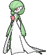

**Location**: Evolve Kirlia (Lv. 30)

**Level Up Moves:**

| Moves | Level |     | Cont. | Level |
| ----- | ----- | --- | ----- | ----- |
| Moonblast | 1 |   | Heal Pulse | 23 |
| Stored Power | 1 |   | Psychic | 26 |
| Misty Terrain | 1 |   | Hyper Voice | 30 |
| Healing Wish | 1 |   | Calm Mind | 31 |
| Growl | 1 |   | Imprison | 35 |
| Confusion | 4 |   | Future Sight | 40 |
| Double Team | 6 |   | Captivate | 44 |
| Teleport | 9 |   | Hypnosis | 49 |
| Disarming Voice | 11 |   | Dream Eater | 53 |
| Magical Leaf | 14 |   | Stored Power | 58 |
| Draining Kiss | 17 |   | Moonblast | 62 |
| Wish | 19 |   |   |   |

---

## [#283 Surskit](../../pokemon/surskit.md/)

**Location**: Route 102

**Ability 2**: Speed Boost **

**Base Stat Changes:**

| Stat | Base | Change |
| ---- | ---- | ------ |
| Attack | 50 | 60 |
| Sp. Attack | 60 | 62 |
| Total | 269 | 289 |

**Level Up Moves:**

| Moves | Level |     | Cont. | Level |
| ----- | ----- | --- | ----- | ----- |
| Bubble | 1 |   | Aqua Jet | 18 |
| Sweet Scent | 1 |   | Mist | 20 |
| Fell Stinger | 1 |   | Psybeam | 22 |
| Quick Attack | 6 |   | Haze | 24 |
| Struggle Bug | 9 |   | Baton Pass | 26 |
| Bubble Beam | 12 |   | Signal Beam | 28 |
| Water Sport | 14 |   | Sticky Web | 30 |
| Agility | 16 |   | Hydro Pump | 32 |

---

## [#284 Masquerain](../../pokemon/masquerain.md/)

**Location**: Safari Zone

**Ability 2**: Levitate **

**New TM/HMs**: Fly, Surf, Waterfall, Dive

**Type**:   >>  

**Base Stat Changes:**

| Stat | Base | Change |
| ---- | ---- | ------ |
| Attack | 60 | 50 |
| Defense | 62 | 65 |
| Sp. Attack | 80 | 105 |
| Sp. Defense | 82 | 105 |
| Speed | 60 | 85 |
| Total | 414 | 480 |

**Level Up Moves:**

| Moves | Level |     | Cont. | Level |
| ----- | ----- | --- | ----- | ----- |
| Quiver Dance | 1 |   | Silver Wind | 22 |
| Bubble | 1 |   | Psybeam | 23 |
| Sweet Scent | 1 |   | Haze | 26 |
| Fell Stinger | 1 |   | Signal Beam | 29 |
| Quick Attack | 6 |   | Baton Pass | 32 |
| Struggle Bug | 9 |   | Ominous Wind | 35 |
| Bubble Beam | 12 |   | Bug Buzz | 38 |
| Water Sport | 14 |   | Air Slash | 41 |
| Agility | 16 |   | Whirlwind | 44 |
| Aqua Jet | 18 |   | Hydro Pump | 47 |
| Mist | 20 |   | Hurricane | 50 |
| Gust | 22 |   | Quiver Dance | 53 |

---

## [#285 Shroomish](../../pokemon/shroomish.md/)

**Location**: Petalburg Woods

**Level Up Moves:**

| Moves | Level |     | Cont. | Level |
| ----- | ----- | --- | ----- | ----- |
| Absorb | 1 |   | Poison Powder | 20 |
| Tackle | 1 |   | Worry Seed | 23 |
| Stun Spore | 5 |   | Giga Drain | 26 |
| Leech Seed | 8 |   | Growth | 29 |
| Mega Drain | 11 |   | Toxic | 32 |
| Headbutt | 14 |   | Seed Bomb | 35 |
| Bullet Seed | 17 |   | Spore | 38 |

---

## [#286 Breloom](../../pokemon/breloom.md/)

**Location**: Petalburg Woods, Safari Zone

**Level Up Moves:**

| Moves | Level |     | Cont. | Level |
| ----- | ----- | --- | ----- | ----- |
| Superpower | 1 |   | Counter | 23 |
| Thunder Punch | 1 |   | Mach Punch | 23 |
| Absorb | 1 |   | Force Palm | 27 |
| Tackle | 1 |   | Mind Reader | 31 |
| Stun Spore | 5 |   | Drain Punch | 35 |
| Leech Seed | 8 |   | Sky Uppercut | 39 |
| Mega Drain | 11 |   | Seed Bomb | 43 |
| Headbutt | 14 |   | Dynamic Punch | 47 |
| Bullet Seed | 17 |   | Superpower | 51 |
| Feint | 20 |   |   |   |

---

## [#287 Slakoth](../../pokemon/slakoth.md/)

**Location**: Petalburg Woods

**Level Up Moves:**

| Moves | Level |     | Cont. | Level |
| ----- | ----- | --- | ----- | ----- |
| Scratch | 1 |   | Covet | 18 |
| Yawn | 1 |   | Amnesia | 21 |
| Encore | 6 |   | Counter | 24 |
| Slack Off | 9 |   | Body Slam | 27 |
| Feint Attack | 12 |   | Flail | 30 |
| Chip Away | 15 |   | Play Rough | 33 |

---

## [#288 Vigoroth](../../pokemon/vigoroth.md/)

**Location**: Safari Zone

**Level Up Moves:**

| Moves | Level |     | Cont. | Level |
| ----- | ----- | --- | ----- | ----- |
| Reversal | 1 |   | Slash | 18 |
| Scratch | 1 |   | Endure | 22 |
| Focus Energy | 1 |   | Counter | 26 |
| Encore | 6 |   | Night Slash | 30 |
| Uproar | 9 |   | Focus Punch | 34 |
| Fury Swipes | 12 |   | Reversal | 38 |
| Chip Away | 15 |   |   |   |

---

## [#289 Slaking](../../pokemon/slaking.md/)

**Location**: Evolve Vigoroth (Lv. 36)

**Level Up Moves:**

| Moves | Level |     | Cont. | Level |
| ----- | ----- | --- | ----- | ----- |
| Hammer Arm | 1 |   | Chip Away | 15 |
| Punishment | 1 |   | Covet | 18 |
| Fling | 1 |   | Amnesia | 22 |
| Ice Punch | 1 |   | Counter | 26 |
| Thunder Punch | 1 |   | Body Slam | 30 |
| Fire Punch | 1 |   | Flail | 34 |
| Scratch | 1 |   | Swagger | 36 |
| Yawn | 1 |   | Play Rough | 39 |
| Encore | 6 |   | Fling | 44 |
| Slack Off | 9 |   | Punishment | 49 |
| Feint Attack | 12 |   | Hammer Arm | 54 |

---

## [#290 Nincada](../../pokemon/nincada.md/)

**Location**: Rusturf Tunnel

**Ability 2**: Run Away

**Level Up Moves:**

| Moves | Level |     | Cont. | Level |
| ----- | ----- | --- | ----- | ----- |
| Scratch | 1 |   | Night Slash | 17 |
| Harden | 1 |   | Metal Claw | 21 |
| Leech Life | 1 |   | Mind Reader | 25 |
| Mud-Slap | 1 |   | Bide | 29 |
| Sand Attack | 5 |   | False Swipe | 33 |
| Fury Swipes | 9 |   | Dig | 37 |
| Bug Bite | 13 |   |   |   |

---

## [#291 Ninjask](../../pokemon/ninjask.md/)

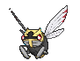

**Location**: Evolve Nincada (Lv. 20)

**Ability 2**: Infiltrator

**New TM/HMs**: Fly

**Level Up Moves:**

| Moves | Level |     | Cont. | Level |
| ----- | ----- | --- | ----- | ----- |
| Scratch | 1 |   | Fury Cutter | 20 |
| Harden | 1 |   | Screech | 20 |
| Leech Life | 1 |   | Slash | 23 |
| Agility | 1 |   | Mind Reader | 28 |
| Sand Attack | 5 |   | X-Scissor | 33 |
| Fury Swipes | 9 |   | Swords Dance | 38 |
| Bug Bite | 13 |   | Baton Pass | 43 |
| Night Slash | 17 |   | Extreme Speed | 48 |
| Double Team | 20 |   |   |   |

---

## [#292 Shedinja](../../pokemon/shedinja.md/)

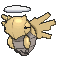

**Location**: Evolve Nincada (Lv. 20)

**Level Up Moves:**

| Moves | Level |     | Cont. | Level |
| ----- | ----- | --- | ----- | ----- |
| Scratch | 1 |   | Shadow Sneak | 21 |
| Harden | 1 |   | Mind Reader | 25 |
| Leech Life | 1 |   | Shadow Ball | 29 |
| Spite | 1 |   | X-Scissor | 33 |
| Sand Attack | 5 |   | Phantom Force | 37 |
| Fury Swipes | 9 |   | Heal Block | 41 |
| Bug Bite | 13 |   | Grudge | 45 |
| Night Slash | 17 |   |   |   |

---

## [#293 Whismur](../../pokemon/whismur.md/)

**Location**: Rusturf Tunnel

**Ability 2**: Rattled

**Level Up Moves:**

| Moves | Level |     | Cont. | Level |
| ----- | ----- | --- | ----- | ----- |
| Pound | 1 |   | Uproar | 22 |
| Echoed Voice | 4 |   | Extrasensory | 25 |
| Astonish | 7 |   | Roar | 28 |
| Howl | 10 |   | Rest | 31 |
| Screech | 13 |   | Sleep Talk | 34 |
| Stomp | 16 |   | Hyper Voice | 37 |
| Supersonic | 19 |   | Synchronoise | 40 |

---

## [#294 Loudred](../../pokemon/loudred.md/)

**Location**: Victory Road

**Ability 2**: Scrappy

**Level Up Moves:**

| Moves | Level |     | Cont. | Level |
| ----- | ----- | --- | ----- | ----- |
| Pound | 1 |   | Uproar | 23 |
| Echoed Voice | 4 |   | Extrasensory | 27 |
| Astonish | 7 |   | Roar | 31 |
| Howl | 10 |   | Rest | 35 |
| Screech | 13 |   | Sleep Talk | 39 |
| Stomp | 16 |   | Hyper Voice | 43 |
| Supersonic | 19 |   | Synchronoise | 47 |
| Bite | 20 |   |   |   |

---

## [#295 Exploud](../../pokemon/exploud.md/)

**Location**: Evolve Loudred (Lv. 40)

**Ability 2**: Scrappy

**Level Up Moves:**

| Moves | Level |     | Cont. | Level |
| ----- | ----- | --- | ----- | ----- |
| Boomburst | 1 |   | Bite | 20 |
| Hammer Arm | 1 |   | Uproar | 23 |
| Ice Fang | 1 |   | Extrasensory | 27 |
| Fire Fang | 1 |   | Roar | 31 |
| Thunder Fang | 1 |   | Rest | 35 |
| Pound | 1 |   | Sleep Talk | 39 |
| Echoed Voice | 4 |   | Crunch | 40 |
| Astonish | 7 |   | Hyper Voice | 44 |
| Howl | 10 |   | Synchronoise | 49 |
| Screech | 13 |   | Boomburst | 54 |
| Stomp | 16 |   | Hyper Beam | 59 |
| Supersonic | 19 |   |   |   |

---

## [#296 Makuhita](../../pokemon/makuhita.md/)

**Location**: Granite Cave

**Level Up Moves:**

| Moves | Level |     | Cont. | Level |
| ----- | ----- | --- | ----- | ----- |
| Tackle | 1 |   | Belly Drum | 25 |
| Focus Energy | 1 |   | Smelling Salts | 28 |
| Sand Attack | 4 |   | Seismic Toss | 31 |
| Arm Thrust | 7 |   | Wake-Up Slap | 34 |
| Fake Out | 10 |   | Endure | 37 |
| Force Palm | 13 |   | Close Combat | 40 |
| Whirlwind | 16 |   | Reversal | 43 |
| Knock Off | 19 |   | Heavy Slam | 46 |
| Vital Throw | 22 |   | Cross Chop | 49 |

---

## [#297 Hariyama](../../pokemon/hariyama.md/)

**Location**: Granite Cave, Victory Road

**Level Up Moves:**

| Moves | Level |     | Cont. | Level |
| ----- | ----- | --- | ----- | ----- |
| Brine | 1 |   | Knock Off | 19 |
| Ice Punch | 1 |   | Vital Throw | 22 |
| Fire Punch | 1 |   | Belly Drum | 26 |
| Thunder Punch | 1 |   | Smelling Salts | 30 |
| Tackle | 1 |   | Seismic Toss | 34 |
| Focus Energy | 1 |   | Wake-Up Slap | 38 |
| Sand Attack | 4 |   | Endure | 42 |
| Arm Thrust | 7 |   | Close Combat | 46 |
| Fake Out | 10 |   | Reversal | 50 |
| Force Palm | 13 |   | Heavy Slam | 54 |
| Whirlwind | 16 |   | Cross Chop | 58 |

---

## [#298 Azurill](../../pokemon/azurill.md/)

**Location**: Route 104 South

**Base Happiness**: 70 >> 200

**Level Up Moves:**

| Moves | Level |     | Cont. | Level |
| ----- | ----- | --- | ----- | ----- |
| Splash | 1 |   | Charm | 10 |
| Water Gun | 1 |   | Bubble Beam | 13 |
| Tail Whip | 2 |   | Helping Hand | 16 |
| Water Sport | 5 |   | Slam | 20 |
| Bubble | 7 |   | Bounce | 23 |

---

## [#299 Nosepass](../../pokemon/nosepass.md/)

**Location**: Granite Cave

**Level Up Moves:**

| Moves | Level |     | Cont. | Level |
| ----- | ----- | --- | ----- | ----- |
| Tackle | 1 |   | Rock Blast | 28 |
| Harden | 4 |   | Discharge | 31 |
| Block | 7 |   | Sandstorm | 34 |
| Rock Throw | 10 |   | Earth Power | 37 |
| Thunder Wave | 13 |   | Stone Edge | 40 |
| Rest | 16 |   | Lock-On | 43 |
| Spark | 19 |   | Zap Cannon | 43 |
| Rock Slide | 22 |   | Head Smash | 46 |
| Power Gem | 25 |   |   |   |

---

## [#300 Skitty](../../pokemon/skitty.md/)

**Location**: Route 116

**Base Stat Changes:**

| Stat | Base | Change |
| ---- | ---- | ------ |
| Sp. Attack | 35 | 45 |
| Sp. Defense | 35 | 45 |
| Total | 260 | 280 |

**Level Up Moves:**

| Moves | Level |     | Cont. | Level |
| ----- | ----- | --- | ----- | ----- |
| Fake Out | 1 |   | Copycat | 21 |
| Growl | 1 |   | Assist | 23 |
| Tail Whip | 1 |   | Charm | 24 |
| Tackle | 1 |   | Hyper Voice | 26 |
| Foresight | 5 |   | Feint Attack | 28 |
| Attract | 7 |   | Wake-Up Slap | 31 |
| Sing | 9 |   | Moonblast | 33 |
| Disarming Voice | 11 |   | Covet | 36 |
| Round | 13 |   | Heal Bell | 39 |
| Double Slap | 15 |   | Double-Edge | 43 |
| Shock Wave | 17 |   | Captivate | 46 |
| Icy Wind | 18 |   | Play Rough | 49 |
| Mud Bomb | 19 |   |   |   |

---

## [#301 Delcatty](../../pokemon/delcatty.md/)

**Location**: Route 116

**Effort Values**: 1 HP, 1 Speed >> 2 Sp. Atk

**Base Stat Changes:**

| Stat | Base | Change |
| ---- | ---- | ------ |
| HP | 70 | 80 |
| Sp. Attack | 55 | 100 |
| Sp. Defense | 55 | 65 |
| Speed | 70 | 80 |
| Total | 380 | 455 |

**Level Up Moves:**

| Moves | Level |     | Cont. | Level |
| ----- | ----- | --- | ----- | ----- |
| Hyper Voice | 1 |   | Fake Out | 1 |
| Moonblast | 1 |   | Sing | 1 |
| Ice Beam | 1 |   | Attract | 1 |
| Thunderbolt | 1 |   | Double Slap | 1 |
| Shadow Ball | 1 |   |   |   |

---

## [#302 Sableye](../../pokemon/sableye.md/)

**Location**: Granite Cave, Cave of Origin

### [Sableye](../../pokemon/sableye.md/)

**Base Stat Changes:**

| Stat | Base | Change |
| ---- | ---- | ------ |
| HP | 50 | 55 |
| Attack | 75 | 80 |
| Defense | 75 | 80 |
| Sp. Attack | 65 | 70 |
| Sp. Defense | 65 | 70 |
| Speed | 50 | 55 |
| Total | 380 | 410 |

### [Mega Forme](../../pokemon/sableye-mega.md/)

**Base Stat Changes:**

| Stat | Base | Change |
| ---- | ---- | ------ |
| HP | 50 | 55 |
| Attack | 85 | 90 |
| Defense | 125 | 130 |
| Sp. Attack | 85 | 90 |
| Sp. Defense | 115 | 120 |
| Speed | 20 | 25 |
| Total | 480 | 510 |
| HP | 50 | 55 |
| Attack | 85 | 90 |
| Defense | 125 | 130 |
| Sp. Attack | 85 | 90 |
| Sp. Defense | 115 | 120 |
| Speed | 20 | 25 |
| Total | 480 | 510 |

**Level Up Moves:**

| Moves | Level |     | Cont. | Level |
| ----- | ----- | --- | ----- | ----- |
| Leer | 1 |   | Recover | 26 |
| Scratch | 1 |   | Shadow Claw | 28 |
| Foresight | 4 |   | Confuse Ray | 29 |
| Night Shade | 6 |   | Zen Headbutt | 32 |
| Astonish | 8 |   | Sucker Punch | 35 |
| Fury Swipes | 11 |   | Power Gem | 36 |
| Detect | 13 |   | Shadow Ball | 39 |
| Shadow Sneak | 14 |   | Foul Play | 41 |
| Feint Attack | 16 |   | Quash | 44 |
| Fake Out | 19 |   | Mean Look | 46 |
| Punishment | 21 |   | Metal Burst | 49 |
| Knock Off | 24 |   |   |   |
| Leer | 1 |   | Recover | 26 |
| Scratch | 1 |   | Shadow Claw | 28 |
| Foresight | 4 |   | Confuse Ray | 29 |
| Night Shade | 6 |   | Zen Headbutt | 32 |
| Astonish | 8 |   | Sucker Punch | 35 |
| Fury Swipes | 11 |   | Power Gem | 36 |
| Detect | 13 |   | Shadow Ball | 39 |
| Shadow Sneak | 14 |   | Foul Play | 41 |
| Feint Attack | 16 |   | Quash | 44 |
| Fake Out | 19 |   | Mean Look | 46 |
| Punishment | 21 |   | Metal Burst | 49 |
| Knock Off | 24 |   |   |   |

---

## [#303 Mawile](../../pokemon/mawile.md/)

**Location**: Granite Cave, Cave of Origin

### [Mawile](../../pokemon/mawile.md/)

**Base Stat Changes:**

| Stat | Base | Change |
| ---- | ---- | ------ |
| HP | 50 | 55 |
| Attack | 85 | 90 |
| Defense | 85 | 90 |
| Sp. Attack | 55 | 60 |
| Sp. Defense | 55 | 60 |
| Speed | 50 | 55 |
| Total | 380 | 410 |

### [Mega Forme](../../pokemon/mawile-mega.md/)

**Base Stat Changes:**

| Stat | Base | Change |
| ---- | ---- | ------ |
| HP | 50 | 55 |
| Attack | 105 | 110 |
| Defense | 125 | 130 |
| Sp. Attack | 55 | 60 |
| Sp. Defense | 95 | 100 |
| Speed | 50 | 55 |
| Total | 480 | 510 |
| HP | 50 | 55 |
| Attack | 105 | 110 |
| Defense | 125 | 130 |
| Sp. Attack | 55 | 60 |
| Sp. Defense | 95 | 100 |
| Speed | 50 | 55 |
| Total | 480 | 510 |

**Level Up Moves:**

| Moves | Level |     | Cont. | Level |
| ----- | ----- | --- | ----- | ----- |
| Taunt | 1 |   | Crunch | 21 |
| Growl | 1 |   | Play Rough | 24 |
| Fairy Wind | 1 |   | Baton Pass | 27 |
| Astonish | 1 |   | Iron Defense | 30 |
| Fake Tears | 6 |   | Iron Head | 33 |
| Sweet Scent | 9 |   | Sucker Punch | 37 |
| Bite | 12 |   | Stockpile | 41 |
| Fire Fang | 15 |   | Swallow | 41 |
| Thunder Fang | 15 |   | Spit Up | 41 |
| Ice Fang | 15 |   | Super Fang | 45 |
| Poison Fang | 15 |   | Metal Burst | 49 |
| Vice Grip | 18 |   |   |   |
| Taunt | 1 |   | Crunch | 21 |
| Growl | 1 |   | Play Rough | 24 |
| Fairy Wind | 1 |   | Baton Pass | 27 |
| Astonish | 1 |   | Iron Defense | 30 |
| Fake Tears | 6 |   | Iron Head | 33 |
| Sweet Scent | 9 |   | Sucker Punch | 37 |
| Bite | 12 |   | Stockpile | 41 |
| Fire Fang | 15 |   | Swallow | 41 |
| Thunder Fang | 15 |   | Spit Up | 41 |
| Ice Fang | 15 |   | Super Fang | 45 |
| Poison Fang | 15 |   | Metal Burst | 49 |
| Vice Grip | 18 |   |   |   |

---

## [#304 Aron](../../pokemon/aron.md/)

**Location**: Granite Cave, Scorched Slab

**Level Up Moves:**

| Moves | Level |     | Cont. | Level |
| ----- | ----- | --- | ----- | ----- |
| Tackle | 1 |   | Rock Slide | 25 |
| Harden | 1 |   | Take Down | 28 |
| Mud-Slap | 4 |   | Metal Sound | 31 |
| Headbutt | 7 |   | Iron Tail | 34 |
| Metal Claw | 10 |   | Iron Defense | 37 |
| Rock Tomb | 13 |   | Double-Edge | 40 |
| Protect | 16 |   | Autotomize | 43 |
| Roar | 19 |   | Heavy Slam | 46 |
| Iron Head | 22 |   | Metal Burst | 49 |

---

## [#305 Lairon](../../pokemon/lairon.md/)

**Location**: Granite Cave, Scorched Slab, Cave of Origin, Victory Road

**Level Up Moves:**

| Moves | Level |     | Cont. | Level |
| ----- | ----- | --- | ----- | ----- |
| Tackle | 1 |   | Iron Head | 22 |
| Harden | 1 |   | Rock Slide | 25 |
| Mud-Slap | 1 |   | Take Down | 28 |
| Headbutt | 1 |   | Metal Sound | 31 |
| Mud-Slap | 4 |   | Iron Tail | 35 |
| Headbutt | 7 |   | Iron Defense | 39 |
| Metal Claw | 10 |   | Double-Edge | 43 |
| Rock Tomb | 13 |   | Autotomize | 47 |
| Protect | 16 |   | Heavy Slam | 51 |
| Roar | 19 |   | Metal Burst | 55 |

---

## [#306 Aggron](../../pokemon/aggron.md/)

**Location**: Evolve Lairon (Lv. 42)

**Level Up Moves:**

| Moves | Level |     | Cont. | Level |
| ----- | ----- | --- | ----- | ----- |
| Avalanche | 1 |   | Rock Slide | 25 |
| Superpower | 1 |   | Take Down | 28 |
| Tackle | 1 |   | Metal Sound | 31 |
| Harden | 1 |   | Iron Tail | 35 |
| Mud-Slap | 4 |   | Iron Defense | 39 |
| Headbutt | 7 |   | Dragon Rush | 42 |
| Metal Claw | 10 |   | Double-Edge | 45 |
| Rock Tomb | 13 |   | Autotomize | 51 |
| Protect | 16 |   | Heavy Slam | 57 |
| Roar | 19 |   | Metal Burst | 63 |
| Iron Head | 22 |   | Head Smash | 69 |

---

## [#307 Meditite](../../pokemon/meditite.md/)

**Location**: Jagged Pass, Mt. Pyre

**Evolution Level**: 37 >> 35

**Level Up Moves:**

| Moves | Level |     | Cont. | Level |
| ----- | ----- | --- | ----- | ----- |
| Bide | 1 |   | Mind Reader | 26 |
| Meditate | 4 |   | High Jump Kick | 28 |
| Confusion | 7 |   | Psych Up | 31 |
| Detect | 9 |   | Acupressure | 33 |
| Endure | 12 |   | Zen Headbutt | 35 |
| Feint | 15 |   | Power Trick | 37 |
| Force Palm | 17 |   | Reversal | 39 |
| Hidden Power | 20 |   | Recover | 41 |
| Calm Mind | 22 |   | Counter | 44 |
| Psycho Cut | 24 |   |   |   |

---

## [#308 Medicham](../../pokemon/medicham.md/)

**Location**: Mt. Pyre, Victory Road

**Level Up Moves:**

| Moves | Level |     | Cont. | Level |
| ----- | ----- | --- | ----- | ----- |
| Fire Punch | 1 |   | Psycho Cut | 24 |
| Thunder Punch | 1 |   | Mind Reader | 26 |
| Ice Punch | 1 |   | High Jump Kick | 28 |
| Bide | 1 |   | Psych Up | 31 |
| Meditate | 4 |   | Acupressure | 33 |
| Confusion | 7 |   | Fake Out | 35 |
| Detect | 9 |   | Zen Headbutt | 37 |
| Endure | 12 |   | Power Trick | 42 |
| Feint | 15 |   | Reversal | 47 |
| Force Palm | 17 |   | Recover | 53 |
| Hidden Power | 20 |   | Counter | 59 |
| Calm Mind | 22 |   |   |   |

---

## [#309 Electrike](../../pokemon/electrike.md/)

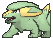

**Location**: Route 110

**Level Up Moves:**

| Moves | Level |     | Cont. | Level |
| ----- | ----- | --- | ----- | ----- |
| Tackle | 1 |   | Thunder Fang | 21 |
| Thunder Wave | 1 |   | Bite | 24 |
| Leer | 4 |   | Discharge | 28 |
| Howl | 7 |   | Roar | 33 |
| Quick Attack | 10 |   | Thunderbolt | 37 |
| Spark | 13 |   | Wild Charge | 41 |
| Odor Sleuth | 15 |   | Charge | 45 |
| Electro Ball | 18 |   | Thunder | 49 |

---

## [#310 Manectric](../../pokemon/manectric.md/)

**Location**: Route 118

**Level Up Moves:**

| Moves | Level |     | Cont. | Level |
| ----- | ----- | --- | ----- | ----- |
| Electric Terrain | 1 |   | Electro Ball | 18 |
| Fire Fang | 1 |   | Thunder Fang | 21 |
| Tackle | 1 |   | Bite | 24 |
| Thunder Wave | 1 |   | Flame Burst | 26 |
| Leer | 1 |   | Discharge | 29 |
| Howl | 1 |   | Roar | 34 |
| Leer | 4 |   | Thunderbolt | 39 |
| Howl | 7 |   | Wild Charge | 43 |
| Quick Attack | 10 |   | Charge | 48 |
| Spark | 13 |   | Thunder | 54 |
| Odor Sleuth | 15 |   | Electric Terrain | 60 |

---

## [#311 Plusle](../../pokemon/plusle.md/)

**Location**: Route 110

**Ability 2**: Victory Star **

**Base Stat Changes:**

| Stat | Base | Change |
| ---- | ---- | ------ |
| HP | 60 | 70 |
| Attack | 50 | 60 |
| Defense | 40 | 50 |
| Sp. Attack | 85 | 95 |
| Sp. Defense | 75 | 85 |
| Speed | 95 | 105 |
| Total | 405 | 465 |

**Level Up Moves:**

| Moves | Level |     | Cont. | Level |
| ----- | ----- | --- | ----- | ----- |
| Nuzzle | 1 |   | Copycat | 22 |
| Play Nice | 1 |   | Charm | 25 |
| Growl | 1 |   | Charge | 28 |
| Thunder Wave | 1 |   | Discharge | 31 |
| Quick Attack | 1 |   | Baton Pass | 34 |
| Helping Hand | 4 |   | Agility | 37 |
| Spark | 7 |   | Last Resort | 40 |
| Encore | 10 |   | Thunder | 43 |
| Bestow | 13 |   | Nasty Plot | 46 |
| Swift | 16 |   | Entrainment | 49 |
| Electro Ball | 19 |   |   |   |

---

## [#312 Minun](../../pokemon/minun.md/)

**Location**: Route 110

**Ability 2**: Victory Star **

**Base Stat Changes:**

| Stat | Base | Change |
| ---- | ---- | ------ |
| HP | 60 | 70 |
| Attack | 40 | 50 |
| Defense | 50 | 60 |
| Sp. Attack | 75 | 85 |
| Sp. Defense | 85 | 95 |
| Speed | 95 | 105 |
| Total | 405 | 465 |

**Level Up Moves:**

| Moves | Level |     | Cont. | Level |
| ----- | ----- | --- | ----- | ----- |
| Nuzzle | 1 |   | Copycat | 22 |
| Play Nice | 1 |   | Fake Tears | 25 |
| Growl | 1 |   | Charge | 28 |
| Thunder Wave | 1 |   | Discharge | 31 |
| Quick Attack | 1 |   | Baton Pass | 34 |
| Helping Hand | 4 |   | Agility | 37 |
| Spark | 7 |   | Trump Card | 40 |
| Encore | 10 |   | Thunder | 43 |
| Switcheroo | 13 |   | Nasty Plot | 46 |
| Swift | 16 |   | Entrainment | 49 |
| Electro Ball | 19 |   |   |   |

---

## [#313 Volbeat](../../pokemon/volbeat.md/)

**Location**: Route 117

**Effort Values**: 1 Speed >> 1 Attack

**New TM/HMs**: Wild Charge

**Type**:  >>  

**Base Stat Changes:**

| Stat | Base | Change |
| ---- | ---- | ------ |
| Attack | 73 | 105 |
| Defense | 55 | 60 |
| Sp. Attack | 47 | 45 |
| Sp. Defense | 75 | 80 |
| Speed | 85 | 95 |
| Total | 400 | 450 |

**Level Up Moves:**

| Moves | Level |     | Cont. | Level |
| ----- | ----- | --- | ----- | ----- |
| Wild Charge | 1 |   | Thunder Punch | 23 |
| Acrobatics | 1 |   | Signal Beam | 26 |
| Brick Break | 1 |   | Thunder Wave | 29 |
| U-turn | 1 |   | Zen Headbutt | 32 |
| Flash | 1 |   | Tail Glow | 35 |
| Tackle | 1 |   | Bug Buzz | 38 |
| Double Team | 5 |   | Protect | 41 |
| Confuse Ray | 8 |   | Helping Hand | 44 |
| Quick Attack | 11 |   | Moonblast | 47 |
| Bug Bite | 14 |   | Double-Edge | 50 |
| Moonlight | 17 |   | Wild Charge | 53 |
| Play Rough | 20 |   |   |   |

---

## [#314 Illumise](../../pokemon/illumise.md/)

**Location**: Route 117

**Effort Values**: 1 Speed >> 1 Sp. Atk

**Type**:  >>  

**Base Stat Changes:**

| Stat | Base | Change |
| ---- | ---- | ------ |
| Attack | 47 | 45 |
| Defense | 55 | 60 |
| Sp. Attack | 73 | 105 |
| Sp. Defense | 75 | 80 |
| Speed | 85 | 95 |
| Total | 400 | 450 |

**Level Up Moves:**

| Moves | Level |     | Cont. | Level |
| ----- | ----- | --- | ----- | ----- |
| Thunder | 1 |   | Thunderbolt | 23 |
| Giga Drain | 1 |   | Signal Beam | 26 |
| Shadow Ball | 1 |   | Thunder Wave | 29 |
| U-turn | 1 |   | Zen Headbutt | 32 |
| Play Nice | 1 |   | Wish | 35 |
| Tackle | 1 |   | Bug Buzz | 38 |
| Sweet Scent | 5 |   | Encore | 41 |
| Charm | 8 |   | Helping Hand | 44 |
| Quick Attack | 11 |   | Play Rough | 47 |
| Struggle Bug | 14 |   | Covet | 50 |
| Moonlight | 17 |   | Thunder | 53 |
| Moonblast | 20 |   |   |   |

---

## [#315 Roselia](../../pokemon/roselia.md/)

**Location**: Route 117

**Level Up Moves:**

| Moves | Level |     | Cont. | Level |
| ----- | ----- | --- | ----- | ----- |
| Absorb | 1 |   | Extrasensory | 31 |
| Growth | 4 |   | Toxic Spikes | 34 |
| Poison Sting | 7 |   | Petal Dance | 37 |
| Stun Spore | 10 |   | Sweet Scent | 40 |
| Mega Drain | 13 |   | Sleep Powder | 43 |
| Leech Seed | 16 |   | Ingrain | 46 |
| Magical Leaf | 19 |   | Toxic | 49 |
| Venoshock | 22 |   | Aromatherapy | 52 |
| Giga Drain | 25 |   | Synthesis | 55 |
| Grass Whistle | 28 |   | Petal Blizzard | 59 |

---

## [#316 Gulpin](../../pokemon/gulpin.md/)

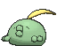

**Location**: Route 110

**Level Up Moves:**

| Moves | Level |     | Cont. | Level |
| ----- | ----- | --- | ----- | ----- |
| Pound | 1 |   | Spit Up | 24 |
| Yawn | 1 |   | Swallow | 24 |
| Poison Gas | 6 |   | Sludge Bomb | 27 |
| Sludge | 9 |   | Gastro Acid | 30 |
| Amnesia | 12 |   | Sludge Wave | 34 |
| Acid Spray | 14 |   | Belch | 38 |
| Encore | 16 |   | Wring Out | 41 |
| Venoshock | 18 |   | Seed Bomb | 44 |
| Toxic | 21 |   | Gunk Shot | 48 |
| Stockpile | 24 |   |   |   |

---

## [#317 Swalot](../../pokemon/swalot.md/)

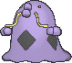

**Location**: Safari Zone

**Level Up Moves:**

| Moves | Level |     | Cont. | Level |
| ----- | ----- | --- | ----- | ----- |
| Gunk Shot | 1 |   | Stockpile | 24 |
| Wring Out | 1 |   | Spit Up | 24 |
| Pound | 1 |   | Swallow | 24 |
| Yawn | 1 |   | Body Slam | 26 |
| Poison Gas | 6 |   | Sludge Bomb | 29 |
| Sludge | 9 |   | Gastro Acid | 33 |
| Amnesia | 12 |   | Sludge Wave | 37 |
| Acid Spray | 14 |   | Belch | 41 |
| Encore | 16 |   | Wring Out | 45 |
| Venoshock | 18 |   | Seed Bomb | 50 |
| Toxic | 21 |   | Gunk Shot | 55 |

---

## [#318 Carvanha](../../pokemon/carvanha.md/)

**Location**: Route 118, Mossdeep City

**Ability 2**: Speed Boost

**Level Up Moves:**

| Moves | Level |     | Cont. | Level |
| ----- | ----- | --- | ----- | ----- |
| Leer | 1 |   | Poison Fang | 25 |
| Bite | 1 |   | Waterfall | 28 |
| Rage | 4 |   | Scary Face | 31 |
| Focus Energy | 7 |   | Crunch | 34 |
| Aqua Jet | 10 |   | Thrash | 37 |
| Assurance | 13 |   | Agility | 40 |
| Screech | 16 |   | Take Down | 43 |
| Swagger | 19 |   | Hydro Pump | 46 |
| Ice Fang | 22 |   |   |   |

---

## [#319 Sharpedo](../../pokemon/sharpedo.md/)

**Location**: Route 118, Mossdeep City

**Ability 2**: Speed Boost

**Level Up Moves:**

| Moves | Level |     | Cont. | Level |
| ----- | ----- | --- | ----- | ----- |
| Night Slash | 1 |   | Poison Fang | 25 |
| Zen Headbutt | 1 |   | Waterfall | 28 |
| Feint | 1 |   | Slash | 30 |
| Leer | 1 |   | Scary Face | 32 |
| Bite | 1 |   | Crunch | 36 |
| Rage | 4 |   | Thrash | 40 |
| Focus Energy | 7 |   | Agility | 44 |
| Aqua Jet | 10 |   | Skull Bash | 48 |
| Assurance | 13 |   | Hydro Pump | 52 |
| Screech | 16 |   | Taunt | 56 |
| Swagger | 19 |   | Night Slash | 60 |
| Ice Fang | 22 |   |   |   |

---

## [#320 Wailmer](../../pokemon/wailmer.md/)

**Location**: Slateport City, Sea Mauville, Magma Hideout, Aqua Hideout, Route 129

**Evolution Level**: 40 >> 37

**Level Up Moves:**

| Moves | Level |     | Cont. | Level |
| ----- | ----- | --- | ----- | ----- |
| Splash | 1 |   | Body Slam | 31 |
| Growl | 4 |   | Dive | 34 |
| Water Gun | 7 |   | Zen Headbutt | 37 |
| Rollout | 10 |   | Amnesia | 40 |
| Whirlpool | 13 |   | Water Spout | 43 |
| Astonish | 16 |   | Bounce | 46 |
| Water Pulse | 19 |   | Hydro Pump | 49 |
| Mist | 22 |   | Double-Edge | 52 |
| Brine | 25 |   | Fissure | 55 |
| Rest | 28 |   | Heavy Slam | 58 |

---

## [#321 Wailord](../../pokemon/wailord.md/)

**Location**: Route 129

**Level Up Moves:**

| Moves | Level |     | Cont. | Level |
| ----- | ----- | --- | ----- | ----- |
| Heavy Slam | 1 |   | Body Slam | 31 |
| Splash | 1 |   | Dive | 34 |
| Growl | 4 |   | Hyper Voice | 37 |
| Water Gun | 7 |   | Zen Headbutt | 38 |
| Rollout | 10 |   | Amnesia | 42 |
| Whirlpool | 13 |   | Water Spout | 46 |
| Astonish | 16 |   | Bounce | 50 |
| Water Pulse | 19 |   | Hydro Pump | 54 |
| Mist | 22 |   | Double-Edge | 58 |
| Brine | 25 |   | Fissure | 62 |
| Rest | 28 |   | Heavy Slam | 66 |

---

## [#322 Numel](../../pokemon/numel.md/)

**Location**: Fiery Path

**Level Up Moves:**

| Moves | Level |     | Cont. | Level |
| ----- | ----- | --- | ----- | ----- |
| Growl | 1 |   | Earth Power | 26 |
| Tackle | 1 |   | Curse | 29 |
| Ember | 5 |   | Take Down | 31 |
| Focus Energy | 8 |   | Yawn | 36 |
| Magnitude | 12 |   | Earthquake | 40 |
| Flame Burst | 15 |   | Flamethrower | 43 |
| Amnesia | 19 |   | Double-Edge | 47 |
| Lava Plume | 22 |   |   |   |

---

## [#323 Camerupt](../../pokemon/camerupt.md/)

**Location**: Safari Zone

**Level Up Moves:**

| Moves | Level |     | Cont. | Level |
| ----- | ----- | --- | ----- | ----- |
| Fissure | 1 |   | Amnesia | 19 |
| Eruption | 1 |   | Lava Plume | 22 |
| Growl | 1 |   | Earth Power | 26 |
| Tackle | 1 |   | Curse | 29 |
| Ember | 1 |   | Take Down | 31 |
| Focus Energy | 1 |   | Rock Slide | 33 |
| Ember | 5 |   | Yawn | 39 |
| Focus Energy | 8 |   | Earthquake | 46 |
| Magnitude | 12 |   | Flamethrower | 52 |
| Flame Burst | 15 |   | Double-Edge | 59 |

---

## [#324 Torkoal](../../pokemon/torkoal.md/)

**Location**: Fiery Path

**Ability 2**: Shell Armor

**Level Up Moves:**

| Moves | Level |     | Cont. | Level |
| ----- | ----- | --- | ----- | ----- |
| Ember | 1 |   | Flamethrower | 34 |
| Smog | 4 |   | Iron Defense | 38 |
| Withdraw | 7 |   | Earth Power | 40 |
| Rapid Spin | 10 |   | Amnesia | 42 |
| Fire Spin | 13 |   | Flail | 45 |
| Smokescreen | 15 |   | Heat Wave | 47 |
| Flame Wheel | 18 |   | Shell Smash | 50 |
| Curse | 22 |   | Inferno | 53 |
| Lava Plume | 25 |   | Superpower | 57 |
| Body Slam | 27 |   | Eruption | 60 |
| Protect | 30 |   |   |   |

---

## [#325 Spoink](../../pokemon/spoink.md/)

**Location**: Jagged Pass

**Level Up Moves:**

| Moves | Level |     | Cont. | Level |
| ----- | ----- | --- | ----- | ----- |
| Splash | 1 |   | Psyshock | 26 |
| Psywave | 5 |   | Rest | 29 |
| Odor Sleuth | 8 |   | Snore | 32 |
| Psybeam | 11 |   | Zen Headbutt | 35 |
| Psych Up | 14 |   | Payback | 38 |
| Confuse Ray | 17 |   | Psychic | 41 |
| Magic Coat | 20 |   | Bounce | 44 |
| Power Gem | 23 |   |   |   |

---

## [#326 Grumpig](../../pokemon/grumpig.md/)

**Location**: Jagged Pass, Safari Zone

**Level Up Moves:**

| Moves | Level |     | Cont. | Level |
| ----- | ----- | --- | ----- | ----- |
| Splash | 1 |   | Psyshock | 26 |
| Psywave | 5 |   | Rest | 29 |
| Odor Sleuth | 8 |   | Teeter Dance | 32 |
| Psybeam | 11 |   | Snore | 34 |
| Psych Up | 14 |   | Zen Headbutt | 38 |
| Confuse Ray | 17 |   | Payback | 42 |
| Magic Coat | 20 |   | Psychic | 46 |
| Power Gem | 23 |   | Bounce | 50 |

---

## [#327 Spinda](../../pokemon/spinda.md/)

**Location**: Route 113

**Base Stat Changes:**

| Stat | Base | Change |
| ---- | ---- | ------ |
| HP | 60 | 80 |
| Attack | 60 | 80 |
| Defense | 60 | 80 |
| Sp. Attack | 60 | 80 |
| Sp. Defense | 60 | 80 |
| Speed | 60 | 80 |
| Total | 360 | 480 |

**Level Up Moves:**

| Moves | Level |     | Cont. | Level |
| ----- | ----- | --- | ----- | ----- |
| Tackle | 1 |   | Uproar | 28 |
| Copycat | 4 |   | Fake Out | 31 |
| Feint Attack | 7 |   | Psycho Cut | 34 |
| Psybeam | 10 |   | Double-Edge | 37 |
| Hypnosis | 13 |   | Shadow Ball | 40 |
| Dizzy Punch | 16 |   | Flail | 43 |
| Sucker Punch | 19 |   | Thrash | 46 |
| Teeter Dance | 22 |   | Superpower | 49 |
| Assist | 25 |   | Psycho Boost | 52 |

---

## [#328 Trapinch](../../pokemon/trapinch.md/)

**Location**: Route 111

**Held Item**: Jaw Fossil (50%), Soft Sand (5%)

**Level Up Moves:**

| Moves | Level |     | Cont. | Level |
| ----- | ----- | --- | ----- | ----- |
| Sand Attack | 1 |   | Crunch | 22 |
| Bite | 1 |   | Earth Power | 26 |
| Feint Attack | 1 |   | Feint | 29 |
| Bide | 1 |   | Earthquake | 33 |
| Mud-Slap | 5 |   | Sandstorm | 36 |
| Bulldoze | 8 |   | Superpower | 40 |
| Sand Tomb | 12 |   | Hyper Beam | 43 |
| Rock Slide | 15 |   | Fissure | 47 |
| Dig | 19 |   |   |   |

---

## [#329 Vibrava](../../pokemon/vibrava.md/)

**Location**: Route 111

**Level Up Moves:**

| Moves | Level |     | Cont. | Level |
| ----- | ----- | --- | ----- | ----- |
| Sand Attack | 1 |   | Screech | 22 |
| Sonic Boom | 1 |   | Earth Power | 26 |
| Feint Attack | 1 |   | Bug Buzz | 29 |
| Bide | 1 |   | Earthquake | 33 |
| Mud-Slap | 5 |   | Dragon Breath | 35 |
| Bulldoze | 8 |   | Sandstorm | 36 |
| Sand Tomb | 12 |   | Uproar | 40 |
| Rock Slide | 15 |   | Hyper Beam | 43 |
| Supersonic | 19 |   | Boomburst | 47 |

---

## [#330 Flygon](../../pokemon/flygon.md/)

**Location**: Evolve Vibrava (Lv. 45)

**Base Stat Changes:**

| Stat | Base | Change |
| ---- | ---- | ------ |
| Attack | 100 | 110 |
| Sp. Attack | 80 | 90 |
| Speed | 100 | 110 |
| Total | 520 | 550 |

**Level Up Moves:**

| Moves | Level |     | Cont. | Level |
| ----- | ----- | --- | ----- | ----- |
| Sand Attack | 1 |   | Earth Power | 26 |
| Sonic Boom | 1 |   | Dragon Tail | 29 |
| Feint Attack | 1 |   | Earthquake | 33 |
| Bide | 1 |   | Dragon Breath | 35 |
| Mud-Slap | 5 |   | Sandstorm | 36 |
| Bulldoze | 8 |   | Uproar | 40 |
| Sand Tomb | 12 |   | Hyper Beam | 43 |
| Rock Slide | 15 |   | Dragon Claw | 45 |
| Supersonic | 19 |   | Dragon Rush | 47 |
| Screech | 22 |   | Quiver Dance | 51 |

---

## [#331 Cacnea](../../pokemon/cacnea.md/)

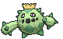

**Location**: Route 111

**Ability 2**: Water Absorb

**Held Item**: Root Fossil (50%), Sticky Barb (5%)

**Level Up Moves:**

| Moves | Level |     | Cont. | Level |
| ----- | ----- | --- | ----- | ----- |
| Poison Sting | 1 |   | Spikes | 28 |
| Leer | 1 |   | Seed Bomb | 31 |
| Absorb | 4 |   | Poison Jab | 34 |
| Growth | 7 |   | Sucker Punch | 37 |
| Leech Seed | 10 |   | Pin Missile | 40 |
| Sand Attack | 13 |   | Energy Ball | 43 |
| Ingrain | 16 |   | Cotton Spore | 46 |
| Feint Attack | 19 |   | Sandstorm | 49 |
| Needle Arm | 22 |   | Destiny Bond | 52 |
| Payback | 25 |   | Fell Stinger | 55 |

---

## [#332 Cacturne](../../pokemon/cacturne.md/)

**Location**: Evolve Cacnea (Lv. 32)

**Ability 2**: Water Absorb

**Level Up Moves:**

| Moves | Level |     | Cont. | Level |
| ----- | ----- | --- | ----- | ----- |
| Fell Stinger | 1 |   | Payback | 25 |
| Destiny Bond | 1 |   | Spikes | 28 |
| Revenge | 1 |   | Seed Bomb | 31 |
| Thunder Punch | 1 |   | Spiky Shield | 32 |
| Poison Sting | 1 |   | Poison Jab | 35 |
| Leer | 1 |   | Sucker Punch | 39 |
| Absorb | 4 |   | Pin Missile | 43 |
| Growth | 7 |   | Energy Ball | 47 |
| Leech Seed | 10 |   | Cotton Spore | 51 |
| Sand Attack | 13 |   | Sandstorm | 55 |
| Ingrain | 16 |   | Destiny Bond | 59 |
| Feint Attack | 19 |   | Fell Stinger | 63 |
| Needle Arm | 22 |   |   |   |

---

## [#333 Swablu](../../pokemon/swablu.md/)

**Location**: Route 114, Mt. Pyre

**Ability 2**: Cloud Nine

**Evolution Level**: 35 >> 33

**Level Up Moves:**

| Moves | Level |     | Cont. | Level |
| ----- | ----- | --- | ----- | ----- |
| Peck | 1 |   | Take Down | 21 |
| Growl | 1 |   | Pluck | 24 |
| Astonish | 3 |   | Cotton Guard | 27 |
| Sing | 5 |   | Mirror Move | 30 |
| Fury Attack | 7 |   | Refresh | 33 |
| Safeguard | 9 |   | Dragon Pulse | 36 |
| Disarming Voice | 11 |   | Moonblast | 39 |
| Mist | 13 |   | Hyper Voice | 42 |
| Round | 15 |   | Perish Song | 45 |
| Natural Gift | 18 |   | Double-Edge | 48 |

---

## [#334 Altaria](../../pokemon/altaria.md/)

**Location**: Route 120, Sky Pillar

**Ability 2**: Cloud Nine

**Level Up Moves:**

| Moves | Level |     | Cont. | Level |
| ----- | ----- | --- | ----- | ----- |
| Sky Attack | 1 |   | Pluck | 24 |
| Outrage | 1 |   | Cotton Guard | 27 |
| Peck | 1 |   | Dragon Dance | 30 |
| Growl | 1 |   | Dragon Breath | 33 |
| Astonish | 3 |   | Refresh | 34 |
| Sing | 5 |   | Dragon Pulse | 38 |
| Fury Attack | 7 |   | Moonblast | 42 |
| Safeguard | 9 |   | Hyper Voice | 46 |
| Disarming Voice | 11 |   | Perish Song | 50 |
| Mist | 13 |   | Double-Edge | 54 |
| Round | 15 |   | Outrage | 58 |
| Natural Gift | 18 |   | Sky Attack | 62 |
| Take Down | 21 |   |   |   |

---

## [#335 Zangoose](../../pokemon/zangoose.md/)

**Location**: Route 114

**Ability 2**: Toxic Boost

**Level Up Moves:**

| Moves | Level |     | Cont. | Level |
| ----- | ----- | --- | ----- | ----- |
| Close Combat | 1 |   | Slash | 17 |
| Swords Dance | 1 |   | Revenge | 20 |
| Ice Punch | 1 |   | Crush Claw | 23 |
| Fire Punch | 1 |   | Night Slash | 26 |
| Thunder Punch | 1 |   | False Swipe | 29 |
| Scratch | 1 |   | Embargo | 32 |
| Leer | 1 |   | Detect | 35 |
| Quick Attack | 5 |   | X-Scissor | 39 |
| Fury Cutter | 8 |   | Taunt | 43 |
| Pursuit | 11 |   | Swords Dance | 47 |
| Hone Claws | 14 |   | Close Combat | 50 |

---

## [#336 Seviper](../../pokemon/seviper.md/)

**Location**: Route 114

**Ability 2**: Infiltrator

**Level Up Moves:**

| Moves | Level |     | Cont. | Level |
| ----- | ----- | --- | ----- | ----- |
| Wrap | 1 |   | Night Slash | 28 |
| SWagger | 1 |   | Gastro Acid | 31 |
| Bite | 4 |   | Poison Jab | 34 |
| Lick | 7 |   | Haze | 37 |
| Poison Tail | 10 |   | Crunch | 40 |
| Screech | 13 |   | Belch | 43 |
| Venoshock | 16 |   | Coil | 46 |
| Glare | 19 |   | Wring Out | 49 |
| Poison Fang | 22 |   | Gunk Shot | 52 |
| Venom Drench | 25 |   |   |   |

---

## [#337 Lunatone](../../pokemon/lunatone.md/)

**Location**: Meteor Falls

**Base Stat Changes:**

| Stat | Base | Change |
| ---- | ---- | ------ |
| HP | 70 | 80 |
| Defense | 65 | 80 |
| Sp. Attack | 95 | 110 |
| Sp. Defense | 85 | 100 |
| Total | 440 | 495 |

**Level Up Moves:**

| Moves | Level |     | Cont. | Level |
| ----- | ----- | --- | ----- | ----- |
| Tackle | 1 |   | Moonblast | 27 |
| Harden | 1 |   | Psychic | 30 |
| Confusion | 1 |   | Heal Block | 33 |
| Rock Throw | 1 |   | Power Gem | 36 |
| Hypnosis | 6 |   | Future Sight | 39 |
| Rock Polish | 9 |   | Ice Beam | 42 |
| Psywave | 12 |   | Earth Power | 45 |
| Embargo | 15 |   | Explosion | 48 |
| Ancient Power | 18 |   | Blizzard | 51 |
| Psyshock | 21 |   | Magic Room | 54 |
| Icy Wind | 24 |   | Moonlight | 57 |

---

## [#338 Solrock](../../pokemon/solrock.md/)

**Location**: Meteor Falls

**Base Stat Changes:**

| Stat | Base | Change |
| ---- | ---- | ------ |
| HP | 70 | 80 |
| Attack | 95 | 110 |
| Defense | 85 | 100 |
| Sp. Defense | 65 | 80 |
| Total | 440 | 495 |

**Level Up Moves:**

| Moves | Level |     | Cont. | Level |
| ----- | ----- | --- | ----- | ----- |
| Tackle | 1 |   | Overheat | 27 |
| Harden | 1 |   | Psychic | 30 |
| Confusion | 1 |   | Heal Block | 33 |
| Rock Throw | 1 |   | Stone Edge | 36 |
| Fire Spin | 6 |   | Solar Beam | 39 |
| Rock Polish | 9 |   | Heat Crash | 42 |
| Psywave | 12 |   | Earthquake | 45 |
| Embargo | 15 |   | Explosion | 48 |
| Rock Slide | 18 |   | Flare Blitz | 51 |
| Zen Headbutt | 21 |   | Wonder Room | 54 |
| Will-O-Wisp | 24 |   | Morning Sun | 57 |

---

## [#339 Barboach](../../pokemon/barboach.md/)

**Location**: Route 111, Route 120, Scorched Slab, Safari Zone

**Level Up Moves:**

| Moves | Level |     | Cont. | Level |
| ----- | ----- | --- | ----- | ----- |
| Mud-Slap | 1 |   | Rest | 27 |
| Mud Sport | 1 |   | Snore | 27 |
| Water Sport | 1 |   | Earthquake | 30 |
| Water Gun | 6 |   | Thrash | 33 |
| Mud Bomb | 9 |   | Muddy Water | 36 |
| Amnesia | 12 |   | Dragon Dance | 39 |
| Water Pulse | 15 |   | Future Sight | 42 |
| Magnitude | 18 |   | Earth Power | 45 |
| Spark | 21 |   | Fissure | 48 |
| Aqua Tail | 24 |   | Hydro Pump | 51 |

---

## [#340 Whiscash](../../pokemon/whiscash.md/)

**Location**: Route 111, Route 120, Scorched Slab, Safari Zone

**Level Up Moves:**

| Moves | Level |     | Cont. | Level |
| ----- | ----- | --- | ----- | ----- |
| Mud-Slap | 1 |   | Snore | 27 |
| Mud Sport | 1 |   | Zen Headbutt | 30 |
| Water Sport | 1 |   | Earthquake | 31 |
| Water Gun | 6 |   | Thrash | 35 |
| Mud Bomb | 9 |   | Muddy Water | 39 |
| Amnesia | 12 |   | Dragon Dance | 43 |
| Water Pulse | 15 |   | Future Sight | 47 |
| Magnitude | 18 |   | Earth Power | 51 |
| Spark | 21 |   | Fissure | 55 |
| Aqua Tail | 24 |   | Hydro Pump | 59 |
| Rest | 27 |   |   |   |

---

## [#341 Corphish](../../pokemon/corphish.md/)

**Location**: Route 102, Route 123

**Level Up Moves:**

| Moves | Level |     | Cont. | Level |
| ----- | ----- | --- | ----- | ----- |
| Bubble | 1 |   | Knock Off | 25 |
| Harden | 1 |   | Double Hit | 28 |
| Vice Grip | 4 |   | Night Slash | 31 |
| Aqua Jet | 7 |   | Taunt | 34 |
| Leer | 10 |   | Crunch | 37 |
| Bubble Beam | 13 |   | Swords Dance | 40 |
| Razor Shell | 16 |   | Superpower | 43 |
| Protect | 19 |   | Guillotine | 46 |
| Crabhammer | 22 |   | Dragon Dance | 49 |

---

## [#342 Crawdaunt](../../pokemon/crawdaunt.md/)

 its shell regularly. Immediately after molting, its shell is soft and tender. Until the shell hardens, this Pokémon hides in its streambed burrow to avoid attack from its foes.")

**Location**: Route 102, Route 123

**Level Up Moves:**

| Moves | Level |     | Cont. | Level |
| ----- | ----- | --- | ----- | ----- |
| Superpower | 1 |   | Knock Off | 25 |
| Avalanche | 1 |   | Double Hit | 28 |
| Bubble | 1 |   | Swift | 30 |
| Harden | 1 |   | Night Slash | 32 |
| Vice Grip | 4 |   | Taunt | 36 |
| Aqua Jet | 7 |   | Crunch | 40 |
| Leer | 10 |   | Swords Dance | 44 |
| Bubble Beam | 13 |   | Superpower | 48 |
| Razor Shell | 16 |   | Guillotine | 52 |
| Protect | 19 |   | Dragon Dance | 56 |
| Crabhammer | 22 |   |   |   |

---

## [#343 Baltoy](../../pokemon/baltoy.md/)

**Location**: Route 111

**Held Item**: Helix Fossil (50%), Light Clay (5%)

**Level Up Moves:**

| Moves | Level |     | Cont. | Level |
| ----- | ----- | --- | ----- | ----- |
| Harden | 1 |   | Extrasensory | 28 |
| Confusion | 1 |   | Earth Power | 31 |
| Rapid Spin | 4 |   | Guard Split | 34 |
| Mud-Slap | 7 |   | Power Split | 34 |
| Heal Block | 10 |   | Self-Destruct | 37 |
| Rock Tomb | 13 |   | Psychic | 40 |
| Psybeam | 16 |   | Sandstorm | 43 |
| Ancient Power | 19 |   | Trick Room | 46 |
| Cosmic Power | 22 |   | Imprison | 49 |
| Power Trick | 25 |   | Explosion | 52 |

---

## [#344 Claydol](../../pokemon/claydol.md/)

**Location**: Sky Pillar

**New TM/HMs**: Fly

**Level Up Moves:**

| Moves | Level |     | Cont. | Level |
| ----- | ----- | --- | ----- | ----- |
| Teleport | 1 |   | Extrasensory | 28 |
| Harden | 1 |   | Earth Power | 31 |
| Confusion | 1 |   | Guard Split | 34 |
| Rapid Spin | 4 |   | Power Split | 34 |
| Mud-Slap | 7 |   | Hyper Beam | 36 |
| Heal Block | 10 |   | Self-Destruct | 39 |
| Rock Tomb | 13 |   | Psychic | 43 |
| Psybeam | 16 |   | Sandstorm | 47 |
| Ancient Power | 19 |   | Trick Room | 51 |
| Cosmic Power | 22 |   | Imprison | 55 |
| Power Trick | 25 |   | Explosion | 59 |

---

## [#345 Lileep](../../pokemon/lileep.md/)

**Location**: Seafloor Cavern, Revive Root Fossil

**Ability 2**: Storm Drain

**Evolution Level**: 40 >> 37

**Level Up Moves:**

| Moves | Level |     | Cont. | Level |
| ----- | ----- | --- | ----- | ----- |
| Astonish | 1 |   | Amnesia | 32 |
| Constrict | 1 |   | Energy Ball | 36 |
| Acid | 4 |   | Earth Power | 40 |
| Ingrain | 8 |   | Stockpile | 44 |
| Confuse Ray | 12 |   | Spit Up | 44 |
| Ancient Power | 16 |   | Swallow | 44 |
| Brine | 20 |   | Recover | 48 |
| Giga Drain | 24 |   | Wring Out | 52 |
| Gastro Acid | 28 |   |   |   |

---

## [#346 Cradily](../../pokemon/cradily.md/)

**Location**: Seafloor Cavern

**Ability 2**: Storm Drain

**Level Up Moves:**

| Moves | Level |     | Cont. | Level |
| ----- | ----- | --- | ----- | ----- |
| Wring Out | 1 |   | Gastro Acid | 28 |
| Astonish | 1 |   | Amnesia | 32 |
| Constrict | 1 |   | Energy Ball | 36 |
| Acid | 4 |   | Earth Power | 41 |
| Ingrain | 8 |   | Stockpile | 46 |
| Confuse Ray | 12 |   | Spit Up | 46 |
| Ancient Power | 16 |   | Swallow | 46 |
| Brine | 20 |   | Recover | 51 |
| Giga Drain | 24 |   | Wring Out | 56 |

---

## [#347 Anorith](../../pokemon/anorith.md/)

**Location**: Seafloor Cavern, Revive Claw Fossil

**Ability 2**: Swift Swim

**Evolution Level**: 40 >> 37

**Level Up Moves:**

| Moves | Level |     | Cont. | Level |
| ----- | ----- | --- | ----- | ----- |
| Scratch | 1 |   | Brine | 28 |
| Harden | 1 |   | X-Scissor | 31 |
| Mud Sport | 4 |   | Cross Poison | 31 |
| Water Gun | 7 |   | Rock Slide | 34 |
| Fury Cutter | 10 |   | Slash | 37 |
| Smack Down | 13 |   | Crush Claw | 40 |
| Aqua Jet | 16 |   | Knock Off | 43 |
| Metal Claw | 19 |   | Protect | 46 |
| Ancient Power | 22 |   | Rock Blast | 49 |
| Bug Bite | 25 |   |   |   |

---

## [#348 Armaldo](../../pokemon/armaldo.md/)

**Location**: Seafloor Cavern

**Ability 2**: Swift Swim

**Level Up Moves:**

| Moves | Level |     | Cont. | Level |
| ----- | ----- | --- | ----- | ----- |
| Stone Edge | 1 |   | Brine | 28 |
| Superpower | 1 |   | X-Scissor | 31 |
| Rock Blast | 1 |   | Cross Poison | 31 |
| Scratch | 1 |   | Rock Slide | 34 |
| Harden | 1 |   | Aqua Tail | 37 |
| Mud Sport | 4 |   | Slash | 39 |
| Water Gun | 7 |   | Crush Claw | 44 |
| Fury Cutter | 10 |   | Knock Off | 49 |
| Smack Down | 13 |   | Protect | 54 |
| Aqua Jet | 16 |   | Rock Blast | 59 |
| Metal Claw | 19 |   | Superpower | 64 |
| Ancient Power | 22 |   | Stone Edge | 69 |
| Bug Bite | 25 |   |   |   |

---

## [#349 Feebas](../../pokemon/feebas.md/)

**Location**: Route 118, Route 119

**Evolution**: Use a Prism Scale

**Level Up Moves:**

| Moves | Level |     | Cont. | Level |
| ----- | ----- | --- | ----- | ----- |
| Splash | 1 |   | Flail | 10 |
| Tackle | 1 |   | Mud Sport | 20 |

---

## [#350 Milotic](../../pokemon/milotic.md/)

**Location**: Route 119

**Level Up Moves:**

| Moves | Level |     | Cont. | Level |
| ----- | ----- | --- | ----- | ----- |
| Wrap | 1 |   | Mirror Coat | 26 |
| Water Gun | 1 |   | Recover | 29 |
| Water Sport | 1 |   | Dragon Pulse | 32 |
| Refresh | 5 |   | Hypnosis | 35 |
| Twister | 8 |   | Aqua Tail | 38 |
| Captivate | 11 |   | Safeguard | 41 |
| Attract | 14 |   | Coil | 44 |
| Water Pulse | 17 |   | Rain Dance | 47 |
| Disarming Voice | 20 |   | Hydro Pump | 50 |
| Dragon Tail | 23 |   |   |   |

---

## [#351 Castform](../../pokemon/castform.md/)

**Location**: Weather Institute

**Effort Values**: 1 HP >> 1 Sp. Atk

**Base Stat Changes:**

| Stat | Base | Change |
| ---- | ---- | ------ |
| HP | 70 | 60 |
| Attack | 70 | 60 |
| Defense | 70 | 60 |
| Sp. Attack | 70 | 100 |
| Sp. Defense | 70 | 100 |
| Speed | 70 | 100 |
| Total | 420 | 480 |

**Level Up Moves:**

| Moves | Level |     | Cont. | Level |
| ----- | ----- | --- | ----- | ----- |
| Tackle | 1 |   | Hail | 20 |
| Water Gun | 10 |   | Weather Ball | 25 |
| Ember | 10 |   | Hydro Pump | 35 |
| Powder Snow | 10 |   | Fire Blast | 35 |
| Headbutt | 15 |   | Blizzard | 35 |
| Rain Dance | 20 |   | Hurricane | 45 |
| Sunny Day | 20 |   |   |   |

---

## [#352 Kecleon](../../pokemon/kecleon.md/)

**Location**: Route 123

**Ability 2**: Protean

**Base Stat Changes:**

| Stat | Base | Change |
| ---- | ---- | ------ |
| HP | 60 | 80 |
| Attack | 90 | 100 |
| Defense | 70 | 80 |
| Total | 440 | 480 |

**Level Up Moves:**

| Moves | Level |     | Cont. | Level |
| ----- | ----- | --- | ----- | ----- |
| Thief | 1 |   | Ancient Power | 22 |
| Tail Whip | 1 |   | Slash | 25 |
| Astonish | 1 |   | Camouflage | 28 |
| Lick | 1 |   | Shadow Claw | 31 |
| Scratch | 1 |   | Screech | 34 |
| Bind | 4 |   | Fake Out | 37 |
| Shadow Sneak | 7 |   | Substitute | 40 |
| Feint | 10 |   | Sucker Punch | 43 |
| Fury Swipes | 13 |   | Recover | 46 |
| Feint Attack | 16 |   | Synchronoise | 49 |
| Psybeam | 19 |   |   |   |

---

## [#353 Shuppet](../../pokemon/shuppet.md/)

**Location**: Fiery Path, Route 121, Mt. Pyre

**Evolution Level**: 37 >> 34

**Level Up Moves:**

| Moves | Level |     | Cont. | Level |
| ----- | ----- | --- | ----- | ----- |
| Knock Off | 1 |   | Shadow Ball | 28 |
| Screech | 4 |   | Embargo | 31 |
| Night Shade | 7 |   | Gunk Shot | 34 |
| Spite | 10 |   | Sucker Punch | 37 |
| Shadow Sneak | 13 |   | Snatch | 40 |
| Will-O-Wisp | 16 |   | Grudge | 43 |
| Feint Attack | 19 |   | Trick | 46 |
| Hex | 22 |   | Phantom Force | 49 |
| Curse | 25 |   | Destiny Bond | 52 |

---

## [#354 Banette](../../pokemon/banette.md/)

**Location**: Route 121, Mt. Pyre

**Level Up Moves:**

| Moves | Level |     | Cont. | Level |
| ----- | ----- | --- | ----- | ----- |
| Knock Off | 1 |   | Embargo | 31 |
| Screech | 4 |   | Shadow Claw | 34 |
| Night Shade | 7 |   | Gunk Shot | 35 |
| Spite | 10 |   | Sucker Punch | 39 |
| Shadow Sneak | 13 |   | Snatch | 43 |
| Will-O-Wisp | 16 |   | Grudge | 47 |
| Feint Attack | 19 |   | Trick | 51 |
| Hex | 22 |   | Phantom Force | 55 |
| Curse | 25 |   | Destiny Bond | 59 |
| Shadow Ball | 28 |   |   |   |

---

## [#355 Duskull](../../pokemon/duskull.md/)

**Location**: Fiery Path, Mt. Pyre

**Ability 2**: Frisk

**Evolution Level**: 37 >> 34

**Level Up Moves:**

| Moves | Level |     | Cont. | Level |
| ----- | ----- | --- | ----- | ----- |
| Leer | 1 |   | Shadow Ball | 26 |
| Night Shade | 1 |   | Confuse Ray | 30 |
| Disable | 1 |   | Curse | 34 |
| Astonish | 6 |   | Hex | 38 |
| Foresight | 10 |   | Mean Look | 42 |
| Shadow Sneak | 14 |   | Payback | 46 |
| Pursuit | 18 |   | Future Sight | 50 |
| Will-O-Wisp | 22 |   | Phantom Force | 54 |

---

## [#356 Dusclops](../../pokemon/dusclops.md/)

**Location**: Mt. Pyre

**Ability 2**: Frisk

**Evolution**: Use a Reaper Cloth

**Level Up Moves:**

| Moves | Level |     | Cont. | Level |
| ----- | ----- | --- | ----- | ----- |
| Phantom Force | 1 |   | Shadow Sneak | 14 |
| Future Sight | 1 |   | Pursuit | 18 |
| Pain Split | 1 |   | Will-O-Wisp | 22 |
| Fire Punch | 1 |   | Shadow Ball | 26 |
| Ice Punch | 1 |   | Confuse Ray | 30 |
| Thunder Punch | 1 |   | Shadow Punch | 34 |
| Gravity | 1 |   | Curse | 35 |
| Bind | 1 |   | Hex | 40 |
| Leer | 1 |   | Mean Look | 45 |
| Night Shade | 1 |   | Payback | 50 |
| Disable | 1 |   | Future Sight | 55 |
| Astonish | 6 |   | Phantom Force | 60 |
| Foresight | 10 |   |   |   |

---

## [#357 Tropius](../../pokemon/tropius.md/)

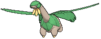

**Location**: Route 119

**Base Stat Changes:**

| Stat | Base | Change |
| ---- | ---- | ------ |
| HP | 99 | 105 |
| Attack | 68 | 75 |
| Defense | 83 | 105 |
| Sp. Attack | 72 | 85 |
| Sp. Defense | 87 | 105 |
| Speed | 51 | 60 |
| Total | 460 | 535 |

**Level Up Moves:**

| Moves | Level |     | Cont. | Level |
| ----- | ----- | --- | ----- | ----- |
| Hurricane | 1 |   | Air Slash | 26 |
| Leaf Storm | 1 |   | Giga Drain | 30 |
| Leer | 1 |   | Body Slam | 34 |
| Gust | 1 |   | Natural Gift | 38 |
| Growth | 1 |   | Dragon Pulse | 42 |
| Razor Leaf | 1 |   | Bestow | 46 |
| Sweet Scent | 6 |   | Synthesis | 50 |
| Stomp | 10 |   | Energy Ball | 54 |
| Magical Leaf | 14 |   | Solar Beam | 58 |
| Whirlwind | 18 |   | Leaf Storm | 62 |
| Leaf Tornado | 22 |   | Hurricane | 66 |

---

## [#358 Chimecho](../../pokemon/chimecho.md/)

**Location**: Mt. Pyre

**Base Stat Changes:**

| Stat | Base | Change |
| ---- | ---- | ------ |
| HP | 65 | 80 |
| Attack | 50 | 35 |
| Defense | 70 | 85 |
| Sp. Attack | 95 | 110 |
| Sp. Defense | 80 | 95 |
| Speed | 65 | 80 |
| Total | 425 | 485 |

**Level Up Moves:**

| Moves | Level |     | Cont. | Level |
| ----- | ----- | --- | ----- | ----- |
| Healing Wish | 1 |   | Wish | 28 |
| Synchronoise | 1 |   | Uproar | 31 |
| Wrap | 1 |   | Safeguard | 34 |
| Growl | 4 |   | Psychic | 37 |
| Astonish | 7 |   | Double-Edge | 40 |
| Confusion | 10 |   | Hypnosis | 43 |
| Yawn | 13 |   | Heal Pulse | 46 |
| Psywave | 16 |   | Hyper Voice | 49 |
| Cosmic Power | 19 |   | Synchronoise | 52 |
| Extrasensory | 22 |   | Healing Wish | 55 |
| Heal Bell | 25 |   |   |   |

---

## [#359 Absol](../../pokemon/absol.md/)

**Location**: Route 120

**Level Up Moves:**

| Moves | Level |     | Cont. | Level |
| ----- | ----- | --- | ----- | ----- |
| Perish Song | 1 |   | Swords Dance | 25 |
| Future Sight | 1 |   | Night Slash | 28 |
| Scratch | 1 |   | Detect | 31 |
| Feint | 1 |   | Psycho Cut | 34 |
| Leer | 4 |   | Sucker Punch | 37 |
| Quick Attack | 7 |   | Play Rough | 40 |
| Pursuit | 10 |   | Me First | 43 |
| Taunt | 13 |   | Razor Wind | 46 |
| Bite | 16 |   | Megahorn | 49 |
| Double Team | 19 |   | Future Sight | 52 |
| Slash | 22 |   | Perish Song | 55 |

---

## [#360 Wynaut](../../pokemon/wynaut.md/)

**Location**: Safari Zone

**Level Up Moves:**

| Moves | Level |     | Cont. | Level |
| ----- | ----- | --- | ----- | ----- |
| Splash | 1 |   | Mirror Coat | 15 |
| Charm | 1 |   | Safeguard | 15 |
| Encore | 1 |   | Destiny Bond | 15 |
| Counter | 15 |   |   |   |

---

## [#361 Snorunt](../../pokemon/snorunt.md/)

**Location**: Shoal Cave

**Evolution Level**: 42 >> 39

**Level Up Moves:**

| Moves | Level |     | Cont. | Level |
| ----- | ----- | --- | ----- | ----- |
| Powder Snow | 1 |   | Headbutt | 28 |
| Leer | 1 |   | Protect | 32 |
| Double Team | 5 |   | Frost Breath | 37 |
| Ice Shard | 10 |   | Crunch | 41 |
| Icy Wind | 14 |   | Blizzard | 46 |
| Bite | 19 |   | Hail | 50 |
| Ice Fang | 23 |   |   |   |

---

## [#362 Glalie](../../pokemon/glalie.md/)

**Location**: Shoal Cave

**Level Up Moves:**

| Moves | Level |     | Cont. | Level |
| ----- | ----- | --- | ----- | ----- |
| Head Smash | 1 |   | Headbutt | 28 |
| Double-Edge | 1 |   | Protect | 32 |
| Sheer Cold | 1 |   | Freeze-Dry | 37 |
| Powder Snow | 1 |   | Frost Breath | 38 |
| Leer | 1 |   | Crunch | 44 |
| Double Team | 5 |   | Blizzard | 50 |
| Ice Shard | 10 |   | Hail | 56 |
| Icy Wind | 14 |   | Sheer Cold | 62 |
| Bite | 19 |   | Double-Edge | 68 |
| Ice Fang | 23 |   | Head Smash | 74 |

---

## [#363 Spheal](../../pokemon/spheal.md/)

**Location**: Sea Mauville Outside, Shoal Cave

**Level Up Moves:**

| Moves | Level |     | Cont. | Level |
| ----- | ----- | --- | ----- | ----- |
| Defense Curl | 1 |   | Aurora Beam | 21 |
| Powder Snow | 1 |   | Body Slam | 26 |
| Growl | 1 |   | Rest | 31 |
| Water Gun | 1 |   | Snore | 31 |
| Rollout | 5 |   | Hail | 36 |
| Encore | 9 |   | Blizzard | 41 |
| Ice Ball | 13 |   | Sheer Cold | 46 |
| Brine | 17 |   |   |   |

---

## [#364 Sealeo](../../pokemon/sealeo.md/)

**Location**: Shoal Cave

**Level Up Moves:**

| Moves | Level |     | Cont. | Level |
| ----- | ----- | --- | ----- | ----- |
| Defense Curl | 1 |   | Aurora Beam | 21 |
| Powder Snow | 1 |   | Body Slam | 26 |
| Growl | 1 |   | Rest | 31 |
| Water Gun | 1 |   | Snore | 31 |
| Rollout | 5 |   | Swagger | 32 |
| Encore | 9 |   | Hail | 38 |
| Ice Ball | 13 |   | Blizzard | 45 |
| Brine | 17 |   | Sheer Cold | 52 |

---

## [#365 Walrein](../../pokemon/walrein.md/)

**Location**: Evolve Sealeo (Lv. 44)

**Level Up Moves:**

| Moves | Level |     | Cont. | Level |
| ----- | ----- | --- | ----- | ----- |
| Crunch | 1 |   | Body Slam | 26 |
| Defense Curl | 1 |   | Rest | 31 |
| Powder Snow | 1 |   | Snore | 31 |
| Growl | 1 |   | Swagger | 32 |
| Water Gun | 1 |   | Hail | 38 |
| Rollout | 5 |   | Ice Fang | 44 |
| Encore | 9 |   | Super Fang | 44 |
| Ice Ball | 13 |   | Blizzard | 49 |
| Brine | 17 |   | Sheer Cold | 60 |
| Aurora Beam | 21 |   |   |   |

---

## [#366 Clamperl](../../pokemon/clamperl.md/)

**Location**: Dewford Town, Lilycove City, Route 126

**Ability 2**: Rattled

**Level Up Moves:**

| Moves | Level |     | Cont. | Level |
| ----- | ----- | --- | ----- | ----- |
| Clamp | 1 |   | Iron Defense | 1 |
| Water Gun | 1 |   | Muddy Water | 17 |
| Whirlpool | 1 |   | Shell Smash | 34 |

---

## [#367 Huntail](../../pokemon/huntail.md/)

**Location**: Dewford Town, Underwater

**Ability 2**: Water Veil

**Level Up Moves:**

| Moves | Level |     | Cont. | Level |
| ----- | ----- | --- | ----- | ----- |
| Whirlpool | 1 |   | Sucker Punch | 23 |
| Bite | 1 |   | Dive | 26 |
| Screech | 5 |   | Baton Pass | 29 |
| Scary Face | 9 |   | Crunch | 34 |
| Feint Attack | 11 |   | Aqua Tail | 39 |
| Water Pulse | 14 |   | Coil | 45 |
| Ice Fang | 16 |   | Hydro Pump | 50 |
| Brine | 19 |   |   |   |

---

## [#368 Gorebyss](../../pokemon/gorebyss.md/)

**Location**: Lilycove City, Underwater

**Ability 2**: Hydration

**Level Up Moves:**

| Moves | Level |     | Cont. | Level |
| ----- | ----- | --- | ----- | ----- |
| Whirlpool | 1 |   | Captivate | 23 |
| Confusion | 1 |   | Dive | 26 |
| Water Sport | 5 |   | Baton Pass | 29 |
| Agility | 9 |   | Psychic | 34 |
| Draining Kiss | 11 |   | Aqua Tail | 39 |
| Water Pulse | 14 |   | Coil | 45 |
| Amnesia | 16 |   | Hydro Pump | 50 |
| Aqua Ring | 19 |   |   |   |

---

## [#369 Relicanth](../../pokemon/relicanth.md/)

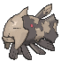

**Location**: Route 124, Route 126, Route 127, Route 128, Route 129, Route 130, Underwater, Seafloor Cavern Outide

**Level Up Moves:**

| Moves | Level |     | Cont. | Level |
| ----- | ----- | --- | ----- | ----- |
| Head Smash | 1 |   | Zen Headbutt | 26 |
| Tackle | 1 |   | Aqua Tail | 30 |
| Harden | 1 |   | Rock Slide | 34 |
| Mud Sport | 1 |   | Take Down | 38 |
| Water Gun | 1 |   | Yawn | 42 |
| Mud Sport | 6 |   | Rest | 46 |
| Water Gun | 10 |   | Hydro Pump | 50 |
| Rock Tomb | 14 |   | Double-Edge | 54 |
| Ancient Power | 18 |   | Head Smash | 58 |
| Dive | 22 |   |   |   |

---

## [#370 Luvdisc](../../pokemon/luvdisc.md/)

**Location**: Route 104 South, Route 128, Ever Grande City, Battle Resort

**Ability 2**: Cute Charm **

**Effort Values**: 1 Spd >> 2 Spd

**Held Item**: Heart Scale (100%)

**New TM/HMs**: Dazzling Gleam

**Type**:  >>  

**Base Stat Changes:**

| Stat | Base | Change |
| ---- | ---- | ------ |
| HP | 43 | 45 |
| Sp. Attack | 40 | 100 |
| Sp. Defense | 65 | 90 |
| Speed | 97 | 145 |
| Total | 330 | 465 |

**Level Up Moves:**

| Moves | Level |     | Cont. | Level |
| ----- | ----- | --- | ----- | ----- |
| Tackle | 1 |   | Aqua Ring | 25 |
| Charm | 1 |   | Moonblast | 28 |
| Misty Terrain | 1 |   | Captivate | 31 |
| Sweet Kiss | 4 |   | Take Down | 34 |
| Water Gun | 7 |   | Lucky Chant | 37 |
| Draining Kiss | 10 |   | Hydro Pump | 40 |
| Attract | 13 |   | Flail | 43 |
| Water Pulse | 16 |   | Safeguard | 46 |
| Agility | 19 |   | Heal Pulse | 49 |
| Scald | 22 |   | Light of Ruin | 52 |

---

## [#371 Bagon](../../pokemon/bagon.md/)

**Location**: Meteor Falls

**Ability 2**: Sheer Force

**Level Up Moves:**

| Moves | Level |     | Cont. | Level |
| ----- | ----- | --- | ----- | ----- |
| Rage | 1 |   | Crunch | 25 |
| Ember | 4 |   | Dragon Claw | 29 |
| Leer | 7 |   | Zen Headbutt | 34 |
| Bite | 10 |   | Scary Face | 39 |
| Dragon Breath | 13 |   | Flamethrower | 44 |
| Headbutt | 17 |   | Double-Edge | 49 |
| Focus Energy | 21 |   |   |   |

---

## [#372 Shelgon](../../pokemon/shelgon.md/)

**Location**: Meteor Falls

**Ability 2**: Overcoat

**Held Item**: Salamencite (50%), Dragon Fang (5%)

**Level Up Moves:**

| Moves | Level |     | Cont. | Level |
| ----- | ----- | --- | ----- | ----- |
| Rage | 1 |   | Crunch | 25 |
| Ember | 4 |   | Dragon Claw | 29 |
| Leer | 7 |   | Protect | 30 |
| Bite | 10 |   | Zen Headbutt | 35 |
| Dragon Breath | 13 |   | Scary Face | 42 |
| Headbutt | 17 |   | Flamethrower | 49 |
| Focus Energy | 21 |   | Double-Edge | 56 |

---

## [#373 Salamence](../../pokemon/salamence.md/)

**Location**: Meteor Falls

**Ability 2**: Moxie

**Held Item**: Salamencite (50%), Dragon Fang (5%)

**Level Up Moves:**

| Moves | Level |     | Cont. | Level |
| ----- | ----- | --- | ----- | ----- |
| Hydro Pump | 1 |   | Headbutt | 17 |
| Hyper Voice | 1 |   | Focus Energy | 21 |
| Dragon Tail | 1 |   | Crunch | 25 |
| Fire Fang | 1 |   | Dragon Claw | 29 |
| Thunder Fang | 1 |   | Protect | 30 |
| Rage | 1 |   | Zen Headbutt | 35 |
| Bite | 1 |   | Scary Face | 42 |
| Ember | 4 |   | Flamethrower | 49 |
| Leer | 7 |   | Fly | 50 |
| Bite | 10 |   | Double-Edge | 63 |
| Dragon Breath | 13 |   |   |   |

---

## [#374 Beldum](../../pokemon/beldum.md/)

**Location**: Meteor Falls

**Ability 2**: Light Metal

**Catch Rate**: 3 >> 45

**Level Up Moves:**

| Moves | Level |     | Cont. | Level |
| ----- | ----- | --- | ----- | ----- |
| Take Down | 1 |   | Iron Head | 1 |
| Iron Defense | 1 |   | Zen Headbutt | 1 |

---

## [#375 Metang](../../pokemon/metang.md/)

**Location**: Meteor Falls, Cave of Origin

**Ability 2**: Light Metal

**Catch Rate**: 3 >> 45

**Level Up Moves:**

| Moves | Level |     | Cont. | Level |
| ----- | ----- | --- | ----- | ----- |
| Magnet Rise | 1 |   | Miracle Eye | 29 |
| Take Down | 1 |   | Zen Headbutt | 32 |
| Iron Defense | 1 |   | Scary Face | 35 |
| Iron Head | 1 |   | Psychic | 38 |
| Zen Headbutt | 1 |   | Agility | 41 |
| Confusion | 20 |   | Meteor Mash | 44 |
| Metal Claw | 20 |   | Iron Defense | 47 |
| Pursuit | 23 |   | Hyper Beam | 50 |
| Bullet Punch | 26 |   |   |   |

---

## [#376 Metagross](../../pokemon/metagross.md/)

**Location**: Evolve Metang (Lv. 45)

**Ability 2**: Light Metal

**Catch Rate**: 3 >> 45

**New TM/HMs**: Fly

**Level Up Moves:**

| Moves | Level |     | Cont. | Level |
| ----- | ----- | --- | ----- | ----- |
| Magnet Rise | 1 |   | Bullet Punch | 26 |
| Thunder Punch | 1 |   | Miracle Eye | 29 |
| Ice Punch | 1 |   | Zen Headbutt | 32 |
| Take Down | 1 |   | Scary Face | 35 |
| Iron Defense | 1 |   | Psychic | 38 |
| Iron Head | 1 |   | Agility | 41 |
| Zen Headbutt | 1 |   | Meteor Mash | 44 |
| Confusion | 20 |   | Hammer Arm | 45 |
| Metal Claw | 20 |   | Iron Defense | 52 |
| Pursuit | 23 |   | Hyper Beam | 60 |

---

## [#377 Regirock](../../pokemon/regirock.md/)

**Location**: Route 111

**Ability 2**: Sturdy

**Level Up Moves:**

| Moves | Level |     | Cont. | Level |
| ----- | ----- | --- | ----- | ----- |
| Explosion | 1 |   | Ancient Power | 31 |
| Stomp | 1 |   | Iron Defense | 37 |
| Rock Throw | 1 |   | Stone Edge | 43 |
| Charge Beam | 1 |   | Hammer Arm | 49 |
| Bulldoze | 1 |   | Lock-On | 55 |
| Rock Throw | 7 |   | Zap Cannon | 55 |
| Charge Beam | 13 |   | Superpower | 61 |
| Bulldoze | 19 |   | Hyper Beam | 67 |
| Curse | 25 |   |   |   |

---

## [#378 Regice](../../pokemon/regice.md/)

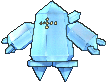

**Location**: Route 105

**Ability 2**: Ice Body

**Level Up Moves:**

| Moves | Level |     | Cont. | Level |
| ----- | ----- | --- | ----- | ----- |
| Explosion | 1 |   | Ancient Power | 31 |
| Stomp | 1 |   | Amnesia | 37 |
| Icy Wind | 1 |   | Ice Beam | 43 |
| Charge Beam | 1 |   | Hammer Arm | 49 |
| Bulldoze | 1 |   | Lock-On | 55 |
| Icy Wind | 7 |   | Zap Cannon | 55 |
| Charge Beam | 13 |   | Superpower | 61 |
| Bulldoze | 19 |   | Hyper Beam | 67 |
| Curse | 25 |   |   |   |

---

## [#379 Registeel](../../pokemon/registeel.md/)

**Location**: Route 120

**Ability 2**: Light Metal

**Level Up Moves:**

| Moves | Level |     | Cont. | Level |
| ----- | ----- | --- | ----- | ----- |
| Explosion | 1 |   | Iron Defense | 37 |
| Stomp | 1 |   | Amnesia | 37 |
| Metal Claw | 1 |   | Iron Head | 43 |
| Charge Beam | 1 |   | Flash Cannon | 43 |
| Bulldoze | 1 |   | Hammer Arm | 49 |
| Metal Claw | 7 |   | Lock-On | 55 |
| Charge Beam | 13 |   | Zap Cannon | 55 |
| Bulldoze | 19 |   | Superpower | 61 |
| Curse | 25 |   | Hyper Beam | 67 |
| Ancient Power | 31 |   |   |   |

---

## [#380 Latias](../../pokemon/latias.md/)

**Location**: Southern Island, Mirage Island

**Held Item**: Soul Dew (100%)

**Level Up Moves:**

| Moves | Level |     | Cont. | Level |
| ----- | ----- | --- | ----- | ----- |
| Dragon Pulse | 1 |   | Dragon Breath | 20 |
| Helping Hand | 1 |   | Mist Ball | 24 |
| Wish | 1 |   | Psycho Shift | 28 |
| Psywave | 1 |   | Recover | 32 |
| Safeguard | 1 |   | Reflect Type | 36 |
| Water Sport | 4 |   | Healing Wish | 41 |
| Charm | 7 |   | Zen Headbutt | 46 |
| Stored Power | 10 |   | Guard Split | 51 |
| Refresh | 13 |   | Psychic | 56 |
| Heal Pulse | 16 |   | Dragon Pulse | 61 |

---

## [#381 Latios](../../pokemon/latios.md/)

**Location**: Southern Island, Mirage Island

**Held Item**: Soul Dew (100%)

**Level Up Moves:**

| Moves | Level |     | Cont. | Level |
| ----- | ----- | --- | ----- | ----- |
| Dragon Pulse | 1 |   | Dragon Breath | 20 |
| Helping Hand | 1 |   | Luster Purge | 24 |
| Heal Block | 1 |   | Psycho Shift | 28 |
| Psywave | 1 |   | Recover | 32 |
| Safeguard | 1 |   | Telekinesis | 36 |
| Protect | 4 |   | Memento | 41 |
| Dragon Dance | 7 |   | Zen Headbutt | 46 |
| Stored Power | 10 |   | Power Split | 51 |
| Refresh | 13 |   | Psychic | 56 |
| Heal Pulse | 16 |   | Dragon Pulse | 61 |

---

## [#382 Kyogre](../../pokemon/kyogre.md/)

**Location**: Cave of Origin, Mirage Cave

**Level Up Moves:**

| Moves | Level |     | Cont. | Level |
| ----- | ----- | --- | ----- | ----- |
| Ancient Power | 1 |   | Origin Pulse | 45 |
| Water Pulse | 1 |   | Calm Mind | 50 |
| Scary Face | 5 |   | Muddy Water | 55 |
| Aqua Tail | 15 |   | Sheer Cold | 60 |
| Body Slam | 20 |   | Hydro Pump | 65 |
| Aqua Ring | 30 |   | Double-Edge | 70 |
| Ice Beam | 35 |   | Water Spout | 75 |

---

## [#383 Groudon](../../pokemon/groudon.md/)

**Location**: Cave of Origin, Mirage Cave

**Level Up Moves:**

| Moves | Level |     | Cont. | Level |
| ----- | ----- | --- | ----- | ----- |
| Ancient Power | 1 |   | Precipice Blades | 45 |
| Mud Shot | 1 |   | Bulk Up | 50 |
| Scary Face | 5 |   | Solar Beam | 55 |
| Earth Power | 15 |   | Fissure | 60 |
| Lava Plume | 20 |   | Fire Blast | 65 |
| Rest | 30 |   | Hammer Arm | 70 |
| Earthquake | 35 |   | Eruption | 75 |

---

## [#384 Rayquaza](../../pokemon/rayquaza.md/)

**Location**: Sky Pillar

**Level Up Moves:**

| Moves | Level |     | Cont. | Level |
| ----- | ----- | --- | ----- | ----- |
| Twister | 1 |   | Dragon Pulse | 50 |
| Scary Face | 5 |   | Dragon Dance | 60 |
| Ancient Power | 15 |   | Fly | 65 |
| Crunch | 20 |   | Outrage | 75 |
| Air Slash | 30 |   | Hyper Voice | 80 |
| Rest | 35 |   | Hyper Beam | 90 |
| Extreme Speed | 45 |   |   |   |

---

## [#385 Jirachi](../../pokemon/jirachi.md/)

**Location**: Mirage Cave

**Level Up Moves:**

| Moves | Level |     | Cont. | Level |
| ----- | ----- | --- | ----- | ----- |
| Wish | 1 |   | Double-Edge | 40 |
| Confusion | 1 |   | Gravity | 45 |
| Rest | 5 |   | Psychic | 50 |
| Swift | 10 |   | Iron Head | 55 |
| Helping Hand | 15 |   | Future Sight | 60 |
| Healing Wish | 20 |   | Doom Desire | 65 |
| Refresh | 25 |   | Cosmic Power | 70 |
| Rest | 30 |   | Last Resort | 75 |
| Zen Headbutt | 35 |   | Meteor Mash | 80 |

---

## [#386 Deoxys](../../pokemon/deoxys-normal.md/)

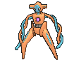

**Location**: Sky Pillar

### [Deoxys](../../pokemon/deoxys-normal.md/)

**Level Up Moves:**

| Moves | Level |     | Cont. | Level |
| ----- | ----- | --- | ----- | ----- |
| Leer | 1 |   | Snatch | 37 |
| Wrap | 1 |   | Psycho Shift | 43 |
| Night Shade | 7 |   | Zen Headbutt | 49 |
| Teleport | 13 |   | Cosmic Power | 55 |
| Knock Off | 19 |   | Recover | 61 |
| Pursuit | 25 |   | Psycho Boost | 67 |
| Psychic | 31 |   | Hyper Beam | 73 |

### [Attack Forme](../../pokemon/deoxys-attack.md/)

**Level Up Moves:**

| Moves | Level |     | Cont. | Level |
| ----- | ----- | --- | ----- | ----- |
| Leer | 1 |   | Superpower | 37 |
| Wrap | 1 |   | Psycho Shift | 43 |
| Night Shade | 7 |   | Zen Headbutt | 49 |
| Teleport | 13 |   | Cosmic Power | 55 |
| Taunt | 19 |   | Zap Cannon | 61 |
| Pursuit | 25 |   | Psycho Boost | 67 |
| Psychic | 31 |   | Hyper Beam | 73 |
| Leer | 1 |   | Superpower | 37 |
| Wrap | 1 |   | Psycho Shift | 43 |
| Night Shade | 7 |   | Zen Headbutt | 49 |
| Teleport | 13 |   | Cosmic Power | 55 |
| Taunt | 19 |   | Zap Cannon | 61 |
| Pursuit | 25 |   | Psycho Boost | 67 |
| Psychic | 31 |   | Hyper Beam | 73 |

### [Defense Forme](../../pokemon/deoxys-defense.md/)

**Level Up Moves:**

| Moves | Level |     | Cont. | Level |
| ----- | ----- | --- | ----- | ----- |
| Leer | 1 |   | Psycho Shift | 43 |
| Wrap | 1 |   | Zen Headbutt | 49 |
| Night Shade | 7 |   | Iron Defense | 55 |
| Teleport | 13 |   | Amnesia | 55 |
| Knock Off | 19 |   | Recover | 61 |
| Spikes | 25 |   | Psycho Boost | 67 |
| Psychic | 31 |   | Counter | 73 |
| Snatch | 37 |   | Mirror Coat | 73 |
| Leer | 1 |   | Psycho Shift | 43 |
| Wrap | 1 |   | Zen Headbutt | 49 |
| Night Shade | 7 |   | Iron Defense | 55 |
| Teleport | 13 |   | Amnesia | 55 |
| Knock Off | 19 |   | Recover | 61 |
| Spikes | 25 |   | Psycho Boost | 67 |
| Psychic | 31 |   | Counter | 73 |
| Snatch | 37 |   | Mirror Coat | 73 |
| Leer | 1 |   | Psycho Shift | 43 |
| Wrap | 1 |   | Zen Headbutt | 49 |
| Night Shade | 7 |   | Iron Defense | 55 |
| Teleport | 13 |   | Amnesia | 55 |
| Knock Off | 19 |   | Recover | 61 |
| Spikes | 25 |   | Psycho Boost | 67 |
| Psychic | 31 |   | Counter | 73 |
| Snatch | 37 |   | Mirror Coat | 73 |

### [Speed Forme](../../pokemon/deoxys-speed.md/)

**Level Up Moves:**

| Moves | Level |     | Cont. | Level |
| ----- | ----- | --- | ----- | ----- |
| Leer | 1 |   | Swift | 37 |
| Wrap | 1 |   | Psycho Shift | 43 |
| Night Shade | 7 |   | Zen Headbutt | 49 |
| Double Team | 13 |   | Agility | 55 |
| Knock Off | 19 |   | Recover | 61 |
| Pursuit | 25 |   | Psycho Boost | 67 |
| Psychic | 31 |   | Extreme Speed | 73 |
| Leer | 1 |   | Swift | 37 |
| Wrap | 1 |   | Psycho Shift | 43 |
| Night Shade | 7 |   | Zen Headbutt | 49 |
| Double Team | 13 |   | Agility | 55 |
| Knock Off | 19 |   | Recover | 61 |
| Pursuit | 25 |   | Psycho Boost | 67 |
| Psychic | 31 |   | Extreme Speed | 73 |
| Leer | 1 |   | Swift | 37 |
| Wrap | 1 |   | Psycho Shift | 43 |
| Night Shade | 7 |   | Zen Headbutt | 49 |
| Double Team | 13 |   | Agility | 55 |
| Knock Off | 19 |   | Recover | 61 |
| Pursuit | 25 |   | Psycho Boost | 67 |
| Psychic | 31 |   | Extreme Speed | 73 |
| Leer | 1 |   | Swift | 37 |
| Wrap | 1 |   | Psycho Shift | 43 |
| Night Shade | 7 |   | Zen Headbutt | 49 |
| Double Team | 13 |   | Agility | 55 |
| Knock Off | 19 |   | Recover | 61 |
| Pursuit | 25 |   | Psycho Boost | 67 |
| Psychic | 31 |   | Extreme Speed | 73 |

