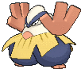
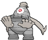
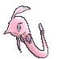

# Hoenn Pokémon

---

## #252 Treecko

**Location:** Route 101, Breed Grovyle

**Ability 2:** Unburden

| Level | Move |     | Cont. | Move |
| ----- | ---- | --- | ----- | ---- |
| 1 |   Pound |   | 21 |  Pursuit |
| 3 |   Leer |   | 23 |  Energy Ball |
| 5 |   Absorb |   | 25 |  Slam |
| 7 |   Quick Attack |   | 27 |  Detect |
| 9 |   Mega Drain |   | 29 |  Crunch |
| 11 |  Dragon Breath |   | 31 |  Endeavor |
| 13 |  Double Kick |   | 33 |  Quick Guard |
| 15 |  Grass Whistle |   | 35 |  Screech |
| 17 |  Agility |   | 37 |  Leaf Storm |
| 19 |  Giga Drain |   |   |   |

---

## #253 Grovyle

**Location:** Route 119

**Ability 2:** Unburden

| Level | Move |     | Cont. | Move |
| ----- | ---- | --- | ----- | ---- |
| 1 |   Pound |   | 24 |  Pursuit |
| 3 |   Leer |   | 27 |  Leaf Blade |
| 5 |   Absorb |   | 30 |  Acrobatics |
| 7 |   Quick Attack |   | 33 |  Detect |
| 9 |   Mega Drain |   | 36 |  Crunch |
| 11 |  Dragon Breath |   | 39 |  Endeavor |
| 13 |  Double Kick |   | 42 |  X |
| 15 |  Grass Whistle |   | 45 |  Quick Guard |
| 16 |  Fury Cutter |   | 48 |  Screech |
| 18 |  Agility |   | 51 |  Leaf Storm |
| 21 |  Giga Drain |   |   |   |

---

## #254 Sceptile

**Location:** Evolve Grovyle (Lv. 36)

**Ability 2:** Unburden

| Level | Move |     | Cont. | Move |
| ----- | ---- | --- | ----- | ---- |
| 1 |   Leaf Storm |   | 21 |  Giga Drain |
| 1 |   Night Slash |   | 24 |  Pursuit |
| 1 |   Thunder Punch |   | 27 |  Leaf Blade |
| 1 |   Pound |   | 30 |  Acrobatics |
| 3 |   Leer |   | 33 |  Detect |
| 5 |   Absorb |   | 36 |  Dual Chop |
| 7 |   Quick Attack |   | 37 |  Crunch |
| 9 |   Mega Drain |   | 41 |  Endeavor |
| 11 |  Dragon Breath |   | 45 |  X |
| 13 |  Double Kick |   | 49 |  Dragon Pulse |
| 15 |  Grass Whistle |   | 53 |  Screech |
| 16 |  Fury Cutter |   | 57 |  Leaf Storm |
| 18 |  Agility |   |   |   |

---

## #255 Torchic

**Location:** Route 101, Breed Combusken

**Ability 2:** Speed Boost

| Level | Move |     | Cont. | Move |
| ----- | ---- | --- | ----- | ---- |
| 1 |   Scratch |   | 21 |  Flame Burst |
| 3 |   Growl |   | 23 |  Aerial Ace |
| 5 |   Ember |   | 25 |  Focus Energy |
| 7 |   Sand Attack |   | 27 |  Slash |
| 9 |   Peck |   | 29 |  Bounce |
| 11 |  Fire Spin |   | 31 |  Flamethrower |
| 13 |  Feather Dance |   | 33 |  Mirror Move |
| 15 |  Flame Charge |   | 35 |  Reversal |
| 17 |  Night Slash |   | 37 |  Fire Blast |
| 19 |  Quick Attack |   |   |   |

---

## #256 Combusken

**Location:** Route 120

**Ability 2:** Speed Boost

| Level | Move |     | Cont. | Move |
| ----- | ---- | --- | ----- | ---- |
| 1 |   Scratch |   | 24 |  Flame Burst |
| 3 |   Growl |   | 27 |  Low Kick |
| 5 |   Ember |   | 30 |  Bulk Up |
| 7 |   Sand Attack |   | 33 |  Focus Energy |
| 9 |   Peck |   | 36 |  Slash |
| 11 |  Fire Spin |   | 39 |  Bounce |
| 13 |  Feather Dance |   | 42 |  Flamethrower |
| 15 |  Flame Charge |   | 45 |  Mirror Move |
| 16 |  Double Kick |   | 48 |  Sky Uppercut |
| 18 |  Night Slash |   | 51 |  Flare Blitz |
| 21 |  Quick Attack |   |   |   |

---

## #257 Blaziken

**Location:** Evolve Combusken (Lv. 36)

**Ability 2:** Speed Boost

| Level | Move |     | Cont. | Move |
| ----- | ---- | --- | ----- | ---- |
| 1 |   Flare Blitz |   | 21 |  Quick Attack |
| 1 |   Fire Punch |   | 24 |  Flame Burst |
| 1 |   Thunder Punch |   | 27 |  Low Kick |
| 1 |   High Jump Kick |   | 30 |  Bulk Up |
| 3 |   Growl |   | 33 |  Focus Energy |
| 5 |   Ember |   | 36 |  Blaze Kick |
| 7 |   Sand Attack |   | 37 |  Slash |
| 9 |   Peck |   | 41 |  Bounce |
| 11 |  Fire Spin |   | 45 |  Flamethrower |
| 13 |  Feather Dance |   | 49 |  Brave Bird |
| 15 |  Flame Charge |   | 53 |  Sky Uppercut |
| 16 |  Double Kick |   | 57 |  Flare Blitz |
| 18 |  Night Slash |   |   |   |

---

## #258 Mudkip

**Location:** Route 101, Breed Marshtomp

**Ability 2:** Damp

| Level | Move |     | Cont. | Move |
| ----- | ---- | --- | ----- | ---- |
| 1 |   Tackle |   | 21 |  Aqua Tail |
| 3 |   Growl |   | 23 |  Mud Sport |
| 5 |   Water Gun |   | 25 |  Whirlpool |
| 7 |   Mud |   | 27 |  Sludge Wave |
| 9 |   Foresight |   | 29 |  Take Down |
| 11 |  Bide |   | 31 |  Avalanche |
| 13 |  Rock Throw |   | 33 |  Endeavor |
| 15 |  Water Pulse |   | 35 |  Mirror Coat |
| 17 |  Yawn |   | 37 |  Hydro Pump |
| 19 |  Protect |   |   |   |

---

## #259 Marshtomp

**Location:** Route 120

**Ability 2:** Damp

| Level | Move |     | Cont. | Move |
| ----- | ---- | --- | ----- | ---- |
| 1 |   Tackle |   | 24 |  Aqua Tail |
| 3 |   Growl |   | 27 |  Rock Slide |
| 5 |   Water Gun |   | 30 |  Muddy Water |
| 7 |   Mud |   | 33 |  Sludge Wave |
| 9 |   Foresight |   | 36 |  Take Down |
| 11 |  Bide |   | 39 |  Earthquake |
| 13 |  Rock Throw |   | 42 |  Avalanche |
| 15 |  Water Pulse |   | 45 |  Endeavor |
| 16 |  Mud Shot |   | 48 |  Mirror Coat |
| 18 |  Yawn |   | 51 |  Hydro Pump |
| 21 |  Mud Bomb |   |   |   |

---

## #260 Swampert

**Location:** Evolve Marshtomp (Lv. 36)

**Ability 2:** Damp

| Level | Move |     | Cont. | Move |
| ----- | ---- | --- | ----- | ---- |
| 1 |   Hydro Pump |   | 21 |  Mud Bomb |
| 1 |   Ice Punch |   | 24 |  Aqua Tail |
| 1 |   Stone Edge |   | 27 |  Rock Slide |
| 1 |   Tackle |   | 30 |  Muddy Water |
| 3 |   Growl |   | 33 |  Sludge Wave |
| 5 |   Water Gun |   | 36 |  Hammer Arm |
| 7 |   Mud |   | 37 |  Take Down |
| 9 |   Foresight |   | 41 |  Earthquake |
| 11 |  Bide |   | 45 |  Avalanche |
| 13 |  Rock Throw |   | 49 |  Endeavor |
| 15 |  Water Pulse |   | 53 |  Mirror Coat |
| 16 |  Mud Shot |   | 57 |  Hydro Pump |
| 18 |  Yawn |   |   |   |

---

## #261 Poochyena

**Location:** Route 101

| Level | Move |     | Cont. | Move |
| ----- | ---- | --- | ----- | ---- |
| 1 |   Tackle |   | 25 |  Swagger |
| 4 |   Howl |   | 28 |  Scary Face |
| 7 |   Sand Attack |   | 31 |  Take Down |
| 10 |  Bite |   | 34 |  Taunt |
| 13 |  Odor Sleuth |   | 37 |  Play Rough |
| 16 |  Assurance |   | 40 |  Embargo |
| 19 |  Roar |   | 43 |  Sucker Punch |
| 22 |  Crunch |   |   |   |

---

## #262 Mightyena

**Location:** Route 121

| Stat | Base | Change |
| ---- | ---- | ------ |
| Attack      | 90 | 110 |
| Speed       | 70 | 80 |
| Total       | 420 | 450 |

| Level | Move |     | Cont. | Move |
| ----- | ---- | --- | ----- | ---- |
| 1 |   Sucker Punch |   | 16 |  Assurance |
| 1 |   Fire Fang |   | 20 |  Roar |
| 1 |   Thunder Fang |   | 24 |  Crunch |
| 1 |   Ice Fang |   | 28 |  Swagger |
| 1 |   Poison Fang |   | 32 |  Scary Face |
| 1 |   Super Fang |   | 36 |  Take Down |
| 1 |   Tackle |   | 40 |  Taunt |
| 4 |   Howl |   | 44 |  Play Rough |
| 7 |   Sand Attack |   | 48 |  Embargo |
| 10 |  Bite |   | 52 |  Sucker Punch |
| 13 |  Odor Sleuth |   |   |   |

---

## #263 Zigzagoon

**Location:** Route 101

| Stat | Base | Change |
| ---- | ---- | ------ |
| Attack      | 30 | 40 |
| Sp. Attack  | 30 | 20 |

| Level | Move |     | Cont. | Move |
| ----- | ---- | --- | ----- | ---- |
| 1 |   Tackle |   | 21 |  Flail |
| 1 |   Growl |   | 24 |  Seed Bomb |
| 5 |   Tail Whip |   | 27 |  Bestow |
| 7 |   Sand Attack |   | 30 |  Take Down |
| 9 |   Headbutt |   | 33 |  Belly Drum |
| 11 |  Baby |   | 36 |  Rest |
| 13 |  Odor Sleuth |   | 39 |  Gunk Shot |
| 15 |  Covet |   | 42 |  Fling |
| 17 |  Pin Missile |   | 45 |  Extreme Speed |
| 19 |  Mud Sport |   |   |   |

---

## #264 Linoone

**Location:** Route 101, Route 118

| Stat | Base | Change |
| ---- | ---- | ------ |
| HP          | 78 | 80 |
| Attack      | 70 | 90 |
| Defense     | 61 | 60 |
| Sp. Attack  | 50 | 40 |
| Sp. Defense | 61 | 60 |
| Speed       | 100 | 110 |
| Total       | 420 | 440 |

| Level | Move |     | Cont. | Move |
| ----- | ---- | --- | ----- | ---- |
| 1 |   Extreme Speed |   | 19 |  Mud Sport |
| 1 |   Switcheroo |   | 20 |  Play Rough |
| 1 |   Tackle |   | 22 |  Slash |
| 1 |   Growl |   | 26 |  Seed Bomb |
| 5 |   Tail Whip |   | 30 |  Bestow |
| 7 |   Sand Attack |   | 34 |  Double |
| 9 |   Headbutt |   | 38 |  Belly Drum |
| 11 |  Rototiller |   | 42 |  Rest |
| 13 |  Odor Sleuth |   | 46 |  Gunk Shot |
| 15 |  Covet |   | 50 |  Fling |
| 17 |  Fury Swipes |   | 54 |  Extreme Speed |

---

## #265 Wurmple

**Location:** Route 102

**Ability 2:** Run Away

| Level | Move |     | Cont. | Move |
| ----- | ---- | --- | ----- | ---- |
| 1 |   Tackle |   | 3 |   Bug Bite |
| 1 |   String Shot |   | 5 |   Electroweb |
| 1 |   Poison Sting |   |   |   |

---

## #266 Silcoon

**Location:** Evolve Wurmple (Lv. 7)

| Level | Move |     | Cont. | Move |
| ----- | ---- | --- | ----- | ---- |
| 1 |   Harden |   | 9 |   Iron Defense |
| 7 |   Harden |   |   |   |

---

## #267 Beautifly

**Location:** Safari Zone

**Ability 2:** Rivalry

**New TM/HMs:** Fly

| Stat | Base | Change |
| ---- | ---- | ------ |
| HP          | 60 | 65 |
| Defense     | 50 | 55 |
| Sp. Attack  | 100 | 120 |
| Sp. Defense | 50 | 55 |
| Speed       | 65 | 85 |
| Total       | 395 | 450 |

| Level | Move |     | Cont. | Move |
| ----- | ---- | --- | ----- | ---- |
| 1 |   Gust |   | 28 |  Giga Drain |
| 10 |  Gust |   | 30 |  Bug Buzz |
| 12 |  Absorb |   | 32 |  Whirlwind |
| 14 |  Struggle Bug |   | 34 |  Rage |
| 16 |  Stun Spore |   | 36 |  Energy Ball |
| 18 |  Morning Sun |   | 38 |  Psychic |
| 20 |  Air Cutter |   | 40 |  Air Slash |
| 22 |  Mega Drain |   | 42 |  Quiver Dance |
| 24 |  Silver Wind |   | 44 |  Hurricane |
| 26 |  Attract |   |   |   |

---

## #268 Cascoon

**Location:** Evolve Wurmple (Lv. 7)

| Level | Move |     | Cont. | Move |
| ----- | ---- | --- | ----- | ---- |
| 1 |   Harden |   | 9 |   Iron Defense |
| 7 |   Harden |   |   |   |

---

## #269 Dustox

**Location:** Safari Zone

**Ability 2:** Compound Eyes

**New TM/HMs:** Fly

| Stat | Base | Change |
| ---- | ---- | ------ |
| Sp. Attack  | 50 | 85 |
| Sp. Defense | 90 | 120 |
| Total       | 385 | 450 |

| Level | Move |     | Cont. | Move |
| ----- | ---- | --- | ----- | ---- |
| 1 |   Gust |   | 26 |  Light Screen |
| 10 |  Gust |   | 28 |  Psychic |
| 12 |  Confusion |   | 30 |  Bug Buzz |
| 14 |  Struggle Bug |   | 32 |  Toxic |
| 16 |  Poison Powder |   | 34 |  Protect |
| 18 |  Moonlight |   | 36 |  Sludge Bomb |
| 20 |  Venoshock |   | 38 |  Shadow Ball |
| 22 |  Psybeam |   | 40 |  Roost |
| 24 |  Silver Wind |   | 42 |  Quiver Dance |

---

## #270 Lotad

**Location:** Route 102

| Level | Move |     | Cont. | Move |
| ----- | ---- | --- | ----- | ---- |
| 1 |   Astonish |   | 19 |  Mist |
| 1 |   Growl |   | 22 |  Nature Power |
| 5 |   Absorb |   | 25 |  Rain Dance |
| 7 |   Bubble |   | 28 |  Giga Drain |
| 10 |  Natural Gift |   | 31 |  Zen Headbutt |
| 13 |  Mega Drain |   | 34 |  Energy Ball |
| 16 |  Bubble Beam |   |   |   |

---

## #271 Lombre

**Location:** Safari Zone

| Level | Move |     | Cont. | Move |
| ----- | ---- | --- | ----- | ---- |
| 1 |   Astonish |   | 22 |  Water Sport |
| 1 |   Growl |   | 26 |  Nature Power |
| 5 |   Absorb |   | 30 |  Giga Drain |
| 7 |   Bubble |   | 34 |  Uproar |
| 10 |  Fury Swipes |   | 38 |  Knock Off |
| 13 |  Mega Drain |   | 42 |  Zen Headbutt |
| 14 |  Fake Out |   | 46 |  Energy Ball |
| 18 |  Bubble Beam |   | 50 |  Hydro Pump |

---

## #272 Ludicolo

**Location:** Evolve Lombre (Water Stone)

| Level | Move |     | Cont. | Move |
| ----- | ---- | --- | ----- | ---- |
| 1 |   Ice Punch |   | 1 |   Mega Drain |
| 1 |   Fire Punch |   | 1 |   Nature Power |
| 1 |   Thunder Punch |   | 23 |  Teeter Dance |
| 1 |   Drain Punch |   | 38 |  Rain Dance |
| 1 |   Astonish |   | 53 |  Hydro Pump |
| 1 |   Growl |   |   |   |

---

## #273 Seedot

**ocation:** Route 102

| Level | Move |     | Cont. | Move |
| ----- | ---- | --- | ----- | ---- |
| 1 |   Bide |   | 15 |  Synthesis |
| 3 |   Harden |   | 18 |  Seed Bomb |
| 6 |   Bullet Seed |   | 21 |  Sunny Day |
| 9 |   Growth |   | 24 |  Explosion |
| 12 |  Nature Power |   |   |   |

---

## #274 Nuzleaf

**Location:** Safari Zone

| Level | Move |     | Cont. | Move |
| ----- | ---- | --- | ----- | ---- |
| 1 |   Pound |   | 19 |  Feint Attack |
| 3 |   Harden |   | 23 |  Razor Wind |
| 6 |   Fake Out |   | 27 |  Leaf Blade |
| 9 |   Growth |   | 31 |  Dark Pulse |
| 12 |  Nature Power |   | 35 |  Swagger |
| 14 |  Razor Leaf |   | 39 |  Low Kick |
| 15 |  Torment |   | 43 |  Extrasensory |

---

## #275 Shiftry

**Location:** Evolve Nuzleaf (Leaf Stone)

| Level | Move |     | Cont. | Move |
| ----- | ---- | --- | ----- | ---- |
| 1 |   Twister |   | 1 |   Whirlwind |
| 1 |   Ominous Wind |   | 1 |   Nasty Plot |
| 1 |   Silver Wind |   | 20 |  Leaf Tornado |
| 1 |   Razor Leaf |   | 32 |  Hurricane |
| 1 |   Feint Attack |   | 44 |  Leaf Storm |

---

## #276 Taillow

**Location:** Route 104 South

**Ability 2:** Scrappy

| Level | Move |     | Cont. | Move |
| ----- | ---- | --- | ----- | ---- |
| 1 |   Peck |   | 21 |  Aerial Ace |
| 1 |   Growl |   | 25 |  Quick Guard |
| 5 |   Focus Energy |   | 29 |  Agility |
| 9 |   Quick Attack |   | 33 |  Air Slash |
| 13 |  Wing Attack |   | 37 |  Endeavor |
| 17 |  Double Team |   | 41 |  Brave Bird |

---

## #277 Swellow

**Location:** Route 115

**Ability 2:** Scrappy

| Stat | Base | Change |
| ---- | ---- | ------ |
| Attack      | 85 | 95 |
| Sp. Defense | 50 | 60 |
| Total       | 430 | 450 |

| Level | Move |     | Cont. | Move |
| ----- | ---- | --- | ----- | ---- |
| 1 |   Brave Bird |   | 21 |  Aerial Ace |
| 1 |   Air Slash |   | 26 |  Quick Guard |
| 1 |   Pluck |   | 31 |  Agility |
| 1 |   Peck |   | 36 |  Air Slash |
| 1 |   Growl |   | 41 |  Endeavor |
| 5 |   Focus Energy |   | 46 |  Brave Bird |
| 9 |   Quick Attack |   | 51 |  Superpower |
| 13 |  Wing Attack |   | 56 |  Extreme Speed |
| 17 |  Double Team |   |   |   |

---

## #278 Wingull

**Location:** Route 104 South, Route 106, Dewford Town, Route 107, Route 109, Route 105, Route 118, Route 126, Route 131

**Ability 2:** Rain Dish

**New TM/HMs:** Surf, Waterfall, Dive

| Level | Move |     | Cont. | Move |
| ----- | ---- | --- | ----- | ---- |
| 1 |   Growl |   | 22 |  Air Cutter |
| 1 |   Water Gun |   | 26 |  Pursuit |
| 5 |   Supersonic |   | 29 |  Aerial Ace |
| 8 |   Wing Attack |   | 33 |  Roost |
| 12 |  Mist |   | 36 |  Agility |
| 15 |  Water Pulse |   | 40 |  Air Slash |
| 19 |  Quick Attack |   | 43 |  Hurricane |

---

## #279 Pelipper

**Location:** Route 106, Dewford Town, Route 107, Route 109, Route 105, Route 118, Route 126, Ever Grande City, Route 131, Battle Resort

**Ability 2:** Rain Dish

**New TM/HMs:** Waterfall, Dive

| Stat | Base | Change |
| ---- | ---- | ------ |
| HP          | 60 | 80 |
| Total       | 430 | 450 |

| Level | Move |     | Cont. | Move |
| ----- | ---- | --- | ----- | ---- |
| 1 |   Hurricane |   | 19 |  Payback |
| 1 |   Hydro Pump |   | 22 |  Roost |
| 1 |   Tailwind |   | 25 |  Protect |
| 1 |   Soak |   | 28 |  Brine |
| 1 |   Shock Wave |   | 33 |  Stockpile |
| 1 |   Growl |   | 33 |  Swallow |
| 1 |   Water Gun |   | 33 |  Spit Up |
| 1 |   Water Sport |   | 39 |  Fling |
| 5 |   Supersonic |   | 44 |  Tailwind |
| 8 |   Wing Attack |   | 50 |  Hydro Pump |
| 12 |  Mist |   | 55 |  Hurricane |
| 15 |  Water Pulse |   |   |   |

---

## #280 Ralts

**Location:** Route 102, Mt. Pyre

| Stat | Base | Change |
| ---- | ---- | ------ |
| Sp. Attack  | 45 | 65 |
| Sp. Defense | 35 | 55 |
| Total       | 198 | 238 |

| Level | Move |     | Cont. | Move |
| ----- | ---- | --- | ----- | ---- |
| 1 |   Growl |   | 24 |  Psychic |
| 4 |   Confusion |   | 27 |  Calm Mind |
| 6 |   Double Team |   | 29 |  Imprison |
| 9 |   Teleport |   | 32 |  Future Sight |
| 11 |  Disarming Voice |   | 34 |  Charm |
| 14 |  Magical Leaf |   | 37 |  Hypnosis |
| 17 |  Draining Kiss |   | 39 |  Dream Eater |
| 19 |  Lucky Chant |   | 42 |  Stored Power |
| 22 |  Heal Pulse |   |   |   |

---

## #281 Kirlia

**Location:** Mt. Pyre

| Stat | Base | Change |
| ---- | ---- | ------ |
| Sp. Attack  | 65 | 85 |
| Sp. Defense | 55 | 75 |
| Total       | 278 | 318 |

| Level | Move |     | Cont. | Move |
| ----- | ---- | --- | ----- | ---- |
| 1 |   Growl |   | 19 |  Lucky Chant |
| 1 |   Confusion |   | 23 |  Heal Pulse |
| 1 |   Double Team |   | 26 |  Psychic |
| 1 |   Teleport |   | 30 |  Calm Mind |
| 4 |   Confusion |   | 33 |  Imprison |
| 6 |   Double Team |   | 37 |  Future Sight |
| 9 |   Teleport |   | 40 |  Charm |
| 11 |  Disarming Voice |   | 44 |  Hypnosis |
| 14 |  Magical Leaf |   | 47 |  Dream Eater |
| 17 |  Draining Kiss |   | 51 |  Stored Power |

---

## #282 Gardevoir

**Location:** Evolve Kirlia (Lv. 30)

| Level | Move |     | Cont. | Move |
| ----- | ---- | --- | ----- | ---- |
| 1 |   Moonblast |   | 23 |  Heal Pulse |
| 1 |   Stored Power |   | 26 |  Psychic |
| 1 |   Misty Terrain |   | 30 |  Hyper Voice |
| 1 |   Healing Wish |   | 31 |  Calm Mind |
| 1 |   Growl |   | 35 |  Imprison |
| 4 |   Confusion |   | 40 |  Future Sight |
| 6 |   Double Team |   | 44 |  Captivate |
| 9 |   Teleport |   | 49 |  Hypnosis |
| 11 |  Disarming Voice |   | 53 |  Dream Eater |
| 14 |  Magical Leaf |   | 58 |  Stored Power |
| 17 |  Draining Kiss |   | 62 |  Moonblast |
| 19 |  Wish |   |   |   |

---

## #283 Surskit

**Location:** Route 102

**Ability 2:** Speed Boost **

| Stat | Base | Change |
| ---- | ---- | ------ |
| Attack      | 50 | 60 |
| Sp. Attack  | 60 | 62 |
| Total       | 269 | 289 |

| Level | Move |     | Cont. | Move |
| ----- | ---- | --- | ----- | ---- |
| 1 |   Bubble |   | 18 |  Aqua Jet |
| 1 |   Sweet Scent |   | 20 |  Mist |
| 1 |   Fell Stinger |   | 22 |  Psybeam |
| 6 |   Quick Attack |   | 24 |  Haze |
| 9 |   Struggle Bug |   | 26 |  Baton Pass |
| 12 |  Bubble Beam |   | 28 |  Signal Beam |
| 14 |  Water Sport |   | 30 |  Sticky Web |
| 16 |  Agility |   | 32 |  Hydro Pump |

---

## #284 Masquerain

**Location:** Safari Zone

**Ability 2:** Levitate **

**New TM/HMs:** Fly, Surf, Waterfall, Dive

**Type:** Bug / Flying >> Bug / Water

| Stat | Base | Change |
| ---- | ---- | ------ |
| Attack          | 60 | 50 |
| Defense         | 62 | 65 |
| Sp. Attack      | 80 | 105 |
| Sp. Defense     | 82 | 105 |
| Speed           | 60 | 85 |
| Total           | 414 | 480 |

| Level | Move |     | Cont. | Move |
| ----- | ---- | --- | ----- | ---- |
| 1 |   Quiver Dance |   | 22 |  Silver Wind |
| 1 |   Bubble |   | 23 |  Psybeam |
| 1 |   Sweet Scent |   | 26 |  Haze |
| 1 |   Fell Stinger |   | 29 |  Signal Beam |
| 6 |   Quick Attack |   | 32 |  Baton Pass |
| 9 |   Struggle Bug |   | 35 |  Ominous Wind |
| 12 |  Bubble Beam |   | 38 |  Bug Buzz |
| 14 |  Water Sport |   | 41 |  Air Slash |
| 16 |  Agility |   | 44 |  Whirlwind |
| 18 |  Aqua Jet |   | 47 |  Hydro Pump |
| 20 |  Mist |   | 50 |  Hurricane |
| 22 |  Gust |   | 53 |  Quiver Dance |

---

## #285 Shroomish

**Location:** Petalburg Woods

| Level | Move |     | Cont. | Move |
| ----- | ---- | --- | ----- | ---- |
| 1 |   Absorb |   | 20 |  Poison Powder |
| 1 |   Tackle |   | 23 |  Worry Seed |
| 5 |   Stun Spore |   | 26 |  Giga Drain |
| 8 |   Leech Seed |   | 29 |  Growth |
| 11 |  Mega Drain |   | 32 |  Toxic |
| 14 |  Headbutt |   | 35 |  Seed Bomb |
| 17 |  Bullet Seed |   | 38 |  Spore |

---

## #286 Breloom

**Location:** Petalburg Woods, Safari Zone

| Level | Move |     | Cont. | Move |
| ----- | ---- | --- | ----- | ---- |
| 1 |   Superpower |   | 23 |  Counter |
| 1 |   Thunder Punch |   | 23 |  Mach Punch |
| 1 |   Absorb |   | 27 |  Force Palm |
| 1 |   Tackle |   | 31 |  Mind Reader |
| 5 |   Stun Spore |   | 35 |  Drain Punch |
| 8 |   Leech Seed |   | 39 |  Sky Uppercut |
| 11 |  Mega Drain |   | 43 |  Seed Bomb |
| 14 |  Headbutt |   | 47 |  Dynamic Punch |
| 17 |  Bullet Seed |   | 51 |  Superpower |
| 20 |  Feint |   |   |   |

---

## #287 Slakoth

**Location:** Petalburg Woods

| Level | Move |     | Cont. | Move |
| ----- | ---- | --- | ----- | ---- |
| 1 |   Scratch |   | 18 |  Covet |
| 1 |   Yawn |   | 21 |  Amnesia |
| 6 |   Encore |   | 24 |  Counter |
| 9 |   Slack Off |   | 27 |  Body Slam |
| 12 |  Feint Attack |   | 30 |  Flail |
| 15 |  Chip Away |   | 33 |  Play Rough |

---

## #288 Vigoroth

**Location:** Safari Zone

| Level | Move |     | Cont. | Move |
| ----- | ---- | --- | ----- | ---- |
| 1 |   Reversal |   | 18 |  Slash |
| 1 |   Scratch |   | 22 |  Endure |
| 1 |   Focus Energy |   | 26 |  Counter |
| 6 |   Encore |   | 30 |  Night Slash |
| 9 |   Uproar |   | 34 |  Focus Punch |
| 12 |  Fury Swipes |   | 38 |  Reversal |
| 15 |  Chip Away |   |   |   |

---

## #289 Slaking

**Location:** Evolve Vigoroth (Lv. 36)

| Level | Move |     | Cont. | Move |
| ----- | ---- | --- | ----- | ---- |
| 1 |   Hammer Arm |   | 15 |  Chip Away |
| 1 |   Punishment |   | 18 |  Covet |
| 1 |   Fling |   | 22 |  Amnesia |
| 1 |   Ice Punch |   | 26 |  Counter |
| 1 |   Thunder Punch |   | 30 |  Body Slam |
| 1 |   Fire Punch |   | 34 |  Flail |
| 1 |   Scratch |   | 36 |  Swagger |
| 1 |   Yawn |   | 39 |  Play Rough |
| 6 |   Encore |   | 44 |  Fling |
| 9 |   Slack Off |   | 49 |  Punishment |
| 12 |  Feint Attack |   | 54 |  Hammer Arm |

---

## #290 Nincada

**Location:** Rusturf Tunnel

**Ability 2:** Run Away

| Level | Move |     | Cont. | Move |
| ----- | ---- | --- | ----- | ---- |
| 1 |   Scratch |   | 17 |  Night Slash |
| 1 |   Harden |   | 21 |  Metal Claw |
| 1 |   Leech Life |   | 25 |  Mind Reader |
| 1 |   Mud |   | 29 |  Bide |
| 5 |   Sand Attack |   | 33 |  False Swipe |
| 9 |   Fury Swipes |   | 37 |  Dig |
| 13 |  Bug Bite |   |   |   |

---

## #291 Ninjask

**Location:** Evolve Nincada (Lv. 20)

**Ability 2:** Infiltrator

**New TM/HMs:** Fly

| Level | Move |     | Cont. | Move |
| ----- | ---- | --- | ----- | ---- |
| 1 |   Scratch |   | 20 |  Fury Cutter |
| 1 |   Harden |   | 20 |  Screech |
| 1 |   Leech Life |   | 23 |  Slash |
| 1 |   Agility |   | 28 |  Mind Reader |
| 5 |   Sand Attack |   | 33 |  X |
| 9 |   Fury Swipes |   | 38 |  Swords Dance |
| 13 |  Bug Bite |   | 43 |  Baton Pass |
| 17 |  Night Slash |   | 48 |  Extreme Speed |
| 20 |  Double Team |   |   |   |

---

## #292 Shedinja

**Location:** Evolve Nincada (Lv. 20)

| Level | Move |     | Cont. | Move |
| ----- | ---- | --- | ----- | ---- |
| 1 |   Scratch |   | 21 |  Shadow Sneak |
| 1 |   Harden |   | 25 |  Mind Reader |
| 1 |   Leech Life |   | 29 |  Shadow Ball |
| 1 |   Spite |   | 33 |  X |
| 5 |   Sand Attack |   | 37 |  Phantom Force |
| 9 |   Fury Swipes |   | 41 |  Heal Block |
| 13 |  Bug Bite |   | 45 |  Grudge |
| 17 |  Night Slash |   |   |   |

---

## #293 Whismur

**Location:** Rusturf Tunnel

**Ability 2:** Rattled

| Level | Move |     | Cont. | Move |
| ----- | ---- | --- | ----- | ---- |
| 1 |   Pound |   | 22 |  Uproar |
| 4 |   Echoed Voice |   | 25 |  Extrasensory |
| 7 |   Astonish |   | 28 |  Roar |
| 10 |  Howl |   | 31 |  Rest |
| 13 |  Screech |   | 34 |  Sleep Talk |
| 16 |  Stomp |   | 37 |  Hyper Voice |
| 19 |  Supersonic |   | 40 |  Synchronoise |

---

## #294 Loudred

**Location:** Victory Road

**Ability 2:** Scrappy

| Level | Move |     | Cont. | Move |
| ----- | ---- | --- | ----- | ---- |
| 1 |   Pound |   | 23 |  Uproar |
| 4 |   Echoed Voice |   | 27 |  Extrasensory |
| 7 |   Astonish |   | 31 |  Roar |
| 10 |  Howl |   | 35 |  Rest |
| 13 |  Screech |   | 39 |  Sleep Talk |
| 16 |  Stomp |   | 43 |  Hyper Voice |
| 19 |  Supersonic |   | 47 |  Synchronoise |
| 20 |  Bite |   |   |   |

---

## #295 Exploud

**Location:** Evolve Loudred (Lv. 40)

**Ability 2:** Scrappy

| Level | Move |     | Cont. | Move |
| ----- | ---- | --- | ----- | ---- |
| 1 |   Boomburst |   | 20 |  Bite |
| 1 |   Hammer Arm |   | 23 |  Uproar |
| 1 |   Ice Fang |   | 27 |  Extrasensory |
| 1 |   Fire Fang |   | 31 |  Roar |
| 1 |   Thunder Fang |   | 35 |  Rest |
| 1 |   Pound |   | 39 |  Sleep Talk |
| 4 |   Echoed Voice |   | 40 |  Crunch |
| 7 |   Astonish |   | 44 |  Hyper Voice |
| 10 |  Howl |   | 49 |  Synchronoise |
| 13 |  Screech |   | 54 |  Boomburst |
| 16 |  Stomp |   | 59 |  Hyper Beam |
| 19 |  Supersonic |   |   |   |

---

## #296 Makuhita

**Location:** Granite Cave

| Level | Move |     | Cont. | Move |
| ----- | ---- | --- | ----- | ---- |
| 1 |   Tackle |   | 25 |  Belly Drum |
| 1 |   Focus Energy |   | 28 |  Smelling Salts |
| 4 |   Sand Attack |   | 31 |  Seismic Toss |
| 7 |   Arm Thrust |   | 34 |  Wake |
| 10 |  Fake Out |   | 37 |  Endure |
| 13 |  Force Palm |   | 40 |  Close Combat |
| 16 |  Whirlwind |   | 43 |  Reversal |
| 19 |  Knock Off |   | 46 |  Heavy Slam |
| 22 |  Vital Throw |   | 49 |  Cross Chop |

---

## #297 Hariyama

**Location:** Granite Cave, Victory Road

| Level | Move |     | Cont. | Move |
| ----- | ---- | --- | ----- | ---- |
| 1 |   Brine |   | 19 |  Knock Off |
| 1 |   Ice Punch |   | 22 |  Vital Throw |
| 1 |   Fire Punch |   | 26 |  Belly Drum |
| 1 |   Thunder Punch |   | 30 |  Smelling Salts |
| 1 |   Tackle |   | 34 |  Seismic Toss |
| 1 |   Focus Energy |   | 38 |  Wake |
| 4 |   Sand Attack |   | 42 |  Endure |
| 7 |   Arm Thrust |   | 46 |  Close Combat |
| 10 |  Fake Out |   | 50 |  Reversal |
| 13 |  Force Palm |   | 54 |  Heavy Slam |
| 16 |  Whirlwind |   | 58 |  Cross Chop |

---

## #298 Azurill

**Location:** Route 104 South

| Stat | Base | Change |
| ---- | ---- | ------ |
| Base Happiness  | 70 | 200 |

| Level | Move |     | Cont. | Move |
| ----- | ---- | --- | ----- | ---- |
| 1 |   Splash |   | 10 |  Charm |
| 1 |   Water Gun |   | 13 |  Bubble Beam |
| 2 |   Tail Whip |   | 16 |  Helping Hand |
| 5 |   Water Sport |   | 20 |  Slam |
| 7 |   Bubble |   | 23 |  Bounce |

---

## #299 Nosepass

**Location:** Granite Cave

| Level | Move |     | Cont. | Move |
| ----- | ---- | --- | ----- | ---- |
| 1 |   Tackle |   | 28 |  Rock Blast |
| 4 |   Harden |   | 31 |  Discharge |
| 7 |   Block |   | 34 |  Sandstorm |
| 10 |  Rock Throw |   | 37 |  Earth Power |
| 13 |  Thunder Wave |   | 40 |  Stone Edge |
| 16 |  Rest |   | 43 |  Lock |
| 19 |  Spark |   | 43 |  Zap Cannon |
| 22 |  Rock Slide |   | 46 |  Head Smash |
| 25 |  Power Gem |   |   |   |

---

## #300 Skitty

**Location:** Route 116

| Stat | Base | Change |
| ---- | ---- | ------ |
| Sp. Attack  | 35 | 45 |
| Sp. Defense | 35 | 45 |
| Total       | 260 | 280 |

| Level | Move |     | Cont. | Move |
| ----- | ---- | --- | ----- | ---- |
| 1 |   Fake Out |   | 21 |  Copycat |
| 1 |   Growl |   | 23 |  Assist |
| 1 |   Tail Whip |   | 24 |  Charm |
| 1 |   Tackle |   | 26 |  Hyper Voice |
| 5 |   Foresight |   | 28 |  Feint Attack |
| 7 |   Attract |   | 31 |  Wake |
| 9 |   Sing |   | 33 |  Moonblast |
| 11 |  Disarming Voice |   | 36 |  Covet |
| 13 |  Round |   | 39 |  Heal Bell |
| 15 |  Double Slap |   | 43 |  Double |
| 17 |  Shock Wave |   | 46 |  Captivate |
| 18 |  Icy Wind |   | 49 |  Play Rough |
| 19 |  Mud Bomb |   |   |   |

---

## #301 Delcatty

**Location:** Route 116

**Effort Values:** 1 HP, 1 Speed >> 2 Sp. Atk

| Stat | Base | Change |
| ---- | ---- | ------ |
| HP          | 70 | 80 |
| Sp. Attack  | 55 | 100 |
| Sp. Defense | 55 | 65 |
| Speed       | 70 | 80 |
| Total       | 380 | 455 |

| Level | Move |     | Cont. | Move |
| ----- | ---- | --- | ----- | ---- |
| 1 |   Hyper Voice |   | 1 |   Fake Out |
| 1 |   Moonblast |   | 1 |   Sing |
| 1 |   Ice Beam |   | 1 |   Attract |
| 1 |   Thunderbolt |   | 1 |   Double Slap |
| 1 |   Shadow Ball |   |   |   |

---

## #302 Sableye

**Location:** Granite Cave, Cave of Origin

### Normal Forme

| Stat | Base | Change |
| ---- | ---- | ------ |
| HP          | 50 | 55 |
| Attack      | 75 | 80 |
| Defense     | 75 | 80 |
| Sp. Attack  | 65 | 70 |
| Sp. Defense | 65 | 70 |
| Speed       | 50 | 55 |
| Total       | 380 | 410 |

### Mega Forme

| Stat | Base | Change |
| ---- | ---- | ------ |
| HP          | 50 | 55 |
| Attack      | 85 | 90 |
| Defense     | 125 | 130 |
| Sp. Attack  | 85 | 90 |
| Sp. Defense | 115 | 120 |
| Speed       | 20 | 25 |
| Total       | 480 | 510 |

| Level | Move |     | Cont. | Move |
| ----- | ---- | --- | ----- | ---- |
| 1 |   Leer |   | 26 |  Recover |
| 1 |   Scratch |   | 28 |  Shadow Claw |
| 4 |   Foresight |   | 29 |  Confuse Ray |
| 6 |   Night Shade |   | 32 |  Zen Headbutt |
| 8 |   Astonish |   | 35 |  Sucker Punch |
| 11 |  Fury Swipes |   | 36 |  Power Gem |
| 13 |  Detect |   | 39 |  Shadow Ball |
| 14 |  Shadow Sneak |   | 41 |  Foul Play |
| 16 |  Feint Attack |   | 44 |  Quash |
| 19 |  Fake Out |   | 46 |  Mean Look |
| 21 |  Punishment |   | 49 |  Metal Burst |
| 24 |  Knock Off |   |   |   |

---

## #303 Mawile

**Location:** Granite Cave, Cave of Origin

### Normal Forme

| Stat | Base | Change |
| ---- | ---- | ------ |
| HP          | 50 | 55 |
| Attack      | 85 | 90 |
| Defense     | 85 | 90 |
| Sp. Attack  | 55 | 60 |
| Sp. Defense | 55 | 60 |
| Speed       | 50 | 55 |
| Total       | 380 | 410 |

### Mega Forme

| Stat | Base | Change |
| ---- | ---- | ------ |
| HP          | 50 | 55 |
| Attack      | 105 | 110 |
| Defense     | 125 | 130 |
| Sp. Attack  | 55 | 60 |
| Sp. Defense | 95 | 100 |
| Speed       | 50 | 55 |
| Total       | 480 | 510 |

| Level | Move |     | Cont. | Move |
| ----- | ---- | --- | ----- | ---- |
| 1 |   Taunt |   | 21 |  Crunch |
| 1 |   Growl |   | 24 |  Play Rough |
| 1 |   Fairy Wind |   | 27 |  Baton Pass |
| 1 |   Astonish |   | 30 |  Iron Defense |
| 6 |   Fake Tears |   | 33 |  Iron Head |
| 9 |   Sweet Scent |   | 37 |  Sucker Punch |
| 12 |  Bite |   | 41 |  Stockpile |
| 15 |  Fire Fang |   | 41 |  Swallow |
| 15 |  Thunder Fang |   | 41 |  Spit Up |
| 15 |  Ice Fang |   | 45 |  Super Fang |
| 15 |  Poison Fang |   | 49 |  Metal Burst |
| 18 |  Vice Grip |   |   |   |

---

## #304 Aron

**Location:** Granite Cave, Scorched Slab

| Level | Move |     | Cont. | Move |
| ----- | ---- | --- | ----- | ---- |
| 1 |   Tackle |   | 25 |  Rock Slide |
| 1 |   Harden |   | 28 |  Take Down |
| 4 |   Mud |   | 31 |  Metal Sound |
| 7 |   Headbutt |   | 34 |  Iron Tail |
| 10 |  Metal Claw |   | 37 |  Iron Defense |
| 13 |  Rock Tomb |   | 40 |  Double |
| 16 |  Protect |   | 43 |  Autotomize |
| 19 |  Roar |   | 46 |  Heavy Slam |
| 22 |  Iron Head |   | 49 |  Metal Burst |

---

## #305 Lairon

**Location:** Granite Cave, Scorched Slab, Cave of Origin, Victory Road

| Level | Move |     | Cont. | Move |
| ----- | ---- | --- | ----- | ---- |
| 1 |   Tackle |   | 22 |  Iron Head |
| 1 |   Harden |   | 25 |  Rock Slide |
| 1 |   Mud |   | 28 |  Take Down |
| 1 |   Headbutt |   | 31 |  Metal Sound |
| 4 |   Mud |   | 35 |  Iron Tail |
| 7 |   Headbutt |   | 39 |  Iron Defense |
| 10 |  Metal Claw |   | 43 |  Double |
| 13 |  Rock Tomb |   | 47 |  Autotomize |
| 16 |  Protect |   | 51 |  Heavy Slam |
| 19 |  Roar |   | 55 |  Metal Burst |

---

## #306 Aggron

**Location:** Evolve Lairon (Lv. 42)

| Level | Move |     | Cont. | Move |
| ----- | ---- | --- | ----- | ---- |
| 1 |   Avalanche |   | 25 |  Rock Slide |
| 1 |   Superpower |   | 28 |  Take Down |
| 1 |   Tackle |   | 31 |  Metal Sound |
| 1 |   Harden |   | 35 |  Iron Tail |
| 4 |   Mud |   | 39 |  Iron Defense |
| 7 |   Headbutt |   | 42 |  Dragon Rush |
| 10 |  Metal Claw |   | 45 |  Double |
| 13 |  Rock Tomb |   | 51 |  Autotomize |
| 16 |  Protect |   | 57 |  Heavy Slam |
| 19 |  Roar |   | 63 |  Metal Burst |
| 22 |  Iron Head |   | 69 |  Head Smash |

---

## #307 Meditite

**Location:** Jagged Pass, Mt. Pyre

**Evolution Level:** 37 >> 35

| Level | Move |     | Cont. | Move |
| ----- | ---- | --- | ----- | ---- |
| 1 |   Bide |   | 26 |  Mind Reader |
| 4 |   Meditate |   | 28 |  High Jump Kick |
| 7 |   Confusion |   | 31 |  Psych Up |
| 9 |   Detect |   | 33 |  Acupressure |
| 12 |  Endure |   | 35 |  Zen Headbutt |
| 15 |  Feint |   | 37 |  Power Trick |
| 17 |  Force Palm |   | 39 |  Reversal |
| 20 |  Hidden Power |   | 41 |  Recover |
| 22 |  Calm Mind |   | 44 |  Counter |
| 24 |  Psycho Cut |   |   |   |

---

## #308 Medicham

**Location:** Mt. Pyre, Victory Road

| Level | Move |     | Cont. | Move |
| ----- | ---- | --- | ----- | ---- |
| 1 |   Fire Punch |   | 24 |  Psycho Cut |
| 1 |   Thunder Punch |   | 26 |  Mind Reader |
| 1 |   Ice Punch |   | 28 |  High Jump Kick |
| 1 |   Bide |   | 31 |  Psych Up |
| 4 |   Meditate |   | 33 |  Acupressure |
| 7 |   Confusion |   | 35 |  Fake Out |
| 9 |   Detect |   | 37 |  Zen Headbutt |
| 12 |  Endure |   | 42 |  Power Trick |
| 15 |  Feint |   | 47 |  Reversal |
| 17 |  Force Palm |   | 53 |  Recover |
| 20 |  Hidden Power |   | 59 |  Counter |
| 22 |  Calm Mind |   |   |   |

---

## #309 Electrike

**Location:** Route 110

| Level | Move |     | Cont. | Move |
| ----- | ---- | --- | ----- | ---- |
| 1 |   Tackle |   | 21 |  Thunder Fang |
| 1 |   Thunder Wave |   | 24 |  Bite |
| 4 |   Leer |   | 28 |  Discharge |
| 7 |   Howl |   | 33 |  Roar |
| 10 |  Quick Attack |   | 37 |  Thunderbolt |
| 13 |  Spark |   | 41 |  Wild Charge |
| 15 |  Odor Sleuth |   | 45 |  Charge |
| 18 |  Electro Ball |   | 49 |  Thunder |

---

## #310 Manectric

**Location:** Route 118

| Level | Move |     | Cont. | Move |
| ----- | ---- | --- | ----- | ---- |
| 1 |   Electric Terrain |   | 18 |  Electro Ball |
| 1 |   Fire Fang |   | 21 |  Thunder Fang |
| 1 |   Tackle |   | 24 |  Bite |
| 1 |   Thunder Wave |   | 26 |  Flame Burst |
| 1 |   Leer |   | 29 |  Discharge |
| 1 |   Howl |   | 34 |  Roar |
| 4 |   Leer |   | 39 |  Thunderbolt |
| 7 |   Howl |   | 43 |  Wild Charge |
| 10 |  Quick Attack |   | 48 |  Charge |
| 13 |  Spark |   | 54 |  Thunder |
| 15 |  Odor Sleuth |   | 60 |  Electric Terrain |

---

## #311 Plusle

**Location:** Route 110

**Ability 2:** Victory Star **

| Stat | Base | Change |
| ---- | ---- | ------ |
| HP          | 60 | 70 |
| Attack      | 50 | 60 |
| Defense     | 40 | 50 |
| Sp. Attack  | 85 | 95 |
| Sp. Defense | 75 | 85 |
| Speed       | 95 | 105 |
| Total       | 405 | 465 |

| Level | Move |     | Cont. | Move |
| ----- | ---- | --- | ----- | ---- |
| 1 |   Nuzzle |   | 22 |  Copycat |
| 1 |   Play Nice |   | 25 |  Charm |
| 1 |   Growl |   | 28 |  Charge |
| 1 |   Thunder Wave |   | 31 |  Discharge |
| 1 |   Quick Attack |   | 34 |  Baton Pass |
| 4 |   Helping Hand |   | 37 |  Agility |
| 7 |   Spark |   | 40 |  Last Resort |
| 10 |  Encore |   | 43 |  Thunder |
| 13 |  Bestow |   | 46 |  Nasty Plot |
| 16 |  Swift |   | 49 |  Entrainment |
| 19 |  Electro Ball |   |   |   |

---

## #312 Minun

**Location:** Route 110

**Ability 2:** Victory Star **

| Stat | Base | Change |
| ---- | ---- | ------ |
| HP          | 60 | 70 |
| Attack      | 40 | 50 |
| Defense     | 50 | 60 |
| Sp. Attack  | 75 | 85 |
| Sp. Defense | 85 | 95 |
| Speed       | 95 | 105 |
| Total       | 405 | 465 |

| Level | Move |     | Cont. | Move |
| ----- | ---- | --- | ----- | ---- |
| 1 |   Nuzzle |   | 22 |  Copycat |
| 1 |   Play Nice |   | 25 |  Fake Tears |
| 1 |   Growl |   | 28 |  Charge |
| 1 |   Thunder Wave |   | 31 |  Discharge |
| 1 |   Quick Attack |   | 34 |  Baton Pass |
| 4 |   Helping Hand |   | 37 |  Agility |
| 7 |   Spark |   | 40 |  Trump Card |
| 10 |  Encore |   | 43 |  Thunder |
| 13 |  Switcheroo |   | 46 |  Nasty Plot |
| 16 |  Swift |   | 49 |  Entrainment |
| 19 |  Electro Ball |   |   |   |

---

## #313 Volbeat

**Location:** Route 117

**Effort Values:** 1 Speed >> 1 Attack

**New TM/HMs:** Wild Charge

**Type:** Bug >> Bug/Fairy

| Stat | Base | Change |
| ---- | ---- | ------ |
| Attack      | 73 | 105 |
| Defense     | 55 | 60 |
| Sp. Attack  | 47 | 45 |
| Sp. Defense | 75 | 80 |
| Speed       | 85 | 95 |
| Total       | 400 | 450 |

| Level | Move |     | Cont. | Move |
| ----- | ---- | --- | ----- | ---- |
| 1 |   Wild Charge |   | 23 |  Thunder Punch |
| 1 |   Acrobatics |   | 26 |  Signal Beam |
| 1 |   Brick Break |   | 29 |  Thunder Wave |
| 1 |   U |   | 32 |  Zen Headbutt |
| 1 |   Flash |   | 35 |  Tail Glow |
| 1 |   Tackle |   | 38 |  Bug Buzz |
| 5 |   Double Team |   | 41 |  Protect |
| 8 |   Confuse Ray |   | 44 |  Helping Hand |
| 11 |  Quick Attack |   | 47 |  Moonblast |
| 14 |  Bug Bite |   | 50 |  Double |
| 17 |  Moonlight |   | 53 |  Wild Charge |
| 20 |  Play Rough |   |   |   |

---

## #314 Illumise

**Location:** Route 117

**Effort Values:** 1 Speed >> 1 Sp. Atk

**Type:** Bug >> Bug/Fairy

| Stat | Base | Change |
| ---- | ---- | ------ |
| Attack      | 47 | 45 |
| Defense     | 55 | 60 |
| Sp. Attack  | 73 | 105 |
| Sp. Defense | 75 | 80 |
| Speed       | 85 | 95 |
| Total       | 400 | 450 |

| Level | Move |     | Cont. | Move |
| ----- | ---- | --- | ----- | ---- |
| 1 |   Thunder |   | 23 |  Thunderbolt |
| 1 |   Giga Drain |   | 26 |  Signal Beam |
| 1 |   Shadow Ball |   | 29 |  Thunder Wave |
| 1 |   U |   | 32 |  Zen Headbutt |
| 1 |   Play Nice |   | 35 |  Wish |
| 1 |   Tackle |   | 38 |  Bug Buzz |
| 5 |   Sweet Scent |   | 41 |  Encore |
| 8 |   Charm |   | 44 |  Helping Hand |
| 11 |  Quick Attack |   | 47 |  Play Rough |
| 14 |  Struggle Bug |   | 50 |  Covet |
| 17 |  Moonlight |   | 53 |  Thunder |
| 20 |  Moonblast |   |   |   |

---

## #315 Roselia

**Location:** Route 117

| Level | Move |     | Cont. | Move |
| ----- | ---- | --- | ----- | ---- |
| 1 |   Absorb |   | 31 |  Extrasensory |
| 4 |   Growth |   | 34 |  Toxic Spikes |
| 7 |   Poison Sting |   | 37 |  Petal Dance |
| 10 |  Stun Spore |   | 40 |  Sweet Scent |
| 13 |  Mega Drain |   | 43 |  Sleep Powder |
| 16 |  Leech Seed |   | 46 |  Ingrain |
| 19 |  Magical Leaf |   | 49 |  Toxic |
| 22 |  Venoshock |   | 52 |  Aromatherapy |
| 25 |  Giga Drain |   | 55 |  Synthesis |
| 28 |  Grass Whistle |   | 59 |  Petal Blizzard |

---

## #316 Gulpin

**Location:** Route 110

| Level | Move |     | Cont. | Move |
| ----- | ---- | --- | ----- | ---- |
| 1 |   Pound |   | 24 |  Spit Up |
| 1 |   Yawn |   | 24 |  Swallow |
| 6 |   Poison Gas |   | 27 |  Sludge Bomb |
| 9 |   Sludge |   | 30 |  Gastro Acid |
| 12 |  Amnesia |   | 34 |  Sludge Wave |
| 14 |  Acid Spray |   | 38 |  Belch |
| 16 |  Encore |   | 41 |  Wring Out |
| 18 |  Venoshock |   | 44 |  Seed Bomb |
| 21 |  Toxic |   | 48 |  Gunk Shot |
| 24 |  Stockpile |   |   |   |

---

## #317 Swalot

**Location:** Safari Zone

| Level | Move |     | Cont. | Move |
| ----- | ---- | --- | ----- | ---- |
| 1 |   Gunk Shot |   | 24 |  Stockpile |
| 1 |   Wring Out |   | 24 |  Spit Up |
| 1 |   Pound |   | 24 |  Swallow |
| 1 |   Yawn |   | 26 |  Body Slam |
| 6 |   Poison Gas |   | 29 |  Sludge Bomb |
| 9 |   Sludge |   | 33 |  Gastro Acid |
| 12 |  Amnesia |   | 37 |  Sludge Wave |
| 14 |  Acid Spray |   | 41 |  Belch |
| 16 |  Encore |   | 45 |  Wring Out |
| 18 |  Venoshock |   | 50 |  Seed Bomb |
| 21 |  Toxic |   | 55 |  Gunk Shot |

---

## #318 Carvanha

**Location:** Route 118, Mossdeep City

**Ability 2:** Speed Boost

| Level | Move |     | Cont. | Move |
| ----- | ---- | --- | ----- | ---- |
| 1 |   Leer |   | 25 |  Poison Fang |
| 1 |   Bite |   | 28 |  Waterfall |
| 4 |   Rage |   | 31 |  Scary Face |
| 7 |   Focus Energy |   | 34 |  Crunch |
| 10 |  Aqua Jet |   | 37 |  Thrash |
| 13 |  Assurance |   | 40 |  Agility |
| 16 |  Screech |   | 43 |  Take Down |
| 19 |  Swagger |   | 46 |  Hydro Pump |
| 22 |  Ice Fang |   |   |   |

---

## #319 Sharpedo

**Location:** Route 118, Mossdeep City

**Ability 2:** Speed Boost

| Level | Move |     | Cont. | Move |
| ----- | ---- | --- | ----- | ---- |
| 1 |   Night Slash |   | 25 |  Poison Fang |
| 1 |   Zen Headbutt |   | 28 |  Waterfall |
| 1 |   Feint |   | 30 |  Slash |
| 1 |   Leer |   | 32 |  Scary Face |
| 1 |   Bite |   | 36 |  Crunch |
| 4 |   Rage |   | 40 |  Thrash |
| 7 |   Focus Energy |   | 44 |  Agility |
| 10 |  Aqua Jet |   | 48 |  Skull Bash |
| 13 |  Assurance |   | 52 |  Hydro Pump |
| 16 |  Screech |   | 56 |  Taunt |
| 19 |  Swagger |   | 60 |  Night Slash |
| 22 |  Ice Fang |   |   |   |

---

## #320 Wailmer

**Location:** Slateport City, Sea Mauville, Magma Hideout, Aqua Hideout, Route 129

**Evolution Level:** 40 >> 37

| Level | Move |     | Cont. | Move |
| ----- | ---- | --- | ----- | ---- |
| 1 |   Splash |   | 31 |  Body Slam |
| 4 |   Growl |   | 34 |  Dive |
| 7 |   Water Gun |   | 37 |  Zen Headbutt |
| 10 |  Rollout |   | 40 |  Amnesia |
| 13 |  Whirlpool |   | 43 |  Water Spout |
| 16 |  Astonish |   | 46 |  Bounce |
| 19 |  Water Pulse |   | 49 |  Hydro Pump |
| 22 |  Mist |   | 52 |  Double |
| 25 |  Brine |   | 55 |  Fissure |
| 28 |  Rest |   | 58 |  Heavy Slam |

---

## #321 Wailord

**Location:** Route 129

| Level | Move |     | Cont. | Move |
| ----- | ---- | --- | ----- | ---- |
| 1 |   Heavy Slam |   | 31 |  Body Slam |
| 1 |   Splash |   | 34 |  Dive |
| 4 |   Growl |   | 37 |  Hyper Voice |
| 7 |   Water Gun |   | 38 |  Zen Headbutt |
| 10 |  Rollout |   | 42 |  Amnesia |
| 13 |  Whirlpool |   | 46 |  Water Spout |
| 16 |  Astonish |   | 50 |  Bounce |
| 19 |  Water Pulse |   | 54 |  Hydro Pump |
| 22 |  Mist |   | 58 |  Double |
| 25 |  Brine |   | 62 |  Fissure |
| 28 |  Rest |   | 66 |  Heavy Slam |

---

## #322 Numel

**Location:** Fiery Path

| Level | Move |     | Cont. | Move |
| ----- | ---- | --- | ----- | ---- |
| 1 |   Growl |   | 26 |  Earth Power |
| 1 |   Tackle |   | 29 |  Curse |
| 5 |   Ember |   | 31 |  Take Down |
| 8 |   Focus Energy |   | 36 |  Yawn |
| 12 |  Magnitude |   | 40 |  Earthquake |
| 15 |  Flame Burst |   | 43 |  Flamethrower |
| 19 |  Amnesia |   | 47 |  Double |
| 22 |  Lava Plume |   |   |   |

---

## #323 Camerupt

**Location:** Safari Zone

| Level | Move |     | Cont. | Move |
| ----- | ---- | --- | ----- | ---- |
| 1 |   Fissure |   | 19 |  Amnesia |
| 1 |   Eruption |   | 22 |  Lava Plume |
| 1 |   Growl |   | 26 |  Earth Power |
| 1 |   Tackle |   | 29 |  Curse |
| 1 |   Ember |   | 31 |  Take Down |
| 1 |   Focus Energy |   | 33 |  Rock Slide |
| 5 |   Ember |   | 39 |  Yawn |
| 8 |   Focus Energy |   | 46 |  Earthquake |
| 12 |  Magnitude |   | 52 |  Flamethrower |
| 15 |  Flame Burst |   | 59 |  Double |

---

## #324 Torkoal

**Location:** Fiery Path

**Ability 2:** Shell Armor

| Level | Move |     | Cont. | Move |
| ----- | ---- | --- | ----- | ---- |
| 1 |   Ember |   | 34 |  Flamethrower |
| 4 |   Smog |   | 38 |  Iron Defense |
| 7 |   Withdraw |   | 40 |  Earth Power |
| 10 |  Rapid Spin |   | 42 |  Amnesia |
| 13 |  Fire Spin |   | 45 |  Flail |
| 15 |  Smokescreen |   | 47 |  Heat Wave |
| 18 |  Flame Wheel |   | 50 |  Shell Smash |
| 22 |  Curse |   | 53 |  Inferno |
| 25 |  Lava Plume |   | 57 |  Superpower |
| 27 |  Body Slam |   | 60 |  Eruption |
| 30 |  Protect |   |   |   |

---

## #325 Spoink

**Location:** Jagged Pass

| Level | Move |     | Cont. | Move |
| ----- | ---- | --- | ----- | ---- |
| 1 |   Splash |   | 26 |  Psyshock |
| 5 |   Psywave |   | 29 |  Rest |
| 8 |   Odor Sleuth |   | 32 |  Snore |
| 11 |  Psybeam |   | 35 |  Zen Headbutt |
| 14 |  Psych Up |   | 38 |  Payback |
| 17 |  Confuse Ray |   | 41 |  Psychic |
| 20 |  Magic Coat |   | 44 |  Bounce |
| 23 |  Power Gem |   |   |   |

---

## #326 Grumpig

**Location:** Jagged Pass, Safari Zone

| Level | Move |     | Cont. | Move |
| ----- | ---- | --- | ----- | ---- |
| 1 |   Splash |   | 26 |  Psyshock |
| 5 |   Psywave |   | 29 |  Rest |
| 8 |   Odor Sleuth |   | 32 |  Teeter Dance |
| 11 |  Psybeam |   | 34 |  Snore |
| 14 |  Psych Up |   | 38 |  Zen Headbutt |
| 17 |  Confuse Ray |   | 42 |  Payback |
| 20 |  Magic Coat |   | 46 |  Psychic |
| 23 |  Power Gem |   | 50 |  Bounce |

---

## #327 Spinda

**Location:** Route 113

| Stat | Base | Change |
| ---- | ---- | ------ |
| HP          | 60 | 80 |
| Attack      | 60 | 80 |
| Defense     | 60 | 80 |
| Sp. Attack  | 60 | 80 |
| Sp. Defense | 60 | 80 |
| Speed       | 60 | 80 |
| Total       | 360 | 480 |

| Level | Move |     | Cont. | Move |
| ----- | ---- | --- | ----- | ---- |
| 1 |   Tackle |   | 28 |  Uproar |
| 4 |   Copycat |   | 31 |  Fake Out |
| 7 |   Feint Attack |   | 34 |  Psycho Cut |
| 10 |  Psybeam |   | 37 |  Double |
| 13 |  Hypnosis |   | 40 |  Shadow Ball |
| 16 |  Dizzy Punch |   | 43 |  Flail |
| 19 |  Sucker Punch |   | 46 |  Thrash |
| 22 |  Teeter Dance |   | 49 |  Superpower |
| 25 |  Assist |   | 52 |  Psycho Boost |

---

## #328 Trapinch

**Location:** Route 111

**Held Item:** Jaw Fossil (50%), Soft Sand (5%)

| Level | Move |     | Cont. | Move |
| ----- | ---- | --- | ----- | ---- |
| 1 |   Sand Attack |   | 22 |  Crunch |
| 1 |   Bite |   | 26 |  Earth Power |
| 1 |   Faint Attack |   | 29 |  Feint |
| 1 |   Bide |   | 33 |  Earthquake |
| 5 |   Mud |   | 36 |  Sandstorm |
| 8 |   Bulldoze |   | 40 |  Superpower |
| 12 |  Sand Tomb |   | 43 |  Hyper Beam |
| 15 |  Rock Slide |   | 47 |  Fissure |
| 19 |  Dig |   |   |   |

---

## #329 Vibrava

**Location:** Route 111

| Level | Move |     | Cont. | Move |
| ----- | ---- | --- | ----- | ---- |
| 1 |   Sand Attack |   | 22 |  Screech |
| 1 |   Sonic Boom |   | 26 |  Earth Power |
| 1 |   Feint Attack |   | 29 |  Bug Buzz |
| 1 |   Bide |   | 33 |  Earthquake |
| 5 |   Mud |   | 35 |  Dragon Breath |
| 8 |   Bulldoze |   | 36 |  Sandstorm |
| 12 |  Sand Tomb |   | 40 |  Uproar |
| 15 |  Rock Slide |   | 43 |  Hyper Beam |
| 19 |  Supersonic |   | 47 |  Boomburst |

---

## #330 Flygon

**Location:** Evolve Vibrava (Lv. 45)

| Stat | Base | Change |
| ---- | ---- | ------ |
| Attack      | 100 | 110 |
| Sp. Attack  | 80 | 90 |
| Speed       | 100 | 110 |
| Total       | 520 | 550 |

| Level | Move |     | Cont. | Move |
| ----- | ---- | --- | ----- | ---- |
| 1 |   Sand Attack |   | 26 |  Earth Power |
| 1 |   Sonic Boom |   | 29 |  Dragon Tail |
| 1 |   Feint Attack |   | 33 |  Earthquake |
| 1 |   Bide |   | 35 |  Dragon Breath |
| 5 |   Mud |   | 36 |  Sandstorm |
| 8 |   Bulldoze |   | 40 |  Uproar |
| 12 |  Sand Tomb |   | 43 |  Hyper Beam |
| 15 |  Rock Slide |   | 45 |  Dragon Claw |
| 19 |  Supersonic |   | 47 |  Dragon Rush |
| 22 |  Screech |   | 51 |  Quiver Dance |

---

## #331 Cacnea

**Location:** Route 111

**Ability 2:** Water Absorb

**Held Item:** Root Fossil (50%), Sticky Barb (5%)

| Level | Move |     | Cont. | Move |
| ----- | ---- | --- | ----- | ---- |
| 1 |   Poison Sting |   | 28 |  Spikes |
| 1 |   Leer |   | 31 |  Seed Bomb |
| 4 |   Absorb |   | 34 |  Poison Jab |
| 7 |   Growth |   | 37 |  Sucker Punch |
| 10 |  Leech Seed |   | 40 |  Pin Missile |
| 13 |  Sand Attack |   | 43 |  Energy Ball |
| 16 |  Ingrain |   | 46 |  Cotton Spore |
| 19 |  Feint Attack |   | 49 |  Sandstorm |
| 22 |  Needle Arm |   | 52 |  Destiny Bond |
| 25 |  Payback |   | 55 |  Fell Stinger |

---

## #332 Cacturne

**Location:** Evolve Cacnea (Lv. 32)

**Ability 2:** Water Absorb

| Level | Move |     | Cont. | Move |
| ----- | ---- | --- | ----- | ---- |
| 1 |   Fell Stinger |   | 25 |  Payback |
| 1 |   Destiny Bond |   | 28 |  Spikes |
| 1 |   Revenge |   | 31 |  Seed Bomb |
| 1 |   Thunder Punch |   | 32 |  Spiky Shield |
| 1 |   Poison Sting |   | 35 |  Poison Jab |
| 1 |   Leer |   | 39 |  Sucker Punch |
| 4 |   Absorb |   | 43 |  Pin Missile |
| 7 |   Growth |   | 47 |  Energy Ball |
| 10 |  Leech Seed |   | 51 |  Cotton Spore |
| 13 |  Sand Attack |   | 55 |  Sandstorm |
| 16 |  Ingrain |   | 59 |  Destiny Bond |
| 19 |  Feint Attack |   | 63 |  Fell Stinger |
| 22 |  Needle Arm |   |   |   |

---

## #333 Swablu

**Location:** Route 114, Mt. Pyre

**Ability 2:** Cloud Nine

**Evolution Level:** 35 >> 33

| Level | Move |     | Cont. | Move |
| ----- | ---- | --- | ----- | ---- |
| 1 |   Peck |   | 21 |  Take Down |
| 1 |   Growl |   | 24 |  Pluck |
| 3 |   Astonish |   | 27 |  Cotton Guard |
| 5 |   Sing |   | 30 |  Mirror Move |
| 7 |   Fury Attack |   | 33 |  Refresh |
| 9 |   Safeguard |   | 36 |  Dragon Pulse |
| 11 |  Disarming Voice |   | 39 |  Moonblast |
| 13 |  Mist |   | 42 |  Hyper Voice |
| 15 |  Round |   | 45 |  Perish Song |
| 18 |  Natural Gift |   | 48 |  Double |

---

## #334 Altaria

**Location:** Route 120, Sky Pillar

**Ability 2:** Cloud Nine

| Level | Move |     | Cont. | Move |
| ----- | ---- | --- | ----- | ---- |
| 1 |   Sky Attack |   | 24 |  Pluck |
| 1 |   Outrage |   | 27 |  Cotton Guard |
| 1 |   Peck |   | 30 |  Dragon Dance |
| 1 |   Growl |   | 33 |  Dragon Breath |
| 3 |   Astonish |   | 34 |  Refresh |
| 5 |   Sing |   | 38 |  Dragon Pulse |
| 7 |   Fury Attack |   | 42 |  Moonblast |
| 9 |   Safeguard |   | 46 |  Hyper Voice |
| 11 |  Disarming Voice |   | 50 |  Perish Song |
| 13 |  Mist |   | 54 |  Double |
| 15 |  Round |   | 58 |  Outrage |
| 18 |  Natural Gift |   | 62 |  Sky Attack |
| 21 |  Take Down |   |   |   |

---

## #335 Zangoose

**Location:** Route 114

**Ability 2:** Toxic Boost

| Level | Move |     | Cont. | Move |
| ----- | ---- | --- | ----- | ---- |
| 1 |   Close Combat |   | 17 |  Slash |
| 1 |   Swords Dance |   | 20 |  Revenge |
| 1 |   Ice Punch |   | 23 |  Crush Claw |
| 1 |   Fire Punch |   | 26 |  Night Slash |
| 1 |   Thunder Punch |   | 29 |  False Swipe |
| 1 |   Scratch |   | 32 |  Embargo |
| 1 |   Leer |   | 35 |  Detect |
| 5 |   Quick Attack |   | 39 |  X |
| 8 |   Fury Cutter |   | 43 |  Taunt |
| 11 |  Pursuit |   | 47 |  Swords Dance |
| 14 |  Hone Claws |   | 50 |  Close Combat |

---

## #336 Seviper

**Location:** Route 114

**Ability 2:** Infiltrator

| Level | Move |     | Cont. | Move |
| ----- | ---- | --- | ----- | ---- |
| 1 |   Wrap |   | 28 |  Night Slash |
| 1 |   SWagger |   | 31 |  Gastro Acid |
| 4 |   Bite |   | 34 |  Poison Jab |
| 7 |   Lick |   | 37 |  Haze |
| 10 |  Poison Tail |   | 40 |  Crunch |
| 13 |  Screech |   | 43 |  Belch |
| 16 |  Venoshock |   | 46 |  Coil |
| 19 |  Glare |   | 49 |  Wring Out |
| 22 |  Poison Fang |   | 52 |  Gunk Shot |
| 25 |  Venom Drench |   |   |   |

---

## #337 Lunatone

**Location:** Meteor Falls

| Stat | Base | Change |
| ---- | ---- | ------ |
| HP          | 70 | 80 |
| Defense     | 65 | 80 |
| Sp. Attack  | 95 | 110 |
| Sp. Defense | 85 | 100 |
| Total       | 440 | 495 |

| Level | Move |     | Cont. | Move |
| ----- | ---- | --- | ----- | ---- |
| 1 |   Tackle |   | 27 |  Moonblast |
| 1 |   Harden |   | 30 |  Psychic |
| 1 |   Confusion |   | 33 |  Heal Block |
| 1 |   Rock Throw |   | 36 |  Power Gem |
| 6 |   Hypnosis |   | 39 |  Future Sight |
| 9 |   Rock Polish |   | 42 |  Ice Beam |
| 12 |  Psywave |   | 45 |  Earth Power |
| 15 |  Embargo |   | 48 |  Explosion |
| 18 |  Ancient Power |   | 51 |  Blizzard |
| 21 |  Psyshock |   | 54 |  Magic Room |
| 24 |  Icy Wind |   | 57 |  Moonlight |

---

## #338 Solrock

**Location:** Meteor Falls

| Stat | Base | Change |
| ---- | ---- | ------ |
| HP          | 70 | 80 |
| Attack      | 95 | 110 |
| Defense     | 85 | 100 |
| Sp. Defense | 65 | 80 |
| Total       | 440 | 495 |

| Level | Move |     | Cont. | Move |
| ----- | ---- | --- | ----- | ---- |
| 1 |   Tackle |   | 27 |  Overheat |
| 1 |   Harden |   | 30 |  Psychic |
| 1 |   Confusion |   | 33 |  Heal Block |
| 1 |   Rock Throw |   | 36 |  Stone Edge |
| 6 |   Fire Spin |   | 39 |  Solar Beam |
| 9 |   Rock Polish |   | 42 |  Heat Crash |
| 12 |  Psywave |   | 45 |  Earthquake |
| 15 |  Embargo |   | 48 |  Explosion |
| 18 |  Rock Slide |   | 51 |  Flare Blitz |
| 21 |  Zen Headbutt |   | 54 |  Wonder Room |
| 24 |  Will |   | 57 |  Morning Sun |

---

## #339 Barboach

**Location:** Route 111, Route 120, Scorched Slab, Safari Zone

| Level | Move |     | Cont. | Move |
| ----- | ---- | --- | ----- | ---- |
| 1 |   Mud |   | 27 |  Rest |
| 1 |   Mud Sport |   | 27 |  Snore |
| 1 |   Water Sport |   | 30 |  Earthquake |
| 6 |   Water Gun |   | 33 |  Thrash |
| 9 |   Mud Bomb |   | 36 |  Muddy Water |
| 12 |  Amnesia |   | 39 |  Dragon Dance |
| 15 |  Water Pulse |   | 42 |  Future Sight |
| 18 |  Magnitude |   | 45 |  Earth Power |
| 21 |  Spark |   | 48 |  Fissure |
| 24 |  Aqua Tail |   | 51 |  Hydro Pump |

---

## #340 Whiscash

**Location:** Route 111, Route 120, Scorched Slab, Safari Zone

| Level | Move |     | Cont. | Move |
| ----- | ---- | --- | ----- | ---- |
| 1 |   Mud |   | 27 |  Snore |
| 1 |   Mud Sport |   | 30 |  Zen Headbutt |
| 1 |   Water Sport |   | 31 |  Earthquake |
| 6 |   Water Gun |   | 35 |  Thrash |
| 9 |   Mud Bomb |   | 39 |  Muddy Water |
| 12 |  Amnesia |   | 43 |  Dragon Dance |
| 15 |  Water Pulse |   | 47 |  Future Sight |
| 18 |  Magnitude |   | 51 |  Earth Power |
| 21 |  Spark |   | 55 |  Fissure |
| 24 |  Aqua Tail |   | 59 |  Hydro Pump |
| 27 |  Rest |   |   |   |

---

## #341 Corphish

**Location:** Route 102, Route 123

| Level | Move |     | Cont. | Move |
| ----- | ---- | --- | ----- | ---- |
| 1 |   Bubble |   | 25 |  Knock Off |
| 1 |   Harden |   | 28 |  Double Hit |
| 4 |   Vice Grip |   | 31 |  Night Slash |
| 7 |   Aqua Jet |   | 34 |  Taunt |
| 10 |  Leer |   | 37 |  Crunch |
| 13 |  Bubble Beam |   | 40 |  Swords Dance |
| 16 |  Razor Shell |   | 43 |  Superpower |
| 19 |  Protect |   | 46 |  Guillotine |
| 22 |  Crabhammer |   | 49 |  Dragon Dance |

---

## #342 Crawdaunt

 its shell regularly. Immediately after molting, its shell is soft and tender. Until the shell hardens, this Pokémon hides in its streambed burrow to avoid attack from its foes.")

**Location:** Route 102, Route 123

| Level | Move |     | Cont. | Move |
| ----- | ---- | --- | ----- | ---- |
| 1 |   Superpower |   | 25 |  Knock Off |
| 1 |   Avalanche |   | 28 |  Double Hit |
| 1 |   Bubble |   | 30 |  Swift |
| 1 |   Harden |   | 32 |  Night Slash |
| 4 |   Vice Grip |   | 36 |  Taunt |
| 7 |   Aqua Jet |   | 40 |  Crunch |
| 10 |  Leer |   | 44 |  Swords Dance |
| 13 |  Bubble Beam |   | 48 |  Superpower |
| 16 |  Razor Shell |   | 52 |  Guillotine |
| 19 |  Protect |   | 56 |  Dragon Dance |
| 22 |  Crabhammer |   |   |   |

---

## #343 Baltoy

**Location:** Route 111

**Held Item:** Helix Fossil (50%), Light Clay (5%)

| Level | Move |     | Cont. | Move |
| ----- | ---- | --- | ----- | ---- |
| 1 |   Harden |   | 28 |  Extrasensory |
| 1 |   Confusion |   | 31 |  Earth Power |
| 4 |   Rapid Spin |   | 34 |  Guard Split |
| 7 |   Mud |   | 34 |  Power Split |
| 10 |  Heal Block |   | 37 |  Self |
| 13 |  Rock Tomb |   | 40 |  Psychic |
| 16 |  Psybeam |   | 43 |  Sandstorm |
| 19 |  Ancient Power |   | 46 |  Trick Room |
| 22 |  Cosmic Power |   | 49 |  Imprison |
| 25 |  Power Trick |   | 52 |  Explosion |

---

## #344 Claydol

**Location:** Sky Pillar

**New TM/HMs:** Fly

| Level | Move |     | Cont. | Move |
| ----- | ---- | --- | ----- | ---- |
| 1 |   Teleport |   | 28 |  Extrasensory |
| 1 |   Harden |   | 31 |  Earth Power |
| 1 |   Confusion |   | 34 |  Guard Split |
| 4 |   Rapid Spin |   | 34 |  Power Split |
| 7 |   Mud |   | 36 |  Hyper Beam |
| 10 |  Heal Block |   | 39 |  Self |
| 13 |  Rock Tomb |   | 43 |  Psychic |
| 16 |  Psybeam |   | 47 |  Sandstorm |
| 19 |  Ancient Power |   | 51 |  Trick Room |
| 22 |  Cosmic Power |   | 55 |  Imprison |
| 25 |  Power Trick |   | 59 |  Explosion |

---

## #345 Lileep

**Location:** Seafloor Cavern, Revive Root Fossil

**Ability 2:** Storm Drain

**Evolution Level:** 40 >> 37

| Level | Move |     | Cont. | Move |
| ----- | ---- | --- | ----- | ---- |
| 1 |   Astonish |   | 32 |  Amnesia |
| 1 |   Constrict |   | 36 |  Energy Ball |
| 4 |   Acid |   | 40 |  Earth Power |
| 8 |   Ingrain |   | 44 |  Stockpile |
| 12 |  Confuse Ray |   | 44 |  Spit Up |
| 16 |  Ancient Power |   | 44 |  Swallow |
| 20 |  Brine |   | 48 |  Recover |
| 24 |  Giga Drain |   | 52 |  Wring Out |
| 28 |  Gastro Acid |   |   |   |

---

## #346 Cradily

**Location:** Seafloor Cavern

**Ability 2:** Storm Drain

| Level | Move |     | Cont. | Move |
| ----- | ---- | --- | ----- | ---- |
| 1 |   Wring Out |   | 28 |  Gastro Acid |
| 1 |   Astonish |   | 32 |  Amnesia |
| 1 |   Constrict |   | 36 |  Energy Ball |
| 4 |   Acid |   | 41 |  Earth Power |
| 8 |   Ingrain |   | 46 |  Stockpile |
| 12 |  Confuse Ray |   | 46 |  Spit Up |
| 16 |  Ancient Power |   | 46 |  Swallow |
| 20 |  Brine |   | 51 |  Recover |
| 24 |  Giga Drain |   | 56 |  Wring Out |

---

## #347 Anorith

**Location:** Seafloor Cavern, Revive Claw Fossil

**Ability 2:** Swift Swim

**Evolution Level:** 40 >> 37

| Level | Move |     | Cont. | Move |
| ----- | ---- | --- | ----- | ---- |
| 1 |   Scratch |   | 28 |  Brine |
| 1 |   Harden |   | 31 |  X |
| 4 |   Mud Sport |   | 31 |  Cross Poison |
| 7 |   Water Gun |   | 34 |  Rock Slide |
| 10 |  Fury Cutter |   | 37 |  Slash |
| 13 |  Smack Down |   | 40 |  Crush Claw |
| 16 |  Aqua Jet |   | 43 |  Knock Off |
| 19 |  Metal Claw |   | 46 |  Protect |
| 22 |  Ancient Power |   | 49 |  Rock Blast |
| 25 |  Bug Bite |   |   |   |

---

## #348 Armaldo

**Location:** Seafloor Cavern

**Ability 2:** Swift Swim

| Level | Move |     | Cont. | Move |
| ----- | ---- | --- | ----- | ---- |
| 1 |   Stone Edge |   | 28 |  Brine |
| 1 |   Superpower |   | 31 |  X |
| 1 |   Rock Blast |   | 31 |  Cross Poison |
| 1 |   Scratch |   | 34 |  Rock Slide |
| 1 |   Harden |   | 37 |  Aqua Tail |
| 4 |   Mud Sport |   | 39 |  Slash |
| 7 |   Water Gun |   | 44 |  Crush Claw |
| 10 |  Fury Cutter |   | 49 |  Knock Off |
| 13 |  Smack Down |   | 54 |  Protect |
| 16 |  Aqua Jet |   | 59 |  Rock Blast |
| 19 |  Metal Claw |   | 64 |  Superpower |
| 22 |  Ancient Power |   | 69 |  Stone Edge |
| 25 |  Bug Bite |   |   |   |

---

## #349 Feebas

**Location:** Route 118, Route 119

**Evolution:** Use a Prism Scale

| Level | Move |     | Cont. | Move |
| ----- | ---- | --- | ----- | ---- |
| 1 |   Splash |   | 10 |  Flail |
| 1 |   Tackle |   | 20 |  Mud Sport |

---

## #350 Milotic

**Location:** Route 119

| Level | Move |     | Cont. | Move |
| ----- | ---- | --- | ----- | ---- |
| 1 |   Wrap |   | 26 |  Mirror Coat |
| 1 |   Water Gun |   | 29 |  Recover |
| 1 |   Water Sport |   | 32 |  Dragon Pulse |
| 5 |   Refresh |   | 35 |  Hypnosis |
| 8 |   Twister |   | 38 |  Aqua Tail |
| 11 |  Captivate |   | 41 |  Safeguard |
| 14 |  Attract |   | 44 |  Coil |
| 17 |  Water Pulse |   | 47 |  Rain Dance |
| 20 |  Disarming Voice |   | 50 |  Hydro Pump |
| 23 |  Dragon Tail |   |   |   |

---

## #351 Castform

**Location:** Weather Institute

**Effort Values:** 1 HP >> 1 Sp. Atk

| Stat | Base | Change |
| ---- | ---- | ------ |
| HP          | 70 | 60 |
| Attack      | 70 | 60 |
| Defense     | 70 | 60 |
| Sp. Attack  | 70 | 100 |
| Sp. Defense | 70 | 100 |
| Speed       | 70 | 100 |
| Total       | 420 | 480 |

| Level | Move |     | Cont. | Move |
| ----- | ---- | --- | ----- | ---- |
| 1 |   Tackle |   | 20 |  Hail |
| 10 |  Water Gun |   | 25 |  Weather Ball |
| 10 |  Ember |   | 35 |  Hydro Pump |
| 10 |  Powder Snow |   | 35 |  Fire Blast |
| 15 |  Headbutt |   | 35 |  Blizzard |
| 20 |  Rain Dance |   | 45 |  Hurricane |
| 20 |  Sunny Day |   |   |   |

---

## #352 Kecleon

**Location:** Route 123

**Ability 2:** Protean

| Stat | Base | Change |
| ---- | ---- | ------ |
| HP          | 60 | 80 |
| Attack      | 90 | 100 |
| Defense     | 70 | 80 |
| Total       | 440 | 480 |

| Level | Move |     | Cont. | Move |
| ----- | ---- | --- | ----- | ---- |
| 1 |   Thief |   | 22 |  Ancient Power |
| 1 |   Tail Whip |   | 25 |  Slash |
| 1 |   Astonish |   | 28 |  Camouflage |
| 1 |   Lick |   | 31 |  Shadow Claw |
| 1 |   Scratch |   | 34 |  Screech |
| 4 |   Bind |   | 37 |  Fake Out |
| 7 |   Shadow Sneak |   | 40 |  Substitute |
| 10 |  Feint |   | 43 |  Sucker Punch |
| 13 |  Fury Swipes |   | 46 |  Recover |
| 16 |  Feint Attack |   | 49 |  Synchronoise |
| 19 |  Psybeam |   |   |   |

---

## #353 Shuppet

**Location:** Fiery Path, Route 121, Mt. Pyre

**Evolution Level:** 37 >> 34

| Level | Move |     | Cont. | Move |
| ----- | ---- | --- | ----- | ---- |
| 1 |   Knock Off |   | 28 |  Shadow Ball |
| 4 |   Screech |   | 31 |  Embargo |
| 7 |   Night Shade |   | 34 |  Gunk Shot |
| 10 |  Spite |   | 37 |  Sucker Punch |
| 13 |  Shadow Sneak |   | 40 |  Snatch |
| 16 |  Will |   | 43 |  Grudge |
| 19 |  Feint Attack |   | 46 |  Trick |
| 22 |  Hex |   | 49 |  Phantom Force |
| 25 |  Curse |   | 52 |  Destiny Bond |

---

## #354 Banette

**Location:** Route 121, Mt. Pyre

| Level | Move |     | Cont. | Move |
| ----- | ---- | --- | ----- | ---- |
| 1 |   Knock Off |   | 31 |  Embargo |
| 4 |   Screech |   | 34 |  Shadow Claw |
| 7 |   Night Shade |   | 35 |  Gunk Shot |
| 10 |  Spite |   | 39 |  Sucker Punch |
| 13 |  Shadow Sneak |   | 43 |  Snatch |
| 16 |  Will |   | 47 |  Grudge |
| 19 |  Feint Attack |   | 51 |  Trick |
| 22 |  Hex |   | 55 |  Phantom Force |
| 25 |  Curse |   | 59 |  Destiny Bond |
| 28 |  Shadow Ball |   |   |   |

---

## #355 Duskull

**Location:** Fiery Path, Mt. Pyre

**Ability 2:** Frisk

**Evolution Level:** 37 >> 34

| Level | Move |     | Cont. | Move |
| ----- | ---- | --- | ----- | ---- |
| 1 |   Leer |   | 26 |  Shadow Ball |
| 1 |   Night Shade |   | 30 |  Confuse Ray |
| 1 |   Disable |   | 34 |  Curse |
| 6 |   Astonish |   | 38 |  Hex |
| 10 |  Foresight |   | 42 |  Mean Look |
| 14 |  Shadow Sneak |   | 46 |  Payback |
| 18 |  Pursuit |   | 50 |  Future Sight |
| 22 |  Will |   | 54 |  Phantom Force |

---

## #356 Dusclops

**Location:** Mt. Pyre

**Ability 2:** Frisk

**Evolution:** Use a Reaper Cloth

| Level | Move |     | Cont. | Move |
| ----- | ---- | --- | ----- | ---- |
| 1 |   Phantom Force |   | 14 |  Shadow Sneak |
| 1 |   Future Sight |   | 18 |  Pursuit |
| 1 |   Pain Split |   | 22 |  Will |
| 1 |   Fire Punch |   | 26 |  Shadow Ball |
| 1 |   Ice Punch |   | 30 |  Confuse Ray |
| 1 |   Thunder Punch |   | 34 |  Shadow Punch |
| 1 |   Gravity |   | 35 |  Curse |
| 1 |   Bind |   | 40 |  Hex |
| 1 |   Leer |   | 45 |  Mean Look |
| 1 |   Night Shade |   | 50 |  Payback |
| 1 |   Disable |   | 55 |  Future Sight |
| 6 |   Astonish |   | 60 |  Phantom Force |
| 10 |  Foresight |   |   |   |

---

## #357 Tropius

**Location:** Route 119

| Stat | Base | Change |
| ---- | ---- | ------ |
| HP          | 99 | 105 |
| Attack      | 68 | 75 |
| Defense     | 83 | 105 |
| Sp. Attack  | 72 | 85 |
| Sp. Defense | 87 | 105 |
| Speed       | 51 | 60 |
| Total       | 460 | 535 |

| Level | Move |     | Cont. | Move |
| ----- | ---- | --- | ----- | ---- |
| 1 |   Hurricane |   | 26 |  Air Slash |
| 1 |   Leaf Storm |   | 30 |  Giga Drain |
| 1 |   Leer |   | 34 |  Body Slam |
| 1 |   Gust |   | 38 |  Natural Gift |
| 1 |   Growth |   | 42 |  Dragon Pulse |
| 1 |   Razor Leaf |   | 46 |  Bestow |
| 6 |   Sweet Scent |   | 50 |  Synthesis |
| 10 |  Stomp |   | 54 |  Energy Ball |
| 14 |  Magical Leaf |   | 58 |  Solar Beam |
| 18 |  Whirlwind |   | 62 |  Leaf Storm |
| 22 |  Leaf Tornado |   | 66 |  Hurricane |

---

## #358 Chimecho

**Location:** Mt. Pyre

| Stat | Base | Change |
| ---- | ---- | ------ |
| HP          | 65 | 80 |
| Attack      | 50 | 35 |
| Defense     | 70 | 85 |
| Sp. Atk     | 95 | 110 |
| Sp. Def     | 80 | 95 |
| Speed       | 65 | 80 |
| Total       | 425 | 485 |

| Level | Move |     | Cont. | Move |
| ----- | ---- | --- | ----- | ---- |
| 1 |   Healing Wish |   | 28 |  Wish |
| 1 |   Synchronoise |   | 31 |  Uproar |
| 1 |   Wrap |   | 34 |  Safeguard |
| 4 |   Growl |   | 37 |  Psychic |
| 7 |   Astonish |   | 40 |  Double |
| 10 |  Confusion |   | 43 |  Hypnosis |
| 13 |  Yawn |   | 46 |  Heal Pulse |
| 16 |  Psywave |   | 49 |  Hyper Voice |
| 19 |  Cosmic Power |   | 52 |  Synchronoise |
| 22 |  Extrasensory |   | 55 |  Healing Wish |
| 25 |  Heal Bell |   |   |   |

---

## #359 Absol

**Location:** Route 120

| Level | Move |     | Cont. | Move |
| ----- | ---- | --- | ----- | ---- |
| 1 |   Perish Song |   | 25 |  Swords Dance |
| 1 |   Future Sight |   | 28 |  Night Slash |
| 1 |   Scratch |   | 31 |  Detect |
| 1 |   Feint |   | 34 |  Psycho Cut |
| 4 |   Leer |   | 37 |  Sucker Punch |
| 7 |   Quick Attack |   | 40 |  Play Rough |
| 10 |  Pursuit |   | 43 |  Me First |
| 13 |  Taunt |   | 46 |  Razor Wind |
| 16 |  Bite |   | 49 |  Megahorn |
| 19 |  Double Team |   | 52 |  Future Sight |
| 22 |  Slash |   | 55 |  Perish Song |

---

## #360 Wynaut

**Location:** Safari Zone

| Level | Move |     | Cont. | Move |
| ----- | ---- | --- | ----- | ---- |
| 1 |   Splash |   | 15 |  Mirror Coat |
| 1 |   Charm |   | 15 |  Safeguard |
| 1 |   Encore |   | 15 |  Destiny Bond |
| 15 |  Counter |   |   |   |

---

## #361 Snorunt

**Location:** Shoal Cave

**Evolution Level:** 42 >> 39

| Level | Move |     | Cont. | Move |
| ----- | ---- | --- | ----- | ---- |
| 1 |   Powder Snow |   | 28 |  Headbutt |
| 1 |   Leer |   | 32 |  Protect |
| 5 |   Double Team |   | 37 |  Frost Breath |
| 10 |  Ice Shard |   | 41 |  Crunch |
| 14 |  Icy Wind |   | 46 |  Blizzard |
| 19 |  Bite |   | 50 |  Hail |
| 23 |  Ice Fang |   |   |   |

---

## #362 Glalie

**Location:** Shoal Cave

| Level | Move |     | Cont. | Move |
| ----- | ---- | --- | ----- | ---- |
| 1 |   Head Smash |   | 28 |  Headbutt |
| 1 |   Double |   | 32 |  Protect |
| 1 |   Sheer Cold |   | 37 |  Freeze |
| 1 |   Powder Snow |   | 38 |  Frost Breath |
| 1 |   Leer |   | 44 |  Crunch |
| 5 |   Double Team |   | 50 |  Blizzard |
| 10 |  Ice Shard |   | 56 |  Hail |
| 14 |  Icy Wind |   | 62 |  Sheer Cold |
| 19 |  Bite |   | 68 |  Double |
| 23 |  Ice Fang |   | 74 |  Head Smash |

---

## #363 Spheal

**Location:** Sea Mauville Outside, Shoal Cave

| Level | Move |     | Cont. | Move |
| ----- | ---- | --- | ----- | ---- |
| 1 |   Defense Curl |   | 21 |  Aurora Beam |
| 1 |   Powder Snow |   | 26 |  Body Slam |
| 1 |   Growl |   | 31 |  Rest |
| 1 |   Water Gun |   | 31 |  Snore |
| 5 |   Rollout |   | 36 |  Hail |
| 9 |   Encore |   | 41 |  Blizzard |
| 13 |  Ice Ball |   | 46 |  Sheer Cold |
| 17 |  Brine |   |   |   |

---

## #364 Sealeo

**Location:** Shoal Cave

| Level | Move |     | Cont. | Move |
| ----- | ---- | --- | ----- | ---- |
| 1 |   Defense Curl |   | 21 |  Aurora Beam |
| 1 |   Powder Snow |   | 26 |  Body Slam |
| 1 |   Growl |   | 31 |  Rest |
| 1 |   Water Gun |   | 31 |  Snore |
| 5 |   Rollout |   | 32 |  Swagger |
| 9 |   Encore |   | 38 |  Hail |
| 13 |  Ice Ball |   | 45 |  Blizzard |
| 17 |  Brine |   | 52 |  Sheer Cold |

---

## #365 Walrein

**Location:** Evolve Sealeo (Lv. 44)

| Level | Move |     | Cont. | Move |
| ----- | ---- | --- | ----- | ---- |
| 1 |   Crunch |   | 26 |  Body Slam |
| 1 |   Defense Curl |   | 31 |  Rest |
| 1 |   Powder Snow |   | 31 |  Snore |
| 1 |   Growl |   | 32 |  Swagger |
| 1 |   Water Gun |   | 38 |  Hail |
| 5 |   Rollout |   | 44 |  Ice Fang |
| 9 |   Encore |   | 44 |  Super Fang |
| 13 |  Ice Ball |   | 49 |  Blizzard |
| 17 |  Brine |   | 60 |  Sheer Cold |
| 21 |  Aurora Beam |   |   |   |

---

## #366 Clamperl

**Location:** Dewford Town, Lilycove City, Route 126

**Ability 2:** Rattled

| Level | Move |     | Cont. | Move |
| ----- | ---- | --- | ----- | ---- |
| 1 |   Clamp |   | 1 |   Iron Defense |
| 1 |   Water Gun |   | 17 |  Muddy Water |
| 1 |   Whirlpool |   | 34 |  Shell Smash |

---

## #367 Huntail

**Location:** Dewford Town, Underwater

**Ability 2:** Water Veil

| Level | Move |     | Cont. | Move |
| ----- | ---- | --- | ----- | ---- |
| 1 |   Whirlpool |   | 23 |  Sucker Punch |
| 1 |   Bite |   | 26 |  Dive |
| 5 |   Screech |   | 29 |  Baton Pass |
| 9 |   Scary Face |   | 34 |  Crunch |
| 11 |  Feint Attack |   | 39 |  Aqua Tail |
| 14 |  Water Pulse |   | 45 |  Coil |
| 16 |  Ice Fang |   | 50 |  Hydro Pump |
| 19 |  Brine |   |   |   |

---

## #368 Gorebyss

**Location:** Lilycove City, Underwater

**Ability 2:** Hydration

| Level | Move |     | Cont. | Move |
| ----- | ---- | --- | ----- | ---- |
| 1 |   Whirlpool |   | 23 |  Captivate |
| 1 |   Confusion |   | 26 |  Dive |
| 5 |   Water Sport |   | 29 |  Baton Pass |
| 9 |   Agility |   | 34 |  Psychic |
| 11 |  Draining Kiss |   | 39 |  Aqua Tail |
| 14 |  Water Pulse |   | 45 |  Coil |
| 16 |  Amnesia |   | 50 |  Hydro Pump |
| 19 |  Aqua Ring |   |   |   |

---

## #369 Relicanth

**Location:** Route 124, Route 126, Route 127, Route 128, Route 129, Route 130, Underwater, Seafloor Cavern Outide

| Level | Move |     | Cont. | Move |
| ----- | ---- | --- | ----- | ---- |
| 1 |   Head Smash |   | 26 |  Zen Headbutt |
| 1 |   Tackle |   | 30 |  Aqua Tail |
| 1 |   Harden |   | 34 |  Rock Slide |
| 1 |   Mud Sport |   | 38 |  Take Down |
| 1 |   Water Gun |   | 42 |  Yawn |
| 6 |   Mud Sport |   | 46 |  Rest |
| 10 |  Water Gun |   | 50 |  Hydro Pump |
| 14 |  Rock Tomb |   | 54 |  Double |
| 18 |  Ancient Power |   | 58 |  Head Smash |
| 22 |  Dive |   |   |   |

---

## #370 Luvdisc

**Location:** Route 104 South, Route 128, Ever Grande City, Battle Resort

**Ability 2:** Cute Charm **

**Effort Values:** 1 Spd >> 2 Spd

**Held Item:** Heart Scale (100%)

**New TM/HMs:** Dazzling Gleam

**Type:** Water >> Water/Fairy

| Stat | Base | Change |
| ---- | ---- | ------ |
| HP          | 43 | 45 |
| Sp. Attack  | 40 | 100 |
| Sp. Defense | 65 | 90 |
| Speed       | 97 | 145 |
| Total       | 330 | 465 |

| Level | Move |     | Cont. | Move |
| ----- | ---- | --- | ----- | ---- |
| 1 |   Tackle |   | 25 |  Aqua Ring |
| 1 |   Charm |   | 28 |  Moonblast |
| 1 |   Misty Terrain |   | 31 |  Captivate |
| 4 |   Sweet Kiss |   | 34 |  Take Down |
| 7 |   Water Gun |   | 37 |  Lucky Chant |
| 10 |  Draining Kiss |   | 40 |  Hydro Pump |
| 13 |  Attract |   | 43 |  Flail |
| 16 |  Water Pulse |   | 46 |  Safeguard |
| 19 |  Agility |   | 49 |  Heal Pulse |
| 22 |  Scald |   | 52 |  Light of Ruin |

---

## #371 Bagon

**Location:** Meteor Falls

**Ability 2:** Sheer Force

| Level | Move |     | Cont. | Move |
| ----- | ---- | --- | ----- | ---- |
| 1 |   Rage |   | 25 |  Crunch |
| 4 |   Ember |   | 29 |  Dragon Claw |
| 7 |   Leer |   | 34 |  Zen Headbutt |
| 10 |  Bite |   | 39 |  Scary Face |
| 13 |  Dragon Breath |   | 44 |  Flamethrower |
| 17 |  Headbutt |   | 49 |  Double |
| 21 |  Focus Energy |   |   |   |

---

## #372 Shelgon

**Location:** Meteor Falls

**Ability 2:** Overcoat

**Held Item:** Salamencite (50%), Dragon Fang (5%)

| Level | Move |     | Cont. | Move |
| ----- | ---- | --- | ----- | ---- |
| 1 |   Rage |   | 25 |  Crunch |
| 4 |   Ember |   | 29 |  Dragon Claw |
| 7 |   Leer |   | 30 |  Protect |
| 10 |  Bite |   | 35 |  Zen Headbutt |
| 13 |  Dragon Breath |   | 42 |  Scary Face |
| 17 |  Headbutt |   | 49 |  Flamethrower |
| 21 |  Focus Energy |   | 56 |  Double |

---

## #373 Salamence

**Location:** Meteor Falls

**Ability 2:** Moxie

**Held Item:** Salamencite (50%), Dragon Fang (5%)

| Level | Move |     | Cont. | Move |
| ----- | ---- | --- | ----- | ---- |
| 1 |   Hydro Pump |   | 17 |  Headbutt |
| 1 |   Hyper Voice |   | 21 |  Focus Energy |
| 1 |   Dragon Tail |   | 25 |  Crunch |
| 1 |   Fire Fang |   | 29 |  Dragon Claw |
| 1 |   Thunder Fang |   | 30 |  Protect |
| 1 |   Rage |   | 35 |  Zen Headbutt |
| 1 |   Bite |   | 42 |  Scary Face |
| 4 |   Ember |   | 49 |  Flamethrower |
| 7 |   Leer |   | 50 |  Fly |
| 10 |  Bite |   | 63 |  Double |
| 13 |  Dragon Breath |   |   |   |

---

## #374 Beldum

**Location:** Meteor Falls

**Ability 2:** Light Metal

**Catch Rate:** 3 >> 45

| Level | Move |     | Cont. | Move |
| ----- | ---- | --- | ----- | ---- |
| 1 |   Take Down |   | 1 |   Iron Head |
| 1 |   Iron Defense |   | 1 |   Zen Headbutt |

---

## #375 Metang

**Location:** Meteor Falls, Cave of Origin

**Ability 2:** Light Metal

**Catch Rate:** 3 >> 45

| Level | Move |     | Cont. | Move |
| ----- | ---- | --- | ----- | ---- |
| 1 |   Magnet Rise |   | 29 |  Miracle Eye |
| 1 |   Take Down |   | 32 |  Zen Headbutt |
| 1 |   Iron Defense |   | 35 |  Scary Face |
| 1 |   Iron Head |   | 38 |  Psychic |
| 1 |   Zen Headbutt |   | 41 |  Agility |
| 20 |  Confusion |   | 44 |  Meteor Mash |
| 20 |  Metal Claw |   | 47 |  Iron Defense |
| 23 |  Pursuit |   | 50 |  Hyper Beam |
| 26 |  Bullet Punch |   |   |   |

---

## #376 Metagross

**Location:** Evolve Metang (Lv. 45)

**Ability 2:** Light Metal

**Catch Rate:** 3 >> 45

**New TM/HMs:** Fly

| Level | Move |     | Cont. | Move |
| ----- | ---- | --- | ----- | ---- |
| 1 |   Magnet Rise |   | 26 |  Bullet Punch |
| 1 |   Thunder Punch |   | 29 |  Miracle Eye |
| 1 |   Ice Punch |   | 32 |  Zen Headbutt |
| 1 |   Take Down |   | 35 |  Scary Face |
| 1 |   Iron Defense |   | 38 |  Psychic |
| 1 |   Iron Head |   | 41 |  Agility |
| 1 |   Zen Headbutt |   | 44 |  Meteor Mash |
| 20 |  Confusion |   | 45 |  Hammer Arm |
| 20 |  Metal Claw |   | 52 |  Iron Defense |
| 23 |  Pursuit |   | 60 |  Hyper Beam |

---

## #377 Regirock

**Location:** Route 111

**Ability 2:** Sturdy

| Level | Move |     | Cont. | Move |
| ----- | ---- | --- | ----- | ---- |
| 1 |   Explosion |   | 31 |  Ancient Power |
| 1 |   Stomp |   | 37 |  Iron Defense |
| 1 |   Rock Throw |   | 43 |  Stone Edge |
| 1 |   Charge Beam |   | 49 |  Hammer Arm |
| 1 |   Bulldoze |   | 55 |  Lock |
| 7 |   Rock Throw |   | 55 |  Zap Cannon |
| 13 |  Charge Beam |   | 61 |  Superpower |
| 19 |  Bulldoze |   | 67 |  Hyper Beam |
| 25 |  Curse |   |   |   |

---

## #378 Regice

**Location:** Route 105

**Ability 2:** Ice Body

| Level | Move |     | Cont. | Move |
| ----- | ---- | --- | ----- | ---- |
| 1 |   Explosion |   | 31 |  Ancient Power |
| 1 |   Stomp |   | 37 |  Amnesia |
| 1 |   Icy Wind |   | 43 |  Ice Beam |
| 1 |   Charge Beam |   | 49 |  Hammer Arm |
| 1 |   Bulldoze |   | 55 |  Lock |
| 7 |   Icy Wind |   | 55 |  Zap Cannon |
| 13 |  Charge Beam |   | 61 |  Superpower |
| 19 |  Bulldoze |   | 67 |  Hyper Beam |
| 25 |  Curse |   |   |   |

---

## #379 Registeel

**Location:** Route 120

**Ability 2:** Light Metal

| Level | Move |     | Cont. | Move |
| ----- | ---- | --- | ----- | ---- |
| 1 |   Explosion |   | 37 |  Iron Defense |
| 1 |   Stomp |   | 37 |  Amnesia |
| 1 |   Metal Claw |   | 43 |  Iron Head |
| 1 |   Charge Beam |   | 43 |  Flash Cannon |
| 1 |   Bulldoze |   | 49 |  Hammer Arm |
| 7 |   Metal Claw |   | 55 |  Lock |
| 13 |  Charge Beam |   | 55 |  Zap Cannon |
| 19 |  Bulldoze |   | 61 |  Superpower |
| 25 |  Curse |   | 67 |  Hyper Beam |
| 31 |  Ancient Power |   |   |   |

---

## #380 Latias

**Location:** Southern Island, Mirage Island

**Held Item:** Soul Dew (100%)

| Level | Move |     | Cont. | Move |
| ----- | ---- | --- | ----- | ---- |
| 1 |   Dragon Pulse |   | 20 |  Dragon Breath |
| 1 |   Helping Hand |   | 24 |  Mist Ball |
| 1 |   Wish |   | 28 |  Psycho Shift |
| 1 |   Psywave |   | 32 |  Recover |
| 1 |   Safeguard |   | 36 |  Reflect Type |
| 4 |   Water Sport |   | 41 |  Healing Wish |
| 7 |   Charm |   | 46 |  Zen Headbutt |
| 10 |  Stored Power |   | 51 |  Guard Split |
| 13 |  Refresh |   | 56 |  Psychic |
| 16 |  Heal Pulse |   | 61 |  Dragon Pulse |

---

## #381 Latios

**Location:** Southern Island, Mirage Island

**Held Item:** Soul Dew (100%)

| Level | Move |     | Cont. | Move |
| ----- | ---- | --- | ----- | ---- |
| 1 |   Dragon Pulse |   | 20 |  Dragon Breath |
| 1 |   Helping Hand |   | 24 |  Luster Purge |
| 1 |   Heal Block |   | 28 |  Psycho Shift |
| 1 |   Psywave |   | 32 |  Recover |
| 1 |   Safeguard |   | 36 |  Telekinesis |
| 4 |   Protect |   | 41 |  Memento |
| 7 |   Dragon Dance |   | 46 |  Zen Headbutt |
| 10 |  Stored Power |   | 51 |  Power Split |
| 13 |  Refresh |   | 56 |  Psychic |
| 16 |  Heal Pulse |   | 61 |  Dragon Pulse |

---

## #382 Kyogre

**Location:** Cave of Origin, Mirage Cave

| Level | Move |     | Cont. | Move |
| ----- | ---- | --- | ----- | ---- |
| 1 |   Ancient Power |   | 45 |  Origin Pulse |
| 1 |   Water Pulse |   | 50 |  Calm Mind |
| 5 |   Scary Face |   | 55 |  Muddy Water |
| 15 |  Aqua Tail |   | 60 |  Sheer Cold |
| 20 |  Body Slam |   | 65 |  Hydro Pump |
| 30 |  Aqua Ring |   | 70 |  Double |
| 35 |  Ice Beam |   | 75 |  Water Spout |

---

## #383 Groudon

**Location:** Cave of Origin, Mirage Cave

| Level | Move |     | Cont. | Move |
| ----- | ---- | --- | ----- | ---- |
| 1 |   Ancient Power |   | 45 |  Precipice Blades |
| 1 |   Mud Shot |   | 50 |  Bulk Up |
| 5 |   Scary Face |   | 55 |  Solar Beam |
| 15 |  Earth Power |   | 60 |  Fissure |
| 20 |  Lava Plume |   | 65 |  Fire Blast |
| 30 |  Rest |   | 70 |  Hammer Arm |
| 35 |  Earthquake |   | 75 |  Eruption |

---

## #384 Rayquaza

**Location:** Sky Pillar

| Level | Move |     | Cont. | Move |
| ----- | ---- | --- | ----- | ---- |
| 1 |   Twister |   | 50 |  Dragon Pulse |
| 5 |   Scary Face |   | 60 |  Dragon Dance |
| 15 |  Ancient Power |   | 65 |  Fly |
| 20 |  Crunch |   | 75 |  Outrage |
| 30 |  Air Slash |   | 80 |  Hyper Voice |
| 35 |  Rest |   | 90 |  Hyper Beam |
| 45 |  Extreme Speed |   |   |   |

---

## #385 Jirachi

**Location:** Mirage Cave

| Level | Move |     | Cont. | Move |
| ----- | ---- | --- | ----- | ---- |
| 1 |   Wish |   | 40 |  Double |
| 1 |   Confusion |   | 45 |  Gravity |
| 5 |   Rest |   | 50 |  Psychic |
| 10 |  Swift |   | 55 |  Iron Head |
| 15 |  Helping Hand |   | 60 |  Future Sight |
| 20 |  Healing Wish |   | 65 |  Doom Desire |
| 25 |  Refresh |   | 70 |  Cosmic Power |
| 30 |  Rest |   | 75 |  Last Resort |
| 35 |  Zen Headbutt |   | 80 |  Meteor Mash |

---

## #386 Deoxys

**Location:** Sky Pillar

### Normal Forme

| Level | Move |     | Cont. | Move |
| ----- | ---- | --- | ----- | ---- |
| 1 |   Leer |   | 37 |  Snatch |
| 1 |   Wrap |   | 43 |  Psycho Shift |
| 7 |   Night Shade |   | 49 |  Zen Headbutt |
| 13 |  Teleport |   | 55 |  Cosmic Power |
| 19 |  Knock Off |   | 61 |  Recover |
| 25 |  Pursuit |   | 67 |  Psycho Boost |
| 31 |  Psychic |   | 73 |  Hyper Beam |

### Attack Forme

?

| Level | Move |     | Cont. | Move |
| ----- | ---- | --- | ----- | ---- |
| 1 |   Leer |   | 37 |  Superpower |
| 1 |   Wrap |   | 43 |  Psycho Shift |
| 7 |   Night Shade |   | 49 |  Zen Headbutt |
| 13 |  Teleport |   | 55 |  Cosmic Power |
| 19 |  Taunt |   | 61 |  Zap Cannon |
| 25 |  Pursuit |   | 67 |  Psycho Boost |
| 31 |  Psychic |   | 73 |  Hyper Beam |

### Defense Forme

?

| Level | Move |     | Cont. | Move |
| ----- | ---- | --- | ----- | ---- |
| 1 |   Leer |   | 43 |  Psycho Shift |
| 1 |   Wrap |   | 49 |  Zen Headbutt |
| 7 |   Night Shade |   | 55 |  Iron Defense |
| 13 |  Teleport |   | 55 |  Amnesia |
| 19 |  Knock Off |   | 61 |  Recover |
| 25 |  Spikes |   | 67 |  Psycho Boost |
| 31 |  Psychic |   | 73 |  Counter |
| 37 |  Snatch |   | 73 |  Mirror Coat |

### Speed Forme

?

| Level | Move |     | Cont. | Move |
| ----- | ---- | --- | ----- | ---- |
| 1 |   Leer |   | 37 |  Swift |
| 1 |   Wrap |   | 43 |  Psycho Shift |
| 7 |   Night Shade |   | 49 |  Zen Headbutt |
| 13 |  Double Team |   | 55 |  Agility |
| 19 |  Knock Off |   | 61 |  Recover |
| 25 |  Pursuit |   | 67 |  Psycho Boost |
| 31 |  Psychic |   | 73 |  Extreme Speed |

