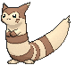
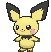
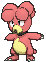
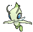

# Johto Pokémon

---

## #152 Chikorita

**Location**: Route 101

**Ability 2**: Natural Cure **

**Level Up Moves:**

| Moves | Level |     | Cont. | Level |
| ----- | ----- | --- | ----- | ----- |
| Tackle | 1 |   | Giga Drain | 21 |
| Growl | 1 |   | Ancient Power | 23 |
| Razor Leaf | 5 |   | Body Slam | 25 |
| Poison Powder | 7 |   | Sweet Scent | 28 |
| Synthesis | 9 |   | Light Screen | 31 |
| Grass Whistle | 11 |   | Safeguard | 34 |
| Nature Power | 13 |   | Aromatherapy | 37 |
| Magical Leaf | 15 |   | Solar Beam | 40 |
| Reflect | 17 |   | Leaf Storm | 43 |
| Natural Gift | 19 |   |   |   |

---

## #153 Bayleef

**Location**: Evolve Chikorita (Lv. 16)

**Ability 2**: Natural Cure **

**Level Up Moves:**

| Moves | Level |     | Cont. | Level |
| ----- | ----- | --- | ----- | ----- |
| Tackle | 1 |   | Giga Drain | 24 |
| Growl | 1 |   | Ancient Power | 27 |
| Razor Leaf | 5 |   | Body Slam | 30 |
| Poison Powder | 7 |   | Sweet Scent | 34 |
| Synthesis | 9 |   | Light Screen | 38 |
| Grass Whistle | 11 |   | Safeguard | 42 |
| Nature Power | 13 |   | Aromatherapy | 46 |
| Magical Leaf | 15 |   | Solar Beam | 50 |
| Reflect | 18 |   | Leaf Storm | 54 |
| Natural Gift | 21 |   |   |   |

---

## #154 Meganium

**Location**: Evolve Bayleef (Lv. 32)

**Ability 2**: Natural Cure **

**Level Up Moves:**

| Moves | Level |     | Cont. | Level |
| ----- | ----- | --- | ----- | ----- |
| Tackle | 1 |   | Ancient Power | 27 |
| Growl | 1 |   | Body Slam | 30 |
| Razor Leaf | 5 |   | Petal Dance | 32 |
| Poison Powder | 7 |   | Petal Blizzard | 32 |
| Synthesis | 9 |   | Sweet Scent | 35 |
| Grass Whistle | 11 |   | Light Screen | 40 |
| Nature Power | 13 |   | Safeguard | 45 |
| Magical Leaf | 15 |   | Aromatherapy | 50 |
| Reflect | 18 |   | Solar Beam | 55 |
| Natural Gift | 21 |   | Leaf Storm | 60 |
| Giga Drain | 24 |   |   |   |

---

## #155 Cyndaquil

**Location**: Rusturf Tunnel

**Ability 2**: Flash Fire

**Level Up Moves:**

| Moves | Level |     | Cont. | Level |
| ----- | ----- | --- | ----- | ----- |
| Tackle | 1 |   | Swift | 19 |
| Leer | 1 |   | Flame Charge | 21 |
| Ember | 5 |   | Rollout | 24 |
| Smokescreen | 7 |   | Extrasensory | 27 |
| Quick Attack | 9 |   | Lava Plume | 30 |
| Reversal | 11 |   | Double-Edge | 33 |
| Flame Wheel | 13 |   | Flamethrower | 36 |
| Defense Curl | 15 |   | Inferno | 39 |
| Flame Burst | 17 |   | Eruption | 42 |

---

## #156 Quilava

**Location**: Evolve Cyndaquil (Lv. 14)

**Ability 2**: Flash Fire

**Level Up Moves:**

| Moves | Level |     | Cont. | Level |
| ----- | ----- | --- | ----- | ----- |
| Tackle | 1 |   | Swift | 20 |
| Leer | 1 |   | Flame Charge | 23 |
| Ember | 5 |   | Rollout | 27 |
| Smokescreen | 7 |   | Extrasensory | 31 |
| Quick Attack | 9 |   | Lava Plume | 35 |
| Reversal | 11 |   | Double-Edge | 39 |
| Flame Wheel | 13 |   | Flamethrower | 43 |
| Defense Curl | 15 |   | Inferno | 47 |
| Flame Burst | 17 |   | Eruption | 51 |

---

## #157 Typhlosion

**Location**: Evolve Quilava (Lv. 36)

**Ability 2**: Flash Fire

**Level Up Moves:**

| Moves | Level |     | Cont. | Level |
| ----- | ----- | --- | ----- | ----- |
| Eruption | 1 |   | Flame Burst | 17 |
| Fire Punch | 1 |   | Swift | 20 |
| Thunder Punch | 1 |   | Flame Charge | 23 |
| Tackle | 1 |   | Rollout | 27 |
| Leer | 1 |   | Extrasensory | 31 |
| Ember | 5 |   | Lava Plume | 35 |
| Smokescreen | 7 |   | Double-Edge | 40 |
| Quick Attack | 9 |   | Flamethrower | 45 |
| Reversal | 11 |   | Inferno | 50 |
| Flame Wheel | 13 |   | Eruption | 55 |
| Defense Curl | 15 |   |   |   |

---

## #158 Totodile

**Location**: Route 104 South

**Ability 2**: Sheer Force

**Level Up Moves:**

| Moves | Level |     | Cont. | Level |
| ----- | ----- | --- | ----- | ----- |
| Scratch | 1 |   | Chip Away | 21 |
| Leer | 1 |   | Aqua Tail | 23 |
| Water Gun | 5 |   | Slash | 25 |
| Rage | 7 |   | Crunch | 28 |
| Bite | 9 |   | Screech | 31 |
| Scary Face | 11 |   | Thrash | 34 |
| Metal Claw | 13 |   | Dragon Dance | 37 |
| Aqua Jet | 15 |   | Superpower | 40 |
| Ice Fang | 17 |   | Hydro Pump | 43 |
| Flail | 19 |   |   |   |

---

## #159 Croconaw

**Evolution**: Evolve Totodile (Lv. 18)

**Ability 2**: Sheer Force

**Level Up Moves:**

| Moves | Level |     | Cont. | Level |
| ----- | ----- | --- | ----- | ----- |
| Scratch | 1 |   | Chip Away | 23 |
| Leer | 1 |   | Aqua Tail | 26 |
| Water Gun | 5 |   | Slash | 29 |
| Rage | 7 |   | Crunch | 33 |
| Bite | 9 |   | Screech | 37 |
| Scary Face | 11 |   | Thrash | 41 |
| Metal Claw | 13 |   | Dragon Dance | 45 |
| Aqua Jet | 15 |   | Superpower | 49 |
| Ice Fang | 17 |   | Hydro Pump | 53 |
| Flail | 20 |   |   |   |

---

## #160 Feraligatr

**Location**: Evolve Croconaw (Lv. 30)

**Ability 2**: Sheer Force

**Level Up Moves:**

| Moves | Level |     | Cont. | Level |
| ----- | ----- | --- | ----- | ----- |
| Ice Punch | 1 |   | Chip Away | 23 |
| Scratch | 1 |   | Aqua Tail | 26 |
| Leer | 1 |   | Slash | 29 |
| Water Gun | 5 |   | Agility | 30 |
| Rage | 7 |   | Crunch | 34 |
| Bite | 9 |   | Screech | 39 |
| Scary Face | 11 |   | Thrash | 44 |
| Metal Claw | 13 |   | Dragon Dance | 49 |
| Aqua Jet | 15 |   | Superpower | 54 |
| Ice Fang | 17 |   | Hydro Pump | 59 |
| Flail | 20 |   |   |   |

---

## #161 Sentret

**Location**: Route 101

**Level Up Moves:**

| Moves | Level |     | Cont. | Level |
| ----- | ----- | --- | ----- | ----- |
| Scratch | 1 |   | Rest | 22 |
| Foresight | 1 |   | Sucker Punch | 25 |
| Defense Curl | 4 |   | Amnesia | 28 |
| Quick Attack | 7 |   | Hyper Voice | 31 |
| Fury Swipes | 10 |   | Me First | 34 |
| Helping Hand | 13 |   | Baton Pass | 37 |
| Slam | 16 |   | Double-Edge | 40 |
| Follow Me | 19 |   |   |   |

---

## #162 Furret

**Location**: Safari Zone

**Ability 1**: Run Away >> Limber **

**Base Stat Changes:**

| Stat | Base | Change |
| ---- | ---- | ------ |
| HP | 85 | 95 |
| Attack | 76 | 85 |
| Defense | 64 | 65 |
| Sp. Attack | 45 | 40 |
| Speed | 90 | 100 |
| Total | 415 | 440 |

**Level Up Moves:**

| Moves | Level |     | Cont. | Level |
| ----- | ----- | --- | ----- | ----- |
| Double-Edge | 1 |   | Slash | 15 |
| Aqua Tail | 1 |   | Slam | 17 |
| Iron Tail | 1 |   | Follow Me | 21 |
| Covet | 1 |   | Rest | 25 |
| Scratch | 1 |   | Sucker Punch | 29 |
| Foresight | 1 |   | Amnesia | 33 |
| Defense Curl | 4 |   | Hyper Voice | 37 |
| Quick Attack | 7 |   | Me First | 41 |
| Fury Swipes | 10 |   | Baton Pass | 45 |
| Helping Hand | 13 |   | Double-Edge | 49 |

---

## #163 Hoothoot

**Location**: Route 103, Mt. Pyre

**Effort Values**: 1 HP >> 1 Sp. Def

**Base Stat Changes:**

| Stat | Base | Change |
| ---- | ---- | ------ |
| Attack | 30 | 25 |
| Defense | 30 | 25 |
| Sp. Attack | 36 | 45 |
| Sp. Defense | 56 | 65 |
| Total | 262 | 270 |

**Level Up Moves:**

| Moves | Level |     | Cont. | Level |
| ----- | ----- | --- | ----- | ----- |
| Tackle | 1 |   | Extrasensory | 24 |
| Growl | 1 |   | Take Down | 27 |
| Foresight | 1 |   | Air Slash | 30 |
| Hypnosis | 1 |   | Synchronoise | 33 |
| Echoed Voice | 6 |   | Zen Headbutt | 36 |
| Peck | 9 |   | Psycho Shift | 39 |
| Uproar | 12 |   | Psychic | 42 |
| Air Cutter | 15 |   | Roost | 45 |
| Confusion | 18 |   | Dream Eater | 48 |
| Reflect | 21 |   | Hurricane | 51 |

---

## #164 Noctowl

**Location**: Safari Zone, Mt. Pyre

**Ability 2**: Keen Eye >> Analytic

**Effort Values**: 2 HP >> 2 Sp. Def

**Type**: Normal/Flying >> Psychic/Flying

**Base Stat Changes:**

| Stat | Base | Change |
| ---- | ---- | ------ |
| Attack | 50 | 30 |
| Defense | 50 | 60 |
| Sp. Attack | 76 | 90 |
| Sp. Defense | 96 | 110 |
| Speed | 70 | 75 |
| Total | 442 | 465 |

**Level Up Moves:**

| Moves | Level |     | Cont. | Level |
| ----- | ----- | --- | ----- | ----- |
| Hurricane | 1 |   | Confusion | 18 |
| Dream Eater | 1 |   | Reflect | 22 |
| Sky Attack | 1 |   | Extrasensory | 26 |
| Heat Wave | 1 |   | Take Down | 30 |
| Hyper Voice | 1 |   | Air Slash | 34 |
| Tackle | 1 |   | Synchronoise | 38 |
| Growl | 1 |   | Zen Headbutt | 42 |
| Foresight | 1 |   | Psycho Shift | 46 |
| Hypnosis | 1 |   | Psychic | 50 |
| Echoed Voice | 6 |   | Roost | 54 |
| Peck | 9 |   | Dream Eater | 58 |
| Uproar | 12 |   | Hurricane | 62 |
| Air Cutter | 15 |   |   |   |

---

## #165 Ledyba

**Location**: Route 104 North

**Base Stat Changes:**

| Stat | Base | Change |
| ---- | ---- | ------ |
| Attack | 20 | 50 |
| Sp. Attack | 40 | 20 |
| Total | 265 | 275 |

**Level Up Moves:**

| Moves | Level |     | Cont. | Level |
| ----- | ----- | --- | ----- | ----- |
| Tackle | 1 |   | Drain Punch | 20 |
| Supersonic | 1 |   | Acrobatics | 22 |
| Comet Punch | 6 |   | Baton Pass | 24 |
| Bug Bite | 8 |   | U-turn | 26 |
| Light Screen | 10 |   | Agility | 28 |
| Reflect | 10 |   | Silver Wind | 30 |
| Aerial Ace | 12 |   | Double-Edge | 32 |
| Safeguard | 14 |   | Focus Punch | 34 |
| Mach Punch | 16 |   | Bug Buzz | 36 |
| Swift | 18 |   | Meteor Mash | 38 |

---

## #166 Ledian

**Location**: Safari Zone

**New TM/HMs**: Fly

**Base Stat Changes:**

| Stat | Base | Change |
| ---- | ---- | ------ |
| Attack | 35 | 110 |
| Sp. Attack | 55 | 40 |
| Total | 390 | 450 |

**Level Up Moves:**

| Moves | Level |     | Cont. | Level |
| ----- | ----- | --- | ----- | ----- |
| Tackle | 1 |   | Swift | 19 |
| Supersonic | 1 |   | Drain Punch | 22 |
| Comet Punch | 6 |   | Acrobatics | 25 |
| Bug Bite | 8 |   | Baton Pass | 28 |
| Light Screen | 10 |   | U-turn | 31 |
| Reflect | 10 |   | Agility | 34 |
| Aerial Ace | 12 |   | Silver Wind | 37 |
| Safeguard | 14 |   | Double-Edge | 40 |
| Mach Punch | 16 |   | Focus Punch | 43 |
| Thunder Punch | 18 |   | Bug Buzz | 46 |
| Ice Punch | 18 |   | Meteor Mash | 49 |

---

## #167 Spinarak

**Location**: Rusturf Tunnel

**Base Stat Changes:**

| Stat | Base | Change |
| ---- | ---- | ------ |
| Attack | 60 | 70 |
| Speed | 30 | 40 |
| Total | 250 | 270 |

**Level Up Moves:**

| Moves | Level |     | Cont. | Level |
| ----- | ----- | --- | ----- | ----- |
| Poison Sting | 1 |   | Cross Poison | 22 |
| String Shot | 1 |   | Night Slash | 24 |
| Electroweb | 1 |   | Sucker Punch | 26 |
| Scary Face | 6 |   | Spider Web | 28 |
| Constrict | 8 |   | Agility | 30 |
| Leech Life | 10 |   | Pin Missile | 32 |
| Bug Bite | 12 |   | Psychic | 34 |
| Night Shade | 14 |   | Poison Jab | 36 |
| Shadow Sneak | 16 |   | Sticky Web | 38 |
| X-Scissor | 18 |   | Megahorn | 40 |
| Fury Swipes | 20 |   |   |   |

---

## #168 Ariados

**Location**: Safari Zone, Sky Pillar

**Base Stat Changes:**

| Stat | Base | Change |
| ---- | ---- | ------ |
| Attack | 90 | 120 |
| Sp. Attack | 60 | 50 |
| Speed | 40 | 80 |
| Total | 390 | 450 |

**Level Up Moves:**

| Moves | Level |     | Cont. | Level |
| ----- | ----- | --- | ----- | ----- |
| Venom Drench | 1 |   | Fury Swipes | 20 |
| Fell Stinger | 1 |   | Cross Poison | 23 |
| Poison Sting | 1 |   | Night Slash | 26 |
| String Shot | 1 |   | Sucker Punch | 29 |
| Electroweb | 1 |   | Spider Web | 32 |
| Scary Face | 6 |   | Agility | 35 |
| Constrict | 8 |   | Pin Missile | 38 |
| Leech Life | 10 |   | Psychic | 41 |
| Bug Bite | 12 |   | Poison Jab | 44 |
| Night Shade | 14 |   | Sticky Web | 47 |
| Shadow Sneak | 16 |   | Megahorn | 50 |
| X-Scissor | 18 |   |   |   |

---

## #169 Crobat

**Location**: Meteor Falls

**Ability 2**: Infiltrator

**Level Up Moves:**

| Moves | Level |     | Cont. | Level |
| ----- | ----- | --- | ----- | ----- |
| Cross Poison | 1 |   | Swift | 27 |
| Screech | 1 |   | Acrobatics | 31 |
| Leech Life | 1 |   | Giga Drain | 35 |
| Supersonic | 1 |   | Mean Look | 39 |
| Leech Life | 4 |   | Haze | 43 |
| Bite | 7 |   | Venoshock | 47 |
| Wing Attack | 10 |   | Air Slash | 51 |
| Confuse Ray | 13 |   | Hypnosis | 55 |
| Feint Attack | 16 |   | Brave Bird | 59 |
| Air Cutter | 19 |   | Quick Guard | 63 |
| Poison Fang | 23 |   |   |   |

---

## #170 Chinchou

**Location**: Route 108, Route 109, Route 124

**Level Up Moves:**

| Moves | Level |     | Cont. | Level |
| ----- | ----- | --- | ----- | ----- |
| Bubble | 1 |   | Discharge | 31 |
| Supersonic | 1 |   | Flail | 34 |
| Thunder Wave | 6 |   | Take Down | 39 |
| Electro Ball | 9 |   | Thunderbolt | 42 |
| Water Gun | 12 |   | Aqua Ring | 45 |
| Confuse Ray | 17 |   | Hydro Pump | 47 |
| Bubble Beam | 20 |   | Ion Deluge | 50 |
| Spark | 23 |   | Charge | 52 |
| Signal Beam | 28 |   |   |   |

---

## #171 Lanturn

**Location**: Route 108, Route 109, Route 124, Underwater

**Level Up Moves:**

| Moves | Level |     | Cont. | Level |
| ----- | ----- | --- | ----- | ----- |
| Eerie Impulse | 1 |   | Swallow | 27 |
| Bubble | 1 |   | Spit Up | 27 |
| Supersonic | 1 |   | Signal Beam | 29 |
| Thunder Wave | 1 |   | Discharge | 33 |
| Electro Ball | 1 |   | Flail | 37 |
| Thunder Wave | 6 |   | Take Down | 43 |
| Electro Ball | 9 |   | Thunderbolt | 47 |
| Water Gun | 12 |   | Aqua Ring | 51 |
| Confuse Ray | 17 |   | Hydro Pump | 54 |
| Bubble Beam | 20 |   | Ion Deluge | 58 |
| Spark | 23 |   | Charge | 61 |
| Stockpile | 27 |   |   |   |

---

## #172 Pichu

**Location**: Petalburg Woods

**Ability 2**: Lightning Rod

**Base Happiness**: 70 >> 200

**Level Up Moves:**

| Moves | Level |     | Cont. | Level |
| ----- | ----- | --- | ----- | ----- |
| Thunder Shock | 1 |   | Sweet Kiss | 9 |
| Charm | 1 |   | Nasty Plot | 13 |
| Tail Whip | 5 |   | Thunder Wave | 17 |

---

## #173 Cleffa

**Location**: Meteor Falls

**Base Happiness**: 70 >> 200

**Level Up Moves:**

| Moves | Level |     | Cont. | Level |
| ----- | ----- | --- | ----- | ----- |
| Round | 1 |   | Sweet Kiss | 10 |
| Charm | 1 |   | Copycat | 13 |
| Encore | 4 |   | Magical Leaf | 16 |
| Sing | 7 |   |   |   |

---

## #174 Igglybuff

**Location**: Route 115

**Base Happiness**: 70 >> 200

**Level Up Moves:**

| Moves | Level |     | Cont. | Level |
| ----- | ----- | --- | ----- | ----- |
| Sing | 1 |   | Pound | 5 |
| Charm | 1 |   | Sweet Kiss | 9 |
| Defense Curl | 3 |   | Copycat | 11 |

---

## #175 Togepi

**Location**: Route 104 North

**Base Happiness**: 70 >> 180

**Level Up Moves:**

| Moves | Level |     | Cont. | Level |
| ----- | ----- | --- | ----- | ----- |
| Growl | 1 |   | Ancient Power | 24 |
| Charm | 1 |   | Follow Me | 27 |
| Metronome | 1 |   | Bestow | 30 |
| Extrasensory | 1 |   | Wish | 33 |
| Fairy Wind | 6 |   | Safeguard | 36 |
| Sweet Kiss | 9 |   | Baton Pass | 39 |
| Yawn | 12 |   | Double-Edge | 42 |
| Draining Kiss | 15 |   | Last Resort | 45 |
| Encore | 18 |   | After You | 48 |
| Nasty Plot | 21 |   |   |   |

---

## #176 Togetic

**Location**: Evolve Togepi (Happiness)

**Level Up Moves:**

| Moves | Level |     | Cont. | Level |
| ----- | ----- | --- | ----- | ----- |
| Silver Wind | 1 |   | Air Cutter | 21 |
| Magical Leaf | 1 |   | Ancient Power | 24 |
| Growl | 1 |   | Follow Me | 27 |
| Charm | 1 |   | Bestow | 30 |
| Metronome | 1 |   | Wish | 33 |
| Extrasensory | 1 |   | Safeguard | 36 |
| Fairy Wind | 6 |   | Baton Pass | 39 |
| Sweet Kiss | 9 |   | Double-Edge | 42 |
| Yawn | 12 |   | Last Resort | 45 |
| Draining Kiss | 15 |   | After You | 48 |
| Encore | 18 |   |   |   |

---

## #177 Natu

**Location**: Route 116, Mt. Pyre

**Level Up Moves:**

| Moves | Level |     | Cont. | Level |
| ----- | ----- | --- | ----- | ----- |
| Peck | 1 |   | Wish | 27 |
| Leer | 1 |   | Psychic | 30 |
| Night Shade | 6 |   | Miracle Eye | 33 |
| Stored Power | 9 |   | Lucky Chant | 36 |
| Calm Mind | 12 |   | Psycho Shift | 39 |
| Air Cutter | 15 |   | Future Sight | 42 |
| Teleport | 18 |   | Guard Swap | 45 |
| Ominous Wind | 21 |   | Power Swap | 45 |
| Confuse Ray | 24 |   | Me First | 48 |

---

## #178 Xatu

**Location**: Mt. Pyre

**Level Up Moves:**

| Moves | Level |     | Cont. | Level |
| ----- | ----- | --- | ----- | ----- |
| Hurricane | 1 |   | Confuse Ray | 24 |
| Tailwind | 1 |   | Air Slash | 25 |
| Silver Wind | 1 |   | Wish | 28 |
| Giga Drain | 1 |   | Psychic | 32 |
| Heat Wave | 1 |   | Miracle Eye | 36 |
| Peck | 1 |   | Lucky Chant | 40 |
| Leer | 1 |   | Psycho Shift | 44 |
| Night Shade | 6 |   | Future Sight | 48 |
| Stored Power | 9 |   | Guard Swap | 52 |
| Calm Mind | 12 |   | Power Swap | 52 |
| Air Cutter | 15 |   | Me First | 56 |
| Teleport | 18 |   | Hurricane | 60 |
| Ominous Wind | 21 |   |   |   |

---

## #179 Mareep

**Location**: Route 116

**Level Up Moves:**

| Moves | Level |     | Cont. | Level |
| ----- | ----- | --- | ----- | ----- |
| Tackle | 1 |   | Power Gem | 25 |
| Growl | 1 |   | Discharge | 28 |
| Thunder Wave | 4 |   | Confuse Ray | 31 |
| Thunder Shock | 7 |   | Signal Beam | 34 |
| Cotton Spore | 10 |   | Thunderbolt | 37 |
| Shock Wave | 13 |   | Cotton Guard | 40 |
| Charge | 16 |   | Light Screen | 43 |
| Take Down | 19 |   | Thunder | 46 |
| Electro Ball | 22 |   |   |   |

---

## #180 Flaaffy

**Location**: Route 121

**Level Up Moves:**

| Moves | Level |     | Cont. | Level |
| ----- | ----- | --- | ----- | ----- |
| Tackle | 1 |   | Power Gem | 28 |
| Growl | 1 |   | Discharge | 32 |
| Thunder Wave | 4 |   | Confuse Ray | 36 |
| Thunder Shock | 7 |   | Signal Beam | 40 |
| Cotton Spore | 10 |   | Thunderbolt | 44 |
| Shock Wave | 13 |   | Cotton Guard | 48 |
| Charge | 16 |   | Light Screen | 52 |
| Take Down | 20 |   | Thunder | 56 |
| Electro Ball | 24 |   |   |   |

---

## #181 Ampharos

**Location**: Evolve Flaaffy (Lv. 30)

**Level Up Moves:**

| Moves | Level |     | Cont. | Level |
| ----- | ----- | --- | ----- | ----- |
| Zap Cannon | 1 |   | Take Down | 20 |
| Magnetic Flux | 1 |   | Electro Ball | 24 |
| Ion Deluge | 1 |   | Power Gem | 28 |
| Fire Punch | 1 |   | Dragon Pulse | 30 |
| Thunder Punch | 1 |   | Discharge | 33 |
| Tackle | 1 |   | Confuse Ray | 38 |
| Growl | 1 |   | Signal Beam | 43 |
| Thunder Wave | 4 |   | Thunderbolt | 48 |
| Thunder Shock | 7 |   | Cotton Guard | 53 |
| Cotton Spore | 10 |   | Light Screen | 58 |
| Shock Wave | 13 |   | Thunder | 63 |
| Charge | 16 |   | Tail Glow | 68 |

---

## #182 Bellossom

**Location**: Evolve Gloom (Sun Stone)

**Ability 2**: Healer

**Move Tutor**: Earth Power

**Level Up Moves:**

| Moves | Level |     | Cont. | Level |
| ----- | ----- | --- | ----- | ----- |
| Earth Power | 1 |   | Sunny Day | 1 |
| Leaf Storm | 1 |   | Magical Leaf | 24 |
| Leaf Blade | 1 |   | Petal Blizzard | 34 |
| Mega Drain | 1 |   | Leaf Storm | 44 |
| Sweet Scent | 1 |   | Quiver Dance | 54 |
| Stun Spore | 1 |   |   |   |

---

## #183 Marill

**Location**: Petalburg City, Route 123

**Level Up Moves:**

| Moves | Level |     | Cont. | Level |
| ----- | ----- | --- | ----- | ----- |
| Tackle | 1 |   | Helping Hand | 16 |
| Water Gun | 1 |   | Aqua Tail | 20 |
| Tail Whip | 2 |   | Play Rough | 23 |
| Water Sport | 5 |   | Aqua Ring | 28 |
| Bubble | 7 |   | Rain Dance | 31 |
| Defense Curl | 10 |   | Double-Edge | 37 |
| Rollout | 10 |   | Superpower | 40 |
| Bubble Beam | 13 |   | Hydro Pump | 47 |

---

## #184 Azumarill

**Location**: Petalburg City, Route 123, Victory Road

**Base Stat Changes:**

| Stat | Base | Change |
| ---- | ---- | ------ |
| Sp. Attack | 60 | 80 |
| Total | 420 | 440 |

**Level Up Moves:**

| Moves | Level |     | Cont. | Level |
| ----- | ----- | --- | ----- | ----- |
| Tackle | 1 |   | Helping Hand | 16 |
| Water Gun | 1 |   | Aqua Tail | 21 |
| Tail Whip | 2 |   | Play Rough | 25 |
| Water Sport | 5 |   | Aqua Ring | 31 |
| Bubble | 7 |   | Rain Dance | 35 |
| Defense Curl | 10 |   | Double-Edge | 42 |
| Rollout | 10 |   | Superpower | 46 |
| Bubble Beam | 13 |   | Hydro Pump | 55 |

---

## #185 Sudowoodo

**Location**: Safari Zone

**Base Stat Changes:**

| Stat | Base | Change |
| ---- | ---- | ------ |
| HP | 70 | 80 |
| Attack | 100 | 110 |
| Defense | 115 | 125 |
| Sp. Attack | 30 | 40 |
| Sp. Defense | 65 | 75 |
| Total | 410 | 460 |

**Level Up Moves:**

| Moves | Level |     | Cont. | Level |
| ----- | ----- | --- | ----- | ----- |
| Wood Hammer | 1 |   | Feint Attack | 19 |
| Copycat | 1 |   | Rock Tomb | 22 |
| Flail | 1 |   | Block | 26 |
| Low Kick | 1 |   | Rock Slide | 29 |
| Rock Throw | 1 |   | Counter | 33 |
| Flail | 5 |   | Sucker Punch | 36 |
| Low Kick | 8 |   | Double-Edge | 40 |
| Rock Throw | 12 |   | Stone Edge | 43 |
| Mimic | 15 |   | Hammer Arm | 47 |
| Slam | 15 |   |   |   |

---

## #186 Politoed

**Location**: Evolve Poliwhirl (King's Rock)

**Level Up Moves:**

| Moves | Level |     | Cont. | Level |
| ----- | ----- | --- | ----- | ----- |
| Bubble Beam | 1 |   | Round | 30 |
| Hypnosis | 1 |   | Bounce | 35 |
| Double Slap | 1 |   | Mud Bomb | 40 |
| Perish Song | 1 |   | Hyper Voice | 45 |
| Swagger | 25 |   |   |   |

---

## #187 Hoppip

**Location**: Route 104 North, Route 114

**New TM/HMs**: Fly

**Base Stat Changes:**

| Stat | Base | Change |
| ---- | ---- | ------ |
| Attack | 35 | 50 |
| Sp. Attack | 35 | 50 |
| Sp. Defense | 55 | 60 |
| Speed | 50 | 55 |
| Total | 250 | 280 |

**Level Up Moves:**

| Moves | Level |     | Cont. | Level |
| ----- | ----- | --- | ----- | ----- |
| Splash | 1 |   | Leech Seed | 20 |
| Synthesis | 1 |   | Giga Drain | 22 |
| Tail Whip | 1 |   | Silver Wind | 24 |
| Tackle | 4 |   | Rage Powder | 26 |
| Mega Drain | 6 |   | Cotton Spore | 28 |
| Fairy Wind | 8 |   | U-turn | 30 |
| Poison Powder | 10 |   | Worry Seed | 32 |
| Stun Spore | 12 |   | Bounce | 34 |
| Sleep Powder | 14 |   | Memento | 36 |
| Acrobatics | 16 |   | Cotton Guard | 38 |
| Bullet Seed | 18 |   |   |   |

---

## #188 Skiploom

**Location**: Route 114

**New TM/HMs**: Fly

**Base Stat Changes:**

| Stat | Base | Change |
| ---- | ---- | ------ |
| Attack | 45 | 65 |
| Sp. Attack | 45 | 65 |
| Sp. Defense | 65 | 75 |
| Total | 340 | 390 |

**Level Up Moves:**

| Moves | Level |     | Cont. | Level |
| ----- | ----- | --- | ----- | ----- |
| Splash | 1 |   | Leech Seed | 22 |
| Synthesis | 1 |   | Giga Drain | 25 |
| Tail Whip | 1 |   | Silver Wind | 28 |
| Tackle | 4 |   | Rage Powder | 31 |
| Mega Drain | 6 |   | Cotton Spore | 34 |
| Fairy Wind | 8 |   | U-turn | 37 |
| Poison Powder | 10 |   | Worry Seed | 40 |
| Stun Spore | 12 |   | Bounce | 43 |
| Sleep Powder | 14 |   | Memento | 46 |
| Acrobatics | 16 |   | Cotton Guard | 49 |
| Bullet Seed | 19 |   |   |   |

---

## #189 Jumpluff

**Location**: Evolve Skiploom (Lv. 27)

**New TM/HMs**: Fly

**Base Stat Changes:**

| Stat | Base | Change |
| ---- | ---- | ------ |
| Attack | 55 | 75 |
| Sp. Attack | 55 | 75 |
| Total | 460 | 500 |

**Level Up Moves:**

| Moves | Level |     | Cont. | Level |
| ----- | ----- | --- | ----- | ----- |
| Splash | 1 |   | Leech Seed | 22 |
| Synthesis | 1 |   | Giga Drain | 25 |
| Tail Whip | 1 |   | Silver Wind | 29 |
| Tackle | 4 |   | Rage Powder | 33 |
| Mega Drain | 6 |   | Cotton Spore | 37 |
| Fairy Wind | 8 |   | U-turn | 41 |
| Poison Powder | 10 |   | Worry Seed | 45 |
| Stun Spore | 12 |   | Bounce | 49 |
| Sleep Powder | 14 |   | Memento | 53 |
| Acrobatics | 16 |   | Cotton Guard | 57 |
| Bullet Seed | 19 |   |   |   |

---

## #190 Aipom

**Location**: Jagged Pass

**Level Up Moves:**

| Moves | Level |     | Cont. | Level |
| ----- | ----- | --- | ----- | ----- |
| Scratch | 1 |   | Screech | 25 |
| Tail Whip | 1 |   | Agility | 27 |
| Sand Attack | 4 |   | Acrobatics | 29 |
| Astonish | 8 |   | Fake Out | 30 |
| Baton Pass | 11 |   | Double Hit | 32 |
| Tickle | 14 |   | Fling | 35 |
| Fury Swipes | 17 |   | Nasty Plot | 38 |
| Swift | 20 |   | Bounce | 42 |
| Knock Off | 23 |   | Last Resort | 45 |

---

## #191 Sunkern

**Location**: Route 115

**Level Up Moves:**

| Moves | Level |     | Cont. | Level |
| ----- | ----- | --- | ----- | ----- |
| Absorb | 1 |   | Giga Drain | 22 |
| Growth | 1 |   | Endeavor | 25 |
| Ingrain | 4 |   | Synthesis | 28 |
| Grass Whistle | 7 |   | Natural Gift | 31 |
| Mega Drain | 10 |   | Solar Beam | 34 |
| Leech Seed | 13 |   | Double-Edge | 37 |
| Razor Leaf | 16 |   | Sunny Day | 40 |
| Worry Seed | 19 |   | Seed Bomb | 43 |

---

## #192 Sunflora

**Location**: Evolve Sunkern (Sun Stone)

**Base Stat Changes:**

| Stat | Base | Change |
| ---- | ---- | ------ |
| HP | 75 | 95 |
| Attack | 75 | 55 |
| Defense | 55 | 95 |
| Sp. Attack | 105 | 125 |
| Sp. Defense | 85 | 105 |
| Total | 425 | 505 |

**Level Up Moves:**

| Moves | Level |     | Cont. | Level |
| ----- | ----- | --- | ----- | ----- |
| Flower Shield | 1 |   | Bullet Seed | 25 |
| Absorb | 1 |   | Petal Dance | 28 |
| Pound | 1 |   | Natural Gift | 31 |
| Growth | 1 |   | Solar Beam | 34 |
| Ingrain | 4 |   | Double-Edge | 37 |
| Grass Whistle | 7 |   | Sunny Day | 40 |
| Mega Drain | 10 |   | Mystical Fire | 43 |
| Leech Seed | 13 |   | Earth Power | 46 |
| Razor Leaf | 16 |   | Petal Blizzard | 49 |
| Worry Seed | 19 |   | Leaf Storm | 52 |
| Giga Drain | 22 |   |   |   |

---

## #193 Yanma

**Location**: Route 115

**New TM/HMs**: Fly

**Level Up Moves:**

| Moves | Level |     | Cont. | Level |
| ----- | ----- | --- | ----- | ----- |
| Tackle | 1 |   | Uproar | 30 |
| Foresight | 1 |   | Ancient Power | 34 |
| Quick Attack | 1 |   | Signal Beam | 38 |
| Double Team | 6 |   | Air Slash | 42 |
| Sonic Boom | 10 |   | Hypnosis | 46 |
| Wing Attack | 14 |   | U-turn | 50 |
| Silver Wind | 18 |   | Screech | 54 |
| Detect | 22 |   | Bug Buzz | 58 |
| Supersonic | 26 |   |   |   |

---

## #194 Wooper

**Location**: Route 110

**Base Stat Changes:**

| Stat | Base | Change |
| ---- | ---- | ------ |
| Attack | 45 | 55 |
| Defense | 45 | 55 |
| Total | 210 | 230 |

**Level Up Moves:**

| Moves | Level |     | Cont. | Level |
| ----- | ----- | --- | ----- | ----- |
| Water Gun | 1 |   | Yawn | 30 |
| Tail Whip | 1 |   | Earthquake | 34 |
| Mud Sport | 6 |   | Rain Dance | 38 |
| Mud Shot | 10 |   | Mist | 42 |
| Slam | 14 |   | Haze | 42 |
| Mud Bomb | 18 |   | Muddy Water | 46 |
| Aqua Tail | 22 |   | Recover | 50 |
| Amnesia | 26 |   |   |   |

---

## #195 Quagsire

**Location**: Route 110, Route 119

**Base Stat Changes:**

| Stat | Base | Change |
| ---- | ---- | ------ |
| Attack | 85 | 95 |
| Defense | 85 | 95 |
| Total | 430 | 450 |

**Level Up Moves:**

| Moves | Level |     | Cont. | Level |
| ----- | ----- | --- | ----- | ----- |
| Water Gun | 1 |   | Yawn | 32 |
| Tail Whip | 1 |   | Earthquake | 36 |
| Mud Sport | 6 |   | Rain Dance | 40 |
| Mud Shot | 10 |   | Mist | 44 |
| Slam | 14 |   | Haze | 44 |
| Mud Bomb | 18 |   | Muddy Water | 48 |
| Aqua Tail | 24 |   | Recover | 52 |
| Amnesia | 28 |   |   |   |

---

## #196 Espeon

**Location**: Evolve Eevee (Happiness, Day)

**Ability 2**: Magic Bounce

**Level Up Moves:**

| Moves | Level |     | Cont. | Level |
| ----- | ----- | --- | ----- | ----- |
| Power Gem | 1 |   | Psybeam | 20 |
| Helping Hand | 1 |   | Future Sight | 25 |
| Tackle | 1 |   | Psych Up | 29 |
| Tail Whip | 1 |   | Morning Sun | 33 |
| Sand Attack | 5 |   | Psychic | 37 |
| Confusion | 9 |   | Last Resort | 41 |
| Quick Attack | 13 |   | Power Swap | 45 |
| Swift | 17 |   | Mystical Fire | 50 |

---

## #197 Umbreon

**Location**: Evolve Eevee (Happiness, Night)

**Ability 2**: Poison Touch **

**Level Up Moves:**

| Moves | Level |     | Cont. | Level |
| ----- | ----- | --- | ----- | ----- |
| Helping Hand | 1 |   | Assurance | 25 |
| Tackle | 1 |   | Screech | 29 |
| Tail Whip | 1 |   | Moonlight | 33 |
| Sand Attack | 5 |   | Mean Look | 37 |
| Pursuit | 9 |   | Last Resort | 41 |
| Quick Attack | 13 |   | Guard Swap | 45 |
| Confuse Ray | 17 |   | Moonblast | 50 |
| Feint Attack | 20 |   |   |   |

---

## #198 Murkrow

**Location**: Jagged Pass, Mt. Pyre

**Level Up Moves:**

| Moves | Level |     | Cont. | Level |
| ----- | ----- | --- | ----- | ----- |
| Peck | 1 |   | Taunt | 34 |
| Astonish | 1 |   | Mean Look | 38 |
| Pursuit | 6 |   | Foul Play | 42 |
| Haze | 10 |   | Tailwind | 46 |
| Wing Attack | 14 |   | Sucker Punch | 50 |
| Night Shade | 18 |   | Brave Bird | 54 |
| Assurance | 22 |   | Torment | 58 |
| Feint Attack | 26 |   | Quash | 62 |
| Drill Peck | 30 |   |   |   |

---

## #199 Slowking

**Location**: Route 118

**New TM/HMs**: Waterfall

**Level Up Moves:**

| Moves | Level |     | Cont. | Level |
| ----- | ----- | --- | ----- | ----- |
| Wonder Room | 1 |   | Disable | 16 |
| Power Gem | 1 |   | Zen Headbutt | 19 |
| Hidden Power | 1 |   | Water Pulse | 22 |
| Ice Beam | 1 |   | Belch | 26 |
| Curse | 1 |   | Nasty Plot | 30 |
| Yawn | 1 |   | Swagger | 34 |
| Tackle | 1 |   | Psychic | 38 |
| Growl | 4 |   | Trump Card | 42 |
| Water Gun | 6 |   | Psych Up | 46 |
| Confusion | 8 |   | Heal Pulse | 50 |
| Incinerate | 11 |   | Wonder Room | 54 |
| Headbutt | 14 |   | Aura Sphere | 58 |

---

## #200 Misdreavus

**Location**: Route 114

**Type**: Ghost >> Ghost/Fairy

**Level Up Moves:**

| Moves | Level |     | Cont. | Level |
| ----- | ----- | --- | ----- | ----- |
| Growl | 1 |   | Power Gem | 23 |
| Psywave | 1 |   | Shadow Ball | 26 |
| Spite | 1 |   | Payback | 29 |
| Astonish | 5 |   | Pain Split | 32 |
| Confuse Ray | 8 |   | Moonblast | 36 |
| Mean Look | 11 |   | Perish Song | 40 |
| Hex | 14 |   | Grudge | 44 |
| Disarming Voice | 17 |   | Nasty Plot | 48 |
| Psybeam | 20 |   |   |   |

---

## #201 Unown

**Location**: Cave of Origin

**New TM/HMs**: Secret Power, Nature Power

**Base Stat Changes:**

| Stat | Base | Change |
| ---- | ---- | ------ |
| HP | 48 | 50 |
| Attack | 72 | 150 |
| Defense | 48 | 50 |
| Sp. Attack | 72 | 150 |
| Sp. Defense | 48 | 50 |
| Speed | 48 | 50 |
| Total | 336 | 500 |

**Level Up Moves:**

| Moves | Level |     | Cont. | Level |
| ----- | ----- | --- | ----- | ----- |
| Nature Power | 1 |   | Cosmic Power | 1 |
| Earth Power | 1 |   | Hidden Power | 1 |
| Secret Power | 1 |   | Stored Power | 1 |
| Ancient Power | 1 |   |   |   |

---

## #202 Wobbuffet

**Location**: Safari Zone

**Base Stat Changes:**

| Stat | Base | Change |
| ---- | ---- | ------ |
| HP | 190 | 240 |
| Attack | 33 | 30 |
| Defense | 58 | 60 |
| Sp. Attack | 33 | 30 |
| Sp. Defense | 58 | 60 |
| Speed | 33 | 30 |
| Total | 405 | 450 |

**Level Up Moves:**

| Moves | Level |     | Cont. | Level |
| ----- | ----- | --- | ----- | ----- |
| Safeguard | 1 |   | Destiny Bond | 1 |
| Counter | 1 |   | Mimic | 15 |
| Mirror Coat | 1 |   |   |   |

---

## #203 Girafarig

**Location**: Route 112 South

**Level Up Moves:**

| Moves | Level |     | Cont. | Level |
| ----- | ----- | --- | ----- | ----- |
| Power Swap | 1 |   | Psybeam | 18 |
| Guard Swap | 1 |   | Agility | 22 |
| Astonish | 1 |   | Double Hit | 26 |
| Tackle | 1 |   | Zen Headbutt | 30 |
| Growl | 1 |   | Crunch | 34 |
| Confusion | 1 |   | Baton Pass | 38 |
| Odor Sleuth | 6 |   | Nasty Plot | 42 |
| Assurance | 10 |   | Psychic | 46 |
| Stomp | 14 |   | Hyper Voice | 50 |

---

## #204 Pineco

**Location**: Jagged Pass

**Ability 2**: Overcoat

**Level Up Moves:**

| Moves | Level |     | Cont. | Level |
| ----- | ----- | --- | ----- | ----- |
| Tackle | 1 |   | Spikes | 27 |
| Protect | 1 |   | Payback | 30 |
| Self-Destruct | 6 |   | Gyro Ball | 33 |
| Bug Bite | 9 |   | Drill Run | 36 |
| Take Down | 12 |   | Explosion | 39 |
| Rapid Spin | 15 |   | Pin Missile | 42 |
| Bide | 18 |   | Iron Defense | 45 |
| Revenge | 21 |   | Double-Edge | 48 |
| Natural Gift | 24 |   |   |   |

---

## #205 Forretress

**Location**: Route 123

**Ability 2**: Overcoat

**Level Up Moves:**

| Moves | Level |     | Cont. | Level |
| ----- | ----- | --- | ----- | ----- |
| Heavy Slam | 1 |   | Payback | 30 |
| Zap Cannon | 1 |   | Mirror Shot | 31 |
| Toxic Spikes | 1 |   | Autotomize | 32 |
| Tackle | 1 |   | Gyro Ball | 34 |
| Protect | 1 |   | Drill Run | 38 |
| Self-Destruct | 6 |   | Explosion | 42 |
| Bug Bite | 9 |   | Pin Missile | 46 |
| Take Down | 12 |   | Iron Defense | 50 |
| Rapid Spin | 15 |   | Double-Edge | 54 |
| Bide | 18 |   | Magnet Rise | 58 |
| Revenge | 21 |   | Zap Cannon | 62 |
| Natural Gift | 24 |   | Heavy Slam | 66 |
| Spikes | 27 |   |   |   |

---

## #206 Dunsparce

**Location**: Fiery Path

**Ability 2**: Run Away >> Pixilate **

**Type**: Normal >> Normal/Fairy

**Base Stat Changes:**

| Stat | Base | Change |
| ---- | ---- | ------ |
| HP | 100 | 110 |
| Attack | 70 | 80 |
| Defense | 70 | 80 |
| Speed | 45 | 55 |
| Total | 415 | 455 |

**Level Up Moves:**

| Moves | Level |     | Cont. | Level |
| ----- | ----- | --- | ----- | ----- |
| Rage | 1 |   | Play Rough | 25 |
| Defense Curl | 1 |   | Glare | 28 |
| Rollout | 1 |   | Dig | 31 |
| Spite | 4 |   | Double-Edge | 34 |
| Pursuit | 7 |   | Coil | 37 |
| Screech | 10 |   | Endure | 40 |
| Yawn | 13 |   | Drill Run | 43 |
| Ancient Power | 16 |   | Endeavor | 46 |
| Take Down | 19 |   | Flail | 49 |
| Roost | 22 |   |   |   |

---

## #207 Gligar

**Location**: Jagged Pass

**Held Item**: Razor Fang (50%)

**New TM/HMs**: Fly

**Level Up Moves:**

| Moves | Level |     | Cont. | Level |
| ----- | ----- | --- | ----- | ----- |
| Poison Sting | 1 |   | Slash | 28 |
| Sand Attack | 4 |   | U-turn | 31 |
| Harden | 7 |   | Screech | 34 |
| Knock Off | 10 |   | X-Scissor | 37 |
| Quick Attack | 13 |   | Earthquake | 40 |
| Fury Cutter | 16 |   | Night Slash | 43 |
| Feint Attack | 19 |   | Sky Uppercut | 46 |
| Acrobatics | 22 |   | Swords Dance | 49 |
| Cross Poison | 25 |   | Guillotine | 52 |

---

## #208 Steelix

**Location**: Granite Cave, Scorched Slab, Victory Road

**Level Up Moves:**

| Moves | Level |     | Cont. | Level |
| ----- | ----- | --- | ----- | ----- |
| Thunder Fang | 1 |   | Dig | 20 |
| Ice Fang | 1 |   | Rock Slide | 22 |
| Fire Fang | 1 |   | Gyro Ball | 25 |
| Mud Sport | 1 |   | Slam | 28 |
| Tackle | 1 |   | Dragon Breath | 31 |
| Harden | 1 |   | Screech | 34 |
| Bind | 1 |   | Crunch | 37 |
| Curse | 4 |   | Iron Tail | 40 |
| Rock Throw | 7 |   | Stealth Rock | 43 |
| Rock Tomb | 10 |   | Stone Edge | 46 |
| Rage | 13 |   | Double-Edge | 49 |
| Smack Down | 16 |   | Sandstorm | 52 |
| Autotomize | 19 |   |   |   |

---

## #209 Snubbull

**Location**: Route 104 North

**Level Up Moves:**

| Moves | Level |     | Cont. | Level |
| ----- | ----- | --- | ----- | ----- |
| Tackle | 1 |   | Thunder Fang | 16 |
| Scary Face | 1 |   | Payback | 19 |
| Tail Whip | 1 |   | Play Rough | 22 |
| Charm | 1 |   | Roar | 25 |
| Headbutt | 7 |   | Rage | 28 |
| Bite | 10 |   | Crunch | 31 |
| Lick | 13 |   | Close Combat | 34 |
| Ice Fang | 16 |   | Wild Charge | 37 |
| Fire Fang | 16 |   | Double-Edge | 40 |

---

## #210 Granbull

**Location**: Route 123

**Level Up Moves:**

| Moves | Level |     | Cont. | Level |
| ----- | ----- | --- | ----- | ----- |
| Lovely Kiss | 1 |   | Thunder Fang | 16 |
| Tackle | 1 |   | Payback | 19 |
| Scary Face | 1 |   | Play Rough | 22 |
| Tail Whip | 1 |   | Roar | 26 |
| Charm | 1 |   | Rage | 30 |
| Headbutt | 7 |   | Crunch | 34 |
| Bite | 10 |   | Close Combat | 38 |
| Lick | 13 |   | Wild Charge | 42 |
| Ice Fang | 16 |   | Double-Edge | 46 |
| Fire Fang | 16 |   | Outrage | 50 |

---

## #211 Qwilfish

**Location**: Route 110, Route 114, Safari Zone

**Base Stat Changes:**

| Stat | Base | Change |
| ---- | ---- | ------ |
| Attack | 95 | 100 |
| Speed | 85 | 90 |
| Total | 430 | 450 |

**Level Up Moves:**

| Moves | Level |     | Cont. | Level |
| ----- | ----- | --- | ----- | ----- |
| Spikes | 1 |   | Aqua Jet | 18 |
| Tackle | 1 |   | Revenge | 21 |
| Poison Sting | 1 |   | Aqua Tail | 24 |
| Harden | 1 |   | Pin Missile | 27 |
| Minimize | 1 |   | Poison Jab | 30 |
| Bubble | 6 |   | Take Down | 33 |
| Rollout | 9 |   | Brine | 36 |
| Toxic Spikes | 12 |   | Destiny Bond | 39 |
| Stockpile | 15 |   | Hydro Pump | 42 |
| Spit Up | 15 |   | Fell Stinger | 45 |

---

## #212 Scizor

**Location**: Route 112 South

**Level Up Moves:**

| Moves | Level |     | Cont. | Level |
| ----- | ----- | --- | ----- | ----- |
| Feint | 1 |   | Metal Claw | 26 |
| Bullet Punch | 1 |   | False Swipe | 29 |
| Crabhammer | 1 |   | Razor Wind | 32 |
| Quick Attack | 1 |   | Iron Defense | 35 |
| Leer | 1 |   | X-Scissor | 38 |
| Focus Energy | 4 |   | Night Slash | 41 |
| Pursuit | 8 |   | Double Hit | 44 |
| Agility | 12 |   | Swords Dance | 48 |
| Fury Cutter | 16 |   | Iron Head | 52 |
| Slash | 20 |   | Feint | 56 |
| Bug Bite | 23 |   | Reversal | 60 |

---

## #213 Shuckle

**Location**: Lilycove City, Seafloor Cavern

**Level Up Moves:**

| Moves | Level |     | Cont. | Level |
| ----- | ----- | --- | ----- | ----- |
| Sticky Web | 1 |   | Rock Throw | 23 |
| Withdraw | 1 |   | Gastro Acid | 27 |
| Constrict | 1 |   | Power Trick | 31 |
| Bide | 1 |   | Shell Smash | 34 |
| Rollout | 1 |   | Rock Slide | 38 |
| Encore | 5 |   | Bug Bite | 42 |
| Wrap | 9 |   | Power Split | 45 |
| Struggle Bug | 12 |   | Guard Split | 45 |
| Safeguard | 16 |   | Stone Edge | 49 |
| Rest | 20 |   | Sticky Web | 53 |

---

## #214 Heracross

**Location**: Route 112 North

**Level Up Moves:**

| Moves | Level |     | Cont. | Level |
| ----- | ----- | --- | ----- | ----- |
| Arm Thrust | 1 |   | Counter | 19 |
| Bullet Seed | 1 |   | Bug Bite | 22 |
| Night Slash | 1 |   | Fury Attack | 25 |
| Tackle | 1 |   | Brick Break | 28 |
| Leer | 1 |   | Pin Missile | 31 |
| Horn Attack | 1 |   | Take Down | 34 |
| Endure | 1 |   | Megahorn | 37 |
| Feint | 7 |   | Rock Blast | 40 |
| Aerial Ace | 10 |   | Close Combat | 43 |
| Chip Away | 16 |   | Reversal | 46 |

---

## #215 Sneasel

**Location**: Shoal Cave

**Ability 2**: Keen Eye >> Technician **

**Held Item**: Razor Claw (50%), Quick Claw (5%)

**Level Up Moves:**

| Moves | Level |     | Cont. | Level |
| ----- | ----- | --- | ----- | ----- |
| Scratch | 1 |   | Hone Claws | 24 |
| Leer | 1 |   | Beat Up | 27 |
| Taunt | 1 |   | Screech | 30 |
| Icy Wind | 1 |   | Low Kick | 33 |
| Quick Attack | 6 |   | Slash | 36 |
| Feint Attack | 9 |   | Snatch | 39 |
| Ice Shard | 12 |   | Dark Pulse | 42 |
| Fury Swipes | 15 |   | Punishment | 45 |
| Agility | 18 |   | Icicle Crash | 48 |
| Metal Claw | 21 |   | Crunch | 51 |

---

## #216 Teddiursa

**Location**: Rusturf Tunnel

**Level Up Moves:**

| Moves | Level |     | Cont. | Level |
| ----- | ----- | --- | ----- | ----- |
| Covet | 1 |   | Night Slash | 23 |
| Scratch | 1 |   | Charm | 26 |
| Baby-Doll Eyes | 1 |   | Take Down | 29 |
| Lick | 1 |   | Rest | 32 |
| Fake Tears | 1 |   | Snore | 35 |
| Fury Swipes | 5 |   | Seed Bomb | 38 |
| Feint Attack | 8 |   | Play Rough | 41 |
| Sweet Scent | 11 |   | Thrash | 44 |
| Play Nice | 14 |   | Close Combat | 47 |
| Metal Claw | 17 |   | Fling | 50 |
| Slash | 20 |   |   |   |

---

## #217 Ursaring

**Location**: Victory Road

**Level Up Moves:**

| Moves | Level |     | Cont. | Level |
| ----- | ----- | --- | ----- | ----- |
| Hammer Arm | 1 |   | Night Slash | 23 |
| Covet | 1 |   | Charm | 26 |
| Scratch | 1 |   | Take Down | 29 |
| Leer | 1 |   | Crunch | 30 |
| Lick | 1 |   | Rest | 33 |
| Fake Tears | 1 |   | Snore | 37 |
| Fury Swipes | 5 |   | Seed Bomb | 41 |
| Feint Attack | 8 |   | Play Rough | 45 |
| Sweet Scent | 11 |   | Thrash | 49 |
| Play Nice | 14 |   | Close Combat | 53 |
| Metal Claw | 17 |   | Hammer Arm | 57 |
| Slash | 20 |   |   |   |

---

## #218 Slugma

**Location**: Fiery Path

**Evolution Level**: 38 >> 33

**Base Stat Changes:**

| Stat | Base | Change |
| ---- | ---- | ------ |
| HP | 40 | 50 |
| Attack | 40 | 50 |
| Defense | 40 | 50 |
| Sp. Attack | 70 | 80 |
| Sp. Defense | 40 | 50 |
| Total | 250 | 300 |

**Level Up Moves:**

| Moves | Level |     | Cont. | Level |
| ----- | ----- | --- | ----- | ----- |
| Yawn | 1 |   | Rock Slide | 27 |
| Smog | 1 |   | Lava Plume | 30 |
| Ember | 6 |   | Amnesia | 33 |
| Rock Throw | 9 |   | Body Slam | 36 |
| Harden | 12 |   | Recover | 39 |
| Incinerate | 15 |   | Flamethrower | 42 |
| Clear Smog | 18 |   | Earth Power | 45 |
| Ancient Power | 21 |   | Power Gem | 48 |
| Flame Burst | 24 |   |   |   |

---

## #219 Magcargo

**Location**: Fiery Path

**Ability 1**: Magma Armor >> Solid Rock **

**Base Stat Changes:**

| Stat | Base | Change |
| ---- | ---- | ------ |
| HP | 50 | 80 |
| Sp. Attack | 80 | 115 |
| Sp. Defense | 80 | 110 |
| Total | 410 | 505 |

**Level Up Moves:**

| Moves | Level |     | Cont. | Level |
| ----- | ----- | --- | ----- | ----- |
| Earth Power | 1 |   | Rock Slide | 27 |
| Yawn | 1 |   | Lava Plume | 30 |
| Smog | 1 |   | Shell Smash | 33 |
| Ember | 6 |   | Amnesia | 34 |
| Rock Throw | 9 |   | Body Slam | 38 |
| Harden | 12 |   | Recover | 42 |
| Incinerate | 15 |   | Flamethrower | 46 |
| Clear Smog | 18 |   | Earth Power | 50 |
| Ancient Power | 21 |   | Power Gem | 54 |
| Flame Burst | 24 |   |   |   |

---

## #220 Swinub

**Location**: Shoal Cave

**Level Up Moves:**

| Moves | Level |     | Cont. | Level |
| ----- | ----- | --- | ----- | ----- |
| Tackle | 1 |   | Avalanche | 28 |
| Odor Sleuth | 1 |   | Body Slam | 31 |
| Mud Sport | 4 |   | Mist | 34 |
| Powder Snow | 7 |   | Earthquake | 37 |
| Mud-Slap | 10 |   | Flail | 40 |
| Endure | 13 |   | Freeze-Dry | 43 |
| Mud Bomb | 16 |   | Icicle Crash | 46 |
| Icy Wind | 19 |   | Superpower | 49 |
| Ice Shard | 22 |   | Blizzard | 52 |
| Take Down | 25 |   | Amnesia | 55 |

---

## #221 Piloswine

**Location**: Shoal Cave

**Level Up Moves:**

| Moves | Level |     | Cont. | Level |
| ----- | ----- | --- | ----- | ----- |
| Ancient Power | 1 |   | Avalanche | 28 |
| Peck | 1 |   | Body Slam | 31 |
| Odor Sleuth | 1 |   | Fury Attack | 33 |
| Mud Sport | 4 |   | Mist | 35 |
| Powder Snow | 7 |   | Earthquake | 39 |
| Mud-Slap | 10 |   | Thrash | 43 |
| Endure | 13 |   | Freeze-Dry | 47 |
| Mud Bomb | 16 |   | Icicle Crash | 51 |
| Icy Wind | 19 |   | Superpower | 55 |
| Ice Fang | 22 |   | Blizzard | 59 |
| Take Down | 25 |   | Amnesia | 63 |

---

## #222 Corsola

**Location**: Route 105, Route 106, Dewford Town, Route 107, Route 108, Route 109, Lilycove City, Ever Grande City, Route 131, Pacifidlog Town, Underwater

**Ability 1**: Hustle >> Regenerator

**Ability 3**: Regenerator >> Hustle

**Held Item**: Prism Scale (50%), Luminous Moss (5%)

**New TM/HMs**: Waterfall, Dive

**Base Stat Changes:**

| Stat | Base | Change |
| ---- | ---- | ------ |
| HP | 55 | 75 |
| Defense | 85 | 105 |
| Sp. Attack | 65 | 85 |
| Sp. Defense | 85 | 105 |
| Total | 380 | 460 |

**Level Up Moves:**

| Moves | Level |     | Cont. | Level |
| ----- | ----- | --- | ----- | ----- |
| Tackle | 1 |   | Brine | 27 |
| Harden | 1 |   | Iron Defense | 29 |
| Bubble | 4 |   | Rock Blast | 31 |
| Recover | 8 |   | Endure | 35 |
| Bubble Beam | 10 |   | Aqua Ring | 38 |
| Refresh | 13 |   | Power Gem | 41 |
| Ancient Power | 17 |   | Mirror Coat | 45 |
| Spike Cannon | 20 |   | Earth Power | 47 |
| Lucky Chant | 23 |   | Flail | 50 |

---

## #223 Remoraid

**Location**: Route 110

**Level Up Moves:**

| Moves | Level |     | Cont. | Level |
| ----- | ----- | --- | ----- | ----- |
| Water Gun | 1 |   | Signal Beam | 30 |
| Lock-On | 6 |   | Ice Beam | 34 |
| Psybeam | 10 |   | Bullet Seed | 38 |
| Aurora Beam | 14 |   | Hydro Pump | 42 |
| Bubble Beam | 18 |   | Hyper Beam | 46 |
| Focus Energy | 22 |   | Soak | 50 |
| Water Pulse | 26 |   |   |   |

---

## #224 Octillery

**Location**: Route 110

**Level Up Moves:**

| Moves | Level |     | Cont. | Level |
| ----- | ----- | --- | ----- | ----- |
| Gunk Shot | 1 |   | Focus Energy | 22 |
| Rock Blast | 1 |   | Octazooka | 25 |
| Constrict | 1 |   | Water Pulse | 27 |
| Psybeam | 1 |   | Signal Beam | 32 |
| Aurora Beam | 1 |   | Ice Beam | 37 |
| Water Gun | 1 |   | Bullet Seed | 42 |
| Lock-On | 6 |   | Hydro Pump | 47 |
| Psybeam | 10 |   | Hyper Beam | 52 |
| Aurora Beam | 14 |   | Soak | 57 |
| Bubble Beam | 18 |   |   |   |

---

## #225 Delibird

**Location**: Shoal Cave

**Ability 2**: Hustle >> Aerilate **

**Ability 3**: Insomnia >> Hustle

**Base Stat Changes:**

| Stat | Base | Change |
| ---- | ---- | ------ |
| HP | 45 | 65 |
| Attack | 55 | 80 |
| Defense | 45 | 65 |
| Sp. Attack | 65 | 110 |
| Sp. Defense | 45 | 65 |
| Speed | 75 | 120 |
| Total | 330 | 505 |

**Level Up Moves:**

| Moves | Level |     | Cont. | Level |
| ----- | ----- | --- | ----- | ----- |
| Hurricane | 1 |   | Quick Attack | 24 |
| Gunk Shot | 1 |   | Freeze-Dry | 28 |
| Seed Bomb | 1 |   | Future Sight | 32 |
| Sky Attack | 1 |   | Swift | 36 |
| Present | 1 |   | Ice Beam | 40 |
| Icy Wind | 8 |   | Rapid Spin | 44 |
| Aurora Beam | 12 |   | Destiny Bond | 48 |
| Fake Out | 16 |   | Spikes | 52 |
| Ice Shard | 20 |   | Hurricane | 56 |

---

## #226 Mantine

**Location**: Route 108, Route 124, Battle Resort

**New TM/HMs**: Fly

**Level Up Moves:**

| Moves | Level |     | Cont. | Level |
| ----- | ----- | --- | ----- | ----- |
| Psybeam | 1 |   | Headbutt | 16 |
| Bullet Seed | 1 |   | Water Pulse | 19 |
| Signal Beam | 1 |   | Wide Guard | 23 |
| Tackle | 1 |   | Take Down | 27 |
| Bubble | 1 |   | Agility | 32 |
| Supersonic | 1 |   | Air Slash | 36 |
| Bubble Beam | 1 |   | Aqua Ring | 39 |
| Supersonic | 3 |   | Bounce | 46 |
| Bubble Beam | 7 |   | Hydro Pump | 49 |
| Confuse Ray | 11 |   | Mirror Coat | 52 |
| Wing Attack | 14 |   |   |   |

---

## #227 Skarmory

**Location**: Route 113

**Level Up Moves:**

| Moves | Level |     | Cont. | Level |
| ----- | ----- | --- | ----- | ----- |
| Leer | 1 |   | Spikes | 30 |
| Peck | 1 |   | Agility | 33 |
| Sand Attack | 6 |   | Iron Head | 36 |
| Metal Claw | 9 |   | Slash | 39 |
| Air Cutter | 12 |   | Metal Sound | 42 |
| Fury Attack | 15 |   | Air Slash | 45 |
| Feint | 18 |   | Autotomize | 48 |
| Steel Wing | 21 |   | Night Slash | 51 |
| Swift | 24 |   | Brave Bird | 54 |
| Drill Peck | 27 |   |   |   |

---

## #228 Houndour

**Location**: Route 116, Safari Zone

**Level Up Moves:**

| Moves | Level |     | Cont. | Level |
| ----- | ----- | --- | ----- | ----- |
| Leer | 1 |   | Beat Up | 22 |
| Howl | 1 |   | Embargo | 25 |
| Ember | 1 |   | Flamethrower | 28 |
| Bite | 4 |   | Foul Play | 31 |
| Smog | 7 |   | Roar | 34 |
| Odor Sleuth | 10 |   | Crunch | 37 |
| Fire Fang | 13 |   | Nasty Plot | 40 |
| Feint Attack | 16 |   | Dark Pulse | 43 |
| Snarl | 19 |   | Inferno | 46 |

---

## #229 Houndoom

**Location**: Safari Zone

**Level Up Moves:**

| Moves | Level |     | Cont. | Level |
| ----- | ----- | --- | ----- | ----- |
| Thunder Fang | 1 |   | Feint Attack | 16 |
| Nasty Plot | 1 |   | Snarl | 19 |
| Dark Pulse | 1 |   | Beat Up | 22 |
| Inferno | 1 |   | Embargo | 26 |
| Leer | 1 |   | Flamethrower | 30 |
| Howl | 1 |   | Foul Play | 34 |
| Ember | 1 |   | Roar | 38 |
| Bite | 4 |   | Crunch | 42 |
| Smog | 7 |   | Nasty Plot | 46 |
| Odor Sleuth | 10 |   | Dark Pulse | 50 |
| Fire Fang | 13 |   | Inferno | 54 |

---

## #230 Kingdra

**Location**: Route 132, Route 133, Route 134

**Level Up Moves:**

| Moves | Level |     | Cont. | Level |
| ----- | ----- | --- | ----- | ----- |
| Outrage | 1 |   | Dragon Rage | 20 |
| Hydro Pump | 1 |   | Bubble Beam | 24 |
| Yawn | 1 |   | Focus Energy | 28 |
| Bubble | 1 |   | Brine | 33 |
| Smokescreen | 1 |   | Agility | 38 |
| Twister | 4 |   | Dragon Pulse | 43 |
| Water Gun | 8 |   | Dragon Dance | 48 |
| Leer | 12 |   | Hydro Pump | 53 |
| Octazooka | 16 |   | Outrage | 57 |

---

## #231 Phanpy

**Location**: Route 116

**Ability 2**: Sand Veil

**Level Up Moves:**

| Moves | Level |     | Cont. | Level |
| ----- | ----- | --- | ----- | ----- |
| Odor Sleuth | 1 |   | Ice Shard | 21 |
| Tackle | 1 |   | Slam | 24 |
| Growl | 1 |   | Take Down | 27 |
| Defense Curl | 1 |   | Play Rough | 30 |
| Flail | 6 |   | Charm | 33 |
| Rollout | 9 |   | Last Resort | 36 |
| Natural Gift | 12 |   | Head Smash | 39 |
| Endure | 15 |   | Double-Edge | 42 |
| Body Slam | 18 |   |   |   |

---

## #232 Donphan

**Location**: Victory Road

**Ability 2**: Sand Veil

**Level Up Moves:**

| Moves | Level |     | Cont. | Level |
| ----- | ----- | --- | ----- | ----- |
| Fire Fang | 1 |   | Body Slam | 18 |
| Thunder Fang | 1 |   | Ice Shard | 21 |
| Horn Attack | 1 |   | Slam | 24 |
| Bulldoze | 1 |   | Fury Attack | 25 |
| Growl | 1 |   | Magnitude | 28 |
| Defense Curl | 1 |   | Play Rough | 32 |
| Rapid Spin | 6 |   | Scary Face | 36 |
| Rollout | 9 |   | Earthquake | 40 |
| Assurance | 12 |   | Head Smash | 44 |
| Knock Off | 15 |   | Giga Impact | 48 |

---

## #233 Porygon2

**Location**: Evolve Porygon (Up-Grade)

**Level Up Moves:**

| Moves | Level |     | Cont. | Level |
| ----- | ----- | --- | ----- | ----- |
| Zap Cannon | 1 |   | Magnet Rise | 19 |
| Magic Coat | 1 |   | Signal Beam | 23 |
| Conversion | 1 |   | Tri Attack | 27 |
| Tackle | 1 |   | Recycle | 31 |
| Conversion | 1 |   | Discharge | 35 |
| Defense Curl | 1 |   | Lock-On | 39 |
| Psybeam | 7 |   | Magic Coat | 43 |
| Agility | 11 |   | Zap Cannon | 47 |
| Recover | 15 |   | Hyper Beam | 51 |

---

## #234 Stantler

**Location**: Route 112 South

**Level Up Moves:**

| Moves | Level |     | Cont. | Level |
| ----- | ----- | --- | ----- | ----- |
| Wild Charge | 1 |   | Calm Mind | 25 |
| Me First | 1 |   | Role Play | 29 |
| Tackle | 1 |   | Zen Headbutt | 33 |
| Leer | 3 |   | Jump Kick | 37 |
| Astonish | 6 |   | Thrash | 41 |
| Hypnosis | 9 |   | Megahorn | 45 |
| Stomp | 12 |   | Imprison | 49 |
| Sand Attack | 15 |   | Captivate | 53 |
| Take Down | 18 |   | Me First | 57 |
| Confuse Ray | 21 |   | Wild Charge | 61 |

---

## #235 Smeargle

**Location**: Route 117

**Level Up Moves:**

| Moves | Level |     | Cont. | Level |
| ----- | ----- | --- | ----- | ----- |
| Sketch | 1 |   | Sketch | 51 |
| Sketch | 11 |   | Sketch | 61 |
| Sketch | 21 |   | Sketch | 71 |
| Sketch | 31 |   | Sketch | 81 |
| Sketch | 41 |   | Sketch | 91 |

---

## #236 Tyrogue

**Location**: Fiery Path

**Level Up Moves:**

| Moves | Level |     | Cont. | Level |
| ----- | ----- | --- | ----- | ----- |
| Tackle | 1 |   | Mach Punch | 5 |
| Helping Hand | 1 |   | Pursuit | 15 |
| Fake Out | 1 |   | High Jump Kick | 25 |
| Foresight | 1 |   |   |   |

---

## #237 Hitmontop

**Location**: Evolve Tyrogue (Lv. 20, Atk = Def)

**Level Up Moves:**

| Moves | Level |     | Cont. | Level |
| ----- | ----- | --- | ----- | ----- |
| Endeavor | 1 |   | Counter | 28 |
| Close Combat | 1 |   | Feint | 33 |
| Revenge | 1 |   | Agility | 37 |
| Rolling Kick | 1 |   | Gyro Ball | 42 |
| Focus Energy | 6 |   | Wide Guard | 46 |
| Pursuit | 10 |   | Quick Guard | 46 |
| Quick Attack | 15 |   | Detect | 50 |
| Triple Kick | 19 |   | Close Combat | 55 |
| Triple Kick | 20 |   | Endeavor | 60 |
| Rapid Spin | 24 |   |   |   |

---

## #238 Smoochum

**Location**: Shoal Cave

**Level Up Moves:**

| Moves | Level |     | Cont. | Level |
| ----- | ----- | --- | ----- | ----- |
| Pound | 1 |   | Psyshock | 28 |
| Lick | 4 |   | Lucky Chant | 30 |
| Sweet Kiss | 6 |   | Avalanche | 32 |
| Powder Snow | 10 |   | Psychic | 34 |
| Confusion | 12 |   | Ice Beam | 38 |
| Sing | 16 |   | Copycat | 40 |
| Heart Stamp | 18 |   | Perish Song | 44 |
| Mean Look | 22 |   | Blizzard | 46 |
| Fake Tears | 24 |   |   |   |

---

## #239 Elekid

**Location**: Route 112 North

**Ability 2**: Vital Spirit

**Level Up Moves:**

| Moves | Level |     | Cont. | Level |
| ----- | ----- | --- | ----- | ----- |
| Quick Attack | 1 |   | Brick Break | 26 |
| Leer | 1 |   | Thunder Punch | 29 |
| Thunder Shock | 5 |   | Discharge | 32 |
| Low Kick | 8 |   | Screech | 35 |
| Swift | 11 |   | Thunderbolt | 38 |
| Shock Wave | 14 |   | Cross Chop | 41 |
| Thunder Wave | 17 |   | Wild Charge | 44 |
| Electro Ball | 20 |   | Thunder | 47 |
| Light Screen | 23 |   |   |   |

---

## #240 Magby

**Location**: Route 112 North

**Ability 2**: Vital Spirit

**Level Up Moves:**

| Moves | Level |     | Cont. | Level |
| ----- | ----- | --- | ----- | ----- |
| Smog | 1 |   | Brick Break | 26 |
| Leer | 1 |   | Fire Punch | 29 |
| Ember | 5 |   | Lava Plume | 32 |
| Smokescreen | 8 |   | Sunny Day | 35 |
| Feint Attack | 11 |   | Flamethrower | 38 |
| Fire Spin | 14 |   | Cross Chop | 41 |
| Clear Smog | 17 |   | Flare Blitz | 44 |
| Flame Burst | 20 |   | Fire Blast | 47 |
| Confuse Ray | 23 |   |   |   |

---

## #241 Miltank

**Location**: Route 112 South

**Level Up Moves:**

| Moves | Level |     | Cont. | Level |
| ----- | ----- | --- | ----- | ----- |
| Tackle | 1 |   | Zen Headbutt | 27 |
| Growl | 3 |   | Captivate | 31 |
| Defense Curl | 5 |   | Wake-Up Slap | 35 |
| Stomp | 8 |   | Gyro Ball | 40 |
| Milk Drink | 11 |   | Heal Bell | 45 |
| Bide | 15 |   | Hammer Arm | 49 |
| Rollout | 19 |   | Double-Edge | 54 |
| Body Slam | 23 |   |   |   |

---

## #242 Blissey

**Location**: Evolve Chansey (Happiness)

**Level Up Moves:**

| Moves | Level |     | Cont. | Level |
| ----- | ----- | --- | ----- | ----- |
| Double-Edge | 1 |   | Minimize | 21 |
| Defense Curl | 1 |   | Round | 24 |
| Pound | 1 |   | Sing | 27 |
| Growl | 1 |   | Hyper Voice | 30 |
| Tail Whip | 3 |   | Heal Pulse | 33 |
| Refresh | 6 |   | Egg Bomb | 36 |
| Double Slap | 8 |   | Light Screen | 39 |
| Soft-Boiled | 12 |   | Healing Wish | 42 |
| Bestow | 15 |   | Double-Edge | 45 |
| Take Down | 18 |   |   |   |

---

## #243 Raikou

**Location**: Trackless Forest, Mirage Forest

**Ability 2**: Volt Absorb

**Level Up Moves:**

| Moves | Level |     | Cont. | Level |
| ----- | ----- | --- | ----- | ----- |
| Bite | 1 |   | Thunder Fang | 35 |
| Leer | 1 |   | Discharge | 40 |
| Thunder Shock | 5 |   | Extrasensory | 45 |
| Roar | 10 |   | Rain Dance | 50 |
| Quick Attack | 15 |   | Aura Sphere | 55 |
| Spark | 20 |   | Calm Mind | 60 |
| Reflect | 25 |   | Thunder | 65 |
| Crunch | 30 |   |   |   |

---

## #244 Entei

**Location**: Trackless Forest, Mirage Forest

**Ability 2**: Flash Fire

**Level Up Moves:**

| Moves | Level |     | Cont. | Level |
| ----- | ----- | --- | ----- | ----- |
| Bite | 1 |   | Fire Fang | 35 |
| Leer | 1 |   | Lava Plume | 40 |
| Ember | 5 |   | Extrasensory | 45 |
| Roar | 10 |   | Fire Blast | 50 |
| Fire Spin | 15 |   | Sacred Fire | 55 |
| Stomp | 20 |   | Calm Mind | 60 |
| Flamethrower | 25 |   | Eruption | 65 |
| Swagger | 30 |   |   |   |

---

## #245 Suicune

**Location**: Trackless Forest, Mirage Forest

**Ability 2**: Water Absorb

**Level Up Moves:**

| Moves | Level |     | Cont. | Level |
| ----- | ----- | --- | ----- | ----- |
| Bite | 1 |   | Ice Fang | 35 |
| Leer | 1 |   | Tailwind | 40 |
| Bubble Beam | 5 |   | Extrasensory | 45 |
| Rain Dance | 10 |   | Hydro Pump | 50 |
| Gust | 15 |   | Air Slash | 55 |
| Aurora Beam | 20 |   | Calm Mind | 60 |
| Mist | 25 |   | Blizzard | 65 |
| Mirror Coat | 30 |   |   |   |

---

## #246 Larvitar

**Location**: Meteor Falls

**Ability 2**: Sand Veil

**Level Up Moves:**

| Moves | Level |     | Cont. | Level |
| ----- | ----- | --- | ----- | ----- |
| Bite | 1 |   | Crunch | 29 |
| Leer | 1 |   | Payback | 33 |
| Sandstorm | 5 |   | Dark Pulse | 37 |
| Screech | 9 |   | Earthquake | 41 |
| Chip Away | 13 |   | Stone Edge | 45 |
| Rock Slide | 17 |   | Dragon Dance | 49 |
| Scary Face | 21 |   | Hyper Beam | 53 |
| Thrash | 25 |   |   |   |

---

## #247 Pupitar

**Location**: Meteor Falls

**Level Up Moves:**

| Moves | Level |     | Cont. | Level |
| ----- | ----- | --- | ----- | ----- |
| Bite | 1 |   | Crunch | 29 |
| Leer | 1 |   | Iron Defense | 30 |
| Sandstorm | 5 |   | Payback | 34 |
| Screech | 9 |   | Dark Pulse | 39 |
| Chip Away | 13 |   | Earthquake | 44 |
| Rock Slide | 17 |   | Stone Edge | 49 |
| Scary Face | 21 |   | Dragon Dance | 54 |
| Thrash | 25 |   | Hyper Beam | 59 |

---

## #248 Tyranitar

**Location**: Evolve Pupitar (Lv. 55)

**Ability 2**: Unnerve

**Level Up Moves:**

| Moves | Level |     | Cont. | Level |
| ----- | ----- | --- | ----- | ----- |
| Dragon Claw | 1 |   | Scary Face | 21 |
| Thunder Fang | 1 |   | Thrash | 25 |
| Ice Fang | 1 |   | Crunch | 29 |
| Fire Fang | 1 |   | Payback | 34 |
| Bite | 1 |   | Dark Pulse | 39 |
| Leer | 1 |   | Earthquake | 44 |
| Sandstorm | 5 |   | Stone Edge | 49 |
| Screech | 9 |   | Dragon Dance | 54 |
| Chip Away | 13 |   | Hyper Beam | 60 |
| Rock Slide | 17 |   | Giga Impact | 66 |

---

## #249 Lugia

**Location**: Sea Mauville, Mirage Mountain

**Ability 2**: Multiscale

**Level Up Moves:**

| Moves | Level |     | Cont. | Level |
| ----- | ----- | --- | ----- | ----- |
| Whirlwind | 1 |   | Punishment | 35 |
| Weather Ball | 1 |   | Ancient Power | 40 |
| Gust | 5 |   | Safeguard | 45 |
| Dragon Rush | 10 |   | Recover | 50 |
| Extrasensory | 15 |   | Aeroblast | 55 |
| Rain Dance | 20 |   | Hydro Pump | 60 |
| Future Sight | 25 |   | Calm Mind | 65 |
| Natural Gift | 30 |   | Sky Attack | 70 |

---

## #250 Ho-Oh

**Location**: Sea Mauville, Mirage Mountain

**Ability 2**: Regenerator

**Level Up Moves:**

| Moves | Level |     | Cont. | Level |
| ----- | ----- | --- | ----- | ----- |
| Whirlwind | 1 |   | Punishment | 35 |
| Weather Ball | 1 |   | Ancient Power | 40 |
| Gust | 5 |   | Safeguard | 45 |
| Brave Bird | 10 |   | Recover | 50 |
| Extrasensory | 15 |   | Sacred Fire | 55 |
| Sunny Day | 20 |   | Fire Blast | 60 |
| Future Sight | 25 |   | Calm Mind | 65 |
| Natural Gift | 30 |   | Sky Attack | 70 |

---

## #251 Celebi

**Location**: Mirage Forest

**Level Up Moves:**

| Moves | Level |     | Cont. | Level |
| ----- | ----- | --- | ----- | ----- |
| Leech Seed | 1 |   | Natural Gift | 25 |
| Confusion | 1 |   | Healing Wish | 30 |
| Recover | 1 |   | Heal Block | 35 |
| Heal Bell | 1 |   | Ancient Power | 40 |
| Safeguard | 5 |   | Psychic | 45 |
| Magical Leaf | 10 |   | Leaf Storm | 50 |
| Perish Song | 15 |   | Future Sight | 55 |
| Baton Pass | 20 |   |   |   |

