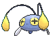
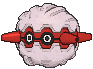

# Johto Pokémon

---

## #152 Chikorita

**Location:** Route 101

**Ability 2:** Natural Cure **

| Level | Move |     | Cont. | Move |
| ----- | ---- | --- | ----- | ---- |
| 1 |   Tackle |   | 21 |  Giga Drain |
| 1 |   Growl |   | 23 |  Ancient Power |
| 5 |   Razor Leaf |   | 25 |  Body Slam |
| 7 |   Poison Powder |   | 28 |  Sweet Scent |
| 9 |   Synthesis |   | 31 |  Light Screen |
| 11 |  Grass Whistle |   | 34 |  Safeguard |
| 13 |  Nature Power |   | 37 |  Aromatherapy |
| 15 |  Magical Leaf |   | 40 |  Solar Beam |
| 17 |  Reflect |   | 43 |  Leaf Storm |
| 19 |  Natural Gift |   |   |   |

---

## #153 Bayleef

**Location:** Evolve Chikorita (Lv. 16)

**Ability 2:** Natural Cure **

| Level | Move |     | Cont. | Move |
| ----- | ---- | --- | ----- | ---- |
| 1 |   Tackle |   | 24 |  Giga Drain |
| 1 |   Growl |   | 27 |  Ancient Power |
| 5 |   Razor Leaf |   | 30 |  Body Slam |
| 7 |   Poison Powder |   | 34 |  Sweet Scent |
| 9 |   Synthesis |   | 38 |  Light Screen |
| 11 |  Grass Whistle |   | 42 |  Safeguard |
| 13 |  Nature Power |   | 46 |  Aromatherapy |
| 15 |  Magical Leaf |   | 50 |  Solar Beam |
| 18 |  Reflect |   | 54 |  Leaf Storm |
| 21 |  Natural Gift |   |   |   |

---

## #154 Meganium

**Location:** Evolve Bayleef (Lv. 32)

**Ability 2:** Natural Cure **

| Level | Move |     | Cont. | Move |
| ----- | ---- | --- | ----- | ---- |
| 1 |   Tackle |   | 27 |  Ancient Power |
| 1 |   Growl |   | 30 |  Body Slam |
| 5 |   Razor Leaf |   | 32 |  Petal Dance |
| 7 |   Poison Powder |   | 32 |  Petal Blizzard |
| 9 |   Synthesis |   | 35 |  Sweet Scent |
| 11 |  Grass Whistle |   | 40 |  Light Screen |
| 13 |  Nature Power |   | 45 |  Safeguard |
| 15 |  Magical Leaf |   | 50 |  Aromatherapy |
| 18 |  Reflect |   | 55 |  Solar Beam |
| 21 |  Natural Gift |   | 60 |  Leaf Storm |
| 24 |  Giga Drain |   |   |   |

---

## #155 Cyndaquil

**Location:** Rusturf Tunnel

**Ability 2:** Flash Fire

| Level | Move |     | Cont. | Move |
| ----- | ---- | --- | ----- | ---- |
| 1 |   Tackle |   | 19 |  Swift |
| 1 |   Leer |   | 21 |  Flame Charge |
| 5 |   Ember |   | 24 |  Rollout |
| 7 |   Smokescreen |   | 27 |  Extrasensory |
| 9 |   Quick Attack |   | 30 |  Lava Plume |
| 11 |  Reversal |   | 33 |  Double |
| 13 |  Flame Wheel |   | 36 |  Flamethrower |
| 15 |  Defense Curl |   | 39 |  Inferno |
| 17 |  Flame Burst |   | 42 |  Eruption |

---

## #156 Quilava

**Location:** Evolve Cyndaquil (Lv. 14)

**Ability 2:** Flash Fire

| Level | Move |     | Cont. | Move |
| ----- | ---- | --- | ----- | ---- |
| 1 |   Tackle |   | 20 |  Swift |
| 1 |   Leer |   | 23 |  Flame Charge |
| 5 |   Ember |   | 27 |  Rollout |
| 7 |   Smokescreen |   | 31 |  Extrasensory |
| 9 |   Quick Attack |   | 35 |  Lava Plume |
| 11 |  Reversal |   | 39 |  Double |
| 13 |  Flame Wheel |   | 43 |  Flamethrower |
| 15 |  Defense Curl |   | 47 |  Inferno |
| 17 |  Flame Burst |   | 51 |  Eruption |

---

## #157 Typhlosion

**Location:** Evolve Quilava (Lv. 36)

**Ability 2:** Flash Fire

| Level | Move |     | Cont. | Move |
| ----- | ---- | --- | ----- | ---- |
| 1 |   Eruption |   | 17 |  Flame Burst |
| 1 |   Fire Punch |   | 20 |  Swift |
| 1 |   Thunder Punch |   | 23 |  Flame Charge |
| 1 |   Tackle |   | 27 |  Rollout |
| 1 |   Leer |   | 31 |  Extrasensory |
| 5 |   Ember |   | 35 |  Lava Plume |
| 7 |   Smokescreen |   | 40 |  Double |
| 9 |   Quick Attack |   | 45 |  Flamethrower |
| 11 |  Reversal |   | 50 |  Inferno |
| 13 |  Flame Wheel |   | 55 |  Eruption |
| 15 |  Defense Curl |   |   |   |

---

## #158 Totodile

**Location:** Route 104 South

**Ability 2:** Sheer Force

| Level | Move |     | Cont. | Move |
| ----- | ---- | --- | ----- | ---- |
| 1 |   Scratch |   | 21 |  Chip Away |
| 1 |   Leer |   | 23 |  Aqua Tail |
| 5 |   Water Gun |   | 25 |  Slash |
| 7 |   Rage |   | 28 |  Crunch |
| 9 |   Bite |   | 31 |  Screech |
| 11 |  Scary Face |   | 34 |  Thrash |
| 13 |  Metal Claw |   | 37 |  Dragon Dance |
| 15 |  Aqua Jet |   | 40 |  Superpower |
| 17 |  Ice Fang |   | 43 |  Hydro Pump |
| 19 |  Flail |   |   |   |

---

## #159 Croconaw

**Evolution:** Evolve Totodile (Lv. 18)

**Ability 2:** Sheer Force

| Level | Move |     | Cont. | Move |
| ----- | ---- | --- | ----- | ---- |
| 1 |   Scratch |   | 23 |  Chip Away |
| 1 |   Leer |   | 26 |  Aqua Tail |
| 5 |   Water Gun |   | 29 |  Slash |
| 7 |   Rage |   | 33 |  Crunch |
| 9 |   Bite |   | 37 |  Screech |
| 11 |  Scary Face |   | 41 |  Thrash |
| 13 |  Metal Claw |   | 45 |  Dragon Dance |
| 15 |  Aqua Jet |   | 49 |  Superpower |
| 17 |  Ice Fang |   | 53 |  Hydro Pump |
| 20 |  Flail |   |   |   |

---

## #160 Feraligatr

**Location:** Evolve Croconaw (Lv. 30)

**Ability 2:** Sheer Force

| Level | Move |     | Cont. | Move |
| ----- | ---- | --- | ----- | ---- |
| 1 |   Ice Punch |   | 23 |  Chip Away |
| 1 |   Scratch |   | 26 |  Aqua Tail |
| 1 |   Leer |   | 29 |  Slash |
| 5 |   Water Gun |   | 30 |  Agility |
| 7 |   Rage |   | 34 |  Crunch |
| 9 |   Bite |   | 39 |  Screech |
| 11 |  Scary Face |   | 44 |  Thrash |
| 13 |  Metal Claw |   | 49 |  Dragon Dance |
| 15 |  Aqua Jet |   | 54 |  Superpower |
| 17 |  Ice Fang |   | 59 |  Hydro Pump |
| 20 |  Flail |   |   |   |

---

## #161 Sentret

**Location:** Route 101

| Level | Move |     | Cont. | Move |
| ----- | ---- | --- | ----- | ---- |
| 1 |   Scratch |   | 22 |  Rest |
| 1 |   Foresight |   | 25 |  Sucker Punch |
| 4 |   Defense Curl |   | 28 |  Amnesia |
| 7 |   Quick Attack |   | 31 |  Hyper Voice |
| 10 |  Fury Swipes |   | 34 |  Me First |
| 13 |  Helping Hand |   | 37 |  Baton Pass |
| 16 |  Slam |   | 40 |  Double |
| 19 |  Follow Me |   |   |   |

---

## #162 Furret

**Location:** Safari Zone

**Ability 1:** Run Away >> Limber **

| Stat | Base | Change |
| ---- | ---- | ------ |
| HP | 85 | 95 |
| Attack | 76 | 85 |
| Defense | 64 | 65 |
| Sp. Attack | 45 | 40 |
| Speed | 90 | 100 |
| Total | 415 | 440 |

| Level | Move |     | Cont. | Move |
| ----- | ---- | --- | ----- | ---- |
| 1 |   Double |   | 15 |  Slash |
| 1 |   Aqua Tail |   | 17 |  Slam |
| 1 |   Iron Tail |   | 21 |  Follow Me |
| 1 |   Covet |   | 25 |  Rest |
| 1 |   Scratch |   | 29 |  Sucker Punch |
| 1 |   Foresight |   | 33 |  Amnesia |
| 4 |   Defense Curl |   | 37 |  Hyper Voice |
| 7 |   Quick Attack |   | 41 |  Me First |
| 10 |  Fury Swipes |   | 45 |  Baton Pass |
| 13 |  Helping Hand |   | 49 |  Double |

---

## #163 Hoothoot

**Location:** Route 103, Mt. Pyre

**Effort Values:** 1 HP >> 1 Sp. Def

| Stat | Base | Change |
| ---- | ---- | ------ |
| Attack | 30 | 25 |
| Defense | 30 | 25 |
| Sp. Attack | 36 | 45 |
| Sp. Defense | 56 | 65 |
| Total | 262 | 270 |

| Level | Move |     | Cont. | Move |
| ----- | ---- | --- | ----- | ---- |
| 1 |   Tackle |   | 24 |  Extrasensory |
| 1 |   Growl |   | 27 |  Take Down |
| 1 |   Foresight |   | 30 |  Air Slash |
| 1 |   Hypnosis |   | 33 |  Synchronoise |
| 6 |   Echoed Voice |   | 36 |  Zen Headbutt |
| 9 |   Peck |   | 39 |  Psycho Shift |
| 12 |  Uproar |   | 42 |  Psychic |
| 15 |  Air Cutter |   | 45 |  Roost |
| 18 |  Confusion |   | 48 |  Dream Eater |
| 21 |  Reflect |   | 51 |  Hurricane |

---

## #164 Noctowl

**Location:** Safari Zone, Mt. Pyre

**Ability 2:** Keen Eye >> Analytic

**Effort Values:** 2 HP >> 2 Sp. Def

**Type:** Normal/Flying >> Psychic/Flying

| Stat | Base | Change |
| ---- | ---- | ------ |
| Attack | 50 | 30 |
| Defense | 50 | 60 |
| Sp. Attack | 76 | 90 |
| Sp. Defense | 96 | 110 |
| Speed | 70 | 75 |
| Total | 442 | 465 |

| Level | Move |     | Cont. | Move |
| ----- | ---- | --- | ----- | ---- |
| 1 |   Hurricane |   | 18 |  Confusion |
| 1 |   Dream Eater |   | 22 |  Reflect |
| 1 |   Sky Attack |   | 26 |  Extrasensory |
| 1 |   Heat Wave |   | 30 |  Take Down |
| 1 |   Hyper Voice |   | 34 |  Air Slash |
| 1 |   Tackle |   | 38 |  Synchronoise |
| 1 |   Growl |   | 42 |  Zen Headbutt |
| 1 |   Foresight |   | 46 |  Psycho Shift |
| 1 |   Hypnosis |   | 50 |  Psychic |
| 6 |   Echoed Voice |   | 54 |  Roost |
| 9 |   Peck |   | 58 |  Dream Eater |
| 12 |  Uproar |   | 62 |  Hurricane |
| 15 |  Air Cutter |   |   |   |

---

## #165 Ledyba

**Location:** Route 104 North

| Stat | Base | Change |
| ---- | ---- | ------ |
| Attack | 20 | 50 |
| Sp. Attack | 40 | 20 |
| Total | 265 | 275 |

| Level | Move |     | Cont. | Move |
| ----- | ---- | --- | ----- | ---- |
| 1 |   Tackle |   | 20 |  Drain Punch |
| 1 |   Supersonic |   | 22 |  Acrobatics |
| 6 |   Comet Punch |   | 24 |  Baton Pass |
| 8 |   Bug Bite |   | 26 |  U |
| 10 |  Light Screen |   | 28 |  Agility |
| 10 |  Reflect |   | 30 |  Silver Wind |
| 12 |  Aerial Ace |   | 32 |  Double |
| 14 |  Safeguard |   | 34 |  Focus Punch |
| 16 |  Mach Punch |   | 36 |  Bug Buzz |
| 18 |  Swift |   | 38 |  Meteor Mash |

---

## #166 Ledian

**Location:** Safari Zone

**New TM/HMs:** Fly

| Stat | Base | Change |
| ---- | ---- | ------ |
| Attack | 35 | 110 |
| Sp. Attack | 55 | 40 |
| Total | 390 | 450 |

| Level | Move |     | Cont. | Move |
| ----- | ---- | --- | ----- | ---- |
| 1 |   Tackle |   | 19 |  Swift |
| 1 |   Supersonic |   | 22 |  Drain Punch |
| 6 |   Comet Punch |   | 25 |  Acrobatics |
| 8 |   Bug Bite |   | 28 |  Baton Pass |
| 10 |  Light Screen |   | 31 |  U |
| 10 |  Reflect |   | 34 |  Agility |
| 12 |  Aerial Ace |   | 37 |  Silver Wind |
| 14 |  Safeguard |   | 40 |  Double |
| 16 |  Mach Punch |   | 43 |  Focus Punch |
| 18 |  Thunder Punch |   | 46 |  Bug Buzz |
| 18 |  Ice Punch |   | 49 |  Meteor Mash |

---

## #167 Spinarak

**Location:** Rusturf Tunnel

| Stat | Base | Change |
| ---- | ---- | ------ |
| Attack | 60 | 70 |
| Speed | 30 | 40 |
| Total | 250 | 270 |

| Level | Move |     | Cont. | Move |
| ----- | ---- | --- | ----- | ---- |
| 1 |   Poison Sting |   | 22 |  Cross Poison |
| 1 |   String Shot |   | 24 |  Night Slash |
| 1 |   Electroweb |   | 26 |  Sucker Punch |
| 6 |   Scary Face |   | 28 |  Spider Web |
| 8 |   Constrict |   | 30 |  Agility |
| 10 |  Leech Life |   | 32 |  Pin Missile |
| 12 |  Bug Bite |   | 34 |  Psychic |
| 14 |  Night Shade |   | 36 |  Poison Jab |
| 16 |  Shadow Sneak |   | 38 |  Sticky Web |
| 18 |  X |   | 40 |  Megahorn |
| 20 |  Fury Swipes |   |   |   |

---

## #168 Ariados

**Location:** Safari Zone, Sky Pillar

| Stat | Base | Change |
| ---- | ---- | ------ |
| Attack | 90 | 120 |
| Sp. Attack | 60 | 50 |
| Speed | 40 | 80 |
| Total | 390 | 450 |

| Level | Move |     | Cont. | Move |
| ----- | ---- | --- | ----- | ---- |
| 1 |   Venom Drench |   | 20 |  Fury Swipes |
| 1 |   Fell Stinger |   | 23 |  Cross Poison |
| 1 |   Poison Sting |   | 26 |  Night Slash |
| 1 |   String Shot |   | 29 |  Sucker Punch |
| 1 |   Electroweb |   | 32 |  Spider Web |
| 6 |   Scary Face |   | 35 |  Agility |
| 8 |   Constrict |   | 38 |  Pin Missile |
| 10 |  Leech Life |   | 41 |  Psychic |
| 12 |  Bug Bite |   | 44 |  Poison Jab |
| 14 |  Night Shade |   | 47 |  Sticky Web |
| 16 |  Shadow Sneak |   | 50 |  Megahorn |
| 18 |  X |   |   |   |

---

## #169 Crobat

**Location:** Meteor Falls

**Ability 2:** Infiltrator

| Level | Move |     | Cont. | Move |
| ----- | ---- | --- | ----- | ---- |
| 1 |   Cross Poison |   | 27 |  Swift |
| 1 |   Screech |   | 31 |  Acrobatics |
| 1 |   Leech Life |   | 35 |  Giga Drain |
| 1 |   Supersonic |   | 39 |  Mean Look |
| 4 |   Leech Life |   | 43 |  Haze |
| 7 |   Bite |   | 47 |  Venoshock |
| 10 |  Wing Attack |   | 51 |  Air Slash |
| 13 |  Confuse Ray |   | 55 |  Hypnosis |
| 16 |  Feint Attack |   | 59 |  Brave Bird |
| 19 |  Air Cutter |   | 63 |  Quick Guard |
| 23 |  Poison Fang |   |   |   |

---

## #170 Chinchou

**Location:** Route 108, Route 109, Route 124

| Level | Move |     | Cont. | Move |
| ----- | ---- | --- | ----- | ---- |
| 1 |   Bubble |   | 31 |  Discharge |
| 1 |   Supersonic |   | 34 |  Flail |
| 6 |   Thunder Wave |   | 39 |  Take Down |
| 9 |   Electro Ball |   | 42 |  Thunderbolt |
| 12 |  Water Gun |   | 45 |  Aqua Ring |
| 17 |  Confuse Ray |   | 47 |  Hydro Pump |
| 20 |  Bubble Beam |   | 50 |  Ion Deluge |
| 23 |  Spark |   | 52 |  Charge |
| 28 |  Signal Beam |   |   |   |

---

## #171 Lanturn

**Location:** Route 108, Route 109, Route 124, Underwater

| Level | Move |     | Cont. | Move |
| ----- | ---- | --- | ----- | ---- |
| 1 |   Eerie Impulse |   | 27 |  Swallow |
| 1 |   Bubble |   | 27 |  Spit Up |
| 1 |   Supersonic |   | 29 |  Signal Beam |
| 1 |   Thunder Wave |   | 33 |  Discharge |
| 1 |   Electro Ball |   | 37 |  Flail |
| 6 |   Thunder Wave |   | 43 |  Take Down |
| 9 |   Electro Ball |   | 47 |  Thunderbolt |
| 12 |  Water Gun |   | 51 |  Aqua Ring |
| 17 |  Confuse Ray |   | 54 |  Hydro Pump |
| 20 |  Bubble Beam |   | 58 |  Ion Deluge |
| 23 |  Spark |   | 61 |  Charge |
| 27 |  Stockpile |   |   |   |

---

## #172 Pichu

**Location:** Petalburg Woods

**Ability 2:** Lightning Rod

**Base Happiness:** 70 >> 200

| Level | Move |     | Cont. | Move |
| ----- | ---- | --- | ----- | ---- |
| 1 |   Thunder Shock |   | 9 |   Sweet Kiss |
| 1 |   Charm |   | 13 |  Nasty Plot |
| 5 |   Tail Whip |   | 17 |  Thunder Wave |

---

## #173 Cleffa

**Location:** Meteor Falls

**Base Happiness:** 70 >> 200

| Level | Move |     | Cont. | Move |
| ----- | ---- | --- | ----- | ---- |
| 1 |   Round |   | 10 |  Sweet Kiss |
| 1 |   Charm |   | 13 |  Copycat |
| 4 |   Encore |   | 16 |  Magical Leaf |
| 7 |   Sing |   |   |   |

---

## #174 Igglybuff

**Location:** Route 115

**Base Happiness:** 70 >> 200

| Level | Move |     | Cont. | Move |
| ----- | ---- | --- | ----- | ---- |
| 1 |   Sing |   | 5 |   Pound |
| 1 |   Charm |   | 9 |   Sweet Kiss |
| 3 |   Defense Curl |   | 11 |  Copycat |

---

## #175 Togepi

**Location:** Route 104 North

**Base Happiness:** 70 >> 180

| Level | Move |     | Cont. | Move |
| ----- | ---- | --- | ----- | ---- |
| 1 |   Growl |   | 24 |  Ancient Power |
| 1 |   Charm |   | 27 |  Follow Me |
| 1 |   Metronome |   | 30 |  Bestow |
| 1 |   Extrasensory |   | 33 |  Wish |
| 6 |   Fairy Wind |   | 36 |  Safeguard |
| 9 |   Sweet Kiss |   | 39 |  Baton Pass |
| 12 |  Yawn |   | 42 |  Double |
| 15 |  Draining Kiss |   | 45 |  Last Resort |
| 18 |  Encore |   | 48 |  After You |
| 21 |  Nasty Plot |   |   |   |

---

## #176 Togetic

**Location:** Evolve Togepi (Happiness)

| Level | Move |     | Cont. | Move |
| ----- | ---- | --- | ----- | ---- |
| 1 |   Silver Wind |   | 21 |  Air Cutter |
| 1 |   Magical Leaf |   | 24 |  Ancient Power |
| 1 |   Growl |   | 27 |  Follow Me |
| 1 |   Charm |   | 30 |  Bestow |
| 1 |   Metronome |   | 33 |  Wish |
| 1 |   Extrasensory |   | 36 |  Safeguard |
| 6 |   Fairy Wind |   | 39 |  Baton Pass |
| 9 |   Sweet Kiss |   | 42 |  Double |
| 12 |  Yawn |   | 45 |  Last Resort |
| 15 |  Draining Kiss  |   | 48 |  After You |
| 18 |  Encore |   |   |   |

---

## #177 Natu

**Location:** Route 116, Mt. Pyre

| Level | Move |     | Cont. | Move |
| ----- | ---- | --- | ----- | ---- |
| 1 |   Peck |   | 27 |  Wish |
| 1 |   Leer |   | 30 |  Psychic |
| 6 |   Night Shade |   | 33 |  Miracle Eye |
| 9 |   Stored Power |   | 36 |  Lucky Chant |
| 12 |  Calm Mind |   | 39 |  Psycho Shift |
| 15 |  Air Cutter |   | 42 |  Future Sight |
| 18 |  Teleport |   | 45 |  Guard Swap |
| 21 |  Ominous Wind |   | 45 |  Power Swap |
| 24 |  Confuse Ray |   | 48 |  Me First |

---

## #178 Xatu

**Location:** Mt. Pyre

| Level | Move |     | Cont. | Move |
| ----- | ---- | --- | ----- | ---- |
| 1 |   Hurricane |   | 24 |  Confuse Ray |
| 1 |   Tailwind |   | 25 |  Air Slash |
| 1 |   Silver Wind |   | 28 |  Wish |
| 1 |   Giga Drain |   | 32 |  Psychic |
| 1 |   Heat Wave |   | 36 |  Miracle Eye |
| 1 |   Peck |   | 40 |  Lucky Chant |
| 1 |   Leer |   | 44 |  Psycho Shift |
| 6 |   Night Shade |   | 48 |  Future Sight |
| 9 |   Stored Power |   | 52 |  Guard Swap |
| 12 |  Calm Mind |   | 52 |  Power Swap |
| 15 |  Air Cutter |   | 56 |  Me First |
| 18 |  Teleport |   | 60 |  Hurricane |
| 21 |  Ominous Wind |   |   |   |

---

## #179 Mareep

**Location:** Route 116

| Level | Move |     | Cont. | Move |
| ----- | ---- | --- | ----- | ---- |
| 1 |   Tackle |   | 25 |  Power Gem |
| 1 |   Growl |   | 28 |  Discharge |
| 4 |   Thunder Wave |   | 31 |  Confuse Ray |
| 7 |   Thunder Shock |   | 34 |  Signal Beam |
| 10 |  Cotton Spore |   | 37 |  Thunderbolt |
| 13 |  Shock Wave |   | 40 |  Cotton Guard |
| 16 |  Charge |   | 43 |  Light Screen |
| 19 |  Take Down |   | 46 |  Thunder |
| 22 |  Electro Ball |   |   |   |

---

## #180 Flaaffy

**Location:** Route 121

| Level | Move |     | Cont. | Move |
| ----- | ---- | --- | ----- | ---- |
| 1 |   Tackle |   | 28 |  Power Gem |
| 1 |   Growl |   | 32 |  Discharge |
| 4 |   Thunder Wave |   | 36 |  Confuse Ray |
| 7 |   Thunder Shock |   | 40 |  Signal Beam |
| 10 |  Cotton Spore |   | 44 |  Thunderbolt |
| 13 |  Shock Wave |   | 48 |  Cotton Guard |
| 16 |  Charge |   | 52 |  Light Screen |
| 20 |  Take Down |   | 56 |  Thunder |
| 24 |  Electro Ball |   |   |   |

---

## #181 Ampharos

**Location:** Evolve Flaaffy (Lv. 30)

| Level | Move |     | Cont. | Move |
| ----- | ---- | --- | ----- | ---- |
| 1 |   Zap Cannon |   | 20 |  Take Down |
| 1 |   Magnetic Flux |   | 24 |  Electro Ball |
| 1 |   Ion Deluge |   | 28 |  Power Gem |
| 1 |   Fire Punch |   | 30 |  Dragon Pulse |
| 1 |   Thunder Punch |   | 33 |  Discharge |
| 1 |   Tackle |   | 38 |  Confuse Ray |
| 1 |   Growl |   | 43 |  Signal Beam |
| 4 |   Thunder Wave |   | 48 |  Thunderbolt |
| 7 |   Thunder Shock |   | 53 |  Cotton Guard |
| 10 |  Cotton Spore |   | 58 |  Light Screen |
| 13 |  Shock Wave |   | 63 |  Thunder |
| 16 |  Charge |   | 68 |  Tail Glow |

---

## #182 Bellossom

**Location:** Evolve Gloom (Sun Stone)

**Ability 2:** Healer

**Move Tutor:** Earth Power

| Level | Move |     | Cont. | Move |
| ----- | ---- | --- | ----- | ---- |
| 1 |   Earth Power |   | 1 |   Sunny Day |
| 1 |   Leaf Storm |   | 24 |  Magical Leaf |
| 1 |   Leaf Blade |   | 34 |  Petal Blizzard |
| 1 |   Mega Drain |   | 44 |  Leaf Storm |
| 1 |   Sweet Scent |   | 54 |  Quiver Dance |
| 1 |   Stun Spore |   |   |   |

---

## #183 Marill

**Location:** Petalburg City, Route 123

| Level | Move |     | Cont. | Move |
| ----- | ---- | --- | ----- | ---- |
| 1 |   Tackle |   | 16 |  Helping Hand |
| 1 |   Water Gun |   | 20 |  Aqua Tail |
| 2 |   Tail Whip |   | 23 |  Play Rough |
| 5 |   Water Sport |   | 28 |  Aqua Ring |
| 7 |   Bubble |   | 31 |  Rain Dance |
| 10 |  Defense Curl |   | 37 |  Double |
| 10 |  Rollout |   | 40 |  Superpower |
| 13 |  Bubble Beam |   | 47 |  Hydro Pump |

---

## #184 Azumarill

**Location:** Petalburg City, Route 123, Victory Road

| Stat | Base | Change |
| ---- | ---- | ------ |
| Sp. Attack | 60 | 80 |
| Total | 420 | 440 |

| Level | Move |     | Cont. | Move |
| ----- | ---- | --- | ----- | ---- |
| 1 |   Tackle |   | 16 |  Helping Hand |
| 1 |   Water Gun |   | 21 |  Aqua Tail |
| 2 |   Tail Whip |   | 25 |  Play Rough |
| 5 |   Water Sport |   | 31 |  Aqua Ring |
| 7 |   Bubble |   | 35 |  Rain Dance |
| 10 |  Defense Curl |   | 42 |  Double |
| 10 |  Rollout |   | 46 |  Superpower |
| 13 |  Bubble Beam |   | 55 |  Hydro Pump |

---

## #185 Sudowoodo

**Location:** Safari Zone

| Stat | Base | Change |
| ---- | ---- | ------ |
| HP | 70 | 80 |
| Attack | 100 | 110 |
| Defense | 115 | 125 |
| Sp. Attack | 30 | 40 |
| Sp. Defense | 65 | 75 |
| Total | 410 | 460 |

| Level | Move |     | Cont. | Move |
| ----- | ---- | --- | ----- | ---- |
| 1 |   Wood Hammer |   | 19 |  Feint Attack |
| 1 |   Copycat |   | 22 |  Rock Tomb |
| 1 |   Flail |   | 26 |  Block |
| 1 |   Low Kick |   | 29 |  Rock Slide |
| 1 |   Rock Throw |   | 33 |  Counter |
| 5 |   Flail |   | 36 |  Sucker Punch |
| 8 |   Low Kick |   | 40 |  Double |
| 12 |  Rock Throw |   | 43 |  Stone Edge |
| 15 |  Mimic |   | 47 |  Hammer Arm |
| 15 |  Slam |   |   |   |

---

## #186 Politoed

**Location:** Evolve Poliwhirl (King's Rock)

| Level | Move |     | Cont. | Move |
| ----- | ---- | --- | ----- | ---- |
| 1 |   Bubble Beam |   | 30 |  Round |
| 1 |   Hypnosis |   | 35 |  Bounce |
| 1 |   Double Slap |   | 40 |  Mud Bomb |
| 1 |   Perish Song |   | 45 |  Hyper Voice |
| 25 |  Swagger |   |   |   |

---

## #187 Hoppip

**Location:** Route 104 North, Route 114

**New TM/HMs:** Fly

| Stat | Base | Change |
| ---- | ---- | ------ |
| Attack | 35 | 50 |
| Sp. Attack | 35 | 50 |
| Sp. Defense | 55 | 60 |
| Speed | 50 | 55 |
| Total | 250 | 280 |

| Level | Move |     | Cont. | Move |
| ----- | ---- | --- | ----- | ---- |
| 1 |   Splash |   | 20 |  Leech Seed |
| 1 |   Synthesis |   | 22 |  Giga Drain |
| 1 |   Tail Whip |   | 24 |  Silver Wind |
| 4 |   Tackle |   | 26 |  Rage Powder |
| 6 |   Mega Drain |   | 28 |  Cotton Spore |
| 8 |   Fairy Wind |   | 30 |  U |
| 10 |  Poison Powder |   | 32 |  Worry Seed |
| 12 |  Stun Spore |   | 34 |  Bounce |
| 14 |  Sleep Powder |   | 36 |  Memento |
| 16 |  Acrobatics |   | 38 |  Cotton Guard |
| 18 |  Bullet Seed |   |   |   |

---

## #188 Skiploom

**Location:** Route 114

**New TM/HMs:** Fly

| Stat | Base | Change |
| ---- | ---- | ------ |
| Attack | 45 | 65 |
| Sp. Attack | 45 | 65 |
| Sp. Defense | 65 | 75 |
| Total | 340 | 390 |

| Level | Move |     | Cont. | Move |
| ----- | ---- | --- | ----- | ---- |
| 1 |   Splash |   | 22 |  Leech Seed |
| 1 |   Synthesis |   | 25 |  Giga Drain |
| 1 |   Tail Whip |   | 28 |  Silver Wind |
| 4 |   Tackle |   | 31 |  Rage Powder |
| 6 |   Mega Drain |   | 34 |  Cotton Spore |
| 8 |   Fairy Wind |   | 37 |  U |
| 10 |  Poison Powder |   | 40 |  Worry Seed |
| 12 |  Stun Spore |   | 43 |  Bounce |
| 14 |  Sleep Powder |   | 46 |  Memento |
| 16 |  Acrobatics |   | 49 |  Cotton Guard |
| 19 |  Bullet Seed |   |   |   |

---

## #189 Jumpluff

**Location:** Evolve Skiploom (Lv. 27)

**New TM/HMs:** Fly

| Stat | Base | Change |
| ---- | ---- | ------ |
| Attack | 55 | 75 |
| Sp. Attack | 55 | 75 |
| Total | 460 | 500 |

| Level | Move |     | Cont. | Move |
| ----- | ---- | --- | ----- | ---- |
| 1 |   Splash |   | 22 |  Leech Seed |
| 1 |   Synthesis |   | 25 |  Giga Drain |
| 1 |   Tail Whip |   | 29 |  Silver Wind |
| 4 |   Tackle |   | 33 |  Rage Powder |
| 6 |   Mega Drain |   | 37 |  Cotton Spore |
| 8 |   Fairy Wind |   | 41 |  U |
| 10 |  Poison Powder |   | 45 |  Worry Seed |
| 12 |  Stun Spore |   | 49 |  Bounce |
| 14 |  Sleep Powder |   | 53 |  Memento |
| 16 |  Acrobatics |   | 57 |  Cotton Guard |
| 19 |  Bullet Seed |   |   |   |

---

## #190 Aipom

**Location:** Jagged Pass

| Level | Move |     | Cont. | Move |
| ----- | ---- | --- | ----- | ---- |
| 1 |   Scratch |   | 25 |  Screech |
| 1 |   Tail Whip |   | 27 |  Agility |
| 4 |   Sand Attack |   | 29 |  Acrobatics |
| 8 |   Astonish |   | 30 |  Fake Out |
| 11 |  Baton Pass |   | 32 |  Double Hit |
| 14 |  Tickle |   | 35 |  Fling |
| 17 |  Fury Swipes |   | 38 |  Nasty Plot |
| 20 |  Swift |   | 42 |  Bounce |
| 23 |  Knock Off |   | 45 |  Last Resort |

---

## #191 Sunkern

**Location:** Route 115

| Level | Move |     | Cont. | Move |
| ----- | ---- | --- | ----- | ---- |
| 1 |   Absorb |   | 22 |  Giga Drain |
| 1 |   Growth |   | 25 |  Endeavor |
| 4 |   Ingrain |   | 28 |  Synthesis |
| 7 |   Grass Whistle |   | 31 |  Natural Gift |
| 10 |  Mega Drain |   | 34 |  Solar Beam |
| 13 |  Leech Seed |   | 37 |  Double |
| 16 |  Razor Leaf |   | 40 |  Sunny Day |
| 19 |  Worry Seed |   | 43 |  Seed Bomb |

---

## #192 Sunflora

**Location:** Evolve Sunkern (Sun Stone)

| Stat | Base | Change |
| ---- | ---- | ------ |
| HP | 75 | 95 |
| Attack | 75 | 55 |
| Defense | 55 | 95 |
| Sp. Attack | 105 | 125 |
| Sp. Defense | 85 | 105 |
| Total | 425 | 505 |

| Level | Move |     | Cont. | Move |
| ----- | ---- | --- | ----- | ---- |
| 1 |   Flower Shield |   | 25 |  Bullet Seed |
| 1 |   Absorb |   | 28 |  Petal Dance |
| 1 |   Pound |   | 31 |  Natural Gift |
| 1 |   Growth |   | 34 |  Solar Beam |
| 4 |   Ingrain |   | 37 |  Double |
| 7 |   Grass Whistle |   | 40 |  Sunny Day |
| 10 |  Mega Drain |   | 43 |  Mystical Fire |
| 13 |  Leech Seed |   | 46 |  Earth Power |
| 16 |  Razor Leaf |   | 49 |  Petal Blizzard |
| 19 |  Worry Seed |   | 52 |  Leaf Storm |
| 22 |  Giga Drain |   |   |   |

---

## #193 Yanma

**Location:** Route 115

**New TM/HMs:** Fly

| Level | Move |     | Cont. | Move |
| ----- | ---- | --- | ----- | ---- |
| 1 |   Tackle |   | 30 |  Uproar |
| 1 |   Foresight |   | 34 |  Ancient Power |
| 1 |   Quick Attack |   | 38 |  Signal Beam |
| 6 |   Double Team |   | 42 |  Air Slash |
| 10 |  Sonic Boom |   | 46 |  Hypnosis |
| 14 |  Wing Attack |   | 50 |  U |
| 18 |  Silver Wind |   | 54 |  Screech |
| 22 |  Detect |   | 58 |  Bug Buzz |
| 26 |  Supersonic |   |   |   |

---

## #194 Wooper

**Location:** Route 110

| Stat | Base | Change |
| ---- | ---- | ------ |
| Attack | 45 | 55 |
| Defense | 45 | 55 |
| Total | 210 | 230 |

| Level | Move |     | Cont. | Move |
| ----- | ---- | --- | ----- | ---- |
| 1 |   Water Gun |   | 30 |  Yawn |
| 1 |   Tail Whip |   | 34 |  Earthquake |
| 6 |   Mud Sport |   | 38 |  Rain Dance |
| 10 |  Mud Shot |   | 42 |  Mist |
| 14 |  Slam |   | 42 |  Haze |
| 18 |  Mud Bomb |   | 46 |  Muddy Water |
| 22 |  Aqua Tail |   | 50 |  Recover |
| 26 |  Amnesia |   |   |   |

---

## #195 Quagsire

**Location:** Route 110, Route 119

| Stat | Base | Change |
| ---- | ---- | ------ |
| Attack | 85 | 95 |
| Defense | 85 | 95 |
| Total | 430 | 450 |

| Level | Move |     | Cont. | Move |
| ----- | ---- | --- | ----- | ---- |
| 1 |   Water Gun |   | 32 |  Yawn |
| 1 |   Tail Whip |   | 36 |  Earthquake |
| 6 |   Mud Sport |   | 40 |  Rain Dance |
| 10 |  Mud Shot |   | 44 |  Mist |
| 14 |  Slam |   | 44 |  Haze |
| 18 |  Mud Bomb |   | 48 |  Muddy Water |
| 24 |  Aqua Tail |   | 52 |  Recover |
| 28 |  Amnesia |   |   |   |

---

## #196 Espeon

**Location:** Evolve Eevee (Happiness, Day)

**Ability 2:** Magic Bounce

| Level | Move |     | Cont. | Move |
| ----- | ---- | --- | ----- | ---- |
| 1 |   Power Gem |   | 20 |  Psybeam |
| 1 |   Helping Hand |   | 25 |  Future Sight |
| 1 |   Tackle |   | 29 |  Psych Up |
| 1 |   Tail Whip |   | 33 |  Morning Sun |
| 5 |   Sand Attack |   | 37 |  Psychic |
| 9 |   Confusion |   | 41 |  Last Resort |
| 13 |  Quick Attack |   | 45 |  Power Swap |
| 17 |  Swift |   | 50 |  Mystical Fire |

---

## #197 Umbreon

**Location:** Evolve Eevee (Happiness, Night)

**Ability 2:** Poison Touch **

| Level | Move |     | Cont. | Move |
| ----- | ---- | --- | ----- | ---- |
| 1 |   Helping Hand |   | 25 |  Assurance |
| 1 |   Tackle |   | 29 |  Screech |
| 1 |   Tail Whip |   | 33 |  Moonlight |
| 5 |   Sand Attack |   | 37 |  Mean Look |
| 9 |   Pursuit |   | 41 |  Last Resort |
| 13 |  Quick Attack |   | 45 |  Guard Swap |
| 17 |  Confuse Ray |   | 50 |  Moonblast |
| 20 |  Feint Attack |   |   |   |

---

## #198 Murkrow

**Location:** Jagged Pass, Mt. Pyre

| Level | Move |     | Cont. | Move |
| ----- | ---- | --- | ----- | ---- |
| 1 |   Peck |   | 34 |  Taunt |
| 1 |   Astonish |   | 38 |  Mean Look |
| 6 |   Pursuit |   | 42 |  Foul Play |
| 10 |  Haze |   | 46 |  Tailwind |
| 14 |  Wing Attack |   | 50 |  Sucker Punch |
| 18 |  Night Shade |   | 54 |  Brave Bird |
| 22 |  Assurance |   | 58 |  Torment |
| 26 |  Feint Attack |   | 62 |  Quash |
| 30 |  Drill Peck |   |   |   |

---

## #199 Slowking

**Location:** Route 118

**New TM/HMs:** Waterfall

| Level | Move |     | Cont. | Move |
| ----- | ---- | --- | ----- | ---- |
| 1 |   Wonder Room |   | 16 |  Disable |
| 1 |   Power Gem |   | 19 |  Zen Headbutt |
| 1 |   Hidden Power |   | 22 |  Water Pulse |
| 1 |   Ice Beam |   | 26 |  Belch |
| 1 |   Curse |   | 30 |  Nasty Plot |
| 1 |   Yawn |   | 34 |  Swagger |
| 1 |   Tackle |   | 38 |  Psychic |
| 4 |   Growl |   | 42 |  Trump Card |
| 6 |   Water Gun |   | 46 |  Psych Up |
| 8 |   Confusion |   | 50 |  Heal Pulse |
| 11 |  Incinerate |   | 54 |  Wonder Room |
| 14 |  Headbutt |   | 58 |  Aura Sphere |

---

## #200 Misdreavus

**Location:** Route 114

**Type:** Ghost >> Ghost/Fairy

| Level | Move |     | Cont. | Move |
| ----- | ---- | --- | ----- | ---- |
| 1 |   Growl |   | 23 |  Power Gem |
| 1 |   Psywave |   | 26 |  Shadow Ball |
| 1 |   Spite |   | 29 |  Payback |
| 5 |   Astonish |   | 32 |  Pain Split |
| 8 |   Confuse Ray |   | 36 |  Moonblast |
| 11 |  Mean Look |   | 40 |  Perish Song |
| 14 |  Hex |   | 44 |  Grudge |
| 17 |  Disarming Voice |   | 48 |  Nasty Plot |
| 20 |  Psybeam |   |   |   |

---

## #201 Unown

**Location:** Cave of Origin

**New TM/HMs:** Secret Power, Nature Power

| Stat | Base | Change |
| ---- | ---- | ------ |
| HP | 48 | 50 |
| Attack | 72 | 150 |
| Defense | 48 | 50 |
| Sp. Attack | 72 | 150 |
| Sp. Defense | 48 | 50 |
| Speed | 48 | 50 |
| Total | 336 | 500 |

| Level | Move |     | Cont. | Move |
| ----- | ---- | --- | ----- | ---- |
| 1 |   Nature Power |   | 1 |   Cosmic Power |
| 1 |   Earth Power |   | 1 |   Hidden Power |
| 1 |   Secret Power |   | 1 |   Stored Power |
| 1 |   Ancient Power |   |   |   |

---

## #202 Wobbuffet

**Location:** Safari Zone

| Stat | Base | Change |
| ---- | ---- | ------ |
| HP | 190 | 240 |
| Attack | 33 | 30 |
| Defense | 58 | 60 |
| Sp. Attack | 33 | 30 |
| Sp. Defense | 58 | 60 |
| Speed | 33 | 30 |
| Total | 405 | 450 |

| Level | Move |     | Cont. | Move |
| ----- | ---- | --- | ----- | ---- |
| 1 |   Safeguard |   | 1 |   Destiny Bond |
| 1 |   Counter |   | 15 |  Mimic |
| 1 |   Mirror Coat |   |   |   |

---

## #203 Girafarig

**Location:** Route 112 South

| Level | Move |     | Cont. | Move |
| ----- | ---- | --- | ----- | ---- |
| 1 |   Power Swap |   | 18 |  Psybeam |
| 1 |   Guard Swap |   | 22 |  Agility |
| 1 |   Astonish |   | 26 |  Double Hit |
| 1 |   Tackle |   | 30 |  Zen Headbutt |
| 1 |   Growl |   | 34 |  Crunch |
| 1 |   Confusion |   | 38 |  Baton Pass |
| 6 |   Odor Sleuth |   | 42 |  Nasty Plot |
| 10 |  Assurance |   | 46 |  Psychic |
| 14 |  Stomp |   | 50 |  Hyper Voice |

---

## #204 Pineco

**Location:** Jagged Pass

**Ability 2:** Overcoat

| Level | Move |     | Cont. | Move |
| ----- | ---- | --- | ----- | ---- |
| 1 |   Tackle |   | 27 |  Spikes |
| 1 |   Protect |   | 30 |  Payback |
| 6 |   Self |   | 33 |  Gyro Ball |
| 9 |   Bug Bite |   | 36 |  Drill Run |
| 12 |  Take Down |   | 39 |  Explosion |
| 15 |  Rapid Spin |   | 42 |  Pin Missile |
| 18 |  Bide |   | 45 |  Iron Defense |
| 21 |  Revenge |   | 48 |  Double |
| 24 |  Natural Gift |   |   |   |

---

## #205 Forretress

**Location:** Route 123

**Ability 2:** Overcoat

| Level | Move |     | Cont. | Move |
| ----- | ---- | --- | ----- | ---- |
| 1 |   Heavy Slam |   | 30 |  Payback |
| 1 |   Zap Cannon |   | 31 |  Mirror Shot |
| 1 |   Toxic Spikes |   | 32 |  Autotomize |
| 1 |   Tackle |   | 34 |  Gyro Ball |
| 1 |   Protect |   | 38 |  Drill Run |
| 6 |   Self |   | 42 |  Explosion |
| 9 |   Bug Bite |   | 46 |  Pin Missile |
| 12 |  Take Down |   | 50 |  Iron Defense |
| 15 |  Rapid Spin |   | 54 |  Double |
| 18 |  Bide |   | 58 |  Magnet Rise |
| 21 |  Revenge |   | 62 |  Zap Cannon |
| 24 |  Natural Gift |   | 66 |  Heavy Slam |
| 27 |  Spikes |   |   |   |

---

## #206 Dunsparce

**Location:** Fiery Path

**Ability 2:** Run Away >> Pixilate **

**Type:** Normal >> Normal/Fairy

| Stat | Base | Change |
| ---- | ---- | ------ |
| HP | 100 | 110 |
| Attack | 70 | 80 |
| Defense | 70 | 80 |
| Speed | 45 | 55 |
| Total | 415 | 455 |

| Level | Move |     | Cont. | Move |
| ----- | ---- | --- | ----- | ---- |
| 1 |   Rage |   | 25 |  Play Rough |
| 1 |   Defense Curl |   | 28 |  Glare |
| 1 |   Rollout |   | 31 |  Dig |
| 4 |   Spite |   | 34 |  Double |
| 7 |   Pursuit |   | 37 |  Coil |
| 10 |  Screech |   | 40 |  Endure |
| 13 |  Yawn |   | 43 |  Drill Run |
| 16 |  Ancient Power |   | 46 |  Endeavor |
| 19 |  Take Down |   | 49 |  Flail |
| 22 |  Roost |   |   |   |

---

## #207 Gligar

**Location:** Jagged Pass

**Held Items:** Razor Fang (50%)

**New TM/HMs:** Fly

| Level | Move |     | Cont. | Move |
| ----- | ---- | --- | ----- | ---- |
| 1 |   Poison Sting |   | 28 |  Slash |
| 4 |   Sand Attack |   | 31 |  U |
| 7 |   Harden |   | 34 |  Screech |
| 10 |  Knock Off |   | 37 |  X |
| 13 |  Quick Attack |   | 40 |  Earthquake |
| 16 |  Fury Cutter |   | 43 |  Night Slash |
| 19 |  Feint Attack |   | 46 |  Sky Uppercut |
| 22 |  Acrobatics |   | 49 |  Swords Dance |
| 25 |  Cross Poison |   | 52 |  Guillotine |

---

## #208 Steelix

**Location:** Granite Cave, Scorched Slab, Victory Road

| Level | Move |     | Cont. | Move |
| ----- | ---- | --- | ----- | ---- |
| 1 |   Thunder Fang |   | 20 |  Dig |
| 1 |   Ice Fang |   | 22 |  Rock Slide |
| 1 |   Fire Fang |   | 25 |  Gyro Ball |
| 1 |   Mud Sport |   | 28 |  Slam |
| 1 |   Tackle |   | 31 |  Dragon Breath |
| 1 |   Harden |   | 34 |  Screech |
| 1 |   Bind |   | 37 |  Crunch |
| 4 |   Curse |   | 40 |  Iron Tail |
| 7 |   Rock Throw |   | 43 |  Stealth Rock |
| 10 |  Rock Tomb |   | 46 |  Stone Edge |
| 13 |  Rage |   | 49 |  Double |
| 16 |  Smack Down |   | 52 |  Sandstorm |
| 19 |  Autotomize |   |   |   |

---

## #209 Snubbull

**Location:** Route 104 North

| Level | Move |     | Cont. | Move |
| ----- | ---- | --- | ----- | ---- |
| 1 |   Tackle |   | 16 |  Thunder Fang |
| 1 |   Scary Face |   | 19 |  Payback |
| 1 |   Tail Whip |   | 22 |  Play Rough |
| 1 |   Charm |   | 25 |  Roar |
| 7 |   Headbutt |   | 28 |  Rage |
| 10 |  Bite |   | 31 |  Crunch |
| 13 |  Lick |   | 34 |  Close Combat |
| 16 |  Ice Fang |   | 37 |  Wild Charge |
| 16 |  Fire Fang |   | 40 |  Double |

---

## #210 Granbull

**Location:** Route 123

| Level | Move |     | Cont. | Move |
| ----- | ---- | --- | ----- | ---- |
| 1 |   Lovely Kiss |   | 16 |  Thunder Fang |
| 1 |   Tackle |   | 19 |  Payback |
| 1 |   Scary Face |   | 22 |  Play Rough |
| 1 |   Tail Whip |   | 26 |  Roar |
| 1 |   Charm |   | 30 |  Rage |
| 7 |   Headbutt |   | 34 |  Crunch |
| 10 |  Bite |   | 38 |  Close Combat |
| 13 |  Lick |   | 42 |  Wild Charge |
| 16 |  Ice Fang |   | 46 |  Double |
| 16 |  Fire Fang |   | 50 |  Outrage |

---

## #211 Qwilfish

**Location:** Route 110, Route 114, Safari Zone

| Stat | Base | Change |
| ---- | ---- | ------ |
| Attack | 95 | 100 |
| Speed | 85 | 90 |
| Total | 430 | 450 |

| Level | Move |     | Cont. | Move |
| ----- | ---- | --- | ----- | ---- |
| 1 |   Spikes |   | 18 |  Aqua Jet |
| 1 |   Tackle |   | 21 |  Revenge |
| 1 |   Poison Sting |   | 24 |  Aqua Tail |
| 1 |   Harden |   | 27 |  Pin Missile |
| 1 |   Minimize |   | 30 |  Poison Jab |
| 6 |   Bubble |   | 33 |  Take Down |
| 9 |   Rollout |   | 36 |  Brine |
| 12 |  Toxic Spikes |   | 39 |  Destiny Bond |
| 15 |  Stockpile |   | 42 |  Hydro Pump |
| 15 |  Spit Up |   | 45 |  Fell Stinger |

---

## #212 Scizor

**Location:** Route 112 South

| Level | Move |     | Cont. | Move |
| ----- | ---- | --- | ----- | ---- |
| 1 |   Feint |   | 26 |  Metal Claw |
| 1 |   Bullet Punch |   | 29 |  False Swipe |
| 1 |   Crabhammer |   | 32 |  Razor Wind |
| 1 |   Quick Attack |   | 35 |  Iron Defense |
| 1 |   Leer |   | 38 |  X |
| 4 |   Focus Energy |   | 41 |  Night Slash |
| 8 |   Pursuit |   | 44 |  Double Hit |
| 12 |  Agility |   | 48 |  Swords Dance |
| 16 |  Fury Cutter |   | 52 |  Iron Head |
| 20 |  Slash |   | 56 |  Feint |
| 23 |  Bug Bite |   | 60 |  Reversal |

---

## #213 Shuckle

**Location:** Lilycove City, Seafloor Cavern

| Level | Move |     | Cont. | Move |
| ----- | ---- | --- | ----- | ---- |
| 1 |   Sticky Web |   | 23 |  Rock Throw |
| 1 |   Withdraw |   | 27 |  Gastro Acid |
| 1 |   Constrict |   | 31 |  Power Trick |
| 1 |   Bide |   | 34 |  Shell Smash |
| 1 |   Rollout |   | 38 |  Rock Slide |
| 5 |   Encore |   | 42 |  Bug Bite |
| 9 |   Wrap |   | 45 |  Power Split |
| 12 |  Struggle Bug |   | 45 |  Guard Split |
| 16 |  Safeguard |   | 49 |  Stone Edge |
| 20 |  Rest |   | 53 |  Sticky Web |

---

## #214 Heracross

**Location:** Route 112 North

| Level | Move |     | Cont. | Move |
| ----- | ---- | --- | ----- | ---- |
| 1 |   Arm Thrust |   | 19 |  Counter |
| 1 |   Bullet Seed |   | 22 |  Bug Bite |
| 1 |   Night Slash |   | 25 |  Fury Attack |
| 1 |   Tackle |   | 28 |  Brick Break |
| 1 |   Leer |   | 31 |  Pin Missile |
| 1 |   Horn Attack |   | 34 |  Take Down |
| 1 |   Endure |   | 37 |  Megahorn |
| 7 |   Feint |   | 40 |  Rock Blast |
| 10 |  Aerial Ace |   | 43 |  Close Combat |
| 16 |  Chip Away |   | 46 |  Reversal |

---

## #215 Sneasel

**Location:** Shoal Cave

**Ability 2:** Keen Eye >> Technician **

**Held Items:** Razor Claw (50%), Quick Claw (5%)

| Level | Move |     | Cont. | Move |
| ----- | ---- | --- | ----- | ---- |
| 1 |   Scratch |   | 24 |  Hone Claws |
| 1 |   Leer |   | 27 |  Beat Up |
| 1 |   Taunt |   | 30 |  Screech |
| 1 |   Icy Wind |   | 33 |  Low Kick |
| 6 |   Quick Attack |   | 36 |  Slash |
| 9 |   Feint Attack |   | 39 |  Snatch |
| 12 |  Ice Shard |   | 42 |  Dark Pulse |
| 15 |  Fury Swipes |   | 45 |  Punishment |
| 18 |  Agility |   | 48 |  Icicle Crash |
| 21 |  Metal Claw |   | 51 |  Crunch |

---

## #216 Teddiursa

**Location:** Rusturf Tunnel

| Level | Move |     | Cont. | Move |
| ----- | ---- | --- | ----- | ---- |
| 1 |   Covet |   | 23 |  Night Slash |
| 1 |   Scratch |   | 26 |  Charm |
| 1 |   Baby |   | 29 |  Take Down |
| 1 |   Lick |   | 32 |  Rest |
| 1 |   Fake Tears |   | 35 |  Snore |
| 5 |   Fury Swipes |   | 38 |  Seed Bomb |
| 8 |   Feint Attack |   | 41 |  Play Rough |
| 11 |  Sweet Scent |   | 44 |  Thrash |
| 14 |  Play Nice |   | 47 |  Close Combat |
| 17 |  Metal Claw |   | 50 |  Fling |
| 20 |  Slash |   |   |   |

---

## #217 Ursaring

**Location:** Victory Road

| Level | Move |     | Cont. | Move |
| ----- | ---- | --- | ----- | ---- |
| 1 |   Hammer Arm |   | 23 |  Night Slash |
| 1 |   Covet |   | 26 |  Charm |
| 1 |   Scratch |   | 29 |  Take Down |
| 1 |   Leer |   | 30 |  Crunch |
| 1 |   Lick |   | 33 |  Rest |
| 1 |   Fake Tears |   | 37 |  Snore |
| 5 |   Fury Swipes |   | 41 |  Seed Bomb |
| 8 |   Feint Attack |   | 45 |  Play Rough |
| 11 |  Sweet Scent |   | 49 |  Thrash |
| 14 |  Play Nice |   | 53 |  Close Combat |
| 17 |  Metal Claw |   | 57 |  Hammer Arm |
| 20 |  Slash |   |   |   |

---

## #218 Slugma

**Location:** Fiery Path

**Evolution Level:** 38 >> 33

| Stat | Base | Change |
| ---- | ---- | ------ |
| HP | 40 | 50 |
| Attack | 40 | 50 |
| Defense | 40 | 50 |
| Sp. Attack | 70 | 80 |
| Sp. Defense | 40 | 50 |
| Total | 250 | 300 |

| Level | Move |     | Cont. | Move |
| ----- | ---- | --- | ----- | ---- |
| 1 |   Yawn |   | 27 |  Rock Slide |
| 1 |   Smog |   | 30 |  Lava Plume |
| 6 |   Ember |   | 33 |  Amnesia |
| 9 |   Rock Throw |   | 36 |  Body Slam |
| 12 |  Harden |   | 39 |  Recover |
| 15 |  Incinerate |   | 42 |  Flamethrower |
| 18 |  Clear Smog |   | 45 |  Earth Power |
| 21 |  Ancient Power |   | 48 |  Power Gem |
| 24 |  Flame Burst |   |   |   |

---

## #219 Magcargo

**Location:** Fiery Path

**Ability 1:** Magma Armor >> Solid Rock **

| Stat | Base | Change |
| ---- | ---- | ------ |
| HP | 50 | 80 |
| Sp. Attack | 80 | 115 |
| Sp. Defense | 80 | 110 |
| Total | 410 | 505 |

| Level | Move |     | Cont. | Move |
| ----- | ---- | --- | ----- | ---- |
| 1 |   Earth Power |   | 27 |  Rock Slide |
| 1 |   Yawn |   | 30 |  Lava Plume |
| 1 |   Smog |   | 33 |  Shell Smash |
| 6 |   Ember |   | 34 |  Amnesia |
| 9 |   Rock Throw |   | 38 |  Body Slam |
| 12 |  Harden |   | 42 |  Recover |
| 15 |  Incinerate |   | 46 |  Flamethrower |
| 18 |  Clear Smog |   | 50 |  Earth Power |
| 21 |  Ancient Power |   | 54 |  Power Gem |
| 24 |  Flame Burst |   |   |   |

---

## #220 Swinub

**Location:** Shoal Cave

| Level | Move |     | Cont. | Move |
| ----- | ---- | --- | ----- | ---- |
| 1 |   Tackle |   | 28 |  Avalanche |
| 1 |   Odor Sleuth |   | 31 |  Body Slam |
| 4 |   Mud Sport |   | 34 |  Mist |
| 7 |   Powder Snow |   | 37 |  Earthquake |
| 10 |  Mud |   | 40 |  Flail |
| 13 |  Endure |   | 43 |  Freeze |
| 16 |  Mud Bomb |   | 46 |  Icicle Crash |
| 19 |  Icy Wind |   | 49 |  Superpower |
| 22 |  Ice Shard |   | 52 |  Blizzard |
| 25 |  Take Down |   | 55 |  Amnesia |

---

## #221 Piloswine

**Location:** Shoal Cave

| Level | Move |     | Cont. | Move |
| ----- | ---- | --- | ----- | ---- |
| 1 |   Ancient Power |   | 28 |  Avalanche |
| 1 |   Peck |   | 31 |  Body Slam |
| 1 |   Odor Sleuth |   | 33 |  Fury Attack |
| 4 |   Mud Sport |   | 35 |  Mist |
| 7 |   Powder Snow |   | 39 |  Earthquake |
| 10 |  Mud |   | 43 |  Thrash |
| 13 |  Endure |   | 47 |  Freeze |
| 16 |  Mud Bomb |   | 51 |  Icicle Crash |
| 19 |  Icy Wind |   | 55 |  Superpower |
| 22 |  Ice Fang |   | 59 |  Blizzard |
| 25 |  Take Down |   | 63 |  Amnesia |

---

## #222 Corsola

**Location:** Route 105, Route 106, Dewford Town, Route 107, Route 108, Route 109, Lilycove City, Ever Grande City, Route 131, Pacifidlog Town, Underwater

**Ability 1:** Hustle >> Regenerator

**Held Item:** Prism Scale (50%), Luminous Moss (5%)

**Hidden Ability:** Regenerator >> Hustle

**New TM/HMs:** Waterfall, Dive

| Stat | Base | Change |
| ---- | ---- | ------ |
| HP | 55 | 75 |
| Defense | 85 | 105 |
| Sp. Attack | 65 | 85 |
| Sp. Defense | 85 | 105 |
| Total | 380 | 460 |

| Level | Move |     | Cont. | Move |
| ----- | ---- | --- | ----- | ---- |
| 1 |   Tackle |   | 27 |  Brine |
| 1 |   Harden |   | 29 |  Iron Defense |
| 4 |   Bubble |   | 31 |  Rock Blast |
| 8 |   Recover |   | 35 |  Endure |
| 10 |  Bubble Beam |   | 38 |  Aqua Ring |
| 13 |  Refresh |   | 41 |  Power Gem |
| 17 |  Ancient Power |   | 45 |  Mirror Coat |
| 20 |  Spike Cannon |   | 47 |  Earth Power |
| 23 |  Lucky Chant |   | 50 |  Flail |

---

## #223 Remoraid

**Location:** Route 110

| Level | Move |     | Cont. | Move |
| ----- | ---- | --- | ----- | ---- |
| 1 |   Water Gun |   | 30 |  Signal Beam |
| 6 |   Lock |   | 34 |  Ice Beam |
| 10 |  Psybeam |   | 38 |  Bullet Seed |
| 14 |  Aurora Beam |   | 42 |  Hydro Pump |
| 18 |  Bubble Beam |   | 46 |  Hyper Beam |
| 22 |  Focus Energy |   | 50 |  Soak |
| 26 |  Water Pulse |   |   |   |

---

## #224 Octillery

**Location:** Route 110

| Level | Move |     | Cont. | Move |
| ----- | ---- | --- | ----- | ---- |
| 1 |   Gunk Shot |   | 22 |  Focus Energy |
| 1 |   Rock Blast |   | 25 |  Octazooka |
| 1 |   Constrict |   | 27 |  Water Pulse |
| 1 |   Psybeam |   | 32 |  Signal Beam |
| 1 |   Aurora Beam |   | 37 |  Ice Beam |
| 1 |   Water Gun |   | 42 |  Bullet Seed |
| 6 |   Lock |   | 47 |  Hydro Pump |
| 10 |  Psybeam |   | 52 |  Hyper Beam |
| 14 |  Aurora Beam |   | 57 |  Soak |
| 18 |  Bubble Beam |   |   |   |

---

## #225 Delibird

**Location:** Shoal Cave

**Ability 2:** Hustle >> Aerilate **

**Hidden Ability:** Insomnia >> Hustle

| Stat | Base | Change |
| ---- | ---- | ------ |
| HP | 45 | 65 |
| Attack | 55 | 80 |
| Defense | 45 | 65 |
| Sp. Attack | 65 | 110 |
| Sp. Defense | 45 | 65 |
| Speed | 75 | 120 |
| Total | 330 | 505 |

| Level | Move |     | Cont. | Move |
| ----- | ---- | --- | ----- | ---- |
| 1 |   Hurricane |   | 24 |  Quick Attack |
| 1 |   Gunk Shot |   | 28 |  Freeze |
| 1 |   Seed Bomb |   | 32 |  Future Sight |
| 1 |   Sky Attack |   | 36 |  Swift |
| 1 |   Present |   | 40 |  Ice Beam |
| 8 |   Icy Wind |   | 44 |  Rapid Spin |
| 12 |  Aurora Beam |   | 48 |  Destiny Bond |
| 16 |  Fake Out |   | 52 |  Spikes |
| 20 |  Ice Shard |   | 56 |  Hurricane |

---

## #226 Mantine

**Location:** Route 108, Route 124, Battle Resort

**New TM/HMs:** Fly

| Level | Move |     | Cont. | Move |
| ----- | ---- | --- | ----- | ---- |
| 1 |   Psybeam |   | 16 |  Headbutt |
| 1 |   Bullet Seed |   | 19 |  Water Pulse |
| 1 |   Signal Beam |   | 23 |  Wide Guard |
| 1 |   Tackle |   | 27 |  Take Down |
| 1 |   Bubble |   | 32 |  Agility |
| 1 |   Supersonic |   | 36 |  Air Slash |
| 1 |   Bubble Beam |   | 39 |  Aqua Ring |
| 3 |   Supersonic |   | 46 |  Bounce |
| 7 |   Bubble Beam |   | 49 |  Hydro Pump |
| 11 |  Confuse Ray |   | 52 |  Mirror Coat |
| 14 |  Wing Attack |   |   |   |

---

## #227 Skarmory

**Location:** Route 113

| Level | Move |     | Cont. | Move |
| ----- | ---- | --- | ----- | ---- |
| 1 |   Leer |   | 30 |  Spikes |
| 1 |   Peck |   | 33 |  Agility |
| 6 |   Sand Attack |   | 36 |  Iron Head |
| 9 |   Metal Claw |   | 39 |  Slash |
| 12 |  Air Cutter |   | 42 |  Metal Sound |
| 15 |  Fury Attack |   | 45 |  Air Slash |
| 18 |  Feint |   | 48 |  Autotomize |
| 21 |  Steel Wing |   | 51 |  Night Slash |
| 24 |  Swift |   | 54 |  Brave Bird |
| 27 |  Drill Peck |   |   |   |

---

## #228 Houndour

**Location:** Route 116, Safari Zone

| Level | Move |     | Cont. | Move |
| ----- | ---- | --- | ----- | ---- |
| 1 |   Leer |   | 22 |  Beat Up |
| 1 |   Howl |   | 25 |  Embargo |
| 1 |   Ember |   | 28 |  Flamethrower |
| 4 |   Bite |   | 31 |  Foul Play |
| 7 |   Smog |   | 34 |  Roar |
| 10 |  Odor Sleuth |   | 37 |  Crunch |
| 13 |  Fire Fang |   | 40 |  Nasty Plot |
| 16 |  Feint Attack |   | 43 |  Dark Pulse |
| 19 |  Snarl |   | 46 |  Inferno |

---

## #229 Houndoom

**Location:** Safari Zone

| Level | Move |     | Cont. | Move |
| ----- | ---- | --- | ----- | ---- |
| 1 |   Thunder Fang |   | 16 |  Feint Attack |
| 1 |   Nasty Plot |   | 19 |  Snarl |
| 1 |   Dark Pulse |   | 22 |  Beat Up |
| 1 |   Inferno |   | 26 |  Embargo |
| 1 |   Leer |   | 30 |  Flamethrower |
| 1 |   Howl |   | 34 |  Foul Play |
| 1 |   Ember |   | 38 |  Roar |
| 4 |   Bite |   | 42 |  Crunch |
| 7 |   Smog |   | 46 |  Nasty Plot |
| 10 |  Odor Sleuth |   | 50 |  Dark Pulse |
| 13 |  Fire Fang |   | 54 |  Inferno |

---

## #230 Kingdra

**Location:** Route 132, Route 133, Route 134

| Level | Move |     | Cont. | Move |
| ----- | ---- | --- | ----- | ---- |
| 1 |   Outrage |   | 20 |  Dragon Rage |
| 1 |   Hydro Pump |   | 24 |  Bubble Beam |
| 1 |   Yawn |   | 28 |  Focus Energy |
| 1 |   Bubble |   | 33 |  Brine |
| 1 |   Smokescreen |   | 38 |  Agility |
| 4 |   Twister |   | 43 |  Dragon Pulse |
| 8 |   Water Gun |   | 48 |  Dragon Dance |
| 12 |  Leer |   | 53 |  Hydro Pump |
| 16 |  Octazooka |   | 57 |  Outrage |

---

## #231 Phanpy

**Location:** Route 116

**Ability 2:** Sand Veil

| Level | Move |     | Cont. | Move |
| ----- | ---- | --- | ----- | ---- |
| 1 |   Odor Sleuth |   | 21 |  Ice Shard |
| 1 |   Tackle |   | 24 |  Slam |
| 1 |   Growl |   | 27 |  Take Down |
| 1 |   Defense Curl |   | 30 |  Play Rough |
| 6 |   Flail |   | 33 |  Charm |
| 9 |   Rollout |   | 36 |  Last Resort |
| 12 |  Natural Gift |   | 39 |  Head Smash |
| 15 |  Endure |   | 42 |  Double |
| 18 |  Body Slam |   |   |   |

---

## #232 Donphan

**Location:** Victory Road

**Ability 2:** Sand Veil

| Level | Move |     | Cont. | Move |
| ----- | ---- | --- | ----- | ---- |
| 1 |   Fire Fang |   | 18 |  Body Slam |
| 1 |   Thunder Fang |   | 21 |  Ice Shard |
| 1 |   Horn Attack |   | 24 |  Slam |
| 1 |   Bulldoze |   | 25 |  Fury Attack |
| 1 |   Growl |   | 28 |  Magnitude |
| 1 |   Defense Curl |   | 32 |  Play Rough |
| 6 |   Rapid Spin |   | 36 |  Scary Face |
| 9 |   Rollout |   | 40 |  Earthquake |
| 12 |  Assurance |   | 44 |  Head Smash |
| 15 |  Knock Off |   | 48 |  Giga Impact |

---

## #233 Porygon2

**Location:** Evolve Porygon (Up-Grade)

| Level | Move |     | Cont. | Move |
| ----- | ---- | --- | ----- | ---- |
| 1 |   Zap Cannon |   | 19 |  Magnet Rise |
| 1 |   Magic Coat |   | 23 |  Signal Beam |
| 1 |   Conversion  |   | 27 |  Tri Attack |
| 1 |   Tackle |   | 31 |  Recycle |
| 1 |   Conversion |   | 35 |  Discharge |
| 1 |   Defense Curl |   | 39 |  Lock |
| 7 |   Psybeam |   | 43 |  Magic Coat |
| 11 |  Agility |   | 47 |  Zap Cannon |
| 15 |  Recover |   | 51 |  Hyper Beam |

---

## #234 Stantler

**Location:** Route 112 South

| Level | Move |     | Cont. | Move |
| ----- | ---- | --- | ----- | ---- |
| 1 |   Wild Charge |   | 25 |  Calm Mind |
| 1 |   Me First |   | 29 |  Role Play |
| 1 |   Tackle |   | 33 |  Zen Headbutt |
| 3 |   Leer |   | 37 |  Jump Kick |
| 6 |   Astonish |   | 41 |  Thrash |
| 9 |   Hypnosis |   | 45 |  Megahorn |
| 12 |  Stomp |   | 49 |  Imprison |
| 15 |  Sand Attack |   | 53 |  Captivate |
| 18 |  Take Down |   | 57 |  Me First |
| 21 |  Confuse Ray |   | 61 |  Wild Charge |

---

## #235 Smeargle

**Location:** Route 117

| Level | Move |     | Cont. | Move |
| ----- | ---- | --- | ----- | ---- |
| 1 |   Sketch |   | 51 |  Sketch |
| 11 |  Sketch |   | 61 |  Sketch |
| 21 |  Sketch |   | 71 |  Sketch |
| 31 |  Sketch |   | 81 |  Sketch |
| 41 |  Sketch |   | 91 |  Sketch |

---

## #236 Tyrogue

**Location:** Fiery Path

| Level | Move |     | Cont. | Move |
| ----- | ---- | --- | ----- | ---- |
| 1 |   Tackle |   | 5 |   Mach Punch |
| 1 |   Helping Hand |   | 15 |  Pursuit |
| 1 |   Fake Out |   | 25 |  High Jump Kick |
| 1 |   Foresight |   |   |   |

---

## #237 Hitmontop

**Location:** Evolve Tyrogue (Lv. 20, Atk = Def)

| Level | Move |     | Cont. | Move |
| ----- | ---- | --- | ----- | ---- |
| 1 |   Endeavor |   | 28 |  Counter |
| 1 |   Close Combat |   | 33 |  Feint |
| 1 |   Revenge |   | 37 |  Agility |
| 1 |   Rolling Kick |   | 42 |  Gyro Ball |
| 6 |   Focus Energy |   | 46 |  Wide Guard |
| 10 |  Pursuit |   | 46 |  Quick Guard |
| 15 |  Quick Attack |   | 50 |  Detect |
| 19 |  Triple Kick |   | 55 |  Close Combat |
| 20 |  Triple Kick |   | 60 |  Endeavor |
| 24 |  Rapid Spin |   |   |   |

---

## #238 Smoochum

**Location:** Shoal Cave

| Level | Move |     | Cont. | Move |
| ----- | ---- | --- | ----- | ---- |
| 1 |   Pound |   | 28 |  Psyshock |
| 4 |   Lick |   | 30 |  Lucky Chant |
| 6 |   Sweet Kiss |   | 32 |  Avalanche |
| 10 |  Powder Snow |   | 34 |  Psychic |
| 12 |  Confusion |   | 38 |  Ice Beam |
| 16 |  Sing |   | 40 |  Copycat |
| 18 |  Heart Stamp |   | 44 |  Perish Song |
| 22 |  Mean Look |   | 46 |  Blizzard |
| 24 |  Fake Tears |   |   |   |

---

## #239 Elekid

**Location:** Route 112 North

**Ability 2:** Vital Spirit

| Level | Move |     | Cont. | Move |
| ----- | ---- | --- | ----- | ---- |
| 1 |   Quick Attack |   | 26 |  Brick Break |
| 1 |   Leer |   | 29 |  Thunder Punch |
| 5 |   Thunder Shock |   | 32 |  Discharge |
| 8 |   Low Kick |   | 35 |  Screech |
| 11 |  Swift |   | 38 |  Thunderbolt |
| 14 |  Shock Wave |   | 41 |  Cross Chop |
| 17 |  Thunder Wave |   | 44 |  Wild Charge |
| 20 |  Electro Ball |   | 47 |  Thunder |
| 23 |  Light Screen |   |   |   |

---

## #240 Magby

**Location:** Route 112 North

**Ability 2:** Vital Spirit

| Level | Move |     | Cont. | Move |
| ----- | ---- | --- | ----- | ---- |
| 1 |   Smog |   | 26 |  Brick Break |
| 1 |   Leer |   | 29 |  Fire Punch |
| 5 |   Ember |   | 32 |  Lava Plume |
| 8 |   Smokescreen |   | 35 |  Sunny Day |
| 11 |  Feint Attack |   | 38 |  Flamethrower |
| 14 |  Fire Spin |   | 41 |  Cross Chop |
| 17 |  Clear Smog |   | 44 |  Flare Blitz |
| 20 |  Flame Burst |   | 47 |  Fire Blast |
| 23 |  Confuse Ray |   |   |   |

---

## #241 Miltank

**Location:** Route 112 South

| Level | Move |     | Cont. | Move |
| ----- | ---- | --- | ----- | ---- |
| 1 |   Tackle |   | 27 |  Zen Headbutt |
| 3 |   Growl |   | 31 |  Captivate |
| 5 |   Defense Curl |   | 35 |  Wake |
| 8 |   Stomp |   | 40 |  Gyro Ball |
| 11 |  Milk Drink |   | 45 |  Heal Bell |
| 15 |  Bide |   | 49 |  Hammer Arm |
| 19 |  Rollout |   | 54 |  Double |
| 23 |  Body Slam |   |   |   |

---

## #242 Blissey

**Location:** Evolve Chansey (Happiness)

| Level | Move |     | Cont. | Move |
| ----- | ---- | --- | ----- | ---- |
| 1 |   Double |   | 21 |  Minimize |
| 1 |   Defense Curl |   | 24 |  Round |
| 1 |   Pound |   | 27 |  Sing |
| 1 |   Growl |   | 30 |  Hyper Voice |
| 3 |   Tail Whip |   | 33 |  Heal Pulse |
| 6 |   Refresh |   | 36 |  Egg Bomb |
| 8 |   Double Slap |   | 39 |  Light Screen |
| 12 |  Soft |   | 42 |  Healing Wish |
| 15 |  Bestow |   | 45 |  Double |
| 18 |  Take Down |   |   |   |

---

## #243 Raikou

**Location:** Trackless Forest, Mirage Forest

**Ability 2:** Volt Absorb

| Level | Move |     | Cont. | Move |
| ----- | ---- | --- | ----- | ---- |
| 1 |   Bite |   | 35 |  Thunder Fang |
| 1 |   Leer |   | 40 |  Discharge |
| 5 |   Thunder Shock |   | 45 |  Extrasensory |
| 10 |  Roar |   | 50 |  Rain Dance |
| 15 |  Quick Attack |   | 55 |  Aura Sphere |
| 20 |  Spark |   | 60 |  Calm Mind |
| 25 |  Reflect |   | 65 |  Thunder |
| 30 |  Crunch |   |   |   |

---

## #244 Entei

**Location:** Trackless Forest, Mirage Forest

**Ability 2:** Flash Fire

| Level | Move |     | Cont. | Move |
| ----- | ---- | --- | ----- | ---- |
| 1 |   Bite |   | 35 |  Fire Fang |
| 1 |   Leer |   | 40 |  Lava Plume |
| 5 |   Ember |   | 45 |  Extrasensory |
| 10 |  Roar |   | 50 |  Fire Blast |
| 15 |  Fire Spin |   | 55 |  Sacred Fire |
| 20 |  Stomp |   | 60 |  Calm Mind |
| 25 |  Flamethrower |   | 65 |  Eruption |
| 30 |  Swagger |   |   |   |

---

## #245 Suicune

**Location:** Trackless Forest, Mirage Forest

**Ability 2:** Water Absorb

| Level | Move |     | Cont. | Move |
| ----- | ---- | --- | ----- | ---- |
| 1 |   Bite |   | 35 |  Ice Fang |
| 1 |   Leer |   | 40 |  Tailwind |
| 5 |   Bubble Beam |   | 45 |  Extrasensory |
| 10 |  Rain Dance |   | 50 |  Hydro Pump |
| 15 |  Gust |   | 55 |  Air Slash |
| 20 |  Aurora Beam |   | 60 |  Calm Mind |
| 25 |  Mist |   | 65 |  Blizzard |
| 30 |  Mirror Coat |   |   |   |

---

## #246 Larvitar

**Location:** Meteor Falls

**Ability 2:** Sand Veil

| Level | Move |     | Cont. | Move |
| ----- | ---- | --- | ----- | ---- |
| 1 |   Bite |   | 29 |  Crunch |
| 1 |   Leer |   | 33 |  Payback |
| 5 |   Sandstorm |   | 37 |  Dark Pulse |
| 9 |   Screech |   | 41 |  Earthquake |
| 13 |  Chip Away |   | 45 |  Stone Edge |
| 17 |  Rock Slide |   | 49 |  Dragon Dance |
| 21 |  Scary Face |   | 53 |  Hyper Beam |
| 25 |  Thrash |   |   |   |

---

## #247 Pupitar

**Location:** Meteor Falls

| Level | Move |     | Cont. | Move |
| ----- | ---- | --- | ----- | ---- |
| 1 |   Bite |   | 29 |  Crunch |
| 1 |   Leer |   | 30 |  Iron Defense |
| 5 |   Sandstorm |   | 34 |  Payback |
| 9 |   Screech |   | 39 |  Dark Pulse |
| 13 |  Chip Away |   | 44 |  Earthquake |
| 17 |  Rock Slide |   | 49 |  Stone Edge |
| 21 |  Scary Face |   | 54 |  Dragon Dance |
| 25 |  Thrash |   | 59 |  Hyper Beam |

---

## #248 Tyranitar

**Location:** Evolve Pupitar (Lv. 55)

**Ability 2:** Unnerve

| Level | Move |     | Cont. | Move |
| ----- | ---- | --- | ----- | ---- |
| 1 |   Dragon Claw |   | 21 |  Scary Face |
| 1 |   Thunder Fang |   | 25 |  Thrash |
| 1 |   Ice Fang |   | 29 |  Crunch |
| 1 |   Fire Fang |   | 34 |  Payback |
| 1 |   Bite |   | 39 |  Dark Pulse |
| 1 |   Leer |   | 44 |  Earthquake |
| 5 |   Sandstorm |   | 49 |  Stone Edge |
| 9 |   Screech |   | 54 |  Dragon Dance |
| 13 |  Chip Away |   | 60 |  Hyper Beam |
| 17 |  Rock Slide |   | 66 |  Giga Impact |

---

## #249 Lugia

**Location:** Sea Mauville, Mirage Mountain

**Ability 2:** Multiscale

| Level | Move |     | Cont. | Move |
| ----- | ---- | --- | ----- | ---- |
| 1 |   Whirlwind |   | 35 |  Punishment |
| 1 |   Weather Ball |   | 40 |  Ancient Power |
| 5 |   Gust |   | 45 |  Safeguard |
| 10 |  Dragon Rush |   | 50 |  Recover |
| 15 |  Extrasensory |   | 55 |  Aeroblast |
| 20 |  Rain Dance |   | 60 |  Hydro Pump |
| 25 |  Future Sight |   | 65 |  Calm Mind |
| 30 |  Natural Gift |   | 70 |  Sky Attack |

---

## #250 Ho-Oh

**Location:** Sea Mauville, Mirage Mountain

**Ability 2:** Regenerator

| Level | Move |     | Cont. | Move |
| ----- | ---- | --- | ----- | ---- |
| 1 |   Whirlwind |   | 35 |  Punishment |
| 1 |   Weather Ball |   | 40 |  Ancient Power |
| 5 |   Gust |   | 45 |  Safeguard |
| 10 |  Brave Bird |   | 50 |  Recover |
| 15 |  Extrasensory |   | 55 |  Sacred Fire |
| 20 |  Sunny Day |   | 60 |  Fire Blast |
| 25 |  Future Sight |   | 65 |  Calm Mind |
| 30 |  Natural Gift |   | 70 |  Sky Attack |

---

## #251 Celebi

**Location:** Mirage Forest

| Level | Move |     | Cont. | Move |
| ----- | ---- | --- | ----- | ---- |
| 1 |   Leech Seed |   | 25 |  Natural Gift |
| 1 |   Confusion |   | 30 |  Healing Wish |
| 1 |   Recover |   | 35 |  Heal Block |
| 1 |   Heal Bell |   | 40 |  Ancient Power |
| 5 |   Safeguard |   | 45 |  Psychic |
| 10 |  Magical Leaf |   | 50 |  Leaf Storm |
| 15 |  Perish Song |   | 55 |  Future Sight |
| 20 |  Baton Pass |   |   |   |

