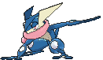
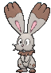
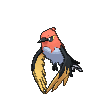
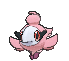
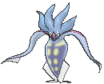
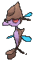
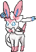
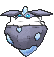

# Kalos Pokémon

---

## #650 Chespin

**Location**: Route 102

**Ability 2**: Bulletproof

**Level Up Moves:**

| Moves | Level |     | Cont. | Level |
| ----- | ----- | --- | ----- | ----- |
| Tackle | 1 |   | Seed Bomb | 22 |
| Growl | 1 |   | Mud Shot | 25 |
| Vine Whip | 5 |   | Drain Punch | 28 |
| Rollout | 7 |   | Bulk Up | 31 |
| Bite | 9 |   | Body Slam | 34 |
| Leech Seed | 12 |   | Iron Head | 37 |
| Dual Chop | 14 |   | Pain Split | 40 |
| Pin Missile | 17 |   | Wood Hammer | 43 |
| Take Down | 19 |   |   |   |

---

## #651 Quilladin

**Location**: Evolve Chespin (Lv. 16)

**Ability 2**: Bulletproof

**Level Up Moves:**

| Moves | Level |     | Cont. | Level |
| ----- | ----- | --- | ----- | ----- |
| Tackle | 1 |   | Take Down | 21 |
| Growl | 1 |   | Seed Bomb | 25 |
| Vine Whip | 5 |   | Mud Shot | 29 |
| Rollout | 7 |   | Drain Punch | 33 |
| Bite | 9 |   | Bulk Up | 37 |
| Leech Seed | 12 |   | Body Slam | 41 |
| Dual Chop | 14 |   | Iron Head | 45 |
| Needle Arm | 16 |   | Pain Split | 49 |
| Pin Missile | 18 |   | Wood Hammer | 53 |

---

## #652 Chesnaught

**Location**: Evolve Quilladin (Lv. 36)

**Ability 2**: Bulletproof

**Level Up Moves:**

| Moves | Level |     | Cont. | Level |
| ----- | ----- | --- | ----- | ----- |
| Feint | 1 |   | Take Down | 21 |
| Hammer Arm | 1 |   | Seed Bomb | 25 |
| Belly Drum | 1 |   | Mud Shot | 29 |
| Thunder Punch | 1 |   | Drain Punch | 33 |
| Tackle | 1 |   | Spiky Shield | 36 |
| Growl | 1 |   | Bulk Up | 38 |
| Vine Whip | 5 |   | Body Slam | 43 |
| Rollout | 7 |   | Iron Head | 48 |
| Bite | 9 |   | Pain Split | 53 |
| Leech Seed | 12 |   | Wood Hammer | 58 |
| Dual Chop | 14 |   | Hammer Arm | 63 |
| Needle Arm | 16 |   | Giga Impact | 68 |
| Pin Missile | 18 |   |   |   |

---

## #653 Fennekin

**Location**: Route 101

**Ability 2**: Magician

**Level Up Moves:**

| Moves | Level |     | Cont. | Level |
| ----- | ----- | --- | ----- | ----- |
| Scratch | 1 |   | Light Screen | 22 |
| Tail Whip | 1 |   | Flamethrower | 25 |
| Ember | 5 |   | Hypnosis | 28 |
| Howl | 7 |   | Will-O-Wisp | 31 |
| Flame Charge | 9 |   | Psychic | 34 |
| Psybeam | 12 |   | Sunny Day | 37 |
| Fire Spin | 14 |   | Magic Room | 40 |
| Lucky Chant | 17 |   | Fire Blast | 43 |
| Psyshock | 19 |   |   |   |

---

## #654 Braixen

**Location**: Evolve Fennekin (Lv. 16)

**Ability 2**: Magician

**Level Up Moves:**

| Moves | Level |     | Cont. | Level |
| ----- | ----- | --- | ----- | ----- |
| Scratch | 1 |   | Psyshock | 21 |
| Tail Whip | 1 |   | Light Screen | 25 |
| Ember | 5 |   | Flamethrower | 29 |
| Howl | 7 |   | Hypnosis | 33 |
| Flame Charge | 9 |   | Will-O-Wisp | 37 |
| Psybeam | 12 |   | Psychic | 41 |
| Fire Spin | 14 |   | Sunny Day | 45 |
| Incinerate | 16 |   | Magic Room | 49 |
| Lucky Chant | 18 |   | Fire Blast | 53 |

---

## #655 Delphox

**Location**: Evolve Braixen (Lv. 36)

**Ability 2**: Magician

**Level Up Moves:**

| Moves | Level |     | Cont. | Level |
| ----- | ----- | --- | ----- | ----- |
| Future Sight | 1 |   | Lucky Chant | 18 |
| Role Play | 1 |   | Psyshock | 21 |
| Switcheroo | 1 |   | Light Screen | 25 |
| Shadow Ball | 1 |   | Flamethrower | 29 |
| Scratch | 1 |   | Hypnosis | 33 |
| Tail Whip | 1 |   | Mystical Fire | 36 |
| Ember | 5 |   | Will-O-Wisp | 38 |
| Howl | 7 |   | Psychic | 43 |
| Flame Charge | 9 |   | Sunny Day | 48 |
| Psybeam | 12 |   | Magic Room | 53 |
| Fire Spin | 14 |   | Fire Blast | 58 |
| Incinerate | 16 |   | Future Sight | 63 |

---

## #656 Froakie

**Location**: Route 104 North

**Ability 2**: Protean

**Level Up Moves:**

| Moves | Level |     | Cont. | Level |
| ----- | ----- | --- | ----- | ----- |
| Pound | 1 |   | Smack Down | 22 |
| Growl | 1 |   | Scald | 25 |
| Bubble | 5 |   | Acrobatics | 28 |
| Quick Attack | 7 |   | Toxic Spikes | 31 |
| Lick | 9 |   | Substitute | 34 |
| Water Pulse | 12 |   | Bounce | 37 |
| Smokescreen | 14 |   | Double Team | 40 |
| Round | 17 |   | Hydro Pump | 43 |
| Fling | 19 |   |   |   |

---

## #657 Frogadier

**Location**: Evolve Froakie (Lv. 16)

**Ability 2**: Protean

**Level Up Moves:**

| Moves | Level |     | Cont. | Level |
| ----- | ----- | --- | ----- | ----- |
| Pound | 1 |   | Fling | 21 |
| Growl | 1 |   | Smack Down | 25 |
| Bubble | 5 |   | Scald | 29 |
| Quick Attack | 7 |   | Acrobatics | 33 |
| Lick | 9 |   | Toxic Spikes | 37 |
| Water Pulse | 12 |   | Substitute | 41 |
| Smokescreen | 14 |   | Bounce | 45 |
| Low Kick | 16 |   | Double Team | 49 |
| Round | 18 |   | Hydro Pump | 53 |

---

## #658 Greninja

**Location**: Evolve Frogadier (Lv. 36)

**Ability 2**: Protean

**Level Up Moves:**

| Moves | Level |     | Cont. | Level |
| ----- | ----- | --- | ----- | ----- |
| Night Slash | 1 |   | Spikes | 21 |
| Role Play | 1 |   | Feint Attack | 25 |
| Mat Block | 1 |   | Scald | 29 |
| Gunk Shot | 1 |   | Acrobatics | 33 |
| Pound | 1 |   | Water Shuriken | 36 |
| Growl | 1 |   | Toxic Spikes | 38 |
| Bubble | 5 |   | Substitute | 43 |
| Quick Attack | 7 |   | Extrasensory | 48 |
| Lick | 9 |   | Double Team | 53 |
| Water Pulse | 12 |   | Haze | 58 |
| Smokescreen | 14 |   | Hydro Pump | 63 |
| Low Kick | 16 |   | Night Slash | 68 |
| Shadow Sneak | 18 |   |   |   |

---

## #659 Bunnelby

**Location**: Route 101

**Level Up Moves:**

| Moves | Level |     | Cont. | Level |
| ----- | ----- | --- | ----- | ----- |
| Tackle | 1 |   | Mud Shot | 19 |
| Agility | 1 |   | Double Kick | 21 |
| Leer | 1 |   | Dig | 24 |
| Quick Attack | 4 |   | Odor Sleuth | 27 |
| Defense Curl | 7 |   | Flail | 30 |
| Double Slap | 10 |   | Bounce | 33 |
| Mud-Slap | 12 |   | Earthquake | 36 |
| Rollout | 14 |   | Facade | 39 |
| Take Down | 16 |   | Super Fang | 42 |

---

## #660 Diggersby

**Location**: Route 121

**Base Stat Changes:**

| Stat | Base | Change |
| ---- | ---- | ------ |
| HP | 85 | 96 |
| Defense | 77 | 80 |
| Sp. Defense | 77 | 80 |
| Total | 423 | 440 |

**Level Up Moves:**

| Moves | Level |     | Cont. | Level |
| ----- | ----- | --- | ----- | ----- |
| Hammer Arm | 1 |   | Mud Shot | 19 |
| Rototiller | 1 |   | Bulldoze | 20 |
| Swords Dance | 1 |   | Double Kick | 22 |
| Tackle | 1 |   | Dig | 26 |
| Agility | 1 |   | Odor Sleuth | 30 |
| Leer | 1 |   | Flail | 34 |
| Quick Attack | 4 |   | Bounce | 38 |
| Defense Curl | 7 |   | Earthquake | 42 |
| Double Slap | 10 |   | Facade | 46 |
| Mud-Slap | 12 |   | Super Fang | 50 |
| Rollout | 14 |   | Hammer Arm | 54 |
| Take Down | 16 |   |   |   |

---

## #661 Fletchling

**Location**: Route 101

**Ability 2**: Gale Wings

**Level Up Moves:**

| Moves | Level |     | Cont. | Level |
| ----- | ----- | --- | ----- | ----- |
| Tackle | 1 |   | Flame Charge | 21 |
| Growl | 1 |   | Razor Wind | 24 |
| Quick Attack | 6 |   | Acrobatics | 27 |
| Peck | 9 |   | Natural Gift | 30 |
| Agility | 12 |   | Me First | 33 |
| Flail | 15 |   | Tailwind | 36 |
| Roost | 18 |   | Steel Wing | 39 |

---

## #662 Fletchinder

**Location**: Safari Zone

**Ability 2**: Gale Wings

**Level Up Moves:**

| Moves | Level |     | Cont. | Level |
| ----- | ----- | --- | ----- | ----- |
| Tackle | 1 |   | Flame Charge | 22 |
| Growl | 1 |   | Razor Wind | 26 |
| Quick Attack | 6 |   | Acrobatics | 30 |
| Peck | 9 |   | Natural Gift | 34 |
| Agility | 12 |   | Me First | 38 |
| Flail | 15 |   | Tailwind | 42 |
| Ember | 17 |   | Steel Wing | 46 |
| Roost | 18 |   |   |   |

---

## #663 Talonflame

**Location**: Soaring in the Sky

**Ability 2**: Gale Wings

**Level Up Moves:**

| Moves | Level |     | Cont. | Level |
| ----- | ----- | --- | ----- | ----- |
| Brave Bird | 1 |   | Flame Charge | 22 |
| Tackle | 1 |   | Razor Wind | 26 |
| Growl | 1 |   | Acrobatics | 30 |
| Quick Attack | 6 |   | Natural Gift | 34 |
| Peck | 9 |   | Flare Blitz | 36 |
| Agility | 12 |   | Me First | 39 |
| Flail | 15 |   | Tailwind | 45 |
| Ember | 17 |   | Steel Wing | 51 |
| Roost | 18 |   | Brave Bird | 57 |

---

## #664 Scatterbug

**Location**: Route 104 North

**Level Up Moves:**

| Moves | Level |     | Cont. | Level |
| ----- | ----- | --- | ----- | ----- |
| Tackle | 1 |   | Bug Bite | 3 |
| String Shot | 1 |   | Electroweb | 5 |
| Stun Spore | 1 |   | Rage Powder | 7 |

---

## #665 Spewpa

**Location**: Evolve Scatterbug (Lv. 9)

**Level Up Moves:**

| Moves | Level |     | Cont. | Level |
| ----- | ----- | --- | ----- | ----- |
| Harden | 1 |   | Iron Defense | 11 |
| Protect | 9 |   |   |   |

---

## #666 Vivillon

**Location**: Evolve Spewpa (Lv. 12)

**Effort Values**: 1 Sp. Atk, 1 Spd >> 2 Sp. Atk

**New TM/HMs**: Fly

**Base Stat Changes:**

| Stat | Base | Change |
| ---- | ---- | ------ |
| Attack | 52 | 50 |
| Defense | 50 | 55 |
| Sp. Attack | 90 | 115 |
| Sp. Defense | 50 | 55 |
| Speed | 89 | 100 |
| Total | 411 | 455 |

**Level Up Moves:**

| Moves | Level |     | Cont. | Level |
| ----- | ----- | --- | ----- | ----- |
| Gust | 1 |   | Bug Buzz | 26 |
| Struggle Bug | 12 |   | Safeguard | 28 |
| Gust | 14 |   | Hurricane | 30 |
| Stun Spore | 16 |   | Powder | 32 |
| Poison Powder | 16 |   | Psychic | 34 |
| Sleep Powder | 16 |   | Tailwind | 36 |
| Psybeam | 18 |   | Energy Ball | 38 |
| Supersonic | 20 |   | Light Screen | 40 |
| Draining Kiss | 22 |   | Quiver Dance | 42 |
| Aromatherapy | 24 |   |   |   |

---

## #667 Litleo

**Location**: Route 116

**Evolution Level**: 35 >> 33

**Level Up Moves:**

| Moves | Level |     | Cont. | Level |
| ----- | ----- | --- | ----- | ----- |
| Tackle | 1 |   | Echoed Voice | 22 |
| Leer | 1 |   | Fire Fang | 25 |
| Ember | 4 |   | Take Down | 28 |
| Work Up | 7 |   | Flamethrower | 31 |
| Headbutt | 10 |   | Endeavor | 34 |
| Incinerate | 13 |   | Crunch | 37 |
| Noble Roar | 16 |   | Hyper Voice | 40 |
| Snarl | 19 |   | Overheat | 43 |

---

## #668 Pyroar

**Location**: Safari Zone

**Level Up Moves:**

| Moves | Level |     | Cont. | Level |
| ----- | ----- | --- | ----- | ----- |
| Hyper Beam | 1 |   | Echoed Voice | 22 |
| Tackle | 1 |   | Fire Fang | 25 |
| Leer | 1 |   | Take Down | 28 |
| Ember | 4 |   | Flamethrower | 31 |
| Work Up | 7 |   | Endeavor | 35 |
| Headbutt | 10 |   | Crunch | 39 |
| Incinerate | 13 |   | Hyper Voice | 43 |
| Noble Roar | 16 |   | Overheat | 47 |
| Snarl | 19 |   | Hyper Beam | 51 |

---

## #669 Flabébé

**Location**: Route 104 North

**Ability 2**: Symbiosis

**Level Up Moves:**

| Moves | Level |     | Cont. | Level |
| ----- | ----- | --- | ----- | ----- |
| Tackle | 1 |   | Grass Knot | 26 |
| Vine Whip | 1 |   | Grassy Terrain | 29 |
| Fairy Wind | 5 |   | Petal Blizzard | 32 |
| Razor Leaf | 8 |   | Moonblast | 35 |
| Wish | 11 |   | Aromatherapy | 38 |
| Magical Leaf | 14 |   | Petal Dance | 41 |
| Nature Power | 17 |   | Misty Terrain | 44 |
| Lucky Chant | 20 |   | Solar Beam | 47 |
| Dazzling Gleam | 23 |   |   |   |

---

## #670 Floette

**Location**: Route 115

**Ability 2**: Symbiosis

### Normal Forme

**Level Up Moves:**

| Moves | Level |     | Cont. | Level |
| ----- | ----- | --- | ----- | ----- |
| Tackle | 1 |   | Grass Knot | 29 |
| Vine Whip | 1 |   | Grassy Terrain | 33 |
| Fairy Wind | 5 |   | Petal Blizzard | 37 |
| Razor Leaf | 8 |   | Moonblast | 41 |
| Wish | 11 |   | Aromatherapy | 45 |
| Magical Leaf | 14 |   | Petal Dance | 49 |
| Nature Power | 17 |   | Misty Terrain | 53 |
| Lucky Chant | 21 |   | Solar Beam | 57 |
| Dazzling Gleam | 25 |   |   |   |

### Eternal Forme

**Level Up Moves:**

| Moves | Level |     | Cont. | Level |
| ----- | ----- | --- | ----- | ----- |
| Tackle | 1 |   | Grass Knot | 29 |
| Vine Whip | 1 |   | Grassy Terrain | 33 |
| Fairy Wind | 5 |   | Petal Blizzard | 37 |
| Razor Leaf | 8 |   | Moonblast | 41 |
| Wish | 11 |   | Aromatherapy | 45 |
| Magical Leaf | 14 |   | Petal Dance | 49 |
| Nature Power | 17 |   | Light of Ruin | 50 |
| Lucky Chant | 21 |   | Misty Terrain | 53 |
| Dazzling Gleam | 25 |   | Solar Beam | 57 |

---

## #671 Florges

**Location**: Evolve Floette (Shiny Stone)

**Ability 2**: Symbiosis

**Level Up Moves:**

| Moves | Level |     | Cont. | Level |
| ----- | ----- | --- | ----- | ----- |
| Disarming Voice | 1 |   | Grassy Terrain | 1 |
| Lucky Chant | 1 |   | Petal Blizzard | 1 |
| Wish | 1 |   | Misty Terrain | 1 |
| Magical Leaf | 1 |   | Moonblast | 1 |
| Flower Shield | 1 |   | Petal Dance | 1 |
| Grass Knot | 1 |   | Aromatherapy | 1 |

---

## #672 Skiddo

**Location**: Route 110

**Ability 2**: Grass Pelt

**Level Up Moves:**

| Moves | Level |     | Cont. | Level |
| ----- | ----- | --- | ----- | ----- |
| Tackle | 1 |   | Bulldoze | 26 |
| Growth | 1 |   | Seed Bomb | 29 |
| Vine Whip | 5 |   | Synthesis | 32 |
| Tail Whip | 8 |   | Zen Headbutt | 35 |
| Razor Leaf | 11 |   | Bulk Up | 38 |
| Leech Seed | 14 |   | Double-Edge | 41 |
| Worry Seed | 17 |   | Leaf Blade | 44 |
| Horn Leech | 20 |   | Milk Drink | 47 |
| Take Down | 23 |   |   |   |

---

## #673 Gogoat

**Location**: Safari Zone

**Ability 2**: Grass Pelt

**Level Up Moves:**

| Moves | Level |     | Cont. | Level |
| ----- | ----- | --- | ----- | ----- |
| Tackle | 1 |   | Seed Bomb | 29 |
| Growth | 1 |   | Aerial Ace | 32 |
| Vine Whip | 5 |   | Synthesis | 33 |
| Tail Whip | 8 |   | Zen Headbutt | 37 |
| Razor Leaf | 11 |   | Bulk Up | 41 |
| Leech Seed | 14 |   | Double-Edge | 45 |
| Worry Seed | 17 |   | Leaf Blade | 49 |
| Horn Leech | 20 |   | Milk Drink | 53 |
| Take Down | 23 |   | Earthquake | 57 |
| Bulldoze | 26 |   | Wild Charge | 61 |

---

## #674 Pancham

**Location**: Route 116

**Level Up Moves:**

| Moves | Level |     | Cont. | Level |
| ----- | ----- | --- | ----- | ----- |
| Tackle | 1 |   | Vital Throw | 27 |
| Leer | 1 |   | Body Slam | 30 |
| Arm Thrust | 6 |   | Crunch | 33 |
| Work Up | 9 |   | Storm Throw | 36 |
| Karate Chop | 12 |   | Entrainment | 39 |
| Comet Punch | 15 |   | Drain Punch | 42 |
| Knock Off | 18 |   | Parting Shot | 45 |
| Slash | 21 |   | Sky Uppercut | 48 |
| Circle Throw | 24 |   |   |   |

---

## #675 Pangoro

**Location**: Route 116

**Level Up Moves:**

| Moves | Level |     | Cont. | Level |
| ----- | ----- | --- | ----- | ----- |
| Entrainment | 1 |   | Circle Throw | 24 |
| Hammer Arm | 1 |   | Vital Throw | 27 |
| Ice Punch | 1 |   | Body Slam | 30 |
| Fire Punch | 1 |   | Crunch | 34 |
| Thunder Punch | 1 |   | Storm Throw | 38 |
| Tackle | 1 |   | Entrainment | 42 |
| Leer | 1 |   | Drain Punch | 46 |
| Arm Thrust | 6 |   | Parting Shot | 50 |
| Work Up | 9 |   | Sky Uppercut | 54 |
| Karate Chop | 12 |   | Hammer Arm | 58 |
| Comet Punch | 15 |   | Taunt | 62 |
| Knock Off | 18 |   | Low Sweep | 66 |
| Slash | 21 |   |   |   |

---

## #676 Furfrou

**Location**: Route 116

**Level Up Moves:**

| Moves | Level |     | Cont. | Level |
| ----- | ----- | --- | ----- | ----- |
| Frustration | 1 |   | Retaliate | 24 |
| Return | 1 |   | Odor Sleuth | 28 |
| Tackle | 1 |   | Take Down | 32 |
| Growl | 1 |   | Zen Headbutt | 36 |
| Sand-Attack | 4 |   | Sucker Punch | 40 |
| Baby-Doll Eyes | 8 |   | Iron Tail | 44 |
| Headbutt | 12 |   | Charm | 48 |
| Tail Whip | 16 |   | Cotton Guard | 52 |
| Bite | 20 |   |   |   |

---

## #677 Espurr

**Location**: Route 113

**Level Up Moves:**

| Moves | Level |     | Cont. | Level |
| ----- | ----- | --- | ----- | ----- |
| Scratch | 1 |   | Psybeam | 17 |
| Leer | 1 |   | Fake Out | 19 |
| Covet | 5 |   | Disarming Voice | 22 |
| Confusion | 9 |   | Psyshock | 25 |
| Light Screen | 13 |   |   |   |

---

## #678 Meowstic

**Location**: Safari Zone

### Male Forme

**Level Up Moves:**

| Moves | Level |     | Cont. | Level |
| ----- | ----- | --- | ----- | ----- |
| Quick Guard | 1 |   | Psyshock | 25 |
| Mean Look | 1 |   | Charm | 28 |
| Helping Hand | 1 |   | Miracle Eye | 31 |
| Scratch | 1 |   | Reflect | 35 |
| Leer | 1 |   | Psychic | 40 |
| Covet | 5 |   | Role Play | 43 |
| Confusion | 9 |   | Imprison | 45 |
| Light Screen | 13 |   | Sucker Punch | 48 |
| Psybeam | 17 |   | Misty Terrain | 50 |
| Fake Out | 19 |   | Quick Guard | 53 |
| Disarming Voice | 22 |   |   |   |

### Female Forme

**Level Up Moves:**

| Moves | Level |     | Cont. | Level |
| ----- | ----- | --- | ----- | ----- |
| Stored Power | 1 |   | Psyshock | 25 |
| Me First | 1 |   | Charge Beam | 28 |
| Magical Leaf | 1 |   | Shadow Ball | 31 |
| Scratch | 1 |   | Extrasensory | 35 |
| Leer | 1 |   | Psychic | 40 |
| Covet | 5 |   | Role Play | 43 |
| Confusion | 9 |   | Signal Beam | 45 |
| Light Screen | 13 |   | Sucker Punch | 48 |
| Psybeam | 17 |   | Future Sight | 50 |
| Fake Out | 19 |   | Stored Power | 53 |
| Disarming Voice | 22 |   |   |   |

---

## #679 Honedge

**Location**: Route 113

**Level Up Moves:**

| Moves | Level |     | Cont. | Level |
| ----- | ----- | --- | ----- | ----- |
| Tackle | 1 |   | Retaliate | 24 |
| Swords Dance | 1 |   | Shadow Claw | 27 |
| Fury Cutter | 6 |   | Slash | 30 |
| Metal Sound | 9 |   | Iron Head | 33 |
| Pursuit | 12 |   | Iron Defense | 36 |
| Shadow Sneak | 15 |   | Night Slash | 39 |
| Autotomize | 18 |   | Power Trick | 42 |
| Aerial Ace | 21 |   | Sacred Sword | 45 |

---

## #680 Doublade

**Location**: Safari Zone

**Level Up Moves:**

| Moves | Level |     | Cont. | Level |
| ----- | ----- | --- | ----- | ----- |
| Tackle | 1 |   | Retaliate | 24 |
| Swords Dance | 1 |   | Shadow Claw | 27 |
| Fury Cutter | 6 |   | Slash | 30 |
| Metal Sound | 9 |   | Iron Head | 33 |
| Pursuit | 12 |   | Iron Defense | 37 |
| Shadow Sneak | 15 |   | Night Slash | 41 |
| Autotomize | 18 |   | Power Trick | 45 |
| Aerial Ace | 21 |   | Sacred Sword | 49 |

---

## #681 Aegislash

**Location**: Evolve Doublade (Dusk Stone)

**Level Up Moves:**

| Moves | Level |     | Cont. | Level |
| ----- | ----- | --- | ----- | ----- |
| Fury Cutter | 1 |   | Power Trick | 1 |
| Pursuit | 1 |   | Iron Head | 1 |
| Autotomize | 1 |   | Head Smash | 1 |
| Shadow Sneak | 1 |   | Swords Dance | 1 |
| Slash | 1 |   | Aerial Ace | 1 |
| Iron Defense | 1 |   | King's Shield | 1 |
| Night Slash | 1 |   | Sacred Sword | 1 |

---

## #682 Spritzee

**Location**: Route 104 South

**Ability 2**: Aroma Veil

**Level Up Moves:**

| Moves | Level |     | Cont. | Level |
| ----- | ----- | --- | ----- | ----- |
| Sweet Scent | 1 |   | Moonblast | 26 |
| Fairy Wind | 1 |   | Charm | 29 |
| Sweet Kiss | 5 |   | Flail | 32 |
| Odor Sleuth | 8 |   | Misty Terrain | 35 |
| Echoed Voice | 11 |   | Skill Swap | 38 |
| Calm Mind | 14 |   | Psychic | 41 |
| Draining Kiss | 17 |   | Disarming Voice | 44 |
| Aromatherapy | 20 |   | Trick Room | 47 |
| Attract | 23 |   |   |   |

---

## #683 Aromatisse

**Location**: Evolve Spritzee (Sachet)

**Ability 2**: Aroma Veil

**Level Up Moves:**

| Moves | Level |     | Cont. | Level |
| ----- | ----- | --- | ----- | ----- |
| Sweet Scent | 1 |   | Flail | 32 |
| Fairy Wind | 1 |   | Misty Terrain | 35 |
| Sweet Kiss | 5 |   | Skill Swap | 38 |
| Odor Sleuth | 8 |   | Psychic | 41 |
| Echoed Voice | 11 |   | Disarming Voice | 44 |
| Calm Mind | 14 |   | Trick Room | 47 |
| Draining Kiss | 17 |   | Aromatic Mist | 50 |
| Aromatherapy | 20 |   | Heal Pulse | 53 |
| Attract | 23 |   | Reflect | 56 |
| Moonblast | 26 |   | Psych Up | 59 |
| Charm | 29 |   |   |   |

---

## #684 Swirlix

**Location**: Route 104 South

**Ability 2**: Unburden

**Level Up Moves:**

| Moves | Level |     | Cont. | Level |
| ----- | ----- | --- | ----- | ----- |
| Sweet Scent | 1 |   | Aromatherapy | 26 |
| Tackle | 1 |   | Fake Tears | 29 |
| Fairy Wind | 5 |   | Energy Ball | 32 |
| Play Nice | 8 |   | Cotton Guard | 35 |
| Draining Kiss | 11 |   | Wish | 38 |
| Round | 14 |   | Light Screen | 41 |
| Cotton Spore | 17 |   | Safeguard | 44 |
| Endeavor | 20 |   | Belly Drum | 47 |
| Play Rough | 23 |   |   |   |

---

## #685 Slurpuff

**Location**: Evolve Swirlix (Whipped Dream)

**Ability 2**: Unburden

**Level Up Moves:**

| Moves | Level |     | Cont. | Level |
| ----- | ----- | --- | ----- | ----- |
| Sweet Scent | 1 |   | Aromatherapy | 26 |
| Tackle | 1 |   | Fake Tears | 29 |
| Fairy Wind | 5 |   | Energy Ball | 32 |
| Play Nice | 8 |   | Cotton Guard | 35 |
| Draining Kiss | 11 |   | Wish | 38 |
| Round | 14 |   | Light Screen | 41 |
| Cotton Spore | 17 |   | Safeguard | 44 |
| Endeavor | 20 |   | Belly Drum | 47 |
| Play Rough | 23 |   |   |   |

---

## #686 Inkay

**Location**: Route 118

**Level Up Moves:**

| Moves | Level |     | Cont. | Level |
| ----- | ----- | --- | ----- | ----- |
| Tackle | 1 |   | Psybeam | 22 |
| Peck | 1 |   | Switcheroo | 25 |
| Constrict | 1 |   | Payback | 28 |
| Reflect | 4 |   | Psycho Cut | 31 |
| Foul Play | 7 |   | Pluck | 34 |
| Swagger | 10 |   | Light Screen | 37 |
| Psywave | 13 |   | Slash | 40 |
| Topsy-Turvy | 16 |   | Night Slash | 43 |
| Hypnosis | 19 |   | Superpower | 46 |

---

## #687 Malamar

**Location**: Route 118

**Level Up Moves:**

| Moves | Level |     | Cont. | Level |
| ----- | ----- | --- | ----- | ----- |
| Superpower | 1 |   | Hypnosis | 19 |
| Reversal | 1 |   | Psybeam | 22 |
| Tackle | 1 |   | Switcheroo | 25 |
| Peck | 1 |   | Payback | 28 |
| Constrict | 1 |   | Psycho Cut | 31 |
| Reflect | 4 |   | Pluck | 34 |
| Foul Play | 7 |   | Light Screen | 37 |
| Swagger | 10 |   | Slash | 40 |
| Psywave | 13 |   | Night Slash | 43 |
| Topsy-Turvy | 16 |   | Superpower | 46 |

---

## #688 Binacle

**Location**: Route 111

**Evolution Level**: 39 >> 34

**New TM/HMs**: Waterfall, Dive

**Level Up Moves:**

| Moves | Level |     | Cont. | Level |
| ----- | ----- | --- | ----- | ----- |
| Shell Smash | 1 |   | Rock Polish | 22 |
| Scratch | 1 |   | Ancient Power | 25 |
| Sand Attack | 1 |   | Hone Claws | 28 |
| Water Gun | 4 |   | Fury Cutter | 31 |
| Withdraw | 7 |   | Rock Slide | 34 |
| Fury Swipes | 10 |   | Night Slash | 37 |
| Slash | 13 |   | Razor Shell | 40 |
| Mud-Slap | 16 |   | X-Scissor | 43 |
| Clamp | 19 |   | Cross Chop | 46 |

---

## #689 Barbaracle

**Location**: Lilycove City

**New TM/HMs**: Waterfall, Dive

**Level Up Moves:**

| Moves | Level |     | Cont. | Level |
| ----- | ----- | --- | ----- | ----- |
| Skull Bash | 1 |   | Rock Polish | 22 |
| Stone Edge | 1 |   | Ancient Power | 25 |
| Dragon Claw | 1 |   | Hone Claws | 28 |
| Shell Smash | 1 |   | Fury Cutter | 31 |
| Scratch | 1 |   | Rock Slide | 34 |
| Sand Attack | 1 |   | Night Slash | 38 |
| Water Gun | 4 |   | Razor Shell | 42 |
| Withdraw | 7 |   | X-Scissor | 46 |
| Fury Swipes | 10 |   | Cross Chop | 50 |
| Slash | 13 |   | Dragon Claw | 54 |
| Mud-Slap | 16 |   | Stone Edge | 58 |
| Clamp | 19 |   | Skull Bash | 62 |

---

## #690 Skrelp

**Location**: Route 107, Route 127, Route 131

**Evolution Level**: 48 >> 35

**Level Up Moves:**

| Moves | Level |     | Cont. | Level |
| ----- | ----- | --- | ----- | ----- |
| Tackle | 1 |   | Poison Tail | 23 |
| Smokescreen | 1 |   | Double Team | 26 |
| Water Gun | 1 |   | Sludge Bomb | 29 |
| Feint Attack | 5 |   | Toxic | 32 |
| Tail Whip | 8 |   | Aqua Tail | 35 |
| Bubble | 11 |   | Sludge Wave | 38 |
| Acid | 14 |   | Dragon Pulse | 41 |
| Camouflage | 17 |   | Hydro Pump | 44 |
| Water Pulse | 20 |   |   |   |

---

## #691 Dragalge

**Location**: Route 107, Route 127, Route 130, Underwater

**Level Up Moves:**

| Moves | Level |     | Cont. | Level |
| ----- | ----- | --- | ----- | ----- |
| Dragon Tail | 1 |   | Poison Tail | 23 |
| Tackle | 1 |   | Double Team | 26 |
| Smokescreen | 1 |   | Sludge Bomb | 29 |
| Water Gun | 1 |   | Toxic | 32 |
| Feint Attack | 5 |   | Twister | 35 |
| Tail Whip | 8 |   | Aqua Tail | 36 |
| Bubble | 11 |   | Sludge Wave | 40 |
| Acid | 14 |   | Dragon Pulse | 44 |
| Camouflage | 17 |   | Hydro Pump | 48 |
| Water Pulse | 20 |   | Dragon Tail | 52 |

---

## #692 Clauncher

**Location**: Route 107, Route 131

**Evolution Level**: 37 >> 33

**Level Up Moves:**

| Moves | Level |     | Cont. | Level |
| ----- | ----- | --- | ----- | ----- |
| Splash | 1 |   | Flail | 21 |
| Water Gun | 1 |   | Water Pulse | 24 |
| Water Sport | 6 |   | Crabhammer | 27 |
| Vice Grip | 9 |   | Swords Dance | 30 |
| Bubble | 12 |   | Aqua Jet | 33 |
| Smack Down | 15 |   | Flash Cannon | 36 |
| Bubble Beam | 18 |   | Muddy Water | 39 |

---

## #693 Clawitzer

**Location**: Route 107, Route 131

**Level Up Moves:**

| Moves | Level |     | Cont. | Level |
| ----- | ----- | --- | ----- | ----- |
| Heal Pulse | 1 |   | Water Pulse | 24 |
| Splash | 1 |   | Crabhammer | 27 |
| Water Gun | 1 |   | Swords Dance | 30 |
| Water Sport | 6 |   | Aqua Jet | 34 |
| Vice Grip | 9 |   | Flash Cannon | 38 |
| Bubble | 12 |   | Muddy Water | 42 |
| Smack Down | 15 |   | Dark Pulse | 46 |
| Bubble Beam | 18 |   | Dragon Pulse | 50 |
| Flail | 21 |   | Aura Sphere | 54 |

---

## #694 Helioptile

**Location**: Route 111

**Held Item**: Sail Fossil (50%)

**Level Up Moves:**

| Moves | Level |     | Cont. | Level |
| ----- | ----- | --- | ----- | ----- |
| Pound | 1 |   | Parabolic Charge | 24 |
| Tail Whip | 1 |   | Thunder Wave | 28 |
| Thunder Shock | 4 |   | Bulldoze | 32 |
| Charge | 8 |   | Thunderbolt | 36 |
| Mud-Slap | 12 |   | Signal Beam | 40 |
| Quick Attack | 16 |   | Electrify | 44 |
| Razor Wind | 20 |   | Volt Switch | 48 |

---

## #695 Heliolisk

**Location**: Evolve Helioptile (Sun Stone)

**Level Up Moves:**

| Moves | Level |     | Cont. | Level |
| ----- | ----- | --- | ----- | ----- |
| Eerie Impulse | 1 |   | Thunder | 1 |
| Electrify | 1 |   | Charge | 1 |
| Dragon Pulse | 1 |   | Parabolic Charge | 1 |
| Razor Wind | 1 |   | Hyper Voice | 43 |
| Quick Attack | 1 |   |   |   |

---

## #696 Tyrunt

**Location**: Seafloor Cavern, Revive Jaw Fossil

**Ability 2**: Sturdy

**Level Up Moves:**

| Moves | Level |     | Cont. | Level |
| ----- | ----- | --- | ----- | ----- |
| Tail Whip | 1 |   | Ancient Power | 24 |
| Tackle | 1 |   | Dragon Tail | 27 |
| Roar | 6 |   | Crunch | 30 |
| Stomp | 9 |   | Dragon Claw | 34 |
| Bide | 12 |   | Thrash | 38 |
| Stealth Rock | 15 |   | Earthquake | 42 |
| Bite | 18 |   | Horn Drill | 46 |
| Charm | 21 |   | Outrage | 50 |

---

## #697 Tyrantrum

**Location**: Seafloor Cavern

**Ability 2**: Rock Head

**Level Up Moves:**

| Moves | Level |     | Cont. | Level |
| ----- | ----- | --- | ----- | ----- |
| Head Smash | 1 |   | Charm | 21 |
| Zen Headbutt | 1 |   | Ancient Power | 24 |
| Ice Fang | 1 |   | Dragon Tail | 27 |
| Fire Fang | 1 |   | Crunch | 30 |
| Thunder Fang | 1 |   | Dragon Claw | 34 |
| Tail Whip | 1 |   | Thrash | 38 |
| Tackle | 1 |   | Earthquake | 43 |
| Roar | 6 |   | Horn Drill | 48 |
| Stomp | 9 |   | Outrage | 53 |
| Bide | 12 |   | Head Smash | 58 |
| Stealth Rock | 15 |   | Rock Slide | 63 |
| Bite | 18 |   | Giga Impact | 68 |

---

## #698 Amaura

**Location**: Seafloor Cavern, Revive Sail Fossil

**Ability 2**: Snow Warning

**Level Up Moves:**

| Moves | Level |     | Cont. | Level |
| ----- | ----- | --- | ----- | ----- |
| Growl | 1 |   | Discharge | 30 |
| Powder Snow | 1 |   | Avalanche | 33 |
| Thunder Wave | 6 |   | Hail | 36 |
| Rock Throw | 9 |   | Nature Power | 39 |
| Icy Wind | 12 |   | Ice Beam | 42 |
| Take Down | 15 |   | Encore | 45 |
| Mist | 18 |   | Hyper Voice | 48 |
| Aurora Beam | 21 |   | Light Screen | 51 |
| Ancient Power | 24 |   | Hyper Beam | 54 |
| Round | 27 |   | Blizzard | 57 |

---

## #699 Aurorus

**Location**: Seafloor Cavern

**Ability 2**: Snow Warning

**Level Up Moves:**

| Moves | Level |     | Cont. | Level |
| ----- | ----- | --- | ----- | ----- |
| Growl | 1 |   | Avalanche | 33 |
| Powder Snow | 1 |   | Hail | 36 |
| Thunder Wave | 6 |   | Freeze-Dry | 39 |
| Rock Throw | 9 |   | Nature Power | 43 |
| Icy Wind | 12 |   | Ice Beam | 47 |
| Take Down | 15 |   | Encore | 51 |
| Mist | 18 |   | Hyper Voice | 55 |
| Aurora Beam | 21 |   | Light Screen | 59 |
| Ancient Power | 24 |   | Hyper Beam | 63 |
| Round | 27 |   | Blizzard | 67 |
| Discharge | 30 |   |   |   |

---

## #700 Sylveon

**Location**: Evolve Eevee (Fairy Move & Amie Affection)

**Ability 2**: Pixilate

**Level Up Moves:**

| Moves | Level |     | Cont. | Level |
| ----- | ----- | --- | ----- | ----- |
| Disarming Voice | 1 |   | Draining Kiss | 20 |
| Tail Whip | 1 |   | Skill Swap | 25 |
| Tackle | 1 |   | Misty Terrain | 29 |
| Helping Hand | 1 |   | Light Screen | 33 |
| Sand Attack | 5 |   | Moonblast | 37 |
| Fairy Wind | 9 |   | Last Resort | 41 |
| Quick Attack | 13 |   | Psych Up | 45 |
| Swift | 17 |   | Hyper Voice | 50 |

---

## #701 Hawlucha

**Location**: Route 115

**Level Up Moves:**

| Moves | Level |     | Cont. | Level |
| ----- | ----- | --- | ----- | ----- |
| Fire Punch | 1 |   | Bounce | 27 |
| Thunder Punch | 1 |   | Endeavor | 30 |
| Swords Dance | 1 |   | Drain Punch | 33 |
| Tackle | 1 |   | Acrobatics | 36 |
| Hone Claws | 1 |   | Zen Headbutt | 39 |
| Karate Chop | 6 |   | High Jump Kick | 42 |
| Wing Attack | 9 |   | Feather Dance | 45 |
| Roost | 12 |   | Iron Head | 48 |
| Aerial Ace | 15 |   | Dual Chop | 51 |
| Encore | 18 |   | Sky Drop | 54 |
| Fling | 21 |   | Sky Attack | 57 |
| Flying Press | 24 |   |   |   |

---

## #702 Dedenne

**Location**: Route 118

**New TM/HMs**: Dazzling Gleam

**Base Stat Changes:**

| Stat | Base | Change |
| ---- | ---- | ------ |
| HP | 67 | 75 |
| Attack | 58 | 60 |
| Defense | 57 | 60 |
| Sp. Attack | 81 | 90 |
| Sp. Defense | 67 | 70 |
| Speed | 101 | 110 |
| Total | 431 | 465 |

**Level Up Moves:**

| Moves | Level |     | Cont. | Level |
| ----- | ----- | --- | ----- | ----- |
| Covet | 1 |   | Volt Switch | 24 |
| Super Fang | 1 |   | Rest | 27 |
| Tackle | 1 |   | Snore | 27 |
| Tail Whip | 1 |   | Sleep Talk | 27 |
| Thunder Shock | 6 |   | Charge Beam | 30 |
| Charge | 9 |   | Play Rough | 33 |
| Charm | 12 |   | Discharge | 36 |
| Parabolic Charge | 15 |   | Entrainment | 39 |
| Nuzzle | 18 |   | Moonblast | 42 |
| Thunder Wave | 21 |   | Thunder | 45 |

---

## #703 Carbink

**Location**: Meteor Falls

**Ability 2**: Sturdy

**Level Up Moves:**

| Moves | Level |     | Cont. | Level |
| ----- | ----- | --- | ----- | ----- |
| Tackle | 1 |   | Guard Split | 32 |
| Harden | 1 |   | Flail | 36 |
| Rock Throw | 4 |   | Power Gem | 40 |
| Sharpen | 8 |   | Skill Swap | 44 |
| Smack Down | 12 |   | Earth Power | 48 |
| Reflect | 16 |   | Stone Edge | 52 |
| Stealth Rock | 20 |   | Light Screen | 56 |
| Moonblast | 24 |   | Safeguard | 60 |
| Ancient Power | 28 |   |   |   |

---

## #704 Goomy

**Location**: Route 119

**Level Up Moves:**

| Moves | Level |     | Cont. | Level |
| ----- | ----- | --- | ----- | ----- |
| Tackle | 1 |   | Flail | 25 |
| Bubble | 1 |   | Sludge Wave | 29 |
| Absorb | 5 |   | Body Slam | 33 |
| Protect | 9 |   | Muddy Water | 37 |
| Bide | 13 |   | Dragon Pulse | 41 |
| Dragon Breath | 17 |   | Acid Armor | 45 |
| Rain Dance | 21 |   |   |   |

---

## #705 Sliggoo

**Location**: Route 119

**Level Up Moves:**

| Moves | Level |     | Cont. | Level |
| ----- | ----- | --- | ----- | ----- |
| Tackle | 1 |   | Flail | 25 |
| Bubble | 1 |   | Sludge Wave | 29 |
| Absorb | 5 |   | Body Slam | 33 |
| Protect | 9 |   | Muddy Water | 37 |
| Bide | 13 |   | Dragon Pulse | 42 |
| Dragon Breath | 17 |   | Acid Armor | 47 |
| Rain Dance | 21 |   |   |   |

---

## #706 Goodra

**Location**: Evolve Sliggoo (Lv. 50 + Rain)

**Level Up Moves:**

| Moves | Level |     | Cont. | Level |
| ----- | ----- | --- | ----- | ----- |
| Feint | 1 |   | Sludge Wave | 29 |
| Tackle | 1 |   | Body Slam | 33 |
| Bubble | 1 |   | Muddy Water | 37 |
| Absorb | 5 |   | Dragon Pulse | 42 |
| Protect | 9 |   | Acid Armor | 47 |
| Bide | 13 |   | Aqua Tail | 50 |
| Dragon Breath | 17 |   | Power Whip | 55 |
| Rain Dance | 21 |   | Outrage | 60 |
| Flail | 25 |   |   |   |

---

## #707 Klefki

**Location**: Route 113

**Ability 2**: Magician

**Level Up Moves:**

| Moves | Level |     | Cont. | Level |
| ----- | ----- | --- | ----- | ----- |
| Fairy Lock | 1 |   | Crafty Shield | 22 |
| Tackle | 1 |   | Play Rough | 25 |
| Fairy Wind | 4 |   | Foul Play | 28 |
| Astonish | 7 |   | Torment | 31 |
| Metal Sound | 10 |   | Imprison | 34 |
| Spikes | 13 |   | Flash Cannon | 37 |
| Draining Kiss | 16 |   | Recycle | 40 |
| Mirror Shot | 19 |   | Magic Room | 43 |

---

## #708 Phantump

**Location**: Petalburg Woods

**Evolution**: Happiness or Level 23

**Level Up Moves:**

| Moves | Level |     | Cont. | Level |
| ----- | ----- | --- | ----- | ----- |
| Tackle | 1 |   | Leech Seed | 25 |
| Confuse Ray | 1 |   | Curse | 29 |
| Astonish | 6 |   | Will-O-Wisp | 33 |
| Growth | 9 |   | Forest's Curse | 37 |
| Horn Leech | 12 |   | Wood Hammer | 41 |
| Ingrain | 15 |   | Phantom Force | 45 |
| Feint Attack | 18 |   | Destiny Bond | 49 |
| Shadow Claw | 21 |   |   |   |

---

## #709 Trevenant

**Location**: Evolve Phantump (Happiness / Lv. 23)

**Level Up Moves:**

| Moves | Level |     | Cont. | Level |
| ----- | ----- | --- | ----- | ----- |
| Tackle | 1 |   | Leech Seed | 25 |
| Confuse Ray | 1 |   | Curse | 29 |
| Astonish | 6 |   | Will-O-Wisp | 33 |
| Growth | 9 |   | Forest's Curse | 37 |
| Horn Leech | 12 |   | Wood Hammer | 41 |
| Ingrain | 15 |   | Phantom Force | 45 |
| Feint Attack | 18 |   | Destiny Bond | 49 |
| Shadow Claw | 21 |   |   |   |

---

## #710 Pumpkaboo

**Location**: Petalburg Woods

**Evolution**: Happiness or Level 23

**Level Up Moves:**

| Moves | Level |     | Cont. | Level |
| ----- | ----- | --- | ----- | ----- |
| Trick | 1 |   | Bullet Seed | 19 |
| Trick-or-Treat | 1 |   | Leech Seed | 22 |
| Astonish | 1 |   | Seed Bomb | 26 |
| Confuse Ray | 7 |   | Pain Split | 30 |
| Razor Leaf | 10 |   | Worry Seed | 34 |
| Scary Face | 13 |   | Shadow Ball | 38 |
| Shadow Sneak | 16 |   | Petal Blizzard | 42 |

---

## #711 Gourgeist

**Location**: Evolve Pumpkaboo (Happiness / Lv. 23)

**Level Up Moves:**

| Moves | Level |     | Cont. | Level |
| ----- | ----- | --- | ----- | ----- |
| Explosion | 1 |   | Flame Charge | 20 |
| Phantom Force | 1 |   | Leech Seed | 22 |
| Trick | 1 |   | Seed Bomb | 26 |
| Trick-or-Treat | 1 |   | Pain Split | 30 |
| Astonish | 1 |   | Worry Seed | 34 |
| Confuse Ray | 7 |   | Shadow Ball | 38 |
| Razor Leaf | 10 |   | Petal Blizzard | 42 |
| Scary Face | 13 |   | Phantom Force | 46 |
| Shadow Sneak | 16 |   | Explosion | 50 |
| Bullet Seed | 19 |   |   |   |

---

## #712 Bergmite

**Location**: Shoal Cave

**Level Up Moves:**

| Moves | Level |     | Cont. | Level |
| ----- | ----- | --- | ----- | ----- |
| Tackle | 1 |   | Ice Ball | 27 |
| Bite | 1 |   | Rapid Spin | 30 |
| Harden | 1 |   | Rock Slide | 33 |
| Powder Snow | 9 |   | Avalanche | 36 |
| Icy Wind | 12 |   | Recover | 39 |
| Take Down | 15 |   | Blizzard | 42 |
| Sharpen | 18 |   | Stone Edge | 45 |
| Curse | 21 |   | Double-Edge | 48 |
| Ice Fang | 24 |   |   |   |

---

## #713 Avalugg

**Location**: Shoal Cave

**Level Up Moves:**

| Moves | Level |     | Cont. | Level |
| ----- | ----- | --- | ----- | ----- |
| Iron Defense | 1 |   | Ice Fang | 24 |
| Crunch | 1 |   | Ice Ball | 27 |
| Skull Bash | 1 |   | Rapid Spin | 30 |
| Tackle | 1 |   | Rock Slide | 33 |
| Bite | 1 |   | Avalanche | 36 |
| Harden | 1 |   | Recover | 40 |
| Powder Snow | 9 |   | Blizzard | 44 |
| Icy Wind | 12 |   | Stone Edge | 48 |
| Take Down | 15 |   | Double-Edge | 52 |
| Sharpen | 18 |   | Skull Bash | 56 |
| Curse | 21 |   | Crunch | 60 |

---

## #714 Noibat

**Location**: Scorched Slab

**Evolution Level**: 48 >> 44

**Level Up Moves:**

| Moves | Level |     | Cont. | Level |
| ----- | ----- | --- | ----- | ----- |
| Screech | 1 |   | Roost | 24 |
| Supersonic | 1 |   | Razor Wind | 28 |
| Tackle | 1 |   | Dragon Pulse | 32 |
| Leech Life | 5 |   | Air Slash | 36 |
| Gust | 8 |   | Tailwind | 40 |
| Bite | 11 |   | Whirlwind | 44 |
| Wing Attack | 14 |   | Super Fang | 48 |
| Agility | 17 |   | Hurricane | 52 |
| Air Cutter | 20 |   |   |   |

---

## #715 Noivern

**Location**: Scorched Slab, Seafloor Cavern, Cave of Origin, Sky Pillar

**Level Up Moves:**

| Moves | Level |     | Cont. | Level |
| ----- | ----- | --- | ----- | ----- |
| Boomburst | 1 |   | Agility | 17 |
| Hurricane | 1 |   | Air Cutter | 20 |
| Moonlight | 1 |   | Roost | 24 |
| Heat Wave | 1 |   | Razor Wind | 28 |
| Screech | 1 |   | Dragon Pulse | 32 |
| Supersonic | 1 |   | Air Slash | 36 |
| Tackle | 1 |   | Tailwind | 40 |
| Leech Life | 5 |   | Whirlwind | 45 |
| Gust | 8 |   | Super Fang | 50 |
| Bite | 11 |   | Hurricane | 55 |
| Wing Attack | 14 |   | Boomburst | 60 |

---

## #716 Xerneas

**Location**: Mirage Forest

**Level Up Moves:**

| Moves | Level |     | Cont. | Level |
| ----- | ----- | --- | ----- | ----- |
| Heal Pulse | 1 |   | Misty Terrain | 30 |
| Aromatherapy | 1 |   | Geomancy | 35 |
| Ingrain | 1 |   | Nature Power | 40 |
| Take Down | 1 |   | Megahorn | 45 |
| Light Screen | 5 |   | Psych Up | 50 |
| Aurora Beam | 10 |   | Moonblast | 55 |
| Gravity | 15 |   | Close Combat | 60 |
| Horn Leech | 20 |   | Giga Impact | 65 |
| Night Slash | 25 |   | Outrage | 70 |

---

## #717 Yveltal

**Location**: Mirage Mountain

**Level Up Moves:**

| Moves | Level |     | Cont. | Level |
| ----- | ----- | --- | ----- | ----- |
| Hurricane | 1 |   | Phantom Force | 30 |
| Razor Wind | 1 |   | Sucker Punch | 35 |
| Taunt | 1 |   | Dark Pulse | 40 |
| Roost | 1 |   | Psychic | 45 |
| Double Team | 5 |   | Dragon Rush | 50 |
| Air Slash | 10 |   | Focus Blast | 55 |
| Snarl | 15 |   | Oblivion Wing | 60 |
| Disable | 20 |   | Hyper Beam | 65 |
| Foul Play | 25 |   | Sky Attack | 70 |

---

## #718 Zygarde

**Location**: Mirage Cave

**Level Up Moves:**

| Moves | Level |     | Cont. | Level |
| ----- | ----- | --- | ----- | ----- |
| Glare | 1 |   | Land's Wrath | 35 |
| Bulldoze | 1 |   | Crunch | 40 |
| Dragon Breath | 1 |   | Earthquake | 45 |
| Bite | 1 |   | Dragon Pulse | 50 |
| Safeguard | 5 |   | Dragon Dance | 55 |
| Dig | 10 |   | Coil | 60 |
| Bind | 15 |   | Thousand Arrows | 65 |
| Sandstorm | 20 |   | Thousand Waves | 65 |
| Haze | 25 |   | Extreme Speed | 70 |
| Camouflage | 30 |   | Outrage | 75 |

---

## #719 Diancie

**Location**: Mirage Cave

**Held Item**: Diancite (100%)

**Level Up Moves:**

| Moves | Level |     | Cont. | Level |
| ----- | ----- | --- | ----- | ----- |
| Tackle | 1 |   | Flail | 35 |
| Harden | 1 |   | Skill Swap | 40 |
| Rock Throw | 5 |   | Trick Room | 46 |
| Sharpen | 8 |   | Stone Edge | 49 |
| Smack Down | 12 |   | Moonblast | 50 |
| Reflect | 18 |   | Diamond Storm | 50 |
| Stealth Rock | 21 |   | Light Screen | 60 |
| Guard Split | 27 |   | Safeguard | 70 |
| Ancient Power | 31 |   |   |   |

---

## #720 Hoopa

**Location**: Mirage Island

**Held Item**: Prison Bottle (100%)

### Normal Forme

**Level Up Moves:**

| Moves | Level |     | Cont. | Level |
| ----- | ----- | --- | ----- | ----- |
| Trick | 1 |   | Guard Split | 30 |
| Destiny Bond | 1 |   | Phantom Force | 35 |
| Ally Switch | 1 |   | Zen Headbutt | 40 |
| Confusion | 1 |   | Shadow Ball | 45 |
| Astonish | 5 |   | Hyperspace Hole | 50 |
| Magic Coat | 10 |   | Trick Room | 55 |
| Light Screen | 15 |   | Wonder Room | 60 |
| Psybeam | 20 |   | Nasty Plot | 65 |
| Skill Swap | 25 |   | Psychic | 70 |
| Power Split | 30 |   |   |   |

### Unbound Forme

**Level Up Moves:**

| Moves | Level |     | Cont. | Level |
| ----- | ----- | --- | ----- | ----- |
| Trick | 1 |   | Guard Split | 30 |
| Destiny Bond | 1 |   | Phantom Force | 35 |
| Ally Switch | 1 |   | Knock Off | 40 |
| Confusion | 1 |   | Dark Pulse | 45 |
| Astonish | 5 |   | Hyperspace Fury | 50 |
| Magic Coat | 10 |   | Trick Room | 55 |
| Light Screen | 15 |   | Wonder Room | 60 |
| Psybeam | 20 |   | Nasty Plot | 65 |
| Skill Swap | 25 |   | Psychic | 70 |
| Power Split | 30 |   |   |   |

---

## #721 Volcanion

**Location**: Mirage Cave

**Level Up Moves:**

| Moves | Level |     | Cont. | Level |
| ----- | ----- | --- | ----- | ----- |
| Flare Blitz | 1 |   | Weather Ball | 35 |
| Take Down | 1 |   | Body Slam | 40 |
| Mist | 5 |   | Hydro Pump | 45 |
| Haze | 10 |   | Steam Eruption | 50 |
| Flame Charge | 15 |   | Flare Blitz | 55 |
| Water Pulse | 20 |   | Overheat | 60 |
| Stomp | 25 |   | Explosion | 65 |
| Scald | 30 |   |   |   |

