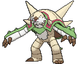
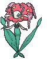
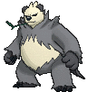
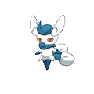
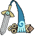
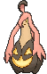

# Kalos Pokémon

---

## #650 Chespin

**Location:** Route 102

**Ability 2:** Bulletproof

| Level | Move |     | Cont. | Move |
| ----- | ---- | --- | ----- | ---- |
| 1 |   Tackle |   | 22 |  Seed Bomb |
| 1 |   Growl |   | 25 |  Mud Shot |
| 5 |   Vine Whip |   | 28 |  Drain Punch |
| 7 |   Rollout |   | 31 |  Bulk Up |
| 9 |   Bite |   | 34 |  Body Slam |
| 12 |  Leech Seed |   | 37 |  Iron Head |
| 14 |  Dual Chop |   | 40 |  Pain Split |
| 17 |  Pin Missile |   | 43 |  Wood Hammer |
| 19 |  Take Down |   |   |   |

---

## #651 Quilladin

**Location:** Evolve Chespin (Lv. 16)

**Ability 2:** Bulletproof

| Level | Move |     | Cont. | Move |
| ----- | ---- | --- | ----- | ---- |
| 1 |   Tackle |   | 21 |  Take Down |
| 1 |   Growl |   | 25 |  Seed Bomb |
| 5 |   Vine Whip |   | 29 |  Mud Shot |
| 7 |   Rollout |   | 33 |  Drain Punch |
| 9 |   Bite |   | 37 |  Bulk Up |
| 12 |  Leech Seed |   | 41 |  Body Slam |
| 14 |  Dual Chop |   | 45 |  Iron Head |
| 16 |  Needle Arm |   | 49 |  Pain Split |
| 18 |  Pin Missile |   | 53 |  Wood Hammer |

---

## #652 Chesnaught

**Location:** Evolve Quilladin (Lv. 36)

**Ability 2:** Bulletproof

| Level | Move |     | Cont. | Move |
| ----- | ---- | --- | ----- | ---- |
| 1 |   Feint |   | 21 |  Take Down |
| 1 |   Hammer Arm |   | 25 |  Seed Bomb |
| 1 |   Belly Drum |   | 29 |  Mud Shot |
| 1 |   Thunder Punch |   | 33 |  Drain Punch |
| 1 |   Tackle |   | 36 |  Spiky Shield |
| 1 |   Growl |   | 38 |  Bulk Up |
| 5 |   Vine Whip |   | 43 |  Body Slam |
| 7 |   Rollout |   | 48 |  Iron Head |
| 9 |   Bite |   | 53 |  Pain Split |
| 12 |  Leech Seed |   | 58 |  Wood Hammer |
| 14 |  Dual Chop |   | 63 |  Hammer Arm |
| 16 |  Needle Arm |   | 68 |  Giga Impact |
| 18 |  Pin Missile |   |   |   |

---

## #653 Fennekin

**Location:** Route 101

**Ability 2:** Magician

| Level | Move |     | Cont. | Move |
| ----- | ---- | --- | ----- | ---- |
| 1 |   Scratch |   | 22 |  Light Screen |
| 1 |   Tail Whip |   | 25 |  Flamethrower |
| 5 |   Ember |   | 28 |  Hypnosis |
| 7 |   Howl |   | 31 |  Will |
| 9 |   Flame Charge |   | 34 |  Psychic |
| 12 |  Psybeam |   | 37 |  Sunny Day |
| 14 |  Fire Spin |   | 40 |  Magic Room |
| 17 |  Lucky Chant |   | 43 |  Fire Blast |
| 19 |  Psyshock |   |   |   |

---

## #654 Braixen

**Location:** Evolve Fennekin (Lv. 16)

**Ability 2:** Magician

| Level | Move |     | Cont. | Move |
| ----- | ---- | --- | ----- | ---- |
| 1 |   Scratch |   | 21 |  Psyshock |
| 1 |   Tail Whip |   | 25 |  Light Screen |
| 5 |   Ember |   | 29 |  Flamethrower |
| 7 |   Howl |   | 33 |  Hypnosis |
| 9 |   Flame Charge |   | 37 |  Will |
| 12 |  Psybeam |   | 41 |  Psychic |
| 14 |  Fire Spin |   | 45 |  Sunny Day |
| 16 |  Incinerate |   | 49 |  Magic Room |
| 18 |  Lucky Chant |   | 53 |  Fire Blast |

---

## #655 Delphox

**Location:** Evolve Braixen (Lv. 36)

**Ability 2:** Magician

| Level | Move |     | Cont. | Move |
| ----- | ---- | --- | ----- | ---- |
| 1 |   Future Sight |   | 18 |  Lucky Chant |
| 1 |   Role Play |   | 21 |  Psyshock |
| 1 |   Switcheroo |   | 25 |  Light Screen |
| 1 |   Shadow Ball |   | 29 |  Flamethrower |
| 1 |   Scratch |   | 33 |  Hypnosis |
| 1 |   Tail Whip |   | 36 |  Mystical Fire |
| 5 |   Ember |   | 38 |  Will |
| 7 |   Howl |   | 43 |  Psychic |
| 9 |   Flame Charge |   | 48 |  Sunny Day |
| 12 |  Psybeam |   | 53 |  Magic Room |
| 14 |  Fire Spin |   | 58 |  Fire Blast |
| 16 |  Incinerate |   | 63 |  Future Sight |

---

## #656 Froakie

**Location:** Route 104 North

**Ability 2:** Protean

| Level | Move |     | Cont. | Move |
| ----- | ---- | --- | ----- | ---- |
| 1 |   Pound |   | 22 |  Smack Down |
| 1 |   Growl |   | 25 |  Scald |
| 5 |   Bubble |   | 28 |  Acrobatics |
| 7 |   Quick Attack |   | 31 |  Toxic Spikes |
| 9 |   Lick |   | 34 |  Substitute |
| 12 |  Water Pulse |   | 37 |  Bounce |
| 14 |  Smokescreen |   | 40 |  Double Team |
| 17 |  Round |   | 43 |  Hydro Pump |
| 19 |  Fling |   |   |   |

---

## #657 Frogadier

**Location:** Evolve Froakie (Lv. 16)

**Ability 2:** Protean

| Level | Move |     | Cont. | Move |
| ----- | ---- | --- | ----- | ---- |
| 1 |   Pound |   | 21 |  Fling |
| 1 |   Growl |   | 25 |  Smack Down |
| 5 |   Bubble |   | 29 |  Scald |
| 7 |   Quick Attack |   | 33 |  Acrobatics |
| 9 |   Lick |   | 37 |  Toxic Spikes |
| 12 |  Water Pulse |   | 41 |  Substitute |
| 14 |  Smokescreen |   | 45 |  Bounce |
| 16 |  Low Kick |   | 49 |  Double Team |
| 18 |  Round |   | 53 |  Hydro Pump |

---

## #658 Greninja

**Location:** Evolve Frogadier (Lv. 36)

**Ability 2:** Protean

| Level | Move |     | Cont. | Move |
| ----- | ---- | --- | ----- | ---- |
| 1 |   Night Slash |   | 21 |  Spikes |
| 1 |   Role Play |   | 25 |  Feint Attack |
| 1 |   Mat Block |   | 29 |  Scald |
| 1 |   Gunk Shot |   | 33 |  Acrobatics |
| 1 |   Pound |   | 36 |  Water Shuriken |
| 1 |   Growl |   | 38 |  Toxic Spikes |
| 5 |   Bubble |   | 43 |  Substitute |
| 7 |   Quick Attack |   | 48 |  Extrasensory |
| 9 |   Lick |   | 53 |  Double Team |
| 12 |  Water Pulse |   | 58 |  Haze |
| 14 |  Smokescreen |   | 63 |  Hydro Pump |
| 16 |  Low Kick |   | 68 |  Night Slash |
| 18 |  Shadow Sneak |   |   |   |

---

## #659 Bunnelby

**Location:** Route 101

| Level | Move |     | Cont. | Move |
| ----- | ---- | --- | ----- | ---- |
| 1 |   Tackle |   | 19 |  Mud Shot |
| 1 |   Agility |   | 21 |  Double Kick |
| 1 |   Leer |   | 24 |  Dig |
| 4 |   Quick Attack |   | 27 |  Odor Sleuth |
| 7 |   Defense Curl |   | 30 |  Flail |
| 10 |  Double Slap |   | 33 |  Bounce |
| 12 |  Mud |   | 36 |  Earthquake |
| 14 |  Rollout |   | 39 |  Facade |
| 16 |  Take Down |   | 42 |  Super Fang |

---

## #660 Diggersby

**Location:** Route 121

| Stat | Base | Change |
| ---- | ---- | ------ |
| HP          | 85 | 96 |
| Defense     | 77 | 80 |
| Sp. Defense | 77 | 80 |
| Total       | 423 | 440 |

| Level | Move |     | Cont. | Move |
| ----- | ---- | --- | ----- | ---- |
| 1 |   Hammer Arm |   | 19 |  Mud Shot |
| 1 |   Rototiller |   | 20 |  Bulldoze |
| 1 |   Swords Dance |   | 22 |  Double Kick |
| 1 |   Tackle |   | 26 |  Dig |
| 1 |   Agility |   | 30 |  Odor Sleuth |
| 1 |   Leer |   | 34 |  Flail |
| 4 |   Quick Attack |   | 38 |  Bounce |
| 7 |   Defense Curl |   | 42 |  Earthquake |
| 10 |  Double Slap |   | 46 |  Facade |
| 12 |  Mud |   | 50 |  Super Fang |
| 14 |  Rollout |   | 54 |  Hammer Arm |
| 16 |  Take Down |   |   |   |

---

## #661 Fletchling

**Location:** Route 101

**Ability 2:** Gale Wings

| Level | Move |     | Cont. | Move |
| ----- | ---- | --- | ----- | ---- |
| 1 |   Tackle |   | 21 |  Flame Charge |
| 1 |   Growl |   | 24 |  Razor Wind |
| 6 |   Quick Attack |   | 27 |  Acrobatics |
| 9 |   Peck |   | 30 |  Natural Gift |
| 12 |  Agility |   | 33 |  Me First |
| 15 |  Flail |   | 36 |  Tailwind |
| 18 |  Roost |   | 39 |  Steel Wing |

---

## #662 Fletchinder

**Location:** Safari Zone

**Ability 2:** Gale Wings

| Level | Move |     | Cont. | Move |
| ----- | ---- | --- | ----- | ---- |
| 1 |   Tackle |   | 22 |  Flame Charge |
| 1 |   Growl |   | 26 |  Razor Wind |
| 6 |   Quick Attack |   | 30 |  Acrobatics |
| 9 |   Peck |   | 34 |  Natural Gift |
| 12 |  Agility |   | 38 |  Me First |
| 15 |  Flail |   | 42 |  Tailwind |
| 17 |  Ember |   | 46 |  Steel Wing |
| 18 |  Roost |   |   |   |

---

## #663 Talonflame

**Location:** Soaring in the Sky

**Ability 2:** Gale Wings

| Level | Move |     | Cont. | Move |
| ----- | ---- | --- | ----- | ---- |
| 1 |   Brave Bird |   | 22 |  Flame Charge |
| 1 |   Tackle |   | 26 |  Razor Wind |
| 1 |   Growl |   | 30 |  Acrobatics |
| 6 |   Quick Attack |   | 34 |  Natural Gift |
| 9 |   Peck |   | 36 |  Flare Blitz |
| 12 |  Agility |   | 39 |  Me First |
| 15 |  Flail |   | 45 |  Tailwind |
| 17 |  Ember |   | 51 |  Steel Wing |
| 18 |  Roost |   | 57 |  Brave Bird |

---

## #664 Scatterbug

**Location:** Route 104 North

| Level | Move |     | Cont. | Move |
| ----- | ---- | --- | ----- | ---- |
| 1 |   Tackle |   | 3 |   Bug Bite |
| 1 |   String Shot |   | 5 |   Electroweb |
| 1 |   Stun Spore |   | 7 |   Rage Powder |

---

## #665 Spewpa

**Location:** Evolve Scatterbug (Lv. 9)

| Level | Move |     | Cont. | Move |
| ----- | ---- | --- | ----- | ---- |
| 1 |   Harden |   | 11 |  Iron Defense |
| 9 |   Protect |   |   |   |

---

## #666 Vivillon

**Location:** Evolve Spewpa (Lv. 12)

**Effort Values:** 1 SAtk, 1 Spd >> 2 SAtk

**New TM/HMs:** Fly

| Stat | Base | Change |
| ---- | ---- | ------ |
| Attack          | 52 | 50 |
| Defense         | 50 | 55 |
| Sp. Attack      | 90 | 115 |
| Sp. Defense     | 50 | 55 |
| Speed           | 89 | 100 |
| Total           | 411 | 455 |

| Level | Move |     | Cont. | Move |
| ----- | ---- | --- | ----- | ---- |
| 1 |   Gust |   | 26 |  Bug Buzz |
| 12 |  Struggle Bug |   | 28 |  Safeguard |
| 14 |  Gust |   | 30 |  Hurricane |
| 16 |  Stun Spore |   | 32 |  Powder |
| 16 |  Poison Powder |   | 34 |  Psychic |
| 16 |  Sleep Powder |   | 36 |  Tailwind |
| 18 |  Psybeam |   | 38 |  Energy Ball |
| 20 |  Supersonic |   | 40 |  Light Screen |
| 22 |  Draining Kiss |   | 42 |  Quiver Dance |
| 24 |  Aromatherapy |   |   |   |

---

## #667 Litleo

**Location:** Route 116

**Evolution Level:** 35 >> 33

| Level | Move |     | Cont. | Move |
| ----- | ---- | --- | ----- | ---- |
| 1 |   Tackle |   | 22 |  Echoed Voice |
| 1 |   Leer |   | 25 |  Fire Fang |
| 4 |   Ember |   | 28 |  Take Down |
| 7 |   Work Up |   | 31 |  Flamethrower |
| 10 |  Headbutt |   | 34 |  Endeavor |
| 13 |  Incinerate |   | 37 |  Crunch |
| 16 |  Noble Roar |   | 40 |  Hyper Voice |
| 19 |  Snarl |   | 43 |  Overheat |

---

## #668 Pyroar

**Location:** Safari Zone

| Level | Move |     | Cont. | Move |
| ----- | ---- | --- | ----- | ---- |
| 1 |   Hyper Beam |   | 22 |  Echoed Voice |
| 1 |   Tackle |   | 25 |  Fire Fang |
| 1 |   Leer |   | 28 |  Take Down |
| 4 |   Ember |   | 31 |  Flamethrower |
| 7 |   Work Up |   | 35 |  Endeavor |
| 10 |  Headbutt |   | 39 |  Crunch |
| 13 |  Incinerate |   | 43 |  Hyper Voice |
| 16 |  Noble Roar |   | 47 |  Overheat |
| 19 |  Snarl |   | 51 |  Hyper Beam |

---

## #669 Flabébé

**Location:** Route 104 North

**Ability 2:** Symbiosis

| Level | Move |     | Cont. | Move |
| ----- | ---- | --- | ----- | ---- |
| 1 |   Tackle |   | 26 |  Grass Knot |
| 1 |   Vine Whip |   | 29 |  Grassy Terrain |
| 5 |   Fairy Wind |   | 32 |  Petal Blizard |
| 8 |   Razor Leaf |   | 35 |  Moonblast |
| 11 |  Wish |   | 38 |  Aromatherapy |
| 14 |  Magical Leaf |   | 41 |  Petal Dance |
| 17 |  Nature Power |   | 44 |  Misty Terrain |
| 20 |  Lucky Chant |   | 47 |  Solar Beam |
| 23 |  Dazzling Gleam |   |   |   |

---

## #670 Floette

**Location:** Route 115

**Ability 2:** Symbiosis

### Normal Forme

| Level | Move |     | Cont. | Move |
| ----- | ---- | --- | ----- | ---- |
| 1 |   Tackle |   | 29 |  Grass Knot |
| 1 |   Vine Whip |   | 33 |  Grassy Terrain |
| 5 |   Fairy Wind |   | 37 |  Petal Blizard |
| 8 |   Razor Leaf |   | 41 |  Moonblast |
| 11 |  Wish |   | 45 |  Aromatherapy |
| 14 |  Magical Leaf |   | 49 |  Petal Dance |
| 17 |  Nature Power |   | 53 |  Misty Terrain |
| 21 |  Lucky Chant |   | 57 |  Solar Beam |
| 25 |  Dazzling Gleam |   |   |   |

### Eternal Forme

| Level | Move |     | Cont. | Move |
| ----- | ---- | --- | ----- | ---- |
| 1 |   Tackle |   | 29 |  Grass Knot |
| 1 |   Vine Whip |   | 33 |  Grassy Terrain |
| 5 |   Fairy Wind |   | 37 |  Petal Blizard |
| 8 |   Razor Leaf |   | 41 |  Moonblast |
| 11 |  Wish |   | 45 |  Aromatherapy |
| 14 |  Magical Leaf |   | 49 |  Petal Dance |
| 17 |  Nature Power |   | 50 |  Light of Ruin |
| 21 |  Lucky Chant |   | 53 |  Misty Terrain |
| 25 |  Dazzling Gleam |   | 57 |  Solar Beam |

---

## #671 Florges

**Location:** Evolve Floette (Shiny Stone)

**Ability 2:** Symbiosis

| Level | Move |     | Cont. | Move |
| ----- | ---- | --- | ----- | ---- |
| 1 |   Disarming Voice |   | 1 |   Grassy Terrain |
| 1 |   Lucky Chant |   | 1 |   Petal Blizzard |
| 1 |   Wish |   | 1 |   Misty Terrain |
| 1 |   Magical Leaf |   | 1 |   Moonblast |
| 1 |   Flower Shield |   | 1 |   Petal Dance |
| 1 |   Grass Knot |   | 1 |   Aromatherapy |

---

## #672 Skiddo

**Location:** Route 110

**Ability 2:** Grass Pelt

| Level | Move |     | Cont. | Move |
| ----- | ---- | --- | ----- | ---- |
| 1 |   Tackle |   | 26 |  Bulldoze |
| 1 |   Growth |   | 29 |  Seed Bomb |
| 5 |   Vine Whip |   | 32 |  Synthesis |
| 8 |   Tail Whip |   | 35 |  Zen Headbutt |
| 11 |  Razor Leaf |   | 38 |  Bulk Up |
| 14 |  Leech Seed |   | 41 |  Double |
| 17 |  Worry Seed |   | 44 |  Leaf Blade |
| 20 |  Horn Leech |   | 47 |  Milk Drink |
| 23 |  Take Down |   |   |   |

---

## #673 Gogoat

**Location:** Safari Zone

**Ability 2:** Grass Pelt

| Level | Move |     | Cont. | Move |
| ----- | ---- | --- | ----- | ---- |
| 1 |   Tackle |   | 29 |  Seed Bomb |
| 1 |   Growth |   | 32 |  Aerial Ace |
| 5 |   Vine Whip |   | 33 |  Synthesis |
| 8 |   Tail Whip |   | 37 |  Zen Headbutt |
| 11 |  Razor Leaf |   | 41 |  Bulk Up |
| 14 |  Leech Seed |   | 45 |  Double |
| 17 |  Worry Seed |   | 49 |  Leaf Blade |
| 20 |  Horn Leech |   | 53 |  Milk Drink |
| 23 |  Take Down |   | 57 |  Earthquake |
| 26 |  Bulldoze |   | 61 |  Wild Charge |

---

## #674 Pancham

**Location:** Route 116

| Level | Move |     | Cont. | Move |
| ----- | ---- | --- | ----- | ---- |
| 1 |   Tackle |   | 27 |  Vital Throw |
| 1 |   Leer |   | 30 |  Body Slam |
| 6 |   Arm Thrust |   | 33 |  Crunch |
| 9 |   Work Up |   | 36 |  Storm Throw |
| 12 |  Karate Chop |   | 39 |  Entrainment |
| 15 |  Comet Punch |   | 42 |  Drain Punch |
| 18 |  Knock Off |   | 45 |  Parting Shot |
| 21 |  Slash |   | 48 |  Sky Uppercut |
| 24 |  Circle Throw |   |   |   |

---

## #675 Pangoro

**Location:** Route 116

| Level | Move |     | Cont. | Move |
| ----- | ---- | --- | ----- | ---- |
| 1 |   Entrainment |   | 24 |  Circle Throw |
| 1 |   Hammer Arm |   | 27 |  Vital Throw |
| 1 |   Ice Punch |   | 30 |  Body Slam |
| 1 |   Fire Punch |   | 34 |  Crunch |
| 1 |   Thunder Punch |   | 38 |  Storm Throw |
| 1 |   Tackle |   | 42 |  Entrainment |
| 1 |   Leer |   | 46 |  Drain Punch |
| 6 |   Arm Thrust |   | 50 |  Parting Shot |
| 9 |   Work Up |   | 54 |  Sky Uppercut |
| 12 |  Karate Chop |   | 58 |  Hammer Arm |
| 15 |  Comet Punch |   | 62 |  Taunt |
| 18 |  Knock Off |   | 66 |  Low Sweep |
| 21 |  Slash |   |   |   |

---

## #676 Furfrou

**Location:** Route 116

| Level | Move |     | Cont. | Move |
| ----- | ---- | --- | ----- | ---- |
| 1 |   Frustration |   | 24 |  Retaliate |
| 1 |   Return |   | 28 |  Odor Sleuth |
| 1 |   Tackle |   | 32 |  Take Down |
| 1 |   Growl |   | 36 |  Zen Headbutt |
| 4 |   Sand |   | 40 |  Sucker Punch |
| 8 |   Baby |   | 44 |  Iron Tail |
| 12 |  Headbutt |   | 48 |  Charm |
| 16 |  Tail Whip |   | 52 |  Cotton Guard |
| 20 |  Bite |   |   |   |

---

## #677 Espurr

**Location:** Route 113

| Level | Move |     | Cont. | Move |
| ----- | ---- | --- | ----- | ---- |
| 1 |   Scratch |   | 17 |  Psybeam |
| 1 |   Leer |   | 19 |  Fake Out |
| 5 |   Covet |   | 22 |  Disarming Voice |
| 9 |   Confusion |   | 25 |  Psyshock |
| 13 |  Light Screen |   |   |   |

---

## #678 Meowstic

?

**Location:** Safari Zone

### Male Forme

| Level | Move |     | Cont. | Move |
| ----- | ---- | --- | ----- | ---- |
| 1 |   Quick Guard |   | 25 |  Psyshock |
| 1 |   Mean Look |   | 28 |  Charm |
| 1 |   Helping Hand |   | 31 |  Miracle Eye |
| 1 |   Scratch |   | 35 |  Reflect |
| 1 |   Leer |   | 40 |  Psychic |
| 5 |   Covet |   | 43 |  Role Play |
| 9 |   Confusion |   | 45 |  Imprison |
| 13 |  Light Screen |   | 48 |  Sucker Punch |
| 17 |  Psybeam |   | 50 |  Misty Terrain |
| 19 |  Fake Out |   | 53 |  Quick Guard |
| 22 |  Disarming Voice |   |   |   |

### Female Forme

| Level | Move |     | Cont. | Move |
| ----- | ---- | --- | ----- | ---- |
| 1 |   Stored Power |   | 25 |  Psyshock |
| 1 |   Me First |   | 28 |  Charge Beam |
| 1 |   Magical Leaf |   | 31 |  Shadow Ball |
| 1 |   Scratch |   | 35 |  Extrasensory |
| 1 |   Leer |   | 40 |  Psychic |
| 5 |   Covet |   | 43 |  Role Play |
| 9 |   Confusion |   | 45 |  Signal Beam |
| 13 |  Light Screen |   | 48 |  Sucker Punch |
| 17 |  Psybeam |   | 50 |  Future Sight |
| 19 |  Fake Out |   | 53 |  Stored Power |
| 22 |  Disarming Voice |   |   |   |

---

## #679 Honedge

**Location:** Route 113

| Level | Move |     | Cont. | Move |
| ----- | ---- | --- | ----- | ---- |
| 1 |   Tackle |   | 24 |  Retaliate |
| 1 |   Swords Dance |   | 27 |  Shadow Claw |
| 6 |   Fury Cutter |   | 30 |  Slash |
| 9 |   Metal Sound |   | 33 |  Iron Head |
| 12 |  Pursuit |   | 36 |  Iron Defense |
| 15 |  Shadow Sneak |   | 39 |  Night Slash |
| 18 |  Autotomize |   | 42 |  Power Trick |
| 21 |  Aerial Ace |   | 45 |  Sacred Sword |

---

## #680 Doublade

**Location:** Safari Zone

| Level | Move |     | Cont. | Move |
| ----- | ---- | --- | ----- | ---- |
| 1 |   Tackle |   | 24 |  Retaliate |
| 1 |   Swords Dance |   | 27 |  Shadow Claw |
| 6 |   Fury Cutter |   | 30 |  Slash |
| 9 |   Metal Sound |   | 33 |  Iron Head |
| 12 |  Pursuit |   | 37 |  Iron Defense |
| 15 |  Shadow Sneak |   | 41 |  Night Slash |
| 18 |  Autotomize |   | 45 |  Power Trick |
| 21 |  Aerial Ace |   | 49 |  Sacred Sword |

---

## #681 Aegislash

?

**Location:** Evolve Doublade (Dusk Stone)

| Level | Move |     | Cont. | Move |
| ----- | ---- | --- | ----- | ---- |
| 1 |   Fury Cutter |   | 1 |   Power Trick |
| 1 |   Pursuit |   | 1 |   Iron Head |
| 1 |   Autotomize |   | 1 |   Head Smash |
| 1 |   Shadow Sneak |   | 1 |   Swords Dance |
| 1 |   Slash |   | 1 |   Aerial Ace |
| 1 |   Iron Defense |   | 1 |   King |
| 1 |   Night Slash |   | 1 |   Sacred Sword |

---

## #682 Spritzee

**Location:** Route 104 South

**Ability 2:** Aroma Veil

| Level | Move |     | Cont. | Move |
| ----- | ---- | --- | ----- | ---- |
| 1 |   Sweet Scent |   | 26 |  Moonblast |
| 1 |   Fairy Wind |   | 29 |  Charm |
| 5 |   Sweet Kiss |   | 32 |  Flail |
| 8 |   Odor Sleuth |   | 35 |  Misty Terrain |
| 11 |  Echoed Voice |   | 38 |  Skill Swap |
| 14 |  Calm Mind |   | 41 |  Psychic |
| 17 |  Draining Kiss |   | 44 |  Disarming Voice |
| 20 |  Aromatherapy |   | 47 |  Trick Room |
| 23 |  Attract |   |   |   |

---

## #683 Aromatisse

**Location:** Evolve Spritzee (Sachet)

**Ability 2:** Aroma Veil

| Level | Move |     | Cont. | Move |
| ----- | ---- | --- | ----- | ---- |
| 1 |   Sweet Scent |   | 32 |  Flail |
| 1 |   Fairy Wind |   | 35 |  Misty Terrain |
| 5 |   Sweet Kiss |   | 38 |  Skill Swap |
| 8 |   Odor Sleuth |   | 41 |  Psychic |
| 11 |  Echoed Voice |   | 44 |  Disarming Voice |
| 14 |  Calm Mind |   | 47 |  Trick Room |
| 17 |  Draining Kiss |   | 50 |  Aromatic Mist |
| 20 |  Aromatherapy |   | 53 |  Heal Pulse |
| 23 |  Attract |   | 56 |  Reflect |
| 26 |  Moonblast |   | 59 |  Psych Up |
| 29 |  Charm |   |   |   |

---

## #684 Swirlix

**Location:** Route 104 South

**Ability 2:** Unburden

| Level | Move |     | Cont. | Move |
| ----- | ---- | --- | ----- | ---- |
| 1 |   Sweet Scent |   | 26 |  Aromatherapy |
| 1 |   Tackle |   | 29 |  Fake Tears |
| 5 |   Fairy Wind |   | 32 |  Energy Ball |
| 8 |   Play Nice |   | 35 |  Cotton Guard |
| 11 |  Draining Kiss |   | 38 |  Wish |
| 14 |  Round |   | 41 |  Light Screen |
| 17 |  Cotton Spore |   | 44 |  Safeguard |
| 20 |  Endeavor |   | 47 |  Belly Drum |
| 23 |  Play Rough |   |   |   |

---

## #685 Slurpuff

**Location:** Evolve Swirlix (Whipped Dream)

**Ability 2:** Unburden

| Level | Move |     | Cont. | Move |
| ----- | ---- | --- | ----- | ---- |
| 1 |   Sweet Scent |   | 26 |  Aromatherapy |
| 1 |   Tackle |   | 29 |  Fake Tears |
| 5 |   Fairy Wind |   | 32 |  Energy Ball |
| 8 |   Play Nice |   | 35 |  Cotton Guard |
| 11 |  Draining Kiss |   | 38 |  Wish |
| 14 |  Round |   | 41 |  Light Screen |
| 17 |  Cotton Spore |   | 44 |  Safeguard |
| 20 |  Endeavor |   | 47 |  Belly Drum |
| 23 |  Play Rough |   |   |   |

---

## #686 Inkay

**Location:** Route 118

| Level | Move |     | Cont. | Move |
| ----- | ---- | --- | ----- | ---- |
| 1 |   Tackle |   | 22 |  Psybeam |
| 1 |   Peck |   | 25 |  Switcheroo |
| 1 |   Constrict |   | 28 |  Payback |
| 4 |   Reflect |   | 31 |  Psycho Cut |
| 7 |   Foul Play |   | 34 |  Pluck |
| 10 |  Swagger |   | 37 |  Light Screen |
| 13 |  Psywave |   | 40 |  Slash |
| 16 |  Topsy |   | 43 |  Night Slash |
| 19 |  Hypnosis |   | 46 |  Superpower |

---

## #687 Malamar

**Location:** Route 118

| Level | Move |     | Cont. | Move |
| ----- | ---- | --- | ----- | ---- |
| 1 |   Superpower |   | 19 |  Hypnosis |
| 1 |   Reversal |   | 22 |  Psybeam |
| 1 |   Tackle |   | 25 |  Switcheroo |
| 1 |   Peck |   | 28 |  Payback |
| 1 |   Constrict |   | 31 |  Psycho Cut |
| 4 |   Reflect |   | 34 |  Pluck |
| 7 |   Foul Play |   | 37 |  Light Screen |
| 10 |  Swagger |   | 40 |  Slash |
| 13 |  Psywave |   | 43 |  Night Slash |
| 16 |  Topsy |   | 46 |  Superpower |

---

## #688 Binacle

**Location:** Route 111

**Evolution Level:** 39 >> 34

**New TM/HMs:** Waterfall, Dive

| Level | Move |     | Cont. | Move |
| ----- | ---- | --- | ----- | ---- |
| 1 |   Shell Smash |   | 22 |  Rock Polish |
| 1 |   Scratch |   | 25 |  Ancient Power |
| 1 |   Sand Attack |   | 28 |  Hone Claws |
| 4 |   Water Gun |   | 31 |  Fury Cutter |
| 7 |   Withdraw |   | 34 |  Rock Slide |
| 10 |  Fury Swipes |   | 37 |  Night Slash |
| 13 |  Slash |   | 40 |  Razor Shell |
| 16 |  Mud |   | 43 |  X |
| 19 |  Clamp |   | 46 |  Cross Chop |

---

## #689 Barbaracle

**Location:** Lilycove City

**New TM/HMs:** Waterfall, Dive

| Level | Move |     | Cont. | Move |
| ----- | ---- | --- | ----- | ---- |
| 1 |   Skull Bash |   | 22 |  Rock Polish |
| 1 |   Stone Edge |   | 25 |  Ancient Power |
| 1 |   Dragon Claw |   | 28 |  Hone Claws |
| 1 |   Shell Smash |   | 31 |  Fury Cutter |
| 1 |   Scratch |   | 34 |  Rock Slide |
| 1 |   Sand Attack |   | 38 |  Night Slash |
| 4 |   Water Gun |   | 42 |  Razor Shell |
| 7 |   Withdraw |   | 46 |  X |
| 10 |  Fury Swipes |   | 50 |  Cross Chop |
| 13 |  Slash |   | 54 |  Dragon Claw |
| 16 |  Mud |   | 58 |  Stone Edge |
| 19 |  Clamp |   | 62 |  Skull Bash |

---

## #690 Skrelp

**Location:** Route 107, Route 127, Route 131

**Evolution Level:** 48 >> 35

| Level | Move |     | Cont. | Move |
| ----- | ---- | --- | ----- | ---- |
| 1 |   Tackle |   | 23 |  Poison Tail |
| 1 |   Smokescreen |   | 26 |  Double Team |
| 1 |   Water Gun |   | 29 |  Sludge Bomb |
| 5 |   Feint Attack |   | 32 |  Toxic |
| 8 |   Tail Whip |   | 35 |  Aqua Tail |
| 11 |  Bubble |   | 38 |  Sludge Wave |
| 14 |  Acid |   | 41 |  Dragon Pulse |
| 17 |  Camouflage |   | 44 |  Hydro Pump |
| 20 |  Water Pulse |   |   |   |

---

## #691 Dragalge

**Location:** Route 107, Route 127, Route 130, Underwater

| Level | Move |     | Cont. | Move |
| ----- | ---- | --- | ----- | ---- |
| 1 |   Dragon Tail |   | 23 |  Poison Tail |
| 1 |   Tackle |   | 26 |  Double Team |
| 1 |   Smokescreen |   | 29 |  Sludge Bomb |
| 1 |   Water Gun |   | 32 |  Toxic |
| 5 |   Feint Attack |   | 35 |  Twister |
| 8 |   Tail Whip |   | 36 |  Aqua Tail |
| 11 |  Bubble |   | 40 |  Sludge Wave |
| 14 |  Acid |   | 44 |  Dragon Pulse |
| 17 |  Camouflage |   | 48 |  Hydro Pump |
| 20 |  Water Pulse |   | 52 |  Dragon Tail |

---

## #692 Clauncher

**Location:** Route 107, Route 131

**Evolution Level:** 37 >> 33

| Level | Move |     | Cont. | Move |
| ----- | ---- | --- | ----- | ---- |
| 1 |   Splash |   | 21 |  Flail |
| 1 |   Water Gun |   | 24 |  Water Pulse |
| 6 |   Water Sport |   | 27 |  Crabhammer |
| 9 |   Vice Grip |   | 30 |  Swords Dance |
| 12 |  Bubble |   | 33 |  Aqua Jet |
| 15 |  Smack Down |   | 36 |  Flash Cannon |
| 18 |  Bubble Beam |   | 39 |  Muddy Water |

---

## #693 Clawitzer

**Location:** Route 107, Route 131

| Level | Move |     | Cont. | Move |
| ----- | ---- | --- | ----- | ---- |
| 1 |   Heal Pulse |   | 24 |  Water Pulse |
| 1 |   Splash |   | 27 |  Crabhammer |
| 1 |   Water Gun |   | 30 |  Swords Dance |
| 6 |   Water Sport |   | 34 |  Aqua Jet |
| 9 |   Vice Grip |   | 38 |  Flash Cannon |
| 12 |  Bubble |   | 42 |  Muddy Water |
| 15 |  Smack Down |   | 46 |  Dark Pulse |
| 18 |  Bubble Beam |   | 50 |  Dragon Pulse |
| 21 |  Flail |   | 54 |  Aura Sphere |

---

## #694 Helioptile

**Location:** Route 111

**Held Item:** Sail Fossil (50%)

| Level | Move |     | Cont. | Move |
| ----- | ---- | --- | ----- | ---- |
| 1 |   Pound |   | 24 |  Parabolic Charge |
| 1 |   Tail Whip |   | 28 |  Thunder Wave |
| 4 |   Thunder Shock |   | 32 |  Bulldoze |
| 8 |   Charge |   | 36 |  Thunderbolt |
| 12 |  Mud |   | 40 |  Signal Beam |
| 16 |  Quick Attack |   | 44 |  Electrify |
| 20 |  Razor Wind |   | 48 |  Volt Switch |

---

## #695 Heliolisk

**Location:** Evolve Helioptile (Sun Stone)

| Level | Move |     | Cont. | Move |
| ----- | ---- | --- | ----- | ---- |
| 1 |   Eerie Impulse |   | 1 |   Thunder |
| 1 |   Electrify |   | 1 |   Charge |
| 1 |   Dragon Pulse |   | 1 |   Parabolic Charge |
| 1 |   Razor Wind |   | 43 |  Hyper Voice |
| 1 |   Quick Attack |   |   |   |

---

## #696 Tyrunt

**Location:** Seafloor Cavern, Revive Jaw Fossil

**Ability 2:** Sturdy

| Level | Move |     | Cont. | Move |
| ----- | ---- | --- | ----- | ---- |
| 1 |   Tail Whip |   | 24 |  Ancient Power |
| 1 |   Tackle |   | 27 |  Dragon Tail |
| 6 |   Roar |   | 30 |  Crunch |
| 9 |   Stomp |   | 34 |  Dragon Claw |
| 12 |  Bide |   | 38 |  Thrash |
| 15 |  Stealth Rock |   | 42 |  Earthquake |
| 18 |  Bite |   | 46 |  Horn Drill |
| 21 |  Charm |   | 50 |  Outrage |

---

## #697 Tyrantrum

**Location:** Seafloor Cavern

**Ability 2:** Rock Head

| Level | Move |     | Cont. | Move |
| ----- | ---- | --- | ----- | ---- |
| 1 |   Head Smash |   | 21 |  Charm |
| 1 |   Zen Headbutt |   | 24 |  Ancient Power |
| 1 |   Ice Fang |   | 27 |  Dragon Tail |
| 1 |   Fire Fang |   | 30 |  Crunch |
| 1 |   Thunder Fang |   | 34 |  Dragon Claw |
| 1 |   Tail Whip |   | 38 |  Thrash |
| 1 |   Tackle |   | 43 |  Earthquake |
| 6 |   Roar |   | 48 |  Horn Drill |
| 9 |   Stomp |   | 53 |  Outrage |
| 12 |  Bide |   | 58 |  Head Smash |
| 15 |  Stealth Rock |   | 63 |  Rock Slide |
| 18 |  Bite |   | 68 |  Giga Impact |

---

## #698 Amaura

**Location:** Seafloor Cavern, Revive Sail Fossil

**Ability 2:** Snow Warning

| Level | Move |     | Cont. | Move |
| ----- | ---- | --- | ----- | ---- |
| 1 |   Growl |   | 30 |  Discharge |
| 1 |   Powder Snow |   | 33 |  Avalanche |
| 6 |   Thunder Wave |   | 36 |  Hail |
| 9 |   Rock Throw |   | 39 |  Nature Power |
| 12 |  Icy Wind |   | 42 |  Ice Beam |
| 15 |  Take Down |   | 45 |  Encore |
| 18 |  Mist |   | 48 |  Hyper Voice |
| 21 |  Aurora Beam |   | 51 |  Light Screen |
| 24 |  Ancient Power |   | 54 |  Hyper Beam |
| 27 |  Round |   | 57 |  Blizzard |

---

## #699 Aurorus

**Location:** Seafloor Cavern

**Ability 2:** Snow Warning

| Level | Move |     | Cont. | Move |
| ----- | ---- | --- | ----- | ---- |
| 1 |   Growl |   | 33 |  Avalanche |
| 1 |   Powder Snow |   | 36 |  Hail |
| 6 |   Thunder Wave |   | 39 |  Freeze |
| 9 |   Rock Throw |   | 43 |  Nature Power |
| 12 |  Icy Wind |   | 47 |  Ice Beam |
| 15 |  Take Down |   | 51 |  Encore |
| 18 |  Mist |   | 55 |  Hyper Voice |
| 21 |  Aurora Beam |   | 59 |  Light Screen |
| 24 |  Ancient Power |   | 63 |  Hyper Beam |
| 27 |  Round |   | 67 |  Blizzard |
| 30 |  Discharge |   |   |   |

---

## #700 Sylveon

**Location:** Evolve Eevee (Fairy Move & Amie Affection)

**Ability 2:** Pixilate

| Level | Move |     | Cont. | Move |
| ----- | ---- | --- | ----- | ---- |
| 1 |   Disarming Voice |   | 20 |  Draining Kiss |
| 1 |   Tail Whip |   | 25 |  Skill Swap |
| 1 |   Tackle |   | 29 |  Misty Terrain |
| 1 |   Helping Hand |   | 33 |  Light Screen |
| 5 |   Sand Attack |   | 37 |  Moonblast |
| 9 |   Fairy Wind |   | 41 |  Last Resort |
| 13 |  Quick Attack |   | 45 |  Psych Up |
| 17 |  Swift |   | 50 |  Hyper Voice |

---

## #701 Hawlucha

**Location:** Route 115

| Level | Move |     | Cont. | Move |
| ----- | ---- | --- | ----- | ---- |
| 1 |   Fire Punch |   | 27 |  Bounce |
| 1 |   Thunder Punch |   | 30 |  Endeavor |
| 1 |   Swords Dance |   | 33 |  Drain Punch |
| 1 |   Tackle |   | 36 |  Acrobatics |
| 1 |   Hone Claws |   | 39 |  Zen Headbutt |
| 6 |   Karate Chop |   | 42 |  High Jump Kick |
| 9 |   Wing Attack |   | 45 |  Feather Dance |
| 12 |  Roost |   | 48 |  Iron Head |
| 15 |  Aerial Ace |   | 51 |  Dual Chop |
| 18 |  Encore |   | 54 |  Sky Drop |
| 21 |  Fling |   | 57 |  Sky Attack |
| 24 |  Flying Press |   |   |   |

---

## #702 Dedenne

**Location:** Route 118

**New TM/HMs:** Dazzling Gleam

| Stat | Base | Change |
| ---- | ---- | ------ |
| HP          | 67 | 75 |
| Attack      | 58 | 60 |
| Defense     | 57 | 60 |
| Sp. Attack  | 81 | 90 |
| Sp. Defense | 67 | 70 |
| Speed       | 101 | 110 |
| Total       | 431 | 465 |

| Level | Move |     | Cont. | Move |
| ----- | ---- | --- | ----- | ---- |
| 1 |   Covet |   | 24 |  Volt Switch |
| 1 |   Super Fang |   | 27 |  Rest |
| 1 |   Tackle |   | 27 |  Snore |
| 1 |   Tail Whip |   | 27 |  Sleep Talk |
| 6 |   Thunder Shock |   | 30 |  Charge Beam |
| 9 |   Charge |   | 33 |  Play Rough |
| 12 |  Charm |   | 36 |  Discharge |
| 15 |  Parabolic Charge |   | 39 |  Entrainment |
| 18 |  Nuzzle |   | 42 |  Moonblast |
| 21 |  Thunder Wave |   | 45 |  Thunder |

---

## #703 Carbink

**Location:** Meteor Falls

**Ability 2:** Sturdy

| Level | Move |     | Cont. | Move |
| ----- | ---- | --- | ----- | ---- |
| 1 |   Tackle |   | 32 |  Guard Split |
| 1 |   Harden |   | 36 |  Flail |
| 4 |   Rock Throw |   | 40 |  Power Gem |
| 8 |   Sharpen |   | 44 |  Skill Swap |
| 12 |  Smack Down |   | 48 |  Earth Power |
| 16 |  Reflect |   | 52 |  Stone Edge |
| 20 |  Stealth Rock |   | 56 |  Light Screen |
| 24 |  Moonblast |   | 60 |  Safeguard |
| 28 |  Ancient Power |   |   |   |

---

## #704 Goomy

**Location:** Route 119

| Level | Move |     | Cont. | Move |
| ----- | ---- | --- | ----- | ---- |
| 1 |   Tackle |   | 25 |  Flail |
| 1 |   Bubble |   | 29 |  Sludge Wave |
| 5 |   Absorb |   | 33 |  Body Slam |
| 9 |   Protect |   | 37 |  Muddy Water |
| 13 |  Bide |   | 41 |  Dragon Pulse |
| 17 |  Dragon Breath |   | 45 |  Acid Armor |
| 21 |  Rain Dance |   |   |   |

---

## #705 Sliggoo

**Location:** Route 119

| Level | Move |     | Cont. | Move |
| ----- | ---- | --- | ----- | ---- |
| 1 |   Tackle |   | 25 |  Flail |
| 1 |   Bubble |   | 29 |  Sludge Wave |
| 5 |   Absorb |   | 33 |  Body Slam |
| 9 |   Protect |   | 37 |  Muddy Water |
| 13 |  Bide |   | 42 |  Dragon Pulse |
| 17 |  Dragon Breath |   | 47 |  Acid Armor |
| 21 |  Rain Dance |   |   |   |

---

## #706 Goodra

**Location:** Evolve Sliggoo (Lv. 50 + Rain)

| Level | Move |     | Cont. | Move |
| ----- | ---- | --- | ----- | ---- |
| 1 |   Feint |   | 29 |  Sludge Wave |
| 1 |   Tackle |   | 33 |  Body Slam |
| 1 |   Bubble |   | 37 |  Muddy Water |
| 5 |   Absorb |   | 42 |  Dragon Pulse |
| 9 |   Protect |   | 47 |  Acid Armor |
| 13 |  Bide |   | 50 |  Aqua Tail |
| 17 |  Dragon Breath |   | 55 |  Power Whip |
| 21 |  Rain Dance |   | 60 |  Outrage |
| 25 |  Flail |   |   |   |

---

## #707 Klefki

**Location:** Route 113

**Ability 2:** Magician

| Level | Move |     | Cont. | Move |
| ----- | ---- | --- | ----- | ---- |
| 1 |   Fairy Lock |   | 22 |  Crafty Shield |
| 1 |   Tackle |   | 25 |  Play Rough |
| 4 |   Fairy Wind |   | 28 |  Foul Play |
| 7 |   Astonish |   | 31 |  Torment |
| 10 |  Metal Sound |   | 34 |  Imprison |
| 13 |  Spikes |   | 37 |  Flash Cannon |
| 16 |  Draining Kiss |   | 40 |  Recycle |
| 19 |  Mirror Shot |   | 43 |  Magic Room |

---

## #708 Phantump

**Location:** Petalburg Woods

**Evolution:** Happiness or Level 23

| Level | Move |     | Cont. | Move |
| ----- | ---- | --- | ----- | ---- |
| 1 |   Tackle |   | 25 |  Leech Seed |
| 1 |   Confuse Ray |   | 29 |  Curse |
| 6 |   Astonish |   | 33 |  Will |
| 9 |   Growth |   | 37 |  Forest |
| 12 |  Horn Leech |   | 41 |  Wood Hammer |
| 15 |  Ingrain |   | 45 |  Phantom Force |
| 18 |  Feint Attack |   | 49 |  Destiny Bond |
| 21 |  Shadow Claw |   |   |   |

---

## #709 Trevenant

**Location:** Evolve Phantump (Happiness / Lv. 23)

| Level | Move |     | Cont. | Move |
| ----- | ---- | --- | ----- | ---- |
| 1 |   Tackle |   | 25 |  Leech Seed |
| 1 |   Confuse Ray |   | 29 |  Curse |
| 6 |   Astonish |   | 33 |  Will |
| 9 |   Growth |   | 37 |  Forest |
| 12 |  Horn Leech |   | 41 |  Wood Hammer |
| 15 |  Ingrain |   | 45 |  Phantom Force |
| 18 |  Feint Attack |   | 49 |  Destiny Bond |
| 21 |  Shadow Claw |   |   |   |

---

## #710 Pumpkaboo

**Location:** Petalburg Woods

**Evolution:** Happiness or Level 23

| Level | Move |     | Cont. | Move |
| ----- | ---- | --- | ----- | ---- |
| 1 |   Trick |   | 19 |  Bullet Seed |
| 1 |   Trick |   | 22 |  Leech Seed |
| 1 |   Astonish |   | 26 |  Seed Bomb |
| 7 |   Confuse Ray |   | 30 |  Pain Split |
| 10 |  Razor Leaf |   | 34 |  Worry Seed |
| 13 |  Scary Face |   | 38 |  Shadow Ball |
| 16 |  Shadow Sneak |   | 42 |  Petal Blizzard |

---

## #711 Gourgeist

**Location:** Evolve Pumpkaboo (Happiness / Lv. 23)

| Level | Move |     | Cont. | Move |
| ----- | ---- | --- | ----- | ---- |
| 1 |   Explosion |   | 20 |  Flame Charge |
| 1 |   Phantom Force |   | 22 |  Leech Seed |
| 1 |   Trick |   | 26 |  Seed Bomb |
| 1 |   Trick |   | 30 |  Pain Split |
| 1 |   Astonish |   | 34 |  Worry Seed |
| 7 |   Confuse Ray |   | 38 |  Shadow Ball |
| 10 |  Razor Leaf |   | 42 |  Petal Blizzard |
| 13 |  Scary Face |   | 46 |  Phantom Force |
| 16 |  Shadow Sneak |   | 50 |  Explosion |
| 19 |  Bullet Seed |   |   |   |

---

## #712 Bergmite

**Location:** Shoal Cave

| Level | Move |     | Cont. | Move |
| ----- | ---- | --- | ----- | ---- |
| 1 |   Tackle |   | 27 |  Ice Ball |
| 1 |   Bite |   | 30 |  Rapid Spin |
| 1 |   Harden |   | 33 |  Rock Slide |
| 9 |   Powder Snow |   | 36 |  Avalanche |
| 12 |  Icy Wind |   | 39 |  Recover |
| 15 |  Take Down |   | 42 |  Blizzard |
| 18 |  Sharpen |   | 45 |  Stone Edge |
| 21 |  Curse |   | 48 |  Double |
| 24 |  Ice Fang |   |   |   |

---

## #713 Avalugg

**Location:** Shoal Cave

| Level | Move |     | Cont. | Move |
| ----- | ---- | --- | ----- | ---- |
| 1 |   Iron Defense |   | 24 |  Ice Fang |
| 1 |   Crunch |   | 27 |  Ice Ball |
| 1 |   Skull Bash |   | 30 |  Rapid Spin |
| 1 |   Tackle |   | 33 |  Rock Slide |
| 1 |   Bite |   | 36 |  Avalanche |
| 1 |   Harden |   | 40 |  Recover |
| 9 |   Powder Snow |   | 44 |  Blizzard |
| 12 |  Icy Wind |   | 48 |  Stone Edge |
| 15 |  Take Down |   | 52 |  Double |
| 18 |  Sharpen |   | 56 |  Skull Bash |
| 21 |  Curse |   | 60 |  Crunch |

---

## #714 Noibat

**Location:** Scorched Slab

**Evolution Level:** 48 >> 44

| Level | Move |     | Cont. | Move |
| ----- | ---- | --- | ----- | ---- |
| 1 |   Screech |   | 24 |  Roost |
| 1 |   Supersonic |   | 28 |  Razor Wind |
| 1 |   Tackle |   | 32 |  Dragon Pulse |
| 5 |   Leech Life |   | 36 |  Air Slash |
| 8 |   Gust |   | 40 |  Tailwind |
| 11 |  Bite |   | 44 |  Whirlwind |
| 14 |  Wing Attack |   | 48 |  Super Fang |
| 17 |  Agility |   | 52 |  Hurricane |
| 20 |  Air Cutter |   |   |   |

---

## #715 Noivern

**Location:** Scorched Slab, Seafloor Cavern, Cave of Origin, Sky Pillar

| Level | Move |     | Cont. | Move |
| ----- | ---- | --- | ----- | ---- |
| 1 |   Boomburst |   | 17 |  Agility |
| 1 |   Hurricane |   | 20 |  Air Cutter |
| 1 |   Moonlight |   | 24 |  Roost |
| 1 |   Heat Wave |   | 28 |  Razor Wind |
| 1 |   Screech |   | 32 |  Dragon Pulse |
| 1 |   Supersonic |   | 36 |  Air Slash |
| 1 |   Tackle |   | 40 |  Tailwind |
| 5 |   Leech Life |   | 45 |  Whirlwind |
| 8 |   Gust |   | 50 |  Super Fang |
| 11 |  Bite |   | 55 |  Hurricane |
| 14 |  Wing Attack |   | 60 |  Boomburst |

---

## #716 Xerneas

**Location:** Mirage Forest

| Level | Move |     | Cont. | Move |
| ----- | ---- | --- | ----- | ---- |
| 1 |   Heal Pulse |   | 30 |  Misty Terrain |
| 1 |   Aromatherapy |   | 35 |  Geomancy |
| 1 |   Ingrain |   | 40 |  Nature Power |
| 1 |   Take Down |   | 45 |  Megahorn |
| 5 |   Light Screen |   | 50 |  Psych Up |
| 10 |  Aurora Beam |   | 55 |  Moonblast |
| 15 |  Gravity |   | 60 |  Close Combat |
| 20 |  Horn Leech |   | 65 |  Giga Impact |
| 25 |  Night Slash |   | 70 |  Outrage |

---

## #717 Yveltal

**Location:** Mirage Mountain

| Level | Move |     | Cont. | Move |
| ----- | ---- | --- | ----- | ---- |
| 1 |   Hurricane |   | 30 |  Phantom Force |
| 1 |   Razor Wind |   | 35 |  Sucker Punch |
| 1 |   Taunt |   | 40 |  Dark Pulse |
| 1 |   Roost |   | 45 |  Psychic |
| 5 |   Double Team |   | 50 |  Dragon Rush |
| 10 |  Air Slash |   | 55 |  Focus Blast |
| 15 |  Snarl |   | 60 |  Oblivion Wing |
| 20 |  Disable |   | 65 |  Hyper Beam |
| 25 |  Foul Play |   | 70 |  Sky Attack |

---

## #718 Zygarde

?

**Location:** Mirage Cave

| Level | Move |     | Cont. | Move |
| ----- | ---- | --- | ----- | ---- |
| 1 |   Glare |   | 35 |  Land |
| 1 |   Bulldoze |   | 40 |  Crunch |
| 1 |   Dragon Breath |   | 45 |  Earthquake |
| 1 |   Bite |   | 50 |  Dragon Pulse |
| 5 |   Safeguard |   | 55 |  Dragon Dance |
| 10 |  Dig |   | 60 |  Coil |
| 15 |  Bind |   | 65 |  Thousand Arrows |
| 20 |  Sandstorm |   | 65 |  Thousand Waves |
| 25 |  Haze |   | 70 |  Extreme Speed |
| 30 |  Camouflage |   | 75 |  Outrage |

---

## #719 Diancie

**Location:** Mirage Cave

**Held Item:** Diancite (100%)

| Level | Move |     | Cont. | Move |
| ----- | ---- | --- | ----- | ---- |
| 1 |   Tackle |   | 35 |  Flail |
| 1 |   Harden |   | 40 |  Skill Swap |
| 5 |   Rock Throw |   | 46 |  Trick Room |
| 8 |   Sharpen |   | 49 |  Stone Edge |
| 12 |  Smack Down |   | 50 |  Moonblast |
| 18 |  Reflect |   | 50 |  Diamond Storm |
| 21 |  Stealth Rock |   | 60 |  Light Screen |
| 27 |  Guard Split |   | 70 |  Safeguard |
| 31 |  Ancient Power |   |   |   |

---

## #720 Hoopa

**Location:** Mirage Island

**Held Item:** Prison Bottle (100%)

### Normal Forme

| Level | Move |     | Cont. | Move |
| ----- | ---- | --- | ----- | ---- |
| 1 |   Trick |   | 30 |  Guard Split |
| 1 |   Destiny Bond |   | 35 |  Phantom Force |
| 1 |   Ally Switch |   | 40 |  Zen Headbutt |
| 1 |   Confusion |   | 45 |  Shadow Ball |
| 5 |   Astonish |   | 50 |  Hyperspace Hole |
| 10 |  Magic Coat |   | 55 |  Trick Room |
| 15 |  Light Screen |   | 60 |  Wonder Room |
| 20 |  Psybeam |   | 65 |  Nasty Plot |
| 25 |  Skill Swap |   | 70 |  Psychic |
| 30 |  Power Split |   |   |   |

### Unbound Forme

| Level | Move |     | Cont. | Move |
| ----- | ---- | --- | ----- | ---- |
| 1 |   Trick |   | 30 |  Guard Split |
| 1 |   Destiny Bond |   | 35 |  Phantom Force |
| 1 |   Ally Switch |   | 40 |  Knock Off |
| 1 |   Confusion |   | 45 |  Dark Pulse |
| 5 |   Astonish |   | 50 |  Hyperspace Fury |
| 10 |  Magic Coat |   | 55 |  Trick Room |
| 15 |  Light Screen |   | 60 |  Wonder Room |
| 20 |  Psybeam |   | 65 |  Nasty Plot |
| 25 |  Skill Swap |   | 70 |  Psychic |
| 30 |  Power Split |   |   |   |

---

## #721 Volcanion

**Location:** Mirage Cave

| Level | Move |     | Cont. | Move |
| ----- | ---- | --- | ----- | ---- |
| 1 |   Flare Blitz |   | 35 |  Weather Ball |
| 1 |   Take Down |   | 40 |  Body Slam |
| 5 |   Mist |   | 45 |  Hydro Pump |
| 10 |  Haze |   | 50 |  Steam Eruption |
| 15 |  Flame Charge |   | 55 |  Flare Blitz |
| 20 |  Water Pulse |   | 60 |  Overheat |
| 25 |  Stomp |   | 65 |  Explosion |
| 30 |  Scald |   |   |   |

