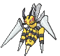
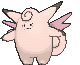
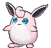
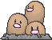
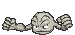
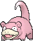
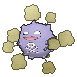
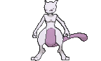

# Kanto Pokémon

---

## [#001 Bulbasaur](../../pokemon/bulbasaur.md/)

**Location**: Petalburg Woods

**Ability 2**: Effect Spore **

**Level Up Moves:**

| Moves | Level |     | Cont. | Level |
| ----- | ----- | --- | ----- | ----- |
| Tackle | 1 |   | Magical Leaf | 18 |
| Growl | 3 |   | Sweet Scent | 21 |
| Leech Seed | 5 |   | Growth | 24 |
| Vine Whip | 7 |   | Worry Seed | 27 |
| Poison Powder | 9 |   | Double-Edge | 30 |
| Sleep Powder | 9 |   | Synthesis | 33 |
| Take Down | 11 |   | Seed Bomb | 36 |
| Razor Leaf | 13 |   | Power Whip | 39 |
| Sludge | 15 |   |   |   |

---

## [#002 Ivysaur](../../pokemon/ivysaur.md/)

**Location**: Evolve Bulbasaur (Lv. 16)

**Ability 2**: Effect Spore **

**Level Up Moves:**

| Moves | Level |     | Cont. | Level |
| ----- | ----- | --- | ----- | ----- |
| Tackle | 1 |   | Magical Leaf | 19 |
| Growl | 3 |   | Sweet Scent | 22 |
| Leech Seed | 5 |   | Growth | 25 |
| Vine Whip | 7 |   | Worry Seed | 28 |
| Poison Powder | 9 |   | Double-Edge | 31 |
| Sleep Powder | 9 |   | Synthesis | 34 |
| Take Down | 11 |   | Solar Beam | 37 |
| Razor Leaf | 13 |   | Power Whip | 40 |
| Sludge | 15 |   |   |   |

---

## [#003 Venusaur](../../pokemon/venusaur.md/)

**Location**: Evolve Venusaur (Lv. 32)

**Ability 2**: Thick Fat **

**Level Up Moves:**

| Moves | Level |     | Cont. | Level |
| ----- | ----- | --- | ----- | ----- |
| Tackle | 1 |   | Sweet Scent | 22 |
| Growl | 3 |   | Growth | 25 |
| Leech Seed | 5 |   | Worry Seed | 28 |
| Vine Whip | 7 |   | Double-Edge | 31 |
| Poison Powder | 9 |   | Petal Dance | 32 |
| Sleep Powder | 9 |   | Synthesis | 35 |
| Take Down | 11 |   | Petal Blizzard | 39 |
| Razor Leaf | 13 |   | Solar Beam | 43 |
| Sludge | 15 |   | Power Whip | 47 |
| Magical Leaf | 19 |   | Leaf Storm | 51 |

---

## [#004 Charmander](../../pokemon/charmander.md/)

**Location**: Route 102

**Ability 2**: Tough Claws **

**Level Up Moves:**

| Moves | Level |     | Cont. | Level |
| ----- | ----- | --- | ----- | ----- |
| Scratch | 1 |   | Fire Fang | 22 |
| Growl | 3 |   | Slash | 25 |
| Smokescreen | 5 |   | Dragon Pulse | 28 |
| Ember | 7 |   | Flamethrower | 31 |
| Metal Claw | 9 |   | Crunch | 34 |
| Bite | 11 |   | Fire Spin | 37 |
| Dragon Rage | 13 |   | Dragon Dance | 40 |
| Flame Burst | 16 |   | Outrage | 43 |
| Scary Face | 19 |   | Inferno | 46 |

---

## [#005 Charmeleon](../../pokemon/charmeleon.md/)

**Location**: Evolve Charmander (Lv. 16)

**Ability 2**: Tough Claws **

**Level Up Moves:**

| Moves | Level |     | Cont. | Level |
| ----- | ----- | --- | ----- | ----- |
| Scratch | 1 |   | Fire Fang | 24 |
| Growl | 3 |   | Slash | 28 |
| Smokescreen | 5 |   | Dragon Pulse | 32 |
| Ember | 7 |   | Flamethrower | 36 |
| Metal Claw | 9 |   | Crunch | 40 |
| Bite | 11 |   | Fire Spin | 44 |
| Dragon Rage | 13 |   | Dragon Dance | 48 |
| Flame Burst | 17 |   | Outrage | 52 |
| Scary Face | 20 |   | Inferno | 56 |

---

## [#006 Charizard](../../pokemon/charizard.md/)

**Location**: Evolve Charmeleon (Lv. 36)

**Ability 2**: Tough Claws **

**Level Up Moves:**

| Moves | Level |     | Cont. | Level |
| ----- | ----- | --- | ----- | ----- |
| Flare Blitz | 1 |   | Fire Fang | 24 |
| Dragon Claw | 1 |   | Slash | 28 |
| Shadow Claw | 1 |   | Dragon Pulse | 32 |
| Air Slash | 1 |   | Wing Attack | 36 |
| Scratch | 1 |   | Flamethrower | 37 |
| Growl | 3 |   | Crunch | 42 |
| Smokescreen | 5 |   | Fire Spin | 47 |
| Ember | 7 |   | Dragon Dance | 52 |
| Metal Claw | 9 |   | Outrage | 57 |
| Bite | 11 |   | Inferno | 62 |
| Dragon Rage | 13 |   | Heat Wave | 67 |
| Flame Burst | 17 |   | Flare Blitz | 72 |
| Scary Face | 20 |   |   |   |

---

## [#007 Squirtle](../../pokemon/squirtle.md/)

**Location**: Route 103

**Ability 2**: Shell Armor **

**Level Up Moves:**

| Moves | Level |     | Cont. | Level |
| ----- | ----- | --- | ----- | ----- |
| Tackle | 1 |   | Yawn | 19 |
| Tail Whip | 3 |   | Rapid Spin | 21 |
| Water Gun | 5 |   | Protect | 24 |
| Withdraw | 7 |   | Aqua Tail | 27 |
| Bubble | 9 |   | Skull Bash | 29 |
| Bite | 11 |   | Muddy Water | 31 |
| Fake Out | 13 |   | Iron Defense | 33 |
| Rapid Spin | 15 |   | Rain Dance | 36 |
| Water Pulse | 17 |   | Hydro Pump | 39 |

---

## [#008 Wartortle](../../pokemon/wartortle.md/)

**Location**: Evolve Squirtle (Lv. 16)

**Ability 2**: Shell Armor **

**Level Up Moves:**

| Moves | Level |     | Cont. | Level |
| ----- | ----- | --- | ----- | ----- |
| Tackle | 1 |   | Yawn | 21 |
| Tail Whip | 3 |   | Rapid Spin | 24 |
| Water Gun | 5 |   | Protect | 28 |
| Withdraw | 7 |   | Aqua Tail | 31 |
| Bubble | 9 |   | Skull Bash | 34 |
| Bite | 11 |   | Muddy Water | 37 |
| Fake Out | 13 |   | Iron Defense | 40 |
| Rapid Spin | 15 |   | Rain Dance | 44 |
| Water Pulse | 18 |   | Hydro Pump | 48 |

---

## [#009 Blastoise](../../pokemon/blastoise.md/)

**Location**: Evolve Wartortle (Lv. 36)

**Ability 2**: Mega Launcher **

**Level Up Moves:**

| Moves | Level |     | Cont. | Level |
| ----- | ----- | --- | ----- | ----- |
| Water Spout | 1 |   | Water Pulse | 18 |
| Aura Sphere | 1 |   | Yawn | 21 |
| Dragon Pulse | 1 |   | Rapid Spin | 24 |
| Dark Pulse | 1 |   | Protect | 28 |
| Flash Cannon | 1 |   | Aqua Tail | 31 |
| Tackle | 1 |   | Skull Bash | 34 |
| Tail Whip | 3 |   | Muddy Water | 38 |
| Water Gun | 5 |   | Iron Defense | 42 |
| Withdraw | 7 |   | Rain Dance | 46 |
| Bubble | 9 |   | Hydro Pump | 51 |
| Bite | 11 |   | Water Spout | 56 |
| Fake Out | 13 |   | Shell Smash | 61 |
| Rapid Spin | 15 |   |   |   |

---

## [#010 Caterpie](../../pokemon/caterpie.md/)

**Location**: Route 101

**Ability 2**: Run Away

**Level Up Moves:**

| Moves | Level |     | Cont. | Level |
| ----- | ----- | --- | ----- | ----- |
| Tackle | 1 |   | Bug Bite | 3 |
| String Shot | 1 |   | Electroweb | 5 |

---

## [#011 Metapod](../../pokemon/metapod.md/)

**Location**: Evolve Caterpie (Lv. 7)

**Level Up Moves:**

| Moves | Level |     | Cont. | Level |
| ----- | ----- | --- | ----- | ----- |
| Harden | 1 |   | Iron Defense | 9 |
| Harden | 7 |   |   |   |

---

## [#012 Butterfree](../../pokemon/butterfree.md/)

**Location**: Safari Zone

**Ability 2**: Tinted Lens

**New TM/HMs**: Fly

**Base Stat Changes:**

| Stat | Base | Change |
| ---- | ---- | ------ |
| Attack | 45 | 25 |
| Sp. Attack | 90 | 115 |
| Sp. Defense | 80 | 105 |
| Speed | 70 | 95 |
| Total | 395 | 450 |

**Level Up Moves:**

| Moves | Level |     | Cont. | Level |
| ----- | ----- | --- | ----- | ----- |
| Confusion | 1 |   | Silver Wind | 24 |
| Confusion | 10 |   | Tailwind | 26 |
| Gust | 10 |   | Energy Ball | 28 |
| Poison Powder | 12 |   | Safeguard | 30 |
| Stun Spore | 12 |   | Bug Buzz | 32 |
| Sleep Powder | 12 |   | Rage Powder | 34 |
| Struggle Bug | 14 |   | Psychic | 36 |
| Supersonic | 16 |   | Captivate | 38 |
| Air Slash | 18 |   | Quiver Dance | 40 |
| Psybeam | 20 |   | Hurricane | 42 |
| Whirlwind | 22 |   |   |   |

---

## [#013 Weedle](../../pokemon/weedle.md/)

.")

**Location**: Route 101

**Ability 2**: Run Away

**Level Up Moves:**

| Moves | Level |     | Cont. | Level |
| ----- | ----- | --- | ----- | ----- |
| Poison Sting | 1 |   | Bug Bite | 3 |
| String Shot | 1 |   | Electroweb | 5 |

---

## [#014 Kakuna](../../pokemon/kakuna.md/)

**Location**: Evolve Weedle (Lv. 7)

**Level Up Moves:**

| Moves | Level |     | Cont. | Level |
| ----- | ----- | --- | ----- | ----- |
| Harden | 1 |   | Iron Defense | 9 |
| Harden | 7 |   |   |   |

---

## [#015 Beedrill](../../pokemon/beedrill.md/)

**Location**: Route 101

**Ability 2**: Sniper

**New TM/HMs**: Fly

### [Beedrill](../../pokemon/beedrill.md/)

**Base Stat Changes:**

| Stat | Base | Change |
| ---- | ---- | ------ |
| Attack | 90 | 115 |
| Sp. Attack | 45 | 25 |
| Sp. Defense | 80 | 105 |
| Speed | 75 | 100 |
| Total | 395 | 450 |

### [Mega Forme](../../pokemon/beedrill-mega.md/)

**Base Stat Changes:**

| Stat | Base | Change |
| ---- | ---- | ------ |
| Defense | 40 | 50 |
| Sp. Attack | 15 | 30 |
| Sp. Defense | 80 | 110 |
| Total | 495 | 550 |
| Defense | 40 | 50 |
| Sp. Attack | 15 | 30 |
| Sp. Defense | 80 | 110 |
| Total | 495 | 550 |

**Level Up Moves:**

| Moves | Level |     | Cont. | Level |
| ----- | ----- | --- | ----- | ----- |
| Fury Attack | 1 |   | Agility | 26 |
| Fury Attack | 10 |   | Assurance | 28 |
| Twineedle | 10 |   | Endeavor | 30 |
| Focus Energy | 12 |   | Fell Stinger | 32 |
| Cross Poison | 14 |   | Drill Run | 34 |
| Pursuit | 16 |   | Acrobatics | 36 |
| Toxic Spikes | 18 |   | Payback | 38 |
| Pin Missile | 20 |   | Brick Break | 40 |
| Poison Jab | 22 |   | Megahorn | 42 |
| X-Scissor | 24 |   |   |   |
| Fury Attack | 1 |   | Agility | 26 |
| Fury Attack | 10 |   | Assurance | 28 |
| Twineedle | 10 |   | Endeavor | 30 |
| Focus Energy | 12 |   | Fell Stinger | 32 |
| Cross Poison | 14 |   | Drill Run | 34 |
| Pursuit | 16 |   | Acrobatics | 36 |
| Toxic Spikes | 18 |   | Payback | 38 |
| Pin Missile | 20 |   | Brick Break | 40 |
| Poison Jab | 22 |   | Megahorn | 42 |
| X-Scissor | 24 |   |   |   |

---

## [#016 Pidgey](../../pokemon/pidgey.md/)

**Location**: Route 101

**Level Up Moves:**

| Moves | Level |     | Cont. | Level |
| ----- | ----- | --- | ----- | ----- |
| Tackle | 1 |   | Air Slash | 25 |
| Sand-Attack | 1 |   | Roost | 28 |
| Gust | 4 |   | Tailwind | 31 |
| Quick Attack | 7 |   | Double-Edge | 34 |
| Uproar | 10 |   | Agility | 37 |
| Wing Attack | 13 |   | Mirror Move | 40 |
| Twister | 16 |   | Brave Bird | 43 |
| Whirlwind | 19 |   | Hurricane | 46 |
| Feather Dance | 22 |   |   |   |

---

## [#017 Pidgeotto](../../pokemon/pidgeotto.md/)

**Location**: Safari Zone

**Level Up Moves:**

| Moves | Level |     | Cont. | Level |
| ----- | ----- | --- | ----- | ----- |
| Tackle | 1 |   | Air Slash | 28 |
| Sand-Attack | 1 |   | Roost | 32 |
| Gust | 4 |   | Tailwind | 36 |
| Quick Attack | 7 |   | Double-Edge | 40 |
| Uproar | 10 |   | Agility | 44 |
| Wing Attack | 13 |   | Mirror Move | 48 |
| Twister | 16 |   | Brave Bird | 52 |
| Whirlwind | 20 |   | Hurricane | 56 |
| Feather Dance | 24 |   |   |   |

---

## [#018 Pidgeot](../../pokemon/pidgeot.md/)

**Location**: Soaring in the Sky

**Level Up Moves:**

| Moves | Level |     | Cont. | Level |
| ----- | ----- | --- | ----- | ----- |
| Hurricane | 1 |   | Feather Dance | 24 |
| Heat Wave | 1 |   | Air Slash | 28 |
| Ominous Wind | 1 |   | Roost | 32 |
| Tackle | 1 |   | Tailwind | 37 |
| Sand-Attack | 1 |   | Double-Edge | 42 |
| Gust | 4 |   | Agility | 47 |
| Quick Attack | 7 |   | Mirror Move | 52 |
| Uproar | 10 |   | Brave Bird | 57 |
| Wing Attack | 13 |   | Hurricane | 62 |
| Twister | 16 |   | Hyper Beam | 67 |
| Whirlwind | 20 |   |   |   |

---

## [#019 Rattata](../../pokemon/rattata.md/)

**Location**: Route 101

**Level Up Moves:**

| Moves | Level |     | Cont. | Level |
| ----- | ----- | --- | ----- | ----- |
| Tackle | 1 |   | Crunch | 22 |
| Tail Whip | 1 |   | Revenge | 25 |
| Quick Attack | 4 |   | Sucker Punch | 28 |
| Focus Energy | 7 |   | Super Fang | 31 |
| Bite | 10 |   | Assurance | 34 |
| Hyper Fang | 13 |   | Reversal | 37 |
| Flame Wheel | 16 |   | Double-Edge | 40 |
| Pursuit | 19 |   | Endeavor | 43 |

---

## [#020 Raticate](../../pokemon/raticate.md/)

**Location**: Safari Zone, Sky Pillar

**Base Stat Changes:**

| Stat | Base | Change |
| ---- | ---- | ------ |
| HP | 55 | 60 |
| Attack | 81 | 100 |
| Sp. Attack | 50 | 35 |
| Speed | 97 | 115 |
| Total | 413 | 440 |

**Level Up Moves:**

| Moves | Level |     | Cont. | Level |
| ----- | ----- | --- | ----- | ----- |
| Fire Fang | 1 |   | Flame Wheel | 16 |
| Thunder Fang | 1 |   | Pursuit | 19 |
| Ice Fang | 1 |   | Crunch | 23 |
| Swords Dance | 1 |   | Revenge | 27 |
| Tackle | 1 |   | Sucker Punch | 31 |
| Tail Whip | 1 |   | Super Fang | 35 |
| Quick Attack | 4 |   | Assurance | 39 |
| Focus Energy | 7 |   | Reversal | 43 |
| Bite | 10 |   | Double-Edge | 47 |
| Hyper Fang | 13 |   | Endeavor | 51 |

---

## [#021 Spearow](../../pokemon/spearow.md/)

**Location**: Route 103, Mt. Pyre Summit

**Ability 2**: Sniper

**Level Up Moves:**

| Moves | Level |     | Cont. | Level |
| ----- | ----- | --- | ----- | ----- |
| Peck | 1 |   | Mirror Move | 20 |
| Growl | 1 |   | Feint Attack | 23 |
| Leer | 5 |   | Drill Peck | 26 |
| Fury Attack | 8 |   | Agility | 29 |
| Pursuit | 11 |   | Assurance | 32 |
| Aerial Ace | 14 |   | Roost | 35 |
| Quick Attack | 17 |   | Drill Run | 38 |

---

## [#022 Fearow](../../pokemon/fearow.md/)

**Location**: Mt. Pyre Summit

**Ability 2**: Sniper

**Base Stat Changes:**

| Stat | Base | Change |
| ---- | ---- | ------ |
| Attack | 90 | 100 |
| Sp. Attack | 61 | 60 |
| Sp. Defense | 61 | 60 |
| Total | 442 | 450 |

**Level Up Moves:**

| Moves | Level |     | Cont. | Level |
| ----- | ----- | --- | ----- | ----- |
| Drill Run | 1 |   | Quick Attack | 17 |
| Pluck | 1 |   | Mirror Move | 21 |
| Peck | 1 |   | Feint Attack | 25 |
| Growl | 1 |   | Drill Peck | 29 |
| Leer | 5 |   | Agility | 33 |
| Fury Attack | 8 |   | Assurance | 37 |
| Pursuit | 11 |   | Roost | 41 |
| Aerial Ace | 14 |   | Drill Run | 45 |

---

## [#023 Ekans](../../pokemon/ekans.md/)

**Location**: Route 112 North

**Level Up Moves:**

| Moves | Level |     | Cont. | Level |
| ----- | ----- | --- | ----- | ----- |
| Wrap | 1 |   | Poison Tail | 23 |
| Leer | 1 |   | Mud Bomb | 26 |
| Poison Sting | 5 |   | Acid Spray | 29 |
| Bite | 8 |   | Poison Jab | 32 |
| Glare | 11 |   | Gastro Acid | 35 |
| Screech | 14 |   | Sucker Punch | 38 |
| Acid | 17 |   | Belch | 41 |
| Stockpile | 20 |   | Gunk Shot | 44 |
| Swallow | 20 |   | Haze | 47 |
| Spit Up | 20 |   | Coil | 50 |

---

## [#024 Arbok](../../pokemon/arbok.md/)

**Location**: Route 119

**Base Stat Changes:**

| Stat | Base | Change |
| ---- | ---- | ------ |
| Attack | 85 | 95 |
| Defense | 69 | 70 |
| Sp. Attack | 65 | 55 |
| Sp. Defense | 79 | 85 |
| Speed | 80 | 85 |
| Total | 438 | 450 |

**Level Up Moves:**

| Moves | Level |     | Cont. | Level |
| ----- | ----- | --- | ----- | ----- |
| Ice Fang | 1 |   | Spit Up | 20 |
| Thunder Fang | 1 |   | Crunch | 22 |
| Fire Fang | 1 |   | Poison Tail | 24 |
| Aqua Tail | 1 |   | Mud Bomb | 28 |
| Wrap | 1 |   | Acid Spray | 32 |
| Leer | 1 |   | Poison Jab | 36 |
| Poison Sting | 5 |   | Gastro Acid | 40 |
| Bite | 8 |   | Sucker Punch | 44 |
| Glare | 11 |   | Belch | 48 |
| Screech | 14 |   | Gunk Shot | 52 |
| Acid | 17 |   | Haze | 56 |
| Stockpile | 20 |   | Coil | 60 |
| Swallow | 20 |   |   |   |

---

## [#025 Pikachu](../../pokemon/pikachu.md/)

**Location**: New Mauville

**Ability 2**: Lightning Rod

**New TM/HMs**: Surf

**Level Up Moves:**

| Moves | Level |     | Cont. | Level |
| ----- | ----- | --- | ----- | ----- |
| Tail Whip | 1 |   | Spark | 25 |
| Thunder Shock | 1 |   | Discharge | 28 |
| Growl | 5 |   | Nuzzle | 31 |
| Play Nice | 7 |   | Thunderbolt | 34 |
| Quick Attack | 9 |   | Slam | 37 |
| Feint | 11 |   | Agility | 40 |
| Disarming Voice | 13 |   | Wild Charge | 43 |
| Electro Ball | 15 |   | Light Screen | 46 |
| Thunder Wave | 17 |   | Thunder | 49 |
| Fake Out | 19 |   | Volt Tackle | 52 |
| Double Team | 22 |   |   |   |

---

## [#026 Raichu](../../pokemon/raichu.md/)

**Location**: Evolve Pikachu (Thunder Stone)

**Ability 2**: Lightning Rod

**New TM/HMs**: Surf

**Base Stat Changes:**

| Stat | Base | Change |
| ---- | ---- | ------ |
| Attack | 90 | 100 |
| Sp. Attack | 90 | 100 |
| Total | 485 | 505 |

**Level Up Moves:**

| Moves | Level |     | Cont. | Level |
| ----- | ----- | --- | ----- | ----- |
| Petal Dance | 1 |   | Quick Attack | 1 |
| Thunder Shock | 1 |   | Thunderbolt | 1 |
| Tail Whip | 1 |   |   |   |

---

## [#027 Sandshrew](../../pokemon/sandshrew.md/)

**Location**: Route 113

**Ability 2**: Sand Rush

**Level Up Moves:**

| Moves | Level |     | Cont. | Level |
| ----- | ----- | --- | ----- | ----- |
| Scratch | 1 |   | Sand Tomb | 22 |
| Defense Curl | 1 |   | Slash | 25 |
| Sand Attack | 3 |   | Night Slash | 28 |
| Poison Sting | 5 |   | Dig | 31 |
| Rollout | 7 |   | Gyro Ball | 34 |
| Rapid Spin | 9 |   | Super Fang | 37 |
| Fury Cutter | 11 |   | Earthquake | 40 |
| Magnitude | 13 |   | Iron Tail | 43 |
| Swift | 15 |   | Swords Dance | 46 |
| Metal Claw | 17 |   | Sandstorm | 49 |
| Fury Swipes | 19 |   |   |   |

---

## [#028 Sandslash](../../pokemon/sandslash.md/)

**Location**: Route 111

**Ability 2**: Sand Rush

**Held Item**: Dome Fossil (50%), Grip Claw (5%)

**Level Up Moves:**

| Moves | Level |     | Cont. | Level |
| ----- | ----- | --- | ----- | ----- |
| Sandstorm | 1 |   | Crush Claw | 22 |
| Scratch | 1 |   | Sand Tomb | 23 |
| Defense Curl | 1 |   | Slash | 27 |
| Sand Attack | 3 |   | Night Slash | 31 |
| Poison Sting | 5 |   | Dig | 35 |
| Rollout | 7 |   | Gyro Ball | 39 |
| Rapid Spin | 9 |   | Super Fang | 43 |
| Fury Cutter | 11 |   | Earthquake | 47 |
| Magnitude | 13 |   | Iron Tail | 51 |
| Swift | 15 |   | Swords Dance | 55 |
| Metal Claw | 17 |   | Sandstorm | 59 |
| Fury Swipes | 19 |   |   |   |

---

## [#029 Nidoran F](../../pokemon/nidoran-f.md/)

**Location**: Route 103

**Level Up Moves:**

| Moves | Level |     | Cont. | Level |
| ----- | ----- | --- | ----- | ----- |
| Growl | 1 |   | Poison Jab | 21 |
| Scratch | 1 |   | Helping Hand | 24 |
| Poison Sting | 1 |   | Crunch | 27 |
| Tail Whip | 6 |   | Toxic Spikes | 30 |
| Double Kick | 9 |   | Flatter | 33 |
| Poison Fang | 12 |   | Captivate | 36 |
| Fury Swipes | 15 |   | Skull Bash | 39 |
| Bite | 18 |   | Super Fang | 42 |

---

## [#030 Nidorina](../../pokemon/nidorina.md/)

**Location**: Safari Zone

**Level Up Moves:**

| Moves | Level |     | Cont. | Level |
| ----- | ----- | --- | ----- | ----- |
| Growl | 1 |   | Poison Jab | 23 |
| Scratch | 1 |   | Helping Hand | 27 |
| Poison Sting | 1 |   | Crunch | 31 |
| Tail Whip | 6 |   | Toxic Spikes | 35 |
| Double Kick | 9 |   | Flatter | 39 |
| Poison Fang | 12 |   | Captivate | 43 |
| Fury Swipes | 15 |   | Skull Bash | 47 |
| Bite | 19 |   | Super Fang | 51 |

---

## [#031 Nidoqueen](../../pokemon/nidoqueen.md/)

**Location**: Evolve Nidorina (Moon Stone)

**Level Up Moves:**

| Moves | Level |     | Cont. | Level |
| ----- | ----- | --- | ----- | ----- |
| Moonlight | 1 |   | Poison Sting | 1 |
| Lovely Kiss | 1 |   | Chip Away | 23 |
| Superpower | 1 |   | Body Slam | 35 |
| Scratch | 1 |   | Earth Power | 43 |
| Tail Whip | 1 |   | Superpower | 58 |
| Double Kick | 1 |   |   |   |

---

## [#032 Nidoran M](../../pokemon/nidoran-m.md/)

**Location**: Route 103

**Level Up Moves:**

| Moves | Level |     | Cont. | Level |
| ----- | ----- | --- | ----- | ----- |
| Leer | 1 |   | Poison Jab | 21 |
| Peck | 1 |   | Helping Hand | 24 |
| Poison Sting | 1 |   | Drill Run | 27 |
| Focus Energy | 6 |   | Toxic Spikes | 30 |
| Double Kick | 9 |   | Flatter | 33 |
| Poison Tail | 12 |   | Captivate | 36 |
| Fury Attack | 15 |   | Horn Drill | 39 |
| Horn Attack | 18 |   | Head Smash | 42 |

---

## [#033 Nidorino](../../pokemon/nidorino.md/)

**Location**: Safari Zone

**Level Up Moves:**

| Moves | Level |     | Cont. | Level |
| ----- | ----- | --- | ----- | ----- |
| Leer | 1 |   | Poison Jab | 23 |
| Peck | 1 |   | Helping Hand | 27 |
| Poison Sting | 1 |   | Drill Run | 31 |
| Focus Energy | 6 |   | Toxic Spikes | 35 |
| Double Kick | 9 |   | Flatter | 39 |
| Poison Tail | 12 |   | Captivate | 43 |
| Fury Attack | 15 |   | Horn Drill | 47 |
| Horn Attack | 19 |   | Head Smash | 51 |

---

## [#034 Nidoking](../../pokemon/nidoking.md/)

**Location**: Evolve Nidorino (Moon Stone)

**Level Up Moves:**

| Moves | Level |     | Cont. | Level |
| ----- | ----- | --- | ----- | ----- |
| Morning Sun | 1 |   | Poison Sting | 1 |
| Lovely Kiss | 1 |   | Chip Away | 23 |
| Megahorn | 1 |   | Thrash | 35 |
| Peck | 1 |   | Earth Power | 43 |
| Focus Energy | 1 |   | Megahorn | 58 |
| Double Kick | 1 |   |   |   |

---

## [#035 Clefairy](../../pokemon/clefairy.md/)

**Location**: Meteor Falls

**Level Up Moves:**

| Moves | Level |     | Cont. | Level |
| ----- | ----- | --- | ----- | ----- |
| Pound | 1 |   | Moonblast | 23 |
| Growl | 1 |   | Metronome | 25 |
| Encore | 1 |   | Cosmic Power | 27 |
| Sing | 1 |   | Stored Power | 29 |
| Double Slap | 7 |   | Lucky Chant | 31 |
| Defense Curl | 9 |   | Body Slam | 33 |
| Disarming Voice | 11 |   | Moonlight | 35 |
| Follow Me | 13 |   | Gravity | 37 |
| After You | 15 |   | Meteor Mash | 39 |
| Bestow | 17 |   | Misty Terrain | 41 |
| Healing Wish | 19 |   | Belly Drum | 43 |
| Psyshock | 21 |   |   |   |

---

## [#036 Clefable](../../pokemon/clefable.md/)

**Location**: Meteor Falls

**Level Up Moves:**

| Moves | Level |     | Cont. | Level |
| ----- | ----- | --- | ----- | ----- |
| Petal Dance | 1 |   | Metronome | 1 |
| Disarming Voice | 1 |   | Psyshock | 25 |
| Sing | 1 |   | Moonblast | 35 |
| Double Slap | 1 |   | Meteor Mash | 45 |
| Minimize | 1 |   | Wish | 55 |

---

## [#037 Vulpix](../../pokemon/vulpix.md/)

**Location**: Route 112 North, Mt. Pyre

**Ability 2**: Drought

**Level Up Moves:**

| Moves | Level |     | Cont. | Level |
| ----- | ----- | --- | ----- | ----- |
| Ember | 1 |   | Feint Attack | 28 |
| Tail Whip | 4 |   | Extrasensory | 31 |
| Roar | 7 |   | Flamethrower | 34 |
| Baby-Doll Eyes | 9 |   | Hypnosis | 36 |
| Quick Attack | 10 |   | Safeguard | 39 |
| Confuse Ray | 12 |   | Imprison | 42 |
| Fire Spin | 15 |   | Fire Blast | 44 |
| Payback | 18 |   | Grudge | 47 |
| Will-O-Wisp | 20 |   | Captivate | 50 |
| Flame Burst | 23 |   | Inferno | 53 |
| Hex | 26 |   |   |   |

---

## [#038 Ninetales](../../pokemon/ninetales.md/)

**Location**: Mt. Pyre

**Ability 2**: Drought

**Level Up Moves:**

| Moves | Level |     | Cont. | Level |
| ----- | ----- | --- | ----- | ----- |
| Energy Ball | 1 |   | Quick Attack | 1 |
| Imprison | 1 |   | Confuse Ray | 1 |
| Nasty Plot | 1 |   | Safeguard | 1 |
| Flamethrower | 1 |   |   |   |

---

## [#039 Jigglypuff](../../pokemon/jigglypuff.md/)

**Location**: Route 115

**Base Stat Changes:**

| Stat | Base | Change |
| ---- | ---- | ------ |
| Defense | 20 | 40 |
| Sp. Attack | 45 | 60 |
| Sp. Defense | 25 | 40 |
| Total | 270 | 320 |

**Level Up Moves:**

| Moves | Level |     | Cont. | Level |
| ----- | ----- | --- | ----- | ----- |
| Sing | 1 |   | Wake-Up Slap | 19 |
| Defense Curl | 3 |   | Body Slam | 21 |
| Pound | 5 |   | Dazzling Gleam | 23 |
| Play Nice | 7 |   | Hyper Voice | 25 |
| Disarming Voice | 9 |   | Rest | 27 |
| Round | 11 |   | Mimic | 29 |
| Double Slap | 13 |   | Gyro Ball | 31 |
| Disable | 15 |   | Double-Edge | 33 |
| Rollout | 17 |   | Wish | 35 |

---

## [#040 Wigglytuff](../../pokemon/wigglytuff.md/)

**Location**: Evolve Jigglypuff (Moon Stone)

**Base Stat Changes:**

| Stat | Base | Change |
| ---- | ---- | ------ |
| HP | 140 | 150 |
| Attack | 70 | 80 |
| Defense | 45 | 55 |
| Sp. Attack | 85 | 95 |
| Sp. Defense | 50 | 60 |
| Total | 435 | 485 |

**Level Up Moves:**

| Moves | Level |     | Cont. | Level |
| ----- | ----- | --- | ----- | ----- |
| Petal Dance | 1 |   | Double Slap | 1 |
| Double-Edge | 1 |   | Water Pulse | 15 |
| Play Rough | 1 |   | Shock Wave | 20 |
| Sing | 1 |   | Icy Wind | 25 |
| Defense Curl | 1 |   | Hyper Voice | 30 |
| Disable | 1 |   |   |   |

---

## [#041 Zubat](../../pokemon/zubat.md/)

**Location**: Granite Cave, Scorched Slab, Mt. Pyre, Seafloor Cavern

**Ability 2**: Infiltrator

**Level Up Moves:**

| Moves | Level |     | Cont. | Level |
| ----- | ----- | --- | ----- | ----- |
| Leech Life | 1 |   | Acrobatics | 28 |
| Supersonic | 1 |   | Giga Drain | 31 |
| Leech Life | 4 |   | Mean Look | 34 |
| Bite | 7 |   | Haze | 37 |
| Wing Attack | 10 |   | Venoshock | 40 |
| Confuse Ray | 13 |   | Air Slash | 43 |
| Feint Attack | 16 |   | Hypnosis | 46 |
| Air Cutter | 19 |   | Brave Bird | 49 |
| Poison Fang | 22 |   | Quick Guard | 52 |
| Swift | 25 |   |   |   |

---

## [#042 Golbat](../../pokemon/golbat.md/)

**Location**: Meteor Falls, Scorched Slab, Mt. Pyre, Seafloor Cavern, Cave of Origin, Victory Road

**Ability 2**: Infiltrator

**Level Up Moves:**

| Moves | Level |     | Cont. | Level |
| ----- | ----- | --- | ----- | ----- |
| Screech | 1 |   | Swift | 27 |
| Leech Life | 1 |   | Acrobatics | 31 |
| Supersonic | 1 |   | Giga Drain | 35 |
| Leech Life | 4 |   | Mean Look | 39 |
| Bite | 7 |   | Haze | 43 |
| Wing Attack | 10 |   | Venoshock | 47 |
| Confuse Ray | 13 |   | Air Slash | 51 |
| Feint Attack | 16 |   | Hypnosis | 55 |
| Air Cutter | 19 |   | Brave Bird | 59 |
| Poison Fang | 23 |   | Quick Guard | 63 |

---

## [#043 Oddish](../../pokemon/oddish.md/)

**Location**: Route 110

**Ability 2**: Run Away

**Level Up Moves:**

| Moves | Level |     | Cont. | Level |
| ----- | ----- | --- | ----- | ----- |
| Absorb | 1 |   | Giga Drain | 21 |
| Sweet Scent | 3 |   | Moonlight | 24 |
| Lucky Chant | 6 |   | Toxic | 27 |
| Acid | 9 |   | Sludge Bomb | 30 |
| Mega Drain | 12 |   | Natural Gift | 33 |
| Sleep Powder | 15 |   | Moonblast | 36 |
| Stun Spore | 15 |   | Grassy Terrain | 39 |
| Poison Powder | 15 |   | Petal Dance | 42 |
| Venoshock | 18 |   |   |   |

---

## [#044 Gloom](../../pokemon/gloom.md/)

**Location**: Route 119

**Ability 2**: Stench

**Level Up Moves:**

| Moves | Level |     | Cont. | Level |
| ----- | ----- | --- | ----- | ----- |
| Absorb | 1 |   | Petal Blizzard | 21 |
| Sweet Scent | 3 |   | Giga Drain | 22 |
| Lucky Chant | 6 |   | Moonlight | 26 |
| Acid | 9 |   | Sludge Bomb | 30 |
| Mega Drain | 12 |   | Toxic | 34 |
| Sleep Powder | 15 |   | Natural Gift | 38 |
| Stun Spore | 15 |   | Moonblast | 42 |
| Poison Powder | 15 |   | Grassy Terrain | 46 |
| Venoshock | 18 |   | Petal Dance | 50 |

---

## [#045 Vileplume](../../pokemon/vileplume.md/)

**Location**: Evolve Gloom (Leaf Stone)

**Ability 2**: Effect Spore

**Level Up Moves:**

| Moves | Level |     | Cont. | Level |
| ----- | ----- | --- | ----- | ----- |
| Moonblast | 1 |   | Stun Spore | 1 |
| Mega Drain | 1 |   | Petal Blizzard | 34 |
| Aromatherapy | 1 |   | Petal Dance | 44 |
| Poison Powder | 1 |   | Solar Beam | 54 |

---

## [#046 Paras](../../pokemon/paras.md/)

**Location**: Rusturf Tunnel

**Base Stat Changes:**

| Stat | Base | Change |
| ---- | ---- | ------ |
| Attack | 70 | 80 |
| Total | 285 | 295 |

**Level Up Moves:**

| Moves | Level |     | Cont. | Level |
| ----- | ----- | --- | ----- | ----- |
| Scratch | 1 |   | Spore | 21 |
| Bug Bite | 1 |   | Slash | 24 |
| Stun Spore | 3 |   | Growth | 27 |
| Poison Powder | 6 |   | X-Scissor | 30 |
| Leech Life | 9 |   | Giga Drain | 33 |
| Bullet Seed | 12 |   | Aromatherapy | 36 |
| Fury Cutter | 15 |   | Rage Powder | 39 |
| Cross Poison | 18 |   | Seed Bomb | 42 |

---

## [#047 Parasect](../../pokemon/parasect.md/)

**Location**: Route 123

**Base Stat Changes:**

| Stat | Base | Change |
| ---- | ---- | ------ |
| HP | 60 | 80 |
| Attack | 95 | 115 |
| Defense | 80 | 90 |
| Sp. Attack | 60 | 45 |
| Sp. Defense | 80 | 90 |
| Total | 435 | 450 |

**Level Up Moves:**

| Moves | Level |     | Cont. | Level |
| ----- | ----- | --- | ----- | ----- |
| Seed Bomb | 1 |   | Spore | 21 |
| Scratch | 1 |   | Slash | 25 |
| Bug Bite | 1 |   | Growth | 29 |
| Stun Spore | 3 |   | X-Scissor | 33 |
| Poison Powder | 6 |   | Giga Drain | 37 |
| Leech Life | 9 |   | Aromatherapy | 41 |
| Bullet Seed | 12 |   | Rage Powder | 45 |
| Fury Cutter | 15 |   | Seed Bomb | 49 |
| Cross Poison | 18 |   |   |   |

---

## [#048 Venonat](../../pokemon/venonat.md/)

**Location**: Petalburg Woods

**Level Up Moves:**

| Moves | Level |     | Cont. | Level |
| ----- | ----- | --- | ----- | ----- |
| Tackle | 1 |   | Poison Powder | 20 |
| Disable | 1 |   | Stun Spore | 23 |
| Foresight | 1 |   | Sleep Powder | 26 |
| Leech Life | 5 |   | Zen Headbutt | 29 |
| Supersonic | 8 |   | Signal Beam | 32 |
| Poison Fang | 11 |   | Venoshock | 35 |
| Bug Bite | 14 |   | Energy Ball | 38 |
| Confusion | 17 |   | Psychic | 41 |

---

## [#049 Venomoth](../../pokemon/venomoth.md/)

**Location**: Route 123

**Base Stat Changes:**

| Stat | Base | Change |
| ---- | ---- | ------ |
| Attack | 65 | 55 |
| Sp. Attack | 90 | 100 |
| Speed | 90 | 100 |
| Total | 450 | 460 |

**Level Up Moves:**

| Moves | Level |     | Cont. | Level |
| ----- | ----- | --- | ----- | ----- |
| Quiver Dance | 1 |   | Stun Spore | 23 |
| Bug Buzz | 1 |   | Sleep Powder | 26 |
| Tackle | 1 |   | Zen Headbutt | 29 |
| Disable | 1 |   | Gust | 31 |
| Foresight | 1 |   | Silver Wind | 31 |
| Leech Life | 5 |   | Signal Beam | 33 |
| Supersonic | 8 |   | Venoshock | 37 |
| Poison Fang | 11 |   | Energy Ball | 41 |
| Bug Bite | 14 |   | Psychic | 45 |
| Confusion | 17 |   | Bug Buzz | 49 |
| Poison Powder | 20 |   | Quiver Dance | 53 |

---

## [#050 Diglett](../../pokemon/diglett.md/)

**Location**: Fiery Path

**Level Up Moves:**

| Moves | Level |     | Cont. | Level |
| ----- | ----- | --- | ----- | ----- |
| Scratch | 1 |   | Mud Bomb | 22 |
| Sand Attack | 1 |   | Dig | 25 |
| Growl | 4 |   | Earth Power | 28 |
| Astonish | 7 |   | Slash | 31 |
| Mud-Slap | 10 |   | Earthquake | 34 |
| Magnitude | 13 |   | Rock Slide | 37 |
| Bulldoze | 16 |   | Night Slash | 40 |
| Sucker Punch | 19 |   | Fissure | 43 |

---

## [#051 Dugtrio](../../pokemon/dugtrio.md/)

**Location**: Route 123

**Base Stat Changes:**

| Stat | Base | Change |
| ---- | ---- | ------ |
| HP | 35 | 45 |
| Attack | 80 | 100 |
| Defense | 50 | 60 |
| Sp. Defense | 70 | 80 |
| Total | 405 | 455 |

**Level Up Moves:**

| Moves | Level |     | Cont. | Level |
| ----- | ----- | --- | ----- | ----- |
| Rototiller | 1 |   | Mud Bomb | 22 |
| Tri Attack | 1 |   | Dig | 25 |
| Scratch | 1 |   | Sand Tomb | 26 |
| Sand Attack | 1 |   | Earth Power | 29 |
| Growl | 4 |   | Slash | 33 |
| Astonish | 7 |   | Earthquake | 37 |
| Mud-Slap | 10 |   | Rock Slide | 41 |
| Magnitude | 13 |   | Night Slash | 45 |
| Bulldoze | 16 |   | Fissure | 49 |
| Sucker Punch | 19 |   |   |   |

---

## [#052 Meowth](../../pokemon/meowth.md/)

**Location**: Route 112 South, Route 121

**Level Up Moves:**

| Moves | Level |     | Cont. | Level |
| ----- | ----- | --- | ----- | ----- |
| Scratch | 1 |   | Pay Day | 22 |
| Growl | 1 |   | Hypnosis | 24 |
| Bite | 6 |   | Body Slam | 27 |
| Fake Out | 8 |   | Nasty Plot | 30 |
| Fury Swipes | 10 |   | Assurance | 33 |
| Uproar | 12 |   | Captivate | 36 |
| Screech | 14 |   | Night Slash | 39 |
| Feint Attack | 16 |   | Feint | 42 |
| Slash | 18 |   | Hyper Voice | 45 |
| Taunt | 20 |   |   |   |

---

## [#053 Persian](../../pokemon/persian.md/)

**Location**: Route 121

**Base Stat Changes:**

| Stat | Base | Change |
| ---- | ---- | ------ |
| Attack | 70 | 85 |
| Sp. Attack | 65 | 75 |
| Total | 440 | 460 |

**Level Up Moves:**

| Moves | Level |     | Cont. | Level |
| ----- | ----- | --- | ----- | ----- |
| Play Rough | 1 |   | Taunt | 20 |
| Switcheroo | 1 |   | Power Gem | 22 |
| Scratch | 1 |   | Hypnosis | 24 |
| Growl | 1 |   | Body Slam | 27 |
| Bite | 6 |   | Swift | 28 |
| Fake Out | 8 |   | Nasty Plot | 31 |
| Fury Swipes | 10 |   | Assurance | 35 |
| Uproar | 12 |   | Captivate | 39 |
| Screech | 14 |   | Night Slash | 43 |
| Feint Attack | 16 |   | Feint | 47 |
| Slash | 18 |   | Hyper Voice | 51 |

---

## [#054 Psyduck](../../pokemon/psyduck.md/)

**Location**: Route 104 South

**Level Up Moves:**

| Moves | Level |     | Cont. | Level |
| ----- | ----- | --- | ----- | ----- |
| Water Sport | 1 |   | Screech | 25 |
| Scratch | 1 |   | Aqua Tail | 29 |
| Tail Whip | 4 |   | Zen Headbutt | 32 |
| Water Gun | 8 |   | Soak | 36 |
| Confusion | 11 |   | Psych Up | 39 |
| Fury Swipes | 15 |   | Amnesia | 43 |
| Water Pulse | 18 |   | Hydro Pump | 46 |
| Disable | 22 |   | Wonder Room | 50 |

---

## [#055 Golduck](../../pokemon/golduck.md/)

**Location**: Route 118

**Level Up Moves:**

| Moves | Level |     | Cont. | Level |
| ----- | ----- | --- | ----- | ----- |
| Cross Chop | 1 |   | Water Pulse | 18 |
| Petal Dance | 1 |   | Disable | 22 |
| Psychic | 1 |   | Zen Headbutt | 25 |
| Aqua Jet | 1 |   | Screech | 29 |
| Water Sport | 1 |   | Aqua Tail | 32 |
| Scratch | 1 |   | Power Gem | 33 |
| Tail Whip | 1 |   | Soak | 38 |
| Water Gun | 1 |   | Psych Up | 43 |
| Tail Whip | 4 |   | Amnesia | 49 |
| Water Gun | 8 |   | Hydro Pump | 54 |
| Confusion | 11 |   | Wonder Room | 60 |
| Fury Swipes | 15 |   | Psychic | 66 |

---

## [#056 Mankey](../../pokemon/mankey.md/)

**Location**: Route 103, Jagged Pass

**Level Up Moves:**

| Moves | Level |     | Cont. | Level |
| ----- | ----- | --- | ----- | ----- |
| Scratch | 1 |   | Low Sweep | 26 |
| Low Kick | 1 |   | Covet | 29 |
| Leer | 1 |   | Cross Chop | 32 |
| Focus Energy | 1 |   | Thrash | 35 |
| Fury Swipes | 5 |   | Acrobatics | 38 |
| Karate Chop | 8 |   | Dual Chop | 41 |
| Seismic Toss | 11 |   | Close Combat | 44 |
| Screech | 14 |   | Punishment | 47 |
| Assurance | 17 |   | Gunk Shot | 50 |
| Swagger | 20 |   | Final Gambit | 53 |
| Night Slash | 23 |   |   |   |

---

## [#057 Primeape](../../pokemon/primeape.md/)

**Location**: Jagged Pass, Route 123

**Level Up Moves:**

| Moves | Level |     | Cont. | Level |
| ----- | ----- | --- | ----- | ----- |
| Ice Punch | 1 |   | Night Slash | 23 |
| Fire Punch | 1 |   | Low Sweep | 26 |
| Thunder Punch | 1 |   | Rage | 28 |
| Scratch | 1 |   | Fling | 30 |
| Low Kick | 1 |   | Cross Chop | 34 |
| Leer | 1 |   | Thrash | 38 |
| Focus Energy | 1 |   | Acrobatics | 42 |
| Fury Swipes | 5 |   | Dual Chop | 46 |
| Karate Chop | 8 |   | Close Combat | 50 |
| Seismic Toss | 11 |   | Punishment | 54 |
| Screech | 14 |   | Gunk Shot | 58 |
| Assurance | 17 |   | Final Gambit | 62 |
| Swagger | 20 |   |   |   |

---

## [#058 Growlithe](../../pokemon/growlithe.md/)

**Location**: Route 116, Mt. Pyre

**Level Up Moves:**

| Moves | Level |     | Cont. | Level |
| ----- | ----- | --- | ----- | ----- |
| Roar | 1 |   | Take Down | 23 |
| Bite | 1 |   | Flame Burst | 28 |
| Ember | 6 |   | Agility | 30 |
| Leer | 8 |   | Crunch | 32 |
| Odor Sleuth | 10 |   | Flamethrower | 34 |
| Flame Wheel | 12 |   | Retaliate | 39 |
| Helping Hand | 17 |   | Heat Wave | 41 |
| Reversal | 19 |   | Outrage | 43 |
| Fire Fang | 21 |   | Flare Blitz | 45 |

---

## [#059 Arcanine](../../pokemon/arcanine.md/)

**Location**: Evolve Growlithe (Fire Stone)

**Level Up Moves:**

| Moves | Level |     | Cont. | Level |
| ----- | ----- | --- | ----- | ----- |
| Thunder Fang | 1 |   | Fire Fang | 1 |
| Roar | 1 |   | Extreme Speed | 34 |
| Bite | 1 |   | Close Combat | 44 |
| Odor Sleuth | 1 |   | Flare Blitz | 54 |

---

## [#060 Poliwag](../../pokemon/poliwag.md/)

**Location**: Route 103, Route 117, Scorched Slab, Victory Road

**Level Up Moves:**

| Moves | Level |     | Cont. | Level |
| ----- | ----- | --- | ----- | ----- |
| Water Sport | 1 |   | Body Slam | 23 |
| Water Gun | 5 |   | Mud Shot | 26 |
| Hypnosis | 8 |   | Waterfall | 29 |
| Bubble | 11 |   | Wake-Up Slap | 32 |
| Double Slap | 14 |   | Belly Drum | 35 |
| Rain Dance | 17 |   | Mud Bomb | 38 |
| Bubble Beam | 20 |   | Hydro Pump | 41 |

---

## [#061 Poliwhirl](../../pokemon/poliwhirl.md/)

**Location**: Route 103, Route 107, Scorched Slab, Victory Road

**Evolution**: Use a King's Rock

**Level Up Moves:**

| Moves | Level |     | Cont. | Level |
| ----- | ----- | --- | ----- | ----- |
| Water Sport | 1 |   | Metronome | 25 |
| Water Gun | 5 |   | Mud Shot | 27 |
| Hypnosis | 8 |   | Waterfall | 31 |
| Bubble | 11 |   | Wake-Up Slap | 35 |
| Double Slap | 14 |   | Belly Drum | 39 |
| Rain Dance | 17 |   | Mud Bomb | 43 |
| Bubble Beam | 20 |   | Hydro Pump | 47 |
| Body Slam | 23 |   |   |   |

---

## [#062 Poliwrath](../../pokemon/poliwrath.md/)

**Location**: Evolve Poliwhirl (Water Stone)

**Level Up Moves:**

| Moves | Level |     | Cont. | Level |
| ----- | ----- | --- | ----- | ----- |
| Circle Throw | 1 |   | Rock Slide | 30 |
| Bubble Beam | 1 |   | Wake-Up Slap | 35 |
| Hypnosis | 1 |   | Mind Reader | 40 |
| Double Slap | 1 |   | Ice Punch | 45 |
| Submission | 1 |   | Circle Throw | 50 |
| Dynamic Punch | 25 |   | Close Combat | 55 |

---

## [#063 Abra](../../pokemon/abra.md/)

**Location**: Granite Cave

**Level Up Moves:**

| Moves | Level |     | Cont. | Level |
| ----- | ----- | --- | ----- | ----- |
| Teleport | 1 |   |   |   |

---

## [#064 Kadabra](../../pokemon/kadabra.md/)

**Location**: Granite Cave, Victory Road

**Evolution**: Happiness or Level 36

**Level Up Moves:**

| Moves | Level |     | Cont. | Level |
| ----- | ----- | --- | ----- | ----- |
| Teleport | 1 |   | Recover | 31 |
| Kinesis | 1 |   | Shock Wave | 33 |
| Confusion | 1 |   | Telekinesis | 36 |
| Confusion | 16 |   | Psychic | 38 |
| Disable | 18 |   | Ally Switch | 41 |
| Psybeam | 21 |   | Role Play | 43 |
| Miracle Eye | 23 |   | Future Sight | 46 |
| Reflect | 26 |   | Trick | 49 |
| Psycho Cut | 28 |   |   |   |

---

## [#065 Alakazam](../../pokemon/alakazam.md/)

**Location**: Evolve Kadabra (Happiness / Lv. 36)

**Level Up Moves:**

| Moves | Level |     | Cont. | Level |
| ----- | ----- | --- | ----- | ----- |
| Teleport | 1 |   | Recover | 31 |
| Kinesis | 1 |   | Shock Wave | 33 |
| Confusion | 1 |   | Telekinesis | 36 |
| Confusion | 16 |   | Psychic | 38 |
| Disable | 18 |   | Ally Switch | 41 |
| Psybeam | 21 |   | Calm Mind | 43 |
| Miracle Eye | 23 |   | Future Sight | 46 |
| Reflect | 26 |   | Trick | 49 |
| Psycho Cut | 28 |   | Aura Sphere | 52 |

---

## [#066 Machop](../../pokemon/machop.md/)

**Location**: Rusturf Tunnel, Route 123

**Level Up Moves:**

| Moves | Level |     | Cont. | Level |
| ----- | ----- | --- | ----- | ----- |
| Low Kick | 1 |   | Wake-Up Slap | 27 |
| Leer | 1 |   | Dual Chop | 31 |
| Focus Energy | 3 |   | Submission | 33 |
| Karate Chop | 7 |   | Bulk Up | 37 |
| Foresight | 9 |   | Cross Chop | 39 |
| Low Sweep | 13 |   | Scary Face | 43 |
| Seismic Toss | 15 |   | Dynamic Punch | 45 |
| Revenge | 19 |   | Heavy Slam | 49 |
| Knock Off | 21 |   | Close Combat | 51 |
| Vital Throw | 25 |   |   |   |

---

## [#067 Machoke](../../pokemon/machoke.md/)

**Location**: Route 123, Victory Road

**Evolution**: Happiness or Level 39

**Level Up Moves:**

| Moves | Level |     | Cont. | Level |
| ----- | ----- | --- | ----- | ----- |
| Low Kick | 1 |   | Vital Throw | 25 |
| Leer | 1 |   | Wake-Up Slap | 27 |
| Focus Energy | 1 |   | Dual Chop | 33 |
| Karate Chop | 1 |   | Submission | 37 |
| Focus Energy | 3 |   | Bulk Up | 43 |
| Karate Chop | 7 |   | Cross Chop | 47 |
| Foresight | 9 |   | Scary Face | 53 |
| Low Sweep | 13 |   | Dynamic Punch | 57 |
| Seismic Toss | 15 |   | Heavy Slam | 63 |
| Revenge | 19 |   | Close Combat | 67 |
| Knock Off | 21 |   |   |   |

---

## [#068 Machamp](../../pokemon/machamp.md/)

**Location**: Evolve Machoke (Happiness / Lv. 39)

**Level Up Moves:**

| Moves | Level |     | Cont. | Level |
| ----- | ----- | --- | ----- | ----- |
| Wide Guard | 1 |   | Revenge | 19 |
| Ice Punch | 1 |   | Knock Off | 21 |
| Fire Punch | 1 |   | Vital Throw | 25 |
| Thunder Punch | 1 |   | Wake-Up Slap | 27 |
| Low Kick | 1 |   | Dual Chop | 33 |
| Leer | 1 |   | Submission | 37 |
| Focus Energy | 1 |   | Bulk Up | 43 |
| Karate Chop | 1 |   | Cross Chop | 47 |
| Focus Energy | 3 |   | Scary Face | 53 |
| Karate Chop | 7 |   | Dynamic Punch | 57 |
| Foresight | 9 |   | Heavy Slam | 63 |
| Low Sweep | 13 |   | Close Combat | 67 |
| Seismic Toss | 15 |   |   |   |

---

## [#069 Bellsprout](../../pokemon/bellsprout.md/)

**Location**: Route 102

**Ability 2**: Gluttony

**Level Up Moves:**

| Moves | Level |     | Cont. | Level |
| ----- | ----- | --- | ----- | ----- |
| Vine Whip | 1 |   | Acid Spray | 18 |
| Sweet Scent | 1 |   | Magical Leaf | 21 |
| Growth | 3 |   | Knock Off | 24 |
| Wrap | 6 |   | Sludge Bomb | 27 |
| Acid | 9 |   | Gastro Acid | 30 |
| Razor Leaf | 12 |   | Slam | 33 |
| Sleep Powder | 15 |   | Wring Out | 36 |
| Stun Spore | 15 |   | Power Whip | 39 |
| Poison Powder | 15 |   |   |   |

---

## [#070 Weepinbell](../../pokemon/weepinbell.md/)

**Location**: Route 102, Route 119

**Ability 2**: Gluttony

**Level Up Moves:**

| Moves | Level |     | Cont. | Level |
| ----- | ----- | --- | ----- | ----- |
| Vine Whip | 1 |   | Acid Spray | 18 |
| Sweet Scent | 1 |   | Magical Leaf | 22 |
| Growth | 3 |   | Knock Off | 26 |
| Wrap | 6 |   | Sludge Bomb | 30 |
| Acid | 9 |   | Gastro Acid | 34 |
| Razor Leaf | 12 |   | Slam | 38 |
| Sleep Powder | 15 |   | Wring Out | 42 |
| Stun Spore | 15 |   | Power Whip | 46 |
| Poison Powder | 15 |   |   |   |

---

## [#071 Victreebel](../../pokemon/victreebel.md/)

**Location**: Evolve Weepinbell (Leaf Stone)

**Ability 2**: Gluttony

**Level Up Moves:**

| Moves | Level |     | Cont. | Level |
| ----- | ----- | --- | ----- | ----- |
| Lovely Kiss | 1 |   | Sleep Powder | 1 |
| Weather Ball | 1 |   | Sweet Scent | 1 |
| Sucker Punch | 1 |   | Razor Leaf | 1 |
| Stockpile | 1 |   | Leaf Tornado | 27 |
| Swallow | 1 |   | Leaf Blade | 37 |
| Spit Up | 1 |   | Leaf Storm | 47 |
| Vine Whip | 1 |   | Power Whip | 57 |

---

## [#072 Tentacool](../../pokemon/tentacool.md/)

**Location**: Route 105, Route 106, Route 107, Route 109, Route 115, Route 127, Route 130, Dewford Town, Team Aqua Hideout, Team Magma Hideout

**Level Up Moves:**

| Moves | Level |     | Cont. | Level |
| ----- | ----- | --- | ----- | ----- |
| Poison Sting | 1 |   | Barrier | 28 |
| Supersonic | 4 |   | Poison Jab | 31 |
| Constrict | 7 |   | Brine | 34 |
| Acid | 10 |   | Screech | 37 |
| Toxic Spikes | 13 |   | Hex | 40 |
| Water Pulse | 16 |   | Sludge Wave | 43 |
| Wrap | 19 |   | Hydro Pump | 46 |
| Acid Spray | 22 |   | Wring Out | 49 |
| Bubble Beam | 25 |   |   |   |

---

## [#073 Tentacruel](../../pokemon/tentacruel.md/)

**Location**: Route 108, Seafloor Cavern, Underwater, Ever Grande City, Battle Resort

**Level Up Moves:**

| Moves | Level |     | Cont. | Level |
| ----- | ----- | --- | ----- | ----- |
| Reflect Type | 1 |   | Wrap | 19 |
| Wring Out | 1 |   | Acid Spray | 22 |
| Poison Sting | 1 |   | Bubble Beam | 25 |
| Supersonic | 1 |   | Barrier | 28 |
| Constrict | 1 |   | Poison Jab | 32 |
| Acid | 1 |   | Brine | 36 |
| Supersonic | 4 |   | Screech | 40 |
| Constrict | 7 |   | Hex | 44 |
| Acid | 10 |   | Sludge Wave | 48 |
| Toxic Spikes | 13 |   | Hydro Pump | 52 |
| Water Pulse | 16 |   | Wring Out | 56 |

---

## [#074 Geodude](../../pokemon/geodude.md/)

**Location**: Granite Cave, Route 111

**Level Up Moves:**

| Moves | Level |     | Cont. | Level |
| ----- | ----- | --- | ----- | ----- |
| Tackle | 1 |   | Stealth Rock | 24 |
| Defense Curl | 1 |   | Rock Blast | 28 |
| Mud Sport | 4 |   | Rock Slide | 30 |
| Rock Polish | 6 |   | Earthquake | 34 |
| Rock Throw | 10 |   | Rollout | 36 |
| Magnitude | 12 |   | Explosion | 40 |
| Smack Down | 16 |   | Stone Edge | 42 |
| Bulldoze | 18 |   | Double-Edge | 46 |
| Self-Destruct | 22 |   |   |   |

---

## [#075 Graveler](../../pokemon/graveler.md/)

**Location**: Granite Cave, Route 114, Shoal Cave, Victory Road

**Evolution**: Happiness or Level 36

**Level Up Moves:**

| Moves | Level |     | Cont. | Level |
| ----- | ----- | --- | ----- | ----- |
| Tackle | 1 |   | Stealth Rock | 24 |
| Defense Curl | 1 |   | Rock Blast | 30 |
| Mud Sport | 4 |   | Rock Slide | 34 |
| Rock Polish | 6 |   | Earthquake | 40 |
| Rock Throw | 10 |   | Rollout | 44 |
| Magnitude | 12 |   | Explosion | 50 |
| Smack Down | 16 |   | Stone Edge | 54 |
| Bulldoze | 18 |   | Double-Edge | 60 |
| Self-Destruct | 22 |   |   |   |

---

## [#076 Golem](../../pokemon/golem.md/)

**Location**: Evolve Graveler (Happiness / Lv. 36)

**Level Up Moves:**

| Moves | Level |     | Cont. | Level |
| ----- | ----- | --- | ----- | ----- |
| Hammer Arm | 1 |   | Stealth Rock | 24 |
| Heavy Slam | 1 |   | Rock Blast | 30 |
| Tackle | 1 |   | Rock Slide | 34 |
| Defense Curl | 1 |   | Earthquake | 40 |
| Mud Sport | 4 |   | Steamroller | 44 |
| Rock Polish | 6 |   | Explosion | 50 |
| Rock Throw | 10 |   | Stone Edge | 54 |
| Magnitude | 12 |   | Double-Edge | 60 |
| Smack Down | 16 |   | Heavy Slam | 64 |
| Bulldoze | 18 |   | Hammer Arm | 68 |
| Self-Destruct | 22 |   |   |   |

---

## [#077 Ponyta](../../pokemon/ponyta.md/)

**Location**: Route 112 South, Route 121

**Evolution Level**: 40 >> 37

**Level Up Moves:**

| Moves | Level |     | Cont. | Level |
| ----- | ----- | --- | ----- | ----- |
| Growl | 1 |   | Low Kick | 29 |
| Tackle | 1 |   | Inferno | 32 |
| Tail Whip | 5 |   | Agility | 35 |
| Ember | 8 |   | Hypnosis | 38 |
| Flame Wheel | 11 |   | Wild Charge | 41 |
| Stomp | 14 |   | Flare Blitz | 44 |
| Flame Charge | 17 |   | Bounce | 47 |
| Double Kick | 20 |   | Fire Blast | 50 |
| Fire Spin | 23 |   | Horn Drill | 53 |
| Take Down | 26 |   |   |   |

---

## [#078 Rapidash](../../pokemon/rapidash.md/)

**Location**: Route 121

**Level Up Moves:**

| Moves | Level |     | Cont. | Level |
| ----- | ----- | --- | ----- | ----- |
| Poison Jab | 1 |   | Take Down | 26 |
| Megahorn | 1 |   | Low Kick | 29 |
| Drill Run | 1 |   | Inferno | 32 |
| Growl | 1 |   | Agility | 35 |
| Quick Attack | 1 |   | Fury Attack | 37 |
| Tail Whip | 5 |   | Hypnosis | 38 |
| Ember | 8 |   | Wild Charge | 41 |
| Flame Wheel | 11 |   | Flare Blitz | 44 |
| Stomp | 14 |   | Bounce | 47 |
| Flame Charge | 17 |   | Fire Blast | 50 |
| Double Kick | 20 |   | Horn Drill | 53 |
| Fire Spin | 23 |   |   |   |

---

## [#079 Slowpoke](../../pokemon/slowpoke.md/)

**Location**: Route 104 South

**Evolution Level**: 37 >> 33

**Evolution**: Use a King's Rock

**New TM/HMs**: Waterfall

**Level Up Moves:**

| Moves | Level |     | Cont. | Level |
| ----- | ----- | --- | ----- | ----- |
| Curse | 1 |   | Water Pulse | 22 |
| Yawn | 1 |   | Belch | 26 |
| Tackle | 1 |   | Slack Off | 30 |
| Growl | 4 |   | Amnesia | 34 |
| Water Gun | 6 |   | Psychic | 38 |
| Confusion | 8 |   | Rain Dance | 42 |
| Incinerate | 11 |   | Psych Up | 46 |
| Headbutt | 14 |   | Heal Pulse | 50 |
| Disable | 16 |   | Wonder Room | 54 |
| Zen Headbutt | 19 |   |   |   |

---

## [#080 Slowbro](../../pokemon/slowbro.md/)

**Location**: Route 118

**New TM/HMs**: Waterfall

**Level Up Moves:**

| Moves | Level |     | Cont. | Level |
| ----- | ----- | --- | ----- | ----- |
| Wonder Room | 1 |   | Zen Headbutt | 19 |
| Flamethrower | 1 |   | Water Pulse | 22 |
| Curse | 1 |   | Belch | 26 |
| Yawn | 1 |   | Slack Off | 30 |
| Tackle | 1 |   | Withdraw | 33 |
| Growl | 4 |   | Amnesia | 34 |
| Water Gun | 6 |   | Psychic | 39 |
| Confusion | 8 |   | Rain Dance | 44 |
| Incinerate | 11 |   | Psych Up | 49 |
| Headbutt | 14 |   | Heal Pulse | 54 |
| Disable | 16 |   | Wonder Room | 59 |

---

## [#081 Magnemite](../../pokemon/magnemite.md/)

**Location**: Route 110

**Level Up Moves:**

| Moves | Level |     | Cont. | Level |
| ----- | ----- | --- | ----- | ----- |
| Tackle | 1 |   | Electro Ball | 29 |
| Supersonic | 5 |   | Flash Cannon | 31 |
| Thunder Shock | 7 |   | Screech | 35 |
| Sonic Boom | 11 |   | Discharge | 37 |
| Thunder Wave | 15 |   | Lock-On | 41 |
| Magnet Bomb | 17 |   | Magnet Rise | 43 |
| Spark | 19 |   | Gyro Ball | 47 |
| Mirror Shot | 23 |   | Zap Cannon | 49 |
| Metal Sound | 25 |   |   |   |

---

## [#082 Magneton](../../pokemon/magneton.md/)

**Location**: New Mauville

**Level Up Moves:**

| Moves | Level |     | Cont. | Level |
| ----- | ----- | --- | ----- | ----- |
| Zap Cannon | 1 |   | Metal Sound | 25 |
| Electric Terrain | 1 |   | Electro Ball | 29 |
| Tackle | 1 |   | Tri Attack | 30 |
| Supersonic | 5 |   | Flash Cannon | 33 |
| Thunder Shock | 7 |   | Screech | 39 |
| Sonic Boom | 11 |   | Discharge | 43 |
| Thunder Wave | 15 |   | Lock-On | 49 |
| Magnet Bomb | 17 |   | Magnet Rise | 53 |
| Spark | 19 |   | Gyro Ball | 59 |
| Mirror Shot | 23 |   | Zap Cannon | 63 |

---

## [#083 Farfetch'D](../../pokemon/farfetchd.md/)

**Location**: Route 117

**Type**:   >>  

**New TM/HMs**: Brick Break, Focus Blast, Rock Smash

**Effort Values**: 1 Atk >> 2 Atk

**Base Stat Changes:**

| Stat | Base | Change |
| ---- | ---- | ------ |
| HP | 52 | 65 |
| Attack | 65 | 130 |
| Defense | 55 | 65 |
| Sp. Attack | 58 | 30 |
| Sp. Defense | 62 | 65 |
| Speed | 60 | 120 |
| Total | 352 | 475 |

**Level Up Moves:**

| Moves | Level |     | Cont. | Level |
| ----- | ----- | --- | ----- | ----- |
| Peck | 1 |   | Acrobatics | 28 |
| Sand Attack | 1 |   | Flying Press | 31 |
| Leer | 1 |   | Night Slash | 34 |
| Fury Cutter | 1 |   | Poison Jab | 37 |
| Fury Attack | 4 |   | Agility | 40 |
| Aerial Ace | 7 |   | Air Slash | 43 |
| Knock Off | 10 |   | Feint | 46 |
| Slash | 13 |   | Brave Bird | 49 |
| Revenge | 16 |   | False Swipe | 52 |
| Leaf Blade | 19 |   | Roost | 55 |
| Air Cutter | 22 |   | Close Combat | 58 |
| Swords Dance | 25 |   | Sky Attack | 61 |

---

## [#084 Doduo](../../pokemon/doduo.md/)

**Location**: Route 116, Route 121

**Level Up Moves:**

| Moves | Level |     | Cont. | Level |
| ----- | ----- | --- | ----- | ----- |
| Peck | 1 |   | Feint Attack | 25 |
| Growl | 1 |   | Acupressure | 29 |
| Quick Attack | 5 |   | Drill Peck | 33 |
| Rage | 9 |   | Agility | 37 |
| Fury Attack | 11 |   | Uproar | 41 |
| Pursuit | 15 |   | Endeavor | 45 |
| Pluck | 17 |   | Thrash | 49 |
| Double Hit | 21 |   | Brave Bird | 53 |

---

## [#085 Dodrio](../../pokemon/dodrio.md/)

**Location**: Route 121

**Level Up Moves:**

| Moves | Level |     | Cont. | Level |
| ----- | ----- | --- | ----- | ----- |
| Brave Bird | 1 |   | Tri Attack | 21 |
| Thrash | 1 |   | Feint Attack | 25 |
| Peck | 1 |   | Acupressure | 29 |
| Growl | 1 |   | Drill Peck | 35 |
| Quick Attack | 5 |   | Agility | 41 |
| Rage | 9 |   | Uproar | 47 |
| Fury Attack | 11 |   | Endeavor | 53 |
| Pursuit | 15 |   | Thrash | 59 |
| Pluck | 17 |   | Brave Bird | 65 |

---

## [#086 Seel](../../pokemon/seel.md/)

**Location**: Sea Mauville Outside, Route 125, Shoal Cave

**Level Up Moves:**

| Moves | Level |     | Cont. | Level |
| ----- | ----- | --- | ----- | ----- |
| Fake Out | 1 |   | Aurora Beam | 29 |
| Headbutt | 1 |   | Aqua Jet | 32 |
| Growl | 2 |   | Brine | 35 |
| Water Sport | 5 |   | Ice Beam | 38 |
| Icy Wind | 8 |   | Take Down | 41 |
| Encore | 11 |   | Dive | 44 |
| Signal Beam | 14 |   | Aqua Tail | 47 |
| Ice Shard | 17 |   | Safeguard | 50 |
| Rest | 20 |   | Mist | 53 |
| Water Pulse | 23 |   | Drill Run | 56 |
| Aqua Ring | 26 |   |   |   |

---

## [#087 Dewgong](../../pokemon/dewgong.md/)

**Location**: Sea Mauville Outside, Route 125, Shoal Cave

**Base Stat Changes:**

| Stat | Base | Change |
| ---- | ---- | ------ |
| Attack | 70 | 80 |
| Sp. Attack | 70 | 80 |
| Speed | 70 | 60 |
| Total | 475 | 485 |

**Level Up Moves:**

| Moves | Level |     | Cont. | Level |
| ----- | ----- | --- | ----- | ----- |
| Fake Out | 1 |   | Aurora Beam | 29 |
| Headbutt | 1 |   | Aqua Jet | 32 |
| Growl | 2 |   | Sheer Cold | 34 |
| Water Sport | 5 |   | Brine | 35 |
| Icy Wind | 8 |   | Ice Beam | 39 |
| Encore | 11 |   | Take Down | 43 |
| Signal Beam | 14 |   | Dive | 47 |
| Ice Shard | 17 |   | Aqua Tail | 51 |
| Rest | 20 |   | Safeguard | 55 |
| Water Pulse | 23 |   | Mist | 59 |
| Aqua Ring | 26 |   | Drill Run | 63 |

---

## [#088 Grimer](../../pokemon/grimer.md/)

**Location**: Fiery Path

**Evolution Level**: 38 >> 35

**Level Up Moves:**

| Moves | Level |     | Cont. | Level |
| ----- | ----- | --- | ----- | ----- |
| Pound | 1 |   | Sludge Bomb | 28 |
| Poison Gas | 1 |   | Poison Jab | 31 |
| Harden | 4 |   | Sludge Wave | 34 |
| Mud-Slap | 7 |   | Shadow Punch | 37 |
| Disable | 10 |   | Gunk Shot | 40 |
| Sludge | 13 |   | Screech | 43 |
| Mud Bomb | 16 |   | Acid Armor | 46 |
| Minimize | 19 |   | Belch | 49 |
| Shadow Sneak | 22 |   | Memento | 52 |
| Fling | 25 |   |   |   |

---

## [#089 Muk](../../pokemon/muk.md/)

**Location**: New Mauville

**Level Up Moves:**

| Moves | Level |     | Cont. | Level |
| ----- | ----- | --- | ----- | ----- |
| Fire Punch | 1 |   | Sludge Bomb | 28 |
| Pound | 1 |   | Poison Jab | 31 |
| Poison Gas | 1 |   | Sludge Wave | 34 |
| Harden | 4 |   | Venom Drench | 35 |
| Mud-Slap | 7 |   | Shadow Punch | 38 |
| Disable | 10 |   | Gunk Shot | 42 |
| Sludge | 13 |   | Screech | 46 |
| Mud Bomb | 16 |   | Acid Armor | 50 |
| Minimize | 19 |   | Belch | 54 |
| Shadow Sneak | 22 |   | Memento | 58 |
| Fling | 25 |   |   |   |

---

## [#090 Shellder](../../pokemon/shellder.md/)

**Location**: Dewford Town, Sea Mauville, Route 125, Shoal Cave

**Level Up Moves:**

| Moves | Level |     | Cont. | Level |
| ----- | ----- | --- | ----- | ----- |
| Tackle | 1 |   | Razor Shell | 28 |
| Withdraw | 4 |   | Aurora Beam | 31 |
| Supersonic | 7 |   | Whirlpool | 34 |
| Icicle Spear | 10 |   | Brine | 37 |
| Bubble Beam | 13 |   | Iron Defense | 40 |
| Protect | 16 |   | Ice Beam | 43 |
| Clamp | 19 |   | Shell Smash | 46 |
| Leer | 22 |   | Hydro Pump | 49 |
| Ice Shard | 25 |   |   |   |

---

## [#091 Cloyster](../../pokemon/cloyster.md/)

**Location**: Dewford Town, Route 125, Shoal Cave

**Level Up Moves:**

| Moves | Level |     | Cont. | Level |
| ----- | ----- | --- | ----- | ----- |
| Hydro Pump | 1 |   | Aurora Beam | 1 |
| Shell Smash | 1 |   | Spike Cannon | 16 |
| Toxic Spikes | 1 |   | Spikes | 22 |
| Withdraw | 1 |   | Razor Shell | 28 |
| Supersonic | 1 |   | Rock Blast | 34 |
| Protect | 1 |   | Icicle Crash | 40 |

---

## [#092 Gastly](../../pokemon/gastly.md/)

**Location**: Rusturf Tunnel, Mt. Pyre

**New TM/HMs**: Sludge Wave

**Level Up Moves:**

| Moves | Level |     | Cont. | Level |
| ----- | ----- | --- | ----- | ----- |
| Hypnosis | 1 |   | Confuse Ray | 20 |
| Lick | 1 |   | Dark Pulse | 23 |
| Spite | 1 |   | Payback | 26 |
| Mean Look | 5 |   | Shadow Ball | 29 |
| Clear Smog | 8 |   | Sucker Punch | 32 |
| Night Shade | 11 |   | Dream Eater | 35 |
| Hex | 14 |   | Destiny Bond | 38 |
| Curse | 17 |   | Nightmare | 41 |

---

## [#093 Haunter](../../pokemon/haunter.md/)

**Location**: Mt. Pyre, Victory Road

**Evolution**: Happiness or Level 36

**New TM/HMs**: Sludge Wave

**Level Up Moves:**

| Moves | Level |     | Cont. | Level |
| ----- | ----- | --- | ----- | ----- |
| Hypnosis | 1 |   | Dark Pulse | 23 |
| Lick | 1 |   | Shadow Punch | 25 |
| Spite | 1 |   | Payback | 27 |
| Mean Look | 5 |   | Shadow Ball | 31 |
| Clear Smog | 8 |   | Sucker Punch | 35 |
| Night Shade | 11 |   | Dream Eater | 39 |
| Hex | 14 |   | Destiny Bond | 43 |
| Curse | 17 |   | Nightmare | 47 |
| Confuse Ray | 20 |   |   |   |

---

## [#094 Gengar](../../pokemon/gengar.md/)

**Location**: Evolve Haunter (Happiness / Lv. 36)

**New TM/HMs**: Sludge Wave

**Level Up Moves:**

| Moves | Level |     | Cont. | Level |
| ----- | ----- | --- | ----- | ----- |
| Icy Wind | 1 |   | Confuse Ray | 20 |
| Giga Drain | 1 |   | Dark Pulse | 23 |
| Hypnosis | 1 |   | Shadow Punch | 25 |
| Lick | 1 |   | Payback | 27 |
| Spite | 1 |   | Shadow Ball | 31 |
| Mean Look | 5 |   | Sucker Punch | 35 |
| Clear Smog | 8 |   | Dream Eater | 39 |
| Night Shade | 11 |   | Destiny Bond | 43 |
| Hex | 14 |   | Nightmare | 47 |
| Curse | 17 |   |   |   |

---

## [#095 Onix](../../pokemon/onix.md/)

**Location**: Granite Cave, Scorched Slab

**Evolution**: Use a Metal Coat

**Base Stat Changes:**

| Stat | Base | Change |
| ---- | ---- | ------ |
| HP | 35 | 65 |
| Attack | 45 | 75 |
| Speed | 70 | 100 |
| Total | 385 | 475 |

**Level Up Moves:**

| Moves | Level |     | Cont. | Level |
| ----- | ----- | --- | ----- | ----- |
| Mud Sport | 1 |   | Rock Slide | 22 |
| Tackle | 1 |   | Gyro Ball | 25 |
| Harden | 1 |   | Slam | 28 |
| Bind | 1 |   | Dragon Breath | 31 |
| Curse | 4 |   | Screech | 34 |
| Rock Throw | 7 |   | Sand Tomb | 37 |
| Rock Tomb | 10 |   | Iron Tail | 40 |
| Rage | 13 |   | Stealth Rock | 43 |
| Smack Down | 16 |   | Stone Edge | 46 |
| Rock Polish | 19 |   | Double-Edge | 49 |
| Dig | 20 |   | Sandstorm | 52 |

---

## [#096 Drowzee](../../pokemon/drowzee.md/)

**Location**: Route 114, Route 121

**Level Up Moves:**

| Moves | Level |     | Cont. | Level |
| ----- | ----- | --- | ----- | ----- |
| Pound | 1 |   | Zen Headbutt | 23 |
| Hypnosis | 1 |   | Shadow Ball | 26 |
| Disable | 1 |   | Psyshock | 29 |
| Confusion | 5 |   | Psych Up | 32 |
| Headbutt | 8 |   | Synchronoise | 35 |
| Poison Gas | 11 |   | Psychic | 38 |
| Meditate | 14 |   | Swagger | 41 |
| Psybeam | 17 |   | Nasty Plot | 44 |
| Headbutt | 20 |   | Future Sight | 47 |

---

## [#097 Hypno](../../pokemon/hypno.md/)

**Location**: Route 121

**Level Up Moves:**

| Moves | Level |     | Cont. | Level |
| ----- | ----- | --- | ----- | ----- |
| Future Sight | 1 |   | Psybeam | 17 |
| Nasty Plot | 1 |   | Headbutt | 20 |
| Nightmare | 1 |   | Zen Headbutt | 23 |
| Switcheroo | 1 |   | Shadow Ball | 26 |
| Pound | 1 |   | Psyshock | 29 |
| Hypnosis | 1 |   | Psych Up | 32 |
| Disable | 1 |   | Synchronoise | 35 |
| Confusion | 5 |   | Psychic | 38 |
| Headbutt | 8 |   | Swagger | 41 |
| Poison Gas | 11 |   | Nasty Plot | 44 |
| Meditate | 14 |   | Future Sight | 47 |

---

## [#098 Krabby](../../pokemon/krabby.md/)

**Location**: Route 105, Route 106

**New TM/HMs**: Waterfall

**Level Up Moves:**

| Moves | Level |     | Cont. | Level |
| ----- | ----- | --- | ----- | ----- |
| Mud Sport | 1 |   | Metal Claw | 24 |
| Bubble | 1 |   | Stomp | 27 |
| Vice Grip | 3 |   | X-Scissor | 30 |
| Leer | 6 |   | Protect | 33 |
| Bubble Beam | 9 |   | Slam | 36 |
| Harden | 12 |   | Brine | 39 |
| Mud Shot | 15 |   | Guillotine | 42 |
| Knock Off | 18 |   | Flail | 45 |
| Crabhammer | 21 |   |   |   |

---

## [#099 Kingler](../../pokemon/kingler.md/)

**Location**: Route 105, Route 106

**New TM/HMs**: Waterfall

**Level Up Moves:**

| Moves | Level |     | Cont. | Level |
| ----- | ----- | --- | ----- | ----- |
| Wide Guard | 1 |   | Crabhammer | 21 |
| Superpower | 1 |   | Metal Claw | 24 |
| Mud Sport | 1 |   | Stomp | 27 |
| Bubble | 1 |   | Hammer Arm | 28 |
| Vice Grip | 3 |   | X-Scissor | 31 |
| Leer | 6 |   | Protect | 35 |
| Bubble Beam | 9 |   | Slam | 39 |
| Harden | 12 |   | Brine | 43 |
| Mud Shot | 15 |   | Guillotine | 47 |
| Knock Off | 18 |   | Flail | 51 |

---

## [#100 Voltorb](../../pokemon/voltorb.md/)

**Location**: Route 110

**Level Up Moves:**

| Moves | Level |     | Cont. | Level |
| ----- | ----- | --- | ----- | ----- |
| Charge | 1 |   | Electro Ball | 21 |
| Tackle | 1 |   | Self-Destruct | 23 |
| Sonic Boom | 5 |   | Signal Beam | 25 |
| Eerie Impulse | 7 |   | Light Screen | 27 |
| Spark | 9 |   | Discharge | 29 |
| Rollout | 11 |   | Foul Play | 31 |
| Screech | 13 |   | Explosion | 33 |
| Charge Beam | 15 |   | Thunderbolt | 35 |
| Thunder Wave | 17 |   | Gyro Ball | 37 |
| Swift | 19 |   | Mirror Coat | 39 |

---

## [#101 Electrode](../../pokemon/electrode.md/)

**Location**: New Mauville

**Level Up Moves:**

| Moves | Level |     | Cont. | Level |
| ----- | ----- | --- | ----- | ----- |
| Magnetic Flux | 1 |   | Electro Ball | 21 |
| Charge | 1 |   | Self-Destruct | 23 |
| Tackle | 1 |   | Signal Beam | 25 |
| Sonic Boom | 5 |   | Light Screen | 27 |
| Eerie Impulse | 7 |   | Discharge | 29 |
| Spark | 9 |   | Foul Play | 32 |
| Rollout | 11 |   | Explosion | 36 |
| Screech | 13 |   | Thunderbolt | 40 |
| Charge Beam | 15 |   | Gyro Ball | 44 |
| Thunder Wave | 17 |   | Mirror Coat | 48 |
| Swift | 19 |   |   |   |

---

## [#102 Exeggcute](../../pokemon/exeggcute.md/)

**Location**: Route 104 South

**Ability 2**: Harvest

**Level Up Moves:**

| Moves | Level |     | Cont. | Level |
| ----- | ----- | --- | ----- | ----- |
| Barrage | 1 |   | Sleep Powder | 15 |
| Uproar | 1 |   | Extrasensory | 18 |
| Hypnosis | 1 |   | Worry Seed | 21 |
| Bullet Seed | 1 |   | Giga Drain | 24 |
| Confusion | 6 |   | Natural Gift | 27 |
| Grass Knot | 9 |   | Bestow | 30 |
| Reflect | 12 |   | Psychic | 33 |
| Stun Spore | 15 |   | Ancient Power | 36 |
| Poison Powder | 15 |   | Solar Beam | 39 |

---

## [#103 Exeggutor](../../pokemon/exeggutor.md/)

**Location**: Route 104 South

**Ability 2**: Harvest

**Level Up Moves:**

| Moves | Level |     | Cont. | Level |
| ----- | ----- | --- | ----- | ----- |
| Seed Bomb | 1 |   | Egg Bomb | 7 |
| Barrage | 1 |   | Low Kick | 17 |
| Hypnosis | 1 |   | Psyshock | 27 |
| Confusion | 1 |   | Wood Hammer | 37 |
| Stomp | 1 |   | Leaf Storm | 47 |

---

## [#104 Cubone](../../pokemon/cubone.md/)

**Location**: Granite Cave

**Level Up Moves:**

| Moves | Level |     | Cont. | Level |
| ----- | ----- | --- | ----- | ----- |
| Growl | 1 |   | Thrash | 31 |
| Tail Whip | 4 |   | Iron Head | 34 |
| Bone Club | 7 |   | Bone Rush | 37 |
| Headbutt | 10 |   | Fling | 40 |
| Leer | 13 |   | Endeavor | 43 |
| Focus Energy | 16 |   | Skull Bash | 46 |
| Bonemerang | 19 |   | Double-Edge | 49 |
| Double Kick | 22 |   | Retaliate | 52 |
| Rage | 25 |   | Earthquake | 55 |
| False Swipe | 28 |   |   |   |

---

## [#105 Marowak](../../pokemon/marowak.md/)

**Location**: Granite Cave, Victory Road

**Base Stat Changes:**

| Stat | Base | Change |
| ---- | ---- | ------ |
| HP | 60 | 70 |
| Speed | 45 | 60 |
| Total | 425 | 450 |

**Level Up Moves:**

| Moves | Level |     | Cont. | Level |
| ----- | ----- | --- | ----- | ----- |
| Fire Punch | 1 |   | Rage | 25 |
| Thunder Punch | 1 |   | False Swipe | 28 |
| Sing | 1 |   | Thrash | 31 |
| Growl | 1 |   | Iron Head | 35 |
| Tail Whip | 4 |   | Bone Rush | 39 |
| Bone Club | 7 |   | Fling | 43 |
| Headbutt | 10 |   | Endeavor | 47 |
| Leer | 13 |   | Skull Bash | 51 |
| Focus Energy | 16 |   | Double-Edge | 55 |
| Bonemerang | 19 |   | Retaliate | 59 |
| Double Kick | 22 |   | Earthquake | 63 |

---

## [#106 Hitmonlee](../../pokemon/hitmonlee.md/)

**Location**: Evolve Tyrogue (Lv. 20, Atk > Def)

**Level Up Moves:**

| Moves | Level |     | Cont. | Level |
| ----- | ----- | --- | ----- | ----- |
| Reversal | 1 |   | Feint | 25 |
| Close Combat | 1 |   | High Jump Kick | 29 |
| Mega Kick | 1 |   | Mind Reader | 33 |
| Revenge | 1 |   | Foresight | 37 |
| Double Kick | 1 |   | Wide Guard | 41 |
| Meditate | 5 |   | Blaze Kick | 45 |
| Rolling Kick | 9 |   | Endure | 49 |
| Jump Kick | 13 |   | Mega Kick | 53 |
| Brick Break | 17 |   | Close Combat | 57 |
| Rolling Kick | 20 |   | Reversal | 61 |
| Focus Energy | 21 |   | Bounce | 65 |

---

## [#107 Hitmonchan](../../pokemon/hitmonchan.md/)

**Location**: Evolve Tyrogue (Lv. 20, Def > Atk)

**Level Up Moves:**

| Moves | Level |     | Cont. | Level |
| ----- | ----- | --- | ----- | ----- |
| Close Combat | 1 |   | Vacuum Wave | 26 |
| Counter | 1 |   | Quick Guard | 31 |
| Focus Punch | 1 |   | Thunder Punch | 36 |
| Revenge | 1 |   | Ice Punch | 36 |
| Comet Punch | 1 |   | Fire Punch | 36 |
| Agility | 6 |   | Sky Uppercut | 41 |
| Pursuit | 11 |   | Mega Punch | 46 |
| Mach Punch | 16 |   | Detect | 50 |
| Bullet Punch | 16 |   | Focus Punch | 56 |
| Mach Punch | 20 |   | Counter | 61 |
| Feint | 21 |   | Close Combat | 66 |
| Drain Punch | 26 |   |   |   |

---

## [#108 Lickitung](../../pokemon/lickitung.md/)

**Location**: Route 114

**Level Up Moves:**

| Moves | Level |     | Cont. | Level |
| ----- | ----- | --- | ----- | ----- |
| Lick | 1 |   | Rollout | 31 |
| Supersonic | 4 |   | Chip Away | 34 |
| Defense Curl | 7 |   | Body Slam | 37 |
| Wrap | 10 |   | Me First | 40 |
| Knock Off | 13 |   | Muddy Water | 43 |
| Disable | 16 |   | Power Whip | 46 |
| Stomp | 19 |   | Screech | 49 |
| Magnitude | 22 |   | Refresh | 52 |
| Zen Headbutt | 25 |   | Wring Out | 55 |
| Slam | 28 |   |   |   |

---

## [#109 Koffing](../../pokemon/koffing.md/)

**Location**: Fiery Path

**Evolution Level**: 35 >> 33

**New TM/HMs**: Sludge Wave

**Level Up Moves:**

| Moves | Level |     | Cont. | Level |
| ----- | ----- | --- | ----- | ----- |
| Poison Gas | 1 |   | Gyro Ball | 28 |
| Tackle | 1 |   | Sludge Bomb | 31 |
| Smog | 4 |   | Flamethrower | 34 |
| Smokescreen | 7 |   | Explosion | 37 |
| Assurance | 10 |   | Shadow Ball | 40 |
| Clear Smog | 13 |   | Destiny Bond | 43 |
| Self-Destruct | 16 |   | Belch | 46 |
| Sludge | 19 |   | Memento | 49 |
| Psybeam | 22 |   | Sludge Wave | 52 |
| Haze | 25 |   |   |   |

---

## [#110 Weezing](../../pokemon/weezing.md/)

**Location**: New Mauville

**New TM/HMs**: Sludge Wave

**Level Up Moves:**

| Moves | Level |     | Cont. | Level |
| ----- | ----- | --- | ----- | ----- |
| Poison Gas | 1 |   | Double Hit | 28 |
| Tackle | 1 |   | Sludge Bomb | 31 |
| Smog | 4 |   | Flamethrower | 35 |
| Smokescreen | 7 |   | Explosion | 39 |
| Assurance | 10 |   | Shadow Ball | 43 |
| Clear Smog | 13 |   | Destiny Bond | 47 |
| Self-Destruct | 16 |   | Belch | 51 |
| Sludge | 19 |   | Memento | 55 |
| Psybeam | 22 |   | Sludge Wave | 59 |
| Haze | 25 |   |   |   |

---

## [#111 Rhyhorn](../../pokemon/rhyhorn.md/)

**Location**: Granite Cave, Scorched Slab

**Evolution Level**: 42 >> 39

**Level Up Moves:**

| Moves | Level |     | Cont. | Level |
| ----- | ----- | --- | ----- | ----- |
| Horn Attack | 1 |   | Chip Away | 25 |
| Tail Whip | 1 |   | Rock Blast | 29 |
| Fury Attack | 1 |   | Drill Run | 33 |
| Scary Face | 5 |   | Take Down | 37 |
| Smack Down | 9 |   | Stone Edge | 41 |
| Bulldoze | 13 |   | Earthquake | 45 |
| Stomp | 17 |   | Megahorn | 49 |
| Magnitude | 21 |   | Horn Drill | 53 |

---

## [#112 Rhydon](../../pokemon/rhydon.md/)

**Location**: Scorched Slab, Cave of Origin

**Evolution**: Use a Protector

**Level Up Moves:**

| Moves | Level |     | Cont. | Level |
| ----- | ----- | --- | ----- | ----- |
| Horn Drill | 1 |   | Magnitude | 21 |
| Fire Fang | 1 |   | Chip Away | 25 |
| Thunder Fang | 1 |   | Rock Blast | 29 |
| Ice Fang | 1 |   | Drill Run | 33 |
| Horn Attack | 1 |   | Hammer Arm | 37 |
| Tail Whip | 1 |   | Take Down | 39 |
| Fury Attack | 1 |   | Stone Edge | 45 |
| Scary Face | 5 |   | Earthquake | 51 |
| Smack Down | 9 |   | Megahorn | 57 |
| Bulldoze | 13 |   | Horn Drill | 63 |
| Stomp | 17 |   |   |   |

---

## [#113 Chansey](../../pokemon/chansey.md/)

**Location**: Route 117

**Level Up Moves:**

| Moves | Level |     | Cont. | Level |
| ----- | ----- | --- | ----- | ----- |
| Double-Edge | 1 |   | Minimize | 21 |
| Defense Curl | 1 |   | Round | 24 |
| Pound | 1 |   | Sing | 27 |
| Growl | 1 |   | Hyper Voice | 30 |
| Tail Whip | 3 |   | Heal Pulse | 33 |
| Refresh | 6 |   | Egg Bomb | 36 |
| Double Slap | 8 |   | Light Screen | 39 |
| Soft-Boiled | 12 |   | Healing Wish | 42 |
| Bestow | 15 |   | Double-Edge | 45 |
| Take Down | 18 |   |   |   |

---

## [#114 Tangela](../../pokemon/tangela.md/)

**Location**: Route 115

**Level Up Moves:**

| Moves | Level |     | Cont. | Level |
| ----- | ----- | --- | ----- | ----- |
| Ingrain | 1 |   | Stun Spore | 30 |
| Constrict | 1 |   | Giga Drain | 33 |
| Sleep Powder | 4 |   | Ancient Power | 36 |
| Vine Whip | 7 |   | Natural Gift | 38 |
| Absorb | 10 |   | Slam | 41 |
| Poison Powder | 14 |   | Tickle | 44 |
| Bind | 17 |   | Wring Out | 46 |
| Growth | 20 |   | Grassy Terrain | 48 |
| Mega Drain | 23 |   | Power Whip | 50 |
| Knock Off | 27 |   |   |   |

---

## [#115 Kangaskhan](../../pokemon/kangaskhan.md/)

**Location**: Granite Cave, Safari Zone

**Level Up Moves:**

| Moves | Level |     | Cont. | Level |
| ----- | ----- | --- | ----- | ----- |
| Double-Edge | 1 |   | Chip Away | 30 |
| Hammer Arm | 1 |   | Dizzy Punch | 34 |
| Comet Punch | 1 |   | Crunch | 38 |
| Leer | 1 |   | Endure | 42 |
| Fake Out | 6 |   | Reversal | 42 |
| Tail Whip | 10 |   | Outrage | 46 |
| Bite | 14 |   | Sucker Punch | 50 |
| Double Hit | 18 |   | Hammer Arm | 54 |
| Rage | 22 |   | Double-Edge | 58 |
| Mega Punch | 26 |   |   |   |

---

## [#116 Horsea](../../pokemon/horsea.md/)

**Location**: Slateport City, Route 132, Route 133, Route 134

**Level Up Moves:**

| Moves | Level |     | Cont. | Level |
| ----- | ----- | --- | ----- | ----- |
| Bubble | 1 |   | Bubble Beam | 24 |
| Smokescreen | 1 |   | Focus Energy | 28 |
| Twister | 4 |   | Brine | 32 |
| Water Gun | 8 |   | Agility | 36 |
| Leer | 12 |   | Dragon Pulse | 40 |
| Octazooka | 16 |   | Dragon Dance | 44 |
| Dragon Rage | 20 |   | Hydro Pump | 48 |

---

## [#117 Seadra](../../pokemon/seadra.md/)

**Location**: Slateport City, Route 132, Route 133, Route 134

**Evolution**: Use a Dragon Scale

**Level Up Moves:**

| Moves | Level |     | Cont. | Level |
| ----- | ----- | --- | ----- | ----- |
| Outrage | 1 |   | Bubble Beam | 24 |
| Hydro Pump | 1 |   | Focus Energy | 28 |
| Bubble | 1 |   | Brine | 33 |
| Smokescreen | 1 |   | Agility | 38 |
| Twister | 4 |   | Dragon Pulse | 43 |
| Water Gun | 8 |   | Dragon Dance | 48 |
| Leer | 12 |   | Hydro Pump | 53 |
| Octazooka | 16 |   | Outrage | 57 |
| Dragon Rage | 20 |   |   |   |

---

## [#118 Goldeen](../../pokemon/goldeen.md/)

**Location**: Petalburg City, Safari Zone

**Level Up Moves:**

| Moves | Level |     | Cont. | Level |
| ----- | ----- | --- | ----- | ----- |
| Peck | 1 |   | Knock Off | 26 |
| Tail Whip | 1 |   | Agility | 29 |
| Water Sport | 1 |   | Aqua Tail | 32 |
| Supersonic | 5 |   | Drill Run | 35 |
| Horn Attack | 8 |   | Soak | 38 |
| Flail | 11 |   | Skull Bash | 41 |
| Water Pulse | 14 |   | Bounce | 44 |
| Aqua Ring | 17 |   | Horn Drill | 47 |
| Waterfall | 20 |   | Megahorn | 50 |
| Fury Attack | 23 |   |   |   |

---

## [#119 Seaking](../../pokemon/seaking.md/)

**Location**: Petalburg City, Safari Zone

**Base Stat Changes:**

| Stat | Base | Change |
| ---- | ---- | ------ |
| Attack | 92 | 100 |
| Defense | 65 | 80 |
| Sp. Attack | 65 | 40 |
| Speed | 68 | 80 |
| Total | 450 | 460 |

**Level Up Moves:**

| Moves | Level |     | Cont. | Level |
| ----- | ----- | --- | ----- | ----- |
| Megahorn | 1 |   | Fury Attack | 23 |
| Poison Jab | 1 |   | Knock Off | 26 |
| Peck | 1 |   | Agility | 29 |
| Tail Whip | 1 |   | Aqua Tail | 32 |
| Water Sport | 1 |   | Drill Run | 36 |
| Supersonic | 5 |   | Soak | 40 |
| Horn Attack | 8 |   | Skull Bash | 44 |
| Flail | 11 |   | Bounce | 48 |
| Water Pulse | 14 |   | Horn Drill | 52 |
| Aqua Ring | 17 |   | Megahorn | 56 |
| Waterfall | 20 |   |   |   |

---

## [#120 Staryu](../../pokemon/staryu.md/)

**Location**: Route 105, Route 106, Lilycove City

**Level Up Moves:**

| Moves | Level |     | Cont. | Level |
| ----- | ----- | --- | ----- | ----- |
| Tackle | 1 |   | Gyro Ball | 28 |
| Harden | 1 |   | Power Gem | 31 |
| Water Gun | 4 |   | Psychic | 34 |
| Rapid Spin | 7 |   | Reflect Type | 37 |
| Recover | 10 |   | Confuse Ray | 40 |
| Psywave | 13 |   | Minimize | 43 |
| Bubble Beam | 16 |   | Light Screen | 46 |
| Swift | 19 |   | Cosmic Power | 49 |
| Camouflage | 22 |   | Hydro Pump | 52 |
| Brine | 25 |   |   |   |

---

## [#121 Starmie](../../pokemon/starmie.md/)

**Location**: Route 105, Route 106, Lilycove City, Underwater

**Level Up Moves:**

| Moves | Level |     | Cont. | Level |
| ----- | ----- | --- | ----- | ----- |
| Hydro Pump | 1 |   | Recover | 1 |
| Water Gun | 1 |   | Swift | 1 |
| Rapid Spin | 1 |   | Confuse Ray | 40 |

---

## [#122 Mr. Mime](../../pokemon/mr-mime.md/)

**Location**: Safari Zone

**Level Up Moves:**

| Moves | Level |     | Cont. | Level |
| ----- | ----- | --- | ----- | ----- |
| Misty Terrain | 1 |   | Psywave | 15 |
| Magical Leaf | 1 |   | Encore | 18 |
| Quick Guard | 1 |   | Light Screen | 22 |
| Wide Guard | 1 |   | Reflect | 22 |
| Power Swap | 1 |   | Psybeam | 25 |
| Guard Swap | 1 |   | Substitute | 29 |
| Barrier | 1 |   | Recycle | 32 |
| Confusion | 1 |   | Trick | 36 |
| Copycat | 4 |   | Psychic | 39 |
| Meditate | 8 |   | Role Play | 43 |
| Double Slap | 11 |   | Baton Pass | 46 |
| Mimic | 15 |   | Safeguard | 50 |

---

## [#123 Scyther](../../pokemon/scyther.md/)

**Location**: Route 112 South

**Evolution**: Use a Metal Coat

**Level Up Moves:**

| Moves | Level |     | Cont. | Level |
| ----- | ----- | --- | ----- | ----- |
| Vacuum Wave | 1 |   | False Swipe | 29 |
| Quick Attack | 1 |   | Razor Wind | 32 |
| Leer | 1 |   | Double Team | 35 |
| Focus Energy | 4 |   | X-Scissor | 38 |
| Pursuit | 8 |   | Night Slash | 41 |
| Agility | 12 |   | Double Hit | 44 |
| Fury Cutter | 16 |   | Swords Dance | 48 |
| Slash | 20 |   | Air Slash | 52 |
| Bug Bite | 23 |   | Feint | 56 |
| Wing Attack | 26 |   | Reversal | 60 |

---

## [#124 Jynx](../../pokemon/jynx.md/)

**Location**: Shoal Cave

**Level Up Moves:**

| Moves | Level |     | Cont. | Level |
| ----- | ----- | --- | ----- | ----- |
| Petal Dance | 1 |   | Fake Tears | 24 |
| Draining Kiss | 1 |   | Psyshock | 28 |
| Perish Song | 1 |   | Wake-Up Slap | 30 |
| Pound | 1 |   | Avalanche | 34 |
| Lick | 4 |   | Body Slam | 38 |
| Lovely Kiss | 6 |   | Ice Beam | 42 |
| Powder Snow | 10 |   | Wring Out | 46 |
| Double Slap | 12 |   | Perish Song | 50 |
| Ice Punch | 16 |   | Blizzard | 54 |
| Heart Stamp | 18 |   | Psycho Boost | 58 |
| Mean Look | 22 |   |   |   |

---

## [#125 Electabuzz](../../pokemon/electabuzz.md/)

**Location**: New Mauville

**Ability 2**: Vital Spirit

**Evolution**: Use an Electirizer

**Level Up Moves:**

| Moves | Level |     | Cont. | Level |
| ----- | ----- | --- | ----- | ----- |
| Quick Attack | 1 |   | Brick Break | 26 |
| Leer | 1 |   | Thunder Punch | 29 |
| Thunder Shock | 5 |   | Discharge | 33 |
| Low Kick | 8 |   | Screech | 37 |
| Swift | 11 |   | Thunderbolt | 41 |
| Shock Wave | 14 |   | Cross Chop | 45 |
| Thunder Wave | 17 |   | Wild Charge | 49 |
| Electro Ball | 20 |   | Thunder | 53 |
| Light Screen | 23 |   |   |   |

---

## [#126 Magmar](../../pokemon/magmar.md/)

**Location**: Safari Zone

**Ability 2**: Vital Spirit

**Evolution**: Use a Magmarizer

**Level Up Moves:**

| Moves | Level |     | Cont. | Level |
| ----- | ----- | --- | ----- | ----- |
| Smog | 1 |   | Brick Break | 26 |
| Leer | 1 |   | Fire Punch | 29 |
| Ember | 5 |   | Lava Plume | 33 |
| Smokescreen | 8 |   | Sunny Day | 37 |
| Feint Attack | 11 |   | Flamethrower | 41 |
| Fire Spin | 14 |   | Cross Chop | 45 |
| Clear Smog | 17 |   | Flare Blitz | 49 |
| Flame Burst | 20 |   | Fire Blast | 53 |
| Confuse Ray | 23 |   |   |   |

---

## [#127 Pinsir](../../pokemon/pinsir.md/)

**Location**: Route 112 North

**Level Up Moves:**

| Moves | Level |     | Cont. | Level |
| ----- | ----- | --- | ----- | ----- |
| Vice Grip | 1 |   | X-Scissor | 29 |
| Focus Energy | 1 |   | Quick Attack | 32 |
| Bind | 4 |   | Submission | 35 |
| Seismic Toss | 8 |   | Storm Throw | 38 |
| Harden | 11 |   | Swords Dance | 41 |
| Revenge | 14 |   | Close Combat | 44 |
| Vital Throw | 17 |   | Thrash | 47 |
| Bug Bite | 20 |   | Superpower | 50 |
| Double Hit | 23 |   | Guillotine | 53 |
| Brick Break | 26 |   | Megahorn | 56 |

---

## [#128 Tauros](../../pokemon/tauros.md/)

**Location**: Route 112 South

**Level Up Moves:**

| Moves | Level |     | Cont. | Level |
| ----- | ----- | --- | ----- | ----- |
| Rock Climb | 1 |   | Zen Headbutt | 32 |
| Tackle | 1 |   | Take Down | 36 |
| Tail Whip | 1 |   | Wild Charge | 40 |
| Rage | 4 |   | Swagger | 44 |
| Horn Attack | 8 |   | Thrash | 48 |
| Scary Face | 12 |   | Iron Tail | 52 |
| Pursuit | 16 |   | Earthquake | 56 |
| Rest | 20 |   | Megahorn | 60 |
| Payback | 24 |   | Giga Impact | 64 |
| Work Up | 28 |   |   |   |

---

## [#129 Magikarp](../../pokemon/magikarp.md/)

**Location**: Route 111, Route 115, Sootopolis City

**Ability 2**: Rattled

**Level Up Moves:**

| Moves | Level |     | Cont. | Level |
| ----- | ----- | --- | ----- | ----- |
| Splash | 1 |   | Flail | 10 |
| Tackle | 1 |   | Bounce | 20 |
| Bubble | 1 |   |   |   |

---

## [#130 Gyarados](../../pokemon/gyarados.md/)

**Location**: Route 111, Route 115, Sootopolis City

**Ability 2**: Moxie

**Level Up Moves:**

| Moves | Level |     | Cont. | Level |
| ----- | ----- | --- | ----- | ----- |
| Thrash | 1 |   | Crunch | 38 |
| Bite | 20 |   | Rain Dance | 41 |
| Dragon Rage | 23 |   | Hydro Pump | 44 |
| Aqua Tail | 26 |   | Dragon Dance | 47 |
| Leer | 29 |   | Hyper Beam | 50 |
| Twister | 32 |   | Outrage | 53 |
| Ice Fang | 35 |   |   |   |

---

## [#131 Lapras](../../pokemon/lapras.md/)

**Location**: Sea Mauville, Route 125

**Level Up Moves:**

| Moves | Level |     | Cont. | Level |
| ----- | ----- | --- | ----- | ----- |
| Sing | 1 |   | Perish Song | 24 |
| Growl | 1 |   | Ice Beam | 28 |
| Water Gun | 1 |   | Brine | 32 |
| Mist | 4 |   | Freeze-Dry | 36 |
| Confuse Ray | 7 |   | Safeguard | 40 |
| Ice Shard | 10 |   | Hydro Pump | 44 |
| Water Pulse | 13 |   | Sheer Cold | 48 |
| Body Slam | 16 |   | Dragon Dance | 52 |
| Rain Dance | 20 |   | Shell Smash | 56 |

---

## [#132 Ditto](../../pokemon/ditto.md/)

**Location**: Route 115, Mirage Island, Mirage Forest, Mirage Cave, Mirage Mountain

**Ability 2**: Imposter

**Level Up Moves:**

| Moves | Level |     | Cont. | Level |
| ----- | ----- | --- | ----- | ----- |
| Transform | 1 |   |   |   |

---

## [#133 Eevee](../../pokemon/eevee.md/)

**Location**: Route 116

**Base Happiness**: 70 >> 140

**Level Up Moves:**

| Moves | Level |     | Cont. | Level |
| ----- | ----- | --- | ----- | ----- |
| Helping Hand | 1 |   | Refresh | 20 |
| Growl | 1 |   | Covet | 23 |
| Tackle | 1 |   | Take Down | 25 |
| Tail Whip | 1 |   | Charm | 29 |
| Sand Attack | 5 |   | Baton Pass | 33 |
| Baby-Doll Eyes | 9 |   | Double-Edge | 37 |
| Swift | 10 |   | Last Resort | 41 |
| Quick Attack | 13 |   | Trump Card | 45 |
| Bite | 17 |   |   |   |

---

## [#134 Vaporeon](../../pokemon/vaporeon.md/)

**Location**: Evolve Eevee (Water Stone)

**Ability 2**: Hydration

**Level Up Moves:**

| Moves | Level |     | Cont. | Level |
| ----- | ----- | --- | ----- | ----- |
| Helping Hand | 1 |   | Aqua Ring | 25 |
| Tackle | 1 |   | Acid Armor | 29 |
| Tail Whip | 1 |   | Haze | 33 |
| Sand Attack | 5 |   | Muddy Water | 37 |
| Water Gun | 9 |   | Last Resort | 41 |
| Quick Attack | 13 |   | Hydro Pump | 45 |
| Water Pulse | 17 |   | Acid Spray | 50 |
| Aurora Beam | 20 |   |   |   |

---

## [#135 Jolteon](../../pokemon/jolteon.md/)

**Location**: Evolve Eevee (Thunder Stone)

**Ability 2**: Quick Feet

**Level Up Moves:**

| Moves | Level |     | Cont. | Level |
| ----- | ----- | --- | ----- | ----- |
| Helping Hand | 1 |   | Pin Missile | 25 |
| Tackle | 1 |   | Agility | 29 |
| Tail Whip | 1 |   | Thunder Wave | 33 |
| Sand Attack | 5 |   | Discharge | 37 |
| Thunder Shock | 9 |   | Last Resort | 41 |
| Quick Attack | 13 |   | Thunder | 45 |
| Double Kick | 17 |   | Extrasensory | 50 |
| Thunder Fang | 20 |   |   |   |

---

## [#136 Flareon](../../pokemon/flareon.md/)

**Location**: Evolve Eevee (Fire Stone)

**Ability 2**: Guts

**New TM/HMs**: Rock Slide, Wild Charge

**Base Stat Changes:**

| Stat | Base | Change |
| ---- | ---- | ------ |
| Sp. Attack | 95 | 65 |
| Speed | 65 | 95 |

**Level Up Moves:**

| Moves | Level |     | Cont. | Level |
| ----- | ----- | --- | ----- | ----- |
| Helping Hand | 1 |   | Fire Spin | 25 |
| Tackle | 1 |   | Scary Face | 29 |
| Tail Whip | 1 |   | Smog | 33 |
| Sand Attack | 5 |   | Lava Plume | 37 |
| Ember | 9 |   | Last Resort | 41 |
| Quick Attack | 13 |   | Flare Blitz | 45 |
| Bite | 17 |   | Close Combat | 50 |
| Fire Fang | 20 |   |   |   |

---

## [#137 Porygon](../../pokemon/porygon.md/)

**Location**: New Mauville

**Evolution**: Use an Up-Grade

**Level Up Moves:**

| Moves | Level |     | Cont. | Level |
| ----- | ----- | --- | ----- | ----- |
| Conversion | 1 |   | Signal Beam | 23 |
| Tackle | 1 |   | Tri Attack | 27 |
| Conversion | 1 |   | Recycle | 31 |
| Sharpen | 1 |   | Discharge | 35 |
| Psybeam | 7 |   | Lock-On | 39 |
| Agility | 11 |   | Magic Coat | 43 |
| Recover | 15 |   | Zap Cannon | 47 |
| Magnet Rise | 19 |   |   |   |

---

## [#138 Omanyte](../../pokemon/omanyte.md/)

**Location**: Seafloor Cavern, Revive Helix Fossil

**Evolution Level**: 40 >> 37

**Level Up Moves:**

| Moves | Level |     | Cont. | Level |
| ----- | ----- | --- | ----- | ----- |
| Constrict | 1 |   | Protect | 30 |
| Withdraw | 1 |   | Ancient Power | 34 |
| Bite | 6 |   | Tickle | 38 |
| Water Gun | 10 |   | Rock Blast | 42 |
| Rollout | 14 |   | Earth Power | 46 |
| Leer | 18 |   | Shell Smash | 50 |
| Mud Shot | 22 |   | Hydro Pump | 54 |
| Brine | 26 |   |   |   |

---

## [#139 Omastar](../../pokemon/omastar.md/)

**Location**: Seafloor Cavern

**Level Up Moves:**

| Moves | Level |     | Cont. | Level |
| ----- | ----- | --- | ----- | ----- |
| Hydro Pump | 1 |   | Protect | 30 |
| Constrict | 1 |   | Ancient Power | 34 |
| Withdraw | 1 |   | Spike Cannon | 37 |
| Bite | 6 |   | Tickle | 40 |
| Water Gun | 10 |   | Rock Blast | 46 |
| Rollout | 14 |   | Earth Power | 52 |
| Leer | 18 |   | Shell Smash | 58 |
| Mud Shot | 22 |   | Hydro Pump | 64 |
| Brine | 26 |   |   |   |

---

## [#140 Kabuto](../../pokemon/kabuto.md/)

**Location**: Seafloor Cavern, Revive Dome Fossil

**Evolution Level**: 40 >> 37

**Level Up Moves:**

| Moves | Level |     | Cont. | Level |
| ----- | ----- | --- | ----- | ----- |
| Scratch | 1 |   | Knock Off | 30 |
| Harden | 1 |   | Mega Drain | 34 |
| Absorb | 6 |   | Ancient Power | 38 |
| Leer | 10 |   | Waterfall | 42 |
| Mud Shot | 14 |   | Stone Edge | 46 |
| Sand Attack | 18 |   | Metal Sound | 50 |
| Endure | 22 |   | Wring Out | 54 |
| Aqua Jet | 26 |   |   |   |

---

## [#141 Kabutops](../../pokemon/kabutops.md/)

**Location**: Seafloor Cavern

**Level Up Moves:**

| Moves | Level |     | Cont. | Level |
| ----- | ----- | --- | ----- | ----- |
| Night Slash | 1 |   | Knock Off | 30 |
| Feint | 1 |   | Mega Drain | 34 |
| Scratch | 1 |   | Slash | 37 |
| Harden | 1 |   | X-Scissor | 37 |
| Absorb | 6 |   | Ancient Power | 40 |
| Leer | 10 |   | Waterfall | 46 |
| Mud Shot | 14 |   | Stone Edge | 52 |
| Sand Attack | 18 |   | Metal Sound | 58 |
| Endure | 22 |   | Wring Out | 64 |
| Aqua Jet | 26 |   | Night Slash | 70 |

---

## [#142 Aerodactyl](../../pokemon/aerodactyl.md/)

**Location**: Seafloor Cavern, Cave of Origin, Revive Amber Fossil

**Held Item**: Flying Gem (100%)

**Level Up Moves:**

| Moves | Level |     | Cont. | Level |
| ----- | ----- | --- | ----- | ----- |
| Iron Head | 1 |   | Take Down | 23 |
| Ice Fang | 1 |   | Sky Drop | 27 |
| Fire Fang | 1 |   | Rock Slide | 31 |
| Thunder Fang | 1 |   | Iron Head | 35 |
| Wing Attack | 1 |   | Dragon Claw | 39 |
| Supersonic | 1 |   | Aqua Tail | 43 |
| Bite | 1 |   | Stone Edge | 47 |
| Scary Face | 1 |   | Sky Attack | 51 |
| Roar | 7 |   | Hyper Beam | 55 |
| Agility | 11 |   | Giga Impact | 59 |
| Ancient Power | 15 |   | Brave Bird | 63 |
| Crunch | 19 |   |   |   |

---

## [#143 Snorlax](../../pokemon/snorlax.md/)

**Location**: Route 113

**Level Up Moves:**

| Moves | Level |     | Cont. | Level |
| ----- | ----- | --- | ----- | ----- |
| Lovely Kiss | 1 |   | Sleep Talk | 24 |
| Tackle | 1 |   | Rollout | 28 |
| Defense Curl | 1 |   | Crunch | 32 |
| Amnesia | 4 |   | Belly Drum | 36 |
| Lick | 8 |   | Block | 40 |
| Chip Away | 12 |   | Zen Headbutt | 44 |
| Yawn | 16 |   | Heavy Slam | 48 |
| Body Slam | 20 |   | Seed Bomb | 52 |
| Rest | 24 |   | Double-Edge | 56 |
| Snore | 24 |   | Giga Impact | 60 |

---

## [#144 Articuno](../../pokemon/articuno.md/)

**Location**: Mirage Mountain

**Ability 2**: Snow Cloak

**Level Up Moves:**

| Moves | Level |     | Cont. | Level |
| ----- | ----- | --- | ----- | ----- |
| Freeze-Dry | 1 |   | Ice Beam | 30 |
| Gust | 1 |   | Roost | 35 |
| Powder Snow | 1 |   | Reflect | 40 |
| Mist | 5 |   | Hail | 45 |
| Ice Shard | 10 |   | Tailwind | 50 |
| Mind Reader | 15 |   | Hurricane | 55 |
| Ancient Power | 20 |   | Blizzard | 60 |
| Agility | 25 |   | Sheer Cold | 65 |

---

## [#145 Zapdos](../../pokemon/zapdos.md/)

**Location**: Mirage Mountain

**Ability 2**: Static

**Level Up Moves:**

| Moves | Level |     | Cont. | Level |
| ----- | ----- | --- | ----- | ----- |
| Heat Wave | 1 |   | Agility | 30 |
| Peck | 1 |   | Roost | 35 |
| Thunder Shock | 1 |   | Discharge | 40 |
| Thunder Wave | 5 |   | Rain Dance | 45 |
| Detect | 10 |   | Light Screen | 50 |
| Pluck | 15 |   | Drill Peck | 55 |
| Ancient Power | 20 |   | Zap Cannon | 60 |
| Charge | 25 |   | Thunder | 65 |

---

## [#146 Moltres](../../pokemon/moltres.md/)

**Location**: Mirage Mountain

**Ability 2**: Flame Body

**Level Up Moves:**

| Moves | Level |     | Cont. | Level |
| ----- | ----- | --- | ----- | ----- |
| Tailwind | 1 |   | Safeguard | 30 |
| Wing Attack | 1 |   | Roost | 35 |
| Ember | 1 |   | Air Slash | 40 |
| Fire Spin | 5 |   | Sunny Day | 45 |
| Agility | 10 |   | Heat Wave | 50 |
| Endure | 15 |   | Hurricane | 55 |
| Ancient Power | 20 |   | Solar Beam | 60 |
| Flamethrower | 25 |   | Sky Attack | 65 |

---

## [#147 Dratini](../../pokemon/dratini.md/)

**Location**: Slateport City, Meteor Falls, Route 132, Route 133, Route 134

**Ability 2**: Marvel Scale

**Level Up Moves:**

| Moves | Level |     | Cont. | Level |
| ----- | ----- | --- | ----- | ----- |
| Wrap | 1 |   | Aqua Tail | 29 |
| Leer | 1 |   | Dragon Pulse | 33 |
| Thunder Wave | 5 |   | Dragon Rush | 37 |
| Twister | 9 |   | Safeguard | 41 |
| Dragon Rage | 13 |   | Dragon Dance | 45 |
| Slam | 17 |   | Outrage | 49 |
| Agility | 21 |   | Extreme Speed | 53 |
| Dragon Tail | 25 |   | Hyper Beam | 57 |

---

## [#148 Dragonair](../../pokemon/dragonair.md/)

**Location**: Slateport City, Meteor Falls, Route 132, Route 133, Route 134

**Ability 2**: Marvel Scale

**Level Up Moves:**

| Moves | Level |     | Cont. | Level |
| ----- | ----- | --- | ----- | ----- |
| Wrap | 1 |   | Aqua Tail | 29 |
| Leer | 1 |   | Dragon Pulse | 34 |
| Thunder Wave | 5 |   | Dragon Rush | 39 |
| Twister | 9 |   | Safeguard | 44 |
| Dragon Rage | 13 |   | Dragon Dance | 49 |
| Slam | 17 |   | Outrage | 54 |
| Agility | 21 |   | Extreme Speed | 59 |
| Dragon Tail | 25 |   | Hyper Beam | 64 |

---

## [#149 Dragonite](../../pokemon/dragonite.md/)

**Location**: Soaring in the Sky

**Ability 2**: Multiscale

**Level Up Moves:**

| Moves | Level |     | Cont. | Level |
| ----- | ----- | --- | ----- | ----- |
| Hurricane | 1 |   | Dragon Tail | 25 |
| Fire Punch | 1 |   | Aqua Tail | 29 |
| Thunder Punch | 1 |   | Dragon Pulse | 34 |
| Roost | 1 |   | Dragon Rush | 39 |
| Wrap | 1 |   | Safeguard | 44 |
| Leer | 1 |   | Dragon Dance | 49 |
| Thunder Wave | 5 |   | Outrage | 54 |
| Twister | 9 |   | Wing Attack | 55 |
| Dragon Rage | 13 |   | Extreme Speed | 60 |
| Slam | 17 |   | Hyper Beam | 66 |
| Agility | 21 |   | Hurricane | 72 |

---

## [#150 Mewtwo](../../pokemon/mewtwo.md/)

**Location**: Mirage Cave

**Ability 2**: Unnerve

**Level Up Moves:**

| Moves | Level |     | Cont. | Level |
| ----- | ----- | --- | ----- | ----- |
| Confusion | 1 |   | Recover | 30 |
| Disable | 1 |   | Psychic | 35 |
| Safeguard | 1 |   | Barrier | 40 |
| Swift | 1 |   | Drain Punch | 45 |
| Future Sight | 5 |   | Amnesia | 50 |
| Psych Up | 10 |   | Aura Sphere | 55 |
| Miracle Eye | 15 |   | Mist | 60 |
| Psycho Cut | 20 |   | Me First | 65 |
| Power Swap | 25 |   | Psystrike | 70 |
| Guard Swap | 25 |   |   |   |

---

## [#151 Mew](../../pokemon/mew.md/)

**Location**: Mirage Island

**Level Up Moves:**

| Moves | Level |     | Cont. | Level |
| ----- | ----- | --- | ----- | ----- |
| Pound | 1 |   | Ancient Power | 25 |
| Reflect Type | 1 |   | Amnesia | 30 |
| Transform | 1 |   | Psychic | 35 |
| Mega Punch | 5 |   | Baton Pass | 40 |
| Metronome | 10 |   | Nasty Plot | 45 |
| Me First | 15 |   | Aura Sphere | 50 |
| Barrier | 20 |   |   |   |

