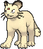
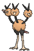
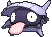
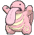

# Kanto Pokémon

---

## #001 Bulbasaur

**Location:** Petalburg Woods

**Ability 2:** Effect Spore **

| Level | Move |     | Cont. | Move |
| ----- | ---- | --- | ----- | ---- |
| 1 |   Tackle |   | 18 |  Magical Leaf |
| 3 |   Growl |   | 21 |  Sweet Scent |
| 5 |   Leech Seed |   | 24 |  Growth |
| 7 |   Vine Whip |   | 27 |  Worry Seed |
| 9 |   Poison Powder |   | 30 |  Double |
| 9 |   Sleep Powder |   | 33 |  Synthesis |
| 11 |  Take Down |   | 36 |  Seed Bomb |
| 13 |  Razor Leaf |   | 39 |  Power Whip |
| 15 |  Sludge |   |   |   |

---

## #002 Ivysaur

**Location:** Evolve Bulbasaur (Lv. 16)

**Ability 2:** Effect Spore **

| Level | Move |     | Cont. | Move |
| ----- | ---- | --- | ----- | ---- |
| 1 |   Tackle |   | 19 |  Magical Leaf |
| 3 |   Growl |   | 22 |  Sweet Scent |
| 5 |   Leech Seed |   | 25 |  Growth |
| 7 |   Vine Whip |   | 28 |  Worry Seed |
| 9 |   Poison Powder |   | 31 |  Double |
| 9 |   Sleep Powder |   | 34 |  Synthesis |
| 11 |  Take Down |   | 37 |  Solar Beam |
| 13 |  Razor Leaf |   | 40 |  Power Whip |
| 15 |  Sludge |   |   |   |

---

## #003 Venusaur

**Location:** Evolve Venusaur (Lv. 32)

**Ability 2:** Thick Fat **

| Level | Move |     | Cont. | Move |
| ----- | ---- | --- | ----- | ---- |
| 1 |   Tackle |   | 22 |  Sweet Scent |
| 3 |   Growl |   | 25 |  Growth |
| 5 |   Leech Seed |   | 28 |  Worry Seed |
| 7 |   Vine Whip |   | 31 |  Double |
| 9 |   Poison Powder |   | 32 |  Petal Dance |
| 9 |   Sleep Powder |   | 35 |  Synthesis |
| 11 |  Take Down |   | 39 |  Petal Blizzard |
| 13 |  Razor Leaf |   | 43 |  Solar Beam |
| 15 |  Sludge |   | 47 |  Power Whip |
| 19 |  Magical Leaf |   | 51 |  Leaf Storm |

---

## #004 Charmander

**Location:** Route 102

**Ability 2:** Tough Claws **

| Level | Move |     | Cont. | Move |
| ----- | ---- | --- | ----- | ---- |
| 1 |   Scratch |   | 22 |  Fire Fang |
| 3 |   Growl |   | 25 |  Slash |
| 5 |   Smokescreen |   | 28 |  Dragon Pulse |
| 7 |   Ember |   | 31 |  Flamethrower |
| 9 |   Metal Claw |   | 34 |  Crunch |
| 11 |  Bite |   | 37 |  Fire Spin |
| 13 |  Dragon Rage |   | 40 |  Dragon Dance |
| 16 |  Flame Burst |   | 43 |  Outrage |
| 19 |  Scary Face |   | 46 |  Inferno |

---

## #005 Charmeleon

**Location:** Evolve Charmander (Lv. 16)

**Ability 2:** Tough Claws **

| Level | Move |     | Cont. | Move |
| ----- | ---- | --- | ----- | ---- |
| 1 |   Scratch |   | 24 |  Fire Fang |
| 3 |   Growl |   | 28 |  Slash |
| 5 |   Smokescreen |   | 32 |  Dragon Pulse |
| 7 |   Ember |   | 36 |  Flamethrower |
| 9 |   Metal Claw |   | 40 |  Crunch |
| 11 |  Bite |   | 44 |  Fire Spin |
| 13 |  Dragon Rage |   | 48 |  Dragon Dance |
| 17 |  Flame Burst |   | 52 |  Outrage |
| 20 |  Scary Face |   | 56 |  Inferno |

---

## #006 Charizard

**Location:** Evolve Charmeleon (Lv. 36)

**Ability 2:** Tough Claws **

| Level | Move |     | Cont. | Move |
| ----- | ---- | --- | ----- | ---- |
| 1 |   Flare Blitz |   | 24 |  Fire Fang |
| 1 |   Dragon Claw |   | 28 |  Slash |
| 1 |   Shadow Claw |   | 32 |  Dragon Pulse |
| 1 |   Air Slash |   | 36 |  Wing Attack |
| 1 |   Scratch |   | 37 |  Flamethrower |
| 3 |   Growl |   | 42 |  Crunch |
| 5 |   Smokescreen |   | 47 |  Fire Spin |
| 7 |   Ember |   | 52 |  Dragon Dance |
| 9 |   Metal Claw |   | 57 |  Outrage |
| 11 |  Bite |   | 62 |  Inferno |
| 13 |  Dragon Rage |   | 67 |  Heat Wave |
| 17 |  Flame Burst |   | 72 |  Flare Blitz |
| 20 |  Scary Face |   |   |   |

---

## #007 Squirtle

**Location:** Route 103

**Ability 2:** Shell Armor **

| Level | Move |     | Cont. | Move |
| ----- | ---- | --- | ----- | ---- |
| 1 |   Tackle |   | 19 |  Yawn |
| 3 |   Tail Whip |   | 21 |  Rapid Spin |
| 5 |   Water Gun |   | 24 |  Protect |
| 7 |   Withdraw |   | 27 |  Aqua Tail |
| 9 |   Bubble |   | 29 |  Skull Bush |
| 11 |  Bite |   | 31 |  Muddy Water |
| 13 |  Fake Out |   | 33 |  Iron Defense |
| 15 |  Rapid Spin |   | 36 |  Rain Dance |
| 17 |  Water Pulse |   | 39 |  Hydro Pump |

---

## #008 Wartortle

**Location:** Evolve Squirtle (Lv. 16)

**Ability 2:** Shell Armor **

| Level | Move |     | Cont. | Move |
| ----- | ---- | --- | ----- | ---- |
| 1 |   Tackle |   | 21 |  Yawn |
| 3 |   Tail Whip |   | 24 |  Rapid Spin |
| 5 |   Water Gun |   | 28 |  Protect |
| 7 |   Withdraw |   | 31 |  Aqua Tail |
| 9 |   Bubble |   | 34 |  Skull Bush |
| 11 |  Bite |   | 37 |  Muddy Water |
| 13 |  Fake Out |   | 40 |  Iron Defense |
| 15 |  Rapid Spin |   | 44 |  Rain Dance |
| 18 |  Water Pulse |   | 48 |  Hydro Pump |

---

## #009 Blastoise

**Location:** Evolve Wartortle (Lv. 36)

**Ability 2:** Mega Launcher **

| Level | Move |     | Cont. | Move |
| ----- | ---- | --- | ----- | ---- |
| 1 |   Water Spout |   | 18 |  Water Pulse |
| 1 |   Aura Sphere |   | 21 |  Yawn |
| 1 |   Dragon Pulse |   | 24 |  Rapid Spin |
| 1 |   Dark Pulse |   | 28 |  Protect |
| 1 |   Flash Cannon |   | 31 |  Aqua Tail |
| 1 |   Tackle |   | 34 |  Skull Bush |
| 3 |   Tail Whip |   | 38 |  Muddy Water |
| 5 |   Water Gun |   | 42 |  Iron Defense |
| 7 |   Withdraw |   | 46 |  Rain Dance |
| 9 |   Bubble |   | 51 |  Hydro Pump |
| 11 |  Bite |   | 56 |  Water Spout |
| 13 |  Fake Out |   | 61 |  Shell Smash |
| 15 |  Rapid Spin |   |   |   |

---

## #010 Caterpie

**Location:** Route 101

**Ability 2:** Run Away

| Level | Move |     | Cont. | Move |
| ----- | ---- | --- | ----- | ---- |
| 1 |   Tackle |   | 3 |   Bug Bite |
| 1 |   String Shot |   | 5 |   Electroweb |

---

## #011 Metapod

**Location:** Evolve Caterpie (Lv. 7)

| Level | Move |     | Cont. | Move |
| ----- | ---- | --- | ----- | ---- |
| 1 |   Harden |   | 9 |   Iron Defense |
| 7 |   Harden |   |   |   |

---

## #012 Butterfree

**Location:** Safari Zone

**Ability 2:** Tinted Lens

**New TM/HMs:** Fly

| Stat | Base | Change |
| ---- | ---- | ------ |
| Attack | 45 | 25 |
| Sp. Attack | 90 | 115 |
| Sp. Defense | 80 | 105 |
| Speed | 70 | 95 |
| Total | 395 | 450 |

| Level | Move |     | Cont. | Move |
| ----- | ---- | --- | ----- | ---- |
| 1 |   Confusion |   | 24 |  Silver Wind |
| 10 |  Confusion |   | 26 |  Tailwind |
| 10 |  Gust |   | 28 |  Energy Ball |
| 12 |  Poison Powder |   | 30 |  Safeguard |
| 12 |  Stun Spore |   | 32 |  Bug Buzz |
| 12 |  Sleep Powder |   | 34 |  Rage Powder |
| 14 |  Struggle Bug |   | 36 |  Psychic |
| 16 |  Supersonic |   | 38 |  Captivate |
| 18 |  Air Slash |   | 40 |  Quiver Dance |
| 20 |  Psybeam |   | 42 |  Hurricane |
| 22 |  Whirlwind |   |   |   |

---

## #013 Weedle

.")

**Location:** Route 101

**Ability 2:** Run Away

| Level | Move |     | Cont. | Move |
| ----- | ---- | --- | ----- | ---- |
| 1 |   Poison Sting |   | 3 |   Bug Bite |
| 1 |   String Shot |   | 5 |   Electroweb |

---

## #014 Kakuna

**Location:** Evolve Weedle (Lv. 7)

| Level | Move |     | Cont. | Move |
| ----- | ---- | --- | ----- | ---- |
| 1 |   Harden |   | 9 |   Iron Defense |
| 7 |   Harden |   |   |   |

---

## #015 Beedrill

**Location:** Route 101

**Ability 2:** Sniper

**New TM/HMs:** Fly

### Normal Forme

| Stat | Base | Change |
| ---- | ---- | ------ |
| Attack | 90 | 115 |
| Sp. Attack | 45 | 25 |
| Sp. Defense | 80 | 105 |
| Speed | 75 | 100 |
| Total | 395 | 450 |

### Mega Forme

| Stat | Base | Change |
| ---- | ---- | ------ |
| Defense | 40 | 50 |
| Sp. Attack | 15 | 30 |
| Sp. Defense | 80 | 110 |
| Total | 495 | 550 |

| Level | Move |     | Cont. | Move |
| ----- | ---- | --- | ----- | ---- |
| 1 |   Fury Attack |   | 26 |  Agility |
| 10 |  Fury Attack |   | 28 |  Assurance |
| 10 |  Twinneedle |   | 30 |  Endeavor |
| 12 |  Focus Energy |   | 32 |  Fell Stinger |
| 14 |  Cross Poison |   | 34 |  Drill Run |
| 16 |  Pursuit |   | 36 |  Acrobatics |
| 18 |  Toxic Spikes |   | 38 |  Payback |
| 20 |  Pin Missile |   | 40 |  Brick Break |
| 22 |  Poison Jab |   | 42 |  Megahorn |
| 24 |  X |   |   |   |

---

## #016 Pidgey

**Location:** Route 101

| Level | Move |     | Cont. | Move |
| ----- | ---- | --- | ----- | ---- |
| 1 |   Tackle |   | 25 |  Air Slash |
| 1 |   Sand |   | 28 |  Roost |
| 4 |   Gust |   | 31 |  Tailwind |
| 7 |   Quick Attack |   | 34 |  Double |
| 10 |  Uproar |   | 37 |  Agility |
| 13 |  Wing Attack |   | 40 |  Mirror Move |
| 16 |  Twister |   | 43 |  Brave Bird |
| 19 |  Whirlwind |   | 46 |  Hurricane |
| 22 |  Feather Dance |   |   |   |

---

## #017 Pidgeotto

**Location:** Safari Zone

| Level | Move |     | Cont. | Move |
| ----- | ---- | --- | ----- | ---- |
| 1 |   Tackle |   | 28 |  Air Slash |
| 1 |   Sand |   | 32 |  Roost |
| 4 |   Gust |   | 36 |  Tailwind |
| 7 |   Quick Attack |   | 40 |  Double |
| 10 |  Uproar |   | 44 |  Agility |
| 13 |  Wing Attack |   | 48 |  Mirror Move |
| 16 |  Twister |   | 52 |  Brave Bird |
| 20 |  Whirlwind |   | 56 |  Hurricane |
| 24 |  Feather Dance |   |   |   |

---

## #018 Pidgeot

**Location:** Soaring in the Sky

| Level | Move |     | Cont. | Move |
| ----- | ---- | --- | ----- | ---- |
| 1 |   Hurricane |   | 24 |  Feather Dance |
| 1 |   Heat Wave |   | 28 |  Air Slash |
| 1 |   Ominous Wind |   | 32 |  Roost |
| 1 |   Tackle |   | 37 |  Tailwind |
| 1 |   Sand |   | 42 |  Double |
| 4 |   Gust |   | 47 |  Agility |
| 7 |   Quick Attack |   | 52 |  Mirror Move |
| 10 |  Uproar |   | 57 |  Brave Bird |
| 13 |  Wing Attack |   | 62 |  Hurricane |
| 16 |  Twister |   | 67 |  Hyper Beam |
| 20 |  Whirlwind |   |   |   |

---

## #019 Rattata

**Location:** Route 101

| Level | Move |     | Cont. | Move |
| ----- | ---- | --- | ----- | ---- |
| 1 |   Tackle |   | 22 |  Crunch |
| 1 |   Tail Whip |   | 25 |  Revenge |
| 4 |   Quick Attack |   | 28 |  Sucker Punch |
| 7 |   Focus Energy |   | 31 |  Super Fang |
| 10 |  Bite |   | 34 |  Assurance |
| 13 |  Hyper Fang |   | 37 |  Reversal |
| 16 |  Flame Wheel |   | 40 |  Double |
| 19 |  Pursuit |   | 43 |  Endeavor |

---

## #020 Raticate

**Location:** Safari Zone, Sky Pillar

| Stat | Base | Change |
| ---- | ---- | ------ |
| HP | 55 | 60 |
| Attack | 81 | 100 |
| Sp. Attack | 50 | 35 |
| Speed | 97 | 115 |
| Total | 413 | 440 |

| Level | Move |     | Cont. | Move |
| ----- | ---- | --- | ----- | ---- |
| 1 |   Fire Fang |   | 16 |  Flame Wheel |
| 1 |   Thunder Fang |   | 19 |  Pursuit |
| 1 |   Ice Fang |   | 23 |  Crunch |
| 1 |   Swords Dance |   | 27 |  Revenge |
| 1 |   Tackle |   | 31 |  Sucker Punch |
| 1 |   Tail Whip |   | 35 |  Super Fang |
| 4 |   Quick Attack |   | 39 |  Assurance |
| 7 |   Focus Energy |   | 43 |  Reversal |
| 10 |  Bite |   | 47 |  Double |
| 13 |  Hyper Fang |   | 51 |  Endeavor |

---

## #021 Spearow

**Location:** Route 103, Mt. Pyre Summit

**Ability 2:** Sniper

| Level | Move |     | Cont. | Move |
| ----- | ---- | --- | ----- | ---- |
| 1 |   Peck |   | 20 |  Mirror Move |
| 1 |   Growl |   | 23 |  Feint Attack |
| 5 |   Leer |   | 26 |  Drill Peck |
| 8 |   Fury Attack |   | 29 |  Agility |
| 11 |  Pursuit |   | 32 |  Assurance |
| 14 |  Aerial Ace |   | 35 |  Roost |
| 17 |  Quick Attack |   | 38 |  Drill Run |

---

## #022 Fearow

**Location:** Mt. Pyre Summit

**Ability 2:** Sniper

| Stat | Base | Change |
| ---- | ---- | ------ |
| Attack | 90 | 100 |
| Sp. Attack | 61 | 60 |
| Sp. Defense | 61 | 60 |
| Total | 442 | 450 |

| Level | Move |     | Cont. | Move |
| ----- | ---- | --- | ----- | ---- |
| 1 |   Drill Run |   | 17 |  Quick Attack |
| 1 |   Pluck |   | 21 |  Mirror Move |
| 1 |   Peck |   | 25 |  Feint Attack |
| 1 |   Growl |   | 29 |  Drill Peck |
| 5 |   Leer |   | 33 |  Agility |
| 8 |   Fury Attack |   | 37 |  Assurance |
| 11 |  Pursuit |   | 41 |  Roost |
| 14 |  Aerial Ace |   | 45 |  Drill Run |

---

## #023 Ekans

**Location:** Route 112 North

| Level | Move |     | Cont. | Move |
| ----- | ---- | --- | ----- | ---- |
| 1 |   Wrap |   | 23 |  Poison Tail |
| 1 |   Leer |   | 26 |  Mud Bomb |
| 5 |   Poison Sting |   | 29 |  Acid Spray |
| 8 |   Bite |   | 32 |  Poison Jab |
| 11 |  Glare |   | 35 |  Gastro Acid |
| 14 |  Screech |   | 38 |  Sucker Punch |
| 17 |  Acid |   | 41 |  Belch |
| 20 |  Stockpile |   | 44 |  Gunk Shot |
| 20 |  Swallow |   | 47 |  Haze |
| 20 |  Spit Up |   | 50 |  Coil |

---

## #024 Arbok

**Location:** Route 119

| Stat | Base | Change |
| ---- | ---- | ------ |
| Attack | 85 | 95 |
| Defense | 69 | 70 |
| Sp. Attack | 65 | 55 |
| Sp. Defense | 79 | 85 |
| Speed | 80 | 85 |
| Total | 438 | 450 |

| Level | Move |     | Cont. | Move |
| ----- | ---- | --- | ----- | ---- |
| 1 |   Ice Fang |   | 20 |  Spit Up |
| 1 |   Thunder Fang |   | 22 |  Crunch |
| 1 |   Fire Fang |   | 24 |  Poison Tail |
| 1 |   Aqua Tail |   | 28 |  Mud Bomb |
| 1 |   Wrap |   | 32 |  Acid Spray |
| 1 |   Leer |   | 36 |  Poison Jab |
| 5 |   Poison Sting |   | 40 |  Gastro Acid |
| 8 |   Bite |   | 44 |  Sucker Punch |
| 11 |  Glare |   | 48 |  Belch |
| 14 |  Screech |   | 52 |  Gunk Shot |
| 17 |  Acid |   | 56 |  Haze |
| 20 |  Stockpile |   | 60 |  Coil |
| 20 |  Swallow |   |   |   |

---

## #025 Pikachu

**Location:** New Mauville

**Ability 2:** Lighting Rod

**New TM/HMs:** Surf

| Level | Move |     | Cont. | Move |
| ----- | ---- | --- | ----- | ---- |
| 1 |   Tail Whip |   | 25 |  Spark |
| 1 |   Thunder Shock |   | 28 |  Discharge |
| 5 |   Growl |   | 31 |  Nuzzle |
| 7 |   Play Nice |   | 34 |  Thunderbolt |
| 9 |   Quick Attack |   | 37 |  Slam |
| 11 |  Feint |   | 40 |  Agility |
| 13 |  Disarming Voice |   | 43 |  Wild Charge |
| 15 |  Electro Ball |   | 46 |  Light Screen |
| 17 |  Thunder Wave |   | 49 |  Thunder |
| 19 |  Fake Out |   | 52 |  Volt Tackle |
| 22 |  Double Team |   |   |   |

---

## #026 Raichu

**Location:** Evolve Pikachu (Thunder Stone)

**Ability 2:** Lighting Rod

**New TM/HMs:** Surf

| Stat | Base | Change |
| ---- | ---- | ------ |
| Attack | 90 | 100 |
| Sp. Attack | 90 | 100 |
| Total | 485 | 505 |

| Level | Move |     | Cont. | Move |
| ----- | ---- | --- | ----- | ---- |
| 1 |   Petal Dance |   | 1 |   Quick Attack |
| 1 |   Thunder Shock |   | 1 |   Thunderbolt |
| 1 |   Tail Whip |   |   |   |

---

## #027 Sandshrew

**Location:** Route 113

**Ability 2:** Sand Rush

| Level | Move |     | Cont. | Move |
| ----- | ---- | --- | ----- | ---- |
| 1 |   Scratch |   | 22 |  Sand Tomb |
| 1 |   Defense Curl |   | 25 |  Slash |
| 3 |   Sand Attack |   | 28 |  Night Slash |
| 5 |   Poison Sting |   | 31 |  Dig |
| 7 |   Rollout |   | 34 |  Gyro Ball |
| 9 |   Rapid Spin |   | 37 |  Super Fang |
| 11 |  Fury Cutter |   | 40 |  Earthquake |
| 13 |  Magnitude |   | 43 |  Iron Tail |
| 15 |  Swift |   | 46 |  Swords Dance |
| 17 |  Metal Claw |   | 49 |  Sandstorm |
| 19 |  Fury Swipes |   |   |   |

---

## #028 Sandslash

**Location:** Route 111

**Ability 2:** Sand Rush

**Held Item:** Dome Fossil (50%), Grip Claw (5%)

| Level | Move |     | Cont. | Move |
| ----- | ---- | --- | ----- | ---- |
| 1 |   Sandstorm |   | 22 |  Crush Claw |
| 1 |   Scratch |   | 23 |  Sand Tomb |
| 1 |   Defense Curl |   | 27 |  Slash |
| 3 |   Sand Attack |   | 31 |  Night Slash |
| 5 |   Poison Sting |   | 35 |  Dig |
| 7 |   Rollout |   | 39 |  Gyro Ball |
| 9 |   Rapid Spin |   | 43 |  Super Fang |
| 11 |  Fury Cutter |   | 47 |  Earthquake |
| 13 |  Magnitude |   | 51 |  Iron Tail |
| 15 |  Swift |   | 55 |  Swords Dance |
| 17 |  Metal Claw |   | 59 |  Sandstorm |
| 19 |  Fury Swipes |   |   |   |

---

## #029 Nidoran F

**Location:** Route 103

| Level | Move |     | Cont. | Move |
| ----- | ---- | --- | ----- | ---- |
| 1 |   Growl |   | 21 |  Poison Jab |
| 1 |   Scratch |   | 24 |  Helping Hand |
| 1 |   Poison Sting |   | 27 |  Crunch |
| 6 |   Tail Whip |   | 30 |  Toxic Spikes |
| 9 |   Double Kick |   | 33 |  Flatter |
| 12 |  Poison Fang |   | 36 |  Captivate |
| 15 |  Fury Swipes |   | 39 |  Skull Bash |
| 18 |  Bite |   | 42 |  Super Fang |

---

## #030 Nidorina

**Location:** Safari Zone

| Level | Move |     | Cont. | Move |
| ----- | ---- | --- | ----- | ---- |
| 1 |   Growl |   | 23 |  Poison Jab |
| 1 |   Scratch |   | 27 |  Helping Hand |
| 1 |   Poison Sting |   | 31 |  Crunch |
| 6 |   Tail Whip |   | 35 |  Toxic Spikes |
| 9 |   Double Kick |   | 39 |  Flatter |
| 12 |  Poison Fang |   | 43 |  Captivate |
| 15 |  Fury Swipes |   | 47 |  Skull Bash |
| 19 |  Bite |   | 51 |  Super Fang |

---

## #031 Nidoqueen

**Location:** Evolve Nidorina (Moon Stone)

| Level | Move |     | Cont. | Move |
| ----- | ---- | --- | ----- | ---- |
| 1 |   Moonlight |   | 1 |   Poison Sting |
| 1 |   Lovely Kiss |   | 23 |  Chip Away |
| 1 |   Superpower |   | 35 |  Body Slam |
| 1 |   Scratch |   | 43 |  Earth Power |
| 1 |   Tail Whip |   | 58 |  Superpower |
| 1 |   Double Kick |   |   |   |

---

## #032 Nidoran M

**Location:** Route 103

| Level | Move |     | Cont. | Move |
| ----- | ---- | --- | ----- | ---- |
| 1 |   Leer |   | 21 |  Poison Jab |
| 1 |   Peck |   | 24 |  Helping Hand |
| 1 |   Poison Sting |   | 27 |  Drill Run |
| 6 |   Focus Energy |   | 30 |  Toxic Spikes |
| 9 |   Double Kick |   | 33 |  Flatter |
| 12 |  Poison Tail |   | 36 |  Captivate |
| 15 |  Fury Attack |   | 39 |  Horn Drill |
| 18 |  Horn Attack |   | 42 |  Head Smash |

---

## #033 Nidorino

**Location:** Safari Zone

| Level | Move |     | Cont. | Move |
| ----- | ---- | --- | ----- | ---- |
| 1 |   Leer |   | 23 |  Poison Jab |
| 1 |   Peck |   | 27 |  Helping Hand |
| 1 |   Poison Sting |   | 31 |  Drill Run |
| 6 |   Focus Energy |   | 35 |  Toxic Spikes |
| 9 |   Double Kick |   | 39 |  Flatter |
| 12 |  Poison Tail |   | 43 |  Captivate |
| 15 |  Fury Attack |   | 47 |  Horn Drill |
| 19 |  Horn Attack |   | 51 |  Head Smash |

---

## #034 Nidoking

**Location:** Evolve Nidorino (Moon Stone)

| Level | Move |     | Cont. | Move |
| ----- | ---- | --- | ----- | ---- |
| 1 |   Morning Sun |   | 1 |   Poison Sting |
| 1 |   Lovely Kiss |   | 23 |  Chip Away |
| 1 |   Megahorn |   | 35 |  Thrash |
| 1 |   Peck |   | 43 |  Earth Power |
| 1 |   Focus Energy |   | 58 |  Megahorn |
| 1 |   Double Kick |   |   |   |

---

## #035 Clefairy

**Location:** Meteor Falls

| Level | Move |     | Cont. | Move |
| ----- | ---- | --- | ----- | ---- |
| 1 |   Pound |   | 23 |  Moonblast |
| 1 |   Growl |   | 25 |  Metronome |
| 1 |   Encore |   | 27 |  Cosmic Power |
| 1 |   Sing |   | 29 |  Stored Power |
| 7 |   Double Slap |   | 31 |  Lucky Chant |
| 9 |   Defense Curl |   | 33 |  Body Slam |
| 11 |  Disarming Voice |   | 35 |  Moonlight |
| 13 |  Follow Me |   | 37 |  Gravity |
| 15 |  After You |   | 39 |  Meteor Mash |
| 17 |  Bestow |   | 41 |  Misty Terrain |
| 19 |  Healing Wish |   | 43 |  Belly Drum |
| 21 |  Psyshock |   |   |   |

---

## #036 Clefable

**Location:** Meteor Falls

| Level | Move |     | Cont. | Move |
| ----- | ---- | --- | ----- | ---- |
| 1 |   Petal Dance |   | 1 |   Metronome |
| 1 |   Disarming Voice |   | 25 |  Psyshock |
| 1 |   Sing |   | 35 |  Moonblast |
| 1 |   Double Slap |   | 45 |  Meteor Mash |
| 1 |   Minimize |   | 55 |  Wish |

---

## #037 Vulpix

**Location:** Route 112 North, Mt. Pyre

**Ability 2:** Drought

| Level | Move |     | Cont. | Move |
| ----- | ---- | --- | ----- | ---- |
| 1 |   Ember |   | 28 |  Feint Attack |
| 4 |   Tail Whip |   | 31 |  Extrasensory |
| 7 |   Roar |   | 34 |  Flamethrower |
| 9 |   Baby |   | 36 |  Hypnosis |
| 10 |  Quick Attack |   | 39 |  Safeguard |
| 12 |  Confuse Ray |   | 42 |  Imprison |
| 15 |  Fire Spin |   | 44 |  Fire Blast |
| 18 |  Payback |   | 47 |  Grudge |
| 20 |  Will |   | 50 |  Captivate |
| 23 |  Flame Burst |   | 53 |  Inferno |
| 26 |  Hex |   |   |   |

---

## #038 Ninetales

**Location:** Mt. Pyre

**Ability 2:** Drought

| Level | Move |     | Cont. | Move |
| ----- | ---- | --- | ----- | ---- |
| 1 |   Energy Ball |   | 1 |   Quick Attack |
| 1 |   Imprison |   | 1 |   Confuse Ray |
| 1 |   Nasty Plot |   | 1 |   Safeguard |
| 1 |   Flamethrower |   |   |   |

---

## #039 Jigglypuff

**Location:** Route 115

| Stat | Base | Change |
| ---- | ---- | ------ |
| Defense | 20 | 40 |
| Sp. Attack | 45 | 60 |
| Sp. Defense | 25 | 40 |
| Total | 270 | 320 |

| Level | Move |     | Cont. | Move |
| ----- | ---- | --- | ----- | ---- |
| 1 |   Sing |   | 19 |  Wake |
| 3 |   Defense Curl |   | 21 |  Body Slam |
| 5 |   Pound |   | 23 |  Dazzling Gleam |
| 7 |   Play Nice |   | 25 |  Hyper Voice |
| 9 |   Disarming Voice |   | 27 |  Rest |
| 11 |  Round |   | 29 |  Mimic |
| 13 |  Double Slap |   | 31 |  Gyro Ball |
| 15 |  Disable |   | 33 |  Double |
| 17 |  Rollout |   | 35 |  Wish |

---

## #040 Wigglytuff

**Location:** Evolve Jigglypuff (Moon Stone)

| Stat | Base | Change |
| ---- | ---- | ------ |
| HP | 140 | 150 |
| Attack | 70 | 80 |
| Defense | 45 | 55 |
| Sp. Attack | 85 | 95 |
| Sp. Defense | 50 | 60 |
| Total | 435 | 485 |

| Level | Move |     | Cont. | Move |
| ----- | ---- | --- | ----- | ---- |
| 1 |   Petal Dance |   | 1 |   Double Slap |
| 1 |   Double |   | 15 |  Water Pulse |
| 1 |   Play Rough |   | 20 |  Shock Wave |
| 1 |   Sing |   | 25 |  Icy Wind |
| 1 |   Defense Curl |   | 30 |  Hyper Voice |
| 1 |   Disable |   |   |   |

---

## #041 Zubat

**Location:** Granite Cave, Scorched Slab, Mt. Pyre, Seafloor Cavern

**Ability 2:** Infiltrator

| Level | Move |     | Cont. | Move |
| ----- | ---- | --- | ----- | ---- |
| 1 |   Leech Life |   | 28 |  Acrobatics |
| 1 |   Supersonic |   | 31 |  Giga Drain |
| 4 |   Leech Life |   | 34 |  Mean Look |
| 7 |   Bite |   | 37 |  Haze |
| 10 |  Wing Attack |   | 40 |  Venoshock |
| 13 |  Confuse Ray |   | 43 |  Air Slash |
| 16 |  Feint Attack |   | 46 |  Hypnosis |
| 19 |  Air Cutter |   | 49 |  Brave Bird |
| 22 |  Poison Fang |   | 52 |  Quick Guard |
| 25 |  Swift |   |   |   |

---

## #042 Golbat

**Location:** Meteor Falls, Scorched Slab, Mt. Pyre, Seafloor Cavern, Cave of Origin, Victory Road

**Ability 2:** Infiltrator

| Level | Move |     | Cont. | Move |
| ----- | ---- | --- | ----- | ---- |
| 1 |   Screech |   | 27 |  Swift |
| 1 |   Leech Life |   | 31 |  Acrobatics |
| 1 |   Supersonic |   | 35 |  Giga Drain |
| 4 |   Leech Life |   | 39 |  Mean Look |
| 7 |   Bite |   | 43 |  Haze |
| 10 |  Wing Attack |   | 47 |  Venoshock |
| 13 |  Confuse Ray |   | 51 |  Air Slash |
| 16 |  Feint Attack |   | 55 |  Hypnosis |
| 19 |  Air Cutter |   | 59 |  Brave Bird |
| 23 |  Poison Fang |   | 63 |  Quick Guard |

---

## #043 Oddish

**Location:** Route 110

**Ability 2:** Run Away

| Level | Move |     | Cont. | Move |
| ----- | ---- | --- | ----- | ---- |
| 1 |   Absorb |   | 21 |  Giga Drain |
| 3 |   Sweet Scent |   | 24 |  Moonlight |
| 6 |   Lucky Chant |   | 27 |  Toxic |
| 9 |   Acid |   | 30 |  Sludge Bomb |
| 12 |  Mega Drain |   | 33 |  Natural Gift |
| 15 |  Sleep Powder |   | 36 |  Moonblast |
| 15 |  Stun Spore |   | 39 |  Grassy Terrain |
| 15 |  Poison Powder |   | 42 |  Petal Dance |
| 18 |  Venoshock |   |   |   |

---

## #044 Gloom

**Location:** Route 119

**Ability 2:** Stench

| Level | Move |     | Cont. | Move |
| ----- | ---- | --- | ----- | ---- |
| 1 |   Absorb |   | 21 |  Petal Blizzard |
| 3 |   Sweet Scent |   | 22 |  Giga Drain |
| 6 |   Lucky Chant |   | 26 |  Moonlight |
| 9 |   Acid |   | 30 |  Sludge Bomb |
| 12 |  Mega Drain |   | 34 |  Toxic |
| 15 |  Sleep Powder |   | 38 |  Natural Gift |
| 15 |  Stun Spore |   | 42 |  Moonblast |
| 15 |  Poison Powder |   | 46 |  Grassy Terrain |
| 18 |  Venoshock |   | 50 |  Petal Dance |

---

## #045 Vileplume

**Location:** Evolve Gloom (Leaf Stone)

**Ability 2:** Effect Spore

| Level | Move |     | Cont. | Move |
| ----- | ---- | --- | ----- | ---- |
| 1 |   Moonblast |   | 1 |   Stun Spore |
| 1 |   Mega Drain |   | 34 |  Petal Blizzard |
| 1 |   Aromatherapy |   | 44 |  Petal Dance |
| 1 |   Poison Powder |   | 54 |  Solar Beam |

---

## #046 Paras

**Location:** Rusturf Tunnel

| Stat | Base | Change |
| ---- | ---- | ------ |
| Attack | 70 | 80 |
| Total | 285 | 295 |

| Level | Move |     | Cont. | Move |
| ----- | ---- | --- | ----- | ---- |
| 1 |   Scratch |   | 21 |  Spore |
| 1 |   Bug Bite |   | 24 |  Slash |
| 3 |   Stun Spore |   | 27 |  Growth |
| 6 |   Poison Powder |   | 30 |  X |
| 9 |   Leech Life |   | 33 |  Giga Drain |
| 12 |  Bullet Seed |   | 36 |  Aromatherapy |
| 15 |  Fury Cutter |   | 39 |  Rage Powder |
| 18 |  Cross Poison |   | 42 |  Seed Bomb |

---

## #047 Parasect

**Location:** Route 123

| Stat | Base | Change |
| ---- | ---- | ------ |
| HP | 60 | 80 |
| Attack | 95 | 115 |
| Defense | 80 | 90 |
| Sp. Attack | 60 | 45 |
| Sp. Defense | 80 | 90 |
| Total | 435 | 450 |

| Level | Move |     | Cont. | Move |
| ----- | ---- | --- | ----- | ---- |
| 1 |   Seed Bomb |   | 21 |  Spore |
| 1 |   Scratch |   | 25 |  Slash |
| 1 |   Bug Bite |   | 29 |  Growth |
| 3 |   Stun Spore |   | 33 |  X |
| 6 |   Poison Powder |   | 37 |  Giga Drain |
| 9 |   Leech Life |   | 41 |  Aromatherapy |
| 12 |  Bullet Seed |   | 45 |  Rage Powder |
| 15 |  Fury Cutter |   | 49 |  Seed Bomb |
| 18 |  Cross Poison |   |   |   |

---

## #048 Venonat

**Location:** Petalburg Woods

| Level | Move |     | Cont. | Move |
| ----- | ---- | --- | ----- | ---- |
| 1 |   Tackle |   | 20 |  Poison Powder |
| 1 |   Disable |   | 23 |  Stun Spore |
| 1 |   Foresight |   | 26 |  Sleep Powder |
| 5 |   Leech Life |   | 29 |  Zen Headbutt |
| 8 |   Supersonic |   | 32 |  Signal Beam |
| 11 |  Poison Fang |   | 35 |  Venoshock |
| 14 |  Bug Bite |   | 38 |  Energy Ball |
| 17 |  Confusion |   | 41 |  Psychic |

---

## #049 Venomoth

**Location:** Route 123

| Stat | Base | Change |
| ---- | ---- | ------ |
| Attack | 65 | 55 |
| Sp. Attack | 90 | 100 |
| Speed | 90 | 100 |
| Total | 450 | 460 |

| Level | Move |     | Cont. | Move |
| ----- | ---- | --- | ----- | ---- |
| 1 |   Quiver Dance |   | 23 |  Stun Spore |
| 1 |   Bug Buzz |   | 26 |  Sleep Powder |
| 1 |   Tackle |   | 29 |  Zen Headbutt |
| 1 |   Disable |   | 31 |  Gust |
| 1 |   Foresight |   | 31 |  Silver Wind |
| 5 |   Leech Life |   | 33 |  Signal Beam |
| 8 |   Supersonic |   | 37 |  Venoshock |
| 11 |  Poison Fang |   | 41 |  Energy Ball |
| 14 |  Bug Bite |   | 45 |  Psychic |
| 17 |  Confusion |   | 49 |  Bug Buzz |
| 20 |  Poison Powder |   | 53 |  Quiver Dance |

---

## #050 Diglett

**Location:** Fiery Path

| Level | Move |     | Cont. | Move |
| ----- | ---- | --- | ----- | ---- |
| 1 |   Scratch |   | 22 |  Mud Bomb |
| 1 |   Sand Attack |   | 25 |  Dig |
| 4 |   Growl |   | 28 |  Earth Power |
| 7 |   Astonish |   | 31 |  Slash |
| 10 |  Mud |   | 34 |  Earthquake |
| 13 |  Magnitude |   | 37 |  Rock Slide |
| 16 |  Bulldoze |   | 40 |  Night Slash |
| 19 |  Sucker Punch |   | 43 |  Fissure |

---

## #051 Dugtrio

**Location:** Route 123

| Stat | Base | Change |
| ---- | ---- | ------ |
| HP | 35 | 45 |
| Attack | 80 | 100 |
| Defense | 50 | 60 |
| Sp. Defense | 70 | 80 |
| Total | 405 | 455 |

| Level | Move |     | Cont. | Move |
| ----- | ---- | --- | ----- | ---- |
| 1 |   Rototiller |   | 22 |  Mud Bomb |
| 1 |   Tri Attack |   | 25 |  Dig |
| 1 |   Scratch |   | 26 |  Sand Tomb |
| 1 |   Sand Attack |   | 29 |  Earth Power |
| 4 |   Growl |   | 33 |  Slash |
| 7 |   Astonish |   | 37 |  Earthquake |
| 10 |  Mud |   | 41 |  Rock Slide |
| 13 |  Magnitude |   | 45 |  Night Slash |
| 16 |  Bulldoze |   | 49 |  Fissure |
| 19 |  Sucker Punch |   |   |   |

---

## #052 Meowth

**Location:** Route 112 South, Route 121

| Level | Move |     | Cont. | Move |
| ----- | ---- | --- | ----- | ---- |
| 1 |   Scratch |   | 22 |  Pay Day |
| 1 |   Growl |   | 24 |  Hypnosis |
| 6 |   Bite |   | 27 |  Body Slam |
| 8 |   Fake Out |   | 30 |  Nasty Plot |
| 10 |  Fury Swipes |   | 33 |  Assurance |
| 12 |  Uproar |   | 36 |  Captivate |
| 14 |  Screech |   | 39 |  Night Slash |
| 16 |  Feint Attack |   | 42 |  Feint |
| 18 |  Slash |   | 45 |  Hyper Voice |
| 20 |  Taunt |   |   |   |

---

## #053 Persian

**Location:** Route 121

| Stat | Base | Change |
| ---- | ---- | ------ |
| Attack | 70 | 85 |
| Sp. Attack | 65 | 75 |
| Total | 440 | 460 |

| Level | Move |     | Cont. | Move |
| ----- | ---- | --- | ----- | ---- |
| 1 |   Play Rough |   | 20 |  Taunt |
| 1 |   Switcheroo |   | 22 |  Power Gem |
| 1 |   Scratch |   | 24 |  Hypnosis |
| 1 |   Growl |   | 27 |  Body Slam |
| 6 |   Bite |   | 28 |  Swift |
| 8 |   Fake Out |   | 31 |  Nasty Plot |
| 10 |  Fury Swipes |   | 35 |  Assurance |
| 12 |  Uproar |   | 39 |  Captivate |
| 14 |  Screech |   | 43 |  Night Slash |
| 16 |  Feint Attack |   | 47 |  Feint |
| 18 |  Slash |   | 51 |  Hyper Voice |

---

## #054 Psyduck

**Location:** Route 104 South

| Level | Move |     | Cont. | Move |
| ----- | ---- | --- | ----- | ---- |
| 1 |   Water Sport |   | 25 |  Screech |
| 1 |   Scratch |   | 29 |  Aqua Tail |
| 4 |   Tail Whip |   | 32 |  Zen Headbutt |
| 8 |   Water Gun |   | 36 |  Soak |
| 11 |  Confusion |   | 39 |  Psych Up |
| 15 |  Fury Swipes |   | 43 |  Amnesia |
| 18 |  Water Pulse |   | 46 |  Hydro Pump |
| 22 |  Disable |   | 50 |  Wonder Room |

---

## #055 Golduck

**Location:** Route 118

| Level | Move |     | Cont. | Move |
| ----- | ---- | --- | ----- | ---- |
| 1 |   Cross Chop |   | 18 |  Water Pulse |
| 1 |   Petal Dance |   | 22 |  Disable |
| 1 |   Psychic |   | 25 |  Zen Headbutt |
| 1 |   Aqua Jet |   | 29 |  Screech |
| 1 |   Water Sport |   | 32 |  Aqua Tail |
| 1 |   Scratch |   | 33 |  Power Gem |
| 1 |   Tail Whip |   | 38 |  Soak |
| 1 |   Water Gun |   | 43 |  Psych Up |
| 4 |   Tail Whip |   | 49 |  Amnesia |
| 8 |   Water Gun |   | 54 |  Hydro Pump |
| 11 |  Confusion |   | 60 |  Wonder Room |
| 15 |  Fury Swipes |   | 66 |  Psychic |

---

## #056 Mankey

**Location:** Route 103, Jagged Pass

| Level | Move |     | Cont. | Move |
| ----- | ---- | --- | ----- | ---- |
| 1 |   Scratch |   | 26 |  Low Sweep |
| 1 |   Low Kick |   | 29 |  Covet |
| 1 |   Leer |   | 32 |  Cross Chop |
| 1 |   Focus Energy |   | 35 |  Thrash |
| 5 |   Fury Swipes |   | 38 |  Acrobatics |
| 8 |   Karate Chop |   | 41 |  Dual Chop |
| 11 |  Seismic Toss |   | 44 |  Close Combat |
| 14 |  Screech |   | 47 |  Punishment |
| 17 |  Assurance |   | 50 |  Gunk Shot |
| 20 |  Swagger |   | 53 |  Final Gambit |
| 23 |  Night Slash |   |   |   |

---

## #057 Primeape

**Location:** Jagged Pass, Route 123

| Level | Move |     | Cont. | Move |
| ----- | ---- | --- | ----- | ---- |
| 1 |   Ice Punch |   | 23 |  Night Slash |
| 1 |   Fire Punch |   | 26 |  Low Sweep |
| 1 |   Thunder Punch |   | 28 |  Rage |
| 1 |   Scratch |   | 30 |  Fling |
| 1 |   Low Kick |   | 34 |  Cross Chop |
| 1 |   Leer |   | 38 |  Thrash |
| 1 |   Focus Energy |   | 42 |  Acrobatics |
| 5 |   Fury Swipes |   | 46 |  Dual Chop |
| 8 |   Karate Chop |   | 50 |  Close Combat |
| 11 |  Seismic Toss |   | 54 |  Punishment |
| 14 |  Screech |   | 58 |  Gunk Shot |
| 17 |  Assurance |   | 62 |  Final Gambit |
| 20 |  Swagger |   |   |   |

---

## #058 Growlithe

**Location:** Route 116, Mt. Pyre

| Level | Move |     | Cont. | Move |
| ----- | ---- | --- | ----- | ---- |
| 1 |   Roar |   | 23 |  Take Down |
| 1 |   Bite |   | 28 |  Flame Burst |
| 6 |   Ember |   | 30 |  Agility |
| 8 |   Leer |   | 32 |  Crunch |
| 10 |  Odor Sleuth |   | 34 |  Flamethrower |
| 12 |  Flame Wheel |   | 39 |  Retaliate |
| 17 |  Helping Hand |   | 41 |  Heat Wave |
| 19 |  Reversal |   | 43 |  Outrage |
| 21 |  Fire Fang |   | 45 |  Flare Blitz |

---

## #059 Arcanine

**Location:** Evolve Growlithe (Fire Stone)

| Level | Move |     | Cont. | Move |
| ----- | ---- | --- | ----- | ---- |
| 1 |   Thunder Fang |   | 1 |   Fire Fang |
| 1 |   Roar |   | 34 |  Extreme Speed |
| 1 |   Bite |   | 44 |  Close Combat |
| 1 |   Odor Sleuth |   | 54 |  Flare Blitz |

---

## #060 Poliwag

**Location:** Route 103, Route 117, Scorched Slab, Victory Road

| Level | Move |     | Cont. | Move |
| ----- | ---- | --- | ----- | ---- |
| 1 |   Water Sport |   | 23 |  Body Slam |
| 5 |   Water Gun |   | 26 |  Mud Shot |
| 8 |   Hypnosis |   | 29 |  Waterfall |
| 11 |  Bubble |   | 32 |  Wake |
| 14 |  Double Slap |   | 35 |  Belly Drum |
| 17 |  Rain Dance |   | 38 |  Mud Bomb |
| 20 |  Bubble Beam |   | 41 |  Hydro Pump |

---

## #061 Poliwhirl

**Location:** Route 103, Route 107, Scorched Slab, Victory Road

**Evolution:** Use a King's Rock

| Level | Move |     | Cont. | Move |
| ----- | ---- | --- | ----- | ---- |
| 1 |   Water Sport |   | 25 |  Metronome |
| 5 |   Water Gun |   | 27 |  Mud Shot |
| 8 |   Hypnosis |   | 31 |  Waterfall |
| 11 |  Bubble |   | 35 |  Wake |
| 14 |  Double Slap |   | 39 |  Belly Drum |
| 17 |  Rain Dance |   | 43 |  Mud Bomb |
| 20 |  Bubble Beam |   | 47 |  Hydro Pump |
| 23 |  Body Slam |   |   |   |

---

## #062 Poliwrath

**Location:** Evolve Poliwhirl (Water Stone)

| Level | Move |     | Cont. | Move |
| ----- | ---- | --- | ----- | ---- |
| 1 |   Circle Throw |   | 30 |  Rock Slide |
| 1 |   Bubble Beam |   | 35 |  Wake |
| 1 |   Hypnosis |   | 40 |  Mind Reader |
| 1 |   Double Slap |   | 45 |  Ice Punch |
| 1 |   Submission |   | 50 |  Circle Throw |
| 25 |  Dynamic Punch |   | 55 |  Close Combat |

---

## #063 Abra

**Location:** Granite Cave

| Level | Move |     | Cont. | Move |
| ----- | ---- | --- | ----- | ---- |
| 1 |   Teleport |   |   |   |

---

## #064 Kadabra

**Location:** Granite Cave, Victory Road

**Evolution:** Happiness or Level 36

| Level | Move |     | Cont. | Move |
| ----- | ---- | --- | ----- | ---- |
| 1 |   Teleport |   | 31 |  Recover |
| 1 |   Kinesis |   | 33 |  Shock Wave |
| 1 |   Confusion |   | 36 |  Telekinesis |
| 16 |  Confusion |   | 38 |  Psychic |
| 18 |  Disable |   | 41 |  Ally Switch |
| 21 |  Psybeam |   | 43 |  Role Play |
| 23 |  Miracle Eye |   | 46 |  Future Sight |
| 26 |  Reflect |   | 49 |  Trick |
| 28 |  Psycho Cut |   |   |   |

---

## #065 Alakazam

**Location:** Evolve Kadabra (Happiness / Lv. 36)

| Level | Move |     | Cont. | Move |
| ----- | ---- | --- | ----- | ---- |
| 1 |   Teleport |   | 31 |  Recover |
| 1 |   Kinesis |   | 33 |  Shock Wave |
| 1 |   Confusion |   | 36 |  Telekinesis |
| 16 |  Confusion |   | 38 |  Psychic |
| 18 |  Disable |   | 41 |  Ally Switch |
| 21 |  Psybeam |   | 43 |  Calm Mind |
| 23 |  Miracle Eye |   | 46 |  Future Sight |
| 26 |  Reflect |   | 49 |  Trick |
| 28 |  Psycho Cut |   | 52 |  Aura Sphere |

---

## #066 Machop

**Location:** Rusturf Tunnel, Route 123

| Level | Move |     | Cont. | Move |
| ----- | ---- | --- | ----- | ---- |
| 1 |   Low Kick |   | 27 |  Wake |
| 1 |   Leer |   | 31 |  Dual Chop |
| 3 |   Focus Energy |   | 33 |  Submission |
| 7 |   Karate Chop |   | 37 |  Bulk Up |
| 9 |   Foresight |   | 39 |  Cross Chop |
| 13 |  Low Sweep |   | 43 |  Scary Face |
| 15 |  Seismic Toss |   | 45 |  Dynamic Punch |
| 19 |  Revenge |   | 49 |  Heavy Slam |
| 21 |  Knock Off |   | 51 |  Close Combat |
| 25 |  Vital Throw |   |   |   |

---

## #067 Machoke

**Location:** Route 123, Victory Road

**Evolution:** Happiness or Level 39

| Level | Move |     | Cont. | Move |
| ----- | ---- | --- | ----- | ---- |
| 1 |   Low Kick |   | 25 |  Vital Throw |
| 1 |   Leer |   | 27 |  Wake |
| 1 |   Focus Energy |   | 33 |  Dual Chop |
| 1 |   Karate Chop |   | 37 |  Submission |
| 3 |   Focus Energy |   | 43 |  Bulk Up |
| 7 |   Karate Chop |   | 47 |  Cross Chop |
| 9 |   Foresight |   | 53 |  Scary Face |
| 13 |  Low Sweep |   | 57 |  Dynamic Punch |
| 15 |  Seismic Toss |   | 63 |  Heavy Slam |
| 19 |  Revenge |   | 67 |  Close Combat |
| 21 |  Knock Off |   |   |   |

---

## #068 Machamp

**Location:** Evolve Machoke (Happiness / Lv. 39)

| Level | Move |     | Cont. | Move |
| ----- | ---- | --- | ----- | ---- |
| 1 |   Wide Guard |   | 19 |  Revenge |
| 1 |   Ice Punch |   | 21 |  Knock Off |
| 1 |   Fire Punch |   | 25 |  Vital Throw |
| 1 |   Thunder Punch |   | 27 |  Wake |
| 1 |   Low Kick |   | 33 |  Dual Chop |
| 1 |   Leer |   | 37 |  Submission |
| 1 |   Focus Energy |   | 43 |  Bulk Up |
| 1 |   Karate Chop |   | 47 |  Cross Chop |
| 3 |   Focus Energy |   | 53 |  Scary Face |
| 7 |   Karate Chop |   | 57 |  Dynamic Punch |
| 9 |   Foresight |   | 63 |  Heavy Slam |
| 13 |  Low Sweep |   | 67 |  Close Combat |
| 15 |  Seismic Toss |   |   |   |

---

## #069 Bellsprout

**Location:** Route 102

**Ability 2:** Gluttony

| Level | Move |     | Cont. | Move |
| ----- | ---- | --- | ----- | ---- |
| 1 |   Vine Whip |   | 18 |  Acid Spray |
| 1 |   Sweet Scent |   | 21 |  Magical Leaf |
| 3 |   Growth |   | 24 |  Knock Off |
| 6 |   Wrap |   | 27 |  Sludge Bomb |
| 9 |   Acid |   | 30 |  Gastro Acid |
| 12 |  Razor Leaf |   | 33 |  Slam |
| 15 |  Sleep Powder |   | 36 |  Wring Out |
| 15 |  Stun Spore |   | 39 |  Power Whip |
| 15 |  Poison Powder |   |   |   |

---

## #070 Weepinbell

**Location:** Route 102, Route 119

**Ability 2:** Gluttony

| Level | Move |     | Cont. | Move |
| ----- | ---- | --- | ----- | ---- |
| 1 |   Vine Whip |   | 18 |  Acid Spray |
| 1 |   Sweet Scent |   | 22 |  Magical Leaf |
| 3 |   Growth |   | 26 |  Knock Off |
| 6 |   Wrap |   | 30 |  Sludge Bomb |
| 9 |   Acid |   | 34 |  Gastro Acid |
| 12 |  Razor Leaf |   | 38 |  Slam |
| 15 |  Sleep Powder |   | 42 |  Wring Out |
| 15 |  Stun Spore |   | 46 |  Power Whip |
| 15 |  Poison Powder |   |   |   |

---

## #071 Victreebel

**Location:** Evolve Weepinbell (Leaf Stone)

**Ability 2:** Gluttony

| Level | Move |     | Cont. | Move |
| ----- | ---- | --- | ----- | ---- |
| 1 |   Lovely Kiss |   | 1 |   Sleep Powder |
| 1 |   Weather Ball |   | 1 |   Sweet Scent |
| 1 |   Sucker Punch |   | 1 |   Razor Leaf |
| 1 |   Stockpile |   | 27 |  Leaf Tornado |
| 1 |   Swallow |   | 37 |  Leaf Blade |
| 1 |   Spit Up |   | 47 |  Leaf Storm |
| 1 |   Vine Whip |   | 57 |  Power Whip |

---

## #072 Tentacool

**Location:** Route 105, Route 106, Route 107, Route 109, Route 115, Route 127, Route 130, Dewford Town, Team Aqua Hideout, Team Magma Hideout

| Level | Move |     | Cont. | Move |
| ----- | ---- | --- | ----- | ---- |
| 1 |   Poison Sting |   | 28 |  Barrier |
| 4 |   Supersonic |   | 31 |  Poison Jab |
| 7 |   Constrict |   | 34 |  Brine |
| 10 |  Acid |   | 37 |  Screech |
| 13 |  Toxic Spikes |   | 40 |  Hex |
| 16 |  Water Pulse |   | 43 |  Sludge Wave |
| 19 |  Wrap |   | 46 |  Hydro Pump |
| 22 |  Acid Spray |   | 49 |  Wring Out |
| 25 |  Bubble Beam |   |   |   |

---

## #073 Tentacruel

**Location:** Route 108, Seafloor Cavern, Underwater, Ever Grande City, Battle Resort

| Level | Move |     | Cont. | Move |
| ----- | ---- | --- | ----- | ---- |
| 1 |   Reflect Type |   | 19 |  Wrap |
| 1 |   Wring Out |   | 22 |  Acid Spray |
| 1 |   Poison Sting |   | 25 |  Bubble Beam |
| 1 |   Supersonic |   | 28 |  Barrier |
| 1 |   Constrict |   | 32 |  Poison Jab |
| 1 |   Acid |   | 36 |  Brine |
| 4 |   Supersonic |   | 40 |  Screech |
| 7 |   Constrict |   | 44 |  Hex |
| 10 |  Acid |   | 48 |  Sludge Wave |
| 13 |  Toxic Spikes |   | 52 |  Hydro Pump |
| 16 |  Water Pulse |   | 56 |  Wring Out |

---

## #074 Geodude

**Location:** Granite Cave, Route 111

| Level | Move |     | Cont. | Move |
| ----- | ---- | --- | ----- | ---- |
| 1 |   Tackle |   | 24 |  Stealth Rock |
| 1 |   Defense Curl |   | 28 |  Rock Blast |
| 4 |   Mud Sport |   | 30 |  Rock Slide |
| 6 |   Rock Polish |   | 34 |  Earthquake |
| 10 |  Rock Throw |   | 36 |  Rollout |
| 12 |  Magnitude |   | 40 |  Explosion |
| 16 |  Smack Down |   | 42 |  Stone Edge |
| 18 |  Bulldoze |   | 46 |  Double |
| 22 |  Self |   |   |   |

---

## #075 Graveler

**Location:** Granite Cave, Route 114, Shoal Cave, Victory Road

**Evolution:** Happiness or Level 36

| Level | Move |     | Cont. | Move |
| ----- | ---- | --- | ----- | ---- |
| 1 |   Tackle |   | 24 |  Stealth Rock |
| 1 |   Defense Curl |   | 30 |  Rock Blast |
| 4 |   Mud Sport |   | 34 |  Rock Slide |
| 6 |   Rock Polish |   | 40 |  Earthquake |
| 10 |  Rock Throw |   | 44 |  Rollout |
| 12 |  Magnitude |   | 50 |  Explosion |
| 16 |  Smack Down |   | 54 |  Stone Edge |
| 18 |  Bulldoze |   | 60 |  Double |
| 22 |  Self |   |   |   |

---

## #076 Golem

**Location:** Evolve Graveler (Happiness / Lv. 36)

| Level | Move |     | Cont. | Move |
| ----- | ---- | --- | ----- | ---- |
| 1 |   Hammer Arm |   | 24 |  Stealth Rock |
| 1 |   Heavy Slam |   | 30 |  Rock Blast |
| 1 |   Tackle |   | 34 |  Rock Slide |
| 1 |   Defense Curl |   | 40 |  Earthquake |
| 4 |   Mud Sport |   | 44 |  Steamroller |
| 6 |   Rock Polish |   | 50 |  Explosion |
| 10 |  Rock Throw |   | 54 |  Stone Edge |
| 12 |  Magnitude |   | 60 |  Double |
| 16 |  Smack Down |   | 64 |  Heavy Slam |
| 18 |  Bulldoze |   | 68 |  Hammer Arm |
| 22 |  Self |   |   |   |

---

## #077 Ponyta

**Location:** Route 112 South, Route 121

**Evolution Level:** 40 >> 37

| Level | Move |     | Cont. | Move |
| ----- | ---- | --- | ----- | ---- |
| 1 |   Growl |   | 29 |  Low Kick |
| 1 |   Tackle |   | 32 |  Inferno |
| 5 |   Tail Whip |   | 35 |  Agility |
| 8 |   Ember |   | 38 |  Hypnosis |
| 11 |  Flame Wheel |   | 41 |  Wild Charge |
| 14 |  Stomp |   | 44 |  Flare Blitz |
| 17 |  Flame Charge |   | 47 |  Bounce |
| 20 |  Double Kick |   | 50 |  Fire Blast |
| 23 |  Fire Spin |   | 53 |  Horn Drill |
| 26 |  Take Down |   |   |   |

---

## #078 Rapidash

**Location:** Route 121

| Level | Move |     | Cont. | Move |
| ----- | ---- | --- | ----- | ---- |
| 1 |   Poison Jab |   | 26 |  Take Down |
| 1 |   Megahorn |   | 29 |  Low Kick |
| 1 |   Drill Run |   | 32 |  Inferno |
| 1 |   Growl |   | 35 |  Agility |
| 1 |   Quick Attack |   | 37 |  Fury Attack |
| 5 |   Tail Whip |   | 38 |  Hypnosis |
| 8 |   Ember |   | 41 |  Wild Charge |
| 11 |  Flame Wheel |   | 44 |  Flare Blitz |
| 14 |  Stomp |   | 47 |  Bounce |
| 17 |  Flame Charge |   | 50 |  Fire Blast |
| 20 |  Double Kick |   | 53 |  Horn Drill |
| 23 |  Fire Spin |   |   |   |

---

## #079 Slowpoke

**Location:** Route 104 South

**Evolution Level:** 37 >> 33

**Evolution:** Use a King's Rock

**New TM/HMs:** Waterfall

| Level | Move |     | Cont. | Move |
| ----- | ---- | --- | ----- | ---- |
| 1 |   Curse |   | 22 |  Water Pulse |
| 1 |   Yawn |   | 26 |  Belch |
| 1 |   Tackle |   | 30 |  Slack Off |
| 4 |   Growl |   | 34 |  Amnesia |
| 6 |   Water Gun |   | 38 |  Psychic |
| 8 |   Confusion |   | 42 |  Rain Dance |
| 11 |  Incinerate |   | 46 |  Psych Up |
| 14 |  Headbutt |   | 50 |  Heal Pulse |
| 16 |  Disable |   | 54 |  Wonder Room |
| 19 |  Zen Headbutt |   |   |   |

---

## #080 Slowbro

**Location:** Route 118

**New TM/HMs:** Waterfall

| Level | Move |     | Cont. | Move |
| ----- | ---- | --- | ----- | ---- |
| 1 |   Wonder Room |   | 19 |  Zen Headbutt |
| 1 |   Flamethrower |   | 22 |  Water Pulse |
| 1 |   Curse |   | 26 |  Belch |
| 1 |   Yawn |   | 30 |  Slack Off |
| 1 |   Tackle |   | 33 |  Withdraw |
| 4 |   Growl |   | 34 |  Amnesia |
| 6 |   Water Gun |   | 39 |  Psychic |
| 8 |   Confusion |   | 44 |  Rain Dance |
| 11 |  Incinerate |   | 49 |  Psych Up |
| 14 |  Headbutt |   | 54 |  Heal Pulse |
| 16 |  Disable |   | 59 |  Wonder Room |

---

## #081 Magnemite

**Location:** Route 110

| Level | Move |     | Cont. | Move |
| ----- | ---- | --- | ----- | ---- |
| 1 |   Tackle |   | 29 |  Electro Ball |
| 5 |   Supersonic |   | 31 |  Flash Cannon |
| 7 |   Thunder Shock |   | 35 |  Screech |
| 11 |  Sonic Boom |   | 37 |  Discharge |
| 15 |  Thunder Wave |   | 41 |  Lock |
| 17 |  Magnet Bomb |   | 43 |  Magnet Rise |
| 19 |  Spark |   | 47 |  Gyro Ball |
| 23 |  Mirror Shot |   | 49 |  Zap Cannon |
| 25 |  Metal Sound |   |   |   |

---

## #082 Magneton

**Location:** New Mauville

| Level | Move |     | Cont. | Move |
| ----- | ---- | --- | ----- | ---- |
| 1 |   Zap Cannon |   | 25 |  Metal Sound |
| 1 |   Electric Terrain |   | 29 |  Electro Ball |
| 1 |   Tackle |   | 30 |  Tri Attack |
| 5 |   Supersonic |   | 33 |  Flash Cannon |
| 7 |   Thunder Shock |   | 39 |  Screech |
| 11 |  Sonic Boom |   | 43 |  Discharge |
| 15 |  Thunder Wave |   | 49 |  Lock |
| 17 |  Magnet Bomb |   | 53 |  Magnet Rise |
| 19 |  Spark |   | 59 |  Gyro Ball |
| 23 |  Mirror Shot |   | 63 |  Zap Cannon |

---

## #083 Farfetch'D

**Location:** Route 117

**Type:** Normal/Flying >> Fighting/Flying

**New TM/HMs:** Brick Break, Focus Blast, Rock Smash

**EVs:** 1 Atk >> 2 Atk

| Stat | Base | Change |
| ---- | ---- | ------ |
| HP | 52 | 65 |
| Attack | 65 | 130 |
| Defense | 55 | 65 |
| Sp. Attack | 58 | 30 |
| Sp. Defense | 62 | 65 |
| Speed | 60 | 120 |
| Total | 352 | 475 |

| Level | Move |     | Cont. | Move |
| ----- | ---- | --- | ----- | ---- |
| 1 |   Peck |   | 28 |  Acrobatics |
| 1 |   Sand Attack |   | 31 |  Flying Press |
| 1 |   Leer |   | 34 |  Night Slash |
| 1 |   Fury Cutter |   | 37 |  Poison Jab |
| 4 |   Fury Attack |   | 40 |  Agility |
| 7 |   Aerial Ace |   | 43 |  Air Slash |
| 10 |  Knock Off |   | 46 |  Feint |
| 13 |  Slash |   | 49 |  Brave Bird |
| 16 |  Revenge |   | 52 |  False Swipe |
| 19 |  Leaf Blade |   | 55 |  Roost |
| 22 |  Air Cutter |   | 58 |  Close Combat |
| 25 |  Swords Dance |   | 61 |  Sky Attack |

---

## #084 Doduo

**Location:** Route 116, Route 121

| Level | Move |     | Cont. | Move |
| ----- | ---- | --- | ----- | ---- |
| 1 |   Peck |   | 25 |  Feint Attack |
| 1 |   Growl |   | 29 |  Acupressure |
| 5 |   Quick Attack |   | 33 |  Drill Peck |
| 9 |   Rage |   | 37 |  Agility |
| 11 |  Fury Attack |   | 41 |  Uproar |
| 15 |  Pursuit |   | 45 |  Endeavor |
| 17 |  Pluck |   | 49 |  Thrash |
| 21 |  Double Hit |   | 53 |  Brave Bird |

---

## #085 Dodrio

**Location:** Route 121

| Level | Move |     | Cont. | Move |
| ----- | ---- | --- | ----- | ---- |
| 1 |   Brave Bird |   | 21 |  Tri Attack |
| 1 |   Thrash |   | 25 |  Feint Attack |
| 1 |   Peck |   | 29 |  Acupressure |
| 1 |   Growl |   | 35 |  Drill Peck |
| 5 |   Quick Attack |   | 41 |  Agility |
| 9 |   Rage |   | 47 |  Uproar |
| 11 |  Fury Attack |   | 53 |  Endeavor |
| 15 |  Pursuit |   | 59 |  Thrash |
| 17 |  Pluck |   | 65 |  Brave Bird |

---

## #086 Seel

**Location:** Sea Mauville Outside, Route 125, Shoal Cave

| Level | Move |     | Cont. | Move |
| ----- | ---- | --- | ----- | ---- |
| 1 |   Fake Out |   | 29 |  Aurora Beam |
| 1 |   Headbutt |   | 32 |  Aqua Jet |
| 2 |   Growl |   | 35 |  Brine |
| 5 |   Water Sport |   | 38 |  Ice Beam |
| 8 |   Icy Wind |   | 41 |  Take Down |
| 11 |  Encore |   | 44 |  Dive |
| 14 |  Signal Beam |   | 47 |  Aqua Tail |
| 17 |  Ice Shard |   | 50 |  Safeguard |
| 20 |  Rest |   | 53 |  Mist |
| 23 |  Water Pulse |   | 56 |  Drill Run |
| 26 |  Aqua Ring |   |   |   |

---

## #087 Dewgong

**Location:** Sea Mauville Outside, Route 125, Shoal Cave

| Stat | Base | Change |
| ---- | ---- | ------ |
| Attack | 70 | 80 |
| Sp. Attack | 70 | 80 |
| Speed | 70 | 60 |
| Total | 475 | 485 |

| Level | Move |     | Cont. | Move |
| ----- | ---- | --- | ----- | ---- |
| 1 |   Fake Out |   | 29 |  Aurora Beam |
| 1 |   Headbutt |   | 32 |  Aqua Jet |
| 2 |   Growl |   | 34 |  Sheer Cold |
| 5 |   Water Sport |   | 35 |  Brine |
| 8 |   Icy Wind |   | 39 |  Ice Beam |
| 11 |  Encore |   | 43 |  Take Down |
| 14 |  Signal Beam |   | 47 |  Dive |
| 17 |  Ice Shard |   | 51 |  Aqua Tail |
| 20 |  Rest |   | 55 |  Safeguard |
| 23 |  Water Pulse |   | 59 |  Mist |
| 26 |  Aqua Ring |   | 63 |  Drill Run |

---

## #088 Grimer

**Location:** Fiery Path

**Evolution Level:** 38 >> 35

| Level | Move |     | Cont. | Move |
| ----- | ---- | --- | ----- | ---- |
| 1 |   Pound |   | 28 |  Sludge Bomb |
| 1 |   Poison Gas |   | 31 |  Poison Jab |
| 4 |   Harden |   | 34 |  Sludge Wave |
| 7 |   Mud |   | 37 |  Shadow Punch |
| 10 |  Disable |   | 40 |  Gunk Shot |
| 13 |  Sludge |   | 43 |  Screech |
| 16 |  Mud Bomb |   | 46 |  Acid Armor |
| 19 |  Minimize |   | 49 |  Belch |
| 22 |  Shadow Sneak |   | 52 |  Memento |
| 25 |  Fling |   |   |   |

---

## #089 Muk

**Location:** New Mauville

| Level | Move |     | Cont. | Move |
| ----- | ---- | --- | ----- | ---- |
| 1 |   Fire Punch |   | 28 |  Sludge Bomb |
| 1 |   Pound |   | 31 |  Poison Jab |
| 1 |   Poison Gas |   | 34 |  Sludge Wave |
| 4 |   Harden |   | 35 |  Venom Drench |
| 7 |   Mud |   | 38 |  Shadow Punch |
| 10 |  Disable |   | 42 |  Gunk Shot |
| 13 |  Sludge |   | 46 |  Screech |
| 16 |  Mud Bomb |   | 50 |  Acid Armor |
| 19 |  Minimize |   | 54 |  Belch |
| 22 |  Shadow Sneak |   | 58 |  Memento |
| 25 |  Fling |   |   |   |

---

## #090 Shellder

**Location:** Dewford Town, Sea Mauville, Route 125, Shoal Cave

| Level | Move |     | Cont. | Move |
| ----- | ---- | --- | ----- | ---- |
| 1 |   Tackle |   | 28 |  Razor Shell |
| 4 |   Withdraw |   | 31 |  Aurora Beam |
| 7 |   Supersonic |   | 34 |  Whirlpool |
| 10 |  Icicle Spear |   | 37 |  Brine |
| 13 |  Bubble Beam |   | 40 |  Iron Defense |
| 16 |  Protect |   | 43 |  Ice Beam |
| 19 |  Clamp |   | 46 |  Shell Smash |
| 22 |  Leer |   | 49 |  Hydro Pump |
| 25 |  Ice Shard |   |   |   |

---

## #091 Cloyster

**Location:** Dewford Town, Route 125, Shoal Cave

| Level | Move |     | Cont. | Move |
| ----- | ---- | --- | ----- | ---- |
| 1 |   Hydro Pump |   | 1 |   Aurora Beam |
| 1 |   Shell Smash |   | 16 |  Spike Cannon |
| 1 |   Toxic Spikes |   | 22 |  Spikes |
| 1 |   Withdraw |   | 28 |  Razor Shell |
| 1 |   Supersonic |   | 34 |  Rock Blast |
| 1 |   Protect |   | 40 |  Icicle Crash |

---

## #092 Gastly

**Location:** Rusturf Tunnel, Mt. Pyre

**New TM/HMs:** Sludge Wave

| Level | Move |     | Cont. | Move |
| ----- | ---- | --- | ----- | ---- |
| 1 |   Hypnosis |   | 20 |  Confuse Ray |
| 1 |   Lick |   | 23 |  Dark Pulse |
| 1 |   Spite |   | 26 |  Payback |
| 5 |   Mean Look |   | 29 |  Shadow Ball |
| 8 |   Clear Smog |   | 32 |  Sucker Punch |
| 11 |  Night Shade |   | 35 |  Dream Eater |
| 14 |  Hex |   | 38 |  Destiny Bond |
| 17 |  Curse |   | 41 |  Nightmare |

---

## #093 Haunter

**Location:** Mt. Pyre, Victory Road

**Evolution:** Happiness or Level 36

**New TM/HMs:** Sludge Wave

| Level | Move |     | Cont. | Move |
| ----- | ---- | --- | ----- | ---- |
| 1 |   Hypnosis |   | 23 |  Dark Pulse |
| 1 |   Lick |   | 25 |  Shadow Punch |
| 1 |   Spite |   | 27 |  Payback |
| 5 |   Mean Look |   | 31 |  Shadow Ball |
| 8 |   Clear Smog |   | 35 |  Sucker Punch |
| 11 |  Night Shade |   | 39 |  Dream Eater |
| 14 |  Hex |   | 43 |  Destiny Bond |
| 17 |  Curse |   | 47 |  Nightmare |
| 20 |  Confuse Ray |   |   |   |

---

## #094 Gengar

**Location:** Evolve Haunter (Happiness / Lv. 36)

**New TM/HMs:** Sludge Wave

| Level | Move |     | Cont. | Move |
| ----- | ---- | --- | ----- | ---- |
| 1 |   Icy Wind |   | 20 |  Confuse Ray |
| 1 |   Giga Drain |   | 23 |  Dark Pulse |
| 1 |   Hypnosis |   | 25 |  Shadow Punch |
| 1 |   Lick |   | 27 |  Payback |
| 1 |   Spite |   | 31 |  Shadow Ball |
| 5 |   Mean Look |   | 35 |  Sucker Punch |
| 8 |   Clear Smog |   | 39 |  Dream Eater |
| 11 |  Night Shade |   | 43 |  Destiny Bond |
| 14 |  Hex |   | 47 |  Nightmare |
| 17 |  Curse |   |   |   |

---

## #095 Onix

**Location:** Granite Cave, Scorched Slab

**Evolution:** Use a Metal Coat

| Stat | Base | Change |
| ---- | ---- | ------ |
| HP | 35 | 65 |
| Attack | 45 | 75 |
| Speed | 70 | 100 |
| Total | 385 | 475 |

| Level | Move |     | Cont. | Move |
| ----- | ---- | --- | ----- | ---- |
| 1 |   Mud Sport |   | 22 |  Rock Slide |
| 1 |   Tackle |   | 25 |  Gyro Ball |
| 1 |   Harden |   | 28 |  Slam |
| 1 |   Bind |   | 31 |  Dragon Breath |
| 4 |   Curse |   | 34 |  Screech |
| 7 |   Rock Throw |   | 37 |  Sand Tomb |
| 10 |  Rock Tomb |   | 40 |  Iron Tail |
| 13 |  Rage |   | 43 |  Stealth Rock |
| 16 |  Smack Down |   | 46 |  Stone Edge |
| 19 |  Rock Polish |   | 49 |  Double |
| 20 |  Dig |   | 52 |  Sandstorm |

---

## #096 Drowzee

**Location:** Route 114, Route 121

| Level | Move |     | Cont. | Move |
| ----- | ---- | --- | ----- | ---- |
| 1 |   Pound |   | 23 |  Zen Headbutt |
| 1 |   Hypnosis |   | 26 |  Shadow Ball |
| 1 |   Disable |   | 29 |  Psyshock |
| 5 |   Confusion |   | 32 |  Psych Up |
| 8 |   Headbutt |   | 35 |  Synchronoise |
| 11 |  Poison Gas |   | 38 |  Psychic |
| 14 |  Meditate |   | 41 |  Swagger |
| 17 |  Psybeam |   | 44 |  Nasty Plot |
| 20 |  Headbutt |   | 47 |  Future Sight |

---

## #097 Hypno

**Location:** Route 121

| Level | Move |     | Cont. | Move |
| ----- | ---- | --- | ----- | ---- |
| 1 |   Future Sight |   | 17 |  Psybeam |
| 1 |   Nasty Plot |   | 20 |  Headbutt |
| 1 |   Nightmare |   | 23 |  Zen Headbutt |
| 1 |   Switcheroo |   | 26 |  Shadow Ball |
| 1 |   Pound |   | 29 |  Psyshock |
| 1 |   Hypnosis |   | 32 |  Psych Up |
| 1 |   Disable |   | 35 |  Synchronoise |
| 5 |   Confusion |   | 38 |  Psychic |
| 8 |   Headbutt |   | 41 |  Swagger |
| 11 |  Poison Gas |   | 44 |  Nasty Plot |
| 14 |  Meditate |   | 47 |  Future Sight |

---

## #098 Krabby

**Location:** Route 105, Route 106

**New TM/HMs:** Waterfall

| Level | Move |     | Cont. | Move |
| ----- | ---- | --- | ----- | ---- |
| 1 |   Mud Sport |   | 24 |  Metal Claw |
| 1 |   Bubble |   | 27 |  Stomp |
| 3 |   Vice Grip |   | 30 |  X |
| 6 |   Leer |   | 33 |  Protect |
| 9 |   Bubble Beam |   | 36 |  Slam |
| 12 |  Harden |   | 39 |  Brine |
| 15 |  Mud Shot |   | 42 |  Guillotine |
| 18 |  Knock Off |   | 45 |  Flail |
| 21 |  Crabhammer |   |   |   |

---

## #099 Kingler

**Location:** Route 105, Route 106

**New TM/HMs:** Waterfall

| Level | Move |     | Cont. | Move |
| ----- | ---- | --- | ----- | ---- |
| 1 |   Wide Guard |   | 21 |  Crabhammer |
| 1 |   Superpower |   | 24 |  Metal Claw |
| 1 |   Mud Sport |   | 27 |  Stomp |
| 1 |   Bubble |   | 28 |  Hammer Arm |
| 3 |   Vice Grip |   | 31 |  X |
| 6 |   Leer |   | 35 |  Protect |
| 9 |   Bubble Beam |   | 39 |  Slam |
| 12 |  Harden |   | 43 |  Brine |
| 15 |  Mud Shot |   | 47 |  Guillotine |
| 18 |  Knock Off |   | 51 |  Flail |

---

## #100 Voltorb

**Location:** Route 110

| Level | Move |     | Cont. | Move |
| ----- | ---- | --- | ----- | ---- |
| 1 |   Charge |   | 21 |  Electro Ball |
| 1 |   Tackle |   | 23 |  Self |
| 5 |   Sonic Boom |   | 25 |  Signal Beam |
| 7 |   Eerie Impulse |   | 27 |  Light Screen |
| 9 |   Spark |   | 29 |  Discharge |
| 11 |  Rollout |   | 31 |  Foul Play |
| 13 |  Screech |   | 33 |  Explosion |
| 15 |  Charge Beam |   | 35 |  Thunderbolt |
| 17 |  Thunder Wave |   | 37 |  Gyro Ball |
| 19 |  Swift |   | 39 |  Mirror Coat |

---

## #101 Electrode

**Location:** New Mauville

| Level | Move |     | Cont. | Move |
| ----- | ---- | --- | ----- | ---- |
| 1 |   Magnetic Flux |   | 21 |  Electro Ball |
| 1 |   Charge |   | 23 |  Self |
| 1 |   Tackle |   | 25 |  Signal Beam |
| 5 |   Sonic Boom |   | 27 |  Light Screen |
| 7 |   Eerie Impulse |   | 29 |  Discharge |
| 9 |   Spark |   | 32 |  Foul Play |
| 11 |  Rollout |   | 36 |  Explosion |
| 13 |  Screech |   | 40 |  Thunderbolt |
| 15 |  Charge Beam |   | 44 |  Gyro Ball |
| 17 |  Thunder Wave |   | 48 |  Mirror Coat |
| 19 |  Swift |   |   |   |

---

## #102 Exeggcute

**Location:** Route 104 South

**Ability 2:** Harvest

| Level | Move |     | Cont. | Move |
| ----- | ---- | --- | ----- | ---- |
| 1 |   Barrage |   | 15 |  Sleep Powder |
| 1 |   Uproar |   | 18 |  Extrasensory |
| 1 |   Hypnosis |   | 21 |  Worry Seed |
| 1 |   Bullet Seed |   | 24 |  Giga Drain |
| 6 |   Confusion |   | 27 |  Natural Gift |
| 9 |   Grass Knot |   | 30 |  Bestow |
| 12 |  Reflect |   | 33 |  Psychic |
| 15 |  Stun Spore |   | 36 |  Ancient Power |
| 15 |  Poison Powder |   | 39 |  Solar Beam |

---

## #103 Exeggutor

**Location:** Route 104 South

**Ability 2:** Harvest

| Level | Move |     | Cont. | Move |
| ----- | ---- | --- | ----- | ---- |
| 1 |   Seed Bomb |   | 7 |   Egg Bomb |
| 1 |   Barrage |   | 17 |  Low Kick |
| 1 |   Hypnosis |   | 27 |  Psyshock |
| 1 |   Confusion |   | 37 |  Wood Hammer |
| 1 |   Stomp |   | 47 |  Leaf Storm |

---

## #104 Cubone

**Location:** Granite Cave

| Level | Move |     | Cont. | Move |
| ----- | ---- | --- | ----- | ---- |
| 1 |   Growl |   | 31 |  Thrash |
| 4 |   Tail Whip |   | 34 |  Iron Head |
| 7 |   Bone Club |   | 37 |  Bone Rush |
| 10 |  Headbutt |   | 40 |  Fling |
| 13 |  Leer |   | 43 |  Endeavor |
| 16 |  Focus Energy |   | 46 |  Skull Bash |
| 19 |  Boomerang |   | 49 |  Double |
| 22 |  Double Kick |   | 52 |  Retaliate |
| 25 |  Rage |   | 55 |  Earthquake |
| 28 |  False Swipe |   |   |   |

---

## #105 Marowak

**Location:** Granite Cave, Victory Road

| Stat | Base | Change |
| ---- | ---- | ------ |
| HP | 60 | 70 |
| Speed | 45 | 60 |
| Total | 425 | 450 |

| Level | Move |     | Cont. | Move |
| ----- | ---- | --- | ----- | ---- |
| 1 |   Fire Punch |   | 25 |  Rage |
| 1 |   Thunder Punch |   | 28 |  False Swipe |
| 1 |   Sing |   | 31 |  Thrash |
| 1 |   Growl |   | 35 |  Iron Head |
| 4 |   Tail Whip |   | 39 |  Bone Rush |
| 7 |   Bone Club |   | 43 |  Fling |
| 10 |  Headbutt |   | 47 |  Endeavor |
| 13 |  Leer |   | 51 |  Skull Bash |
| 16 |  Focus Energy |   | 55 |  Double |
| 19 |  Boomerang |   | 59 |  Retaliate |
| 22 |  Double Kick |   | 63 |  Earthquake |

---

## #106 Hitmonlee

**Location:** Evolve Tyrogue (Lv. 20, Atk > Def)

| Level | Move |     | Cont. | Move |
| ----- | ---- | --- | ----- | ---- |
| 1 |   Reversal |   | 25 |  Feint |
| 1 |   Close Combat |   | 29 |  High Jump Kick |
| 1 |   Mega Kick |   | 33 |  Mind Reader |
| 1 |   Revenge |   | 37 |  Foresight |
| 1 |   Double Kick |   | 41 |  Wide Guard |
| 5 |   Meditate |   | 45 |  Blaze Kick |
| 9 |   Rolling Kick |   | 49 |  Endure |
| 13 |  Jump Kick |   | 53 |  Mega Kick |
| 17 |  Brick Break |   | 57 |  Close Combat |
| 20 |  Rolling Kick |   | 61 |  Reversal |
| 21 |  Focus Energy |   | 65 |  Bounce |

---

## #107 Hitmonchan

**Location:** Evolve Tyrogue (Lv. 20, Def > Atk)

| Level | Move |     | Cont. | Move |
| ----- | ---- | --- | ----- | ---- |
| 1 |   Close Combat |   | 26 |  Vacuum Wave |
| 1 |   Counter |   | 31 |  Quick Guard |
| 1 |   Focus Punch |   | 36 |  Thunder Punch |
| 1 |   Revenge |   | 36 |  Ice Punch |
| 1 |   Comet Punch |   | 36 |  Fire Punch |
| 6 |   Agility |   | 41 |  Sky Uppercut |
| 11 |  Pursuit |   | 46 |  Mega Punch |
| 16 |  Mach Punch |   | 50 |  Detect |
| 16 |  Bullet Punch |   | 56 |  Focus Punch |
| 20 |  Mach Punch |   | 61 |  Counter |
| 21 |  Feint |   | 66 |  Close Combat |
| 26 |  Drain Punch |   |   |   |

---

## #108 Lickitung

**Location:** Route 114

| Level | Move |     | Cont. | Move |
| ----- | ---- | --- | ----- | ---- |
| 1 |   Lick |   | 31 |  Rollout |
| 4 |   Supersonic |   | 34 |  Chip Away |
| 7 |   Defense Curl |   | 37 |  Body Slam |
| 10 |  Wrap |   | 40 |  Me First |
| 13 |  Knock Off |   | 43 |  Muddy Water |
| 16 |  Disable |   | 46 |  Power Whip |
| 19 |  Stomp |   | 49 |  Screech |
| 22 |  Magnitude |   | 52 |  Refresh |
| 25 |  Zen Headbutt |   | 55 |  Wring Out |
| 28 |  Slam |   |   |   |

---

## #109 Koffing

**Location:** Fiery Path

**Evolution Level:** 35 >> 33

**New TM/HMs:** Sludge Wave

| Level | Move |     | Cont. | Move |
| ----- | ---- | --- | ----- | ---- |
| 1 |   Poison Gas |   | 28 |  Gyro Ball |
| 1 |   Tackle |   | 31 |  Sludge Bomb |
| 4 |   Smog |   | 34 |  Flamethrower |
| 7 |   Smokescreen |   | 37 |  Explosion |
| 10 |  Assurance |   | 40 |  Shadow Ball |
| 13 |  Clear Smog |   | 43 |  Destiny Bond |
| 16 |  Self |   | 46 |  Belch |
| 19 |  Sludge |   | 49 |  Memento |
| 22 |  Psybeam |   | 52 |  Sludge Wave |
| 25 |  Haze |   |   |   |

---

## #110 Weezing

**Location:** New Mauville

**New TM/HMs:** Sludge Wave

| Level | Move |     | Cont. | Move |
| ----- | ---- | --- | ----- | ---- |
| 1 |   Poison Gas |   | 28 |  Double Hit |
| 1 |   Tackle |   | 31 |  Sludge Bomb |
| 4 |   Smog |   | 35 |  Flamethrower |
| 7 |   Smokescreen |   | 39 |  Explosion |
| 10 |  Assurance |   | 43 |  Shadow Ball |
| 13 |  Clear Smog |   | 47 |  Destiny Bond |
| 16 |  Self |   | 51 |  Belch |
| 19 |  Sludge |   | 55 |  Memento |
| 22 |  Psybeam |   | 59 |  Sludge Wave |
| 25 |  Haze |   |   |   |

---

## #111 Rhyhorn

**Location:** Granite Cave, Scorched Slab

**Evolution Level:** 42 >> 39

| Level | Move |     | Cont. | Move |
| ----- | ---- | --- | ----- | ---- |
| 1 |   Horn Attack |   | 25 |  Chip Away |
| 1 |   Tail Whip |   | 29 |  Rock Blast |
| 1 |   Fury Attack |   | 33 |  Drill Run |
| 5 |   Scary Face |   | 37 |  Take Down |
| 9 |   Smack Down |   | 41 |  Stone Edge |
| 13 |  Bulldoze |   | 45 |  Earthquake |
| 17 |  Stomp |   | 49 |  Megahorn |
| 21 |  Magnitude |   | 53 |  Horn Drill |

---

## #112 Rhydon

**Location:** Scorched Slab, Cave of Origin

**Evolution:** Use a Protector

| Level | Move |     | Cont. | Move |
| ----- | ---- | --- | ----- | ---- |
| 1 |   Horn Drill |   | 21 |  Magnitude |
| 1 |   Fire Fang |   | 25 |  Chip Away |
| 1 |   Thunder Fang |   | 29 |  Rock Blast |
| 1 |   Ice Fang |   | 33 |  Drill Run |
| 1 |   Horn Attack |   | 37 |  Hammer Arm |
| 1 |   Tail Whip |   | 39 |  Take Down |
| 1 |   Fury Attack |   | 45 |  Stone Edge |
| 5 |   Scary Face |   | 51 |  Earthquake |
| 9 |   Smack Down |   | 57 |  Megahorn |
| 13 |  Bulldoze |   | 63 |  Horn Drill |
| 17 |  Stomp |   |   |   |

---

## #113 Chansey

**Location:** Route 117

| Level | Move |     | Cont. | Move |
| ----- | ---- | --- | ----- | ---- |
| 1 |   Double |   | 21 |  Minimize |
| 1 |   Defense Curl |   | 24 |  Round |
| 1 |   Pound |   | 27 |  Sing |
| 1 |   Growl |   | 30 |  Hyper Voice |
| 3 |   Tail Whip |   | 33 |  Heal Pulse |
| 6 |   Refresh |   | 36 |  Egg Bomb |
| 8 |   Double Slap |   | 39 |  Light Screen |
| 12 |  Soft |   | 42 |  Healing Wish |
| 15 |  Bestow |   | 45 |  Double |
| 18 |  Take Down |   |   |   |

---

## #114 Tangela

**Location:** Route 115

| Level | Move |     | Cont. | Move |
| ----- | ---- | --- | ----- | ---- |
| 1 |   Ingrain |   | 30 |  Stun Spore |
| 1 |   Constrict |   | 33 |  Giga Drain |
| 4 |   Sleep Powder |   | 36 |  Ancient Power |
| 7 |   Vine Whip |   | 38 |  Natural Gift |
| 10 |  Absorb |   | 41 |  Slam |
| 14 |  Poison Powder |   | 44 |  Tickle |
| 17 |  Bind |   | 46 |  Wring Out |
| 20 |  Growth |   | 48 |  Grassy Terrain |
| 23 |  Mega Drain |   | 50 |  Power Whip |
| 27 |  Knock Off |   |   |   |

---

## #115 Kangaskhan

**Location:** Granite Cave, Safari Zone

| Level | Move |     | Cont. | Move |
| ----- | ---- | --- | ----- | ---- |
| 1 |   Double |   | 30 |  Chip Away |
| 1 |   Hammer Arm |   | 34 |  Dizzy Punch |
| 1 |   Comet Punch |   | 38 |  Crunch |
| 1 |   Leer |   | 42 |  Endure |
| 6 |   Fake Out |   | 42 |  Reversal |
| 10 |  Tail Whip |   | 46 |  Outrage |
| 14 |  Bite |   | 50 |  Sucker Punch |
| 18 |  Double Hit |   | 54 |  Hammer Arm |
| 22 |  Rage |   | 58 |  Double |
| 26 |  Mega Punch |   |   |   |

---

## #116 Horsea

**Location:** Slateport City, Route 132, Route 133, Route 134

| Level | Move |     | Cont. | Move |
| ----- | ---- | --- | ----- | ---- |
| 1 |   Bubble |   | 24 |  Bubble Beam |
| 1 |   Smokescreen |   | 28 |  Focus Energy |
| 4 |   Twister |   | 32 |  Brine |
| 8 |   Water Gun |   | 36 |  Agility |
| 12 |  Leer |   | 40 |  Dragon Pulse |
| 16 |  Octazooka |   | 44 |  Dragon Dance |
| 20 |  Dragon Rage |   | 48 |  Hydro Pump |

---

## #117 Seadra

**Location:** Slateport City, Route 132, Route 133, Route 134

**Evolution:** Use a Dragon Scale

| Level | Move |     | Cont. | Move |
| ----- | ---- | --- | ----- | ---- |
| 1 |   Outrage |   | 24 |  Bubble Beam |
| 1 |   Hydro Pump |   | 28 |  Focus Energy |
| 1 |   Bubble |   | 33 |  Brine |
| 1 |   Smokescreen |   | 38 |  Agility |
| 4 |   Twister |   | 43 |  Dragon Pulse |
| 8 |   Water Gun |   | 48 |  Dragon Dance |
| 12 |  Leer |   | 53 |  Hydro Pump |
| 16 |  Octazooka |   | 57 |  Outrage |
| 20 |  Dragon Rage |   |   |   |

---

## #118 Goldeen

**Location:** Petalburg City, Safari Zone

| Level | Move |     | Cont. | Move |
| ----- | ---- | --- | ----- | ---- |
| 1 |   Peck |   | 26 |  Knock Off |
| 1 |   Tail Whip |   | 29 |  Agility |
| 1 |   Water Sport |   | 32 |  Aqua Tail |
| 5 |   Supersonic |   | 35 |  Drill Run |
| 8 |   Horn Attack |   | 38 |  Soak |
| 11 |  Flail |   | 41 |  Skull Bash |
| 14 |  Water Pulse |   | 44 |  Bounce |
| 17 |  Aqua Ring |   | 47 |  Horn Drill |
| 20 |  Waterfall |   | 50 |  Megahorn |
| 23 |  Fury Attack |   |   |   |

---

## #119 Seaking

**Location:** Petalburg City, Safari Zone

| Stat | Base | Change |
| ---- | ---- | ------ |
| Attack | 92 | 100 |
| Defense | 65 | 80 |
| Sp. Attack | 65 | 40 |
| Speed | 68 | 80 |
| Total | 450 | 460 |

| Level | Move |     | Cont. | Move |
| ----- | ---- | --- | ----- | ---- |
| 1 |   Megahorn |   | 23 |  Fury Attack |
| 1 |   Poison Jab |   | 26 |  Knock Off |
| 1 |   Peck |   | 29 |  Agility |
| 1 |   Tail Whip |   | 32 |  Aqua Tail |
| 1 |   Water Sport |   | 36 |  Drill Run |
| 5 |   Supersonic |   | 40 |  Soak |
| 8 |   Horn Attack |   | 44 |  Skull Bash |
| 11 |  Flail |   | 48 |  Bounce |
| 14 |  Water Pulse |   | 52 |  Horn Drill |
| 17 |  Aqua Ring |   | 56 |  Megahorn |
| 20 |  Waterfall |   |   |   |

---

## #120 Staryu

**Location:** Route 105, Route 106, Lilycove City

| Level | Move |     | Cont. | Move |
| ----- | ---- | --- | ----- | ---- |
| 1 |   Tackle |   | 28 |  Gyro Ball |
| 1 |   Harden |   | 31 |  Power Gem |
| 4 |   Water Gun |   | 34 |  Psychic |
| 7 |   Rapid Spin |   | 37 |  Reflect Type |
| 10 |  Recover |   | 40 |  Confuse Ray |
| 13 |  Psywave |   | 43 |  Minimize |
| 16 |  Bubble Beam |   | 46 |  Light Screen |
| 19 |  Swift |   | 49 |  Cosmic Power |
| 22 |  Camouflage |   | 52 |  Hydro Pump |
| 25 |  Brine |   |   |   |

---

## #121 Starmie

**Location:** Route 105, Route 106, Lilycove City, Underwater

| Level | Move |     | Cont. | Move |
| ----- | ---- | --- | ----- | ---- |
| 1 |   Hydro Pump |   | 1 |   Recover |
| 1 |   Water Gun |   | 1 |   Swift |
| 1 |   Rapid Spin |   | 40 |  Confuse Ray |

---

## #122 Mr. Mime

**Location:** Safari Zone

| Level | Move |     | Cont. | Move |
| ----- | ---- | --- | ----- | ---- |
| 1 |   Misty Terrain |   | 15 |  Psywave |
| 1 |   Magical Leaf |   | 18 |  Encore |
| 1 |   Quick Guard |   | 22 |  Light Screen |
| 1 |   Wide Guard |   | 22 |  Reflect |
| 1 |   Power Swap |   | 25 |  Psybeam |
| 1 |   Guard Swap |   | 29 |  Substitute |
| 1 |   Barrier |   | 32 |  Recycle |
| 1 |   Confusion |   | 36 |  Trick |
| 4 |   Copycat |   | 39 |  Psychic |
| 8 |   Meditate |   | 43 |  Role Play |
| 11 |  Double Slap |   | 46 |  Baton Pass |
| 15 |  Mimic |   | 50 |  Safeguard |

---

## #123 Scyther

**Location:** Route 112 South

**Evolution:** Use a Metal Coat

| Level | Move |     | Cont. | Move |
| ----- | ---- | --- | ----- | ---- |
| 1 |   Vacuum Wave |   | 29 |  False Swipe |
| 1 |   Quick Attack |   | 32 |  Razor Wind |
| 1 |   Leer |   | 35 |  Double Team |
| 4 |   Focus Energy |   | 38 |  X |
| 8 |   Pursuit |   | 41 |  Night Slash |
| 12 |  Agility |   | 44 |  Double Hit |
| 16 |  Fury Cutter |   | 48 |  Swords Dance |
| 20 |  Slash |   | 52 |  Air Slash |
| 23 |  Bug Bite |   | 56 |  Feint |
| 26 |  Wing Attack |   | 60 |  Reversal |

---

## #124 Jynx

**Location:** Shoal Cave

| Level | Move |     | Cont. | Move |
| ----- | ---- | --- | ----- | ---- |
| 1 |   Petal Dance |   | 24 |  Fake Tears |
| 1 |   Draining Kiss |   | 28 |  Psyshock |
| 1 |   Perish Song |   | 30 |  Wake |
| 1 |   Pound |   | 34 |  Avalanche |
| 4 |   Lick |   | 38 |  Body Slam |
| 6 |   Lovely Kiss |   | 42 |  Ice Beam |
| 10 |  Powder Snow |   | 46 |  Wring Out |
| 12 |  Double Slap |   | 50 |  Perish Song |
| 16 |  Ice Punch |   | 54 |  Blizzard |
| 18 |  Heart Stamp |   | 58 |  Psycho Boost |
| 22 |  Mean Look |   |   |   |

---

## #125 Electabuzz

**Location:** New Mauville

**Ability 2:** Vital Spirit

**Evolution:** Use an Electirizer

| Level | Move |     | Cont. | Move |
| ----- | ---- | --- | ----- | ---- |
| 1 |   Quick Attack |   | 26 |  Brick Break |
| 1 |   Leer |   | 29 |  Thunder Punch |
| 5 |   Thunder Shock |   | 33 |  Discharge |
| 8 |   Low Kick |   | 37 |  Screech |
| 11 |  Swift |   | 41 |  Thunderbolt |
| 14 |  Shock Wave |   | 45 |  Cross Chop |
| 17 |  Thunder Wave |   | 49 |  Wild Charge |
| 20 |  Electro Ball |   | 53 |  Thunder |
| 23 |  Light Screen |   |   |   |

---

## #126 Magmar

**Location:** Safari Zone

**Ability 2:** Vital Spirit

**Evolution:** Use a Magmarizer

| Level | Move |     | Cont. | Move |
| ----- | ---- | --- | ----- | ---- |
| 1 |   Smog |   | 26 |  Brick Break |
| 1 |   Leer |   | 29 |  Fire Punch |
| 5 |   Ember |   | 33 |  Lava Plume |
| 8 |   Smokescreen |   | 37 |  Sunny Day |
| 11 |  Feint Attack |   | 41 |  Flamethrower |
| 14 |  Fire Spin |   | 45 |  Cross Chop |
| 17 |  Clear Smog |   | 49 |  Flare Blitz |
| 20 |  Flame Burst |   | 53 |  Fire Blast |
| 23 |  Confuse Ray |   |   |   |

---

## #127 Pinsir

**Location:** Route 112 North

| Level | Move |     | Cont. | Move |
| ----- | ---- | --- | ----- | ---- |
| 1 |   Vice Grip |   | 29 |  X |
| 1 |   Focus Energy |   | 32 |  Quick Attack |
| 4 |   Bind |   | 35 |  Submission |
| 8 |   Seismic Toss |   | 38 |  Storm Throw |
| 11 |  Harden |   | 41 |  Swords Dance |
| 14 |  Revenge |   | 44 |  Close Combat |
| 17 |  Vital Throw |   | 47 |  Thrash |
| 20 |  Bug Bite |   | 50 |  Superpower |
| 23 |  Double Hit |   | 53 |  Guillotine |
| 26 |  Brick Break |   | 56 |  Megahorn |

---

## #128 Tauros

**Location:** Route 112 South

| Level | Move |     | Cont. | Move |
| ----- | ---- | --- | ----- | ---- |
| 1 |   Rock Climb |   | 32 |  Zen Headbutt |
| 1 |   Tackle |   | 36 |  Take Down |
| 1 |   Tail Whip |   | 40 |  Wild Charge |
| 4 |   Rage |   | 44 |  Swagger |
| 8 |   Horn Attack |   | 48 |  Thrash |
| 12 |  Scary Face |   | 52 |  Iron Tail |
| 16 |  Pursuit |   | 56 |  Earthquake |
| 20 |  Rest |   | 60 |  Megahorn |
| 24 |  Payback |   | 64 |  Giga Impact |
| 28 |  Work Up |   |   |   |

---

## #129 Magikarp

**Location:** Route 111, Route 115, Sootopolis City

**Ability 2:** Rattled

| Level | Move |     | Cont. | Move |
| ----- | ---- | --- | ----- | ---- |
| 1 |   Splash |   | 10 |  Flail |
| 1 |   Tackle |   | 20 |  Bounce |
| 1 |   Bubble |   |   |   |

---

## #130 Gyarados

**Location:** Route 111, Route 115, Sootopolis City

**Ability 2:** Moxie

| Level | Move |     | Cont. | Move |
| ----- | ---- | --- | ----- | ---- |
| 1 |   Thrash |   | 38 |  Crunch |
| 20 |  Bite |   | 41 |  Rain Dance |
| 23 |  Dragon Rage |   | 44 |  Hydro Pump |
| 26 |  Aqua Tail |   | 47 |  Dragon Dance |
| 29 |  Leer |   | 50 |  Hyper Beam |
| 32 |  Twister |   | 53 |  Outrage |
| 35 |  Ice Fang |   |   |   |

---

## #131 Lapras

**Location:** Sea Mauville, Route 125

| Level | Move |     | Cont. | Move |
| ----- | ---- | --- | ----- | ---- |
| 1 |   Sing |   | 24 |  Perish Song |
| 1 |   Growl |   | 28 |  Ice Beam |
| 1 |   Water Gun |   | 32 |  Brine |
| 4 |   Mist |   | 36 |  Freeze |
| 7 |   Confuse Ray |   | 40 |  Safeguard |
| 10 |  Ice Shard |   | 44 |  Hydro Pump |
| 13 |  Water Pulse |   | 48 |  Sheer Cold |
| 16 |  Body Slam |   | 52 |  Dragon Dance |
| 20 |  Rain Dance |   | 56 |  Shell Smash |

---

## #132 Ditto

**Location:** Route 115, Mirage Island, Mirage Forest, Mirage Cave, Mirage Mountain

**Ability 2:** Imposter

| Level | Move |     | Cont. | Move |
| ----- | ---- | --- | ----- | ---- |
| 1 |   Transform |   |   |   |

---

## #133 Eevee

**Location:** Route 116

**Base Happiness:** 70 >> 140

| Level | Move |     | Cont. | Move |
| ----- | ---- | --- | ----- | ---- |
| 1 |   Helping Hand |   | 20 |  Refresh |
| 1 |   Growl |   | 23 |  Covet |
| 1 |   Tackle |   | 25 |  Take Down |
| 1 |   Tail Whip |   | 29 |  Charm |
| 5 |   Sand Attack |   | 33 |  Baton Pass |
| 9 |   Baby |   | 37 |  Double |
| 10 |  Swift |   | 41 |  Last Resort |
| 13 |  Quick Attack |   | 45 |  Trump Card |
| 17 |  Bote |   |   |   |

---

## #134 Vaporeon

**Location:** Evolve Eevee (Water Stone)

**Ability 2:** Hydration

| Level | Move |     | Cont. | Move |
| ----- | ---- | --- | ----- | ---- |
| 1 |   Helping Hand |   | 25 |  Aqua Ring |
| 1 |   Tackle |   | 29 |  Acid Armor |
| 1 |   Tail Whip |   | 33 |  Haze |
| 5 |   Sand Attack |   | 37 |  Muddy Water |
| 9 |   Water Gun |   | 41 |  Last Resort |
| 13 |  Quick Attack |   | 45 |  Hydro Pump |
| 17 |  Water Pulse |   | 50 |  Acid Spray |
| 20 |  Aurora Beam |   |   |   |

---

## #135 Jolteon

**Location:** Evolve Eevee (Thunder Stone)

**Ability 2:** Quick Feet

| Level | Move |     | Cont. | Move |
| ----- | ---- | --- | ----- | ---- |
| 1 |   Helping Hand |   | 25 |  Pin Missile |
| 1 |   Tackle |   | 29 |  Agility |
| 1 |   Tail Whip |   | 33 |  Thunder Wave |
| 5 |   Sand Attack |   | 37 |  Discharge |
| 9 |   Thunder Shock |   | 41 |  Last Resort |
| 13 |  Quick Attack |   | 45 |  Thunder |
| 17 |  Double Kick |   | 50 |  Extrasensory |
| 20 |  Thunder Fang |   |   |   |

---

## #136 Flareon

**Location:** Evolve Eevee (Fire Stone)

**Ability 2:** Guts

**New TM/HMs:** Rock Slide, Wild Charge

| Stat | Base | Change |
| ---- | ---- | ------ |
| Sp. Attack | 95 | 65 |
| Speed | 65 | 95 |

| Level | Move |     | Cont. | Move |
| ----- | ---- | --- | ----- | ---- |
| 1 |   Helping Hand |   | 25 |  Fire Spin |
| 1 |   Tackle |   | 29 |  Scary Face |
| 1 |   Tail Whip |   | 33 |  Smog |
| 5 |   Sand Attack |   | 37 |  Lava Plume |
| 9 |   Ember |   | 41 |  Last Resort |
| 13 |  Quick Attack |   | 45 |  Flare Blitz |
| 17 |  Bite |   | 50 |  Close Combat |
| 20 |  Fire Fang |   |   |   |

---

## #137 Porygon

**Location:** New Mauville

**Evolution:** Use an Up-Grade

| Level | Move |     | Cont. | Move |
| ----- | ---- | --- | ----- | ---- |
| 1 |   Conversion  |   | 23 |  Signal Beam |
| 1 |   Tackle |   | 27 |  Tri Attack |
| 1 |   Conversion |   | 31 |  Recycle |
| 1 |   Sharpen |   | 35 |  Discharge |
| 7 |   Psybeam |   | 39 |  Lock |
| 11 |  Agility |   | 43 |  Magic Coat |
| 15 |  Recover |   | 47 |  Zap Cannon |
| 19 |  Magnet Rise |   |   |   |

---

## #138 Omanyte

**Location:** Seafloor Cavern, Revive Helix Fossil

**Evolution Level:** 40 >> 37

| Level | Move |     | Cont. | Move |
| ----- | ---- | --- | ----- | ---- |
| 1 |   Constrict |   | 30 |  Protect |
| 1 |   Withdraw |   | 34 |  Ancient Power |
| 6 |   Bite |   | 38 |  Tickle |
| 10 |  Water Gun |   | 42 |  Rock Blast |
| 14 |  Rollout |   | 46 |  Earth Power |
| 18 |  Leer |   | 50 |  Shell Smash |
| 22 |  Mud Shot |   | 54 |  Hydro Pump |
| 26 |  Brine |   |   |   |

---

## #139 Omastar

**Location:** Seafloor Cavern

| Level | Move |     | Cont. | Move |
| ----- | ---- | --- | ----- | ---- |
| 1 |   Hydro Pump |   | 30 |  Protect |
| 1 |   Constrict |   | 34 |  Ancient Power |
| 1 |   Withdraw |   | 37 |  Spike Cannon |
| 6 |   Bite |   | 40 |  Tickle |
| 10 |  Water Gun |   | 46 |  Rock Blast |
| 14 |  Rollout |   | 52 |  Earth Power |
| 18 |  Leer |   | 58 |  Shell Smash |
| 22 |  Mud Shot |   | 64 |  Hydro Pump |
| 26 |  Brine |   |   |   |

---

## #140 Kabuto

**Location:** Seafloor Cavern, Revive Dome Fossil

**Evolution Level:** 40 >> 37

| Level | Move |     | Cont. | Move |
| ----- | ---- | --- | ----- | ---- |
| 1 |   Scratch |   | 30 |  Knock Off |
| 1 |   Harden |   | 34 |  Mega Drain |
| 6 |   Absorb |   | 38 |  Ancient Power |
| 10 |  Leer |   | 42 |  Waterfall |
| 14 |  Mud Shot |   | 46 |  Stone Edge |
| 18 |  Sand Attack |   | 50 |  Metal Sound |
| 22 |  Endure |   | 54 |  Wring Out |
| 26 |  Aqua Jet |   |   |   |

---

## #141 Kabutops

**Location:** Seafloor Cavern

| Level | Move |     | Cont. | Move |
| ----- | ---- | --- | ----- | ---- |
| 1 |   Night Slash |   | 30 |  Knock Off |
| 1 |   Feint |   | 34 |  Mega Drain |
| 1 |   Scratch |   | 37 |  Slash |
| 1 |   Harden |   | 37 |  X |
| 6 |   Absorb |   | 40 |  Ancient Power |
| 10 |  Leer |   | 46 |  Waterfall |
| 14 |  Mud Shot |   | 52 |  Stone Edge |
| 18 |  Sand Attack |   | 58 |  Metal Sound |
| 22 |  Endure |   | 64 |  Wring Out |
| 26 |  Aqua Jet |   | 70 |  Night Slash |

---

## #142 Aerodactyl

**Location:** Seafloor Cavern, Cave of Origin, Revive Amber Fossil

**Held Item:** Flying Gem (100%)

| Level | Move |     | Cont. | Move |
| ----- | ---- | --- | ----- | ---- |
| 1 |   Iron Head |   | 23 |  Take Down |
| 1 |   Ice Fang |   | 27 |  Sky Drop |
| 1 |   Fire Fang |   | 31 |  Rock Slide |
| 1 |   Thunder Fang |   | 35 |  Iron Head |
| 1 |   Wing Attack |   | 39 |  Dragon Claw |
| 1 |   Supersonic |   | 43 |  Aqua Tail |
| 1 |   Bite |   | 47 |  Stone Edge |
| 1 |   Scary Face |   | 51 |  Sky Attack |
| 7 |   Roar |   | 55 |  Hyper Beam |
| 11 |  Agility |   | 59 |  Giga Impact |
| 15 |  Ancient Power |   | 63 |  Brave Bird |
| 19 |  Crunch |   |   |   |

---

## #143 Snorlax

**Location:** Route 113

| Level | Move |     | Cont. | Move |
| ----- | ---- | --- | ----- | ---- |
| 1 |   Lovely Kiss |   | 24 |  Sleep Talk |
| 1 |   Tackle |   | 28 |  Rollout |
| 1 |   Defense Curl |   | 32 |  Crunch |
| 4 |   Amnesia |   | 36 |  Belly Drum |
| 8 |   Lick |   | 40 |  Block |
| 12 |  Chip Away |   | 44 |  Zen Headbutt |
| 16 |  Yawn |   | 48 |  Heavy Slam |
| 20 |  Body Slam |   | 52 |  Seed Bomb |
| 24 |  Rest |   | 56 |  Double |
| 24 |  Snore |   | 60 |  Giga Impact |

---

## #144 Articuno

**Location:** Mirage Mountain

**Ability 2:** Snow Cloak

| Level | Move |     | Cont. | Move |
| ----- | ---- | --- | ----- | ---- |
| 1 |   Freeze |   | 30 |  Ice Beam |
| 1 |   Gust |   | 35 |  Roost |
| 1 |   Powder Snow |   | 40 |  Reflect |
| 5 |   Mist |   | 45 |  Hail |
| 10 |  Ice Shard |   | 50 |  Tailwind |
| 15 |  Mind Reader |   | 55 |  Hurricane |
| 20 |  Ancient Power |   | 60 |  Blizzard |
| 25 |  Agility |   | 65 |  Sheer Cold |

---

## #145 Zapdos

**Location:** Mirage Mountain

**Ability 2:** Static

| Level | Move |     | Cont. | Move |
| ----- | ---- | --- | ----- | ---- |
| 1 |   Heat Wave |   | 30 |  Agility |
| 1 |   Peck |   | 35 |  Roost |
| 1 |   Thunder Shock |   | 40 |  Discharge |
| 5 |   Thunder Wave |   | 45 |  Rain Dance |
| 10 |  Detect |   | 50 |  Light Screen |
| 15 |  Pluck |   | 55 |  Drill Peck |
| 20 |  Ancient Power |   | 60 |  Zap Cannon |
| 25 |  Charge |   | 65 |  Thunder |

---

## #146 Moltres

**Location:** Mirage Mountain

**Ability 2:** Flame Body

| Level | Move |     | Cont. | Move |
| ----- | ---- | --- | ----- | ---- |
| 1 |   Tailwind |   | 30 |  Safeguard |
| 1 |   Wing Attack |   | 35 |  Roost |
| 1 |   Ember |   | 40 |  Air Slash |
| 5 |   Fire Spin |   | 45 |  Sunny Day |
| 10 |  Agility |   | 50 |  Heat Wave |
| 15 |  Endure |   | 55 |  Hurricane |
| 20 |  Ancient Power |   | 60 |  Solar Beam |
| 25 |  Flamethrower |   | 65 |  Sky Attack |

---

## #147 Dratini

**Location:** Slateport City, Meteor Falls, Route 132, Route 133, Route 134

**Ability 2:** Marvel Scale

| Level | Move |     | Cont. | Move |
| ----- | ---- | --- | ----- | ---- |
| 1 |   Wrap |   | 29 |  Aqua Tail |
| 1 |   Leer |   | 33 |  Dragon Pulse |
| 5 |   Thunder Wave |   | 37 |  Dragon Rush |
| 9 |   Twister |   | 41 |  Safeguard |
| 13 |  Dragon Rage |   | 45 |  Dragon Dance |
| 17 |  Slam |   | 49 |  Outrage |
| 21 |  Agility |   | 53 |  Extreme Speed |
| 25 |  Dragon Tail |   | 57 |  Hyper Beam |

---

## #148 Dragonair

**Location:** Slateport City, Meteor Falls, Route 132, Route 133, Route 134

**Ability 2:** Marvel Scale

| Level | Move |     | Cont. | Move |
| ----- | ---- | --- | ----- | ---- |
| 1 |   Wrap |   | 29 |  Aqua Tail |
| 1 |   Leer |   | 34 |  Dragon Pulse |
| 5 |   Thunder Wave |   | 39 |  Dragon Rush |
| 9 |   Twister |   | 44 |  Safeguard |
| 13 |  Dragon Rage |   | 49 |  Dragon Dance |
| 17 |  Slam |   | 54 |  Outrage |
| 21 |  Agility |   | 59 |  Extreme Speed |
| 25 |  Dragon Tail |   | 64 |  Hyper Beam |

---

## #149 Dragonite

**Location:** Soaring in the Sky

**Ability 2:** Multiscale

| Level | Move |     | Cont. | Move |
| ----- | ---- | --- | ----- | ---- |
| 1 |   Hurricane |   | 25 |  Dragon Tail |
| 1 |   Fire Punch |   | 29 |  Aqua Tail |
| 1 |   Thunder Punch |   | 34 |  Dragon Pulse |
| 1 |   Roost |   | 39 |  Dragon Rush |
| 1 |   Wrap |   | 44 |  Safeguard |
| 1 |   Leer |   | 49 |  Dragon Dance |
| 5 |   Thunder Wave |   | 54 |  Outrage |
| 9 |   Twister |   | 55 |  Wing Attack |
| 13 |  Dragon Rage |   | 60 |  Extreme Speed |
| 17 |  Slam |   | 66 |  Hyper Beam |
| 21 |  Agility |   | 72 |  Hurricane |

---

## #150 Mewtwo

**Location:** Mirage Cave

**Ability 2:** Unnerve

| Level | Move |     | Cont. | Move |
| ----- | ---- | --- | ----- | ---- |
| 1 |   Confusion |   | 30 |  Recover |
| 1 |   Disable |   | 35 |  Psychic |
| 1 |   Safeguard |   | 40 |  Barrier |
| 1 |   Swift |   | 45 |  Drain Punch |
| 5 |   Future Sight |   | 50 |  Amnesia |
| 10 |  Psych Up |   | 55 |  Aura Sphere |
| 15 |  Miracle Eye |   | 60 |  Mist |
| 20 |  Psycho Cut |   | 65 |  Me First |
| 25 |  Power Swap |   | 70 |  Psystrike |
| 25 |  Guard Swap |   |   |   |

---

## #151 Mew

**Location:** Mirage Island

| Level | Move |     | Cont. | Move |
| ----- | ---- | --- | ----- | ---- |
| 1 |   Pound |   | 25 |  Ancient Power |
| 1 |   Reflect Type |   | 30 |  Amnesia |
| 1 |   Transform |   | 35 |  Psychic |
| 5 |   Mega Punch |   | 40 |  Baton Pass |
| 10 |  Metronome |   | 45 |  Nasty Plot |
| 15 |  Me First |   | 50 |  Aura Sphere |
| 20 |  Barrier |   |   |   |

