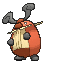
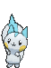
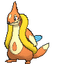
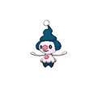
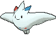
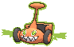

# Sinnoh Pokémon

---

## #387 Turtwig

**Location:** Route 104 North

**Ability 2:** Shell Armor

| Moves | Level |     | Cont. | Level |
| ----- | ----- | --- | ----- | ----- |
| Tackle | 1 |   | Leech Seed | 26 |
| Withdraw | 5 |   | Synthesis | 29 |
| Absorb | 8 |   | Body Slam | 32 |
| Razor Leaf | 11 |   | Crunch | 35 |
| Sand Tomb | 14 |   | Seed Bomb | 38 |
| Curse | 17 |   | Giga Drain | 41 |
| Bite | 20 |   | Leaf Storm | 44 |
| Mega Drain | 23 |   |   |   |

---

## #388 Grotle

**Location:** Evolve Turtwig (Lv. 18)

**Ability 2:** Shell Armor

| Moves | Level |     | Cont. | Level |
| ----- | ----- | --- | ----- | ----- |
| Tackle | 1 |   | Leech Seed | 29 |
| Withdraw | 5 |   | Synthesis | 33 |
| Absorb | 8 |   | Body Slam | 37 |
| Razor Leaf | 11 |   | Crunch | 41 |
| Sand Tomb | 14 |   | Seed Bomb | 45 |
| Curse | 17 |   | Giga Drain | 49 |
| Bite | 21 |   | Leaf Storm | 53 |
| Mega Drain | 25 |   |   |   |

---

## #389 Torterra

**Location:** Evolve Grotle (Lv. 32)

**Ability 2:** Shell Armor

| Moves | Level |     | Cont. | Level |
| ----- | ----- | --- | ----- | ----- |
| Wood Hammer | 1 |   | Leech Seed | 29 |
| Iron Head | 1 |   | Earthquake | 32 |
| Tackle | 1 |   | Synthesis | 34 |
| Withdraw | 5 |   | Body Slam | 39 |
| Absorb | 8 |   | Crunch | 44 |
| Razor Leaf | 11 |   | Seed Bomb | 49 |
| Sand Tomb | 14 |   | Giga Drain | 54 |
| Curse | 17 |   | Leaf Storm | 59 |
| Bite | 21 |   | Shell Smash | 64 |
| Mega Drain | 25 |   |   |   |

---

## #390 Chimchar

**Location:** Rusturf Tunnel

**Ability 2:** Iron Fist

| Moves | Level |     | Cont. | Level |
| ----- | ----- | --- | ----- | ----- |
| Scratch | 1 |   | Submission | 23 |
| Leer | 1 |   | Torment | 26 |
| Ember | 5 |   | Nasty Plot | 29 |
| Taunt | 8 |   | Facade | 32 |
| Fury Swipes | 11 |   | Fire Spin | 35 |
| Fake Out | 14 |   | Acrobatics | 38 |
| Flame Wheel | 17 |   | Slack Off | 41 |
| Uproar | 20 |   | Flamethrower | 44 |

---

## #391 Monferno

**Location:** Evolve Chimchar (Lv. 14)

**Ability 2:** Iron Fist

| Moves | Level |     | Cont. | Level |
| ----- | ----- | --- | ----- | ----- |
| Scratch | 1 |   | Submission | 27 |
| Leer | 1 |   | Torment | 31 |
| Ember | 5 |   | Close Combat | 35 |
| Taunt | 8 |   | Feint | 39 |
| Fury Swipes | 11 |   | Fire Spin | 43 |
| Mach Punch | 14 |   | Acrobatics | 47 |
| Fake Out | 15 |   | Slack Off | 51 |
| Flame Wheel | 19 |   | Flare Blitz | 55 |
| Uproar | 23 |   |   |   |

---

## #392 Infernape

**ocation:** Evolve Monferno (Lv. 36)

**Ability 2:** Iron Fist

| Moves | Level |     | Cont. | Level |
| ----- | ----- | --- | ----- | ----- |
| Flare Blitz | 1 |   | Flame Wheel | 19 |
| Fire Punch | 1 |   | Uproar | 23 |
| Thunder Punch | 1 |   | Submission | 27 |
| Scratch | 1 |   | Punishment | 31 |
| Leer | 1 |   | Close Combat | 35 |
| Ember | 5 |   | Feint | 40 |
| Taunt | 8 |   | Fire Spin | 45 |
| Fury Swipes | 11 |   | Acrobatics | 50 |
| Mach Punch | 14 |   | Calm Mind | 55 |
| Fake Out | 15 |   | Flare Blitz | 60 |

---

## #393 Piplup

**Location:** Route 103

**Ability 2:** Defiant

| Moves | Level |     | Cont. | Level |
| ----- | ----- | --- | ----- | ----- |
| Pound | 1 |   | Yawn | 23 |
| Growl | 1 |   | Fury Attack | 26 |
| Bubble | 5 |   | Brine | 29 |
| Water Sport | 8 |   | Drill Peck | 32 |
| Bubble Beam | 11 |   | Whirlpool | 35 |
| Peck | 14 |   | Mist | 38 |
| Icy Wind | 17 |   | Ice Beam | 41 |
| Bide | 20 |   | Hydro Pump | 44 |

---

## #394 Prinplup

**Location:** Evolve Piplup (Lv. 16)

**Ability 2:** Defiant

| Moves | Level |     | Cont. | Level |
| ----- | ----- | --- | ----- | ----- |
| Tackle | 1 |   | Yawn | 26 |
| Growl | 1 |   | Fury Attack | 30 |
| Bubble | 5 |   | Brine | 34 |
| Water Sport | 8 |   | Drill Peck | 38 |
| Bubble Beam | 11 |   | Whirlpool | 42 |
| Peck | 14 |   | Mist | 46 |
| Metal Claw | 16 |   | Ice Beam | 50 |
| Icy Wind | 18 |   | Hydro Pump | 54 |
| Bide | 22 |   |   |   |

---

## #395 Empoleon

**Location:** Evolve Prinplup (Lv. 36)

**Ability 2:** Defiant

| Moves | Level |     | Cont. | Level |
| ----- | ----- | --- | ----- | ----- |
| Flash Cannon | 1 |   | Yawn | 26 |
| Hydro Pump | 1 |   | Fury Attack | 30 |
| Tackle | 1 |   | Brine | 34 |
| Growl | 1 |   | Agility | 36 |
| Bubble | 5 |   | Drill Peck | 39 |
| Swords Dance | 8 |   | Whirlpool | 44 |
| Bubble Beam | 11 |   | Mist | 49 |
| Peck | 14 |   | Ice Beam | 54 |
| Metal Claw | 16 |   | Hydro Pump | 59 |
| Icy Wind | 18 |   | Flash Cannon | 64 |
| Swagger | 22 |   |   |   |

---

## #396 Starly

**Location:** Route 101

**Ability 2:** Reckless

| Moves | Level |     | Cont. | Level |
| ----- | ----- | --- | ----- | ----- |
| Tackle | 1 |   | Revenge | 20 |
| Growl | 1 |   | Aerial Ace | 23 |
| Quick Attack | 5 |   | Take Down | 26 |
| Wing Attack | 8 |   | Agility | 29 |
| Double Team | 11 |   | Final Gambit | 32 |
| Endeavor | 14 |   | Brave Bird | 35 |
| Whirlwind | 17 |   | Double-Edge | 38 |

---

## #397 Staravia

**Location:** Safari Zone

**Ability 2:** Reckless

| Moves | Level |     | Cont. | Level |
| ----- | ----- | --- | ----- | ----- |
| Tackle | 1 |   | Revenge | 22 |
| Growl | 1 |   | Aerial Ace | 26 |
| Quick Attack | 5 |   | Take Down | 30 |
| Wing Attack | 8 |   | Agility | 34 |
| Double Team | 11 |   | Final Gambit | 38 |
| Endeavor | 14 |   | Brave Bird | 42 |
| Whirlwind | 18 |   | Double-Edge | 46 |

---

## #398 Staraptor

**Location:** Soaring in the Sky

**Ability 2:** Reckless

| Moves | Level |     | Cont. | Level |
| ----- | ----- | --- | ----- | ----- |
| Tackle | 1 |   | Aerial Ace | 26 |
| Growl | 1 |   | Take Down | 30 |
| Quick Attack | 5 |   | Close Combat | 34 |
| Wing Attack | 8 |   | Agility | 35 |
| Double Team | 11 |   | Final Gambit | 40 |
| Endeavor | 14 |   | Brave Bird | 45 |
| Whirlwind | 18 |   | Double-Edge | 50 |
| Revenge | 22 |   |   |   |

---

## #399 Bidoof

**Location:** Route 101

| Moves | Level |     | Cont. | Level |
| ----- | ----- | --- | ----- | ----- |
| Tackle | 1 |   | Yawn | 23 |
| Growl | 5 |   | Take Down | 26 |
| Defense Curl | 8 |   | Amnesia | 29 |
| Headbutt | 11 |   | Super Fang | 32 |
| Rollout | 14 |   | Curse | 35 |
| Hyper Fang | 17 |   | Superpower | 38 |
| Aqua Tail | 20 |   | Double-Edge | 41 |

---

## #400 Bibarel

**Location:** Safari Zone

| Stat | Base | Change |
| ---- | ---- | ------ |
| HP | 79 | 90 |
| Attack | 85 | 95 |
| Defense | 60 | 65 |
| Speed | 71 | 75 |
| Total | 410 | 435 |

| Moves | Level |     | Cont. | Level |
| ----- | ----- | --- | ----- | ----- |
| Double-Edge | 1 |   | Aqua Tail | 22 |
| Rototiller | 1 |   | Yawn | 26 |
| Tackle | 1 |   | Take Down | 30 |
| Growl | 5 |   | Amnesia | 34 |
| Defense Curl | 8 |   | Super Fang | 38 |
| Headbutt | 11 |   | Curse | 42 |
| Rollout | 14 |   | Superpower | 46 |
| Water Gun | 15 |   | Double-Edge | 50 |
| Hyper Fang | 18 |   |   |   |

---

## #401 Kricketot

**Location:** Route 104 North

**Ability 2:** Run Away

| Moves | Level |     | Cont. | Level |
| ----- | ----- | --- | ----- | ----- |
| Growl | 1 |   | Bug Bite | 5 |
| Bide | 1 |   | Endeavor | 10 |
| Struggle Bug | 1 |   |   |   |

---

## #402 Kricketune

**Location:** Safari Zone

**Ability 2:** Technician

| Stat | Base | Change |
| ---- | ---- | ------ |
| HP | 77 | 80 |
| Attack | 85 | 110 |
| Defense | 51 | 65 |
| Sp. Defense | 51 | 65 |
| Total | 384 | 440 |

| Moves | Level |     | Cont. | Level |
| ----- | ----- | --- | ----- | ----- |
| Growl | 1 |   | Aerial Ace | 28 |
| Bide | 1 |   | Fell Stinger | 31 |
| Fury Cutter | 10 |   | Night Slash | 34 |
| Leech Life | 13 |   | Screech | 37 |
| Sing | 16 |   | Taunt | 40 |
| Slash | 19 |   | Sticky Web | 43 |
| X-Scissor | 22 |   | Bug Buzz | 46 |
| Focus Energy | 25 |   | Perish Song | 49 |

---

## #403 Shinx

**Location:** Route 116

| Moves | Level |     | Cont. | Level |
| ----- | ----- | --- | ----- | ----- |
| Tackle | 1 |   | Double Kick | 26 |
| Leer | 1 |   | Wild Charge | 29 |
| Charge | 5 |   | Crunch | 32 |
| Quick Attack | 8 |   | Swagger | 35 |
| Spark | 11 |   | Discharge | 38 |
| Baby-Doll Eyes | 14 |   | Scary Face | 41 |
| Bite | 17 |   | Sucker Punch | 44 |
| Thunder Fang | 20 |   | Volt Tackle | 47 |
| Roar | 23 |   |   |   |

---

## #404 Luxio

**Location:** Route 118

| Moves | Level |     | Cont. | Level |
| ----- | ----- | --- | ----- | ----- |
| Tackle | 1 |   | Double Kick | 30 |
| Leer | 1 |   | Wild Charge | 34 |
| Charge | 5 |   | Crunch | 38 |
| Quick Attack | 8 |   | Swagger | 42 |
| Spark | 11 |   | Discharge | 46 |
| Payback | 14 |   | Scary Face | 50 |
| Bite | 18 |   | Sucker Punch | 54 |
| Thunder Fang | 22 |   | Volt Tackle | 58 |
| Roar | 26 |   |   |   |

---

## #405 Luxray

**Location:** Evolve Luxio (Lv. 30)

**New TM/HMs:** Payback, Dark Pulse

**Type:** Electric >> Electric/Dark

| Moves | Level |     | Cont. | Level |
| ----- | ----- | --- | ----- | ----- |
| Electric Terrain | 1 |   | Thunder Fang | 22 |
| Volt Tackle | 1 |   | Roar | 26 |
| Sucker Punch | 1 |   | Night Slash | 30 |
| Ice Fang | 1 |   | Double Kick | 31 |
| Fire Fang | 1 |   | Wild Charge | 36 |
| Tackle | 1 |   | Crunch | 41 |
| Leer | 1 |   | Swagger | 46 |
| Charge | 5 |   | Discharge | 51 |
| Quick Attack | 8 |   | Scary Face | 56 |
| Spark | 11 |   | Sucker Punch | 61 |
| Payback | 14 |   | Volt Tackle | 66 |
| Bite | 18 |   | Electric Terrain | 71 |

---

## #406 Budew

**Location:** Route 104 North

**Base Happiness:** 70 >> 200

| Moves | Level |     | Cont. | Level |
| ----- | ----- | --- | ----- | ----- |
| Absorb | 1 |   | Stun Spore | 10 |
| Growth | 4 |   | Mega Drain | 13 |
| Water Sport | 7 |   | Worry Seed | 16 |

---

## #407 Roserade

**Location:** Evolve Roselia (Shiny Stone)

| Moves | Level |     | Cont. | Level |
| ----- | ----- | --- | ----- | ----- |
| Venom Drench | 1 |   | Magical Leaf | 1 |
| Grassy Terrain | 1 |   | Sweet Scent | 1 |
| Weather Ball | 1 |   | Venoshock | 22 |
| Poison Sting | 1 |   | Petal Dance | 37 |
| Mega Drain | 1 |   | Petal Blizzard | 47 |

---

## #408 Cranidos

**Location:** Seafloor Cavern, Revive Skull Fossil

**Ability 2:** Sheer Force

| Moves | Level |     | Cont. | Level |
| ----- | ----- | --- | ----- | ----- |
| Headbutt | 1 |   | Ancient Power | 30 |
| Leer | 1 |   | Iron Head | 34 |
| Focus Energy | 6 |   | Zen Headbutt | 38 |
| Pursuit | 10 |   | Thrash | 42 |
| Take Down | 14 |   | Crunch | 46 |
| Scary Face | 18 |   | Screech | 50 |
| Assurance | 22 |   | Head Smash | 54 |
| Chip Away | 26 |   |   |   |

---

## #409 Rampardos

**Location:** Seafloor Cavern

**Ability 2:** Sheer Force

| Moves | Level |     | Cont. | Level |
| ----- | ----- | --- | ----- | ----- |
| Head Smash | 1 |   | Chip Away | 26 |
| Fire Punch | 1 |   | Outrage | 30 |
| Thunder Punch | 1 |   | Ancient Power | 31 |
| Headbutt | 1 |   | Iron Head | 36 |
| Leer | 1 |   | Zen Headbutt | 41 |
| Focus Energy | 6 |   | Thrash | 46 |
| Pursuit | 10 |   | Crunch | 51 |
| Take Down | 14 |   | Screech | 56 |
| Scary Face | 18 |   | Head Smash | 61 |
| Assurance | 22 |   |   |   |

---

## #410 Shieldon

**Location:** Seafloor Cavern, Revive Armor Fossil

**Ability 2:** Soundproof

| Moves | Level |     | Cont. | Level |
| ----- | ----- | --- | ----- | ----- |
| Tackle | 1 |   | Curse | 30 |
| Protect | 1 |   | Stealth Rock | 34 |
| Taunt | 6 |   | Endure | 38 |
| Metal Sound | 10 |   | Metal Burst | 42 |
| Take Down | 14 |   | Iron Head | 46 |
| Iron Defense | 18 |   | Rock Blast | 50 |
| Swagger | 22 |   | Heavy Slam | 54 |
| Ancient Power | 26 |   |   |   |

---

## #411 Bastiodon

**Location:** Seafloor Cavern

**Ability 2:** Soundproof

| Moves | Level |     | Cont. | Level |
| ----- | ----- | --- | ----- | ----- |
| Magnet Rise | 1 |   | Avalanche | 30 |
| Tackle | 1 |   | Curse | 31 |
| Protect | 1 |   | Stealth Rock | 36 |
| Taunt | 6 |   | Endure | 41 |
| Metal Sound | 10 |   | Metal Burst | 46 |
| Take Down | 14 |   | Iron Head | 51 |
| Iron Defense | 18 |   | Rock Blast | 56 |
| Swagger | 22 |   | Heavy Slam | 61 |
| Ancient Power | 26 |   |   |   |

---

## #412 Burmy

**Location:** Route 104 North

**Ability 2:** Overcoat

| Moves | Level |     | Cont. | Level |
| ----- | ----- | --- | ----- | ----- |
| Protect | 1 |   | Electroweb | 1 |
| Tackle | 1 |   | Hidden Power | 15 |
| Bug Bite | 1 |   |   |   |

---

## #413 Wormadam

**Location:** Safari Zone

**Ability 2:** Overcoat

### Plant Forme

| Stat | Base | Change |
| ---- | ---- | ------ |
| HP | 60 | 80 |
| Attack | 59 | 50 |
| Defense | 85 | 100 |
| Sp. Attack | 79 | 90 |
| Sp. Defense | 105 | 110 |
| Speed | 36 | 30 |
| Total | 424 | 460 |

| Moves | Level |     | Cont. | Level |
| ----- | ----- | --- | ----- | ----- |
| Protect | 1 |   | Growth | 29 |
| Tackle | 1 |   | Psybeam | 32 |
| Bug Bite | 1 |   | Energy Ball | 35 |
| Electroweb | 1 |   | Bug Buzz | 38 |
| Hidden Power | 15 |   | Captivate | 41 |
| Confusion | 20 |   | Flail | 44 |
| Razor Leaf | 20 |   | Attract | 47 |
| Signal Beam | 23 |   | Psychic | 50 |
| Giga Drain | 26 |   | Leaf Storm | 53 |

### Sandy Forme

| Stat | Base | Change |
| ---- | ---- | ------ |
| HP | 60 | 80 |
| Attack | 79 | 90 |
| Defense | 105 | 110 |
| Sp. Attack | 59 | 50 |
| Sp. Defense | 85 | 100 |
| Speed | 36 | 30 |
| Total | 424 | 460 |

| Moves | Level |     | Cont. | Level |
| ----- | ----- | --- | ----- | ----- |
| Protect | 1 |   | Harden | 29 |
| Tackle | 1 |   | Psybeam | 32 |
| Bug Bite | 1 |   | Earthquake | 35 |
| Electroweb | 1 |   | Megahorn | 38 |
| Hidden Power | 15 |   | Captivate | 41 |
| Confusion | 20 |   | Flail | 44 |
| Rock Blast | 20 |   | Attract | 47 |
| Steamroller | 23 |   | Psychic | 50 |
| Bulldoze | 26 |   | Fissure | 53 |

### Trash Forme

| Stat | Base | Change |
| ---- | ---- | ------ |
| HP | 60 | 80 |
| Attack | 69 | 70 |
| Defense | 95 | 105 |
| Sp. Attack | 69 | 70 |
| Sp. Defense | 95 | 105 |
| Speed | 36 | 30 |
| Total | 424 | 460 |

| Moves | Level |     | Cont. | Level |
| ----- | ----- | --- | ----- | ----- |
| Protect | 1 |   | Metal Sound | 29 |
| Tackle | 1 |   | Psybeam | 32 |
| Bug Bite | 1 |   | Flash Cannon | 35 |
| Electroweb | 1 |   | Bug Buzz | 38 |
| Hidden Power | 15 |   | Captivate | 41 |
| Confusion | 20 |   | Flail | 44 |
| Mirror Shot | 20 |   | Attract | 47 |
| Signal Beam | 23 |   | Psychic | 50 |
| Gyro Ball | 26 |   | Iron Head | 53 |

---

## #414 Mothim

**Location:** Safari Zone

**Ability 2:** Tinted Lens

**New TM/HMs:** Fly

| Stat | Base | Change |
| ---- | ---- | ------ |
| HP | 70 | 80 |
| Attack | 94 | 100 |
| Sp. Attack | 94 | 100 |
| Speed | 66 | 80 |
| Total | 424 | 460 |

| Moves | Level |     | Cont. | Level |
| ----- | ----- | --- | ----- | ----- |
| Energy Ball | 1 |   | Air Cutter | 26 |
| Protect | 1 |   | Poison Powder | 29 |
| Tackle | 1 |   | Psybeam | 32 |
| Bug Bite | 1 |   | Air Slash | 35 |
| Electroweb | 1 |   | Bug Buzz | 38 |
| Hidden Power | 15 |   | Camouflage | 41 |
| Confusion | 20 |   | Acrobatics | 44 |
| Silver Wind | 20 |   | Quiver Dance | 47 |
| Gust | 20 |   | Psychic | 50 |
| Signal Beam | 23 |   | Hurricane | 53 |

---

## #415 Combee

**Location:** Route 104 North

**Ability 2:** Hustle

| Moves | Level |     | Cont. | Level |
| ----- | ----- | --- | ----- | ----- |
| Sweet Scent | 1 |   | Air Cutter | 15 |
| Gust | 1 |   | Bug Buzz | 20 |
| Bug Bite | 10 |   |   |   |

---

## #416 Vespiquen

**Location:** Route 104 North

**Ability 2:** Unnerve

**New TM/HMs:** Fly

| Moves | Level |     | Cont. | Level |
| ----- | ----- | --- | ----- | ----- |
| Fell Stinger | 1 |   | Defend Order | 21 |
| Destiny Bond | 1 |   | Heal Order | 21 |
| Sweet Scent | 1 |   | Power Gem | 25 |
| Gust | 1 |   | Slash | 29 |
| Poison Sting | 1 |   | Air Slash | 33 |
| Confuse Ray | 1 |   | Toxic | 37 |
| Fury Cutter | 5 |   | Captivate | 41 |
| Pursuit | 9 |   | Swagger | 45 |
| Fury Swipes | 13 |   | Destiny Bond | 49 |
| Air Cutter | 17 |   | Fell Stinger | 53 |
| Attack Order | 21 |   |   |   |

---

## #417 Pachirisu

**Location:** Route 118

**Ability 1:** Adaptability **

| Stat | Base | Change |
| ---- | ---- | ------ |
| HP | 60 | 70 |
| Attack | 45 | 60 |
| Defense | 70 | 90 |
| Sp. Attack | 45 | 60 |
| Total | 405 | 465 |

| Moves | Level |     | Cont. | Level |
| ----- | ----- | --- | ----- | ----- |
| Ion Deluge | 1 |   | Swift | 20 |
| Magnet Rise | 1 |   | Electro Ball | 23 |
| Helping Hand | 1 |   | Sweet Kiss | 26 |
| Growl | 1 |   | Thunder Wave | 29 |
| Bide | 1 |   | Super Fang | 32 |
| Charge | 1 |   | Discharge | 35 |
| Quick Attack | 5 |   | Rollout | 38 |
| Charm | 8 |   | Fake Tears | 41 |
| Spark | 11 |   | Last Resort | 44 |
| Endure | 14 |   | Hyper Fang | 47 |
| Nuzzle | 17 |   |   |   |

---

## #418 Buizel

**Location:** Route 103, Route 120, Scorched Slab

**Ability 2:** Water Veil

| Moves | Level |     | Cont. | Level |
| ----- | ----- | --- | ----- | ----- |
| Sonic Boom | 1 |   | Aqua Jet | 25 |
| Growl | 4 |   | Double Hit | 28 |
| Water Sport | 7 |   | Aqua Tail | 31 |
| Quick Attack | 10 |   | Whirlpool | 34 |
| Water Gun | 13 |   | Razor Wind | 37 |
| Pursuit | 16 |   | Agility | 40 |
| Swift | 19 |   | Hydro Pump | 43 |
| Headbutt | 22 |   |   |   |

---

## #419 Floatzel

**Location:** Route 103, Route 120, Scorched Slab, Victory Road

**Ability 2:** Water Veil

| Moves | Level |     | Cont. | Level |
| ----- | ----- | --- | ----- | ----- |
| Tail Slap | 1 |   | Headbutt | 22 |
| Ice Fang | 1 |   | Aqua Jet | 25 |
| Sonic Boom | 1 |   | Crunch | 26 |
| Growl | 4 |   | Double Hit | 29 |
| Water Sport | 7 |   | Aqua Tail | 33 |
| Quick Attack | 10 |   | Whirlpool | 37 |
| Water Gun | 13 |   | Razor Wind | 41 |
| Pursuit | 16 |   | Agility | 45 |
| Swift | 19 |   | Hydro Pump | 49 |

---

## #420 Cherubi

**Location:** Route 117

| Moves | Level |     | Cont. | Level |
| ----- | ----- | --- | ----- | ----- |
| Morning Sun | 1 |   | Petal Blizzard | 23 |
| Tackle | 1 |   | Worry Seed | 26 |
| Growth | 5 |   | Take Down | 29 |
| Leech Seed | 8 |   | Dazzling Gleam | 32 |
| Helping Hand | 11 |   | Energy Ball | 35 |
| Nature Power | 14 |   | Lucky Chant | 38 |
| Magical Leaf | 17 |   | Solar Beam | 41 |
| Sunny Day | 20 |   |   |   |

---

## #421 Cherrim

**Location:** Evolve Cherubi (Lv. 25)

### Normal Forme

| Stat | Base | Change |
| ---- | ---- | ------ |
| Sp. Attack | 87 | 90 |
| Sp. Defense | 78 | 80 |
| Total | 450 | 455 |

### Sunshine Forme

| Stat | Base | Change |
| ---- | ---- | ------ |
| Defense | 70 | 80 |
| Sp. Attack | 87 | 120 |
| Sp. Defense | 78 | 110 |
| Speed | 85 | 115 |
| Total | 450 | 555 |

| Moves | Level |     | Cont. | Level |
| ----- | ----- | --- | ----- | ----- |
| Morning Sun | 1 |   | Weather Ball | 25 |
| Tackle | 1 |   | Petal Dance | 25 |
| Growth | 5 |   | Worry Seed | 26 |
| Leech Seed | 8 |   | Take Down | 30 |
| Helping Hand | 11 |   | Dazzling Gleam | 34 |
| Nature Power | 14 |   | Energy Ball | 38 |
| Magical Leaf | 17 |   | Lucky Chant | 42 |
| Sunny Day | 20 |   | Solar Beam | 46 |
| Petal Blizzard | 23 |   |   |   |

---

## #422 Shellos

**Location:** Route 103

| Moves | Level |     | Cont. | Level |
| ----- | ----- | --- | ----- | ----- |
| Mud-Slap | 1 |   | Rain Dance | 21 |
| Mud Sport | 3 |   | Brine | 24 |
| Harden | 6 |   | Body Slam | 27 |
| Water Pulse | 9 |   | Muddy Water | 30 |
| Mud Bomb | 12 |   | Earth Power | 33 |
| Sludge | 15 |   | Recover | 36 |
| Hidden Power | 18 |   |   |   |

---

## #423 Gastrodon

**Location:** Safari Zone

| Moves | Level |     | Cont. | Level |
| ----- | ----- | --- | ----- | ----- |
| Mud-Slap | 1 |   | Rain Dance | 21 |
| Mud Sport | 3 |   | Brine | 24 |
| Harden | 6 |   | Body Slam | 27 |
| Water Pulse | 9 |   | Muddy Water | 31 |
| Mud Bomb | 12 |   | Earth Power | 36 |
| Sludge | 15 |   | Recover | 41 |
| Hidden Power | 18 |   | Sludge Wave | 46 |

---

## #424 Ambipom

**Location:** Safari Zone

| Moves | Level |     | Cont. | Level |
| ----- | ----- | --- | ----- | ----- |
| Last Resort | 1 |   | Knock Off | 23 |
| Seed Bomb | 1 |   | Screech | 25 |
| Gunk Shot | 1 |   | Agility | 27 |
| Scratch | 1 |   | Acrobatics | 29 |
| Tail Whip | 1 |   | Fake Out | 30 |
| Sand Attack | 4 |   | Double Hit | 32 |
| Astonish | 8 |   | Fling | 35 |
| Baton Pass | 11 |   | Nasty Plot | 38 |
| Tickle | 14 |   | Bounce | 42 |
| Fury Swipes | 17 |   | Last Resort | 45 |
| Swift | 20 |   |   |   |

---

## #425 Drifloon

**Location:** Route 110

| Moves | Level |     | Cont. | Level |
| ----- | ----- | --- | ----- | ----- |
| Constrict | 1 |   | Clear Smog | 27 |
| Minimize | 1 |   | Stockpile | 30 |
| Astonish | 3 |   | Swallow | 30 |
| Gust | 6 |   | Spit Up | 30 |
| Focus Energy | 9 |   | Shadow Ball | 33 |
| Payback | 12 |   | Hypnosis | 36 |
| Ominous Wind | 15 |   | Amnesia | 39 |
| Air Cutter | 18 |   | Baton Pass | 42 |
| Hex | 21 |   | Explosion | 45 |
| Acrobatics | 24 |   |   |   |

---

## #426 Drifblim

**Location:** Route 120

| Moves | Level |     | Cont. | Level |
| ----- | ----- | --- | ----- | ----- |
| Hurricane | 1 |   | Acrobatics | 24 |
| Phantom Force | 1 |   | Clear Smog | 27 |
| Weather Ball | 1 |   | Stockpile | 31 |
| Icy Wind | 1 |   | Swallow | 31 |
| Constrict | 1 |   | Spit Up | 31 |
| Minimize | 1 |   | Shadow Ball | 35 |
| Astonish | 3 |   | Hypnosis | 39 |
| Gust | 6 |   | Amnesia | 43 |
| Focus Energy | 9 |   | Baton Pass | 47 |
| Payback | 12 |   | Explosion | 51 |
| Ominous Wind | 15 |   | Phantom Force | 55 |
| Air Cutter | 18 |   | Hurricane | 59 |
| Hex | 21 |   |   |   |

---

## #427 Buneary

**Location:** Route 104 North

**Base Happiness:** 0 >> 140

| Moves | Level |     | Cont. | Level |
| ----- | ----- | --- | ----- | ----- |
| Defense Curl | 1 |   | Baton Pass | 20 |
| Splash | 1 |   | Dizzy Punch | 23 |
| Pound | 1 |   | Agility | 26 |
| Foresight | 1 |   | Bounce | 29 |
| Endure | 5 |   | After You | 32 |
| Baby-Doll Eyes | 8 |   | Charm | 35 |
| Frustration | 11 |   | Fake Out | 38 |
| Quick Attack | 14 |   | Entrainment | 41 |
| Jump Kick | 17 |   | Healing Wish | 44 |

---

## #428 Lopunny

**Location:** Evolve Buneary (Happiness)

| Moves | Level |     | Cont. | Level |
| ----- | ----- | --- | ----- | ----- |
| High Jump Kick | 1 |   | Quick Attack | 14 |
| Fire Punch | 1 |   | Jump Kick | 17 |
| Ice Punch | 1 |   | Baton Pass | 20 |
| Thunder Punch | 1 |   | Dizzy Punch | 23 |
| Bounce | 1 |   | Agility | 26 |
| Rototiller | 1 |   | Bounce | 29 |
| Mirror Coat | 1 |   | After You | 32 |
| Magic Coat | 1 |   | Charm | 35 |
| Defense Curl | 1 |   | Fake Out | 38 |
| Pound | 1 |   | Entrainment | 41 |
| Foresight | 1 |   | Healing Wish | 44 |
| Endure | 5 |   | High Jump Kick | 47 |
| Return | 11 |   |   |   |

---

## #429 Mismagius

**Location:** Mt. Pyre

**Type:** Ghost >> Ghost/Fairy

| Moves | Level |     | Cont. | Level |
| ----- | ----- | --- | ----- | ----- |
| Mystical Fire | 1 |   | Moonblast | 1 |
| Power Gem | 1 |   | Growl | 1 |
| Phantom Force | 1 |   | Psywave | 1 |
| Lucky Chant | 1 |   | Spite | 1 |
| Magical Leaf | 1 |   | Astonish | 1 |
| Shadow Ball | 1 |   |   |   |

---

## #430 Honchkrow

**Location:** Soaring in the Sky

| Moves | Level |     | Cont. | Level |
| ----- | ----- | --- | ----- | ----- |
| Night Slash | 1 |   | Drill Peck | 33 |
| Sucker Punch | 1 |   | Nasty Plot | 39 |
| Astonish | 1 |   | Foul Play | 45 |
| Pursuit | 1 |   | Night Slash | 51 |
| Haze | 1 |   | Brave Bird | 57 |
| Wing Attack | 1 |   | Quash | 63 |
| Swagger | 27 |   | Dark Pulse | 69 |

---

## #431 Glameow

**Location:** Jagged Pass

**Evolution Level:** 38 >> 33

| Moves | Level |     | Cont. | Level |
| ----- | ----- | --- | ----- | ----- |
| Fake Out | 1 |   | Covet | 25 |
| Scratch | 1 |   | Assist | 28 |
| Growl | 4 |   | Slash | 31 |
| Bite | 7 |   | Sucker Punch | 34 |
| Hypnosis | 10 |   | Captivate | 37 |
| Feint Attack | 13 |   | Attract | 40 |
| Fury Swipes | 16 |   | Foul Play | 43 |
| Knock Off | 19 |   | Hone Claws | 46 |
| Charm | 22 |   | Play Rough | 49 |

---

## #432 Purugly

**Location:** Route 120

| Moves | Level |     | Cont. | Level |
| ----- | ----- | --- | ----- | ----- |
| Fake Out | 1 |   | Assist | 28 |
| Scratch | 1 |   | Slash | 31 |
| Growl | 4 |   | Swagger | 33 |
| Bite | 7 |   | Body Slam | 35 |
| Hypnosis | 10 |   | Captivate | 39 |
| Feint Attack | 13 |   | Attract | 43 |
| Fury Swipes | 16 |   | Foul Play | 47 |
| Knock Off | 19 |   | Hone Claws | 51 |
| Charm | 22 |   | Play Rough | 55 |
| Covet | 25 |   |   |   |

---

## #433 Chingling

**Location:** Mt. Pyre

**Base Happiness:** 70 >> 200

| Moves | Level |     | Cont. | Level |
| ----- | ----- | --- | ----- | ----- |
| Wrap | 1 |   | Yawn | 13 |
| Growl | 4 |   | Last Resort | 16 |
| Astonish | 7 |   | Entrainment | 19 |
| Confusion | 10 |   | Uproar | 32 |

---

## #434 Stunky

**Location:** Jagged Pass

| Moves | Level |     | Cont. | Level |
| ----- | ----- | --- | ----- | ----- |
| Scratch | 1 |   | Night Slash | 19 |
| Focus Energy | 1 |   | Toxic | 22 |
| Poison Gas | 1 |   | Acid Spray | 25 |
| Screech | 4 |   | Poison Jab | 28 |
| Fury Swipes | 7 |   | Crunch | 31 |
| Smokescreen | 10 |   | Sucker Punch | 34 |
| Feint | 13 |   | Memento | 37 |
| Flame Burst | 16 |   | Belch | 40 |
| Slash | 19 |   | Explosion | 43 |

---

## #435 Skuntank

**Location:** Route 120

| Moves | Level |     | Cont. | Level |
| ----- | ----- | --- | ----- | ----- |
| Play Rough | 1 |   | Night Slash | 19 |
| Iron Tail | 1 |   | Toxic | 22 |
| Scratch | 1 |   | Acid Spray | 25 |
| Focus Energy | 1 |   | Poison Jab | 28 |
| Poison Gas | 1 |   | Crunch | 31 |
| Screech | 4 |   | Flamethrower | 34 |
| Fury Swipes | 7 |   | Sucker Punch | 35 |
| Smokescreen | 10 |   | Memento | 39 |
| Feint | 13 |   | Belch | 43 |
| Flame Burst | 16 |   | Explosion | 47 |
| Slash | 19 |   | Play Rough | 51 |

---

## #436 Bronzor

**Location:** Route 113, Mt. Pyre

| Moves | Level |     | Cont. | Level |
| ----- | ----- | --- | ----- | ----- |
| Tackle | 1 |   | Extrasensory | 24 |
| Confusion | 1 |   | Future Sight | 27 |
| Imprison | 6 |   | Feint Attack | 30 |
| Confuse Ray | 9 |   | Metal Sound | 33 |
| Psywave | 12 |   | Payback | 36 |
| Hypnosis | 15 |   | Heal Block | 39 |
| Gyro Ball | 18 |   | Heavy Slam | 42 |
| Iron Defense | 21 |   | Gravity | 45 |

---

## #437 Bronzong

**Location:** Mt. Pyre

**New TM/HMs:** Fly

| Moves | Level |     | Cont. | Level |
| ----- | ----- | --- | ----- | ----- |
| Sunny Day | 1 |   | Extrasensory | 24 |
| Rain Dance | 1 |   | Future Sight | 27 |
| Tackle | 1 |   | Feint Attack | 30 |
| Confusion | 1 |   | Block | 33 |
| Imprison | 6 |   | Metal Sound | 34 |
| Confuse Ray | 9 |   | Payback | 38 |
| Psywave | 12 |   | Heal Block | 42 |
| Hypnosis | 15 |   | Heavy Slam | 46 |
| Gyro Ball | 18 |   | Gravity | 50 |
| Iron Defense | 21 |   |   |   |

---

## #438 Bonsly

**Location:** Route 117

| Moves | Level |     | Cont. | Level |
| ----- | ----- | --- | ----- | ----- |
| Fake Tears | 1 |   | Rock Tomb | 22 |
| Copycat | 1 |   | Block | 26 |
| Flail | 5 |   | Rock Slide | 29 |
| Low Kick | 8 |   | Counter | 33 |
| Rock Throw | 12 |   | Sucker Punch | 36 |
| Mimic | 15 |   | Double-Edge | 40 |
| Feint Attack | 19 |   |   |   |

---

## #439 Mime Jr.

**Location:** Route 117

| Moves | Level |     | Cont. | Level |
| ----- | ----- | --- | ----- | ----- |
| Tackle | 1 |   | Reflect | 22 |
| Barrier | 1 |   | Psybeam | 25 |
| Confusion | 1 |   | Substitute | 29 |
| Copycat | 4 |   | Recycle | 32 |
| Meditate | 8 |   | Trick | 36 |
| Double Slap | 11 |   | Psychic | 39 |
| Mimic | 15 |   | Role Play | 43 |
| Encore | 18 |   | Baton Pass | 46 |
| Light Screen | 22 |   | Safeguard | 50 |

---

## #440 Happiny

**Location:** Route 114

| Moves | Level |     | Cont. | Level |
| ----- | ----- | --- | ----- | ----- |
| Pound | 1 |   | Refresh | 9 |
| Charm | 1 |   | Sweet Kiss | 12 |
| Copycat | 5 |   |   |   |

---

## #441 Chatot

**Location:** Route 118

**Ability 1:** Gale Wings **

**Effort Values:** 1 Atk >> 1 Sp. Atk, 1 Spd

| Stat | Base | Change |
| ---- | ---- | ------ |
| HP | 76 | 80 |
| Defense | 45 | 55 |
| Sp. Attack | 92 | 110 |
| Sp. Defense | 42 | 55 |
| Speed | 91 | 110 |
| Total | 411 | 475 |

| Moves | Level |     | Cont. | Level |
| ----- | ----- | --- | ----- | ----- |
| Boomburst | 1 |   | Taunt | 20 |
| Hurricane | 1 |   | Round | 23 |
| Heat Wave | 1 |   | Mimic | 26 |
| Chatter | 1 |   | Chatter | 29 |
| Confide | 1 |   | Roost | 32 |
| Taunt | 1 |   | Uproar | 35 |
| Peck | 1 |   | Synchronoise | 38 |
| Growl | 5 |   | Hyper Voice | 41 |
| Mirror Move | 8 |   | Feather Dance | 44 |
| Sing | 11 |   | Nasty Plot | 47 |
| Fury Attack | 14 |   | Hurricane | 50 |
| Echoed Voice | 17 |   | Boomburst | 53 |

---

## #442 Spiritomb

**Location:** Sea Mauville, Sky Pillar

**Ability 2:** Infiltrator

| Moves | Level |     | Cont. | Level |
| ----- | ----- | --- | ----- | ----- |
| Curse | 1 |   | Dream Eater | 19 |
| Pursuit | 1 |   | Ominous Wind | 25 |
| Confuse Ray | 1 |   | Sucker Punch | 31 |
| Spite | 1 |   | Nasty Plot | 37 |
| Shadow Sneak | 1 |   | Memento | 43 |
| Feint Attack | 7 |   | Dark Pulse | 49 |
| Hypnosis | 13 |   | Pain Split | 55 |

---

## #443 Gible

**Location:** Route 111

**Ability 2:** Rough Skin

**Held Item:** Skull Fossil (50%)

| Moves | Level |     | Cont. | Level |
| ----- | ----- | --- | ----- | ----- |
| Tackle | 1 |   | Body Slam | 27 |
| Sand-Attack | 4 |   | Dig | 31 |
| Dragon Rage | 7 |   | Dragon Rush | 35 |
| Sandstorm | 11 |   | Iron Head | 39 |
| Take Down | 15 |   | Thrash | 43 |
| Sand Tomb | 19 |   | Outrage | 47 |
| Slash | 23 |   |   |   |

---

## #444 Gabite

**Location:** Victory Road

**Ability 2:** Rough Skin

| Moves | Level |     | Cont. | Level |
| ----- | ----- | --- | ----- | ----- |
| Tackle | 1 |   | Dual Chop | 24 |
| Sand-Attack | 4 |   | Body Slam | 28 |
| Dragon Rage | 7 |   | Dig | 33 |
| Sandstorm | 11 |   | Dragon Rush | 38 |
| Take Down | 15 |   | Iron Head | 43 |
| Sand Tomb | 19 |   | Thrash | 48 |
| Slash | 23 |   | Outrage | 53 |

---

## #445 Garchomp

**Location:** Evolve Gabite (Lv. 48)

**Ability 2:** Rough Skin

| Moves | Level |     | Cont. | Level |
| ----- | ----- | --- | ----- | ----- |
| Fire Fang | 1 |   | Dual Chop | 24 |
| Tackle | 1 |   | Body Slam | 28 |
| Sand-Attack | 4 |   | Dig | 33 |
| Dragon Rage | 7 |   | Dragon Rush | 38 |
| Sandstorm | 11 |   | Iron Head | 43 |
| Take Down | 15 |   | Thrash | 50 |
| Sand Tomb | 19 |   | Outrage | 57 |
| Slash | 23 |   | Extreme Speed | 64 |

---

## #446 Munchlax

**Location:** Route 113

| Moves | Level |     | Cont. | Level |
| ----- | ----- | --- | ----- | ----- |
| Last Resort | 1 |   | Stockpile | 24 |
| Recycle | 1 |   | Swallow | 24 |
| Metronome | 1 |   | Rollout | 28 |
| Odor Sleuth | 1 |   | Fling | 32 |
| Tackle | 1 |   | Belly Drum | 36 |
| Defense Curl | 1 |   | Natural Gift | 40 |
| Amnesia | 4 |   | Zen Headbutt | 44 |
| Lick | 8 |   | Snatch | 48 |
| Chip Away | 12 |   | Seed Bomb | 52 |
| Screech | 16 |   | Double-Edge | 56 |
| Body Slam | 20 |   | Last Resort | 60 |

---

## #447 Riolu

**Location:** Route 103

| Moves | Level |     | Cont. | Level |
| ----- | ----- | --- | ----- | ----- |
| Foresight | 1 |   | Sky Uppercut | 22 |
| Quick Attack | 1 |   | Screech | 26 |
| Endure | 1 |   | Reversal | 30 |
| Counter | 6 |   | Blaze Kick | 34 |
| Feint | 10 |   | Nasty Plot | 38 |
| Force Palm | 14 |   | High Jump Kick | 42 |
| Copycat | 18 |   | Final Gambit | 46 |

---

## #448 Lucario

**Location:** Evolve Riolu (Happiness @ Day)

| Moves | Level |     | Cont. | Level |
| ----- | ----- | --- | ----- | ----- |
| Extreme Speed | 1 |   | Metal Sound | 26 |
| Dragon Pulse | 1 |   | Bone Rush | 30 |
| Bullet Punch | 1 |   | Blaze Kick | 34 |
| Foresight | 1 |   | Aura Sphere | 38 |
| Quick Attack | 1 |   | Quick Guard | 42 |
| Detect | 1 |   | Me First | 46 |
| Metal Claw | 1 |   | Calm Mind | 50 |
| Counter | 6 |   | Heal Pulse | 54 |
| Feint | 10 |   | Close Combat | 58 |
| Power-Up Punch | 14 |   | Dragon Pulse | 62 |
| Swords Dance | 18 |   | Extreme Speed | 66 |
| Sky Uppercut | 22 |   |   |   |

---

## #449 Hippopotas

**Location:** Route 111

**Ability 2:** Sand Force

**Held Item:** Armor Fossil (50%)

| Moves | Level |     | Cont. | Level |
| ----- | ----- | --- | ----- | ----- |
| Tackle | 1 |   | Slack Off | 25 |
| Sand-Attack | 1 |   | Bulldoze | 28 |
| Bite | 7 |   | Crunch | 31 |
| Yawn | 10 |   | Rock Slide | 34 |
| Take Down | 13 |   | Earthquake | 37 |
| Dig | 16 |   | Double-Edge | 40 |
| Curse | 19 |   | Fissure | 43 |
| Sand Tomb | 22 |   | Superpower | 46 |

---

## #450 Hippowdon

**Location:** Evolve Hippopotas (Lv. 34)

**Ability 2:** Sand Force

| Moves | Level |     | Cont. | Level |
| ----- | ----- | --- | ----- | ----- |
| Ice Fang | 1 |   | Sand Tomb | 22 |
| Fire Fang | 1 |   | Slack Off | 25 |
| Thunder Fang | 1 |   | Bulldoze | 28 |
| Tackle | 1 |   | Crunch | 31 |
| Sand-Attack | 1 |   | Rock Slide | 35 |
| Bite | 7 |   | Earthquake | 39 |
| Yawn | 10 |   | Double-Edge | 43 |
| Take Down | 13 |   | Fissure | 47 |
| Dig | 16 |   | Superpower | 51 |
| Curse | 19 |   |   |   |

---

## #451 Skorupi

**Location:** Route 114

**Evolution Level:** 40 >> 37

| Moves | Level |     | Cont. | Level |
| ----- | ----- | --- | ----- | ----- |
| Bite | 1 |   | Poison Tail | 26 |
| Poison Sting | 1 |   | Night Slash | 29 |
| Leer | 1 |   | Cross Poison | 32 |
| Knock Off | 5 |   | X-Scissor | 35 |
| Pin Missile | 8 |   | Hone Claws | 38 |
| Acupressure | 11 |   | Crunch | 41 |
| Pursuit | 14 |   | Toxic Spikes | 44 |
| Bug Bite | 17 |   | Scary Face | 47 |
| Poison Fang | 20 |   | Fell Stinger | 50 |
| Venoshock | 23 |   |   |   |

---

## #452 Drapion

**Location:** Route 119

| Moves | Level |     | Cont. | Level |
| ----- | ----- | --- | ----- | ----- |
| Aqua Tail | 1 |   | Poison Fang | 20 |
| Thunder Fang | 1 |   | Venoshock | 23 |
| Ice Fang | 1 |   | Poison Tail | 26 |
| Fire Fang | 1 |   | Night Slash | 29 |
| Bite | 1 |   | Cross Poison | 32 |
| Poison Sting | 1 |   | X-Scissor | 35 |
| Leer | 1 |   | Hone Claws | 39 |
| Knock Off | 5 |   | Crunch | 43 |
| Pin Missile | 8 |   | Toxic Spikes | 47 |
| Acupressure | 11 |   | Scary Face | 51 |
| Pursuit | 14 |   | Fell Stinger | 55 |
| Bug Bite | 17 |   |   |   |

---

## #453 Croagunk

**Location:** Jagged Pass, Safari Zone

**Evolution Level:** 37 >> 35

| Moves | Level |     | Cont. | Level |
| ----- | ----- | --- | ----- | ----- |
| Astonish | 1 |   | Fake Out | 30 |
| Mud-Slap | 3 |   | Drain Punch | 33 |
| Poison Sting | 6 |   | Venoshock | 36 |
| Taunt | 9 |   | Poison Jab | 39 |
| Pursuit | 12 |   | Nasty Plot | 42 |
| Feint Attack | 15 |   | Sludge Bomb | 45 |
| Revenge | 18 |   | Cross Chop | 48 |
| Swagger | 21 |   | Belch | 51 |
| Mud Bomb | 24 |   | Flatter | 54 |
| Sucker Punch | 27 |   | Gunk Shot | 57 |

---

## #454 Toxicroak

**Location:** Safari Zone

| Moves | Level |     | Cont. | Level |
| ----- | ----- | --- | ----- | ----- |
| Gunk Shot | 1 |   | Sucker Punch | 27 |
| Ice Punch | 1 |   | Fake Out | 30 |
| Thunder Punch | 1 |   | Drain Punch | 33 |
| Astonish | 1 |   | Venoshock | 37 |
| Mud-Slap | 3 |   | Poison Jab | 41 |
| Poison Sting | 6 |   | Nasty Plot | 45 |
| Taunt | 9 |   | Sludge Bomb | 49 |
| Pursuit | 12 |   | Cross Chop | 53 |
| Feint Attack | 15 |   | Belch | 57 |
| Revenge | 18 |   | Flatter | 61 |
| Swagger | 21 |   | Gunk Shot | 65 |
| Mud Bomb | 24 |   |   |   |

---

## #455 Carnivine

**Location:** Route 119

| Moves | Level |     | Cont. | Level |
| ----- | ----- | --- | ----- | ----- |
| Bind | 1 |   | Sleep Powder | 28 |
| Growth | 1 |   | Leaf Tornado | 32 |
| Bite | 4 |   | Seed Bomb | 36 |
| Vine Whip | 8 |   | Stockpile | 40 |
| Sweet Scent | 12 |   | Spit Up | 40 |
| Bug Bite | 16 |   | Swallow | 40 |
| Ingrain | 20 |   | Crunch | 44 |
| Feint Attack | 24 |   | Wring Out | 48 |
| Stun Spore | 28 |   | Power Whip | 52 |

---

## #456 Finneon

**Location:** Route 108, Route 109, Route 122, Safari Zone

| Moves | Level |     | Cont. | Level |
| ----- | ----- | --- | ----- | ----- |
| Pound | 1 |   | Aurora Beam | 27 |
| Water Gun | 6 |   | Captivate | 30 |
| Attract | 9 |   | Safeguard | 33 |
| Rain Dance | 12 |   | Aqua Ring | 36 |
| Water Pulse | 15 |   | Whirlpool | 39 |
| Gust | 18 |   | U-turn | 42 |
| Sweet Kiss | 21 |   | Bounce | 45 |
| Silver Wind | 24 |   | Soak | 48 |

---

## #457 Lumineon

**Location:** Route 108, Route 109, Route 122, Safari Zone

| Stat | Base | Change |
| ---- | ---- | ------ |
| HP | 69 | 75 |
| Attack | 69 | 80 |
| Defense | 76 | 85 |
| Sp. Attack | 69 | 80 |
| Sp. Defense | 86 | 90 |
| Speed | 91 | 95 |
| Total | 460 | 505 |

| Moves | Level |     | Cont. | Level |
| ----- | ----- | --- | ----- | ----- |
| Soak | 1 |   | Sweet Kiss | 21 |
| Signal Beam | 1 |   | Silver Wind | 24 |
| Psybeam | 1 |   | Aurora Beam | 27 |
| Air Cutter | 1 |   | Captivate | 30 |
| Ominous Wind | 1 |   | Safeguard | 34 |
| Pound | 1 |   | Aqua Ring | 38 |
| Water Gun | 6 |   | Whirlpool | 42 |
| Attract | 9 |   | U-turn | 46 |
| Rain Dance | 12 |   | Bounce | 50 |
| Water Pulse | 15 |   | Soak | 54 |
| Gust | 18 |   |   |   |

---

## #458 Mantyke

**Location:** Route 108, Route 124

| Moves | Level |     | Cont. | Level |
| ----- | ----- | --- | ----- | ----- |
| Tackle | 1 |   | Wide Guard | 23 |
| Bubble | 1 |   | Take Down | 27 |
| Supersonic | 3 |   | Agility | 32 |
| Bubble Beam | 7 |   | Air Slash | 36 |
| Confuse Ray | 11 |   | Aqua Ring | 39 |
| Wing Attack | 14 |   | Bounce | 46 |
| Headbutt | 16 |   | Hydro Pump | 49 |
| Water Pulse | 19 |   | Mirror Coat | 52 |

---

## #459 Snover

**Location:** Shoal Cave

**Ability 2:** Soundproof

| Moves | Level |     | Cont. | Level |
| ----- | ----- | --- | ----- | ----- |
| Powder Snow | 1 |   | Avalanche | 28 |
| Leer | 1 |   | Ingrain | 32 |
| Razor Leaf | 4 |   | Wood Hammer | 36 |
| Icy Wind | 8 |   | Frost Breath | 40 |
| Grass Whistle | 12 |   | Seed Bomb | 44 |
| Swagger | 16 |   | Blizzard | 48 |
| Mist | 20 |   | Sheer Cold | 52 |
| Ice Shard | 24 |   |   |   |

---

## #460 Abomasnow

**Ability 2:** Soundproof

| Moves | Level |     | Cont. | Level |
| ----- | ----- | --- | ----- | ----- |
| Ice Punch | 1 |   | Ice Shard | 24 |
| Powder Snow | 1 |   | Avalanche | 28 |
| Leer | 1 |   | Ingrain | 32 |
| Razor Leaf | 4 |   | Wood Hammer | 36 |
| Icy Wind | 8 |   | Frost Breath | 40 |
| Grass Whistle | 12 |   | Seed Bomb | 44 |
| Swagger | 16 |   | Blizzard | 48 |
| Mist | 20 |   | Sheer Cold | 52 |

---

## #461 Weavile

**Location:** Shoal Cave

**Ability 2:** Technician **

**Held Items:** Grip Claw (50%), Quick Claw (5%)

| Moves | Level |     | Cont. | Level |
| ----- | ----- | --- | ----- | ----- |
| Icicle Crash | 1 |   | Nasty Plot | 18 |
| Embargo | 1 |   | Metal Claw | 21 |
| Revenge | 1 |   | Hone Claws | 24 |
| Assurance | 1 |   | Fling | 27 |
| Scratch | 1 |   | Screech | 30 |
| Leer | 1 |   | Low Kick | 33 |
| Taunt | 1 |   | Night Slash | 36 |
| Icy Wind | 1 |   | Snatch | 39 |
| Quick Attack | 6 |   | Dark Pulse | 42 |
| Feint Attack | 9 |   | Punishment | 45 |
| Ice Shard | 12 |   | Icicle Crash | 48 |
| Fury Swipes | 15 |   | Crunch | 51 |

---

## #462 Magnezone

**Location:** Evolve Magneton (New Mauville)

| Moves | Level |     | Cont. | Level |
| ----- | ----- | --- | ----- | ----- |
| Zap Cannon | 1 |   | Spark | 19 |
| Magnetic Flux | 1 |   | Mirror Shot | 23 |
| Mirror Coat | 1 |   | Metal Sound | 25 |
| Barrier | 1 |   | Electro Ball | 29 |
| Electric Terrain | 1 |   | Flash Cannon | 33 |
| Tackle | 1 |   | Screech | 39 |
| Supersonic | 5 |   | Discharge | 43 |
| Thunder Shock | 7 |   | Lock-On | 49 |
| Sonic Boom | 11 |   | Magnet Rise | 53 |
| Thunder Wave | 15 |   | Gyro Ball | 59 |
| Magnet Bomb | 17 |   | Zap Cannon | 63 |

---

## #463 Lickilicky

**Location:** Route 114

| Moves | Level |     | Cont. | Level |
| ----- | ----- | --- | ----- | ----- |
| Lick | 1 |   | Rollout | 31 |
| Supersonic | 4 |   | Chip Away | 34 |
| Defense Curl | 7 |   | Body Slam | 37 |
| Wrap | 10 |   | Me First | 40 |
| Knock Off | 13 |   | Muddy Water | 43 |
| Disable | 16 |   | Power Whip | 46 |
| Stomp | 19 |   | Screech | 49 |
| Magnitude | 22 |   | Refresh | 52 |
| Zen Headbutt | 25 |   | Wring Out | 55 |
| Slam | 28 |   |   |   |

---

## #464 Rhyperior

**Location:** Evolve Rhydon (Protector)

| Moves | Level |     | Cont. | Level |
| ----- | ----- | --- | ----- | ----- |
| Rock Wrecker | 1 |   | Stomp | 17 |
| Horn Drill | 1 |   | Magnitude | 21 |
| Fire Fang | 1 |   | Chip Away | 25 |
| Thunder Fang | 1 |   | Rock Blast | 29 |
| Ice Fang | 1 |   | Drill Run | 33 |
| Poison Jab | 1 |   | Hammer Arm | 37 |
| Horn Attack | 1 |   | Take Down | 39 |
| Tail Whip | 1 |   | Stone Edge | 45 |
| Fury Attack | 1 |   | Earthquake | 51 |
| Scary Face | 5 |   | Megahorn | 57 |
| Smack Down | 9 |   | Horn Drill | 63 |
| Bulldoze | 13 |   | Rock Wrecker | 69 |

---

## #465 Tangrowth

**Location:** Evolve Tangela (Level w/Ancient Power)

| Moves | Level |     | Cont. | Level |
| ----- | ----- | --- | ----- | ----- |
| Block | 1 |   | Stun Spore | 30 |
| Ingrain | 1 |   | Giga Drain | 33 |
| Constrict | 1 |   | Ancient Power | 36 |
| Sleep Powder | 4 |   | Natural Gift | 39 |
| Vine Whip | 7 |   | Slam | 43 |
| Absorb | 10 |   | Tickle | 46 |
| Poison Powder | 14 |   | Wring Out | 49 |
| Bind | 17 |   | Grassy Terrain | 50 |
| Growth | 20 |   | Power Whip | 53 |
| Mega Drain | 23 |   | Block | 56 |
| Knock Off | 27 |   |   |   |

---

## #466 Electivire

**Location:** Evolve Electabuzz (Electirizer)

**Ability 2:** Vital Spirit

**Type:** Electric >> Electric/Fighting

| Moves | Level |     | Cont. | Level |
| ----- | ----- | --- | ----- | ----- |
| Volt Tackle | 1 |   | Electro Ball | 20 |
| Electric Terrain | 1 |   | Light Screen | 23 |
| Ion Deluge | 1 |   | Brick Break | 26 |
| Hammer Arm | 1 |   | Thunder Punch | 29 |
| Fire Punch | 1 |   | Discharge | 33 |
| Ice Punch | 1 |   | Screech | 37 |
| Quick Attack | 1 |   | Thunderbolt | 41 |
| Leer | 1 |   | Cross Chop | 45 |
| Thunder Shock | 5 |   | Wild Charge | 49 |
| Low Kick | 8 |   | Thunder | 53 |
| Swift | 11 |   | Giga Impact | 57 |
| Shock Wave | 14 |   | Electric Terrain | 61 |
| Thunder Wave | 17 |   | Volt Tackle | 65 |

---

## #467 Magmortar

**Location:** Evolve Magmar (Magmarizer)

**Ability 2:** Vital Spirit

| Moves | Level |     | Cont. | Level |
| ----- | ----- | --- | ----- | ----- |
| Thunder Punch | 1 |   | Brick Break | 26 |
| Smog | 1 |   | Fire Punch | 29 |
| Leer | 1 |   | Lava Plume | 33 |
| Ember | 5 |   | Sunny Day | 37 |
| Smokescreen | 8 |   | Flamethrower | 41 |
| Feint Attack | 11 |   | Cross Chop | 45 |
| Fire Spin | 14 |   | Flare Blitz | 49 |
| Clear Smog | 17 |   | Fire Blast | 53 |
| Flame Burst | 20 |   | Hyper Beam | 57 |
| Confuse Ray | 23 |   | Magma Storm | 61 |

---

## #468 Togekiss

**Location:** Soaring in the Sky

| Moves | Level |     | Cont. | Level |
| ----- | ----- | --- | ----- | ----- |
| Moonblast | 1 |   | Extreme Speed | 1 |
| After You | 1 |   | Aura Sphere | 1 |
| Sky Attack | 1 |   | Air Slash | 1 |

---

## #469 Yanmega

**Location:** Route 115

**New TM/HMs:** Fly

| Moves | Level |     | Cont. | Level |
| ----- | ----- | --- | ----- | ----- |
| Hurricane | 1 |   | Detect | 22 |
| Bug Buzz | 1 |   | Supersonic | 26 |
| Giga Drain | 1 |   | Uproar | 30 |
| Night Slash | 1 |   | Ancient Power | 34 |
| Feint | 1 |   | Signal Beam | 38 |
| Tackle | 1 |   | Air Slash | 42 |
| Foresight | 1 |   | Hypnosis | 46 |
| Quick Attack | 1 |   | U-turn | 50 |
| Double Team | 6 |   | Screech | 54 |
| Sonic Boom | 10 |   | Bug Buzz | 58 |
| Slash | 14 |   | Hurricane | 62 |
| Silver Wind | 18 |   |   |   |

---

## #470 Leafeon

**Location:** Evolve Eevee (Petalburg Woods)

**Ability 2:** Chlorophyll

| Moves | Level |     | Cont. | Level |
| ----- | ----- | --- | ----- | ----- |
| Tail Whip | 1 |   | Giga Drain | 25 |
| Tackle | 1 |   | Swords Dance | 29 |
| Helping Hand | 1 |   | Synthesis | 33 |
| Sand Attack | 5 |   | Sunny Day | 37 |
| Razor Leaf | 9 |   | Last Resort | 41 |
| Quick Attack | 13 |   | Leaf Blade | 45 |
| Grass Whistle | 17 |   | Psycho Cut | 50 |
| Magical Leaf | 20 |   | Night Slash | 50 |

---

## #471 Glaceon

**Location:** Evolve Eevee (Shoal Cave)

**Ability 2:** Ice Body

| Moves | Level |     | Cont. | Level |
| ----- | ----- | --- | ----- | ----- |
| Water Pulse | 1 |   | Ice Fang | 20 |
| Helping Hand | 1 |   | Ice Shard | 25 |
| Tackle | 1 |   | Barrier | 29 |
| Tail Whip | 1 |   | Mirror Coat | 33 |
| Sand Attack | 5 |   | Hail | 37 |
| Icy Wind | 9 |   | Last Resort | 41 |
| Quick Attack | 13 |   | Blizzard | 45 |
| Bite | 17 |   | Earth Power | 50 |

---

## #472 Gliscor

**Location:** Evolve Gligar (Razor Fang + Level Up @ Night)

**New TM/HMs:** Fly

| Moves | Level |     | Cont. | Level |
| ----- | ----- | --- | ----- | ----- |
| Guillotine | 1 |   | Acrobatics | 22 |
| Thunder Fang | 1 |   | Cross Poison | 25 |
| Ice Fang | 1 |   | Slash | 28 |
| Fire Fang | 1 |   | U-turn | 31 |
| Poison Jab | 1 |   | Screech | 34 |
| Sand Attack | 4 |   | X-Scissor | 37 |
| Harden | 7 |   | Earthquake | 40 |
| Knock Off | 10 |   | Night Slash | 43 |
| Quick Attack | 13 |   | Sky Uppercut | 46 |
| Fury Cutter | 16 |   | Swords Dance | 49 |
| Feint Attack | 19 |   | Guillotine | 52 |

---

## #473 Mamoswine

**Location:** Evolve Piloswine (Level w/Ancient Power)

| Moves | Level |     | Cont. | Level |
| ----- | ----- | --- | ----- | ----- |
| Scary Face | 1 |   | Avalanche | 28 |
| Ancient Power | 1 |   | Body Slam | 31 |
| Peck | 1 |   | Double Hit | 33 |
| Odor Sleuth | 1 |   | Mist | 35 |
| Mud Sport | 4 |   | Earthquake | 39 |
| Powder Snow | 7 |   | Thrash | 43 |
| Mud-Slap | 10 |   | Freeze-Dry | 47 |
| Endure | 13 |   | Icicle Crash | 51 |
| Mud Bomb | 16 |   | Superpower | 55 |
| Hail | 19 |   | Blizzard | 59 |
| Ice Fang | 22 |   | Scary Face | 63 |
| Take Down | 25 |   |   |   |

---

## #474 Porygon-Z

**Location:** Evolve Porygon2 (Dubious Disc)

| Moves | Level |     | Cont. | Level |
| ----- | ----- | --- | ----- | ----- |
| Trick Room | 1 |   | Magnet Rise | 19 |
| Zap Cannon | 1 |   | Signal Beam | 23 |
| Magic Coat | 1 |   | Tri Attack | 27 |
| Conversion | 1 |   | Embargo | 31 |
| Tackle | 1 |   | Discharge | 35 |
| Conversion | 1 |   | Lock-On | 39 |
| Nasty Plot | 1 |   | Magic Coat | 43 |
| Psybeam | 7 |   | Zap Cannon | 47 |
| Agility | 11 |   | Hyper Beam | 51 |
| Recover | 15 |   |   |   |

---

## #475 Gallade

**Location:** Evolve Kirlia (Dawn Stone ♂)

**Ability 2:** Justified

| Moves | Level |     | Cont. | Level |
| ----- | ----- | --- | ----- | ----- |
| Stored Power | 1 |   | Slash | 14 |
| Close Combat | 1 |   | Wide Guard | 17 |
| Leaf Blade | 1 |   | Fury Cutter | 19 |
| Night Slash | 1 |   | Heal Pulse | 23 |
| Leer | 1 |   | Psycho Cut | 26 |
| Confusion | 1 |   | Swords Dance | 31 |
| Double Team | 1 |   | Helping Hand | 35 |
| Teleport | 1 |   | Feint | 40 |
| Confusion | 4 |   | False Swipe | 44 |
| Double Team | 6 |   | Protect | 49 |
| Teleport | 9 |   | Close Combat | 53 |
| Quick Guard | 11 |   | Stored Power | 58 |

---

## #476 Probopass

**Location:** Granite Cave

| Moves | Level |     | Cont. | Level |
| ----- | ----- | --- | ----- | ----- |
| Magnet Rise | 1 |   | Rock Slide | 22 |
| Gravity | 1 |   | Power Gem | 25 |
| Wide Guard | 1 |   | Rock Blast | 28 |
| Tackle | 1 |   | Discharge | 31 |
| Iron Defense | 4 |   | Sandstorm | 34 |
| Block | 7 |   | Earth Power | 37 |
| Magnet Bomb | 10 |   | Stone Edge | 40 |
| Thunder Wave | 13 |   | Lock-On | 43 |
| Rest | 16 |   | Zap Cannon | 43 |
| Spark | 19 |   | Head Smash | 46 |

---

## #477 Dusknoir

**Location:** Evolve Dusclops (Reaper Cloth)

**Ability 2:** Frisk

| Moves | Level |     | Cont. | Level |
| ----- | ----- | --- | ----- | ----- |
| Phantom Force | 1 |   | Shadow Sneak | 14 |
| Future Sight | 1 |   | Pursuit | 18 |
| Pain Split | 1 |   | Will-O-Wisp | 22 |
| Fire Punch | 1 |   | Shadow Ball | 26 |
| Ice Punch | 1 |   | Confuse Ray | 30 |
| Thunder Punch | 1 |   | Shadow Punch | 34 |
| Gravity | 1 |   | Curse | 35 |
| Bind | 1 |   | Hex | 40 |
| Leer | 1 |   | Mean Look | 45 |
| Night Shade | 1 |   | Payback | 50 |
| Disable | 1 |   | Future Sight | 55 |
| Astonish | 6 |   | Phantom Force | 60 |
| Foresight | 10 |   |   |   |

---

## #478 Froslass

**Location:** Shoal Cave

**Ability 2:** Cursed Body

| Moves | Level |     | Cont. | Level |
| ----- | ----- | --- | ----- | ----- |
| Destiny Bond | 1 |   | Ominous Wind | 28 |
| Weather Ball | 1 |   | Confuse Ray | 32 |
| Powder Snow | 1 |   | Shadow Ball | 37 |
| Leer | 1 |   | Wake-Up Slap | 38 |
| Double Team | 5 |   | Captivate | 44 |
| Ice Shard | 10 |   | Blizzard | 50 |
| Icy Wind | 14 |   | Hail | 56 |
| Astonish | 19 |   | Destiny Bond | 62 |
| Draining Kiss | 23 |   |   |   |

---

## #479 Rotom

**Location:** New Mauville

### Frost Forme, Heat Forme, Mow Forme, Wash Forme

   

| Moves | Level |     | Cont. | Level |
| ----- | ----- | --- | ----- | ----- |
| Pain Split | 1 |   | Substitute | 24 |
| Trick | 1 |   | Electro Ball | 28 |
| Astonish | 1 |   | Hex | 32 |
| Thunder Wave | 1 |   | Discharge | 36 |
| Thunder Shock | 1 |   | Charge | 40 |
| Confuse Ray | 1 |   | Shadow Ball | 44 |
| Uproar | 8 |   | Thunderbolt | 48 |
| Double Team | 12 |   | Foul Play | 52 |
| Shock Wave | 16 |   | Dark Pulse | 56 |
| Ominous Wind | 20 |   | Thunder | 60 |

### Fan Forme

| Moves | Level |     | Cont. | Level |
| ----- | ----- | --- | ----- | ----- |
| Hurricane | 1 |   | Substitute | 24 |
| Pain Split | 1 |   | Electro Ball | 28 |
| Trick | 1 |   | Hex | 32 |
| Astonish | 1 |   | Discharge | 36 |
| Thunder Wave | 1 |   | Charge | 40 |
| Thunder Shock | 1 |   | Shadow Ball | 44 |
| Confuse Ray | 1 |   | Thunderbolt | 48 |
| Uproar | 8 |   | Foul Play | 52 |
| Double Team | 12 |   | Dark Pulse | 56 |
| Shock Wave | 16 |   | Thunder | 60 |
| Ominous Wind | 20 |   |   |   |

---

## #480 Uxie

**Location:** Nameless Cavern, Mirage Cave

**Type:** Psychic >> Psychic/Fairy

| Moves | Level |     | Cont. | Level |
| ----- | ----- | --- | ----- | ----- |
| Memento | 1 |   | Yawn | 24 |
| Natural Gift | 1 |   | Future Sight | 30 |
| Flail | 1 |   | Amnesia | 36 |
| Rest | 1 |   | Extrasensory | 42 |
| Confusion | 1 |   | Flail | 48 |
| Imprison | 6 |   | Moonblast | 50 |
| Endure | 12 |   | Natural Gift | 56 |
| Swift | 18 |   | Memento | 64 |

---

## #481 Mesprit

**Location:** Nameless Cavern, Mirage Cave

**Type:** Psychic >> Psychic/Fairy

| Moves | Level |     | Cont. | Level |
| ----- | ----- | --- | ----- | ----- |
| Healing Wish | 1 |   | Lucky Chant | 24 |
| Natural Gift | 1 |   | Future Sight | 30 |
| Copycat | 1 |   | Charm | 36 |
| Rest | 1 |   | Extrasensory | 42 |
| Confusion | 1 |   | Copycat | 48 |
| Imprison | 6 |   | Moonblast | 50 |
| Protect | 12 |   | Natural Gift | 56 |
| Swift | 18 |   | Healing Wish | 64 |

---

## #482 Azelf

**Location:** Nameless Cavern, Mirage Cave

**Type:** Psychic >> Psychic/Fairy

| Moves | Level |     | Cont. | Level |
| ----- | ----- | --- | ----- | ----- |
| Healing Wish | 1 |   | Future Sight | 30 |
| Last Resort | 1 |   | Nasty Plot | 36 |
| Rest | 1 |   | Extrasensory | 42 |
| Confusion | 1 |   | Last Resort | 48 |
| Imprison | 6 |   | Moonblast | 50 |
| Detect | 12 |   | Natural Gift | 56 |
| Swift | 18 |   | Explosion | 64 |
| Uproar | 24 |   |   |   |

---

## #483 Dialga

**Location:** Soaring in the Sky, Mirage Mountain

**Ability 2:** Telepathy

| Moves | Level |     | Cont. | Level |
| ----- | ----- | --- | ----- | ----- |
| Dragon Breath | 1 |   | Dragon Claw | 29 |
| Scary Face | 1 |   | Earth Power | 33 |
| Metal Claw | 6 |   | Aura Sphere | 37 |
| Ancient Power | 10 |   | Iron Tail | 42 |
| Slash | 15 |   | Roar of Time | 46 |
| Power Gem | 19 |   | Flash Cannon | 50 |
| Metal Burst | 24 |   |   |   |

---

## #484 Palkia

**Location:** Soaring in the Sky, Mirage Mountain

**Ability 2:** Telepathy

**New TM/HMs:** Waterfall

| Moves | Level |     | Cont. | Level |
| ----- | ----- | --- | ----- | ----- |
| Dragon Breath | 1 |   | Dragon Claw | 29 |
| Scary Face | 1 |   | Earth Power | 33 |
| Water Pulse | 6 |   | Aura Sphere | 37 |
| Ancient Power | 10 |   | Aqua Tail | 42 |
| Slash | 15 |   | Spacial Rend | 46 |
| Power Gem | 19 |   | Hydro Pump | 50 |
| Aqua Tail | 24 |   |   |   |

---

## #485 Heatran

**Location:** Scorched Slab

**Ability 2:** Flame Body

| Moves | Level |     | Cont. | Level |
| ----- | ----- | --- | ----- | ----- |
| Fire Spin | 1 |   | Lava Plume | 35 |
| Ancient Power | 1 |   | Fire Spin | 40 |
| Leer | 10 |   | Iron Head | 45 |
| Fire Fang | 15 |   | Earth Power | 50 |
| Metal Sound | 20 |   | Heat Wave | 55 |
| Crunch | 25 |   | Stone Edge | 60 |
| Scary Face | 30 |   | Magma Storm | 65 |

---

## #486 Regigigas

**Location:** Route 105

| Moves | Level |     | Cont. | Level |
| ----- | ----- | --- | ----- | ----- |
| Dizzy Punch | 1 |   | Fire Punch | 25 |
| Knock Off | 1 |   | Ice Punch | 30 |
| Confuse Ray | 1 |   | Thunder Punch | 35 |
| Foresight | 1 |   | Payback | 40 |
| Revenge | 10 |   | Crush Grip | 45 |
| Wide Guard | 15 |   | Heavy Slam | 50 |
| Zen Headbutt | 20 |   | Giga Impact | 55 |

---

## #487 Giratina

**Location:** Soaring in the Sky

**Ability 2:** Telepathy

| Moves | Level |     | Cont. | Level |
| ----- | ----- | --- | ----- | ----- |
| Dragon Breath | 1 |   | Dragon Claw | 29 |
| Scary Face | 1 |   | Earth Power | 33 |
| Ominous Wind | 6 |   | Aura Sphere | 37 |
| Ancient Power | 10 |   | Shadow Claw | 42 |
| Slash | 15 |   | Shadow Force | 46 |
| Shadow Sneak | 19 |   | Hex | 50 |
| Destiny Bond | 24 |   |   |   |

---

## #488 Cresselia

**Location:** Crescent Isle, Mirage Island

| Moves | Level |     | Cont. | Level |
| ----- | ----- | --- | ----- | ----- |
| Confusion | 1 |   | Moonlight | 35 |
| Double Team | 1 |   | Psycho Cut | 40 |
| Safeguard | 10 |   | Psycho Shift | 45 |
| Mist | 15 |   | Psychic | 50 |
| Aurora Beam | 20 |   | Lunar Dance | 55 |
| Future Sight | 25 |   | Moonblast | 60 |
| Slash | 30 |   |   |   |

---

## #489 Phione

**Location:** Slateport City, Route 132, Route 133, Route 134

| Moves | Level |     | Cont. | Level |
| ----- | ----- | --- | ----- | ----- |
| Bubble | 1 |   | Whirlpool | 25 |
| Water Sport | 1 |   | Water Pulse | 30 |
| Charm | 5 |   | Aqua Ring | 35 |
| Supersonic | 10 |   | Dive | 40 |
| Bubble Beam | 15 |   | Rain Dance | 45 |
| Acid Armor | 20 |   |   |   |

---

## #490 Manaphy

**Location:** Mirage Island

| Moves | Level |     | Cont. | Level |
| ----- | ----- | --- | ----- | ----- |
| Tail Glow | 1 |   | Whirlpool | 25 |
| Bubble | 1 |   | Water Pulse | 30 |
| Water Sport | 1 |   | Aqua Ring | 35 |
| Charm | 5 |   | Dive | 40 |
| Supersonic | 10 |   | Rain Dance | 45 |
| Bubble Beam | 15 |   | Heart Swap | 50 |
| Acid Armor | 20 |   |   |   |

---

## #491 Darkrai

**Location:** Mirage Island

| Moves | Level |     | Cont. | Level |
| ----- | ----- | --- | ----- | ----- |
| Ominous Wind | 1 |   | Double Team | 35 |
| Disable | 10 |   | Haze | 40 |
| Quick Attack | 15 |   | Dark Void | 45 |
| Hypnosis | 20 |   | Nasty Plot | 50 |
| Feint Attack | 25 |   | Dream Eater | 55 |
| Nightmare | 30 |   | Dark Pulse | 60 |

---

## #492 Shaymin

**Location:** Mirage Forest

| Moves | Level |     | Cont. | Level |
| ----- | ----- | --- | ----- | ----- |
| Growth | 1 |   | Worry Seed | 30 |
| Magical Leaf | 5 |   | Aromatherapy | 35 |
| Leech Seed | 10 |   | Energy Ball | 40 |
| Synthesis | 15 |   | Sweet Kiss | 45 |
| Sweet Scent | 20 |   | Seed Flare | 50 |
| Natural Gift | 25 |   | Healing Wish | 55 |

---

## #493 Arceus

**Location:** Mirage Mountain

| Moves | Level |     | Cont. | Level |
| ----- | ----- | --- | ----- | ----- |
| Seismic Toss | 1 |   | Extreme Speed | 35 |
| Cosmic Power | 5 |   | Refresh | 40 |
| Natural Gift | 10 |   | Future Sight | 45 |
| Punishment | 15 |   | Recover | 50 |
| Gravity | 20 |   | Hyper Beam | 55 |
| Earth Power | 25 |   | Perish Song | 60 |
| Hyper Voice | 30 |   | Judgment | 65 |

