# Sinnoh Pokémon

---

## #387 Turtwig

**Location:** Route 104 North

**Ability 2:** Shell Armor

| Level | Move |     | Cont. | Move |
| ----- | ---- | --- | ----- | ---- |
| 1 |   Tackle |   | 26 |  Leech Seed |
| 5 |   Withdraw |   | 29 |  Synthesis |
| 8 |   Absorb |   | 32 |  Body Slam |
| 11 |  Razor Leaf |   | 35 |  Crunch |
| 14 |  Sand Tomb |   | 38 |  Seed Bomb |
| 17 |  Curse |   | 41 |  Giga Drain |
| 20 |  Bite |   | 44 |  Leaf Storm |
| 23 |  Mega Drain |   |   |   |

---

## #388 Grotle

**Location:** Evolve Turtwig (Lv. 18)

**Ability 2:** Shell Armor

| Level | Move |     | Cont. | Move |
| ----- | ---- | --- | ----- | ---- |
| 1 |   Tackle |   | 29 |  Leech Seed |
| 5 |   Withdraw |   | 33 |  Synthesis |
| 8 |   Absorb |   | 37 |  Body Slam |
| 11 |  Razor Leaf |   | 41 |  Crunch |
| 14 |  Sand Tomb |   | 45 |  Seed Bomb |
| 17 |  Curse |   | 49 |  Giga Drain |
| 21 |  Bite |   | 53 |  Leaf Storm |
| 25 |  Mega Drain |   |   |   |

---

## #389 Torterra

**Location:** Evolve Grotle (Lv. 32)

**Ability 2:** Shell Armor

| Level | Move |     | Cont. | Move |
| ----- | ---- | --- | ----- | ---- |
| 1 |   Wood Hammer |   | 29 |  Leech Seed |
| 1 |   Iron Head |   | 32 |  Earthquake |
| 1 |   Tackle |   | 34 |  Synthesis |
| 5 |   Withdraw |   | 39 |  Body Slam |
| 8 |   Absorb |   | 44 |  Crunch |
| 11 |  Razor Leaf |   | 49 |  Seed Bomb |
| 14 |  Sand Tomb |   | 54 |  Giga Drain |
| 17 |  Curse |   | 59 |  Leaf Storm |
| 21 |  Bite |   | 64 |  Shell Smash |
| 25 |  Mega Drain |   |   |   |

---

## #390 Chimchar

**Location:** Rusturf Tunnel

**Ability 2:** Iron Fist

| Level | Move |     | Cont. | Move |
| ----- | ---- | --- | ----- | ---- |
| 1 |   Scratch |   | 23 |  Submission |
| 1 |   Leer |   | 26 |  Torment |
| 5 |   Ember |   | 29 |  Nasty Plot |
| 8 |   Taunt |   | 32 |  Facade |
| 11 |  Fury Swipes |   | 35 |  Fire Spin |
| 14 |  Fake Out |   | 38 |  Acrobatics |
| 17 |  Flame Wheel |   | 41 |  Slack Off |
| 20 |  Uproar |   | 44 |  Flamethrower |

---

## #391 Monferno

**Location:** Evolve Chimchar (Lv. 14)

**Ability 2:** Iron Fist

| Level | Move |     | Cont. | Move |
| ----- | ---- | --- | ----- | ---- |
| 1 |   Scratch |   | 27 |  Submission |
| 1 |   Leer |   | 31 |  Torment |
| 5 |   Ember |   | 35 |  Close Combat |
| 8 |   Taunt |   | 39 |  Feint |
| 11 |  Fury Swipes |   | 43 |  Fire Spin |
| 14 |  Mach Punch |   | 47 |  Acrobatics |
| 15 |  Fake Out |   | 51 |  Slack Off |
| 19 |  Flame Wheel |   | 55 |  Flare Blitz |
| 23 |  Uproar |   |   |   |

---

## #392 Infernape

**ocation:** Evolve Monferno (Lv. 36)

**Ability 2:** Iron Fist

| Level | Move |     | Cont. | Move |
| ----- | ---- | --- | ----- | ---- |
| 1 |   Flare Blitz |   | 19 |  Flame Wheel |
| 1 |   Fire Punch |   | 23 |  Uproar |
| 1 |   Thunder Punch |   | 27 |  Submission |
| 1 |   Scratch |   | 31 |  Punishment |
| 1 |   Leer |   | 35 |  Close Combat |
| 5 |   Ember |   | 40 |  Feint |
| 8 |   Taunt |   | 45 |  Fire Spin |
| 11 |  Fury Swipes |   | 50 |  Acrobatics |
| 14 |  Mach Punch |   | 55 |  Calm Mind |
| 15 |  Fake Out |   | 60 |  Flare Blitz |

---

## #393 Piplup

**Location:** Route 103

**Ability 2:** Defiant

| Level | Move |     | Cont. | Move |
| ----- | ---- | --- | ----- | ---- |
| 1 |   Pound |   | 23 |  Yawn |
| 1 |   Growl |   | 26 |  Fury Attack |
| 5 |   Bubble |   | 29 |  Brine |
| 8 |   Water Sport |   | 32 |  Drill Peck |
| 11 |  Bubble Beam |   | 35 |  Whirlpool |
| 14 |  Peck |   | 38 |  Mist |
| 17 |  Icy Wind |   | 41 |  Ice Beam |
| 20 |  Bide |   | 44 |  Hydro Pump |

---

## #394 Prinplup

**Location:** Evolve Piplup (Lv. 16)

**Ability 2:** Defiant

| Level | Move |     | Cont. | Move |
| ----- | ---- | --- | ----- | ---- |
| 1 |   Tackle |   | 26 |  Yawn |
| 1 |   Growl |   | 30 |  Fury Attack |
| 5 |   Bubble |   | 34 |  Brine |
| 8 |   Water Sport |   | 38 |  Drill Peck |
| 11 |  Bubble Beam |   | 42 |  Whirlpool |
| 14 |  Peck |   | 46 |  Mist |
| 16 |  Metal Claw |   | 50 |  Ice Beam |
| 18 |  Icy Wind |   | 54 |  Hydro Pump |
| 22 |  Bide |   |   |   |

---

## #395 Empoleon

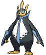

**Location:** Evolve Prinplup (Lv. 36)

**Ability 2:** Defiant

| Level | Move |     | Cont. | Move |
| ----- | ---- | --- | ----- | ---- |
| 1 |   Flash Cannon |   | 26 |  Yawn |
| 1 |   Hydro Pump |   | 30 |  Fury Attack |
| 1 |   Tackle |   | 34 |  Brine |
| 1 |   Growl |   | 36 |  Agility |
| 5 |   Bubble |   | 39 |  Drill Peck |
| 8 |   Swords Dance |   | 44 |  Whirlpool |
| 11 |  Bubble Beam |   | 49 |  Mist |
| 14 |  Peck |   | 54 |  Ice Beam |
| 16 |  Metal Claw |   | 59 |  Hydro Pump |
| 18 |  Icy Wind |   | 64 |  Flash Cannon |
| 22 |  Swagger |   |   |   |

---

## #396 Starly

**Location:** Route 101

**Ability 2:** Reckless

| Level | Move |     | Cont. | Move |
| ----- | ---- | --- | ----- | ---- |
| 1 |   Tackle |   | 20 |  Revenge |
| 1 |   Growl |   | 23 |  Aerial Ace |
| 5 |   Quick Attack |   | 26 |  Take Down |
| 8 |   Wing Attack |   | 29 |  Agility |
| 11 |  Double Team |   | 32 |  Final Gambit |
| 14 |  Endeavor |   | 35 |  Brave Bird |
| 17 |  Whirlwind |   | 38 |  Double |

---

## #397 Staravia

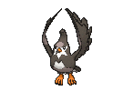

**Location:** Safari Zone

**Ability 2:** Reckless

| Level | Move |     | Cont. | Move |
| ----- | ---- | --- | ----- | ---- |
| 1 |   Tackle |   | 22 |  Revenge |
| 1 |   Growl |   | 26 |  Aerial Ace |
| 5 |   Quick Attack |   | 30 |  Take Down |
| 8 |   Wing Attack |   | 34 |  Agility |
| 11 |  Double Team |   | 38 |  Final Gambit |
| 14 |  Endeavor |   | 42 |  Brave Bird |
| 18 |  Whirlwind |   | 46 |  Double |

---

## #398 Staraptor

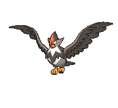

**Location:** Soaring in the Sky

**Ability 2:** Reckless

| Level | Move |     | Cont. | Move |
| ----- | ---- | --- | ----- | ---- |
| 1 |   Tackle |   | 26 |  Aerial Ace |
| 1 |   Growl |   | 30 |  Take Down |
| 5 |   Quick Attack |   | 34 |  Close Combat |
| 8 |   Wing Attack |   | 35 |  Agility |
| 11 |  Double Team |   | 40 |  Final Gambit |
| 14 |  Endeavor |   | 45 |  Brave Bird |
| 18 |  Whirlwind |   | 50 |  Double |
| 22 |  Revenge |   |   |   |

---

## #399 Bidoof

**Location:** Route 101

| Level | Move |     | Cont. | Move |
| ----- | ---- | --- | ----- | ---- |
| 1 |   Tackle |   | 23 |  Yawn |
| 5 |   Growl |   | 26 |  Take Down |
| 8 |   Defense Curl |   | 29 |  Amnesia |
| 11 |  Headbutt |   | 32 |  Super Fang |
| 14 |  Rollout |   | 35 |  Curse |
| 17 |  Hyper Fang |   | 38 |  Superpower |
| 20 |  Aqua Tail |   | 41 |  Double |

---

## #400 Bibarel

**Location:** Safari Zone

| Stat | Base | Change |
| ---- | ---- | ------ |
| HP | 79 | 90 |
| Attack | 85 | 95 |
| Defense | 60 | 65 |
| Speed | 71 | 75 |
| Total | 410 | 435 |

| Level | Move |     | Cont. | Move |
| ----- | ---- | --- | ----- | ---- |
| 1 |   Double |   | 22 |  Aqua Tail |
| 1 |   Rototiller |   | 26 |  Yawn |
| 1 |   Tackle |   | 30 |  Take Down |
| 5 |   Growl |   | 34 |  Amnesia |
| 8 |   Defense Curl |   | 38 |  Super Fang |
| 11 |  Headbutt |   | 42 |  Curse |
| 14 |  Rollout |   | 46 |  Superpower |
| 15 |  Water Gun |   | 50 |  Double |
| 18 |  Hyper Fang |   |   |   |

---

## #401 Kricketot

**Location:** Route 104 North

**Ability 2:** Run Away

| Level | Move |     | Cont. | Move |
| ----- | ---- | --- | ----- | ---- |
| 1 |   Growl |   | 5 |   Bug Bite |
| 1 |   Bide |   | 10 |  Endeavor |
| 1 |   Struggle Bug |   |   |   |

---

## #402 Kricketune

**Location:** Safari Zone

**Ability 2:** Technician

| Stat | Base | Change |
| ---- | ---- | ------ |
| HP | 77 | 80 |
| Attack | 85 | 110 |
| Defense | 51 | 65 |
| Sp. Defense | 51 | 65 |
| Total | 384 | 440 |

| Level | Move |     | Cont. | Move |
| ----- | ---- | --- | ----- | ---- |
| 1 |   Growl |   | 28 |  Aerial Ace |
| 1 |   Bide |   | 31 |  Fell Stinger |
| 10 |  Fury Cutter |   | 34 |  Night Slash |
| 13 |  Leech Life |   | 37 |  Screech |
| 16 |  Sing |   | 40 |  Taunt |
| 19 |  Slash |   | 43 |  Sticky Web |
| 22 |  X |   | 46 |  Bug Buzz |
| 25 |  Focus Energy |   | 49 |  Perish Song |

---

## #403 Shinx

**Location:** Route 116

| Level | Move |     | Cont. | Move |
| ----- | ---- | --- | ----- | ---- |
| 1 |   Tackle |   | 26 |  Double Kick |
| 1 |   Leer |   | 29 |  Wild Charge |
| 5 |   Charge |   | 32 |  Crunch |
| 8 |   Quick Attack |   | 35 |  Swagger |
| 11 |  Spark |   | 38 |  Discharge |
| 14 |  Baby |   | 41 |  Scary Face |
| 17 |  Bite |   | 44 |  Sucker Punch |
| 20 |  Thunder Fang |   | 47 |  Volt Tackle |
| 23 |  Roar |   |   |   |

---

## #404 Luxio

**Location:** Route 118

| Level | Move |     | Cont. | Move |
| ----- | ---- | --- | ----- | ---- |
| 1 |   Tackle |   | 30 |  Double Kick |
| 1 |   Leer |   | 34 |  Wild Charge |
| 5 |   Charge |   | 38 |  Crunch |
| 8 |   Quick Attack |   | 42 |  Swagger |
| 11 |  Spark |   | 46 |  Discharge |
| 14 |  Payback |   | 50 |  Scary Face |
| 18 |  Bite |   | 54 |  Sucker Punch |
| 22 |  Thunder Fang |   | 58 |  Volt Tackle |
| 26 |  Roar |   |   |   |

---

## #405 Luxray

**Location:** Evolve Luxio (Lv. 30)

**New TM/HMs:** Payback, Dark Pulse

**Type:** Electric >> Electric/Dark

| Level | Move |     | Cont. | Move |
| ----- | ---- | --- | ----- | ---- |
| 1 |   Electric Terrain |   | 22 |  Thunder Fang |
| 1 |   Volt Tackle |   | 26 |  Roar |
| 1 |   Sucker Punch |   | 30 |  Night Slash |
| 1 |   Ice Fang |   | 31 |  Double Kick |
| 1 |   Fire Fang |   | 36 |  Wild Charge |
| 1 |   Tackle |   | 41 |  Crunch |
| 1 |   Leer |   | 46 |  Swagger |
| 5 |   Charge |   | 51 |  Discharge |
| 8 |   Quick Attack |   | 56 |  Scary Face |
| 11 |  Spark |   | 61 |  Sucker Punch |
| 14 |  Payback |   | 66 |  Volt Tackle |
| 18 |  Bite |   | 71 |  Electric Terrain |

---

## #406 Budew

**Location:** Route 104 North

**Base Happiness:** 70 >> 200

| Level | Move |     | Cont. | Move |
| ----- | ---- | --- | ----- | ---- |
| 1 |   Absorb |   | 10 |  Stun Spore |
| 4 |   Growth |   | 13 |  Mega Drain |
| 7 |   Water Sport |   | 16 |  Worry Seed |

---

## #407 Roserade

**Location:** Evolve Roselia (Shiny Stone)

| Level | Move |     | Cont. | Move |
| ----- | ---- | --- | ----- | ---- |
| 1 |   Venom Drench |   | 1 |   Magical Leaf |
| 1 |   Grassy Terrain |   | 1 |   Sweet Scent |
| 1 |   Weather Ball |   | 22 |  Venoshock |
| 1 |   Poison Sting |   | 37 |  Petal Dance |
| 1 |   Mega Drain |   | 47 |  Petal Blizzard |

---

## #408 Cranidos

**Location:** Seafloor Cavern, Revive Skull Fossil

**Ability 2:** Sheer Force

| Level | Move |     | Cont. | Move |
| ----- | ---- | --- | ----- | ---- |
| 1 |   Headbutt |   | 30 |  Ancient Power |
| 1 |   Leer |   | 34 |  Iron Head |
| 6 |   Focus Energy |   | 38 |  Zen Headbutt |
| 10 |  Pursuit |   | 42 |  Thrash |
| 14 |  Take Down |   | 46 |  Crunch |
| 18 |  Scary Face |   | 50 |  Screech |
| 22 |  Assurance |   | 54 |  Head Smash |
| 26 |  Chip Away |   |   |   |

---

## #409 Rampardos

**Location:** Seafloor Cavern

**Ability 2:** Sheer Force

| Level | Move |     | Cont. | Move |
| ----- | ---- | --- | ----- | ---- |
| 1 |   Head Smash |   | 26 |  Chip Away |
| 1 |   Fire Punch |   | 30 |  Outrage |
| 1 |   Thunder Punch |   | 31 |  Ancient Power |
| 1 |   Headbutt |   | 36 |  Iron Head |
| 1 |   Leer |   | 41 |  Zen Headbutt |
| 6 |   Focus Energy |   | 46 |  Thrash |
| 10 |  Pursuit |   | 51 |  Crunch |
| 14 |  Take Down |   | 56 |  Screech |
| 18 |  Scary Face |   | 61 |  Head Smash |
| 22 |  Assurance |   |   |   |

---

## #410 Shieldon

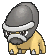

**Location:** Seafloor Cavern, Revive Armor Fossil

**Ability 2:** Soundproof

| Level | Move |     | Cont. | Move |
| ----- | ---- | --- | ----- | ---- |
| 1 |   Tackle |   | 30 |  Curse |
| 1 |   Protect |   | 34 |  Stealth Rock |
| 6 |   Taunt |   | 38 |  Endure |
| 10 |  Metal Sound |   | 42 |  Metal Burst |
| 14 |  Take Down |   | 46 |  Iron Head |
| 18 |  Iron Defense |   | 50 |  Rock Blast |
| 22 |  Swagger |   | 54 |  Heavy Slam |
| 26 |  Ancient Power |   |   |   |

---

## #411 Bastiodon

**Location:** Seafloor Cavern

**Ability 2:** Soundproof

| Level | Move |     | Cont. | Move |
| ----- | ---- | --- | ----- | ---- |
| 1 |   Magnet Rise |   | 30 |  Avalanche |
| 1 |   Tackle |   | 31 |  Curse |
| 1 |   Protect |   | 36 |  Stealth Rock |
| 6 |   Taunt |   | 41 |  Endure |
| 10 |  Metal Sound |   | 46 |  Metal Burst |
| 14 |  Take Down |   | 51 |  Iron Head |
| 18 |  Iron Defense |   | 56 |  Rock Blast |
| 22 |  Swagger |   | 61 |  Heavy Slam |
| 26 |  Ancient Power |   |   |   |

---

## #412 Burmy

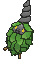

**Location:** Route 104 North

**Ability 2:** Overcoat

| Level | Move |     | Cont. | Move |
| ----- | ---- | --- | ----- | ---- |
| 1 |   Protect |   | 1 |   Electroweb |
| 1 |   Tackle |   | 15 |  Hidden Power |
| 1 |   Bug Bite |   |   |   |

---

## #413 Wormadam

**Location:** Safari Zone

**Ability 2:** Overcoat

### Plant Forme

| Stat | Base | Change |
| ---- | ---- | ------ |
| HP | 60 | 80 |
| Attack | 59 | 50 |
| Defense | 85 | 100 |
| Sp. Attack | 79 | 90 |
| Sp. Defense | 105 | 110 |
| Speed | 36 | 30 |
| Total | 424 | 460 |

| Level | Move |     | Cont. | Move |
| ----- | ---- | --- | ----- | ---- |
| 1 |   Protect |   | 29 |  Growth |
| 1 |   Tackle |   | 32 |  Psybeam |
| 1 |   Bug Bite |   | 35 |  Energy Ball |
| 1 |   Electroweb |   | 38 |  Bug Buzz |
| 15 |  Hidden Power |   | 41 |  Captivate |
| 20 |  Confusion |   | 44 |  Flail |
| 20 |  Razor Leaf |   | 47 |  Attract |
| 23 |  Signal Beam |   | 50 |  Psychic |
| 26 |  Giga Drain |   | 53 |  Leaf Storm |

### Sandy Forme

| Stat | Base | Change |
| ---- | ---- | ------ |
| HP | 60 | 80 |
| Attack | 79 | 90 |
| Defense | 105 | 110 |
| Sp. Attack | 59 | 50 |
| Sp. Defense | 85 | 100 |
| Speed | 36 | 30 |
| Total | 424 | 460 |

| Level | Move |     | Cont. | Move |
| ----- | ---- | --- | ----- | ---- |
| 1 |   Protect |   | 29 |  Harden |
| 1 |   Tackle |   | 32 |  Psybeam |
| 1 |   Bug Bite |   | 35 |  Earthquake |
| 1 |   Electroweb |   | 38 |  Megahorn |
| 15 |  Hidden Power |   | 41 |  Captivate |
| 20 |  Confusion |   | 44 |  Flail |
| 20 |  Rock Blast |   | 47 |  Attract |
| 23 |  Steamroller |   | 50 |  Psychic |
| 26 |  Bulldoze |   | 53 |  Fissure |

### Trash Forme

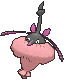

| Stat | Base | Change |
| ---- | ---- | ------ |
| HP | 60 | 80 |
| Attack | 69 | 70 |
| Defense | 95 | 105 |
| Sp. Attack | 69 | 70 |
| Sp. Defense | 95 | 105 |
| Speed | 36 | 30 |
| Total | 424 | 460 |

| Level | Move |     | Cont. | Move |
| ----- | ---- | --- | ----- | ---- |
| 1 |   Protect |   | 29 |  Metal Sound |
| 1 |   Tackle |   | 32 |  Psybeam |
| 1 |   Bug Bite |   | 35 |  Flash Cannon |
| 1 |   Electroweb |   | 38 |  Bug Buzz |
| 15 |  Hidden Power |   | 41 |  Captivate |
| 20 |  Confusion |   | 44 |  Flail |
| 20 |  Mirror Shot |   | 47 |  Attract |
| 23 |  Signal Beam |   | 50 |  Psychic |
| 26 |  Gyro Ball |   | 53 |  Iron Head |

---

## #414 Mothim

**Location:** Safari Zone

**Ability 2:** Tinted Lens

**New TM/HMs:** Fly

| Stat | Base | Change |
| ---- | ---- | ------ |
| HP | 70 | 80 |
| Attack | 94 | 100 |
| Sp. Attack | 94 | 100 |
| Speed | 66 | 80 |
| Total | 424 | 460 |

| Level | Move |     | Cont. | Move |
| ----- | ---- | --- | ----- | ---- |
| 1 |   Energy Ball |   | 26 |  Air Cutter |
| 1 |   Protect |   | 29 |  Poison Powder |
| 1 |   Tackle |   | 32 |  Psybeam |
| 1 |   Bug Bite |   | 35 |  Air Slash |
| 1 |   Electroweb |   | 38 |  Bug Buzz |
| 15 |  Hidden Power |   | 41 |  Camouflage |
| 20 |  Confusion |   | 44 |  Acrobatics |
| 20 |  Silver Wind |   | 47 |  Quiver Dance |
| 20 |  Gust |   | 50 |  Psychic |
| 23 |  Signal Beam |   | 53 |  Hurricane |

---

## #415 Combee

**Location:** Route 104 North

**Ability 2:** Hustle

| Level | Move |     | Cont. | Move |
| ----- | ---- | --- | ----- | ---- |
| 1 |   Sweet Scent |   | 15 |  Air Cutter |
| 1 |   Gust |   | 20 |  Bug Buzz |
| 10 |  Bug Bite |   |   |   |

---

## #416 Vespiquen

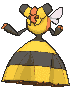

**Location:** Route 104 North

**Ability 2:** Unnerve

**New TM/HMs:** Fly

| Level | Move |     | Cont. | Move |
| ----- | ---- | --- | ----- | ---- |
| 1 |   Fell Stinger |   | 21 |  Defend Order |
| 1 |   Destiny Bond |   | 21 |  Heal Order |
| 1 |   Sweet Scent |   | 25 |  Power Gem |
| 1 |   Gust |   | 29 |  Slash |
| 1 |   Poison Sting |   | 33 |  Air Slash |
| 1 |   Confuse Ray |   | 37 |  Toxic |
| 5 |   Fury Cutter |   | 41 |  Captivate |
| 9 |   Pursuit |   | 45 |  Swagger |
| 13 |  Fury Swipes |   | 49 |  Destiny Bond |
| 17 |  Air Cutter |   | 53 |  Fell Stinger |
| 21 |  Attack Order |   |   |   |

---

## #417 Pachirisu

**Location:** Route 118

**Ability 1:** Adaptability **

| Stat | Base | Change |
| ---- | ---- | ------ |
| HP | 60 | 70 |
| Attack | 45 | 60 |
| Defense | 70 | 90 |
| Sp. Attack | 45 | 60 |
| Total | 405 | 465 |

| Level | Move |     | Cont. | Move |
| ----- | ---- | --- | ----- | ---- |
| 1 |   Ion Deluge |   | 20 |  Swift |
| 1 |   Magnet Rise |   | 23 |  Electro Ball |
| 1 |   Helping Hand |   | 26 |  Sweet Kiss |
| 1 |   Growl |   | 29 |  Thunder Wave |
| 1 |   Bide |   | 32 |  Super Fang |
| 1 |   Charge |   | 35 |  Discharge |
| 5 |   Quick Attack |   | 38 |  Rollout |
| 8 |   Charm |   | 41 |  Fake Tears |
| 11 |  Spark |   | 44 |  Last Resort |
| 14 |  Endure |   | 47 |  Hyper Fang |
| 17 |  Nuzzle |   |   |   |

---

## #418 Buizel

**Location:** Route 103, Route 120, Scorched Slab

**Ability 2:** Water Veil

| Level | Move |     | Cont. | Move |
| ----- | ---- | --- | ----- | ---- |
| 1 |   Sonic Boom |   | 25 |  Aqua Jet |
| 4 |   Growl |   | 28 |  Double Hit |
| 7 |   Water Sport |   | 31 |  Aqua Tail |
| 10 |  Quick Attack |   | 34 |  Whirlpool |
| 13 |  Water Gun |   | 37 |  Razor Wind |
| 16 |  Pursuit |   | 40 |  Agility |
| 19 |  Swift |   | 43 |  Hydro Pump |
| 22 |  Headbutt |   |   |   |

---

## #419 Floatzel

**Location:** Route 103, Route 120, Scorched Slab, Victory Road

**Ability 2:** Water Veil

| Level | Move |     | Cont. | Move |
| ----- | ---- | --- | ----- | ---- |
| 1 |   Tail Slap |   | 22 |  Headbutt |
| 1 |   Ice Fang |   | 25 |  Aqua Jet |
| 1 |   Sonic Boom |   | 26 |  Crunch |
| 4 |   Growl |   | 29 |  Double Hit |
| 7 |   Water Sport |   | 33 |  Aqua Tail |
| 10 |  Quick Attack |   | 37 |  Whirlpool |
| 13 |  Water Gun |   | 41 |  Razor Wind |
| 16 |  Pursuit |   | 45 |  Agility |
| 19 |  Swift |   | 49 |  Hydro Pump |

---

## #420 Cherubi

**Location:** Route 117

| Level | Move |     | Cont. | Move |
| ----- | ---- | --- | ----- | ---- |
| 1 |   Morning Sun |   | 23 |  Petal Blizzard |
| 1 |   Tackle |   | 26 |  Worry Seed |
| 5 |   Growth |   | 29 |  Take Down |
| 8 |   Leech Seed |   | 32 |  Dazzling Gleam |
| 11 |  Helping Hand |   | 35 |  Energy Ball |
| 14 |  Nature Power |   | 38 |  Lucky Chant |
| 17 |  Magical Leaf |   | 41 |  Solar Beam |
| 20 |  Sunny Day |   |   |   |

---

## #421 Cherrim

**Location:** Evolve Cherubi (Lv. 25)

### Normal Forme

| Stat | Base | Change |
| ---- | ---- | ------ |
| Sp. Attack | 87 | 90 |
| Sp. Defense | 78 | 80 |
| Total | 450 | 455 |

### Sunshine Forme

| Stat | Base | Change |
| ---- | ---- | ------ |
| Defense | 70 | 80 |
| Sp. Attack | 87 | 120 |
| Sp. Defense | 78 | 110 |
| Speed | 85 | 115 |
| Total | 450 | 555 |

| Level | Move |     | Cont. | Move |
| ----- | ---- | --- | ----- | ---- |
| 1 |   Morning Sun |   | 25 |  Weather Ball |
| 1 |   Tackle |   | 25 |  Petal Dance |
| 5 |   Growth |   | 26 |  Worry Seed |
| 8 |   Leech Seed |   | 30 |  Take Down |
| 11 |  Helping Hand |   | 34 |  Dazzling Gleam |
| 14 |  Nature Power |   | 38 |  Energy Ball |
| 17 |  Magical Leaf |   | 42 |  Lucky Chant |
| 20 |  Sunny Day |   | 46 |  Solar Beam |
| 23 |  Petal Blizzard |   |   |   |

---

## #422 Shellos

**Location:** Route 103

| Level | Move |     | Cont. | Move |
| ----- | ---- | --- | ----- | ---- |
| 1 |   Mud |   | 21 |  Rain Dance |
| 3 |   Mud Sport |   | 24 |  Brine |
| 6 |   Harden |   | 27 |  Body Slam |
| 9 |   Water Pulse |   | 30 |  Muddy Water |
| 12 |  Mud Bomb |   | 33 |  Earth Power |
| 15 |  Sludge |   | 36 |  Recover |
| 18 |  Hidden Power |   |   |   |

---

## #423 Gastrodon

**Location:** Safari Zone

| Level | Move |     | Cont. | Move |
| ----- | ---- | --- | ----- | ---- |
| 1 |   Mud |   | 21 |  Rain Dance |
| 3 |   Mud Sport |   | 24 |  Brine |
| 6 |   Harden |   | 27 |  Body Slam |
| 9 |   Water Pulse |   | 31 |  Muddy Water |
| 12 |  Mud Bomb |   | 36 |  Earth Power |
| 15 |  Sludge |   | 41 |  Recover |
| 18 |  Hidden Power |   | 46 |  Sludge Wave |

---

## #424 Ambipom

**Location:** Safari Zone

| Level | Move |     | Cont. | Move |
| ----- | ---- | --- | ----- | ---- |
| 1 |   Last Resort |   | 23 |  Knock Off |
| 1 |   Seed Bomb |   | 25 |  Screech |
| 1 |   Gunk Shot |   | 27 |  Agility |
| 1 |   Scratch |   | 29 |  Acrobatics |
| 1 |   Tail Whip |   | 30 |  Fake Out |
| 4 |   Sand Attack |   | 32 |  Double Hit |
| 8 |   Astonish |   | 35 |  Fling |
| 11 |  Baton Pass |   | 38 |  Nasty Plot |
| 14 |  Tickle |   | 42 |  Bounce |
| 17 |  Fury Swipes |   | 45 |  Last Resort |
| 20 |  Swift |   |   |   |

---

## #425 Drifloon

**Location:** Route 110

| Level | Move |     | Cont. | Move |
| ----- | ---- | --- | ----- | ---- |
| 1 |   Constrict |   | 27 |  Clear Smog |
| 1 |   Minimize |   | 30 |  Stockpile |
| 3 |   Astonish |   | 30 |  Swallow |
| 6 |   Gust |   | 30 |  Spit Up |
| 9 |   Focus Energy |   | 33 |  Shadow Ball |
| 12 |  Payback |   | 36 |  Hypnosis |
| 15 |  Ominous Wind |   | 39 |  Amnesia |
| 18 |  Air Cutter |   | 42 |  Baton Pass |
| 21 |  Hex |   | 45 |  Explosion |
| 24 |  Acrobatics |   |   |   |

---

## #426 Drifblim

**Location:** Route 120

| Level | Move |     | Cont. | Move |
| ----- | ---- | --- | ----- | ---- |
| 1 |   Hurricane |   | 24 |  Acrobatics |
| 1 |   Phantom Force |   | 27 |  Clear Smog |
| 1 |   Weather Ball |   | 31 |  Stockpile |
| 1 |   Icy Wind |   | 31 |  Swallow |
| 1 |   Constrict |   | 31 |  Spit Up |
| 1 |   Minimize |   | 35 |  Shadow Ball |
| 3 |   Astonish |   | 39 |  Hypnosis |
| 6 |   Gust |   | 43 |  Amnesia |
| 9 |   Focus Energy |   | 47 |  Baton Pass |
| 12 |  Payback |   | 51 |  Explosion |
| 15 |  Ominous Wind |   | 55 |  Phantom Force |
| 18 |  Air Cutter |   | 59 |  Hurricane |
| 21 |  Hex |   |   |   |

---

## #427 Buneary

**Location:** Route 104 North

**Base Happiness:** 0 >> 140

| Level | Move |     | Cont. | Move |
| ----- | ---- | --- | ----- | ---- |
| 1 |   Defense Curl |   | 20 |  Baton Pass |
| 1 |   Splash |   | 23 |  Dizzy Punch |
| 1 |   Pound |   | 26 |  Agility |
| 1 |   Foresight |   | 29 |  Bounce |
| 5 |   Endure |   | 32 |  After You |
| 8 |   Baby |   | 35 |  Charm |
| 11 |  Frustration |   | 38 |  Fake Out |
| 14 |  Quick Attack |   | 41 |  Entrainment |
| 17 |  Jump Kick |   | 44 |  Healing Wish |

---

## #428 Lopunny

**Location:** Evolve Buneary (Happiness)

| Level | Move |     | Cont. | Move |
| ----- | ---- | --- | ----- | ---- |
| 1 |   High Jump Kick |   | 14 |  Quick Attack |
| 1 |   Fire Punch |   | 17 |  Jump Kick |
| 1 |   Ice Punch |   | 20 |  Baton Pass |
| 1 |   Thunder Punch |   | 23 |  Dizzy Punch |
| 1 |   Bounce |   | 26 |  Agility |
| 1 |   Rototiller |   | 29 |  Bounce |
| 1 |   Mirror Coat |   | 32 |  After You |
| 1 |   Magic Coat |   | 35 |  Charm |
| 1 |   Defense Curl |   | 38 |  Fake Out |
| 1 |   Pound |   | 41 |  Entrainment |
| 1 |   Foresight |   | 44 |  Healing Wish |
| 5 |   Endure |   | 47 |  High Jump Kick |
| 11 |  Return |   |   |   |

---

## #429 Mismagius

**Location:** Mt. Pyre

**Type:** Ghost >> Ghost/Fairy

| Level | Move |     | Cont. | Move |
| ----- | ---- | --- | ----- | ---- |
| 1 |   Mystical Fire |   | 1 |   Moonblast |
| 1 |   Power Gem |   | 1 |   Growl |
| 1 |   Phantom Force |   | 1 |   Psywave |
| 1 |   Lucky Chant |   | 1 |   Spite |
| 1 |   Magical Leaf |   | 1 |   Astonish |
| 1 |   Shadow Ball |   |   |   |

---

## #430 Honchkrow

**Location:** Soaring in the Sky

| Level | Move |     | Cont. | Move |
| ----- | ---- | --- | ----- | ---- |
| 1 |   Night Slash |   | 33 |  Drill Peck |
| 1 |   Sucker Punch |   | 39 |  Nasty Plot |
| 1 |   Astonish |   | 45 |  Foul Play |
| 1 |   Pursuit |   | 51 |  Night Slash |
| 1 |   Haze |   | 57 |  Brave Bird |
| 1 |   Wing Attack |   | 63 |  Quash |
| 27 |  Swagger |   | 69 |  Dark Pulse |

---

## #431 Glameow

**Location:** Jagged Pass

**Evolution Level:** 38 >> 33

| Level | Move |     | Cont. | Move |
| ----- | ---- | --- | ----- | ---- |
| 1 |   Fake Out |   | 25 |  Covet |
| 1 |   Scratch |   | 28 |  Assist |
| 4 |   Growl |   | 31 |  Slash |
| 7 |   Bite |   | 34 |  Sucker Punch |
| 10 |  Hypnosis |   | 37 |  Captivate |
| 13 |  Feint Attack |   | 40 |  Attract |
| 16 |  Fury Swipes |   | 43 |  Foul Play |
| 19 |  Knock Off |   | 46 |  Hone Claws |
| 22 |  Charm |   | 49 |  Play Rough |

---

## #432 Purugly

**Location:** Route 120

| Level | Move |     | Cont. | Move |
| ----- | ---- | --- | ----- | ---- |
| 1 |   Fake Out |   | 28 |  Assist |
| 1 |   Scratch |   | 31 |  Slash |
| 4 |   Growl |   | 33 |  Swagger |
| 7 |   Bite |   | 35 |  Body Slam |
| 10 |  Hypnosis |   | 39 |  Captivate |
| 13 |  Feint Attack |   | 43 |  Attract |
| 16 |  Fury Swipes |   | 47 |  Foul Play |
| 19 |  Knock Off |   | 51 |  Hone Claws |
| 22 |  Charm |   | 55 |  Play Rough |
| 25 |  Covet |   |   |   |

---

## #433 Chingling

**Location:** Mt. Pyre

**Base Happiness:** 70 >> 200

| Level | Move |     | Cont. | Move |
| ----- | ---- | --- | ----- | ---- |
| 1 |   Wrap |   | 13 |  Yawn |
| 4 |   Growl |   | 16 |  Last Resort |
| 7 |   Astonish |   | 19 |  Entrainment |
| 10 |  Confusion |   | 32 |  Uproar |

---

## #434 Stunky

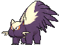

**Location:** Jagged Pass

| Level | Move |     | Cont. | Move |
| ----- | ---- | --- | ----- | ---- |
| 1 |   Scratch |   | 19 |  Night Slash |
| 1 |   Focus Energy |   | 22 |  Toxic |
| 1 |   Poison Gas |   | 25 |  Acid Spray |
| 4 |   Screech |   | 28 |  Poison Jab |
| 7 |   Fury Swipes |   | 31 |  Crunch |
| 10 |  Smokescreen |   | 34 |  Sucker Punch |
| 13 |  Feint |   | 37 |  Memento |
| 16 |  Flame Burst |   | 40 |  Belch |
| 19 |  Slash |   | 43 |  Explosion |

---

## #435 Skuntank

**Location:** Route 120

| Level | Move |     | Cont. | Move |
| ----- | ---- | --- | ----- | ---- |
| 1 |   Play Rough |   | 19 |  Night Slash |
| 1 |   Iron Tail |   | 22 |  Toxic |
| 1 |   Scratch |   | 25 |  Acid Spray |
| 1 |   Focus Energy |   | 28 |  Poison Jab |
| 1 |   Poison Gas |   | 31 |  Crunch |
| 4 |   Screech |   | 34 |  Flamethrower |
| 7 |   Fury Swipes |   | 35 |  Sucker Punch |
| 10 |  Smokescreen |   | 39 |  Memento |
| 13 |  Feint |   | 43 |  Belch |
| 16 |  Flame Burst |   | 47 |  Explosion |
| 19 |  Slash |   | 51 |  Play Rough |

---

## #436 Bronzor

**Location:** Route 113, Mt. Pyre

| Level | Move |     | Cont. | Move |
| ----- | ---- | --- | ----- | ---- |
| 1 |   Tackle |   | 24 |  Extrasensory |
| 1 |   Confusion |   | 27 |  Future Sight |
| 6 |   Imprison |   | 30 |  Feint Attack |
| 9 |   Confuse Ray |   | 33 |  Metal Sound |
| 12 |  Psywave |   | 36 |  Payback |
| 15 |  Hypnosis |   | 39 |  Heal Block |
| 18 |  Gyro Ball |   | 42 |  Heavy Slam |
| 21 |  Iron Defense |   | 45 |  Gravity |

---

## #437 Bronzong

**Location:** Mt. Pyre

**New TM/HMs:** Fly

| Level | Move |     | Cont. | Move |
| ----- | ---- | --- | ----- | ---- |
| 1 |   Sunny Day |   | 24 |  Extrasensory |
| 1 |   Rain Dance |   | 27 |  Future Sight |
| 1 |   Tackle |   | 30 |  Feint Attack |
| 1 |   Confusion |   | 33 |  Block |
| 6 |   Imprison |   | 34 |  Metal Sound |
| 9 |   Confuse Ray |   | 38 |  Payback |
| 12 |  Psywave |   | 42 |  Heal Block |
| 15 |  Hypnosis |   | 46 |  Heavy Slam |
| 18 |  Gyro Ball |   | 50 |  Gravity |
| 21 |  Iron Defense |   |   |   |

---

## #438 Bonsly

**Location:** Route 117

| Level | Move |     | Cont. | Move |
| ----- | ---- | --- | ----- | ---- |
| 1 |   Fake Tears |   | 22 |  Rock Tomb |
| 1 |   Copycat |   | 26 |  Block |
| 5 |   Flail |   | 29 |  Rock Slide |
| 8 |   Low Kick |   | 33 |  Counter |
| 12 |  Rock Throw |   | 36 |  Sucker Punch |
| 15 |  Mimic |   | 40 |  Double |
| 19 |  Feint Attack |   |   |   |

---

## #439 Mime Jr.

**Location:** Route 117

| Level | Move |     | Cont. | Move |
| ----- | ---- | --- | ----- | ---- |
| 1 |   Tackle |   | 22 |  Reflect |
| 1 |   Barrier |   | 25 |  Psybeam |
| 1 |   Confusion |   | 29 |  Substitute |
| 4 |   Copycat |   | 32 |  Recycle |
| 8 |   Meditate |   | 36 |  Trick |
| 11 |  Double Slap |   | 39 |  Psychic |
| 15 |  Mimic |   | 43 |  Role Play |
| 18 |  Encore |   | 46 |  Baton Pass |
| 22 |  Light Screen |   | 50 |  Safeguard |

---

## #440 Happiny

**Location:** Route 114

| Level | Move |     | Cont. | Move |
| ----- | ---- | --- | ----- | ---- |
| 1 |   Pound |   | 9 |   Refresh |
| 1 |   Charm |   | 12 |  Sweet Kiss |
| 5 |   Copycat |   |   |   |

---

## #441 Chatot

**Location:** Route 118

**Ability 1:** Gale Wings **

**Effort Values:** 1 Atk >> 1 Sp. Atk, 1 Spd

| Stat | Base | Change |
| ---- | ---- | ------ |
| HP | 76 | 80 |
| Defense | 45 | 55 |
| Sp. Attack | 92 | 110 |
| Sp. Defense | 42 | 55 |
| Speed | 91 | 110 |
| Total | 411 | 475 |

| Level | Move |     | Cont. | Move |
| ----- | ---- | --- | ----- | ---- |
| 1 |   Boomburst |   | 20 |  Taunt |
| 1 |   Hurricane |   | 23 |  Round |
| 1 |   Heat Wave |   | 26 |  Mimic |
| 1 |   Chatter |   | 29 |  Chatter |
| 1 |   Confide |   | 32 |  Roost |
| 1 |   Taunt |   | 35 |  Uproar |
| 1 |   Peck |   | 38 |  Synchronoise |
| 5 |   Growl |   | 41 |  Hyper Voice |
| 8 |   Mirror Move |   | 44 |  Feather Dance |
| 11 |  Sing |   | 47 |  Nasty Plot |
| 14 |  Fury Attack |   | 50 |  Hurricane |
| 17 |  Echoed Voice |   | 53 |  Boomburst |

---

## #442 Spiritomb

**Location:** Sea Mauville, Sky Pillar

**Ability 2:** Infiltrator

| Level | Move |     | Cont. | Move |
| ----- | ---- | --- | ----- | ---- |
| 1 |   Curse |   | 19 |  Dream Eater |
| 1 |   Pursuit |   | 25 |  Ominous Wind |
| 1 |   Confuse Ray |   | 31 |  Sucker Punch |
| 1 |   Spite |   | 37 |  Nasty Plot |
| 1 |   Shadow Sneak |   | 43 |  Memento |
| 7 |   Feint Attack |   | 49 |  Dark Pulse |
| 13 |  Hypnosis |   | 55 |  Pain Split |

---

## #443 Gible

**Location:** Route 111

**Ability 2:** Rough Skin

**Held Item:** Skull Fossil (50%)

| Level | Move |     | Cont. | Move |
| ----- | ---- | --- | ----- | ---- |
| 1 |   Tackle |   | 27 |  Body Slam |
| 4 |   Sand |   | 31 |  Dig |
| 7 |   Dragon Rage |   | 35 |  Dragon Rush |
| 11 |  Sandstorm |   | 39 |  Iron Head |
| 15 |  Take Down |   | 43 |  Thrash |
| 19 |  Sand Tomb |   | 47 |  Outrage |
| 23 |  Slash |   |   |   |

---

## #444 Gabite

**Location:** Victory Road

**Ability 2:** Rough Skin

| Level | Move |     | Cont. | Move |
| ----- | ---- | --- | ----- | ---- |
| 1 |   Tackle |   | 24 |  Dual Chop |
| 4 |   Sand |   | 28 |  Body Slam |
| 7 |   Dragon Rage |   | 33 |  Dig |
| 11 |  Sandstorm |   | 38 |  Dragon Rush |
| 15 |  Take Down |   | 43 |  Iron Head |
| 19 |  Sand Tomb |   | 48 |  Thrash |
| 23 |  Slash |   | 53 |  Outrage |

---

## #445 Garchomp

**Location:** Evolve Gabite (Lv. 48)

**Ability 2:** Rough Skin

| Level | Move |     | Cont. | Move |
| ----- | ---- | --- | ----- | ---- |
| 1 |   Fire Fang |   | 24 |  Dual Chop |
| 1 |   Tackle |   | 28 |  Body Slam |
| 4 |   Sand |   | 33 |  Dig |
| 7 |   Dragon Rage |   | 38 |  Dragon Rush |
| 11 |  Sandstorm |   | 43 |  Iron Head |
| 15 |  Take Down |   | 50 |  Thrash |
| 19 |  Sand Tomb |   | 57 |  Outrage |
| 23 |  Slash |   | 64 |  Extreme Speed |

---

## #446 Munchlax

**Location:** Route 113

| Level | Move |     | Cont. | Move |
| ----- | ---- | --- | ----- | ---- |
| 1 |   Last Resort |   | 24 |  Stockpile |
| 1 |   Recycle |   | 24 |  Swallow |
| 1 |   Metronome |   | 28 |  Rollout |
| 1 |   Odor Sleuth |   | 32 |  Fling |
| 1 |   Tackle |   | 36 |  Belly Drum |
| 1 |   Defense Curl |   | 40 |  Natural Gift |
| 4 |   Amnesia |   | 44 |  Zen Headbutt |
| 8 |   Lick |   | 48 |  Snatch |
| 12 |  Chip Away |   | 52 |  Seed Bomb |
| 16 |  Screech |   | 56 |  Double |
| 20 |  Body Slam |   | 60 |  Last Resort |

---

## #447 Riolu

**Location:** Route 103

| Level | Move |     | Cont. | Move |
| ----- | ---- | --- | ----- | ---- |
| 1 |   Foresight |   | 22 |  Sky Uppercut |
| 1 |   Quick Attack |   | 26 |  Screech |
| 1 |   Endure |   | 30 |  Reversal |
| 6 |   Counter |   | 34 |  Blaze Kick |
| 10 |  Feint |   | 38 |  Nasty Plot |
| 14 |  Force Palm |   | 42 |  High Jump Kick |
| 18 |  Copycat |   | 46 |  Final Gambit |

---

## #448 Lucario

**Location:** Evolve Riolu (Happiness @ Day)

| Level | Move |     | Cont. | Move |
| ----- | ---- | --- | ----- | ---- |
| 1 |   Extreme Speed |   | 26 |  Metal Sound |
| 1 |   Dragon Pulse |   | 30 |  Bone Rush |
| 1 |   Bullet Punch |   | 34 |  Blaze Kick |
| 1 |   Foresight |   | 38 |  Aura Sphere |
| 1 |   Quick Attack |   | 42 |  Quick Guard |
| 1 |   Detect |   | 46 |  Me First |
| 1 |   Metal Claw |   | 50 |  Calm Mind |
| 6 |   Counter |   | 54 |  Heal Pulse |
| 10 |  Feint |   | 58 |  Close Combat |
| 14 |  Power |   | 62 |  Dragon Pulse |
| 18 |  Swords Dance |   | 66 |  Extreme Speed |
| 22 |  Sky Uppercut |   |   |   |

---

## #449 Hippopotas

**Location:** Route 111

**Ability 2:** Sand Force

**Held Item:** Armor Fossil (50%)

| Level | Move |     | Cont. | Move |
| ----- | ---- | --- | ----- | ---- |
| 1 |   Tackle |   | 25 |  Slack Off |
| 1 |   Sand |   | 28 |  Bulldoze |
| 7 |   Bite |   | 31 |  Crunch |
| 10 |  Yawn |   | 34 |  Rock Slide |
| 13 |  Take Down |   | 37 |  Earthquake |
| 16 |  Dig |   | 40 |  Double |
| 19 |  Curse |   | 43 |  Fissure |
| 22 |  Sand Tomb |   | 46 |  Superpower |

---

## #450 Hippowdon

**Location:** Evolve Hippopotas (Lv. 34)

**Ability 2:** Sand Force

| Level | Move |     | Cont. | Move |
| ----- | ---- | --- | ----- | ---- |
| 1 |   Ice Fang |   | 22 |  Sand Tomb |
| 1 |   Fire Fang |   | 25 |  Slack Off |
| 1 |   Thunder Fang |   | 28 |  Bulldoze |
| 1 |   Tackle |   | 31 |  Crunch |
| 1 |   Sand |   | 35 |  Rock Slide |
| 7 |   Bite |   | 39 |  Earthquake |
| 10 |  Yawn |   | 43 |  Double |
| 13 |  Take Down |   | 47 |  Fissure |
| 16 |  Dig |   | 51 |  Superpower |
| 19 |  Curse |   |   |   |

---

## #451 Skorupi

**Location:** Route 114

**Evolution Level:** 40 >> 37

| Level | Move |     | Cont. | Move |
| ----- | ---- | --- | ----- | ---- |
| 1 |   Bite |   | 26 |  Poison Tail |
| 1 |   Poison Sting |   | 29 |  Night Slash |
| 1 |   Leer |   | 32 |  Cross Poison |
| 5 |   Knock Off |   | 35 |  X |
| 8 |   Pin Missile |   | 38 |  Hone Claws |
| 11 |  Acupressure |   | 41 |  Crunch |
| 14 |  Pursuit |   | 44 |  Toxic Spikes |
| 17 |  Bug Bite |   | 47 |  Scary Face |
| 20 |  Poison Fang |   | 50 |  Fell Stinger |
| 23 |  Venoshock |   |   |   |

---

## #452 Drapion

**Location:** Route 119

| Level | Move |     | Cont. | Move |
| ----- | ---- | --- | ----- | ---- |
| 1 |   Aqua Tail |   | 20 |  Poison Fang |
| 1 |   Thunder Fang |   | 23 |  Venoshock |
| 1 |   Ice Fang |   | 26 |  Poison Tail |
| 1 |   Fire Fang |   | 29 |  Night Slash |
| 1 |   Bite |   | 32 |  Cross Poison |
| 1 |   Poison Sting |   | 35 |  X |
| 1 |   Leer |   | 39 |  Hone Claws |
| 5 |   Knock Off |   | 43 |  Crunch |
| 8 |   Pin Missile |   | 47 |  Toxic Spikes |
| 11 |  Acupressure |   | 51 |  Scary Face |
| 14 |  Pursuit |   | 55 |  Fell Stinger |
| 17 |  Bug Bite |   |   |   |

---

## #453 Croagunk

**Location:** Jagged Pass, Safari Zone

**Evolution Level:** 37 >> 35

| Level | Move |     | Cont. | Move |
| ----- | ---- | --- | ----- | ---- |
| 1 |   Astonish |   | 30 |  Fake Out |
| 3 |   Mud |   | 33 |  Drain Punch |
| 6 |   Poison Sting |   | 36 |  Venoshock |
| 9 |   Taunt |   | 39 |  Poison Jab |
| 12 |  Pursuit |   | 42 |  Nasty Plot |
| 15 |  Feint Attack |   | 45 |  Sludge Bomb |
| 18 |  Revenge |   | 48 |  Cross Chop |
| 21 |  Swagger |   | 51 |  Belch |
| 24 |  Mud Bomb |   | 54 |  Flatter |
| 27 |  Sucker Punch |   | 57 |  Gunk Shot |

---

## #454 Toxicroak

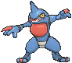

**Location:** Safari Zone

| Level | Move |     | Cont. | Move |
| ----- | ---- | --- | ----- | ---- |
| 1 |   Gunk Shot |   | 27 |  Sucker Punch |
| 1 |   Ice Punch |   | 30 |  Fake Out |
| 1 |   Thunder Punch |   | 33 |  Drain Punch |
| 1 |   Astonish |   | 37 |  Venoshock |
| 3 |   Mud |   | 41 |  Poison Jab |
| 6 |   Poison Sting |   | 45 |  Nasty Plot |
| 9 |   Taunt |   | 49 |  Sludge Bomb |
| 12 |  Pursuit |   | 53 |  Cross Chop |
| 15 |  Feint Attack |   | 57 |  Belch |
| 18 |  Revenge |   | 61 |  Flatter |
| 21 |  Swagger |   | 65 |  Gunk Shot |
| 24 |  Mud Bomb |   |   |   |

---

## #455 Carnivine

**Location:** Route 119

| Level | Move |     | Cont. | Move |
| ----- | ---- | --- | ----- | ---- |
| 1 |   Bind |   | 28 |  Sleep Powder |
| 1 |   Growth |   | 32 |  Leaf Tornado |
| 4 |   Bite |   | 36 |  Seed Bomb |
| 8 |   Vine Whip |   | 40 |  Stockpile |
| 12 |  Sweet Scent |   | 40 |  Spit Up |
| 16 |  Bug Bite |   | 40 |  Swallow |
| 20 |  Ingrain |   | 44 |  Crunch |
| 24 |  Feint Attack |   | 48 |  Wring Out |
| 28 |  Stun Spore |   | 52 |  Power Whip |

---

## #456 Finneon

**Location:** Route 108, Route 109, Route 122, Safari Zone

| Level | Move |     | Cont. | Move |
| ----- | ---- | --- | ----- | ---- |
| 1 |   Pound |   | 27 |  Aurora Beam |
| 6 |   Water Gun |   | 30 |  Captivate |
| 9 |   Attract |   | 33 |  Safeguard |
| 12 |  Rain Dance |   | 36 |  Aqua Ring |
| 15 |  Water Pulse |   | 39 |  Whirlpool |
| 18 |  Gust |   | 42 |  U |
| 21 |  Sweet Kiss |   | 45 |  Bounce |
| 24 |  Silver Wind |   | 48 |  Soak |

---

## #457 Lumineon

**Location:** Route 108, Route 109, Route 122, Safari Zone

| Stat | Base | Change |
| ---- | ---- | ------ |
| HP | 69 | 75 |
| Attack | 69 | 80 |
| Defense | 76 | 85 |
| Sp. Attack | 69 | 80 |
| Sp. Defense | 86 | 90 |
| Speed | 91 | 95 |
| Total | 460 | 505 |

| Level | Move |     | Cont. | Move |
| ----- | ---- | --- | ----- | ---- |
| 1 |   Soak |   | 21 |  Sweet Kiss |
| 1 |   Signal Beam |   | 24 |  Silver Wind |
| 1 |   Psybeam |   | 27 |  Aurora Beam |
| 1 |   Air Cutter |   | 30 |  Captivate |
| 1 |   Ominous Wind |   | 34 |  Safeguard |
| 1 |   Pound |   | 38 |  Aqua Ring |
| 6 |   Water Gun |   | 42 |  Whirlpool |
| 9 |   Attract |   | 46 |  U |
| 12 |  Rain Dance |   | 50 |  Bounce |
| 15 |  Water Pulse |   | 54 |  Soak |
| 18 |  Gust |   |   |   |

---

## #458 Mantyke

**Location:** Route 108, Route 124

| Level | Move |     | Cont. | Move |
| ----- | ---- | --- | ----- | ---- |
| 1 |   Tackle |   | 23 |  Wide Guard |
| 1 |   Bubble |   | 27 |  Take Down |
| 3 |   Supersonic |   | 32 |  Agility |
| 7 |   Bubble Beam |   | 36 |  Air Slash |
| 11 |  Confuse Ray |   | 39 |  Aqua Ring |
| 14 |  Wing Attack |   | 46 |  Bounce |
| 16 |  Headbutt |   | 49 |  Hydro Pump |
| 19 |  Water Pulse |   | 52 |  Mirror Coat |

---

## #459 Snover

**Location:** Shoal Cave

**Ability 2:** Soundproof

| Level | Move |     | Cont. | Move |
| ----- | ---- | --- | ----- | ---- |
| 1 |   Powder Snow |   | 28 |  Avalanche |
| 1 |   Leer |   | 32 |  Ingrain |
| 4 |   Razor Leaf |   | 36 |  Wood Hammer |
| 8 |   Icy Wind |   | 40 |  Frost Breath |
| 12 |  Grass Whistle |   | 44 |  Seed Bomb |
| 16 |  Swagger |   | 48 |  Blizzard |
| 20 |  Mist |   | 52 |  Sheer Cold |
| 24 |  Ice Shard |   |   |   |

---

## #460 Abomasnow

**Ability 2:** Soundproof

| Level | Move |     | Cont. | Move |
| ----- | ---- | --- | ----- | ---- |
| 1 |   Ice Punch |   | 24 |  Ice Shard |
| 1 |   Powder Snow |   | 28 |  Avalanche |
| 1 |   Leer |   | 32 |  Ingrain |
| 4 |   Razor Leaf |   | 36 |  Wood Hammer |
| 8 |   Icy Wind |   | 40 |  Frost Breath |
| 12 |  Grass Whistle |   | 44 |  Seed Bomb |
| 16 |  Swagger |   | 48 |  Blizzard |
| 20 |  Mist |   | 52 |  Sheer Cold |

---

## #461 Weavile

**Location:** Shoal Cave

**Ability 2:** Technician **

**Held Items:** Grip Claw (50%), Quick Claw (5%)

| Level | Move |     | Cont. | Move |
| ----- | ---- | --- | ----- | ---- |
| 1 |   Icicle Crash |   | 18 |  Nasty Plot |
| 1 |   Embargo |   | 21 |  Metal Claw |
| 1 |   Revenge |   | 24 |  Hone Claws |
| 1 |   Assurance |   | 27 |  Fling |
| 1 |   Scratch |   | 30 |  Screech |
| 1 |   Leer |   | 33 |  Low Kick |
| 1 |   Taunt |   | 36 |  Night Slash |
| 1 |   Icy Wind |   | 39 |  Snatch |
| 6 |   Quick Attack |   | 42 |  Dark Pulse |
| 9 |   Feint Attack |   | 45 |  Punishment |
| 12 |  Ice Shard |   | 48 |  Icicle Crash |
| 15 |  Fury Swipes |   | 51 |  Crunch |

---

## #462 Magnezone

**Location:** Evolve Magneton (New Mauville)

| Level | Move |     | Cont. | Move |
| ----- | ---- | --- | ----- | ---- |
| 1 |   Zap Cannon |   | 19 |  Spark |
| 1 |   Magnetic Flux |   | 23 |  Mirror Shot |
| 1 |   Mirror Coat |   | 25 |  Metal Sound |
| 1 |   Barrier |   | 29 |  Electro Ball |
| 1 |   Electric Terrain |   | 33 |  Flash Cannon |
| 1 |   Tackle |   | 39 |  Screech |
| 5 |   Supersonic |   | 43 |  Discharge |
| 7 |   Thunder Shock |   | 49 |  Lock |
| 11 |  Sonic Boom |   | 53 |  Magnet Rise |
| 15 |  Thunder Wave |   | 59 |  Gyro Ball |
| 17 |  Magnet Bomb |   | 63 |  Zap Cannon |

---

## #463 Lickilicky

**Location:** Route 114

| Level | Move |     | Cont. | Move |
| ----- | ---- | --- | ----- | ---- |
| 1 |   Lick |   | 31 |  Rollout |
| 4 |   Supersonic |   | 34 |  Chip Away |
| 7 |   Defense Curl |   | 37 |  Body Slam |
| 10 |  Wrap |   | 40 |  Me First |
| 13 |  Knock Off |   | 43 |  Muddy Water |
| 16 |  Disable |   | 46 |  Power Whip |
| 19 |  Stomp |   | 49 |  Screech |
| 22 |  Magnitude |   | 52 |  Refresh |
| 25 |  Zen Headbutt |   | 55 |  Wring Out |
| 28 |  Slam |   |   |   |

---

## #464 Rhyperior

**Location:** Evolve Rhydon (Protector)

| Level | Move |     | Cont. | Move |
| ----- | ---- | --- | ----- | ---- |
| 1 |   Rock Wrecker |   | 17 |  Stomp |
| 1 |   Horn Drill |   | 21 |  Magnitude |
| 1 |   Fire Fang |   | 25 |  Chip Away |
| 1 |   Thunder Fang |   | 29 |  Rock Blast |
| 1 |   Ice Fang |   | 33 |  Drill Run |
| 1 |   Poison Jab |   | 37 |  Hammer Arm |
| 1 |   Horn Attack |   | 39 |  Take Down |
| 1 |   Tail Whip |   | 45 |  Stone Edge |
| 1 |   Fury Attack |   | 51 |  Earthquake |
| 5 |   Scary Face |   | 57 |  Megahorn |
| 9 |   Smack Down |   | 63 |  Horn Drill |
| 13 |  Bulldoze |   | 69 |  Rock Wrecker |

---

## #465 Tangrowth

**Location:** Evolve Tangela (Level w/Ancient Power)

| Level | Move |     | Cont. | Move |
| ----- | ---- | --- | ----- | ---- |
| 1 |   Block |   | 30 |  Stun Spore |
| 1 |   Ingrain |   | 33 |  Giga Drain |
| 1 |   Constrict |   | 36 |  Ancient Power |
| 4 |   Sleep Powder |   | 39 |  Natural Gift |
| 7 |   Vine Whip |   | 43 |  Slam |
| 10 |  Absorb |   | 46 |  Tickle |
| 14 |  Poison Powder |   | 49 |  Wring Out |
| 17 |  Bind |   | 50 |  Grassy Terrain |
| 20 |  Growth |   | 53 |  Power Whip |
| 23 |  Mega Drain |   | 56 |  Block |
| 27 |  Knock Off |   |   |   |

---

## #466 Electivire

**Location:** Evolve Electabuzz (Electirizer)

**Ability 2:** Vital Spirit

**Type:** Electric >> Electric/Fighting

| Level | Move |     | Cont. | Move |
| ----- | ---- | --- | ----- | ---- |
| 1 |   Volt Tackle |   | 20 |  Electro Ball |
| 1 |   Electric Terrain |   | 23 |  Light Screen |
| 1 |   Ion Deluge |   | 26 |  Brick Break |
| 1 |   Hammer Arm |   | 29 |  Thunder Punch |
| 1 |   Fire Punch |   | 33 |  Discharge |
| 1 |   Ice Punch |   | 37 |  Screech |
| 1 |   Quick Attack |   | 41 |  Thunderbolt |
| 1 |   Leer |   | 45 |  Cross Chop |
| 5 |   Thunder Shock |   | 49 |  Wild Charge |
| 8 |   Low Kick |   | 53 |  Thunder |
| 11 |  Swift |   | 57 |  Giga Impact |
| 14 |  Shock Wave |   | 61 |  Electric Terrain |
| 17 |  Thunder Wave |   | 65 |  Volt Tackle |

---

## #467 Magmortar

**Location:** Evolve Magmar (Magmarizer)

**Ability 2:** Vital Spirit

| Level | Move |     | Cont. | Move |
| ----- | ---- | --- | ----- | ---- |
| 1 |   Thunder Punch |   | 26 |  Brick Break |
| 1 |   Smog |   | 29 |  Fire Punch |
| 1 |   Leer |   | 33 |  Lava Plume |
| 5 |   Ember |   | 37 |  Sunny Day |
| 8 |   Smokescreen |   | 41 |  Flamethrower |
| 11 |  Feint Attack |   | 45 |  Cross Chop |
| 14 |  Fire Spin |   | 49 |  Flare Blitz |
| 17 |  Clear Smog |   | 53 |  Fire Blast |
| 20 |  Flame Burst |   | 57 |  Hyper Beam |
| 23 |  Confuse Ray |   | 61 |  Magma Storm |

---

## #468 Togekiss

**Location:** Soaring in the Sky

| Level | Move |     | Cont. | Move |
| ----- | ---- | --- | ----- | ---- |
| 1 |   Moonblast |   | 1 |   Extreme Speed |
| 1 |   After You |   | 1 |   Aura Sphere |
| 1 |   Sky Attack |   | 1 |   Air Slash |

---

## #469 Yanmega

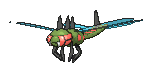

**Location:** Route 115

**New TM/HMs:** Fly

| Level | Move |     | Cont. | Move |
| ----- | ---- | --- | ----- | ---- |
| 1 |   Hurricane |   | 22 |  Detect |
| 1 |   Bug Buzz |   | 26 |  Supersonic |
| 1 |   Giga Drain |   | 30 |  Uproar |
| 1 |   Night Slash |   | 34 |  Ancient Power |
| 1 |   Feint |   | 38 |  Signal Beam |
| 1 |   Tackle |   | 42 |  Air Slash |
| 1 |   Foresight |   | 46 |  Hypnosis |
| 1 |   Quick Attack |   | 50 |  U |
| 6 |   Double Team |   | 54 |  Screech |
| 10 |  Sonic Boom |   | 58 |  Bug Buzz |
| 14 |  Slash |   | 62 |  Hurricane |
| 18 |  Silver Wind |   |   |   |

---

## #470 Leafeon

**Location:** Evolve Eevee (Petalburg Woods)

**Ability 2:** Chlorophyll

| Level | Move |     | Cont. | Move |
| ----- | ---- | --- | ----- | ---- |
| 1 |   Tail Whip |   | 25 |  Giga Drain |
| 1 |   Tackle |   | 29 |  Swords Dance |
| 1 |   Helping Hand |   | 33 |  Synthesis |
| 5 |   Sand Attack |   | 37 |  Sunny Day |
| 9 |   Razor Leaf |   | 41 |  Last Resort |
| 13 |  Quick Attack |   | 45 |  Leaf Blade |
| 17 |  Grass Whistle |   | 50 |  Psycho Cut |
| 20 |  Magical Leaf |   | 50 |  Night Slash |

---

## #471 Glaceon

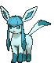

**Location:** Evolve Eevee (Shoal Cave)

**Ability 2:** Ice Body

| Level | Move |     | Cont. | Move |
| ----- | ---- | --- | ----- | ---- |
| 1 |   Water Pulse |   | 20 |  Ice Fang |
| 1 |   Helping Hand |   | 25 |  Ice Shard |
| 1 |   Tackle |   | 29 |  Barrier |
| 1 |   Tail Whip |   | 33 |  Mirror Coat |
| 5 |   Sand Attack |   | 37 |  Hail |
| 9 |   Icy Wind |   | 41 |  Last Resort |
| 13 |  Quick Attack |   | 45 |  Blizzard |
| 17 |  Bite |   | 50 |  Earth Power |

---

## #472 Gliscor

**Location:** Evolve Gligar (Razor Fang + Level Up @ Night)

**New TM/HMs:** Fly

| Level | Move |     | Cont. | Move |
| ----- | ---- | --- | ----- | ---- |
| 1 |   Guillotine |   | 22 |  Acrobatics |
| 1 |   Thunder Fang |   | 25 |  Cross Poison |
| 1 |   Ice Fang |   | 28 |  Slash |
| 1 |   Fire Fang |   | 31 |  U |
| 1 |   Poison Jab |   | 34 |  Screech |
| 4 |   Sand Attack |   | 37 |  X |
| 7 |   Harden |   | 40 |  Earthquake |
| 10 |  Knock Off |   | 43 |  Night Slash |
| 13 |  Quick Attack |   | 46 |  Sky Uppercut |
| 16 |  Fury Cutter |   | 49 |  Swords Dance |
| 19 |  Feint Attack |   | 52 |  Guillotine |

---

## #473 Mamoswine

**Location:** Evolve Piloswine (Level w/Ancient Power)

| Level | Move |     | Cont. | Move |
| ----- | ---- | --- | ----- | ---- |
| 1 |   Scary Face |   | 28 |  Avalanche |
| 1 |   Ancient Power |   | 31 |  Body Slam |
| 1 |   Peck |   | 33 |  Double Hit |
| 1 |   Odor Sleuth |   | 35 |  Mist |
| 4 |   Mud Sport |   | 39 |  Earthquake |
| 7 |   Powder Snow |   | 43 |  Thrash |
| 10 |  Mud |   | 47 |  Freeze |
| 13 |  Endure |   | 51 |  Icicle Crash |
| 16 |  Mud Bomb |   | 55 |  Superpower |
| 19 |  Hail |   | 59 |  Blizzard |
| 22 |  Ice Fang |   | 63 |  Scary Face |
| 25 |  Take Down |   |   |   |

---

## #474 Porygon-Z

**Location:** Evolve Porygon2 (Dubious Disc)

| Level | Move |     | Cont. | Move |
| ----- | ---- | --- | ----- | ---- |
| 1 |   Trick Room |   | 19 |  Magnet Rise |
| 1 |   Zap Cannon |   | 23 |  Signal Beam |
| 1 |   Magic Coat |   | 27 |  Tri Attack |
| 1 |   Conversion  |   | 31 |  Embargo |
| 1 |   Tackle |   | 35 |  Discharge |
| 1 |   Conversion |   | 39 |  Lock |
| 1 |   Nasty Plot |   | 43 |  Magic Coat |
| 7 |   Psybeam |   | 47 |  Zap Cannon |
| 11 |  Agility |   | 51 |  Hyper Beam |
| 15 |  Recover |   |   |   |

---

## #475 Gallade

**Location:** Evolve Kirlia (Dawn Stone ♂)

**Ability 2:** Justified

| Level | Move |     | Cont. | Move |
| ----- | ---- | --- | ----- | ---- |
| 1 |   Stored Power |   | 14 |  Slash |
| 1 |   Close Combat |   | 17 |  Wide Guard |
| 1 |   Leaf Blade |   | 19 |  Fury Cutter |
| 1 |   Night Slash |   | 23 |  Heal Pulse |
| 1 |   Leer |   | 26 |  Psycho Cut |
| 1 |   Confusion |   | 31 |  Swords Dance |
| 1 |   Double Team |   | 35 |  Helping Hand |
| 1 |   Teleport |   | 40 |  Feint |
| 4 |   Confusion |   | 44 |  False Swipe |
| 6 |   Double Team |   | 49 |  Protect |
| 9 |   Teleport |   | 53 |  Close Combat |
| 11 |  Quick Guard |   | 58 |  Stored Power |

---

## #476 Probopass

**Location:** Granite Cave

| Level | Move |     | Cont. | Move |
| ----- | ---- | --- | ----- | ---- |
| 1 |   Magnet Rise |   | 22 |  Rock Slide |
| 1 |   Gravity |   | 25 |  Power Gem |
| 1 |   Wide Guard |   | 28 |  Rock Blast |
| 1 |   Tackle |   | 31 |  Discharge |
| 4 |   Iron Defense |   | 34 |  Sandstorm |
| 7 |   Block |   | 37 |  Earth Power |
| 10 |  Magnet Bomb |   | 40 |  Stone Edge |
| 13 |  Thunder Wave |   | 43 |  Lock |
| 16 |  Rest |   | 43 |  Zap Cannon |
| 19 |  Spark |   | 46 |  Head Smash |

---

## #477 Dusknoir

**Location:** Evolve Dusclops (Reaper Cloth)

**Ability 2:** Frisk

| Level | Move |     | Cont. | Move |
| ----- | ---- | --- | ----- | ---- |
| 1 |   Phantom Force |   | 14 |  Shadow Sneak |
| 1 |   Future Sight |   | 18 |  Pursuit |
| 1 |   Pain Split |   | 22 |  Will |
| 1 |   Fire Punch |   | 26 |  Shadow Ball |
| 1 |   Ice Punch |   | 30 |  Confuse Ray |
| 1 |   Thunder Punch |   | 34 |  Shadow Punch |
| 1 |   Gravity |   | 35 |  Curse |
| 1 |   Bind |   | 40 |  Hex |
| 1 |   Leer |   | 45 |  Mean Look |
| 1 |   Night Shade |   | 50 |  Payback |
| 1 |   Disable |   | 55 |  Future Sight |
| 6 |   Astonish |   | 60 |  Phantom Force |
| 10 |  Foresight |   |   |   |

---

## #478 Froslass

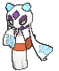

**Location:** Shoal Cave

**Ability 2:** Cursed Body

| Level | Move |     | Cont. | Move |
| ----- | ---- | --- | ----- | ---- |
| 1 |   Destiny Bond |   | 28 |  Ominous Wind |
| 1 |   Weather Ball |   | 32 |  Confuse Ray |
| 1 |   Powder Snow |   | 37 |  Shadow Ball |
| 1 |   Leer |   | 38 |  Wake |
| 5 |   Double Team |   | 44 |  Captivate |
| 10 |  Ice Shard |   | 50 |  Blizzard |
| 14 |  Icy Wind |   | 56 |  Hail |
| 19 |  Astonish |   | 62 |  Destiny Bond |
| 23 |  Draining Kiss |   |   |   |

---

## #479 Rotom

**Location:** New Mauville

### Frost Forme, Heat Forme, Mow Forme, Wash Forme

   

| Level | Move |     | Cont. | Move |
| ----- | ---- | --- | ----- | ---- |
| 1 |   Pain Split |   | 24 |  Substitute |
| 1 |   Trick |   | 28 |  Electro Ball |
| 1 |   Astonish |   | 32 |  Hex |
| 1 |   Thunder Wave |   | 36 |  Discharge |
| 1 |   Thunder Shock |   | 40 |  Charge |
| 1 |   Confuse Ray |   | 44 |  Shadow Ball |
| 8 |   Uproar |   | 48 |  Thunderbolt |
| 12 |  Double Team |   | 52 |  Foul Play |
| 16 |  Shock Wave |   | 56 |  Dark Pulse |
| 20 |  Ominous Wind |   | 60 |  Thunder |

### Fan Forme

| Level | Move |     | Cont. | Move |
| ----- | ---- | --- | ----- | ---- |
| 1 |   Hurricane |   | 24 |  Substitute |
| 1 |   Pain Split |   | 28 |  Electro Ball |
| 1 |   Trick |   | 32 |  Hex |
| 1 |   Astonish |   | 36 |  Discharge |
| 1 |   Thunder Wave |   | 40 |  Charge |
| 1 |   Thunder Shock |   | 44 |  Shadow Ball |
| 1 |   Confuse Ray |   | 48 |  Thunderbolt |
| 8 |   Uproar |   | 52 |  Foul Play |
| 12 |  Double Team |   | 56 |  Dark Pulse |
| 16 |  Shock Wave |   | 60 |  Thunder |
| 20 |  Ominous Wind |   |   |   |

---

## #480 Uxie

**Location:** Nameless Cavern, Mirage Cave

**Type:** Psychic >> Psychic/Fairy

| Level | Move |     | Cont. | Move |
| ----- | ---- | --- | ----- | ---- |
| 1 |   Memento |   | 24 |  Yawn |
| 1 |   Natural Gift |   | 30 |  Future Sight |
| 1 |   Flail |   | 36 |  Amnesia |
| 1 |   Rest |   | 42 |  Extrasensory |
| 1 |   Confusion |   | 48 |  Flail |
| 6 |   Imprison |   | 50 |  Moonblast |
| 12 |  Endure |   | 56 |  Natural Gift |
| 18 |  Swift |   | 64 |  Memento |

---

## #481 Mesprit

**Location:** Nameless Cavern, Mirage Cave

**Type:** Psychic >> Psychic/Fairy

| Level | Move |     | Cont. | Move |
| ----- | ---- | --- | ----- | ---- |
| 1 |   Healing Wish |   | 24 |  Lucky Chant |
| 1 |   Natural Gift |   | 30 |  Future Sight |
| 1 |   Copycat |   | 36 |  Charm |
| 1 |   Rest |   | 42 |  Extrasensory |
| 1 |   Confusion |   | 48 |  Copycat |
| 6 |   Imprison |   | 50 |  Moonblast |
| 12 |  Protect |   | 56 |  Natural Gift |
| 18 |  Swift |   | 64 |  Healing Wish |

---

## #482 Azelf

**Location:** Nameless Cavern, Mirage Cave

**Type:** Psychic >> Psychic/Fairy

| Level | Move |     | Cont. | Move |
| ----- | ---- | --- | ----- | ---- |
| 1 |   Healing Wish |   | 30 |  Future Sight |
| 1 |   Last Resort |   | 36 |  Nasty Plot |
| 1 |   Rest |   | 42 |  Extrasensory |
| 1 |   Confusion |   | 48 |  Last Resort |
| 6 |   Imprison |   | 50 |  Moonblast |
| 12 |  Detect |   | 56 |  Natural Gift |
| 18 |  Swift |   | 64 |  Explosion |
| 24 |  Uproar |   |   |   |

---

## #483 Dialga

**Location:** Soaring in the Sky, Mirage Mountain

**Ability 2:** Telepathy

| Level | Move |     | Cont. | Move |
| ----- | ---- | --- | ----- | ---- |
| 1 |   Dragon Breath |   | 29 |  Dragon Claw |
| 1 |   Scary Face |   | 33 |  Earth Power |
| 6 |   Metal Claw |   | 37 |  Aura Sphere |
| 10 |  Ancient Power |   | 42 |  Iron Tail |
| 15 |  Slash |   | 46 |  Roar of Time |
| 19 |  Power Gem |   | 50 |  Flash Cannon |
| 24 |  Metal Burst |   |   |   |

---

## #484 Palkia

**Location:** Soaring in the Sky, Mirage Mountain

**Ability 2:** Telepathy

**New TM/HMs:** Waterfall

| Level | Move |     | Cont. | Move |
| ----- | ---- | --- | ----- | ---- |
| 1 |   Dragon Breath |   | 29 |  Dragon Claw |
| 1 |   Scary Face |   | 33 |  Earth Power |
| 6 |   Water Pulse |   | 37 |  Aura Sphere |
| 10 |  Ancient Power |   | 42 |  Aqua Tail |
| 15 |  Slash |   | 46 |  Spacial Rend |
| 19 |  Power Gem |   | 50 |  Hydro Pump |
| 24 |  Aqua Tail |   |   |   |

---

## #485 Heatran

**Location:** Scorched Slab

**Ability 2:** Flame Body

| Level | Move |     | Cont. | Move |
| ----- | ---- | --- | ----- | ---- |
| 1 |   Fire Spin |   | 35 |  Lava Plume |
| 1 |   Ancient Power |   | 40 |  Fire Spin |
| 10 |  Leer |   | 45 |  Iron Head |
| 15 |  Fire Fang |   | 50 |  Earth Power |
| 20 |  Metal Sound |   | 55 |  Heat Wave |
| 25 |  Crunch |   | 60 |  Stone Edge |
| 30 |  Scary Face |   | 65 |  Magma Storm |

---

## #486 Regigigas

**Location:** Route 105

| Level | Move |     | Cont. | Move |
| ----- | ---- | --- | ----- | ---- |
| 1 |   Dizzy Punch |   | 25 |  Fire Punch |
| 1 |   Knock Off |   | 30 |  Ice Punch |
| 1 |   Confuse Ray |   | 35 |  Thunder Punch |
| 1 |   Foresight |   | 40 |  Payback |
| 10 |  Revenge |   | 45 |  Crush Grip |
| 15 |  Wide Guard |   | 50 |  Heavy Slam |
| 20 |  Zen Headbutt |   | 55 |  Giga Impact |

---

## #487 Giratina

**Location:** Soaring in the Sky

**Ability 2:** Telepathy

| Level | Move |     | Cont. | Move |
| ----- | ---- | --- | ----- | ---- |
| 1 |   Dragon Breath |   | 29 |  Dragon Claw |
| 1 |   Scary Face |   | 33 |  Earth Power |
| 6 |   Ominous Wind |   | 37 |  Aura Sphere |
| 10 |  Ancient Power |   | 42 |  Shadow Claw |
| 15 |  Slash |   | 46 |  Shadow Force |
| 19 |  Shadow Sneak |   | 50 |  Hex |
| 24 |  Destiny Bond |   |   |   |

---

## #488 Cresselia

**Location:** Crescent Isle, Mirage Island

| Level | Move |     | Cont. | Move |
| ----- | ---- | --- | ----- | ---- |
| 1 |   Confusion |   | 35 |  Moonlight |
| 1 |   Double Team |   | 40 |  Psycho Cut |
| 10 |  Safeguard |   | 45 |  Psycho Shift |
| 15 |  Mist |   | 50 |  Psychic |
| 20 |  Aurora Beam |   | 55 |  Lunar Dance |
| 25 |  Future Sight |   | 60 |  Moonblast |
| 30 |  Slash |   |   |   |

---

## #489 Phione

**Location:** Slateport City, Route 132, Route 133, Route 134

| Level | Move |     | Cont. | Move |
| ----- | ---- | --- | ----- | ---- |
| 1 |   Bubble |   | 25 |  Whirlpool |
| 1 |   Water Sport |   | 30 |  Water Pulse |
| 5 |   Charm |   | 35 |  Aqua Ring |
| 10 |  Supersonic |   | 40 |  Dive |
| 15 |  Bubble Beam |   | 45 |  Rain Dance |
| 20 |  Acid Armor |   |   |   |

---

## #490 Manaphy

**Location:** Mirage Island

| Level | Move |     | Cont. | Move |
| ----- | ---- | --- | ----- | ---- |
| 1 |   Tail Glow |   | 25 |  Whirlpool |
| 1 |   Bubble |   | 30 |  Water Pulse |
| 1 |   Water Sport |   | 35 |  Aqua Ring |
| 5 |   Charm |   | 40 |  Dive |
| 10 |  Supersonic |   | 45 |  Rain Dance |
| 15 |  Bubble Beam |   | 50 |  Heart Swap |
| 20 |  Acid Armor |   |   |   |

---

## #491 Darkrai

**Location:** Mirage Island

| Level | Move |     | Cont. | Move |
| ----- | ---- | --- | ----- | ---- |
| 1 |   Ominous Wind |   | 35 |  Double Team |
| 10 |  Disable |   | 40 |  Haze |
| 15 |  Quick Attack |   | 45 |  Dark Void |
| 20 |  Hypnosis |   | 50 |  Nasty Plot |
| 25 |  Feint Attack |   | 55 |  Dream Eater |
| 30 |  Nightmare |   | 60 |  Dark Pulse |

---

## #492 Shaymin

**Location:** Mirage Forest

| Level | Move |     | Cont. | Move |
| ----- | ---- | --- | ----- | ---- |
| 1 |   Growth |   | 30 |  Worry Seed |
| 5 |   Magical Leaf |   | 35 |  Aromatherapy |
| 10 |  Leech Seed |   | 40 |  Energy Ball |
| 15 |  Synthesis |   | 45 |  Sweet Kiss |
| 20 |  Sweet Scent |   | 50 |  Seed Flare |
| 25 |  Natural Gift |   | 55 |  Healing Wish |

---

## #493 Arceus

**Location:** Mirage Mountain

| Level | Move |     | Cont. | Move |
| ----- | ---- | --- | ----- | ---- |
| 1 |   Seismic Toss |   | 35 |  Extreme Speed |
| 5 |   Cosmic Power |   | 40 |  Refresh |
| 10 |  Natural Gift |   | 45 |  Future Sight |
| 15 |  Punishment |   | 50 |  Recover |
| 20 |  Gravity |   | 55 |  Hyper Beam |
| 25 |  Earth Power |   | 60 |  Perish Song |
| 30 |  Hyper Voice |   | 65 |  Judgment |

