# Unova Pokémon

---

## #494 Victini

**Location:** Mirage Island

| Level | Move |     | Cont. | Move |
| ----- | ---- | --- | ----- | ---- |
| 1 |   Searing Shot |   | 25 |  Flame Burst |
| 1 |   Focus Energy |   | 30 |  Stored Power |
| 1 |   Confusion |   | 35 |  Inferno |
| 1 |   Incinerate |   | 40 |  Double |
| 1 |   Quick Attack |   | 45 |  Flare Blitz |
| 5 |   Endure |   | 50 |  Zen Headbutt |
| 10 |  Headbutt |   | 55 |  Final Gambit |
| 15 |  Flame Charge |   | 60 |  Overheat |
| 20 |  Reversal |   | 65 |  V |

---

## #495 Snivy

**Location:** Petalburg Woods

**Ability 2:** Contrary

| Level | Move |     | Cont. | Move |
| ----- | ---- | --- | ----- | ---- |
| 1 |   Tackle |   | 20 |  Mega Drain |
| 3 |   Leer |   | 23 |  Slam |
| 5 |   Vine Whip |   | 26 |  Leaf Blade |
| 7 |   Wrap |   | 29 |  Coil |
| 9 |   Growth |   | 32 |  Giga Drain |
| 11 |  Leaf Tornado |   | 35 |  Wring Out |
| 13 |  Twister |   | 38 |  Gastro Acid |
| 15 |  Leech Seed |   | 41 |  Leaf Storm |
| 17 |  Glare |   |   |   |

---

## #496 Servine

**Location:** Evolve Snivy (Lv. 17)

**Ability 2:** Contrary

| Level | Move |     | Cont. | Move |
| ----- | ---- | --- | ----- | ---- |
| 1 |   Tackle |   | 20 |  Mega Drain |
| 3 |   Leer |   | 24 |  Slam |
| 5 |   Vine Whip |   | 28 |  Leaf Blade |
| 7 |   Wrap |   | 32 |  Coil |
| 9 |   Growth |   | 36 |  Giga Drain |
| 11 |  Leaf Tornado |   | 40 |  Wring Out |
| 13 |  Twister |   | 44 |  Gastro Acid |
| 15 |  Leech Seed |   | 48 |  Leaf Storm |
| 17 |  Glare |   |   |   |

---

## #497 Serperior

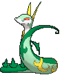

**Location:** Evolve Servine (Lv. 36)

**Ability 2:** Contrary

**Type:** Grass >> Grass/Dragon

**Move Tutor:** Draco Meteor

| Stat | Base | Change |
| ---- | ---- | ------ |
| Attack      | 75 | 80 |
| Sp. Attack  | 75 | 80 |
| Total       | 528 | 538 |

| Level | Move |     | Cont. | Move |
| ----- | ---- | --- | ----- | ---- |
| 1 |   Dragon Tail |   | 20 |  Mega Drain |
| 1 |   Aqua Tail |   | 24 |  Slam |
| 1 |   Tackle |   | 28 |  Leaf Blade |
| 3 |   Leer |   | 32 |  Coil |
| 5 |   Vine Whip |   | 36 |  Dragon Pulse |
| 7 |   Wrap |   | 38 |  Giga Drain |
| 9 |   Growth |   | 43 |  Wring Out |
| 11 |  Leaf Tornado |   | 48 |  Gastro Acid |
| 13 |  Twister |   | 53 |  Leaf Storm |
| 15 |  Leech Seed |   | 58 |  Outrage |
| 17 |  Glare |   |   |   |

---

## #498 Tepig

**Location:** Granite Cave

**Ability 2:** Thick Fat

| Level | Move |     | Cont. | Move |
| ----- | ---- | --- | ----- | ---- |
| 1 |   Tackle |   | 23 |  Yawn |
| 3 |   Tail Whip |   | 26 |  Heat Crash |
| 5 |   Ember |   | 29 |  Take Down |
| 7 |   Odor Sleuth |   | 32 |  Flamethrower |
| 9 |   Defense Curl |   | 35 |  Assurance |
| 11 |  Flame Charge |   | 38 |  Head Smash |
| 13 |  Covet |   | 41 |  Sucker Punch |
| 15 |  Smog |   | 44 |  Roar |
| 17 |  Magnitude |   | 47 |  Flare Blitz |
| 20 |  Rollout |   |   |   |

---

## #499 Pignite

**Location:** Evolve Tepig (Lv. 17)

**Ability 2:** Thick Fat

| Level | Move |     | Cont. | Move |
| ----- | ---- | --- | ----- | ---- |
| 1 |   Tackle |   | 20 |  Rollout |
| 3 |   Tail Whip |   | 24 |  Brick Break |
| 5 |   Ember |   | 28 |  Heat Crash |
| 7 |   Odor Sleuth |   | 32 |  Take Down |
| 9 |   Defense Curl |   | 36 |  Flamethrower |
| 11 |  Flame Charge |   | 40 |  Assurance |
| 13 |  Covet |   | 44 |  Head Smash |
| 15 |  Smog |   | 48 |  Sucker Punch |
| 17 |  Magnitude |   | 52 |  Roar |
| 17 |  Arm Thrust |   | 56 |  Flare Blitz |

---

## #500 Emboar

**Location:** Evolve Pignite (Lv. 36)

**Ability 2:** Reckless

| Stat | Base | Change |
| ---- | ---- | ------ |
| Attack      | 123 | 128 |
| Total       | 528 | 533 |

| Level | Move |     | Cont. | Move |
| ----- | ---- | --- | ----- | ---- |
| 1 |   Fire Punch |   | 17 |  Arm Thrust |
| 1 |   Thunder Punch |   | 20 |  Rollout |
| 1 |   Zen Headbutt |   | 24 |  Brick Break |
| 1 |   Tackle |   | 28 |  Heat Crash |
| 3 |   Tail Whip |   | 32 |  Take Down |
| 5 |   Ember |   | 36 |  Hammer Arm |
| 7 |   Odor Sleuth |   | 37 |  Flamethrower |
| 9 |   Defense Curl |   | 42 |  Assurance |
| 11 |  Flame Charge |   | 47 |  Head Smash |
| 13 |  Covet |   | 52 |  Sucker Punch |
| 15 |  Smog |   | 57 |  Roar |
| 17 |  Magnitude |   | 62 |  Flare Blitz |

---

## #501 Oshawott

**Location:** Route 104 South

**Ability 2:** Shell Armor

| Level | Move |     | Cont. | Move |
| ----- | ---- | --- | ----- | ---- |
| 1 |   Tackle |   | 23 |  Air Slash |
| 5 |   Tail Whip |   | 26 |  Revenge |
| 7 |   Water Gun |   | 29 |  Aqua Jet |
| 9 |   Water Sport |   | 32 |  Encore |
| 11 |  Focus Energy |   | 35 |  Aqua Tail |
| 13 |  Razor Shell |   | 38 |  Retaliate |
| 15 |  Fury Cutter |   | 41 |  Swords Dance |
| 17 |  Water Pulse |   | 44 |  Hydro Pump |
| 20 |  Vacuum Wave |   |   |   |

---

## #502 Dewott

**Location:** Evolve Oshawott (Lv. 17)

**Ability 2:** Shell Armor

**Type:** Water >> Water/Fighting

| Level | Move |     | Cont. | Move |
| ----- | ---- | --- | ----- | ---- |
| 1 |   Tackle |   | 24 |  Air Slash |
| 5 |   Tail Whip |   | 28 |  Revenge |
| 7 |   Water Gun |   | 32 |  Aqua Jet |
| 9 |   Water Sport |   | 36 |  Encore |
| 11 |  Focus Energy |   | 40 |  Aqua Tail |
| 13 |  Razor Shell |   | 44 |  Retaliate |
| 15 |  Fury Cutter |   | 48 |  Swords Dance |
| 17 |  Water Pulse |   | 52 |  Hydro Pump |
| 20 |  Vacuum Wave |   |   |   |

---

## #503 Samurott

**Ability 2:** Shell Armor

**New TM/HMs:** Focus Blast

**Type:** Water >> Water/Fighting

| Stat | Base | Change |
| ---- | ---- | ------ |
| Sp. Attack  | 108 | 113 |
| Total       | 528 | 533 |

| Level | Move |     | Cont. | Move |
| ----- | ---- | --- | ----- | ---- |
| 1 |   Secret Sword |   | 28 |  Revenge |
| 1 |   Megahorn |   | 32 |  Aqua Jet |
| 1 |   Tackle |   | 36 |  Encore |
| 5 |   Tail Whip |   | 36 |  Slash |
| 7 |   Water Gun |   | 36 |  Sacred Sword |
| 9 |   Water Sport |   | 41 |  Aqua Tail |
| 11 |  Focus Energy |   | 46 |  Retaliate |
| 13 |  Razor Shell |   | 51 |  Swords Dance |
| 15 |  Fury Cutter |   | 56 |  Hydro Pump |
| 17 |  Water Pulse |   | 61 |  Secret Sword |
| 20 |  Vacuum Wave |   | 66 |  Shell Smash |
| 24 |  Air Slash |   |   |   |

---

## #504 Patrat

**Location:** Route 103

| Level | Move |     | Cont. | Move |
| ----- | ---- | --- | ----- | ---- |
| 1 |   Tackle |   | 23 |  After You |
| 3 |   Leer |   | 24 |  Seed Bomb |
| 6 |   Bite |   | 26 |  Work Up |
| 8 |   Hypnosis |   | 28 |  Bide |
| 11 |  Hyper Fang |   | 31 |  Mean Look |
| 13 |  Sand Attack |   | 33 |  Baton Pass |
| 16 |  Crunch |   | 36 |  Zen Headbutt |
| 18 |  Detect |   | 38 |  Slam |
| 21 |  Super Fang |   |   |   |

---

## #505 Watchog

**Location:** Safari Zone

| Stat | Base | Change |
| ---- | ---- | ------ |
| HP          | 60 | 65 |
| Attack      | 85 | 95 |
| Defense     | 69 | 70 |
| Sp. Defense | 69 | 70 |
| Speed       | 77 | 80 |
| Total       | 420 | 440 |

| Level | Move |     | Cont. | Move |
| ----- | ---- | --- | ----- | ---- |
| 1 |   Rototiller |   | 18 |  Sand Attack |
| 1 |   Tackle |   | 20 |  Confuse Ray |
| 1 |   Leer |   | 22 |  Super Fang |
| 1 |   Bite |   | 25 |  After You |
| 1 |   Low Kick |   | 27 |  Seed Bomb |
| 3 |   Leer |   | 29 |  Psych Up |
| 6 |   Bite |   | 32 |  Bide |
| 8 |   Hypnosis |   | 36 |  Mean Look |
| 11 |  Hyper Fang |   | 39 |  Baton Pass |
| 13 |  Detect |   | 43 |  Zen Headbutt |
| 16 |  Crunch |   | 46 |  Slam |

---

## #506 Lillipup

**Location:** Route 103

| Level | Move |     | Cont. | Move |
| ----- | ---- | --- | ----- | ---- |
| 1 |   Leer |   | 21 |  Crunch |
| 1 |   Tackle |   | 24 |  Roar |
| 1 |   Odor Sleuth |   | 27 |  Retaliate |
| 5 |   Bite |   | 30 |  Reversal |
| 7 |   Baby |   | 33 |  Yawn |
| 9 |   Helping Hand |   | 36 |  Play Rough |
| 12 |  Covet |   | 39 |  Last Resort |
| 15 |  Take Down |   | 42 |  Giga Impact |
| 18 |  Work Up |   |   |   |

---

## #507 Herdier

**Location:** Route 121

| Level | Move |     | Cont. | Move |
| ----- | ---- | --- | ----- | ---- |
| 1 |   Leer |   | 23 |  Crunch |
| 1 |   Tackle |   | 27 |  Roar |
| 1 |   Odor Sleuth |   | 31 |  Retaliate |
| 5 |   Bite |   | 35 |  Reversal |
| 9 |   Helping Hand |   | 39 |  Yawn |
| 12 |  Covet |   | 43 |  Play Rough |
| 15 |  Take Down |   | 47 |  Last Resort |
| 19 |  Work Up |   | 51 |  Giga Impact |

---

## #508 Stoutland

**Location:** Route 121

| Level | Move |     | Cont. | Move |
| ----- | ---- | --- | ----- | ---- |
| 1 |   Ice Fang |   | 19 |  Work Up |
| 1 |   Fire Fang |   | 23 |  Crunch |
| 1 |   Thunder Fang |   | 27 |  Roar |
| 1 |   Leer |   | 32 |  Retaliate |
| 1 |   Tackle |   | 38 |  Reversal |
| 1 |   Odor Sleuth |   | 44 |  Yawn |
| 5 |   Bite |   | 50 |  Play Rough |
| 9 |   Helping Hand |   | 56 |  Last Resort |
| 12 |  Covet |   | 62 |  Giga Impact |
| 15 |  Take Down |   |   |   |

---

## #509 Purrloin

**Location:** Route 103

| Level | Move |     | Cont. | Move |
| ----- | ---- | --- | ----- | ---- |
| 1 |   Thief |   | 22 |  Hone Claws |
| 1 |   Scratch |   | 24 |  Slash |
| 4 |   Growl |   | 26 |  Night Slash |
| 6 |   Assist |   | 28 |  Assurance |
| 8 |   Feint Attack |   | 30 |  Captivate |
| 10 |  Sand Attack |   | 32 |  Sucker Punch |
| 12 |  Pay Day |   | 34 |  Snatch |
| 14 |  Fury Swipes |   | 36 |  Play Rough |
| 16 |  Pursuit |   | 38 |  Nasty Plot |
| 18 |  Torment |   | 40 |  Foul Play |
| 20 |  Fake Out |   | 42 |  Dark Pulse |

---

## #510 Liepard

**Location:** Route 123

| Stat | Base | Change |
| ---- | ---- | ------ |
| HP          | 64 | 65 |
| Attack      | 88 | 90 |
| Sp. Attack  | 88 | 90 |
| Speed       | 106 | 115 |
| Total       | 446 | 460 |

| Level | Move |     | Cont. | Move |
| ----- | ---- | --- | ----- | ---- |
| 1 |   Dark Pulse |   | 21 |  Fake Out |
| 1 |   Copycat |   | 24 |  Hone Claws |
| 1 |   Yawn |   | 27 |  Slash |
| 1 |   Thief |   | 30 |  Night Slash |
| 1 |   Scratch |   | 33 |  Assurance |
| 4 |   Growl |   | 36 |  Captivate |
| 6 |   Assist |   | 39 |  Sucker Punch |
| 8 |   Feint Attack |   | 42 |  Snatch |
| 10 |  Sand Attack |   | 45 |  Play Rough |
| 12 |  Pay Day |   | 48 |  Nasty Plot |
| 14 |  Fury Swipes |   | 51 |  Foul Play |
| 16 |  Pursuit |   | 54 |  Dark Pulse |
| 18 |  Torment |   |   |   |

---

## #511 Pansage

**Location:** Petalburg Woods

**Ability 2:** Overgrow

**Move Tutor:** Grass Pledge

| Level | Move |     | Cont. | Move |
| ----- | ---- | --- | ----- | ---- |
| 1 |   Scratch |   | 22 |  Leech Seed |
| 1 |   Play Nice |   | 25 |  Torment |
| 4 |   Leer |   | 28 |  Acrobatics |
| 7 |   Vine Whip |   | 31 |  Fling |
| 10 |  Lick |   | 34 |  Grass Knot |
| 13 |  Fury Swipes |   | 37 |  Recycle |
| 16 |  Seed Bomb |   | 40 |  Natural Gift |
| 19 |  Bite |   | 43 |  Crunch |

---

## #512 Simisage

**Location:** Evolve Pansage (Leaf Stone)

**Ability 2:** Overgrow

**Move Tutor:** Grass Pledge, Frenzy Plant

| Level | Move |     | Cont. | Move |
| ----- | ---- | --- | ----- | ---- |
| 1 |   Crunch |   | 1 |   Fury Swipes |
| 1 |   Leer |   | 1 |   Seed Bomb |
| 1 |   Lick |   |   |   |

---

## #513 Pansear

**Location:** Petalburg Woods

**Ability 2:** Blaze

**Move Tutor:** Fire Pledge

| Level | Move |     | Cont. | Move |
| ----- | ---- | --- | ----- | ---- |
| 1 |   Scratch |   | 22 |  Yawn |
| 1 |   Play Nice |   | 25 |  Amnesia |
| 4 |   Leer |   | 28 |  Acrobatics |
| 7 |   Incinerate |   | 31 |  Fling |
| 10 |  Lick |   | 34 |  Fire Blast |
| 13 |  Fury Swipes |   | 37 |  Recycle |
| 16 |  Flame Burst |   | 40 |  Natural Gift |
| 19 |  Bite |   | 43 |  Crunch |

---

## #514 Simisear

**Location:** Evolve Pansear (Fire Stone)

**Ability 2:** Blaze

**Move Tutor:** Fire Pledge, Blast Burn

| Level | Move |     | Cont. | Move |
| ----- | ---- | --- | ----- | ---- |
| 1 |   Crunch |   | 1 |   Fury Swipes |
| 1 |   Leer |   | 1 |   Flame Burst |
| 1 |   Lick |   |   |   |

---

## #515 Panpour

**Location:** Petalburg Woods

**Ability 2:** Torrent

**Move Tutor:** Water Pledge

| Level | Move |     | Cont. | Move |
| ----- | ---- | --- | ----- | ---- |
| 1 |   Scratch |   | 22 |  Water Sport |
| 1 |   Play Nice |   | 25 |  Taunt |
| 4 |   Leer |   | 28 |  Acrobatics |
| 7 |   Water Gun |   | 31 |  Fling |
| 10 |  Lick |   | 34 |  Brine |
| 13 |  Fury Swipes |   | 37 |  Recycle |
| 16 |  Scald |   | 40 |  Natural Gift |
| 19 |  Bite |   | 43 |  Crunch |

---

## #516 Simipour

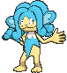

**Location:** Evolve Panpour (Water Stone)

**Ability 2:** Torrent

**Move Tutor:** Water Pledge, Hydro Cannon

| Level | Move |     | Cont. | Move |
| ----- | ---- | --- | ----- | ---- |
| 1 |   Crunch |   | 1 |   Fury Swipes |
| 1 |   Leer |   | 1 |   Scald |
| 1 |   Lick |   |   |   |

---

## #517 Munna

**Location:** Route 115

| Level | Move |     | Cont. | Move |
| ----- | ---- | --- | ----- | ---- |
| 1 |   Psywave |   | 25 |  Synchronoise |
| 1 |   Defense Curl |   | 29 |  Nightmare |
| 5 |   Lucky Chant |   | 31 |  Psychic |
| 7 |   Yawn |   | 35 |  Calm Mind |
| 11 |  Psybeam |   | 37 |  Future Sight |
| 13 |  Imprison |   | 41 |  Dream Eater |
| 17 |  Moonlight |   | 43 |  Telekinesis |
| 19 |  Hypnosis |   | 47 |  Stored Power |
| 23 |  Zen Headbutt |   |   |   |

---

## #518 Musharna

**Location:** Evolve Munna (Moon Stone)

| Level | Move |     | Cont. | Move |
| ----- | ---- | --- | ----- | ---- |
| 1 |   Moonblast |   | 1 |   Lucky Chant |
| 1 |   Moonlight |   | 1 |   Psybeam |
| 1 |   Defense Curl |   | 1 |   Hypnosis |

---

## #519 Pidove

**Location:** Route 103

**New TM/HMs:** Acrobatics

| Level | Move |     | Cont. | Move |
| ----- | ---- | --- | ----- | ---- |
| 1 |   Hypnosis |   | 23 |  Taunt |
| 1 |   Gust |   | 27 |  Air Slash |
| 3 |   Growl |   | 29 |  Night Slash |
| 7 |   Quick Attack |   | 33 |  Razor Wind |
| 9 |   Leer |   | 35 |  Feather Dance |
| 11 |  Pluck |   | 37 |  Brave Bird |
| 13 |  Roost |   | 39 |  Swagger |
| 17 |  Air Cutter |   | 43 |  Tailwind |
| 19 |  Facade |   | 45 |  Sky Attack |
| 21 |  Detect |   |   |   |

---

## #520 Tranquill

**Location:** Safari Zone

**New TM/HMs:** Acrobatics

| Level | Move |     | Cont. | Move |
| ----- | ---- | --- | ----- | ---- |
| 1 |   Hypnosis |   | 25 |  Taunt |
| 1 |   Gust |   | 28 |  Air Slash |
| 3 |   Growl |   | 31 |  Night Slash |
| 7 |   Quick Attack |   | 38 |  Razor Wind |
| 9 |   Leer |   | 41 |  Feather Dance |
| 11 |  Pluck |   | 44 |  Brave Bird |
| 13 |  Roost |   | 47 |  Swagger |
| 17 |  Air Cutter |   | 53 |  Tailwind |
| 19 |  Facade |   | 56 |  Sky Attack |
| 22 |  Detect |   |   |   |

---

## #521 Unfezant

**Location:** Soaring in the Sky

**New TM/HMs:** Acrobatics

| Level | Move |     | Cont. | Move |
| ----- | ---- | --- | ----- | ---- |
| 1 |   Sky Attack |   | 19 |  Facade |
| 1 |   Frustration |   | 22 |  Detect |
| 1 |   Return |   | 25 |  Taunt |
| 1 |   Hypnosis |   | 28 |  Air Slash |
| 1 |   Gust |   | 31 |  Night Slash |
| 3 |   Growl |   | 39 |  Razor Wind |
| 7 |   Quick Attack |   | 43 |  Feather Dance |
| 9 |   Leer |   | 47 |  Brave Bird |
| 11 |  Pluck |   | 51 |  Swagger |
| 13 |  Roost |   | 59 |  Tailwind |
| 17 |  Air Cutter |   | 63 |  Sky Attack |

---

## #522 Blitzle

**Location:** Route 112 South, Route 121

| Level | Move |     | Cont. | Move |
| ----- | ---- | --- | ----- | ---- |
| 1 |   Quick Attack |   | 25 |  Pursuit |
| 3 |   Tail Whip |   | 28 |  Stomp |
| 6 |   Charge |   | 31 |  Discharge |
| 10 |  Shock Wave |   | 34 |  Wild Charge |
| 13 |  Thunder Wave |   | 37 |  Agility |
| 16 |  Flame Charge |   | 40 |  Thrash |
| 19 |  Double Kick |   | 43 |  Bounce |
| 22 |  Spark |   |   |   |

---

## #523 Zebstrika

**Location:** Route 121

| Level | Move |     | Cont. | Move |
| ----- | ---- | --- | ----- | ---- |
| 1 |   Volt Tackle |   | 25 |  Pursuit |
| 1 |   Flare Blitz |   | 26 |  Jump Kick |
| 1 |   Ion Deluge |   | 29 |  Stomp |
| 1 |   Quick Attack |   | 33 |  Discharge |
| 3 |   Tail Whip |   | 37 |  Wild Charge |
| 6 |   Charge |   | 41 |  Agility |
| 10 |  Shock Wave |   | 45 |  Thrash |
| 13 |  Thunder Wave |   | 49 |  Bounce |
| 16 |  Flame Charge |   | 53 |  Ion Deluge |
| 19 |  Double Kick |   | 57 |  Flare Blitz |
| 22 |  Spark |   | 61 |  Volt Tackle |

---

## #524 Roggenrola

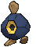

**Location:** Granite Cave

**Ability 2:** Sand Force

| Level | Move |     | Cont. | Move |
| ----- | ---- | --- | ----- | ---- |
| 1 |   Tackle |   | 25 |  Magnitude |
| 4 |   Harden |   | 28 |  Rock Slide |
| 7 |   Sand Attack |   | 31 |  Stealth Rock |
| 10 |  Headbutt |   | 34 |  Sandstorm |
| 13 |  Smack Down |   | 37 |  Autotomize |
| 16 |  Mud |   | 40 |  Stone Edge |
| 19 |  Iron Defense |   | 43 |  Explosion |
| 22 |  Rock Blast |   |   |   |

---

## #525 Boldore

**Location:** Granite Cave, Route 114, Shoal Cave, Victory Road

**Ability 2:** Sand Force

**Evolution:** Happiness or Level 36

| Level | Move |     | Cont. | Move |
| ----- | ---- | --- | ----- | ---- |
| 1 |   Tackle |   | 25 |  Power Gem |
| 4 |   Harden |   | 26 |  Magnitude |
| 7 |   Sand Attack |   | 30 |  Rock Slide |
| 10 |  Headbutt |   | 34 |  Stealth Rock |
| 13 |  Smack Down |   | 38 |  Sandstorm |
| 16 |  Mud |   | 42 |  Autotomize |
| 19 |  Iron Defense |   | 46 |  Stone Edge |
| 22 |  Rock Blast |   | 50 |  Explosion |

---

## #526 Gigalith

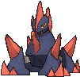

**Location:** Evolve Boldore (Happiness / Lv. 36)

**Ability 2:** Sand Force

| Level | Move |     | Cont. | Move |
| ----- | ---- | --- | ----- | ---- |
| 1 |   Tackle |   | 26 |  Magnitude |
| 4 |   Harden |   | 30 |  Rock Slide |
| 7 |   Sand Attack |   | 34 |  Stealth Rock |
| 10 |  Headbutt |   | 38 |  Sandstorm |
| 13 |  Smack Down |   | 42 |  Autotomize |
| 16 |  Mud |   | 46 |  Stone Edge |
| 19 |  Iron Defense |   | 50 |  Explosion |
| 22 |  Rock Blast |   | 54 |  Heavy Slam |
| 25 |  Power Gem |   |   |   |

---

## #527 Woobat

**Location:** Granite Cave, Scorched Slab

**Base Happiness:** 70 >> 140

| Level | Move |     | Cont. | Move |
| ----- | ---- | --- | ----- | ---- |
| 1 |   Confusion |   | 31 |  Amnesia |
| 4 |   Odor Sleuth |   | 31 |  Calm Mind |
| 7 |   Gust |   | 34 |  Air Slash |
| 10 |  Heart Stamp |   | 37 |  Signal Beam |
| 13 |  Assurance |   | 40 |  Psychic |
| 16 |  Imprision |   | 43 |  Future Sight |
| 19 |  Air Cutter |   | 46 |  Endeavor |
| 22 |  Knock Off |   | 49 |  Stored Power |
| 25 |  Psyshock |   | 52 |  Hurricane |
| 28 |  Attract |   |   |   |

---

## #528 Swoobat

**Location:** Scorched Slab, Seafloor Cavern

| Stat | Base | Change |
| ---- | ---- | ------ |
| HP          | 67 | 75 |
| Attack      | 57 | 60 |
| Defense     | 55 | 60 |
| Sp. Attack  | 77 | 95 |
| Sp. Defense | 55 | 60 |
| Speed       | 114 | 115 |
| Total       | 425 | 465 |

| Level | Move |     | Cont. | Move |
| ----- | ---- | --- | ----- | ---- |
| 1 |   Heat Wave |   | 25 |  Psyshock |
| 1 |   Giga Drain |   | 28 |  Attract |
| 1 |   Shock Wave |   | 31 |  Amnesia |
| 1 |   Confusion |   | 31 |  Calm Mind |
| 4 |   Odor Sleuth |   | 34 |  Air Slash |
| 7 |   Gust |   | 37 |  Signal Beam |
| 10 |  Heart Stamp |   | 40 |  Psychic |
| 13 |  Assurance |   | 43 |  Future Sight |
| 16 |  Imprision |   | 46 |  Endeavor |
| 19 |  Air Cutter |   | 49 |  Stored Power |
| 22 |  Knock Off |   | 52 |  Hurricane |

---

## #529 Drilbur

**Location:** Rusturf Tunnel, Scorched Slab

| Level | Move |     | Cont. | Move |
| ----- | ---- | --- | ----- | ---- |
| 1 |   Scratch |   | 24 |  Slash |
| 1 |   Mud Sport |   | 27 |  Drill Run |
| 6 |   Rapid Spin |   | 30 |  Rock Slide |
| 9 |   Mud |   | 33 |  Submission |
| 12 |  Fury Swipes |   | 36 |  Sandstorm |
| 15 |  Dig |   | 39 |  Earthquake |
| 18 |  Metal Claw |   | 42 |  Fissure |
| 21 |  Hone Claws |   |   |   |

---

## #530 Excadrill

**Location:** Scorched Slab

| Level | Move |     | Cont. | Move |
| ----- | ---- | --- | ----- | ---- |
| 1 |   Iron Head |   | 24 |  Slash |
| 1 |   Rototiller |   | 27 |  Drill Run |
| 1 |   Scratch |   | 30 |  Rock Slide |
| 1 |   Mud Sport |   | 31 |  Horn Drill |
| 6 |   Rapid Spin |   | 34 |  Submission |
| 9 |   Mud |   | 38 |  Sandstorm |
| 12 |  Fury Swipes |   | 42 |  Earthquake |
| 15 |  Dig |   | 46 |  Fissure |
| 18 |  Metal Claw |   | 50 |  Iron Head |
| 21 |  Hone Claws |   |   |   |

---

## #531 Audino

**Location:** Route 115

| Level | Move |     | Cont. | Move |
| ----- | ---- | --- | ----- | ---- |
| 1 |   Last Resort |   | 25 |  Secret Power |
| 1 |   Misty Terrain |   | 29 |  Entrainment |
| 1 |   Play Nice |   | 33 |  Take Down |
| 1 |   Pound |   | 37 |  Moonblast |
| 1 |   Growl |   | 41 |  Heal Pulse |
| 1 |   Helping Hand |   | 45 |  After You |
| 5 |   Baby |   | 49 |  Simple Beam |
| 9 |   Refresh |   | 53 |  Double |
| 13 |  Disarming Voice |   | 57 |  Wish |
| 17 |  Double Slap |   | 61 |  Healing Wish |
| 21 |  Attract |   | 65 |  Last Resort |

---

## #532 Timburr

**Location:** Rusturf Tunnel, Scorched Slab

| Level | Move |     | Cont. | Move |
| ----- | ---- | --- | ----- | ---- |
| 1 |   Pound |   | 25 |  Bulk Up |
| 1 |   Leer |   | 28 |  Drain Punch |
| 4 |   Focus Energy |   | 31 |  Rock Slide |
| 7 |   Bide |   | 34 |  Dynamic Punch |
| 10 |  Low Kick |   | 37 |  Scary Face |
| 13 |  Rock Throw |   | 40 |  Hammer Arm |
| 16 |  Wake |   | 43 |  Stone Edge |
| 19 |  Mach Punch |   | 46 |  Focus Punch |
| 22 |  Chip Away |   | 49 |  Superpower |

---

## #533 Gurdurr

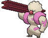

**Location:** Scorched Slab, Victory Road

| Level | Move |     | Cont. | Move |
| ----- | ---- | --- | ----- | ---- |
| 1 |   Pound |   | 25 |  Bulk Up |
| 1 |   Leer |   | 29 |  Drain Punch |
| 4 |   Focus Energy |   | 33 |  Rock Slide |
| 7 |   Bide |   | 37 |  Dynamic Punch |
| 10 |  Low Kick |   | 41 |  Scary Face |
| 13 |  Rock Throw |   | 45 |  Hammer Arm |
| 16 |  Wake |   | 49 |  Stone Edge |
| 19 |  Mach Punch |   | 53 |  Focus Punch |
| 22 |  Chip Away |   | 57 |  Superpower |

---

## #534 Conkeldurr

**Location:** Evolve Gurdurr (Happiness / Lv. 36)

| Level | Move |     | Cont. | Move |
| ----- | ---- | --- | ----- | ---- |
| 1 |   Ice Punch |   | 22 |  Chip Away |
| 1 |   Fire Punch |   | 25 |  Bulk Up |
| 1 |   Thunder Punch |   | 29 |  Drain Punch |
| 1 |   Pound |   | 33 |  Rock Slide |
| 1 |   Leer |   | 37 |  Dynamic Punch |
| 4 |   Focus Energy |   | 41 |  Scary Face |
| 7 |   Bide |   | 45 |  Hammer Arm |
| 10 |  Low Kick |   | 49 |  Stone Edge |
| 13 |  Rock Throw |   | 53 |  Focus Punch |
| 16 |  Wake |   | 57 |  Superpower |
| 19 |  Mach Punch |   |   |   |

---

## #535 Tympole

**Location:** Route 102

**New TM/HMs:** Waterfall, Dive

| Level | Move |     | Cont. | Move |
| ----- | ---- | --- | ----- | ---- |
| 1 |   Bubble |   | 22 |  Mud Bomb |
| 1 |   Growl |   | 25 |  Muddy Water |
| 4 |   Supersonic |   | 28 |  Rain Dance |
| 7 |   Round |   | 31 |  Flail |
| 10 |  Bubble Beam |   | 34 |  Echoed Voice |
| 13 |  Mud Shot |   | 37 |  Earth Power |
| 16 |  Aqua Ring |   | 40 |  Hydro Pump |
| 19 |  Uproar |   | 43 |  Hyper Voice |

---

## #536 Palpitoad

**Location:** Safari Zone

**New TM/HMs:** Waterfall, Dive

| Level | Move |     | Cont. | Move |
| ----- | ---- | --- | ----- | ---- |
| 1 |   Bubble |   | 22 |  Mud Bomb |
| 1 |   Growl |   | 26 |  Muddy Water |
| 4 |   Supersonic |   | 30 |  Rain Dance |
| 7 |   Round |   | 34 |  Flail |
| 10 |  Bubble Beam |   | 38 |  Echoed Voice |
| 13 |  Mud Shot |   | 42 |  Earth Power |
| 16 |  Aqua Ring |   | 46 |  Hydro Pump |
| 19 |  Uproar |   | 50 |  Hyper Voice |

---

## #537 Seismitoad

**Location:** Safari Zone

**New TM/HMs:** Waterfall, Dive

| Level | Move |     | Cont. | Move |
| ----- | ---- | --- | ----- | ---- |
| 1 |   Acid |   | 26 |  Muddy Water |
| 1 |   Bubble |   | 30 |  Rain Dance |
| 1 |   Growl |   | 34 |  Flail |
| 4 |   Supersonic |   | 36 |  Sludge Wave |
| 7 |   Round |   | 38 |  Drain Punch |
| 10 |  Bubble Beam |   | 43 |  Echoed Voice |
| 13 |  Mud Shot |   | 48 |  Poison Jab |
| 16 |  Aqua Ring |   | 53 |  Earth Power |
| 19 |  Uproar |   | 58 |  Hydro Pump |
| 22 |  Mud Bomb |   | 63 |  Hyper Voice |

---

## #538 Throh

**Location:** Route 112 North

| Level | Move |     | Cont. | Move |
| ----- | ---- | --- | ----- | ---- |
| 1 |   Ice Punch |   | 21 |  Revenge |
| 1 |   Fire Punch |   | 25 |  Storm Throw |
| 1 |   Thunder Punch |   | 29 |  Body Slam |
| 1 |   Knock Off |   | 33 |  Bulk Up |
| 1 |   Bind |   | 37 |  Circle Throw |
| 1 |   Leer |   | 41 |  Endure |
| 5 |   Bide |   | 45 |  Wide Guard |
| 9 |   Focus Energy |   | 48 |  Superpower |
| 13 |  Seismic Toss |   | 50 |  Reversal |
| 17 |  Vital Throw |   |   |   |

---

## #539 Sawk

**Location:** Route 112 South

| Level | Move |     | Cont. | Move |
| ----- | ---- | --- | ----- | ---- |
| 1 |   Ice Punch |   | 21 |  Counter |
| 1 |   Fire Punch |   | 25 |  Karate Chop |
| 1 |   Thunder Punch |   | 29 |  Brick Break |
| 1 |   Knock Off |   | 33 |  Bulk Up |
| 1 |   Rock Smash |   | 37 |  Retaliate |
| 1 |   Leer |   | 41 |  Endure |
| 5 |   Bide |   | 45 |  Quick Guard |
| 9 |   Focus Energy |   | 48 |  Close Combat |
| 13 |  Double Kick |   | 50 |  Reversal |
| 17 |  Low Sweep |   |   |   |

---

## #540 Sewaddle

**Location:** Route 104 South

**Base Happiness:** 70 >> 140

| Level | Move |     | Cont. | Move |
| ----- | ---- | --- | ----- | ---- |
| 1 |   Tackle |   | 14 |  Endure |
| 1 |   String Shot |   | 17 |  Sticky Web |
| 5 |   Bug Bite |   | 20 |  Bug Buzz |
| 8 |   Razor Leaf |   | 23 |  Flail |
| 11 |  Struggle Bug |   |   |   |

---

## #541 Swadloon

**Location:** Safari Zone

**Base Happiness:** 70 >> 140

| Level | Move |     | Cont. | Move |
| ----- | ---- | --- | ----- | ---- |
| 1 |   Grass Whistle |   | 1 |   Bug Bite |
| 1 |   Tackle |   | 1 |   Razor Leaf |
| 1 |   String Shot |   | 20 |  Protect |

---

## #542 Leavanny

**Location:** Safari Zone

| Level | Move |     | Cont. | Move |
| ----- | ---- | --- | ----- | ---- |
| 1 |   False Swipe |   | 26 |  Slash |
| 1 |   Tackle |   | 29 |  Knock Off |
| 1 |   String Shot |   | 32 |  Leaf Blade |
| 5 |   Bug Bite |   | 35 |  X |
| 8 |   Razor Leaf |   | 38 |  Helping Hand |
| 11 |  Struggle Bug |   | 41 |  Fell Stinger |
| 14 |  Endure |   | 44 |  Entrainment |
| 17 |  Sticky Web |   | 47 |  Swords Dance |
| 20 |  Bug Buzz |   | 50 |  Leaf Storm |
| 23 |  Flail |   |   |   |

---

## #543 Venipede

**Location:** Petalburg Woods

| Level | Move |     | Cont. | Move |
| ----- | ---- | --- | ----- | ---- |
| 1 |   Twinneedle |   | 23 |  Venoshock |
| 1 |   Defense Curl |   | 26 |  Agility |
| 1 |   Rollout |   | 29 |  Steamroller |
| 5 |   Poison Sting |   | 32 |  Poison Jab |
| 8 |   Screech |   | 35 |  Toxic |
| 11 |  Pursuit |   | 38 |  Venoshock |
| 14 |  Poison Tail |   | 41 |  Rock Climb |
| 17 |  Protect |   | 44 |  Double |
| 20 |  Bug Bite |   |   |   |

---

## #544 Whirlipede

**Location:** Safari Zone

| Level | Move |     | Cont. | Move |
| ----- | ---- | --- | ----- | ---- |
| 1 |   Twinneedle |   | 22 |  Iron Defense |
| 1 |   Defense Curl |   | 23 |  Venoshock |
| 1 |   Rollout |   | 27 |  Agility |
| 5 |   Poison Sting |   | 31 |  Steamroller |
| 8 |   Screech |   | 35 |  Poison Jab |
| 11 |  Pursuit |   | 39 |  Toxic |
| 14 |  Poison Tail |   | 43 |  Venom Drench |
| 17 |  Protect |   | 47 |  Rock Climb |
| 20 |  Bug Bite |   | 51 |  Double |

---

## #545 Scolipede

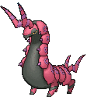

**Location:** Evolve Whirlipede (Lv. 30)

| Level | Move |     | Cont. | Move |
| ----- | ---- | --- | ----- | ---- |
| 1 |   Megahorn |   | 22 |  Iron Defense |
| 1 |   Aqua Tail |   | 23 |  Venoshock |
| 1 |   Twinneedle |   | 27 |  Agility |
| 1 |   Defense Curl |   | 30 |  Baton Pass |
| 1 |   Rollout |   | 32 |  Steamroller |
| 5 |   Poison Sting |   | 37 |  Poison Jab |
| 8 |   Screech |   | 42 |  Toxic |
| 11 |  Pursuit |   | 47 |  Venom Drench |
| 14 |  Poison Tail |   | 52 |  Rock Climb |
| 17 |  Protect |   | 57 |  Double |
| 20 |  Bug Bite |   | 62 |  Megahorn |

---

## #546 Cottonee

**Location:** Petalburg Woods

| Level | Move |     | Cont. | Move |
| ----- | ---- | --- | ----- | ---- |
| 1 |   Absorb |   | 25 |  Poison Powder |
| 1 |   Fairy Wind |   | 28 |  Dazzling Gleam |
| 4 |   Growth |   | 31 |  Charm |
| 7 |   Leech Seed |   | 34 |  Energy Ball |
| 10 |  Stun Spore |   | 37 |  Cotton Guard |
| 13 |  Mega Drain |   | 40 |  Sunny Day |
| 16 |  Cotton Spore |   | 43 |  Endeavor |
| 19 |  Razor Leaf |   | 46 |  Solar Beam |
| 22 |  Giga Drain |   |   |   |

---

## #547 Whimsicott

**Location:** Evolve Cottonee (Sun Stone)

| Level | Move |     | Cont. | Move |
| ----- | ---- | --- | ----- | ---- |
| 1 |   Encore |   | 1 |   Mega Drain |
| 1 |   Switcheroo |   | 1 |   Cotton Spore |
| 1 |   Tickle |   | 23 |  Gust |
| 1 |   Moonblast |   | 29 |  Tailwind |
| 1 |   Grass Whistle |   | 35 |  Hurricane |
| 1 |   Growth |   | 41 |  Moonblast |
| 1 |   Leech Seed |   |   |   |

---

## #548 Petilil

**Location:** Petalburg Woods

| Level | Move |     | Cont. | Move |
| ----- | ---- | --- | ----- | ---- |
| 1 |   Absorb |   | 25 |  Giga Drain |
| 4 |   Growth |   | 28 |  Aromatherapy |
| 7 |   Leech Seed |   | 31 |  Energy Ball |
| 10 |  Mega Drain |   | 34 |  Helping Hand |
| 13 |  Sleep Powder |   | 37 |  Entrainment |
| 16 |  Synthesis |   | 40 |  Sunny Day |
| 19 |  Magical Leaf |   | 43 |  After You |
| 22 |  Stun Spore |   | 46 |  Leaf Storm |

---

## #549 Lilligant

**Location:** Evolve Petilil (Sun Stone)

**New TM/HMs:** Dazzling Gleam

| Level | Move |     | Cont. | Move |
| ----- | ---- | --- | ----- | ---- |
| 1 |   Growth |   | 23 |  Teeter Dance |
| 1 |   Leech Seed |   | 29 |  Quiver Dance |
| 1 |   Mega Drain |   | 35 |  Petal Dance |
| 1 |   Synthesis |   | 41 |  Petal Blizzard |

---

## #550 Basculin

**Location:** Route 104 North, Route 111, Victory Road

| Level | Move |     | Cont. | Move |
| ----- | ---- | --- | ----- | ---- |
| 1 |   Thrash |   | 22 |  Crunch |
| 1 |   Flail |   | 25 |  Aqua Tail |
| 1 |   Tail Whip |   | 28 |  Revenge |
| 1 |   Tackle |   | 31 |  Soak |
| 1 |   Water Gun |   | 34 |  Zen Headbutt |
| 4 |   Uproar |   | 37 |  Double |
| 7 |   Headbutt |   | 40 |  Scary Face |
| 10 |  Bite |   | 43 |  Flail |
| 13 |  Aqua Jet |   | 46 |  Final Gambit |
| 16 |  Chip Away |   | 49 |  Thrash |
| 19 |  Take Down |   | 52 |  Superpower |

---

## #551 Sandile

**Location:** Route 111

**Held Item:** Claw Fossil (50%)

| Level | Move |     | Cont. | Move |
| ----- | ---- | --- | ----- | ---- |
| 1 |   Leer |   | 25 |  Swagger |
| 1 |   Rage |   | 28 |  Crunch |
| 4 |   Bite |   | 31 |  Dig |
| 7 |   Sand Attack |   | 34 |  Scary Face |
| 10 |  Torment |   | 37 |  Foul Play |
| 13 |  Sand Tomb |   | 40 |  Earthquake |
| 16 |  Assurance |   | 43 |  Sandstorm |
| 19 |  Mud |   | 46 |  Thrash |
| 22 |  Embargo |   |   |   |

---

## #552 Krokorok

**Location:** Evolve Sandile (Lv. 29)

| Level | Move |     | Cont. | Move |
| ----- | ---- | --- | ----- | ---- |
| 1 |   Leer |   | 25 |  Swagger |
| 1 |   Rage |   | 28 |  Crunch |
| 4 |   Bite |   | 32 |  Dig |
| 7 |   Sand Attack |   | 36 |  Scary Face |
| 10 |  Torment |   | 40 |  Foul Play |
| 13 |  Sand Tomb |   | 44 |  Earthquake |
| 16 |  Assurance |   | 48 |  Sandstorm |
| 19 |  Mud |   | 52 |  Thrash |
| 22 |  Embargo |   |   |   |

---

## #553 Krookodile

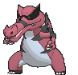

**Location:** Evolve Krokorok (Lv. 40)

| Level | Move |     | Cont. | Move |
| ----- | ---- | --- | ----- | ---- |
| 1 |   Outrage |   | 16 |  Assurance |
| 1 |   Fire Fang |   | 19 |  Mud |
| 1 |   Thunder Fang |   | 22 |  Embargo |
| 1 |   Aqua Tail |   | 25 |  Swagger |
| 1 |   Iron Tail |   | 28 |  Crunch |
| 1 |   Leer |   | 32 |  Dig |
| 1 |   Rage |   | 36 |  Scary Face |
| 4 |   Bite |   | 42 |  Foul Play |
| 7 |   Sand Attack |   | 48 |  Earthquake |
| 10 |  Torment |   | 54 |  Sandstorm |
| 13 |  Sand Tomb |   | 60 |  Outrage |

---

## #554 Darumaka

**Location:** Route 111

**Ability 2:** Inner Focus

**Held Item:** Cover Fossil (50%)

| Level | Move |     | Cont. | Move |
| ----- | ---- | --- | ----- | ---- |
| 1 |   Tackle |   | 22 |  Fire Punch |
| 3 |   Rollout |   | 25 |  Work Up |
| 6 |   Incinerate |   | 27 |  Thrash |
| 9 |   Rage |   | 30 |  Belly Drum |
| 11 |  Fire Fang |   | 33 |  Flare Blitz |
| 14 |  Headbutt |   | 35 |  Taunt |
| 17 |  Uproar |   | 39 |  Superpower |
| 19 |  Facade |   | 42 |  Overheat |

---

## #555 Darmanitan

?

**Location:** Route 111

**Ability 2:** Zen Mode

| Level | Move |     | Cont. | Move |
| ----- | ---- | --- | ----- | ---- |
| 1 |   Tackle |   | 19 |  Facade |
| 1 |   Rollout |   | 22 |  Fire Punch |
| 1 |   Incinerate |   | 25 |  Work Up |
| 1 |   Rage |   | 27 |  Thrash |
| 3 |   Rollout |   | 30 |  Belly Drum |
| 6 |   Incinerate |   | 33 |  Flare Blitz |
| 9 |   Rage |   | 35 |  Hammer Arm |
| 11 |  Fire Fang |   | 39 |  Taunt |
| 14 |  Headbutt |   | 47 |  Superpower |
| 17 |  Uproar |   | 54 |  Overheat |

---

## #556 Maractus

**Location:** Route 111

**Held Item:** Plume Fossil (50%), Miracle Seed (5%)

| Level | Move |     | Cont. | Move |
| ----- | ---- | --- | ----- | ---- |
| 1 |   Spiky Shield |   | 24 |  Giga Drain |
| 1 |   Cotton Guard |   | 27 |  Acupressure |
| 1 |   After You |   | 30 |  Grass Whistle |
| 1 |   Peck |   | 33 |  Ingrain |
| 1 |   Absorb |   | 36 |  Petal Dance |
| 3 |   Sweet Scent |   | 39 |  Bounce |
| 6 |   Growth |   | 42 |  Sucker Punch |
| 9 |   Pin Missile |   | 45 |  Sunny Day |
| 12 |  Mega Drain |   | 48 |  Petal Blizzard |
| 15 |  Synthesis |   | 51 |  Solar Beam |
| 18 |  Cotton Spore |   | 54 |  Cotton Guard |
| 21 |  Needle Arm |   | 57 |  After You |

---

## #557 Dwebble

**Location:** Rusturf Tunnel

| Level | Move |     | Cont. | Move |
| ----- | ---- | --- | ----- | ---- |
| 1 |   Fury Cutter |   | 28 |  Rock Slide |
| 4 |   Rock Blast |   | 31 |  Slash |
| 7 |   Withdraw |   | 31 |  Night Slash |
| 10 |  Sand |   | 34 |  X |
| 13 |  Feint Attack |   | 37 |  Shell Smash |
| 16 |  Smack Down |   | 40 |  Stone Edge |
| 19 |  Rock Polish |   | 43 |  Flail |
| 22 |  Bug Bite |   | 46 |  Rock Wrecker |
| 25 |  Stealth Rock |   |   |   |

---

## #558 Crustle

**Location:** Lilycove City, Seafloor Cavern

| Level | Move |     | Cont. | Move |
| ----- | ---- | --- | ----- | ---- |
| 1 |   Shell Smash |   | 22 |  Bug Bite |
| 1 |   Rock Blast |   | 25 |  Stealth Rock |
| 1 |   Withdraw |   | 28 |  Rock Slide |
| 1 |   Sand Attack |   | 31 |  Slash |
| 4 |   Rock Blast |   | 31 |  Night Slash |
| 7 |   Withdraw |   | 35 |  X |
| 10 |  Sand |   | 39 |  Shell Smash |
| 13 |  Feint Attack |   | 43 |  Stone Edge |
| 16 |  Smack Down |   | 47 |  Flail |
| 19 |  Rock Polish |   | 51 |  Rock Wrecker |

---

## #559 Scraggy

**Location:** Route 104 South

**Evolution Level:** 39 >> 34

| Level | Move |     | Cont. | Move |
| ----- | ---- | --- | ----- | ---- |
| 1 |   Leer |   | 25 |  Chip Away |
| 1 |   Fake Out |   | 28 |  High Jump Kick |
| 1 |   Low Kick |   | 31 |  Scary Face |
| 4 |   Sand Attack |   | 34 |  Zen Headbutt |
| 7 |   Feint Attack |   | 37 |  Crunch |
| 10 |  Headbutt |   | 40 |  Facade |
| 13 |  Swagger |   | 43 |  Dragon Dance |
| 16 |  Brick Break |   | 46 |  Rock Climb |
| 19 |  Payback |   | 49 |  Focus Punch |
| 22 |  Drain Punch |   | 52 |  Head Smash |

---

## #560 Scrafty

**Location:** Route 120

| Level | Move |     | Cont. | Move |
| ----- | ---- | --- | ----- | ---- |
| 1 |   Ice Punch |   | 22 |  Drain Punch |
| 1 |   Fire Punch |   | 25 |  Chip Away |
| 1 |   Thunder Punch |   | 28 |  High Jump Kick |
| 1 |   Leer |   | 31 |  Scary Face |
| 1 |   Fake Out |   | 35 |  Zen Headbutt |
| 1 |   Low Kick |   | 39 |  Crunch |
| 4 |   Sand Attack |   | 43 |  Facade |
| 7 |   Feint Attack |   | 47 |  Dragon Dance |
| 10 |  Headbutt |   | 51 |  Rock Climb |
| 13 |  Swagger |   | 55 |  Focus Punch |
| 16 |  Brick Break |   | 59 |  Head Smash |
| 19 |  Payback |   |   |   |

---

## #561 Sigilyph

**Location:** Route 111, Sky Pillar

**Held Item:** Old Amber (50%)

| Level | Move |     | Cont. | Move |
| ----- | ---- | --- | ----- | ---- |
| 1 |   Gust |   | 28 |  Mirror Move |
| 1 |   Miracle Eye |   | 31 |  Gravity |
| 4 |   Hypnosis |   | 34 |  Air Slash |
| 7 |   Psywave |   | 37 |  Ancient Power |
| 10 |  Tailwind |   | 40 |  Heat Wave |
| 13 |  Whirlwind |   | 43 |  Psychic |
| 16 |  Psybeam |   | 46 |  Cosmic Power |
| 19 |  Air Cutter |   | 49 |  Hurricane |
| 22 |  Light Screen |   | 52 |  Sky Attack |
| 22 |  Reflect |   | 55 |  Stored Power |
| 25 |  Synchronoise |   | 58 |  Psycho Shift |

---

## #562 Yamask

**Location:** Mt. Pyre

| Level | Move |     | Cont. | Move |
| ----- | ---- | --- | ----- | ---- |
| 1 |   Astonish |   | 29 |  Curse |
| 1 |   Protect |   | 33 |  Power Split |
| 5 |   Disable |   | 33 |  Guard Split |
| 9 |   Haze |   | 37 |  Shadow Ball |
| 13 |  Night Shade |   | 41 |  Grudge |
| 17 |  Hex |   | 45 |  Mean Look |
| 21 |  Will |   | 49 |  Destiny Bond |
| 25 |  Ominous Wind |   | 53 |  Pain Split |

---

## #563 Cofagrigus

**Location:** Mt. Pyre

| Level | Move |     | Cont. | Move |
| ----- | ---- | --- | ----- | ---- |
| 1 |   Nasty Plot |   | 29 |  Curse |
| 1 |   Astonish |   | 33 |  Power Split |
| 1 |   Protect |   | 33 |  Guard Split |
| 1 |   Disable |   | 34 |  Scary Face |
| 1 |   Haze |   | 39 |  Shadow Ball |
| 5 |   Disable |   | 45 |  Grudge |
| 9 |   Haze |   | 51 |  Mean Look |
| 13 |  Night Shade |   | 57 |  Destiny Bond |
| 17 |  Hex |   | 63 |  Pain Split |
| 21 |  Will |   | 69 |  Metal Burst |
| 25 |  Ominous Wind |   |   |   |

---

## #564 Tirtouga

**Location:** Seafloor Cavern, Revive Cover Fossil

| Level | Move |     | Cont. | Move |
| ----- | ---- | --- | ----- | ---- |
| 1 |   Bide |   | 25 |  Wide Guard |
| 1 |   Withdraw |   | 28 |  Brine |
| 1 |   Water Gun |   | 31 |  Smack Down |
| 5 |   Rollout |   | 35 |  Aqua Tail |
| 8 |   Bite |   | 38 |  Curse |
| 11 |  Protect |   | 41 |  Shell Smash |
| 15 |  Aqua Jet |   | 45 |  Rock Slide |
| 18 |  Ancient Power |   | 48 |  Rain Dance |
| 21 |  Crunch |   | 50 |  Hydro Pump |

---

## #565 Carracosta

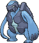

**Location:** Seafloor Cavern

| Level | Move |     | Cont. | Move |
| ----- | ---- | --- | ----- | ---- |
| 1 |   Bide |   | 25 |  Wide Guard |
| 1 |   Withdraw |   | 28 |  Brine |
| 1 |   Water Gun |   | 31 |  Smack Down |
| 5 |   Rollout |   | 35 |  Aqua Tail |
| 8 |   Bite |   | 40 |  Curse |
| 11 |  Protect |   | 45 |  Shell Smash |
| 15 |  Aqua Jet |   | 51 |  Rock Slide |
| 18 |  Ancient Power |   | 56 |  Rain Dance |
| 21 |  Crunch |   | 61 |  Hydro Pump |

---

## #566 Archen

**Location:** Seafloor Cavern, Revive Plume Fossil

| Level | Move |     | Cont. | Move |
| ----- | ---- | --- | ----- | ---- |
| 1 |   Quick Attack |   | 31 |  Dragon Breath |
| 1 |   Leer |   | 35 |  Rock Slide |
| 1 |   Wing Attack |   | 38 |  Crunch |
| 5 |   Rock Throw |   | 41 |  Endeavor |
| 8 |   Double Team |   | 45 |  U |
| 11 |  Scary Face |   | 48 |  Stone Edge |
| 15 |  Pluck |   | 50 |  Dragon Claw |
| 18 |  Ancient Power |   | 54 |  Thrash |
| 21 |  Agility |   | 55 |  Earth Power |
| 25 |  Quick Guard |   | 59 |  Head Smash |
| 28 |  Acrobatics |   |   |   |

---

## #567 Archeops

**Location:** Seafloor Cavern

| Level | Move |     | Cont. | Move |
| ----- | ---- | --- | ----- | ---- |
| 1 |   Quick Attack |   | 31 |  Dragon Breath |
| 1 |   Leer |   | 35 |  Rock Slide |
| 1 |   Wing Attack |   | 40 |  Crunch |
| 5 |   Rock Throw |   | 44 |  Endeavor |
| 8 |   Double Team |   | 49 |  U |
| 11 |  Scary Face |   | 54 |  Stone Edge |
| 15 |  Pluck |   | 58 |  Dragon Claw |
| 18 |  Ancient Power |   | 61 |  Thrash |
| 21 |  Agility |   | 65 |  Earth Power |
| 25 |  Quick Guard |   | 68 |  Head Smash |
| 28 |  Acrobatics |   |   |   |

---

## #568 Trubbish

**Location:** Route 110

**Evolution Level:** 36 >> 34

| Level | Move |     | Cont. | Move |
| ----- | ---- | --- | ----- | ---- |
| 1 |   Pound |   | 24 |  Rock Blast |
| 1 |   Poison Gas |   | 27 |  Sludge Bomb |
| 3 |   Recycle |   | 30 |  Clear Smog |
| 6 |   Toxic Spikes |   | 33 |  Toxic |
| 9 |   Acid Spray |   | 36 |  Seed Bomb |
| 12 |  Double Slap |   | 39 |  Amnesia |
| 15 |  Sludge |   | 42 |  Belch |
| 18 |  Stockpile |   | 45 |  Gunk Shot |
| 18 |  Swallow |   | 48 |  Explosion |
| 21 |  Take Down |   |   |   |

---

## #569 Garbodor

**Location:** New Mauville

| Level | Move |     | Cont. | Move |
| ----- | ---- | --- | ----- | ---- |
| 1 |   Pound |   | 24 |  Rock Blast |
| 1 |   Poison Gas |   | 27 |  Sludge Bomb |
| 3 |   Recycle |   | 30 |  Clear Smog |
| 6 |   Toxic Spikes |   | 33 |  Toxic |
| 9 |   Acid Spray |   | 38 |  Seed Bomb |
| 12 |  Double Slap |   | 42 |  Amnesia |
| 15 |  Sludge |   | 46 |  Belch |
| 18 |  Stockpile |   | 50 |  Gunk Shot |
| 18 |  Swallow |   | 54 |  Explosion |
| 21 |  Body Slam |   |   |   |

---

## #570 Zorua

**Location:** Route 103

| Level | Move |     | Cont. | Move |
| ----- | ---- | --- | ----- | ---- |
| 1 |   Scratch |   | 25 |  Taunt |
| 1 |   Leer |   | 28 |  Foul Play |
| 1 |   Pursuit |   | 31 |  Torment |
| 4 |   Fake Tears |   | 34 |  Night Daze |
| 7 |   Feint Attack |   | 37 |  Agility |
| 10 |  Scary Face |   | 40 |  Punishment |
| 13 |  Extrasensory |   | 43 |  Embargo |
| 16 |  Snarl |   | 46 |  Nasty Plot |
| 19 |  Fury Swipes |   | 49 |  Imprison |
| 22 |  Sucker Punch |   |   |   |

---

## #571 Zoroark

**Location:** Route 103

| Level | Move |     | Cont. | Move |
| ----- | ---- | --- | ----- | ---- |
| 1 |   Flamethrower |   | 22 |  Sucker Punch |
| 1 |   Imprison |   | 25 |  Taunt |
| 1 |   U |   | 28 |  Foul Play |
| 1 |   Scratch |   | 30 |  Night Slash |
| 1 |   Leer |   | 32 |  Torment |
| 1 |   Pursuit |   | 36 |  Night Daze |
| 4 |   Hone Claws |   | 40 |  Agility |
| 7 |   Feint Attack |   | 44 |  Punishment |
| 10 |  Scary Face |   | 48 |  Embargo |
| 13 |  Extrasensory |   | 52 |  Nasty Plot |
| 16 |  Snarl |   | 56 |  Imprison |
| 19 |  Fury Swipes |   |   |   |

---

## #572 Minccino

**Location:** Route 110

| Level | Move |     | Cont. | Move |
| ----- | ---- | --- | ----- | ---- |
| 1 |   Pound |   | 25 |  Charm |
| 3 |   Baby |   | 27 |  Wake |
| 5 |   Helping Hand |   | 30 |  Echoed Voice |
| 8 |   Tickle |   | 33 |  Slam |
| 11 |  Double Slap |   | 36 |  Captivate |
| 14 |  Encore |   | 39 |  Hyper Voice |
| 17 |  Swift |   | 42 |  Last Resort |
| 20 |  Sing |   | 45 |  After You |
| 23 |  Tail Slap |   |   |   |

---

## #573 Cinccino

**Location:** Route 110

| Level | Move |     | Cont. | Move |
| ----- | ---- | --- | ----- | ---- |
| 1 |   Icicle Spear |   | 1 |   Sing |
| 1 |   Bullet Seed |   | 23 |  Iron Tail |
| 1 |   Rock Blast |   | 23 |  Aqua Tail |
| 1 |   Helping Hand |   | 23 |  Tail Slap |
| 1 |   Tickle |   |   |   |

---

## #574 Gothita

**Location:** Route 102, Mt. Pyre

**Evolution Level:** 32 >> 26

| Level | Move |     | Cont. | Move |
| ----- | ---- | --- | ----- | ---- |
| 1 |   Pound |   | 25 |  Feint Attack |
| 3 |   Confusion |   | 28 |  Flatter |
| 5 |   Tickle |   | 31 |  Future Sight |
| 7 |   Play Nice |   | 34 |  Psychic |
| 10 |  Fake Tears |   | 37 |  Heal Block |
| 13 |  Double Slap |   | 40 |  Dark Pulse |
| 16 |  Psybeam |   | 43 |  Telekinesis |
| 19 |  Embargo |   | 46 |  Charm |
| 22 |  Psyshock |   | 49 |  Magic Room |

---

## #575 Gothorita

**Location:** Mt. Pyre

**Evolution Level:** 41 >> 39

| Level | Move |     | Cont. | Move |
| ----- | ---- | --- | ----- | ---- |
| 1 |   Pound |   | 26 |  Shock Wave |
| 3 |   Confusion |   | 29 |  Flatter |
| 5 |   Tickle |   | 33 |  Future Sight |
| 7 |   Play Nice |   | 37 |  Psychic |
| 10 |  Fake Tears |   | 41 |  Heal Block |
| 13 |  Double Slap |   | 45 |  Dark Pulse |
| 16 |  Psybeam |   | 49 |  Telekinesis |
| 19 |  Embargo |   | 53 |  Charm |
| 22 |  Psyshock |   | 57 |  Magic Room |
| 25 |  Feint Attack |   |   |   |

---

## #576 Gothitelle

**Location:** Evolve Gothorita (Lv. 39)

| Level | Move |     | Cont. | Move |
| ----- | ---- | --- | ----- | ---- |
| 1 |   Pound |   | 27 |  Shock Wave |
| 3 |   Confusion |   | 29 |  Flatter |
| 5 |   Tickle |   | 33 |  Future Sight |
| 7 |   Play Nice |   | 37 |  Psychic |
| 10 |  Fake Tears |   | 39 |  Thunderbolt |
| 13 |  Double Slap |   | 42 |  Heal Block |
| 16 |  Psybeam |   | 47 |  Dark Pulse |
| 19 |  Embargo |   | 52 |  Telekinesis |
| 22 |  Psyshock |   | 57 |  Charm |
| 25 |  Feint Attack |   | 62 |  Magic Room |

---

## #577 Solosis

**Location:** Route 102, Mt. Pyre

**Evolution Level:** 32 >> 26

| Level | Move |     | Cont. | Move |
| ----- | ---- | --- | ----- | ---- |
| 1 |   Psywave |   | 25 |  Recover |
| 3 |   Reflect |   | 28 |  Endeavor |
| 5 |   Trick |   | 31 |  Future Sight |
| 7 |   Rollout |   | 34 |  Psychic |
| 10 |  Snatch |   | 37 |  Pain Split |
| 13 |  Hidden Power |   | 40 |  Trick Room |
| 16 |  Night Shade |   | 43 |  Skill Swap |
| 19 |  Charm |   | 46 |  Heal Block |
| 22 |  Psyshock |   | 49 |  Wonder Room |

---

## #578 Duosion

**Location:** Mt. Pyre

**Evolution Level:** 41 >> 39

| Level | Move |     | Cont. | Move |
| ----- | ---- | --- | ----- | ---- |
| 1 |   Psywave |   | 26 |  Shock Wave |
| 3 |   Reflect |   | 29 |  Endeavor |
| 5 |   Trick |   | 33 |  Future Sight |
| 7 |   Rollout |   | 37 |  Psychic |
| 10 |  Snatch |   | 41 |  Pain Split |
| 13 |  Hidden Power |   | 45 |  Trick Room |
| 16 |  Night Shade |   | 49 |  Skill Swap |
| 19 |  Charm |   | 53 |  Heal Block |
| 22 |  Psyshock |   | 57 |  Wonder Room |
| 25 |  Recover |   |   |   |

---

## #579 Reuniclus

**Location:** Evolve Duosion (Lv. 39)

| Level | Move |     | Cont. | Move |
| ----- | ---- | --- | ----- | ---- |
| 1 |   Psywave |   | 27 |  Shock Wave |
| 3 |   Reflect |   | 29 |  Endeavor |
| 5 |   Trick |   | 33 |  Future Sight |
| 7 |   Rollout |   | 37 |  Psychic |
| 10 |  Snatch |   | 39 |  Energy Ball |
| 13 |  Hidden Power |   | 42 |  Pain Split |
| 16 |  Night Shade |   | 47 |  Trick Room |
| 19 |  Charm |   | 52 |  Skill Swap |
| 22 |  Psyshock |   | 57 |  Heal Block |
| 25 |  Recover |   | 62 |  Wonder Room |

---

## #580 Ducklett

**Location:** Route 117

**Evolution Level:** 35 >> 33

**New TM/HMs:** Waterfall

| Level | Move |     | Cont. | Move |
| ----- | ---- | --- | ----- | ---- |
| 1 |   Water Gun |   | 24 |  Feather Dance |
| 3 |   Water Sport |   | 27 |  Air Slash |
| 6 |   Defog |   | 30 |  Roost |
| 9 |   Wing Attack |   | 33 |  Rain Dance |
| 12 |  Water Pulse |   | 36 |  Aqua Ring |
| 15 |  Aerial Ace |   | 39 |  Tailwind |
| 18 |  Bubble Beam |   | 42 |  Brave Bird |
| 21 |  Icy Wind |   | 45 |  Hurricane |

---

## #581 Swanna

**Location:** Route 117, Safari Zone

**New TM/HMs:** Waterfall

| Level | Move |     | Cont. | Move |
| ----- | ---- | --- | ----- | ---- |
| 1 |   Water Gun |   | 24 |  Feather Dance |
| 3 |   Water Sport |   | 27 |  Air Slash |
| 6 |   Defog |   | 30 |  Roost |
| 9 |   Wing Attack |   | 34 |  Rain Dance |
| 12 |  Water Pulse |   | 39 |  Aqua Ring |
| 15 |  Aerial Ace |   | 43 |  Tailwind |
| 18 |  Bubble Beam |   | 47 |  Brave Bird |
| 21 |  Icy Wind |   | 51 |  Hurricane |

---

## #582 Vanillite

**Location:** Route 114, Shoal Cave

**Ability 2:** Weak Armor

**Evolution Level:** 35 >> 33

| Level | Move |     | Cont. | Move |
| ----- | ---- | --- | ----- | ---- |
| 1 |   Icicle Spear |   | 28 |  Water Pulse |
| 4 |   Harden |   | 31 |  Acid Armor |
| 7 |   Astonish |   | 34 |  Ice Beam |
| 10 |  Uproar |   | 37 |  Hail |
| 13 |  Icy Wind |   | 40 |  Flash Cannon |
| 16 |  Mist |   | 43 |  Mirror Coat |
| 19 |  Avalanche |   | 46 |  Blizzard |
| 22 |  Taunt |   | 49 |  Sheer Cold |
| 25 |  Mirror Shot |   |   |   |

---

## #583 Vanillish

**Location:** Shoal Cave

**Ability 2:** Weak Armor

**Evolution Level:** 47 >> 44

| Level | Move |     | Cont. | Move |
| ----- | ---- | --- | ----- | ---- |
| 1 |   Icicle Spear |   | 28 |  Water Pulse |
| 4 |   Harden |   | 31 |  Acid Armor |
| 7 |   Astonish |   | 35 |  Ice Beam |
| 10 |  Uproar |   | 39 |  Hail |
| 13 |  Icy Wind |   | 43 |  Flash Cannon |
| 16 |  Mist |   | 47 |  Mirror Coat |
| 19 |  Avalanche |   | 51 |  Blizzard |
| 22 |  Taunt |   | 55 |  Sheer Cold |
| 25 |  Mirror Shot |   |   |   |

---

## #584 Vanilluxe

**Location:** Evolve Vanillish (Lv. 44)

**Ability 2:** Weak Armor

| Level | Move |     | Cont. | Move |
| ----- | ---- | --- | ----- | ---- |
| 1 |   Sheer Cold |   | 19 |  Avalanche |
| 1 |   Ice Shard |   | 22 |  Taunt |
| 1 |   Signal Beam |   | 25 |  Mirror Shot |
| 1 |   Freeze |   | 28 |  Water Pulse |
| 1 |   Weather Ball |   | 31 |  Acid Armor |
| 1 |   Icicle Spear |   | 35 |  Ice Beam |
| 4 |   Harden |   | 39 |  Hail |
| 7 |   Astonish |   | 43 |  Flash Cannon |
| 10 |  Uproar |   | 48 |  Mirror Coat |
| 13 |  Icy Wind |   | 53 |  Blizzard |
| 16 |  Mist |   | 58 |  Sheer Cold |

---

## #585 Deerling

**Location:** Route 117

| Level | Move |     | Cont. | Move |
| ----- | ---- | --- | ----- | ---- |
| 1 |   Tackle |   | 22 |  Take Down |
| 1 |   Camouflage |   | 25 |  Jump Kick |
| 4 |   Growl |   | 28 |  Aromatherapy |
| 7 |   Sand Attack |   | 31 |  Energy Ball |
| 10 |  Double Kick |   | 34 |  Charm |
| 13 |  Leech Seed |   | 37 |  Nature Power |
| 16 |  Facade |   | 40 |  Double |
| 19 |  Faint Attack |   | 43 |  Solar Beam |

---

## #586 Sawsbuck

**Location:** Route 117

| Level | Move |     | Cont. | Move |
| ----- | ---- | --- | ----- | ---- |
| 1 |   Megahorn |   | 22 |  Take Down |
| 1 |   Wild Charge |   | 25 |  Jump Kick |
| 1 |   Tackle |   | 28 |  Aromatherapy |
| 1 |   Camouflage |   | 31 |  Energy Ball |
| 4 |   Growl |   | 34 |  Horn Leech |
| 7 |   Sand Attack |   | 36 |  Charm |
| 10 |  Double Kick |   | 40 |  Nature Power |
| 13 |  Leech Seed |   | 44 |  Double |
| 16 |  Facade |   | 48 |  Solar Beam |
| 19 |  Faint Attack |   |   |   |

---

## #587 Emolga

**Location:** Route 118

**Ability 2:** Motor Drive

**New TM/HMs:** Fly

| Stat | Base | Change |
| ---- | ---- | ------ |
| HP          | 55 | 60 |
| Attack      | 75 | 85 |
| Defense     | 60 | 65 |
| Sp. Attack  | 75 | 85 |
| Sp. Defense | 60 | 65 |
| Speed       | 103 | 105 |
| Total       | 428 | 465 |

| Level | Move |     | Cont. | Move |
| ----- | ---- | --- | ----- | ---- |
| 1 |   Thunder Shock |   | 26 |  Electro Ball |
| 4 |   Quick Attack |   | 30 |  Acrobatics |
| 7 |   Tail Whip |   | 34 |  Light Screen |
| 10 |  Charge |   | 38 |  Air Slash |
| 13 |  Spark |   | 42 |  Discharge |
| 15 |  Nuzzle |   | 46 |  Encore |
| 16 |  Pursuit |   | 50 |  Volt Switch |
| 19 |  Double Team |   | 54 |  Agility |
| 22 |  Shock Wave |   | 58 |  Thunderbolt |

---

## #588 Karrablast

**Location:** Route 114

**Evolution:** Level with Shelmet in Party

| Level | Move |     | Cont. | Move |
| ----- | ---- | --- | ----- | ---- |
| 1 |   Peck |   | 29 |  Slash |
| 5 |   Leer |   | 32 |  X |
| 8 |   Endure |   | 35 |  Drill Run |
| 11 |  Fury Cutter |   | 38 |  Take Down |
| 14 |  Fury Attack |   | 41 |  Scary Face |
| 17 |  Bug Bite |   | 44 |  Flail |
| 20 |  Headbutt |   | 47 |  Swords Dance |
| 23 |  Knock Off |   | 50 |  Double |
| 26 |  Bug Buzz |   | 53 |  Megahorn |

---

## #589 Escavalier

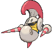

**Location:** Evolve Karrablast (Lvl with Shelmet in Party)

| Level | Move |     | Cont. | Move |
| ----- | ---- | --- | ----- | ---- |
| 1 |   Double |   | 26 |  Bug Buzz |
| 1 |   Fell Stinger |   | 29 |  Slash |
| 1 |   Needle Arm |   | 32 |  X |
| 1 |   Drill Peck |   | 35 |  Drill Run |
| 1 |   Peck |   | 38 |  Iron Head |
| 5 |   Leer |   | 41 |  Iron Defense |
| 8 |   Quick Guard |   | 44 |  Reversal |
| 11 |  Twineedle |   | 47 |  Swords Dance |
| 14 |  Fury Attack |   | 50 |  Giga Impact |
| 17 |  Bug Bite |   | 53 |  Megahorn |
| 20 |  Headbutt |   | 56 |  Fell Stinger |
| 23 |  Knock Off |   |   |   |

---

## #590 Foongus

**Location:** Route 119

**Ability 2:** Regenerator

**Evolution Level:** 40 >> 37

| Level | Move |     | Cont. | Move |
| ----- | ---- | --- | ----- | ---- |
| 1 |   Absorb |   | 28 |  Giga Drain |
| 4 |   Growth |   | 31 |  Toxic |
| 7 |   Astonish |   | 34 |  Sludge Bomb |
| 10 |  Bide |   | 37 |  Defense Curl |
| 13 |  Mega Drain |   | 37 |  Rollout |
| 16 |  Venoshock |   | 40 |  Synthesis |
| 19 |  Ingrain |   | 43 |  Clear Smog |
| 22 |  Feint Attack |   | 46 |  Solar Beam |
| 25 |  Sweet Scent |   | 49 |  Rage Powder |
| 25 |  Poison Powder |   | 52 |  Spore |
| 25 |  Stun Spore |   |   |   |

---

## #591 Amoonguss

**Location:** Route 119

**Ability 2:** Regenerator

| Level | Move |     | Cont. | Move |
| ----- | ---- | --- | ----- | ---- |
| 1 |   Absorb |   | 28 |  Giga Drain |
| 4 |   Growth |   | 31 |  Toxic |
| 7 |   Astonish |   | 34 |  Sludge Bomb |
| 10 |  Bide |   | 37 |  Body Slam |
| 13 |  Mega Drain |   | 38 |  Defense Curl |
| 16 |  Venoshock |   | 38 |  Rollout |
| 19 |  Ingrain |   | 42 |  Synthesis |
| 22 |  Feint Attack |   | 46 |  Clear Smog |
| 25 |  Sweet Scent |   | 50 |  Solar Beam |
| 25 |  Poison Powder |   | 54 |  Rage Powder |
| 25 |  Stun Spore |   | 58 |  Spore |

---

## #592 Frillish

**Location:** Route 105, Route 106, Dewford Town, Route 107, Route 109, Route 122, Route 128

**Evolution Level:** 40 >> 37

| Level | Move |     | Cont. | Move |
| ----- | ---- | --- | ----- | ---- |
| 1 |   Bubble |   | 25 |  Ominous Wind |
| 1 |   Water Sport |   | 29 |  Brine |
| 1 |   Confuse Ray |   | 33 |  Rain Dance |
| 1 |   Pain Split |   | 37 |  Hex |
| 5 |   Absorb |   | 41 |  Giga Drain |
| 9 |   Night Shade |   | 45 |  Shadow Ball |
| 13 |  Bubble Beam |   | 49 |  Hydro Pump |
| 17 |  Recover |   | 53 |  Wring Out |
| 21 |  Water Pulse |   | 57 |  Water Spout |

---

## #593 Jellicent

**Location:** Route 108, Route 122, Route 128, Ever Grande City, Underwater, Seafloor Cavern, Battle Resort

| Level | Move |     | Cont. | Move |
| ----- | ---- | --- | ----- | ---- |
| 1 |   Water Spout |   | 21 |  Water Pulse |
| 1 |   Wring Out |   | 25 |  Ominous Wind |
| 1 |   Bubble |   | 29 |  Brine |
| 1 |   Water Sport |   | 33 |  Rain Dance |
| 1 |   Confuse Ray |   | 38 |  Hex |
| 1 |   Pain Split |   | 43 |  Giga Drain |
| 5 |   Absorb |   | 48 |  Shadow Ball |
| 9 |   Night Shade |   | 53 |  Hydro Pump |
| 13 |  Bubble Beam |   | 58 |  Wring Out |
| 17 |  Recover |   | 63 |  Water Spout |

---

## #594 Alomomola

**Location:** Route 105, Route 106, Route 107, Route 108, Route 109, Route 122, Lilycove City, Route 124, Mossdeep City, Route 125, Route 126, Route 127, Route 128, Route 129, Route 130, Route 131

| Level | Move |     | Cont. | Move |
| ----- | ---- | --- | ----- | ---- |
| 1 |   Hydro Pump |   | 27 |  Soak |
| 1 |   Wide Guard |   | 30 |  Wish |
| 1 |   Healing Wish |   | 33 |  Knock Off |
| 1 |   Pound |   | 36 |  Brine |
| 1 |   Water Sport |   | 39 |  Safeguard |
| 6 |   Aqua Ring |   | 42 |  Waterfall |
| 9 |   Aqua Jet |   | 45 |  Helping Hand |
| 12 |  Double Slap |   | 48 |  Bounce |
| 15 |  Heal Pulse |   | 51 |  Wide Guard |
| 18 |  Protect |   | 54 |  Healing Wish |
| 21 |  Water Pulse |   | 57 |  Hydro Pump |
| 24 |  Wake |   |   |   |

---

## #595 Joltik

**Location:** Rusturf Tunnel

**Evolution Level:** 36 >> 33

| Level | Move |     | Cont. | Move |
| ----- | ---- | --- | ----- | ---- |
| 1 |   String Shot |   | 22 |  Gastro Acid |
| 1 |   Leech Life |   | 25 |  Electro Ball |
| 1 |   Spider Web |   | 28 |  Slash |
| 4 |   Thunder Wave |   | 31 |  Signal Beam |
| 7 |   Screech |   | 34 |  Discharge |
| 10 |  Electroweb |   | 37 |  Agility |
| 13 |  Fury Cutter |   | 40 |  Sucker Punch |
| 16 |  Struggle Bug |   | 43 |  Bug Buzz |
| 19 |  Bug Bite |   |   |   |

---

## #596 Galvantula

**Location:** Victory Road

| Level | Move |     | Cont. | Move |
| ----- | ---- | --- | ----- | ---- |
| 1 |   Sticky Web |   | 19 |  Bug Bite |
| 1 |   Giga Drain |   | 22 |  Gastro Acid |
| 1 |   String Shot |   | 25 |  Electro Ball |
| 1 |   Leech Life |   | 28 |  Slash |
| 1 |   Spider Web |   | 31 |  Signal Beam |
| 4 |   Thunder Wave |   | 36 |  Discharge |
| 7 |   Screech |   | 41 |  Agility |
| 10 |  Electroweb |   | 46 |  Sucker Punch |
| 13 |  Fury Cutter |   | 51 |  Bug Buzz |
| 16 |  Struggle Bug |   | 56 |  Sticky Web |

---

## #597 Ferroseed

**Location:** Meteor Falls

**Evolution Level:** 40 >> 37

| Level | Move |     | Cont. | Move |
| ----- | ---- | --- | ----- | ---- |
| 1 |   Tackle |   | 24 |  Mirror Shot |
| 1 |   Harden |   | 27 |  Iron Head |
| 3 |   Rollout |   | 30 |  Ingrain |
| 6 |   Curse |   | 33 |  Seed Bomb |
| 9 |   Metal Claw |   | 36 |  Self |
| 12 |  Pin Missle |   | 39 |  Rock Climb |
| 15 |  Gyro Ball |   | 42 |  Payback |
| 18 |  Bullet Seed |   | 45 |  Flash Cannon |
| 21 |  Iron Defense |   | 48 |  Explosion |

---

## #598 Ferrothorn

**Location:** Meteor Falls

| Level | Move |     | Cont. | Move |
| ----- | ---- | --- | ----- | ---- |
| 1 |   Tackle |   | 27 |  Iron Head |
| 1 |   Harden |   | 30 |  Ingrain |
| 3 |   Rollout |   | 33 |  Seed Bomb |
| 6 |   Curse |   | 36 |  Self |
| 9 |   Metal Claw |   | 37 |  Power Whip |
| 12 |  Pin Missle |   | 40 |  Rock Climb |
| 15 |  Gyro Ball |   | 46 |  Payback |
| 18 |  Bullet Seed |   | 51 |  Flash Cannon |
| 21 |  Iron Defense |   | 56 |  Explosion |
| 24 |  Mirror Shot |   |   |   |

---

## #599 Klink

**Location:** New Mauville

**Evolution Level:** 38 >> 33

| Level | Move |     | Cont. | Move |
| ----- | ---- | --- | ----- | ---- |
| 1 |   Vice Grip |   | 33 |  Discharge |
| 5 |   Charge |   | 37 |  Screech |
| 9 |   Thunder Shock |   | 41 |  Wild Charge |
| 13 |  Bind |   | 45 |  Shift Gear |
| 17 |  Charge Beam |   | 49 |  Metal Sound |
| 21 |  Gear Grind |   | 53 |  Lock |
| 25 |  Autotomize |   | 57 |  Zap Cannon |
| 29 |  Mirror Shot |   | 60 |  Hyper Beam |

---

## #600 Klang

**Location:** New Mauville

**Evolution Level:** 49 >> 44

**New TM/HMs:** Rock Slide

| Level | Move |     | Cont. | Move |
| ----- | ---- | --- | ----- | ---- |
| 1 |   Vice Grip |   | 34 |  Discharge |
| 5 |   Charge |   | 38 |  Screech |
| 9 |   Thunder Shock |   | 43 |  Wild Charge |
| 13 |  Bind |   | 47 |  Shift Gear |
| 17 |  Charge Beam |   | 51 |  Metal Sound |
| 21 |  Gear Grind |   | 55 |  Lock |
| 25 |  Autotomize |   | 59 |  Zap Cannon |
| 29 |  Mirror Shot |   | 63 |  Hyper Beam |

---

## #601 Klinklang

**Location:** Evolve Klang (Lv. 44)

**New TM/HMs:** Rock Slide

| Level | Move |     | Cont. | Move |
| ----- | ---- | --- | ----- | ---- |
| 1 |   Magnetic Flux |   | 34 |  Discharge |
| 1 |   Zap Cannon |   | 38 |  Screech |
| 1 |   Vice Grip |   | 43 |  Wild Charge |
| 5 |   Charge |   | 48 |  Shift Gear |
| 9 |   Thunder Shock |   | 53 |  Metal Sound |
| 13 |  Bind |   | 58 |  Lock |
| 17 |  Charge Beam |   | 63 |  Zap Cannon |
| 21 |  Gear Grind |   | 68 |  Hyper Beam |
| 25 |  Autotomize |   | 73 |  Magnetic Flux |
| 29 |  Mirror Shot |   |   |   |

---

## #602 Tynamo

**Location:** New Mauville

**Evolution Level:** 39 >> 34

| Level | Move |     | Cont. | Move |
| ----- | ---- | --- | ----- | ---- |
| 1 |   Tackle |   | 1 |   Spark |
| 1 |   Thunder Wave |   | 1 |   Charge Beam |

---

## #603 Eelektrik

**Location:** New Mauville, Seafloor Cavern

| Level | Move |     | Cont. | Move |
| ----- | ---- | --- | ----- | ---- |
| 1 |   Headbutt |   | 29 |  Giga Drain |
| 1 |   Thunder Wave |   | 33 |  Aqua Tail |
| 1 |   Spark |   | 37 |  Thunderbolt |
| 1 |   Charge Beam |   | 41 |  Wild Charge |
| 9 |   Bind |   | 45 |  Coil |
| 13 |  Acid |   | 49 |  Gastro Acid |
| 17 |  Acid Spray |   | 53 |  Zap Cannon |
| 21 |  Discharge |   | 57 |  Thrash |
| 25 |  Crunch |   |   |   |

---

## #604 Eelektross

**Location:** Evolve Eelektrik (Thunder Stone)

| Level | Move |     | Cont. | Move |
| ----- | ---- | --- | ----- | ---- |
| 1 |   Thrash |   | 1 |   Crush Claw |
| 1 |   Zap Cannon |   | 1 |   Headbutt |
| 1 |   Gastro Acid |   | 1 |   Acid |
| 1 |   Coil |   | 1 |   Discharge |
| 1 |   Ion Deluge |   | 1 |   Crunch |

---

## #605 Elgyem

**Location:** Mt. Pyre

**Evolution Level:** 42 >> 39

| Level | Move |     | Cont. | Move |
| ----- | ---- | --- | ----- | ---- |
| 1 |   Confusion |   | 31 |  Zen Headbutt |
| 4 |   Growl |   | 34 |  Psych Up |
| 7 |   Heal Block |   | 37 |  Psychic |
| 10 |  Miracle Eye |   | 40 |  Recover |
| 13 |  Psybeam |   | 43 |  Thunderbolt |
| 16 |  Headbutt |   | 46 |  Calm Mind |
| 19 |  Hidden Power |   | 49 |  Guard Split |
| 22 |  Imprison |   | 49 |  Power Split |
| 25 |  Shock Wave |   | 52 |  Synchronoise |
| 28 |  Simple Beam |   | 55 |  Wonder Room |

---

## #606 Beheeyem

**Location:** Mt. Pyre

| Level | Move |     | Cont. | Move |
| ----- | ---- | --- | ----- | ---- |
| 1 |   Wonder Room |   | 28 |  Simple Beam |
| 1 |   Synchronoise |   | 31 |  Zen Headbutt |
| 1 |   Nasty Plot |   | 34 |  Psych Up |
| 1 |   Confusion |   | 37 |  Psychic |
| 4 |   Growl |   | 41 |  Recover |
| 7 |   Heal Block |   | 45 |  Thunderbolt |
| 10 |  Miracle Eye |   | 49 |  Calm Mind |
| 13 |  Psybeam |   | 53 |  Guard Split |
| 16 |  Headbutt |   | 53 |  Power Split |
| 19 |  Hidden Power |   | 57 |  Synchronoise |
| 22 |  Imprison |   | 61 |  Wonder Room |
| 25 |  Shock Wave |   |   |   |

---

## #607 Litwick

**Location:** Fiery Path, Mt. Pyre

**Evolution Level:** 41 >> 34

| Level | Move |     | Cont. | Move |
| ----- | ---- | --- | ----- | ---- |
| 1 |   Ember |   | 25 |  Hex |
| 1 |   Astonish |   | 28 |  Clear Smog |
| 3 |   Minimize |   | 31 |  Memento |
| 5 |   Smog |   | 34 |  Shadow Ball |
| 7 |   Fire Spin |   | 37 |  Flamethrower |
| 10 |  Confuse Ray |   | 40 |  Inferno |
| 13 |  Night Shade |   | 43 |  Curse |
| 16 |  Will |   | 46 |  Pain Split |
| 19 |  Flame Burst |   | 49 |  Overheat |
| 22 |  Imprison |   |   |   |

---

## #608 Lampent

**Location:** Mt. Pyre

| Level | Move |     | Cont. | Move |
| ----- | ---- | --- | ----- | ---- |
| 1 |   Ember |   | 25 |  Hex |
| 1 |   Astonish |   | 28 |  Clear Smog |
| 3 |   Minimize |   | 31 |  Memento |
| 5 |   Smog |   | 35 |  Shadow Ball |
| 7 |   Fire Spin |   | 39 |  Flamethrower |
| 10 |  Confuse Ray |   | 43 |  Inferno |
| 13 |  Night Shade |   | 47 |  Curse |
| 16 |  Will |   | 51 |  Pain Split |
| 19 |  Flame Burst |   | 55 |  Overheat |
| 22 |  Imprison |   |   |   |

---

## #609 Chandelure

**Location:** Evolve Lampent (Dusk Stone)

| Level | Move |     | Cont. | Move |
| ----- | ---- | --- | ----- | ---- |
| 1 |   Pain Split |   | 1 |   Flame Burst |
| 1 |   Smog |   | 1 |   Hex |
| 1 |   Confuse Ray |   |   |   |

---

## #610 Axew

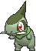

**Location:** Granite Cave

**Evolution Level:** 42 >> 32

| Level | Move |     | Cont. | Move |
| ----- | ---- | --- | ----- | ---- |
| 1 |   Scratch |   | 29 |  Dragon Claw |
| 1 |   Leer |   | 33 |  Dragon Dance |
| 5 |   Assurance |   | 37 |  Taunt |
| 9 |   Dual Chop |   | 41 |  Dragon Pulse |
| 13 |  Scary Face |   | 45 |  Swords Dance |
| 17 |  Dragon Rage |   | 49 |  Guillotine |
| 21 |  Slash |   | 53 |  Outrage |
| 21 |  Night Slash |   | 57 |  Giga Impact |
| 25 |  False Swipe |   |   |   |

---

## #611 Fraxure

**Location:** Victory Road

| Level | Move |     | Cont. | Move |
| ----- | ---- | --- | ----- | ---- |
| 1 |   Scratch |   | 29 |  Dragon Claw |
| 1 |   Leer |   | 34 |  Dragon Dance |
| 5 |   Assurance |   | 39 |  Taunt |
| 9 |   Dual Chop |   | 44 |  Dragon Pulse |
| 13 |  Scary Face |   | 49 |  Swords Dance |
| 17 |  Dragon Rage |   | 54 |  Guillotine |
| 21 |  Slash |   | 59 |  Outrage |
| 21 |  Night Slash |   | 64 |  Giga Impact |
| 25 |  False Swipe |   |   |   |

---

## #612 Haxorus

**Location:** Evolve Fraxure (Lv. 48)

| Level | Move |     | Cont. | Move |
| ----- | ---- | --- | ----- | ---- |
| 1 |   Outrage |   | 25 |  False Swipe |
| 1 |   Scratch |   | 29 |  Dragon Claw |
| 1 |   Leer |   | 34 |  Dragon Dance |
| 5 |   Assurance |   | 39 |  Taunt |
| 9 |   Dual Chop |   | 44 |  Dragon Pulse |
| 13 |  Scary Face |   | 50 |  Swords Dance |
| 17 |  Dragon Rage |   | 56 |  Guillotine |
| 21 |  Slash |   | 62 |  Outrage |
| 21 |  Night Slash |   | 68 |  Giga Impact |

---

## #613 Cubchoo

**Location:** Shoal Cave

**Ability 2:** Rattled

| Level | Move |     | Cont. | Move |
| ----- | ---- | --- | ----- | ---- |
| 1 |   Growl |   | 31 |  Low Kick |
| 4 |   Powder Snow |   | 34 |  Avalanche |
| 7 |   Bide |   | 37 |  Flail |
| 10 |  Icy Wind |   | 40 |  Night Slash |
| 13 |  Play Nice |   | 43 |  Rest |
| 16 |  Fury Swipes |   | 46 |  Play Rough |
| 19 |  Brine |   | 49 |  Blizzard |
| 22 |  Endure |   | 52 |  Hail |
| 25 |  Charm |   | 55 |  Thrash |
| 28 |  Slash |   | 58 |  Sheer Cold |

---

## #614 Beartic

**Location:** Shoal Cave

**Ability 2:** Tough Claws **

**New TM/HMs:** Waterfall

**Type:** Ice >> Ice/Fighting

| Level | Move |     | Cont. | Move |
| ----- | ---- | --- | ----- | ---- |
| 1 |   Sheer Cold |   | 28 |  Slash |
| 1 |   Thrash |   | 31 |  Low Kick |
| 1 |   Superpower |   | 34 |  Avalanche |
| 1 |   Aqua Jet |   | 37 |  Icicle Crash |
| 1 |   Growl |   | 38 |  Flail |
| 4 |   Powder Snow |   | 42 |  Night Slash |
| 7 |   Bide |   | 46 |  Rest |
| 10 |  Icy Wind |   | 50 |  Close Combat |
| 13 |  Play Nice |   | 54 |  Blizzard |
| 16 |  Fury Swipes |   | 58 |  Hail |
| 19 |  Brine |   | 62 |  Thrash |
| 22 |  Endure |   | 66 |  Sheer Cold |
| 25 |  Charm |   |   |   |

---

## #615 Cryogonal

**Location:** Sea Mauville, Shoal Cave

| Level | Move |     | Cont. | Move |
| ----- | ---- | --- | ----- | ---- |
| 1 |   Sheer Cold |   | 25 |  Aurora Beam |
| 1 |   Night Slash |   | 29 |  Acid Armor |
| 1 |   Ice Shard |   | 33 |  Ice Beam |
| 1 |   Mist |   | 37 |  Light Screen |
| 1 |   Haze |   | 37 |  Reflect |
| 1 |   Bind |   | 41 |  Slash |
| 5 |   Ice Shard |   | 45 |  Confuse Ray |
| 9 |   Sharpen |   | 49 |  Recover |
| 13 |  Rapid Spin |   | 50 |  Freeze |
| 17 |  Icy Wind |   | 53 |  Solar Beam |
| 21 |  Mist |   | 57 |  Night Slash |
| 21 |  Haze |   | 61 |  Sheer Cold |

---

## #616 Shelmet

**Location:** Route 114

| Level | Move |     | Cont. | Move |
| ----- | ---- | --- | ----- | ---- |
| 1 |   Leech Life |   | 28 |  Acid Armor |
| 4 |   Acid |   | 31 |  Giga Drain |
| 7 |   Bide |   | 34 |  Body Slam |
| 10 |  Curse |   | 37 |  Bug Buzz |
| 13 |  Struggle Bug |   | 40 |  Recover |
| 16 |  Mega Drain |   | 43 |  Sludge Bomb |
| 19 |  Yawn |   | 46 |  Guard Swap |
| 22 |  Signal Beam |   | 49 |  Final Gambit |
| 25 |  Protect |   |   |   |

---

## #617 Accelgor

**Location:** Evolve Shelmet (Lvl with Karrablast in Party)

| Level | Move |     | Cont. | Move |
| ----- | ---- | --- | ----- | ---- |
| 1 |   Water Shuriken |   | 25 |  Me First |
| 1 |   Final Gambit |   | 28 |  Agility |
| 1 |   Power Swap |   | 31 |  Giga Drain |
| 1 |   Leech Life |   | 34 |  U |
| 4 |   Acid Spray |   | 37 |  Bug Buzz |
| 7 |   Double Team |   | 40 |  Recover |
| 10 |  Quick Attack |   | 43 |  Sludge Bomb |
| 13 |  Struggle Bug |   | 46 |  Power Swap |
| 16 |  Mega Drain |   | 49 |  Final Gambit |
| 19 |  Swift |   | 52 |  Extreme Speed |
| 22 |  Signal Beam |   |   |   |

---

## #618 Stunfisk

**Location:** Route 119

| Level | Move |     | Cont. | Move |
| ----- | ---- | --- | ----- | ---- |
| 1 |   Fissure |   | 25 |  Discharge |
| 1 |   Flail |   | 29 |  Endure |
| 1 |   Tackle |   | 33 |  Bounce |
| 1 |   Water Gun |   | 37 |  Muddy Water |
| 1 |   Mud |   | 41 |  Thunderbolt |
| 1 |   Mud Sport |   | 45 |  Earth Power |
| 5 |   Bide |   | 49 |  Sludge Wave |
| 9 |   Thunder Shock |   | 53 |  Revenge |
| 13 |  Mud Shot |   | 57 |  Flail |
| 17 |  Camouflage |   | 61 |  Fissure |
| 21 |  Mud Bomb |   |   |   |

---

## #619 Mienfoo

**Location:** Route 112 North

**Evolution Level:** 50 >> 36

| Level | Move |     | Cont. | Move |
| ----- | ---- | --- | ----- | ---- |
| 1 |   Pound |   | 28 |  Drain Punch |
| 1 |   Meditate |   | 32 |  Acrobatics |
| 4 |   Detect |   | 36 |  Jump Kick |
| 8 |   Fake Out |   | 40 |  U |
| 11 |  Knock Off |   | 44 |  High Jump Kick |
| 14 |  Double Slap |   | 48 |  Quick Guard |
| 17 |  Swift |   | 52 |  Bounce |
| 20 |  Force Palm |   | 56 |  Reversal |
| 24 |  Calm Mind |   | 60 |  Aura Sphere |

---

## #620 Mienshao

**Location:** Route 120, Sky Pillar

| Level | Move |     | Cont. | Move |
| ----- | ---- | --- | ----- | ---- |
| 1 |   Aura Sphere |   | 24 |  Calm Mind |
| 1 |   Reversal |   | 28 |  Drain Punch |
| 1 |   Pound |   | 32 |  Acrobatics |
| 1 |   Meditate |   | 37 |  Jump Kick |
| 4 |   Detect |   | 42 |  U |
| 8 |   Fake Out |   | 47 |  High Jump Kick |
| 11 |  Knock Off |   | 52 |  Wide Guard |
| 14 |  Double Slap |   | 57 |  Bounce |
| 17 |  Swift |   | 62 |  Reversal |
| 20 |  Force Palm |   | 67 |  Aura Sphere |

---

## #621 Druddigon

**Location:** Meteor Falls, Sky Pillar

| Level | Move |     | Cont. | Move |
| ----- | ---- | --- | ----- | ---- |
| 1 |   Leer |   | 28 |  Dragon Claw |
| 1 |   Scratch |   | 30 |  Poison Tail |
| 5 |   Hone Claws |   | 32 |  Chip Away |
| 8 |   Bite |   | 35 |  Revenge |
| 11 |  Scary Face |   | 38 |  Crunch |
| 14 |  Dragon Rage |   | 41 |  Dragon Tail |
| 18 |  Slash |   | 45 |  Gunk Shot |
| 21 |  Glare |   | 49 |  Rock Climb |
| 23 |  Fire Fang |   | 53 |  Superpower |
| 23 |  Thunder Fang |   | 59 |  Outrage |
| 26 |  Night Slash |   |   |   |

---

## #622 Golett

**Location:** Route 113

**Evolution Level:** 43 >> 39

| Level | Move |     | Cont. | Move |
| ----- | ---- | --- | ----- | ---- |
| 1 |   Pound |   | 25 |  Mega Punch |
| 1 |   Astonish |   | 27 |  Drain Punch |
| 1 |   Defense Curl |   | 30 |  Dynamic Punch |
| 5 |   Mud |   | 34 |  Night Shade |
| 9 |   Rollout |   | 39 |  Earthquake |
| 13 |  Shadow Punch |   | 42 |  Curse |
| 17 |  Iron Defense |   | 46 |  Hammer Arm |
| 21 |  Magnitude |   | 50 |  Focus Punch |

---

## #623 Golurk

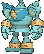

**Location:** Sky Pillar

| Level | Move |     | Cont. | Move |
| ----- | ---- | --- | ----- | ---- |
| 1 |   Phantom Force |   | 21 |  Magnitude |
| 1 |   Focus Punch |   | 25 |  Mega Punch |
| 1 |   Ice Punch |   | 27 |  Drain Punch |
| 1 |   Fire Punch |   | 30 |  Dynamic Punch |
| 1 |   Thunder Punch |   | 34 |  Night Shade |
| 1 |   Pound |   | 39 |  Heavy Slam |
| 1 |   Astonish |   | 40 |  Earthquake |
| 1 |   Defense Curl |   | 46 |  Curse |
| 5 |   Mud |   | 52 |  Hammer Arm |
| 9 |   Rollout |   | 58 |  Focus Punch |
| 13 |  Shadow Punch |   | 64 |  Phantom Force |
| 17 |  Iron Defense |   |   |   |

---

## #624 Pawniard

**Location:** Route 112 North, Route 120

**Evolution Level:** 52 >> 37

| Level | Move |     | Cont. | Move |
| ----- | ---- | --- | ----- | ---- |
| 1 |   Scratch |   | 31 |  Night Slash |
| 3 |   Leer |   | 33 |  Assurance |
| 6 |   Fury Cutter |   | 37 |  Iron Head |
| 8 |   Torment |   | 41 |  Metal Sound |
| 11 |  Feint Attack |   | 45 |  Embargo |
| 14 |  Dual Chop |   | 48 |  Psycho Cut |
| 18 |  Scary Face |   | 51 |  Iron Defense |
| 21 |  Metal Claw |   | 55 |  Swords Dance |
| 23 |  Knock Off |   | 59 |  Sucker Punch |
| 26 |  Slash |   | 63 |  Guillotine |
| 29 |  Revenge |   |   |   |

---

## #625 Bisharp

**Location:** Route 120

| Level | Move |     | Cont. | Move |
| ----- | ---- | --- | ----- | ---- |
| 1 |   Guillotine |   | 26 |  Slash |
| 1 |   Sucker Punch |   | 29 |  Revenge |
| 1 |   Leaf Blade |   | 31 |  Night Slash |
| 1 |   Metal Burst |   | 33 |  Assurance |
| 1 |   Scratch |   | 38 |  Iron Head |
| 3 |   Leer |   | 43 |  Metal Sound |
| 6 |   Fury Cutter |   | 48 |  Embargo |
| 8 |   Torment |   | 53 |  Psycho Cut |
| 11 |  Feint Attack |   | 58 |  Iron Defense |
| 14 |  Dual Chop |   | 63 |  Swords Dance |
| 18 |  Scary Face |   | 68 |  Sucker Punch |
| 21 |  Metal Claw |   | 73 |  Guillotine |
| 23 |  Knock Off |   |   |   |

---

## #626 Bouffalant

**Location:** Route 113

| Level | Move |     | Cont. | Move |
| ----- | ---- | --- | ----- | ---- |
| 1 |   Pursuit |   | 34 |  Zen Headbutt |
| 1 |   Leer |   | 38 |  Megahorn |
| 6 |   Rage |   | 42 |  Skull Bash |
| 10 |  Fury Attack |   | 46 |  Reversal |
| 14 |  Horn Attack |   | 50 |  Thrash |
| 18 |  Scary Face |   | 54 |  Wild Charge |
| 22 |  Revenge |   | 58 |  Swords Dance |
| 26 |  Focus Energy |   | 62 |  Outrage |
| 30 |  Head Charge |   | 66 |  Giga Impact |

---

## #627 Rufflet

**Location:** Route 120

**Evolution Level:** 54 >> 39

| Level | Move |     | Cont. | Move |
| ----- | ---- | --- | ----- | ---- |
| 1 |   Peck |   | 29 |  Defog |
| 1 |   Leer |   | 33 |  Tailwind |
| 5 |   Fury Attack |   | 37 |  Sky Drop |
| 9 |   Wing Attack |   | 41 |  Crush Claw |
| 13 |  Hone Claws |   | 45 |  Air Slash |
| 17 |  Scary Face |   | 49 |  Whirlwind |
| 21 |  Aerial Ace |   | 53 |  Brave Bird |
| 25 |  Slash |   | 57 |  Thrash |

---

## #628 Braviary

**Location:** Route 120

| Level | Move |     | Cont. | Move |
| ----- | ---- | --- | ----- | ---- |
| 1 |   Thrash |   | 21 |  Aerial Ace |
| 1 |   Brave Bird |   | 25 |  Slash |
| 1 |   Whirlwind |   | 29 |  Defog |
| 1 |   Superpower |   | 33 |  Tailwind |
| 1 |   Zen Headbutt |   | 37 |  Sky Drop |
| 1 |   Peck |   | 39 |  Close Combat |
| 1 |   Leer |   | 42 |  Crush Claw |
| 5 |   Fury Attack |   | 47 |  Air Slash |
| 9 |   Wing Attack |   | 52 |  Whirlwind |
| 13 |  Hone Claws |   | 57 |  Brave Bird |
| 17 |  Scary Face |   | 62 |  Thrash |

---

## #629 Vullaby

**Location:** Route 120

**Evolution Level:** 54 >> 39

| Level | Move |     | Cont. | Move |
| ----- | ---- | --- | ----- | ---- |
| 1 |   Gust |   | 33 |  Tailwind |
| 1 |   Leer |   | 37 |  Foul Play |
| 5 |   Fury Attack |   | 41 |  Air Slash |
| 9 |   Pluck |   | 45 |  Dark Pulse |
| 13 |  Nasty Plot |   | 49 |  Embargo |
| 17 |  Flatter |   | 53 |  Brave Bird |
| 21 |  Feint Attack |   | 57 |  Whirlwind |
| 25 |  Punishment |   | 61 |  Mirror Move |
| 29 |  Defog |   |   |   |

---

## #630 Mandibuzz

**Location:** Route 120

| Level | Move |     | Cont. | Move |
| ----- | ---- | --- | ----- | ---- |
| 1 |   Mirror Move |   | 25 |  Punishment |
| 1 |   Whirlwind |   | 29 |  Defog |
| 1 |   Brave Bird |   | 33 |  Tailwind |
| 1 |   Bone Rush |   | 37 |  Foul Play |
| 1 |   Knock Off |   | 42 |  Air Slash |
| 1 |   Gust |   | 47 |  Dark Pulse |
| 1 |   Leer |   | 52 |  Embargo |
| 5 |   Fury Attack |   | 57 |  Bone Rush |
| 9 |   Pluck |   | 62 |  Brave Bird |
| 13 |  Nasty Plot |   | 67 |  Whirlwind |
| 17 |  Flatter |   | 72 |  Mirror Move |
| 21 |  Feint Attack |   |   |   |

---

## #631 Heatmor

**Location:** Route 112 South, Cave of Origin

| Level | Move |     | Cont. | Move |
| ----- | ---- | --- | ----- | ---- |
| 1 |   Inferno |   | 29 |  Bug Bite |
| 1 |   Hone Claws |   | 33 |  Slash |
| 1 |   Tackle |   | 37 |  Knock Off |
| 1 |   Incinerate |   | 41 |  Flamethrower |
| 1 |   Lick |   | 45 |  Giga Drain |
| 5 |   Odor Sleuth |   | 49 |  Amnesia |
| 9 |   Bind |   | 53 |  Stockpile |
| 13 |  Fire Spin |   | 53 |  Spit Up |
| 17 |  Fury Swipes |   | 53 |  Swallow |
| 21 |  Snatch |   | 57 |  Heat Wave |
| 25 |  Flame Burst |   | 61 |  Inferno |

---

## #632 Durant

**Location:** Scorched Slab, Cave of Origin

| Level | Move |     | Cont. | Move |
| ----- | ---- | --- | ----- | ---- |
| 1 |   Metal Sound |   | 25 |  Crunch |
| 1 |   Guillotine |   | 29 |  Iron Head |
| 1 |   Iron Defense |   | 33 |  Dig |
| 1 |   Vice Grip |   | 37 |  Thunder Fang |
| 1 |   Sand Attack |   | 41 |  X |
| 5 |   Fury Cutter |   | 45 |  Superpower |
| 9 |   Bite |   | 49 |  Entrainment |
| 13 |  Agility |   | 53 |  Iron Defense |
| 17 |  Metal Claw |   | 57 |  Guillotine |
| 21 |  Bug Bite |   | 61 |  Metal Sound |

---

## #633 Deino

**Location:** Meteor Falls

**Evolution Level:** 50 >> 39

| Level | Move |     | Cont. | Move |
| ----- | ---- | --- | ----- | ---- |
| 1 |   Tackle |   | 25 |  Crunch |
| 1 |   Bite |   | 29 |  Slam |
| 1 |   Dragon Rage |   | 33 |  Dragon Rush |
| 5 |   Focus Energy |   | 37 |  Body Slam |
| 9 |   Headbutt |   | 41 |  Outrage |
| 13 |  Dragon Breath |   | 45 |  Work Up |
| 17 |  Roar |   | 49 |  Dragon Pulse |
| 21 |  Ice Fang |   | 53 |  Scary Face |
| 21 |  Thunder Fang |   | 57 |  Hyper Voice |
| 21 |  Fire Fang |   | 61 |  Dark Pulse |

---

## #634 Zweilous

**Location:** Meteor Falls

**Evolution Level:** 64 >> 59

| Level | Move |     | Cont. | Move |
| ----- | ---- | --- | ----- | ---- |
| 1 |   Double Hit |   | 25 |  Crunch |
| 1 |   Bite |   | 29 |  Slam |
| 1 |   Dragon Rage |   | 33 |  Dragon Rush |
| 1 |   Focus Energy |   | 37 |  Body Slam |
| 5 |   Headbutt |   | 39 |  Head Smash |
| 9 |   Dragon Breath |   | 42 |  Outrage |
| 13 |  Roar |   | 47 |  Work Up |
| 17 |  Zen Headbutt |   | 52 |  Dragon Pulse |
| 21 |  Ice Fang |   | 57 |  Scary Face |
| 21 |  Thunder Fang |   | 62 |  Hyper Voice |
| 21 |  Fire Fang |   | 67 |  Dark Pulse |

---

## #635 Hydreigon

**Location:** Evolve Zweilous (Lv. 59)

| Level | Move |     | Cont. | Move |
| ----- | ---- | --- | ----- | ---- |
| 1 |   Dark Pulse |   | 21 |  Fire Fang |
| 1 |   Earth Power |   | 25 |  Crunch |
| 1 |   Heat Wave |   | 29 |  Slam |
| 1 |   Tri Attack |   | 33 |  Dragon Rush |
| 1 |   Bite |   | 37 |  Body Slam |
| 1 |   Dragon Rage |   | 39 |  Head Smash |
| 1 |   Focus Energy |   | 42 |  Outrage |
| 5 |   Headbutt |   | 47 |  Work Up |
| 9 |   Dragon Breath |   | 52 |  Dragon Pulse |
| 13 |  Roar |   | 57 |  Scary Face |
| 17 |  Zen Headbutt |   | 63 |  Hyper Voice |
| 21 |  Ice Fang |   | 69 |  Dark Pulse |
| 21 |  Thunder Fang |   |   |   |

---

## #636 Larvesta

**Location:** Scorched Slab

**Ability 2:** Swarm

**Evolution Level:** 59 >> 50

| Level | Move |     | Cont. | Move |
| ----- | ---- | --- | ----- | ---- |
| 1 |   Ember |   | 30 |  Flame Wheel |
| 1 |   String Shot |   | 35 |  Bug Buzz |
| 5 |   Leech Life |   | 40 |  Giga Drain |
| 10 |  Take Down |   | 45 |  Amnesia |
| 15 |  Flame Charge |   | 50 |  Flamethrower |
| 20 |  Bug Bite |   | 55 |  Thrash |
| 25 |  Double |   | 60 |  Flare Blitz |

---

## #637 Volcarona

**Location:** Scorched Slab

**Ability 2:** Swarm

| Level | Move |     | Cont. | Move |
| ----- | ---- | --- | ----- | ---- |
| 1 |   Quiver Dance |   | 25 |  Silver Wind |
| 1 |   Fiery Dance |   | 30 |  Heat Wave |
| 1 |   Hurricane |   | 35 |  Bug Buzz |
| 1 |   Morning Sun |   | 40 |  Giga Drain |
| 1 |   Ember |   | 45 |  Rage Powder |
| 1 |   String Shot |   | 50 |  Quiver Dance |
| 5 |   Leech Life |   | 50 |  Flamethrower |
| 10 |  Gust |   | 55 |  Hurricane |
| 15 |  Fire Spin |   | 60 |  Fiery Dance |
| 20 |  Whirlwind |   |   |   |

---

## #638 Cobalion

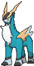

**Location:** Pathless Plain, Mirage Forest

| Level | Move |     | Cont. | Move |
| ----- | ---- | --- | ----- | ---- |
| 1 |   Quick Attack |   | 35 |  Iron Head |
| 1 |   Leer |   | 40 |  Sacred Sword |
| 5 |   Double Kick |   | 45 |  Swords Dance |
| 10 |  Metal Claw |   | 50 |  Quick Guard |
| 15 |  Take Down |   | 55 |  Work Up |
| 20 |  Helping Hand |   | 60 |  Metal Burst |
| 25 |  Retaliate |   | 65 |  Close Combat |
| 30 |  Zen Headbutt |   |   |   |

---

## #639 Terrakion

**Location:** Pathless Plain, Mirage Forest

| Level | Move |     | Cont. | Move |
| ----- | ---- | --- | ----- | ---- |
| 1 |   Quick Attack |   | 35 |  Rock Slide |
| 1 |   Leer |   | 40 |  Sacred Sword |
| 5 |   Double Kick |   | 45 |  Swords Dance |
| 10 |  Smack Down |   | 50 |  Quick Guard |
| 15 |  Take Down |   | 55 |  Work Up |
| 20 |  Helping Hand |   | 60 |  Stone Edge |
| 25 |  Retaliate |   | 65 |  Close Combat |
| 30 |  Zen Headbutt |   |   |   |

---

## #640 Virizion

**Location:** Pathless Plain, Mirage Forest

| Level | Move |     | Cont. | Move |
| ----- | ---- | --- | ----- | ---- |
| 1 |   Quick Attack |   | 35 |  Giga Drain |
| 1 |   Leer |   | 40 |  Sacred Sword |
| 5 |   Double Kick |   | 45 |  Swords Dance |
| 10 |  Magical Leaf |   | 50 |  Quick Guard |
| 15 |  Take Down |   | 55 |  Work Up |
| 20 |  Helping Hand |   | 60 |  Leaf Blade |
| 25 |  Retaliate |   | 65 |  Close Combat |
| 30 |  Zen Headbutt |   |   |   |

---

## #641 Tornadus

**Location:** Soaring in the Sky, Mirage Island

**Ability 2:** Defiant

| Level | Move |     | Cont. | Move |
| ----- | ---- | --- | ----- | ---- |
| 1 |   Uproar |   | 35 |  Air Slash |
| 1 |   Astonish |   | 40 |  Crunch |
| 1 |   Gust |   | 45 |  Tailwind |
| 5 |   Swagger |   | 50 |  Rain Dance |
| 10 |  Bite |   | 55 |  Hurricane |
| 15 |  Revenge |   | 60 |  Dark Pulse |
| 20 |  Air Cutter |   | 65 |  Hammer Arm |
| 25 |  Extrasensory |   | 70 |  Thrash |
| 30 |  Agility |   |   |   |

---

## #642 Thundurus

**Location:** Soaring in the Sky, Mirage Island

**Ability 2:** Defiant

| Level | Move |     | Cont. | Move |
| ----- | ---- | --- | ----- | ---- |
| 1 |   Uproar |   | 35 |  Discharge |
| 1 |   Astonish |   | 40 |  Crunch |
| 1 |   Thunder Shock |   | 45 |  Charge |
| 5 |   Swagger |   | 50 |  Nasty Plot |
| 10 |  Bite |   | 55 |  Thunder |
| 15 |  Revenge |   | 60 |  Dark Pulse |
| 20 |  Shock Wave |   | 65 |  Hammer Arm |
| 25 |  Heal Block |   | 70 |  Thrash |
| 30 |  Agility |   |   |   |

---

## #643 Reshiram

**Location:** Soaring in the Sky, Mirage Mountain

| Level | Move |     | Cont. | Move |
| ----- | ---- | --- | ----- | ---- |
| 1 |   Fire Fang |   | 35 |  Fusion Flare |
| 1 |   Dragon Rage |   | 40 |  Dragon Pulse |
| 5 |   Imprison |   | 45 |  Imprison |
| 10 |  Ancient Power |   | 50 |  Crunch |
| 15 |  Flamethrower |   | 55 |  Fire Blast |
| 20 |  Dragon Breath |   | 60 |  Outrage |
| 25 |  Slash |   | 65 |  Hyper Voice |
| 30 |  Extrasensory |   | 70 |  Blue Flare |

---

## #644 Zekrom

**Location:** Soaring in the Sky, Mirage Mountain

| Level | Move |     | Cont. | Move |
| ----- | ---- | --- | ----- | ---- |
| 1 |   Thunder Fang |   | 35 |  Fusion Bolt |
| 1 |   Dragon Rage |   | 40 |  Dragon Claw |
| 5 |   Imprison |   | 45 |  Imprison |
| 10 |  Ancient Power |   | 50 |  Crunch |
| 15 |  Thunderbolt |   | 55 |  Thunder |
| 20 |  Dragon Breath |   | 60 |  Outrage |
| 25 |  Slash |   | 65 |  Hyper Voice |
| 30 |  Zen Headbutt |   | 70 |  Bolt Strike |

---

## #645 Landorus

**Location:** Soaring in the Sky, Mirage Island

**Ability 2:** Sheer Force

| Level | Move |     | Cont. | Move |
| ----- | ---- | --- | ----- | ---- |
| 1 |   Block |   | 35 |  Earth Power |
| 1 |   Mud Shot |   | 40 |  Rock Slide |
| 1 |   Rock Tomb |   | 45 |  Earthquake |
| 5 |   Imprison |   | 50 |  Sandstorm |
| 10 |  Punishment |   | 55 |  Fissure |
| 15 |  Bulldoze |   | 60 |  Stone Edge |
| 20 |  Rock Throw |   | 65 |  Hammer Arm |
| 25 |  Extrasensory |   | 70 |  Outrage |
| 30 |  Swords Dance |   |   |   |

---

## #646 Kyurem

**Location:** Gnarled Den

### Normal Forme

| Level | Move |     | Cont. | Move |
| ----- | ---- | --- | ----- | ---- |
| 1 |   Icy Wind |   | 35 |  Glaciate |
| 1 |   Dragon Rage |   | 40 |  Dragon Pulse |
| 5 |   Imprison |   | 45 |  Imprison |
| 10 |  Ancient Power |   | 50 |  Endeavor |
| 15 |  Ice Beam |   | 55 |  Blizzard |
| 20 |  Dragon Breath |   | 60 |  Outrage |
| 25 |  Slash |   | 65 |  Hyper Voice |
| 30 |  Scary Face |   |   |   |

### White Forme

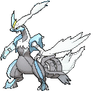

| Level | Move |     | Cont. | Move |
| ----- | ---- | --- | ----- | ---- |
| 1 |   Icy Wind |   | 35 |  Ice Burn |
| 1 |   Dragon Rage |   | 40 |  Dragon Pulse |
| 5 |   Imprison |   | 45 |  Imprison |
| 10 |  Ancient Power |   | 50 |  Endeavor |
| 15 |  Ice Beam |   | 55 |  Blizzard |
| 20 |  Dragon Breath |   | 60 |  Outrage |
| 25 |  Slash |   | 65 |  Hyper Voice |
| 30 |  Fusion Flare |   |   |   |

### Black Forme

| Level | Move |     | Cont. | Move |
| ----- | ---- | --- | ----- | ---- |
| 1 |   Icy Wind |   | 35 |  Freeze Shock |
| 1 |   Dragon Rage |   | 40 |  Dragon Pulse |
| 5 |   Imprison |   | 45 |  Imprison |
| 10 |  Ancient Power |   | 50 |  Endeavor |
| 15 |  Icicle Crash  |   | 55 |  Blizzard |
| 20 |  Dragon Breath |   | 60 |  Outrage |
| 25 |  Slash |   | 65 |  Hyper Voice |
| 30 |  Fusion Bolt |   |   |   |

---

## #647 Keldeo

**Location:** Mirage Forest

**New TM/HMs:** Waterfall, Dive

| Level | Move |     | Cont. | Move |
| ----- | ---- | --- | ----- | ---- |
| 1 |   Secret Sword |   | 30 |  Icy Wind |
| 1 |   Aqua Jet |   | 35 |  Aqua Tail |
| 1 |   Leer |   | 40 |  Sacred Sword |
| 5 |   Double Kick |   | 45 |  Swords Dance |
| 10 |  Bubble Beam |   | 50 |  Quick Guard |
| 15 |  Take Down |   | 55 |  Work Up |
| 20 |  Helping Hand |   | 60 |  Hydro Pump |
| 25 |  Retaliate |   | 65 |  Close Combat |

---

## #648 Meloetta

**Location:** Mirage Forest

| Level | Move |     | Cont. | Move |
| ----- | ---- | --- | ----- | ---- |
| 1 |   Relic Song |   | 35 |  Echoed Voice |
| 1 |   Round |   | 40 |  U |
| 5 |   Quick Attack |   | 45 |  Wake |
| 10 |  Confusion |   | 50 |  Psychic |
| 15 |  Sing |   | 55 |  Hyper Voice |
| 20 |  Teeter Dance |   | 60 |  Role Play |
| 25 |  Acrobatics |   | 65 |  Close Combat |
| 30 |  Psybeam |   | 70 |  Perish Song |

---

## #649 Genesect

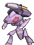

**Location:** Mirage Cave

| Level | Move |     | Cont. | Move |
| ----- | ---- | --- | ----- | ---- |
| 1 |   Fell Stinger |   | 25 |  Slash |
| 1 |   Techno Blast |   | 30 |  Metal Sound |
| 1 |   Quick Attack |   | 35 |  Signal Beam |
| 1 |   Magnet Rise |   | 40 |  Tri Attack |
| 1 |   Metal Claw |   | 45 |  X |
| 1 |   Screech |   | 50 |  Bug Buzz |
| 5 |   Fury Cutter |   | 55 |  Simple Beam |
| 10 |  Lock |   | 60 |  Zap Cannon |
| 15 |  Flame Charge |   | 65 |  Hyper Beam |
| 20 |  Magnet Bomb |   | 70 |  Self |

