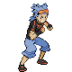
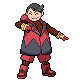
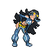
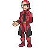
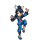

# Special Battles

---

## Petalburg City

### Norman

<pre><code>Ambipom @ Normal Gem
<b>Ability:</b> Technician
<b>Level:</b> 40
<b>Moves:</b>
1. Fake Out
2. Double Hit
3. Acrobatics
4. Knock Off
 Exploud @ Wise Glasses
<b>Ability:</b> Scrappy
<b>Level:</b> 40
<b>Moves:</b>
1. Boomburst
2. Flamethrower
3. Ice Beam
4. Thunderbolt
 Staraptor @ Power Herb
<b>Ability:</b> Intimidate
<b>Level:</b> 40
<b>Moves:</b>
1. Retaliate
2. Close Combat
3. U-turn
4. Sky Attack
 Sawsbuck @ Assault Vest
<b>Ability:</b> Sap Sipper
<b>Level:</b> 40
<b>Moves:</b>
1. Retaliate
2. Horn Leech
3. Jump Kick
4. Megahorn
 Bouffalant @ Silk Scarf
<b>Ability:</b> Sap Sipper
<b>Level:</b> 40
<b>Moves:</b>
1. Head Charge
2. Zen Headbutt
3. Megahorn
4. Revenge
 Slaking @ Sitrus Berry
<b>Ability:</b> Truant
<b>Level:</b> 42
<b>Moves:</b>
1. Retaliate
2. Rock Slide
3. Play Rough
4. Slack Off
</code></pre>

### Courtney

<pre><code>Rapidash @ Power Herb
<b>Ability:</b> Flame Body
<b>Level:</b> 75
<b>Moves:</b>
1. Flare Blitz
2. Megahorn
3. Bounce
4. Wild Charge
 Pyroar @ Silk Scarf
<b>Ability:</b> Rivalry
<b>Level:</b> 75
<b>Moves:</b>
1. Hyper Voice
2. Flamethrower
3. Dark Pulse
4. Attract
 Rhyperior @ Hard Stone
<b>Ability:</b> Solid Rock
<b>Level:</b> 75
<b>Moves:</b>
1. Rock Wrecker
2. Earthquake
3. Megahorn
4. Poison Jab
 Camerupt @ Focus Sash
<b>Ability:</b> Solid Rock
<b>Level:</b> 75
<b>Moves:</b>
1. Overheat
2. Earthquake
3. Explosion
4. Stone Edge
 Nidoking @ Life Orb
<b>Ability:</b> Sheer Force
<b>Level:</b> 75
<b>Moves:</b>
1. Sludge Wave
2. Earth Power
3. Thunder
4. Fire Blast
 Charizard @ Charizardite Y
<b>Ability:</b> Blaze
<b>Level:</b> 77
<b>Moves:</b>
1. Fire Blast
2. Air Slash
3. Solar Beam
4. Focus Blast
</code></pre>

### Matt

<pre><code>Golduck @ Wide Lens
<b>Ability:</b> Damp
<b>Level:</b> 75
<b>Moves:</b>
1. Hydro Pump
2. Focus Blast
3. Ice Beam
4. Psychic
 Barbaracle @ Assault Vest
<b>Ability:</b> Tough Claws
<b>Level:</b> 75
<b>Moves:</b>
1. Razor Shell
2. X-Scissor
3. Cross Chop
4. Stone Edge
 Ferrothorn @ Rocky Helmet
<b>Ability:</b> Iron Barbs
<b>Level:</b> 75
<b>Moves:</b>
1. Iron Head
2. Power Whip
3. Payback
4. Thunder Wave
 Sharpedo @ Focus Sash
<b>Ability:</b> Speed Boost
<b>Level:</b> 75
<b>Moves:</b>
1. Hydro Pump
2. Crunch
3. Earthquake
4. Protect
 Nidoqueen @ Life Orb
<b>Ability:</b> Sheer Force
<b>Level:</b> 75
<b>Moves:</b>
1. Sludge Wave
2. Earth Power
3. Thunder
4. Blizzard
 Blastoise @ Blastoisinite
<b>Ability:</b> Torrent
<b>Level:</b> 77
<b>Moves:</b>
1. Hydro Pump
2. Aura Sphere
3. Dark Pulse
4. Blizzard
</code></pre>

---

## Rustboro City

### Leader Roxanne

<pre><code>Archen @ Sharp Beak
<b>Ability:</b> Defeatist
<b>Level:</b> 14
<b>Moves:</b>
1. Rock Tomb
2. Wing Attack
3. Double Team
4. Quick Attack
 Omanyte @ Mystic Water
<b>Ability:</b> Weak Armor
<b>Level:</b> 14
<b>Moves:</b>
1. Ancient Power
2. Bubble Beam
3. Icy Wind
4. Tickle
 Tyrunt @ Dragon Fang
<b>Ability:</b> Strong Jaw
<b>Level:</b> 14
<b>Moves:</b>
1. Rock Tomb
2. Dragon Pulse
3. Bite
4. Stealth Rock
 Anorith @ Silver Powder
<b>Ability:</b> Battle Armor
<b>Level:</b> 14
<b>Moves:</b>
1. Rock Tomb
2. Bug Bite
3. Aqua Jet
4. Sandstorm
 Lileep @ Miracle Seed
<b>Ability:</b> Storm Drain
<b>Level:</b> 14
<b>Moves:</b>
1. Rock Tomb
2. Bullet Seed
3. Acid
4. Sandstorm
 Nosepass @ Sitrus Berry
<b>Ability:</b> Sand Force
<b>Level:</b> 16
<b>Moves:</b>
1. Rock Tomb
2. Magnitude
3. Zap Cannon
4. Lock-On
</code></pre>

---

## Dewford Town

### Leader Brawly

<pre><code>Machop @ Berry Juice
<b>Ability:</b> No Guard
<b>Level:</b> 17
<b>Moves:</b>
1. Bulk Up
2. Low Sweep
3. Bullet Punch
4. Rock Tomb
 Meditite @ Black Belt
<b>Ability:</b> Pure Power
<b>Level:</b> 17
<b>Moves:</b>
1. Substitute
2. Focus Punch
3. Psyshock
4. Shadow Ball
 Pancham @ Muscle Band
<b>Ability:</b> Iron Fist
<b>Level:</b> 17
<b>Moves:</b>
1. Bulk Up
2. Power-Up Punch
3. Shadow Claw
4. Aerial Ace
 Scraggy @ Assault Vest
<b>Ability:</b> Intimidate
<b>Level:</b> 17
<b>Moves:</b>
1. Headbutt
2. Drain Punch
3. Feint Attack
4. Fake Out
 Mienfoo @ Wise Glasses
<b>Ability:</b> Inner Focus
<b>Level:</b> 17
<b>Moves:</b>
1. Calm Mind
2. Fake Out
3. Aura Sphere
4. Hidden Power
 Hariyama @ Sitrus Berry
<b>Ability:</b> Sheer Force
<b>Level:</b> 19
<b>Moves:</b>
1. Bulk Up
2. Arm Thrust
3. Bullet Punch
4. Smack Down
</code></pre>

---

## Granite Cave

### Zinnia

<pre><code>Altaria @ Lum Berry
<b>Ability:</b> Natural Cure
<b>Level:</b> 76
<b>Moves:</b>
1. Draco Meteor
2. Flamethrower
3. Ice Beam
4. Moonblast
 Tyrantrum @ Haban Berry
<b>Ability:</b> Strong Jaw
<b>Level:</b> 76
<b>Moves:</b>
1. Head Smash
2. Crunch
3. Dragon Claw
4. Fire Fang
 Noivern @ Yache Berry
<b>Ability:</b> Infiltrator
<b>Level:</b> 76
<b>Moves:</b>
1. Draco Meteor
2. Hurricane
3. Focus Blast
4. Flamethrower
 Salamence @ Sitrus Berry
<b>Ability:</b> Intimidate
<b>Level:</b> 78
<b>Moves:</b>
1. Dragon Pulse
2. Fire Blast
3. Hydro Pump
4. Hyper Voice
</code></pre>

---

## Route 110

### Rival

 

=== "Treecko"

	<pre><code>Swellow @ Silk Scarf
	<b>Ability:</b> Guts
	<b>Level:</b> 22
	<b>Moves:</b>
	1. Brave Bird
	2. Quick Attack
	3. Focus Energy
	4. Double Team
	 Ponyta @ Charcoal
	<b>Ability:</b> Flame Body
	<b>Level:</b> 22
	<b>Moves:</b>
	1. Flame Charge
	2. Double Kick
	3. Stomp
	4. Hypnosis
	 Wailmer @ Mystic Water
	<b>Ability:</b> Water Veil
	<b>Level:</b> 22
	<b>Moves:</b>
	1. Water Pulse
	2. Rollout
	3. Fissure
	4. Body Slam
	 Grovyle @ Sitrus Berry
	<b>Ability:</b> Overgrow
	<b>Level:</b> 24
	<b>Moves:</b>
	1. Grass Pledge
	2. Aerial Ace
	3. Dragon Breath
	4. Grass Whistle
	</code></pre>

=== "Torchic"

	<pre><code>Swellow @ Silk Scarf
	<b>Ability:</b> Guts
	<b>Level:</b> 22
	<b>Moves:</b>
	1. Brave Bird
	2. Quick Attack
	3. Focus Energy
	4. Double Team
	 Wailmer @ Mystic Water
	<b>Ability:</b> Water Veil
	<b>Level:</b> 22
	<b>Moves:</b>
	1. Water Pulse
	2. Rollout
	3. Fissure
	4. Body Slam
	 Shroomish @ Miracle Seed
	<b>Ability:</b> Quick Feet
	<b>Level:</b> 22
	<b>Moves:</b>
	1. Bullet Seed
	2. Toxic
	3. Headbutt
	4. Leech Seed
	 Combusken @ Sitrus Berry
	<b>Ability:</b> Blaze
	<b>Level:</b> 24
	<b>Moves:</b>
	1. Fire Pledge
	2. Double Kick
	3. Aerial Ace
	4. Feather Dance
	</code></pre>

=== "Mudkip"

	<pre><code>Swellow @ Silk Scarf
	<b>Ability:</b> Guts
	<b>Level:</b> 22
	<b>Moves:</b>
	1. Brave Bird
	2. Quick Attack
	3. Focus Energy
	4. Double Team
	 Shroomish @ Miracle Seed
	<b>Ability:</b> Quick Feet
	<b>Level:</b> 22
	<b>Moves:</b>
	1. Bullet Seed
	2. Toxic
	3. Headbutt
	4. Leech Seed
	 Ponyta @ Charcoal
	<b>Ability:</b> Flame Body
	<b>Level:</b> 22
	<b>Moves:</b>
	1. Flame Charge
	2. Double Kick
	3. Stomp
	4. Hypnosis
	 Marshtomp @ Sitrus Berry
	<b>Ability:</b> Torrent
	<b>Level:</b> 24
	<b>Moves:</b>
	1. Water Pledge
	2. Dig
	3. Rock Tomb
	4. Curse
	</code></pre>

---

## Mauville City

### Wally

<pre><code>Fletchinder @ Flying Gem
<b>Ability:</b> Gale Wings
<b>Level:</b> 23
<b>Moves:</b>
1. Flame Charge
2. Acrobatics
3. Roost
4. Return
 Gible @ Rocky Helmet
<b>Ability:</b> Rough Skin
<b>Level:</b> 23
<b>Moves:</b>
1. Dragon Rage
2. Slash
3. Dig
4. Shadow Claw
 Marill @ Leftovers
<b>Ability:</b> Huge Power
<b>Level:</b> 23
<b>Moves:</b>
1. Aqua Tail
2. Play Rough
3. Aqua Ring
4. Sing
 Kirlia @ Sitrus Berry
<b>Ability:</b> Trace
<b>Level:</b> 25
<b>Moves:</b>
1. Psychic
2. Draining Kiss
3. Magical Leaf
4. Shadow Sneak
</code></pre>

### Wattson

<pre><code>Electrode @ Magnet
<b>Ability:</b> Aftermath
<b>Level:</b> 26
<b>Moves:</b>
1. Volt Switch
2. Electro Ball
3. Thunder Wave
4. Light Screen
 Magneton @ Air Balloon
<b>Ability:</b> Sturdy
<b>Level:</b> 26
<b>Moves:</b>
1. Volt Switch
2. Mirror Shot
3. Electric Terrain
4. Supersonic
 Flaaffy @ Leftovers
<b>Ability:</b> Static
<b>Level:</b> 26
<b>Moves:</b>
1. Volt Switch
2. Thunder Wave
3. Fire Punch
4. Electric Terrain
 Rotom @ Spell Tag
<b>Ability:</b> Levitate
<b>Level:</b> 26
<b>Moves:</b>
1. Volt Switch
2. Ominous Wind
3. Thunder Wave
4. Confuse Ray
 Luxio @ Muscle Band
<b>Ability:</b> Intimidate
<b>Level:</b> 26
<b>Moves:</b>
1. Volt Switch
2. Night Slash
3. Ice Fang
4. Baby-Doll Eyes
 Manectric @ Sitrus Berry
<b>Ability:</b> Static
<b>Level:</b> 28
<b>Moves:</b>
1. Volt Switch
2. Flame Burst
3. Snarl
4. Electric Terrain
</code></pre>

---

## Meteor Falls

### Tabitha

<pre><code>Mightyena @ Muscle Band
<b>Ability:</b> Intimidate
<b>Level:</b> 33
<b>Moves:</b>
1. Crunch
2. Ice Fang
3. Thunder Fang
4. Swagger
 Weezing @ Wise Glasses
<b>Ability:</b> Levitate
<b>Level:</b> 33
<b>Moves:</b>
1. Sludge Bomb
2. Flamethrower
3. Thunderbolt
4. Shadow Ball
 Darmanitan @ Life Orb
<b>Ability:</b> Sheer Force
<b>Level:</b> 35
<b>Moves:</b>
1. Flare Blitz
2. Rock Slide
3. Zen Headbutt
4. Swagger
</code></pre>

### Shelly

<pre><code>Liepard @ Muscle Band
<b>Ability:</b> Prankster
<b>Level:</b> 33
<b>Moves:</b>
1. Night Slash
2. Fake Out
3. Play Rough
4. Attract
 Muk @ Black Sludge
<b>Ability:</b> Poison Touch
<b>Level:</b> 33
<b>Moves:</b>
1. Poison Jab
2. Rock Slide
3. Payback
4. Protect
 Jellicent @ Life Orb
<b>Ability:</b> Cursed Body
<b>Level:</b> 35
<b>Moves:</b>
1. Scald
2. Shadow Ball
3. Psychic
4. Recover
</code></pre>

---

## Mt. Chimney

### Tabitha

<pre><code>Mightyena @ Muscle Band
<b>Ability:</b> Intimidate
<b>Level:</b> 33
<b>Moves:</b>
1. Crunch
2. Play Rough
3. Fire Fang
4. Thunder Fang
 Weezing @ Wise Glasses
<b>Ability:</b> Levitate
<b>Level:</b> 33
<b>Moves:</b>
1. Sludge Bomb
2. Flamethrower
3. Thunderbolt
4. Shadow Ball
 Snorlax @ Sitrus Berry
<b>Ability:</b> Thick Fat
<b>Level:</b> 33
<b>Moves:</b>
1. Body Slam
2. Rock Slide
3. Rest
4. Sleep Talk
 Darmanitan @ Life Orb
<b>Ability:</b> Sheer Force
<b>Level:</b> 35
<b>Moves:</b>
1. Flare Blitz
2. Hammer Arm
3. Zen Headbutt
4. Swagger
</code></pre>

### Shelly

<pre><code>Liepard @ Muscle Band
<b>Ability:</b> Prankster
<b>Level:</b> 33
<b>Moves:</b>
1. Night Slash
2. Fake Out
3. Play Rough
4. Attract
 Muk @ Black Sludge
<b>Ability:</b> Poison Touch
<b>Level:</b> 33
<b>Moves:</b>
1. Poison Jab
2. Rock Slide
3. Shadow Sneak
4. Minimize
 Lapras @ Sitrus Berry
<b>Ability:</b> Water Absorb
<b>Level:</b> 33
<b>Moves:</b>
1. Scald
2. Ice Beam
3. Rest
4. Sleep Talk
 Jellicent @ Life Orb
<b>Ability:</b> Cursed Body
<b>Level:</b> 35
<b>Moves:</b>
1. Scald
2. Shadow Ball
3. Energy Ball
4. Recover
</code></pre>

### Maxie

<pre><code>Golbat @ Flying Gem
<b>Ability:</b> Infiltrator
<b>Level:</b> 34
<b>Moves:</b>
1. Acrobatics
2. Confuse Ray
3. Sludge Bomb
4. Torment
 Houndoom @ Expert Belt
<b>Ability:</b> Flash Fire
<b>Level:</b> 34
<b>Moves:</b>
1. Dark Pulse
2. Flamethrower
3. Thunder Fang
4. Will-O-Wisp
 Pupitar @ Eviolite
<b>Ability:</b> Shed Skin
<b>Level:</b> 34
<b>Moves:</b>
1. Rock Slide
2. Dig
3. Dragon Dance
4. Iron Head
 Lampent @ Focus Sash
<b>Ability:</b> Flame Body
<b>Level:</b> 34
<b>Moves:</b>
1. Heat Wave
2. Shadow Ball
3. Will-O-Wisp
4. Energy Ball
 Camerupt @ Quick Claw
<b>Ability:</b> Solid Rock
<b>Level:</b> 36
<b>Moves:</b>
1. Earth Power
2. Lava Plume
3. Rock Slide
4. Flash Cannon
</code></pre>

### Archie

<pre><code>Golbat @ Flying Gem
<b>Ability:</b> Infiltrator
<b>Level:</b> 34
<b>Moves:</b>
1. Acrobatics
2. Confuse Ray
3. Sludge Bomb
4. Torment
 Tentacruel @ Black Sludge
<b>Ability:</b> Rain Dish
<b>Level:</b> 34
<b>Moves:</b>
1. Poison Jab
2. Scald
3. Rain Dance
4. Aurora Beam
 Dragonair @ Eviolite
<b>Ability:</b> Marvel Scale
<b>Level:</b> 34
<b>Moves:</b>
1. Dragon Rush
2. Aqua Tail
3. Thunder Wave
4. Thunder
 Eelektrik @ Quick Claw
<b>Ability:</b> Levitate
<b>Level:</b> 34
<b>Moves:</b>
1. Thunderbolt
2. Aqua Tail
3. Thunder Wave
4. Protect
 Sharpedo @ Focus Sash
<b>Ability:</b> Speed Boost
<b>Level:</b> 36
<b>Moves:</b>
1. Night Slash
2. Ice Fang
3. Waterfall
4. Protect
</code></pre>

---

## Lavaridge Town

### Flannery

<pre><code>Ninetales @ Heat Rock
<b>Ability:</b> Drought
<b>Level:</b> 36
<b>Moves:</b>
1. Overheat
2. Solar Beam
3. Extrasensory
4. Hypnosis
 Houndoom @ White Herb
<b>Ability:</b> Flash Fire
<b>Level:</b> 36
<b>Moves:</b>
1. Overheat
2. Dark Pulse
3. Sludge Bomb
4. Solar Beam
 Delphox @ White Herb
<b>Ability:</b> Blaze
<b>Level:</b> 36
<b>Moves:</b>
1. Overheat
2. Psyshock
3. Shadow Ball
4. Dazzling Gleam
 Magcargo @ White Herb
<b>Ability:</b> Flame Body
<b>Level:</b> 36
<b>Moves:</b>
1. Overheat
2. Earth Power
3. Rock Slide
4. Sunny Day
 Camerupt @ White Herb
<b>Ability:</b> Solid Rock
<b>Level:</b> 36
<b>Moves:</b>
1. Overheat
2. Earth Power
3. Flash Cannon
4. Rock Slide
 Torkoal @ White Herb
<b>Ability:</b> White Smoke
<b>Level:</b> 38
<b>Moves:</b>
1. Overheat
2. Earthquake
3. Rock Slide
4. Shell Smash
</code></pre>

---

## Southern Island

### Courtney

<pre><code>Rapidash @ Muscle Band
<b>Ability:</b> Flame Body
<b>Level:</b> 42
<b>Moves:</b>
1. Heat Wave
2. Megahorn
3. Drill Run
4. Wild Charge
 Pyroar @ Wise Glasses
<b>Ability:</b> Rivalry
<b>Level:</b> 42
<b>Moves:</b>
1. Flamethrower
2. Hyper Voice
3. Dark Pulse
4. Yawn
 Charizard @ Sitrus Berry
<b>Ability:</b> Blaze
<b>Level:</b> 44
<b>Moves:</b>
1. Flamethrower
2. Air Slash
3. Dragon Pulse
4. Focus Blast
</code></pre>

### Matt

<pre><code>Golduck @ Wise Glasses
<b>Ability:</b> Damp
<b>Level:</b> 42
<b>Moves:</b>
1. Scald
2. Hypnosis
3. Psychic
4. Icy Wind
 Barbaracle @ Muscle Band
<b>Ability:</b> Tough Claws
<b>Level:</b> 42
<b>Moves:</b>
1. Razor Shell
2. Stone Edge
3. Low Kick
4. X-Scissor
 Blastoise @ Sitrus Berry
<b>Ability:</b> Torrent
<b>Level:</b> 44
<b>Moves:</b>
1. Scald
2. Flash Cannon
3. Aura Sphere
4. Dragon Pulse
</code></pre>

---

## Route 119

### Rival

 

=== "Treecko"

	<pre><code>Swellow @ Flame Orb
	<b>Ability:</b> Guts
	<b>Level:</b> 47
	<b>Moves:</b>
	1. Protect
	2. Facade
	3. Brave Bird
	4. Steel Wing
	 Raichu @ Expert Belt
	<b>Ability:</b> Static
	<b>Level:</b> 47
	<b>Moves:</b>
	1. Thunderbolt
	2. Surf
	3. Focus Blast
	4. Nuzzle
	 Rapidash @ Wide Lens
	<b>Ability:</b> Flame Body
	<b>Level:</b> 47
	<b>Moves:</b>
	1. Flare Blitz
	2. Wild Charge
	3. Hypnosis
	4. Megahorn
	 Wailord @ Leftovers
	<b>Ability:</b> Water Veil
	<b>Level:</b> 47
	<b>Moves:</b>
	1. Aqua Ring
	2. Scald
	3. Ice Beam
	4. Earthquake
	 Sceptile @ Sitrus Berry
	<b>Ability:</b> Overgrow
	<b>Level:</b> 49
	<b>Moves:</b>
	1. Energy Ball
	2. Focus Blast
	3. Dragon Pulse
	4. Grass Whistle
	</code></pre>

=== "Torchic"

	<pre><code>Swellow @ Flame Orb
	<b>Ability:</b> Guts
	<b>Level:</b> 47
	<b>Moves:</b>
	1. Protect
	2. Facade
	3. Brave Bird
	4. Steel Wing
	 Raichu @ Expert Belt
	<b>Ability:</b> Static
	<b>Level:</b> 47
	<b>Moves:</b>
	1. Thunderbolt
	2. Surf
	3. Focus Blast
	4. Nuzzle
	 Wailord @ Leftovers
	<b>Ability:</b> Water Veil
	<b>Level:</b> 47
	<b>Moves:</b>
	1. Aqua Ring
	2. Scald
	3. Ice Beam
	4. Earthquake
	 Breloom @ Bright Powder
	<b>Ability:</b> Technician
	<b>Level:</b> 47
	<b>Moves:</b>
	1. Spore
	2. Bullet Seed
	3. Mach Punch
	4. Rock Tomb
	 Blaziken @ Sitrus Berry
	<b>Ability:</b> Blaze
	<b>Level:</b> 49
	<b>Moves:</b>
	1. Blaze Kick
	2. Focus Blast
	3. Thunder Punch
	4. Will-O-Wisp
	</code></pre>

=== "Mudkip"

	<pre><code>Swellow @ Flame Orb
	<b>Ability:</b> Guts
	<b>Level:</b> 47
	<b>Moves:</b>
	1. Protect
	2. Facade
	3. Brave Bird
	4. Steel Wing
	 Raichu @ Expert Belt
	<b>Ability:</b> Static
	<b>Level:</b> 47
	<b>Moves:</b>
	1. Thunderbolt
	2. Surf
	3. Focus Blast
	4. Nuzzle
	 Breloom @ Bright Powder
	<b>Ability:</b> Technician
	<b>Level:</b> 47
	<b>Moves:</b>
	1. Spore
	2. Bullet Seed
	3. Mach Punch
	4. Rock Tomb
	 Rapidash @ Wide Lens
	<b>Ability:</b> Flame Body
	<b>Level:</b> 47
	<b>Moves:</b>
	1. Flare Blitz
	2. Wild Charge
	3. Hypnosis
	4. Megahorn
	 Swampert @ Sitrus Berry
	<b>Ability:</b> Torrent
	<b>Level:</b> 49
	<b>Moves:</b>
	1. Aqua Tail
	2. Earthquake
	3. Sludge Wave
	4. Yawn
	</code></pre>

---

## Weather Institute

### Tabitha

<pre><code>Mightyena @ Muscle Band
<b>Ability:</b> Intimidate
<b>Level:</b> 46
<b>Moves:</b>
1. Sucker Punch
2. Play Rough
3. Swagger
4. Iron Tail
 Weezing @ Expert Belt
<b>Ability:</b> Levitate
<b>Level:</b> 46
<b>Moves:</b>
1. Sludge Bomb
2. Flamethrower
3. Thunderbolt
4. Toxic Spikes
 Snorlax @ Leftovers
<b>Ability:</b> Thick Fat
<b>Level:</b> 46
<b>Moves:</b>
1. Body Slam
2. Crunch
3. Rest
4. Sleep Talk
 Gigalith @ Custap Berry
<b>Ability:</b> Sturdy
<b>Level:</b> 46
<b>Moves:</b>
1. Stone Edge
2. Superpower
3. Earthquake
4. Heavy Slam
 Camerupt @ Focus Sash
<b>Ability:</b> Solid Rock
<b>Level:</b> 46
<b>Moves:</b>
1. Flamethrower
2. Earth Power
3. Rock Slide
4. Flash Cannon
 Darmanitan @ Life Orb
<b>Ability:</b> Sheer Force
<b>Level:</b> 48
<b>Moves:</b>
1. Flare Blitz
2. Rock Slide
3. Zen Headbutt
4. Earthquake
</code></pre>

### Shelly

<pre><code>Liepard @ Black Glasses
<b>Ability:</b> Prankster
<b>Level:</b> 46
<b>Moves:</b>
1. Dark Pulse
2. Play Rough
3. Thunder Wave
4. Swagger
 Muk @ Black Sludge
<b>Ability:</b> Poison Touch
<b>Level:</b> 46
<b>Moves:</b>
1. Gunk Shot
2. Earthquake
3. Infestation
4. Toxic
 Lapras @ Leftovers
<b>Ability:</b> Water Absorb
<b>Level:</b> 46
<b>Moves:</b>
1. Blizzard
2. Surf
3. Thunderbolt
4. Freeze-Dry
 Roserade @ Expert Belt
<b>Ability:</b> Poison Point
<b>Level:</b> 46
<b>Moves:</b>
1. Giga Drain
2. Sludge Bomb
3. Dazzling Gleam
4. Shadow Ball
 Sharpedo @ Focus Sash
<b>Ability:</b> Speed Boost
<b>Level:</b> 46
<b>Moves:</b>
1. Hydro Pump
2. Crunch
3. Destiny Bond
4. Earthquake
 Jellicent @ Sitrus Berry
<b>Ability:</b> Cursed Body
<b>Level:</b> 48
<b>Moves:</b>
1. Recover
2. Toxic
3. Surf
4. Shadow Ball
</code></pre>

---

## Fortree City

### Winona

<pre><code>Skarmory @ Sitrus Berry
<b>Ability:</b> Sturdy
<b>Level:</b> 48
<b>Moves:</b>
1. Iron Head
2. Brave Bird
3. Stealth Rock
4. Roost
 Honchkrow @ Scope Lens
<b>Ability:</b> Super Luck
<b>Level:</b> 48
<b>Moves:</b>
1. Night Slash
2. Brave Bird
3. Steel Wing
4. Thunder Wave
 Sigilyph @ Magic Guard
<b>Ability:</b> Life Orb
<b>Level:</b> 48
<b>Moves:</b>
1. Psychic
2. Hurricane
3. Dazzling Gleam
4. Ice Beam
 Gyarados @ Wacan Berry
<b>Ability:</b> Intimidate
<b>Level:</b> 48
<b>Moves:</b>
1. Dragon Dance
2. Waterfall
3. Bounce
4. Earthquake
 Talonflame @ Sharp Beak
<b>Ability:</b> Gale Wings
<b>Level:</b> 48
<b>Moves:</b>
1. Brave Bird
2. Flare Blitz
3. Will-O-Wisp
4. Roost
 Altaria @ Altarianite
<b>Ability:</b> Natural Cure
<b>Level:</b> 50
<b>Moves:</b>
1. Dragon Dance
2. Body Slam
3. Earthquake
4. Roost
</code></pre>

---

## Mt. Pyre

### Courtney

<pre><code>Rapidash @ Power Herb
<b>Ability:</b> Flame Body
<b>Level:</b> 53
<b>Moves:</b>
1. Flare Blitz
2. Bounce
3. Megahorn
4. Wild Charge
 Pyroar @ Wise Glasses
<b>Ability:</b> Rivalry
<b>Level:</b> 42
<b>Moves:</b>
1. Fire Blast
2. Hyper Voice
3. Dark Pulse
4. Wild Charge
 Rhyperior @ Passho Berry
<b>Ability:</b> Solid Rock
<b>Level:</b> 53
<b>Moves:</b>
1. Rock Wrecker
2. Earthquake
3. Hammer Arm
4. Thunder Punch
 Charizard @ Sitrus Berry
<b>Ability:</b> Blaze
<b>Level:</b> 55
<b>Moves:</b>
1. Fire Blast
2. Air Slash
3. Dragon Pulse
4. Focus Blast
</code></pre>

### Matt

<pre><code>Golduck @ Wide Lens
<b>Ability:</b> Damp
<b>Level:</b> 53
<b>Moves:</b>
1. Hydro Pump
2. Blizzard
3. Focus Blast
4. Hypnosis
 Barbaracle @ White Herb
<b>Ability:</b> Tough Claws
<b>Level:</b> 53
<b>Moves:</b>
1. Razor Shell
2. Stone Edge
3. Superpower
4. X-Scissor
 Ferrothorn @ Rocky Helmet
<b>Ability:</b> Iron Barbs
<b>Level:</b> 53
<b>Moves:</b>
1. Power Whip
2. Payback
3. Iron Head
4. Thunder Wave
 Blastoise @ Sitrus Berry
<b>Ability:</b> Torrent
<b>Level:</b> 55
<b>Moves:</b>
1. Hydro Pump
2. Ice Beam
3. Dark Pulse
4. Aura Sphere
</code></pre>

---

## Lilycove City

### Rival

 

=== "Treecko"

	<pre><code>Swellow @ Toxic Orb
	<b>Ability:</b> Guts
	<b>Level:</b> 53
	<b>Moves:</b>
	1. Protect
	2. Brave Bird
	3. Facade
	4. Steel Wing
	 Raichu @ Expert Belt
	<b>Ability:</b> Static
	<b>Level:</b> 53
	<b>Moves:</b>
	1. Thunder
	2. Surf
	3. Focus Blast
	4. Nuzzle
	 Sylveon @ Pixie Plate
	<b>Ability:</b> Pixilate
	<b>Level:</b> 53
	<b>Moves:</b>
	1. Hyper Voice
	2. Psyshock
	3. Shadow Ball
	4. Reflect
	 Rapidash @ Shell Bell
	<b>Ability:</b> Flame Body
	<b>Level:</b> 53
	<b>Moves:</b>
	1. Flare Blitz
	2. Drill Run
	3. Megahorn
	4. Wild Charge
	 Wailord @ Leftovers
	<b>Ability:</b> Water Veil
	<b>Level:</b> 53
	<b>Moves:</b>
	1. Scald
	2. Protect
	3. Aqua Ring
	4. Blizzard
	 Sceptile @ Sceptilite
	<b>Ability:</b> Overgrow
	<b>Level:</b> 55
	<b>Moves:</b>
	1. Energy Ball
	2. Dragon Pulse
	3. Focus Blast
	4. Grass Whistle
	</code></pre>

=== "Torchic"

	<pre><code>Swellow @ Toxic Orb
	<b>Ability:</b> Guts
	<b>Level:</b> 53
	<b>Moves:</b>
	1. Protect
	2. Brave Bird
	3. Facade
	4. Steel Wing
	 Raichu @ Expert Belt
	<b>Ability:</b> Static
	<b>Level:</b> 53
	<b>Moves:</b>
	1. Thunder
	2. Surf
	3. Focus Blast
	4. Nuzzle
	 Sylveon @ Pixie Plate
	<b>Ability:</b> Pixilate
	<b>Level:</b> 53
	<b>Moves:</b>
	1. Hyper Voice
	2. Psyshock
	3. Shadow Ball
	4. Reflect
	 Wailord @ Leftovers
	<b>Ability:</b> Water Veil
	<b>Level:</b> 53
	<b>Moves:</b>
	1. Scald
	2. Protect
	3. Aqua Ring
	4. Blizzard
	 Breloom @ Life Orb
	<b>Ability:</b> Technician
	<b>Level:</b> 53
	<b>Moves:</b>
	1. Spore
	2. Bullet Seed
	3. Mach Punch
	4. Rock Tomb
	 Blaziken @ Blazikenite
	<b>Ability:</b> Blaze
	<b>Level:</b> 55
	<b>Moves:</b>
	1. High Jump Kick
	2. Blaze Kick
	3. Thunder Punch
	4. Earthquake
	</code></pre>

=== "Mudkip"

	<pre><code>Swellow @ Toxic Orb
	<b>Ability:</b> Guts
	<b>Level:</b> 53
	<b>Moves:</b>
	1. Protect
	2. Brave Bird
	3. Facade
	4. Steel Wing
	 Raichu @ Expert Belt
	<b>Ability:</b> Static
	<b>Level:</b> 53
	<b>Moves:</b>
	1. Thunder
	2. Surf
	3. Focus Blast
	4. Nuzzle
	 Sylveon @ Pixie Plate
	<b>Ability:</b> Pixilate
	<b>Level:</b> 53
	<b>Moves:</b>
	1. Hyper Voice
	2. Psyshock
	3. Shadow Ball
	4. Reflect
	 Breloom @ Life Orb
	<b>Ability:</b> Technician
	<b>Level:</b> 53
	<b>Moves:</b>
	1. Spore
	2. Bullet Seed
	3. Mach Punch
	4. Rock Tomb
	 Rapidash @ Shell Bell
	<b>Ability:</b> Flame Body
	<b>Level:</b> 53
	<b>Moves:</b>
	1. Flare Blitz
	2. Drill Run
	3. Megahorn
	4. Wild Charge
	 Swampert @ Swampertite
	<b>Ability:</b> Torrent
	<b>Level:</b> 55
	<b>Moves:</b>
	1. Earthquake
	2. Aqua Tail
	3. Rock Slide
	4. Yawn
	</code></pre>

---

## Magma Hideout

### Courtney

<pre><code>Rapidash @ Power Herb
<b>Ability:</b> Flame Body
<b>Level:</b> 55
<b>Moves:</b>
1. Flare Blitz
2. Megahorn
3. Bounce
4. Wild Charge
 Pyroar @ Wise Glasses
<b>Ability:</b> Rivalry
<b>Level:</b> 55
<b>Moves:</b>
1. Heat Wave
2. Hyper Voice
3. Dark Pulse
4. Will-O-Wisp
 Rhyperior @ Muscle Band
<b>Ability:</b> Solid Rock
<b>Level:</b> 55
<b>Moves:</b>
1. Stone Edge
2. Earthquake
3. Megahorn
4. Hammer Arm
 Camerupt @ Focus Sash
<b>Ability:</b> Focus Sash
<b>Level:</b> 55
<b>Moves:</b>
1. Earthquake
2. Fire Blast
3. Stone Edge
4. Body Slam
 Nidoking @ Life Orb
<b>Ability:</b> Sheer Force
<b>Level:</b> 55
<b>Moves:</b>
1. Sludge Wave
2. Thunder
3. Fire Blast
4. Earth Power
 Charizard @ Charizardite Y
<b>Ability:</b> Blaze
<b>Level:</b> 57
<b>Moves:</b>
1. Fire Blast
2. Air Slash
3. Solar Beam
4. Focus Blast
</code></pre>

---

## Aqua Hideout

### Matt

<pre><code>Golduck @ Wide Lens
<b>Ability:</b> Damp
<b>Level:</b> 55
<b>Moves:</b>
1. Hydro Pump
2. Blizzard
3. Focus Blast
4. Hypnosis
 Barbaracle @ Rindo Berry
<b>Ability:</b> Tough Claws
<b>Level:</b> 55
<b>Moves:</b>
1. Razor Shell
2. X-Scissor
3. Cross Chop
4. Stone Edge
 Ferrothorn @ Rocky Helmet
<b>Ability:</b> Iron Barbs
<b>Level:</b> 55
<b>Moves:</b>
1. Thunder Wave
2. Power Whip
3. Poison Jab
4. Gyro Ball
 Sharpedo @ Focus Sash
<b>Ability:</b> Speed Boost
<b>Level:</b> 55
<b>Moves:</b>
1. Hydro Pump
2. Crunch
3. Blizzard
4. Earthquake
 Nidoqueen @ Life Orb
<b>Ability:</b> Life Orb
<b>Level:</b> 55
<b>Moves:</b>
1. Sludge Wave
2. Thunder
3. Blizzard
4. Earth Power
 Blastoise @ Blastoisinite
<b>Ability:</b> Torrent
<b>Level:</b> 57
<b>Moves:</b>
1. Hydro Pump
2. Dark Pulse
3. Blizzard
4. Aura Sphere
</code></pre>

---

## Mossdeep City

### Liza & Tate

<pre><code>Solrock @ Focus Sash
<b>Ability:</b> Levitate
<b>Level:</b> 60
<b>Moves:</b>
1. Light Screen
2. Protect
3. Stone Edge
4. Flare Blitz
 Lunatone @ Focus Sash
<b>Ability:</b> Levitate
<b>Level:</b> 60
<b>Moves:</b>
1. Reflect
2. Protect
3. Psychic
4. Moonblast
 Bronzong @ Sitrus Berry
<b>Ability:</b> Levitate
<b>Level:</b> 60
<b>Moves:</b>
1. Reflect
2. Hypnosis
3. Gyro Ball
4. Earthquake
 Slowking @ Assault Vest
<b>Ability:</b> Own Tempo
<b>Level:</b> 60
<b>Moves:</b>
1. Scald
2. Focus Blast
3. Psychic
4. Fire Blast
 Gallade @ Life Orb
<b>Ability:</b> Justified
<b>Level:</b> 62
<b>Moves:</b>
1. Close Combat
2. Zen Headbutt
3. Knock Off
4. Leaf Blade
 Gardevoir @ Gardevoirite
<b>Ability:</b> Trace
<b>Level:</b> 62
<b>Moves:</b>
1. Hyper Voice
2. Psychic
3. Thunderbolt
4. Protect
</code></pre>

### Courtney

<pre><code>Charizard @ Charizardite Y
<b>Ability:</b> Blaze
<b>Level:</b> 79
<b>Moves:</b>
1. Fire Blast
2. Air Slash
3. Focus Blast
4. Solar Beam
 Pyroar @ Silk Scarf
<b>Ability:</b> Rivalry
<b>Level:</b> 77
<b>Moves:</b>
1. Hyper Voice
2. Flamethrower
3. Dark Pulse
4. Attract
 Nidoking @ Life Orb
<b>Ability:</b> Sheer Force
<b>Level:</b> 77
<b>Moves:</b>
1. Sludge Bomb
2. Earth Power
3. Fire Blast
4. Thunder
</code></pre>

### Matt

<pre><code>Blastoise @ Blastoisinite
<b>Ability:</b> Torrent
<b>Level:</b> 79
<b>Moves:</b>
1. Hydro Pump
2. Aura Sphere
3. Dark Pulse
4. Ice Beam
 Barbaracle @ Assault Vest
<b>Ability:</b> Tough Claws
<b>Level:</b> 77
<b>Moves:</b>
1. Razor Shell
2. Cross Chop
3. Stone Edge
4. X-Scissor
 Nidoqueen @ Life Orb
<b>Ability:</b> Sheer Force
<b>Level:</b> 77
<b>Moves:</b>
1. Sludge Bomb
2. Earth Power
3. Blizzard
4. Thunder
</code></pre>

---

## Route 131

### Wallace

<pre><code>Politoed @ Damp Rock
<b>Ability:</b> Drizzle
<b>Level:</b> 77
<b>Moves:</b>
1. Hydro Pump
2. Blizzard
3. Focus Blast
4. Hypnosis
 Ludicolo @ Life Orb
<b>Ability:</b> Swift Swim
<b>Level:</b> 77
<b>Moves:</b>
1. Hydro Pump
2. Ice Beam
3. Energy Ball
4. Rain Dance
 Kingdra @ Mystic Water
<b>Ability:</b> Swift Swim
<b>Level:</b> 77
<b>Moves:</b>
1. Hydro Pump
2. Ice Beam
3. Dragon Pulse
4. Rain Dance
 Gyarados @ Wacan Berry
<b>Ability:</b> Intimidate
<b>Level:</b> 77
<b>Moves:</b>
1. Dragon Dance
2. Waterfall
3. Earthquake
4. Bounce
 Milotic @ Sitrus Berry
<b>Ability:</b> Cute Charm
<b>Level:</b> 79
<b>Moves:</b>
1. Hydro Pump
2. Ice Beam
3. Recover
4. Hypnosis
 Swampert @ Swampertite
<b>Ability:</b> Torrent
<b>Level:</b> 79
<b>Moves:</b>
1. Waterfall
2. Earthquake
3. Stone Edge
4. Ice Punch
</code></pre>

---

## Seafloor Cavern

### Maxie

<pre><code>Crobat @ Heat Rock
<b>Ability:</b> Infiltrator
<b>Level:</b> 63
<b>Moves:</b>
1. Brave Bird
2. U-turn
3. Hypnosis
4. Sunny Day
 Houndoom @ White Herb
<b>Ability:</b> Flash Fire
<b>Level:</b> 63
<b>Moves:</b>
1. Overheat
2. Dark Pulse
3. Sludge Bomb
4. Solar Beam
 Claydol @ Leftovers
<b>Ability:</b> Levitate
<b>Level:</b> 63
<b>Moves:</b>
1. Trick Room
2. Earthquake
3. Psychic
4. Ice Beam
 Tyranitar @ Assault Vest
<b>Ability:</b> Sand Stream
<b>Level:</b> 63
<b>Moves:</b>
1. Stone Edge
2. Crunch
3. Iron Tail
4. Blizzard
 Chandelure @ Focus Sash
<b>Ability:</b> Flame Body
<b>Level:</b> 63
<b>Moves:</b>
1. Trick Room
2. Fire Blast
3. Shadow Ball
4. Energy Ball
 Camerupt @ Cameruptite
<b>Ability:</b> Solid Rock
<b>Level:</b> 65
<b>Moves:</b>
1. Fire Blast
2. Earth Power
3. Flash Cannon
4. Rock Slide
</code></pre>

### Archie

<pre><code>Crobat @ Damp Rock
<b>Ability:</b> Infiltrator
<b>Level:</b> 63
<b>Moves:</b>
1. Brave Bird
2. U-turn
3. Hypnosis
4. Rain Dance
 Tentacruel @ Black Sludge
<b>Ability:</b> Rain Dish
<b>Level:</b> 63
<b>Moves:</b>
1. Rain Dance
2. Hydro Pump
3. Sludge Wave
4. Ice Beam
 Walrein @ Leftovers
<b>Ability:</b> Thick Fat
<b>Level:</b> 63
<b>Moves:</b>
1. Toxic
2. Protect
3. Surf
4. Frost Breath
 Dragonite @ Assault Vest
<b>Ability:</b> Multiscale
<b>Level:</b> 63
<b>Moves:</b>
1. Outrage
2. Extreme Speed
3. Earthquake
4. Fire Blast
 Eelektross @ Quick Claw
<b>Ability:</b> Levitate
<b>Level:</b> 63
<b>Moves:</b>
1. Thunder
2. Knock Off
3. Aqua Tail
4. Thunder Wave
 Sharpedo @ Sharpedonite
<b>Ability:</b> Speed Boost
<b>Level:</b> 65
<b>Moves:</b>
1. Protect
2. Crunch
3. Hydro Pump
4. Ice Fang
</code></pre>

---

## Sootopolis City

### Wallace

<pre><code>Politoed @ Damp Rock
<b>Ability:</b> Drizzle
<b>Level:</b> 65
<b>Moves:</b>
1. Hydro Pump
2. Ice Beam
3. Focus Blast
4. Hypnosis
 Ludicolo @ Life Orb
<b>Ability:</b> Swift Swim
<b>Level:</b> 65
<b>Moves:</b>
1. Hydro Pump
2. Giga Drain
3. Ice Beam
4. Rain Dance
 Kingdra @ Mystic Water
<b>Ability:</b> Swift Swim
<b>Level:</b> 65
<b>Moves:</b>
1. Hydro Pump
2. Ice Beam
3. Dragon Pulse
4. Rain Dance
 Starmie @ Expert Belt
<b>Ability:</b> Analytic
<b>Level:</b> 65
<b>Moves:</b>
1. Hydro Pump
2. Ice Beam
3. Thunder
4. Psychic
 Milotic @ Leftovers
<b>Ability:</b> Cute Charm
<b>Level:</b> 67
<b>Moves:</b>
1. Hydro Pump
2. Ice Beam
3. Recover
4. Protect
 Swampert @ Swampertite
<b>Ability:</b> Torrent
<b>Level:</b> 67
<b>Moves:</b>
1. Waterfall
2. Ice Punch
3. Earthquake
4. Stone Edge
</code></pre>

---

## Victory Road

### Wally

<pre><code>Roserade @ Focus Sash
<b>Ability:</b> Poison Point
<b>Level:</b> 70
<b>Moves:</b>
1. Sleep Powder
2. Petal Dance
3. Sludge Bomb
4. Dazzling Gleam
 Talonflame @ Sharp Beak
<b>Ability:</b> Gale Wings
<b>Level:</b> 70
<b>Moves:</b>
1. Brave Bird
2. Flare Blitz
3. Swords Dance
4. Roost
 Azumarill @ Assault Vest
<b>Ability:</b> Huge Power
<b>Level:</b> 70
<b>Moves:</b>
1. Aqua Tail
2. Play Rough
3. Superpower
4. Knock Off
 Magnezone @ Air Balloon
<b>Ability:</b> Air Balloon
<b>Level:</b> 70
<b>Moves:</b>
1. Thunderbolt
2. Flash Cannon
3. Signal Beam
4. Thunder Wave
 Garchomp @ Yache Berry
<b>Ability:</b> Rough Skin
<b>Level:</b> 70
<b>Moves:</b>
1. Outrage
2. Earthquake
3. Stone Edge
4. Fire Blast
 Gallade @ Galladite
<b>Ability:</b> Justified
<b>Level:</b> 72
<b>Moves:</b>
1. Close Combat
2. Zen Headbutt
3. Knock Off
4. Protect
</code></pre>

---

## Pokémon League

### Sidney (R1)

")

<pre><code>Weavile @ Life Orb
<b>Ability:</b> Pressure
<b>Level:</b> 70
<b>Moves:</b>
1. Icicle Crash
2. Knock Off
3. Low Kick
4. Poison Jab
 Scrafty @ Leftovers
<b>Ability:</b> Intimidate
<b>Level:</b> 70
<b>Moves:</b>
1. High Jump Kick
2. Knock Off
3. Iron Head
4. Head Smash
 Bisharp @ Focus Sash
<b>Ability:</b> Defiant
<b>Level:</b> 70
<b>Moves:</b>
1. Sucker Punch
2. Iron Head
3. Stone Edge
4. Thunder Wave
 Tyranitar @ Assault Vest
<b>Ability:</b> Sand Stream
<b>Level:</b> 70
<b>Moves:</b>
1. Stone Edge
2. Crunch
3. Ice Punch
4. Superpower
 Greninja @ Expert Belt
<b>Ability:</b> Protean
<b>Level:</b> 70
<b>Moves:</b>
1. Dark Pulse
2. Hydro Pump
3. Ice Beam
4. Gunk Shot
 Absol @ Absolite
<b>Ability:</b> Super Luck
<b>Level:</b> 72
<b>Moves:</b>
1. Sucker Punch
2. Play Rough
3. Fire Blast
4. Iron Tail
</code></pre>

### Phoebe (R1)

")

<pre><code>Mismagius @ Wise Glasses
<b>Ability:</b> Levitate
<b>Level:</b> 71
<b>Moves:</b>
1. Shadow Ball
2. Moonblast
3. Thunderbolt
4. Thunder Wave
 Gengar @ Expert Belt
<b>Ability:</b> Levitate
<b>Level:</b> 71
<b>Moves:</b>
1. Shadow Ball
2. Sludge Wave
3. Focus Blast
4. Hypnosis
 Gourgeist @ Assault Vest
<b>Ability:</b> Insomnia
<b>Level:</b> 71
<b>Moves:</b>
1. Petal Blizzard
2. Phantom Force
3. Rock Slide
4. Fire Blast
 Chandelure @ Choice Scarf
<b>Ability:</b> Flame Body
<b>Level:</b> 71
<b>Moves:</b>
1. Fire Blast
2. Shadow Ball
3. Energy Ball
4. Trick
 Dusknoir @ Life Orb
<b>Ability:</b> Pressure
<b>Level:</b> 71
<b>Moves:</b>
1. Phantom Force
2. Earthquake
3. Rock Slide
4. Ice Punch
 Sableye @ Sablenite
<b>Ability:</b> Prankster
<b>Level:</b> 73
<b>Moves:</b>
1. Knock Off
2. Recover
3. Will-O-Wisp
4. Metal Burst
</code></pre>

### Glacia (R1)

")

<pre><code>Aurorus @ Icy Rock
<b>Ability:</b> Snow Warning
<b>Level:</b> 72
<b>Moves:</b>
1. Blizzard
2. Earth Power
3. Freeze-Dry
4. Thunderbolt
 Froslass @ Life Orb
<b>Ability:</b> Snow Cloak
<b>Level:</b> 72
<b>Moves:</b>
1. Shadow Ball
2. Thunderbolt
3. Blizzard
4. Destiny Bond
 Jynx @ Focus Sash
<b>Ability:</b> Dry Skin
<b>Level:</b> 72
<b>Moves:</b>
1. Lovely Kiss
2. Blizzard
3. Psychic
4. Focus Blast
 Mamoswine @ Choice Scarf
<b>Ability:</b> Thick Fat
<b>Level:</b> 72
<b>Moves:</b>
1. Icicle Crash
2. Earthquake
3. Stone Edge
4. Superpower
 Walrein @ Leftovers
<b>Ability:</b> Ice Body
<b>Level:</b> 72
<b>Moves:</b>
1. Surf
2. Blizzard
3. Hail
4. Protect
 Glalie @ Glalitite
<b>Ability:</b> Moody
<b>Level:</b> 74
<b>Moves:</b>
1. Double-Edge
2. Freeze-Dry
3. Earthquake
4. Ice Shard
</code></pre>

### Drake (R1)

")

<pre><code>Hydreigon @ Life Orb
<b>Ability:</b> Levitate
<b>Level:</b> 73
<b>Moves:</b>
1. Draco Meteor
2. Dark Pulse
3. Flash Cannon
4. Focus Blast
 Flygon @ Choice Scarf
<b>Ability:</b> Levitate
<b>Level:</b> 73
<b>Moves:</b>
1. Outrage
2. Earthquake
3. U-turn
4. Iron Tail
 Haxorus @ Roseli Berry
<b>Ability:</b> Mold Breaker
<b>Level:</b> 73
<b>Moves:</b>
1. Dragon Dance
2. Outrage
3. Earthquake
4. Poison Jab
 Kingdra @ Scope Lens
<b>Ability:</b> Sniper
<b>Level:</b> 73
<b>Moves:</b>
1. Hydro Pump
2. Ice Beam
3. Draco Meteor
4. Flash Cannon
 Dragalge @ Choice Specs
<b>Ability:</b> Adaptability
<b>Level:</b> 73
<b>Moves:</b>
1. Sludge Wave
2. Draco Meteor
3. Focus Blast
4. Thunder
 Salamence @ Salamencite
<b>Ability:</b> Intimidate
<b>Level:</b> 75
<b>Moves:</b>
1. Dragon Rush
2. Body Slam
3. Fire Blast
4. Earthquake
</code></pre>

### Steven (R1)

")

<pre><code>Skarmory @ Smooth Rock
<b>Ability:</b> Sturdy
<b>Level:</b> 77
<b>Moves:</b>
1. Sandstorm
2. Stealth Rock
3. Roost
4. Brave Bird
 Aggron @ Focus Sash
<b>Ability:</b> Rock Head
<b>Level:</b> 77
<b>Moves:</b>
1. Head Smash
2. Heavy Slam
3. Earthquake
4. Thunder Wave
 Claydol @ Light Clay
<b>Ability:</b> Levitate
<b>Level:</b> 77
<b>Moves:</b>
1. Reflect
2. Light Screen
3. Earthquake
4. Psychic
 Aerodactyl @ Life Orb
<b>Ability:</b> Rock Head
<b>Level:</b> 77
<b>Moves:</b>
1. Stone Edge
2. Earthquake
3. Aqua Tail
4. Brave Bird
 Diancie @ Assault Vest
<b>Ability:</b> Clear Body
<b>Level:</b> 77
<b>Moves:</b>
1. Diamond Storm
2. Moonblast
3. Earth Power
4. Reflect
 Metagross @ Metagrossite
<b>Ability:</b> Clear Body
<b>Level:</b> 79
<b>Moves:</b>
1. Meteor Mash
2. Earthquake
3. Zen Headbutt
4. Hammer Arm
</code></pre>

### Sidney (R2)

")

<pre><code>Scrafty @ Assault Vest
<b>Ability:</b> Intimidate
<b>Level:</b> 80
<b>Moves:</b>
1. High Jump Kick
2. Knock Off
3. Head Smash
4. Iron Head
 Bisharp @ Focus Sash
<b>Ability:</b> Defiant
<b>Level:</b> 80
<b>Moves:</b>
1. Knock Off
2. Iron Head
3. Sucker Punch
4. Swords Dance
 Darkrai @ Life Orb
<b>Ability:</b> Bad Dreams
<b>Level:</b> 80
<b>Moves:</b>
1. Dark Void
2. Dark Pulse
3. Ice Beam
4. Sludge Bomb
 Greninja @ Expert Belt
<b>Ability:</b> Protean
<b>Level:</b> 80
<b>Moves:</b>
1. Ice Beam
2. Dark Pulse
3. Gunk Shot
4. Hydro Pump
 Absol @ Scope Lens
<b>Ability:</b> Super Luck
<b>Level:</b> 82
<b>Moves:</b>
1. Night Slash
2. Play Rough
3. Psycho Cut
4. Megahorn
 Tyranitar @ Tyranitarite
<b>Ability:</b> Sand Stream
<b>Level:</b> 82
<b>Moves:</b>
1. Dragon Dance
2. Stone Edge
3. Crunch
4. Ice Punch
</code></pre>

### Phoebe (R2)

")

<pre><code>Aegislash @ Weakness Policy
<b>Ability:</b> Stance Change
<b>Level:</b> 81
<b>Moves:</b>
1. King's Shield
2. Shadow Ball
3. Flash Cannon
4. Sacred Sword
 Chandelure @ Choice Scarf
<b>Ability:</b> Flame Body
<b>Level:</b> 81
<b>Moves:</b>
1. Fire Blast
2. Shadow Ball
3. Energy Ball
4. Trick
 Hoopa @ Life Orb
<b>Ability:</b> Magician
<b>Level:</b> 81
<b>Moves:</b>
1. Shadow Ball
2. Hyperspace Hole
3. Focus Blast
4. Thunder
 Dusknoir @ Choice Band
<b>Ability:</b> Pressure
<b>Level:</b> 81
<b>Moves:</b>
1. Phantom Force
2. Earthquake
3. Rock Slide
4. Ice Punch
 Sableye @ Leftovers
<b>Ability:</b> Prankster
<b>Level:</b> 83
<b>Moves:</b>
1. Recover
2. Toxic
3. Protect
4. Foul Play
 Gengar @ Gengarite
<b>Ability:</b> Levitate
<b>Level:</b> 82
<b>Moves:</b>
1. Shadow Ball
2. Sludge Wave
3. Focus Blast
4. Hypnosis
</code></pre>

### Glacia (R2)

")

<pre><code>Walrein @ Icy Rock
<b>Ability:</b> Ice Body
<b>Level:</b> 82
<b>Moves:</b>
1. Surf
2. Blizzard
3. Protect
4. Hail
 Froslass @ Bright Powder
<b>Ability:</b> Snow Cloak
<b>Level:</b> 82
<b>Moves:</b>
1. Shadow Ball
2. Thunderbolt
3. Blizzard
4. Destiny Bond
 Articuno @ Life Orb
<b>Ability:</b> Snow Cloak
<b>Level:</b> 82
<b>Moves:</b>
1. Blizzard
2. Hurricane
3. Freeze-Dry
4. Roost
 Mamoswine @ Choice Scarf
<b>Ability:</b> Thick Fat
<b>Level:</b> 82
<b>Moves:</b>
1. Icicle Crash
2. Earthquake
3. Stone Edge
4. Superpower
 Glalie @ Focus Sash
<b>Ability:</b> Moody
<b>Level:</b> 84
<b>Moves:</b>
1. Light Screen
2. Earthquake
3. Protect
4. Blizzard
 Abomasnow @ Abomasite
<b>Ability:</b> Snow Warning
<b>Level:</b> 84
<b>Moves:</b>
1. Blizzard
2. Wood Hammer
3. Ice Shard
4. Earthquake
</code></pre>

### Drake (R2)

")

<pre><code>Hydreigon @ White Herb
<b>Ability:</b> Levitate
<b>Level:</b> 83
<b>Moves:</b>
1. Draco Meteor
2. Dark Pulse
3. Flash Cannon
4. Focus Blast
 Garchomp @ Focus Sash
<b>Ability:</b> Rough Skin
<b>Level:</b> 83
<b>Moves:</b>
1. Swords Dance
2. Outrage
3. Earthquake
4. Stone Edge
 Latias @ Soul Dew
<b>Ability:</b> Levitate
<b>Level:</b> 83
<b>Moves:</b>
1. Psychic
2. Ice Beam
3. Roost
4. Thunder Wave
 Kingdra @ Scope Lens
<b>Ability:</b> Sniper
<b>Level:</b> 83
<b>Moves:</b>
1. Hydro Pump
2. Ice Beam
3. Draco Meteor
4. Flash Cannon
 Salamence @ Life Orb
<b>Ability:</b> Intimidate
<b>Level:</b> 85
<b>Moves:</b>
1. Outrage
2. Earthquake
3. Fire Blast
4. Hydro Pump
 Latios @ Latiosite
<b>Ability:</b> Levitate
<b>Level:</b> 85
<b>Moves:</b>
1. Dragon Pulse
2. Psyshock
3. Earthquake
4. Roost
</code></pre>

### Steven (R2)

")

<pre><code>Aerodactyl @ Life Orb
<b>Ability:</b> Rock Head
<b>Level:</b> 87
<b>Moves:</b>
1. Stone Edge
2. Earthquake
3. Aqua Tail
4. Brave Bird
 Aggron @ Focus Sash
<b>Ability:</b> Rock Head
<b>Level:</b> 87
<b>Moves:</b>
1. Head Smash
2. Heavy Slam
3. Earthquake
4. Thunder Wave
 Heatran @ Air Balloon
<b>Ability:</b> Flame Body
<b>Level:</b> 87
<b>Moves:</b>
1. Magma Storm
2. Earth Power
3. Flash Cannon
4. Stone Edge
 Claydol @ Light Clay
<b>Ability:</b> Levitate
<b>Level:</b> 87
<b>Moves:</b>
1. Reflect
2. Light Screen
3. Earthquake
4. Psychic
 Metagross @ Assault Vest
<b>Ability:</b> Clear Body
<b>Level:</b> 87
<b>Moves:</b>
1. Meteor Mash
2. Earthquake
3. Zen Headbutt
4. Explosion
 Diancie @ Diancite
<b>Ability:</b> Clear Body
<b>Level:</b> 89
<b>Moves:</b>
1. Rock Polish
2. Diamond Storm
3. Moonblast
4. Earth Power
</code></pre>

---

## Credits

### Rival

 

=== "Treecko"

	<pre><code>Swellow @ Flame Orb
	<b>Ability:</b> Guts
	<b>Level:</b> 75
	<b>Moves:</b>
	1. Protect
	2. Brave Bird
	3. Facade
	4. U-turn
	 Raichu @ Expert Belt
	<b>Ability:</b> Static
	<b>Level:</b> 75
	<b>Moves:</b>
	1. Thunder
	2. Surf
	3. Focus Blast
	4. Light Screen
	 Sylveon @ Pixie Plate
	<b>Ability:</b> Pixilate
	<b>Level:</b> 75
	<b>Moves:</b>
	1. Hyper Voice
	2. Psyshock
	3. Shadow Ball
	4. Double Team
	 Rapidash @ Shell Bell
	<b>Ability:</b> Flame Body
	<b>Level:</b> 75
	<b>Moves:</b>
	1. Flare Blitz
	2. Drill Run
	3. Megahorn
	4. Poison Jab
	 Wailord @ Leftovers
	<b>Ability:</b> Water Veil
	<b>Level:</b> 75
	<b>Moves:</b>
	1. Hydro Pump
	2. Heavy Slam
	3. Ice Beam
	4. Earthquake
	 Sceptile @ Sceptilite
	<b>Ability:</b> Overgrow
	<b>Level:</b> 77
	<b>Moves:</b>
	1. Leaf Storm
	2. Dragon Pulse
	3. Focus Blast
	4. Protect
	</code></pre>

=== "Torchic"

	<pre><code>Swellow @ Flame Orb
	<b>Ability:</b> Guts
	<b>Level:</b> 75
	<b>Moves:</b>
	1. Protect
	2. Brave Bird
	3. Facade
	4. U-turn
	 Raichu @ Expert Belt
	<b>Ability:</b> Static
	<b>Level:</b> 75
	<b>Moves:</b>
	1. Thunder
	2. Surf
	3. Focus Blast
	4. Light Screen
	 Sylveon @ Pixie Plate
	<b>Ability:</b> Pixilate
	<b>Level:</b> 75
	<b>Moves:</b>
	1. Hyper Voice
	2. Psyshock
	3. Shadow Ball
	4. Double Team
	 Wailord @ Leftovers
	<b>Ability:</b> Water Veil
	<b>Level:</b> 75
	<b>Moves:</b>
	1. Hydro Pump
	2. Heavy Slam
	3. Ice Beam
	4. Earthquake
	 Breloom @ Life Orb
	<b>Ability:</b> Technician
	<b>Level:</b> 75
	<b>Moves:</b>
	1. Spore
	2. Bullet Seed
	3. Mach Punch
	4. Rock Tomb
	 Blaziken @ Blazikenite
	<b>Ability:</b> Blaze
	<b>Level:</b> 77
	<b>Moves:</b>
	1. Flare Blitz
	2. High Jump Kick
	3. Thunder Punch
	4. Protect
	</code></pre>

=== "Mudkip"

	<pre><code>Swellow @ Flame Orb
	<b>Ability:</b> Guts
	<b>Level:</b> 75
	<b>Moves:</b>
	1. Protect
	2. Brave Bird
	3. Facade
	4. U-turn
	 Raichu @ Expert Belt
	<b>Ability:</b> Static
	<b>Level:</b> 75
	<b>Moves:</b>
	1. Thunder
	2. Surf
	3. Focus Blast
	4. Light Screen
	 Sylveon @ Pixie Plate
	<b>Ability:</b> Pixilate
	<b>Level:</b> 75
	<b>Moves:</b>
	1. Hyper Voice
	2. Psyshock
	3. Shadow Ball
	4. Double Team
	 Breloom @ Life Orb
	<b>Ability:</b> Technician
	<b>Level:</b> 75
	<b>Moves:</b>
	1. Spore
	2. Bullet Seed
	3. Mach Punch
	4. Rock Tomb
	 Rapidash @ Shell Bell
	<b>Ability:</b> Flame Body
	<b>Level:</b> 75
	<b>Moves:</b>
	1. Flare Blitz
	2. Drill Run
	3. Megahorn
	4. Poison Jab
	 Swampert @ Swampertite
	<b>Ability:</b> Torrent
	<b>Level:</b> 77
	<b>Moves:</b>
	1. Aqua Tail
	2. Earthquake
	3. Stone Edge
	4. Protect
	</code></pre>

---

## Sky Pillar

### Zinnia

<pre><code>Hydreigon @ Life Orb
<b>Ability:</b> Levitate
<b>Level:</b> 79
<b>Moves:</b>
1. Draco Meteor
2. Fire Blast
3. Dark Pulse
4. Focus Blast
 Goodra @ Assault Vest
<b>Ability:</b> Gooey
<b>Level:</b> 79
<b>Moves:</b>
1. Dragon Pulse
2. Ice Beam
3. Thunderbolt
4. Sludge Wave
 Tyranitar @ Expert Belt
<b>Ability:</b> Sand Stream
<b>Level:</b> 79
<b>Moves:</b>
1. Stone Edge
2. Crunch
3. Earthquake
4. Iron Tail
 Dragonite @ Sitrus Berry
<b>Ability:</b> Multiscale
<b>Level:</b> 79
<b>Moves:</b>
1. Dragon Dance
2. Dragon Rush
3. Fire Blast
4. Iron Tail
 Garchomp @ Focus Sash
<b>Ability:</b> Sand Veil
<b>Level:</b> 79
<b>Moves:</b>
1. Outrage
2. Earthquake
3. Stone Edge
4. Iron Tail
 Salamence @ Salamencite
<b>Ability:</b> Intimidate
<b>Level:</b> 81
<b>Moves:</b>
1. Double-Edge
2. Fire Blast
3. Earthquake
4. Outrage
</code></pre>

