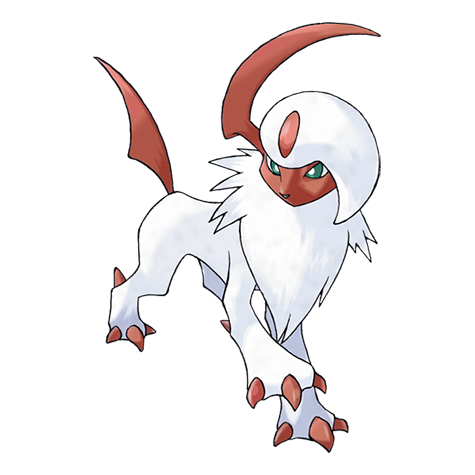

# #359 Absol (Disaster Pokémon)

| Official Artwork | Shiny Artwork |
|------------------|---------------|
|  |  |

**Rising Ruby:** Every time Absol appears before people, it is followed by a disaster such as an earthquake or a tidal wave. As a result, it came to be known as the disaster Pokémon.

**Sinking Sapphire:** Absol has the ability to foretell the coming of natural disasters. It lives in a harsh, rugged mountain environment. This Pokémon very rarely ventures down from the mountains.

---

## Media

### Default Sprites

| Front | Shiny | Back | Shiny |
|-------|-------|------|-------|
|  |  |  |  |

### Cries

Latest (Gen VI+):

<audio controls>
<source src='../../assets/cries/absol/latest.ogg' type='audio/ogg'>
  Your browser does not support the audio element.
</audio>

Legacy:

<audio controls>
<source src='../../assets/cries/absol/legacy.ogg' type='audio/ogg'>
  Your browser does not support the audio element.
</audio>

---

## Pokédex Data

| National № | Type(s) | Height | Weight | Abilities | Local № |
|------------|---------|--------|--------|-----------|---------|
| #359 | {: width="48"} | 1.2 m / 3.9 ft | 47.0 kg / 103.6 lbs | 1. Pressure 2. Super Luck | N/A |

---

## Base Stats
|   | HP | Attack | Defense | Sp. Atk | Sp. Def | Speed |
|---|----|--------|---------|---------|---------|-------|
| **Base** | 65 | 130 | 60 | 75 | 60 | 75 |
| **Min** | 240 | 238 | 112 | 139 | 112 | 139 |
| **Max** | 334 | 394 | 240 | 273 | 240 | 273 |

The ranges shown above are for a level 100 Pokémon. Maximum values are based on a beneficial nature, 252 EVs, 31 IVs; minimum values are based on a hindering nature, 0 EVs, 0 IVs.

---

## Forms & Evolutions

!!! warning "WARNING"

    Information on evolutions may not be 100% accurate; differences between evolution methods across generations are not accounted for.

### Forms

1. [Absol](absol.md/)

2. [Absol Mega](absol-mega.md/)

### Evolution Line

1. [Absol](absol.md/)

---

## Training

| EV Yield | Catch Rate | Base Friendship | Base Exp. | Growth Rate | Held Items |
|----------|------------|-----------------|-----------|-------------|------------|
| 2 Atk | 30 | 35 | 163 | Medium Slow | Life Orb (5%) |

---

## Breeding

| Egg Groups | Egg Cycles | Gender | Dimorphic | Color | Shape |
|------------|------------|--------|-----------|-------|-------|
| 1. Ground | 25 | 50.0% Male 50.0% Female | False | White | Quadruped |

---

## Moves

!!! warning "WARNING"

    Specific move information may be incorrect. However, the general movepool should be accurate; this includes changes made in Sacred Gold and Storm Silver.

### Level Up Moves

| Lv. | Move | Type | Cat. | Power | Acc. | PP |
| --- | --- | --- | --- | --- | --- | --- |
| 1 | Feint | {: width="48"} | {: width="36"} | 30 | 100 | 10 |
| 1 | Future Sight | {: width="48"} | {: width="36"} | 120 | 100 | 10 |
| 1 | Perish Song | {: width="48"} | {: width="36"} | — | — | 5 |
| 1 | Scratch | {: width="48"} | {: width="36"} | 50 | 100 | 35 |
| 4 | Leer | {: width="48"} | {: width="36"} | — | 100 | 30 |
| 7 | Quick Attack | {: width="48"} | {: width="36"} | 40 | 100 | 30 |
| 10 | Pursuit | {: width="48"} | {: width="36"} | 40 | 100 | 20 |
| 13 | Taunt | {: width="48"} | {: width="36"} | — | 100 | 20 |
| 16 | Bite | {: width="48"} | {: width="36"} | 60 | 100 | 25 |
| 19 | Double Team | {: width="48"} | {: width="36"} | — | — | 15 |
| 22 | Slash | {: width="48"} | {: width="36"} | 70 | 100 | 20 |
| 25 | Swords Dance | {: width="48"} | {: width="36"} | — | — | 20 |
| 28 | Night Slash | {: width="48"} | {: width="36"} | 70 | 100 | 15 |
| 31 | Detect | {: width="48"} | {: width="36"} | — | — | 5 |
| 34 | Psycho Cut | {: width="48"} | {: width="36"} | 70 | 100 | 20 |
| 37 | Sucker Punch | {: width="48"} | {: width="36"} | 70 | 100 | 5 |
| 40 | Play Rough | {: width="48"} | {: width="36"} | 90 | 90 | 10 |
| 43 | Me First | {: width="48"} | {: width="36"} | — | — | 20 |
| 46 | Razor Wind | {: width="48"} | {: width="36"} | 80 | 100 | 10 |
| 49 | Megahorn | {: width="48"} | {: width="36"} | 120 | 85 | 10 |
| 52 | Future Sight | {: width="48"} | {: width="36"} | 120 | 100 | 10 |
| 55 | Perish Song | {: width="48"} | {: width="36"} | — | — | 5 |

### TM Moves

| TM | Move | Type | Cat. | Power | Acc. | PP |
| --- | --- | --- | --- | --- | --- | --- |
| HM01 | Cut | {: width="48"} | {: width="36"} | 70 | 100 | 15 |
| HM04 | Strength | {: width="48"} | {: width="36"} | 100 | 100 | 10 |
| HM06 | Rock Smash | {: width="48"} | {: width="36"} | 65 | 100 | 15 |
| TM01 | Hone Claws | {: width="48"} | {: width="36"} | — | — | 15 |
| TM04 | Calm Mind | {: width="48"} | {: width="36"} | — | — | 20 |
| TM06 | Toxic | {: width="48"} | {: width="36"} | — | 90 | 10 |
| TM07 | Hail | {: width="48"} | {: width="36"} | — | — | 10 |
| TM10 | Hidden Power | {: width="48"} | {: width="36"} | 60 | 100 | 15 |
| TM100 | Confide | {: width="48"} | {: width="36"} | — | — | 20 |
| TM11 | Sunny Day | {: width="48"} | {: width="36"} | — | — | 5 |
| TM12 | Taunt | {: width="48"} | {: width="36"} | — | 100 | 20 |
| TM13 | Ice Beam | {: width="48"} | {: width="36"} | 90 | 100 | 10 |
| TM14 | Blizzard | {: width="48"} | {: width="36"} | 110 | 70 | 5 |
| TM15 | Hyper Beam | {: width="48"} | {: width="36"} | 150 | 90 | 5 |
| TM17 | Protect | {: width="48"} | {: width="36"} | — | — | 10 |
| TM18 | Rain Dance | {: width="48"} | {: width="36"} | — | — | 5 |
| TM21 | Frustration | {: width="48"} | {: width="36"} | — | 100 | 20 |
| TM24 | Thunderbolt | {: width="48"} | {: width="36"} | 90 | 100 | 15 |
| TM25 | Thunder | {: width="48"} | {: width="36"} | 110 | 70 | 10 |
| TM27 | Return | {: width="48"} | {: width="36"} | — | 100 | 20 |
| TM30 | Shadow Ball | {: width="48"} | {: width="36"} | 80 | 100 | 15 |
| TM32 | Double Team | {: width="48"} | {: width="36"} | — | — | 15 |
| TM35 | Flamethrower | {: width="48"} | {: width="36"} | 90 | 100 | 15 |
| TM37 | Sandstorm | {: width="48"} | {: width="36"} | — | — | 10 |
| TM38 | Fire Blast | {: width="48"} | {: width="36"} | 110 | 85 | 5 |
| TM39 | Rock Tomb | {: width="48"} | {: width="36"} | 60 | 95 | 15 |
| TM40 | Aerial Ace | {: width="48"} | {: width="36"} | 60 | — | 20 |
| TM41 | Torment | {: width="48"} | {: width="36"} | — | 100 | 15 |
| TM42 | Facade | {: width="48"} | {: width="36"} | 70 | 100 | 20 |
| TM44 | Rest | {: width="48"} | {: width="36"} | — | — | 5 |
| TM45 | Attract | {: width="48"} | {: width="36"} | — | 100 | 15 |
| TM46 | Thief | {: width="48"} | {: width="36"} | 60 | 100 | 25 |
| TM48 | Round | {: width="48"} | {: width="36"} | 60 | 100 | 15 |
| TM49 | Echoed Voice | {: width="48"} | {: width="36"} | 40 | 100 | 15 |
| TM54 | False Swipe | {: width="48"} | {: width="36"} | 40 | 100 | 40 |
| TM57 | Charge Beam | {: width="48"} | {: width="36"} | 50 | 90 | 10 |
| TM59 | Incinerate | {: width="48"} | {: width="36"} | 60 | 100 | 15 |
| TM61 | Will O Wisp | {: width="48"} | {: width="36"} | — | 85 | 15 |
| TM65 | Shadow Claw | {: width="48"} | {: width="36"} | 70 | 100 | 15 |
| TM66 | Payback | {: width="48"} | {: width="36"} | 50 | 100 | 10 |
| TM67 | Retaliate | {: width="48"} | {: width="36"} | 70 | 100 | 5 |
| TM68 | Giga Impact | {: width="48"} | {: width="36"} | 150 | 90 | 5 |
| TM70 | Flash | {: width="48"} | {: width="36"} | — | 100 | 20 |
| TM71 | Stone Edge | {: width="48"} | {: width="36"} | 100 | 80 | 5 |
| TM73 | Thunder Wave | {: width="48"} | {: width="36"} | — | 90 | 20 |
| TM75 | Swords Dance | {: width="48"} | {: width="36"} | — | — | 20 |
| TM77 | Psych Up | {: width="48"} | {: width="36"} | — | — | 10 |
| TM80 | Rock Slide | {: width="48"} | {: width="36"} | 75 | 90 | 10 |
| TM81 | X Scissor | {: width="48"} | {: width="36"} | 80 | 100 | 15 |
| TM85 | Dream Eater | {: width="48"} | {: width="36"} | 100 | 100 | 15 |
| TM87 | Swagger | {: width="48"} | {: width="36"} | — | 85 | 15 |
| TM88 | Sleep Talk | {: width="48"} | {: width="36"} | — | — | 10 |
| TM90 | Substitute | {: width="48"} | {: width="36"} | — | — | 10 |
| TM94 | Secret Power | {: width="48"} | {: width="36"} | 70 | 100 | 20 |
| TM95 | Snarl | {: width="48"} | {: width="36"} | 55 | 95 | 15 |
| TM97 | Dark Pulse | {: width="48"} | {: width="36"} | 80 | 100 | 15 |

### Egg Moves

| Move | Type | Cat. | Power | Acc. | PP |
| --- | --- | --- | --- | --- | --- |
| Assurance | {: width="48"} | {: width="36"} | 60 | 100 | 10 |
| Baton Pass | {: width="48"} | {: width="36"} | — | — | 40 |
| Curse | {: width="48"} | {: width="36"} | — | — | 10 |
| Double Edge | {: width="48"} | {: width="36"} | 120 | 100 | 15 |
| Feint Attack | {: width="48"} | {: width="36"} | 60 | — | 20 |
| Hex | {: width="48"} | {: width="36"} | 65 | 100 | 10 |
| Magic Coat | {: width="48"} | {: width="36"} | — | — | 15 |
| Me First | {: width="48"} | {: width="36"} | — | — | 20 |
| Mean Look | {: width="48"} | {: width="36"} | — | — | 5 |
| Megahorn | {: width="48"} | {: width="36"} | 120 | 85 | 10 |
| Perish Song | {: width="48"} | {: width="36"} | — | — | 5 |
| Play Rough | {: width="48"} | {: width="36"} | 90 | 90 | 10 |
| Punishment | {: width="48"} | {: width="36"} | — | 100 | 5 |
| Sucker Punch | {: width="48"} | {: width="36"} | 70 | 100 | 5 |
| Zen Headbutt | {: width="48"} | {: width="36"} | 80 | 90 | 15 |

### Tutor Moves

| Move | Type | Cat. | Power | Acc. | PP |
| --- | --- | --- | --- | --- | --- |
| Bounce | {: width="48"} | {: width="36"} | 85 | 85 | 5 |
| Foul Play | {: width="48"} | {: width="36"} | 95 | 100 | 15 |
| Icy Wind | {: width="48"} | {: width="36"} | 55 | 95 | 15 |
| Iron Tail | {: width="48"} | {: width="36"} | 100 | 75 | 15 |
| Knock Off | {: width="48"} | {: width="36"} | 65 | 100 | 20 |
| Magic Coat | {: width="48"} | {: width="36"} | — | — | 15 |
| Role Play | {: width="48"} | {: width="36"} | — | — | 10 |
| Shock Wave | {: width="48"} | {: width="36"} | 60 | — | 20 |
| Snatch | {: width="48"} | {: width="36"} | — | — | 10 |
| Snore | {: width="48"} | {: width="36"} | 50 | 100 | 15 |
| Spite | {: width="48"} | {: width="36"} | — | 100 | 10 |
| Superpower | {: width="48"} | {: width="36"} | 120 | 100 | 5 |
| Water Pulse | {: width="48"} | {: width="36"} | 60 | 100 | 20 |
| Zen Headbutt | {: width="48"} | {: width="36"} | 80 | 90 | 15 |

