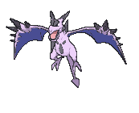

# Aerodactyl Mega (Fossil Pokémon)

| Official Artwork | Shiny Artwork |
|------------------|---------------|
|  |  |

Aerodactyl is a Pokémon from the age of dinosaurs. It was regenerated from genetic material extracted from amber. It is imagined to have been the king of the skies in ancient times.

---

## Media

### Default Sprites

| Front | Shiny | Back | Shiny |
|-------|-------|------|-------|
|  |  |  |  |

### Cries

Latest (Gen VI+):

<audio controls>
<source src='../../assets/cries/aerodactyl-mega/latest.ogg' type='audio/ogg'>
  Your browser does not support the audio element.
</audio>

Legacy:

<audio controls>
<source src='../../assets/cries/aerodactyl-mega/legacy.ogg' type='audio/ogg'>
  Your browser does not support the audio element.
</audio>

---

## Pokédex Data

| National № | Type(s) | Height | Weight | Abilities | Local № |
|------------|---------|--------|--------|-----------|---------|
| #10042 | {: width="48"} {: width="48"} | 2.1 m / 6.9 ft | 79.0 kg / 174.2 lbs | 1. Tough Claws | N/A |

---

## Base Stats
|   | HP | Attack | Defense | Sp. Atk | Sp. Def | Speed |
|---|----|--------|---------|---------|---------|-------|
| **Base** | 80 | 135 | 85 | 70 | 95 | 150 |
| **Min** | 270 | 247 | 157 | 130 | 175 | 274 |
| **Max** | 364 | 405 | 295 | 262 | 317 | 438 |

The ranges shown above are for a level 100 Pokémon. Maximum values are based on a beneficial nature, 252 EVs, 31 IVs; minimum values are based on a hindering nature, 0 EVs, 0 IVs.

---

## Forms & Evolutions

!!! warning "WARNING"

    Information on evolutions may not be 100% accurate; differences between evolution methods across generations are not accounted for.

### Forms

1. [Aerodactyl](aerodactyl.md/)

2. [Aerodactyl Mega](aerodactyl-mega.md/)

### Evolution Line

1. [Aerodactyl](aerodactyl.md/)

---

## Training

| EV Yield | Catch Rate | Base Friendship | Base Exp. | Growth Rate | Held Items |
|----------|------------|-----------------|-----------|-------------|------------|
| 2 Spd | 45 | 50 | 215 | Slow | N/A |

---

## Breeding

| Egg Groups | Egg Cycles | Gender | Dimorphic | Color | Shape |
|------------|------------|--------|-----------|-------|-------|
| 1. Flying | 35 | 87.5% Male 12.5% Female | False | Purple | Wings |

---

## Moves

!!! warning "WARNING"

    Specific move information may be incorrect. However, the general movepool should be accurate; this includes changes made in Sacred Gold and Storm Silver.

### Level Up Moves

| Lv. | Move | Type | Cat. | Power | Acc. | PP |
| --- | --- | --- | --- | --- | --- | --- |
| 1 | Bite | {: width="48"} | {: width="36"} | 60 | 100 | 25 |
| 1 | Fire Fang | {: width="48"} | {: width="36"} | 65 | 95 | 15 |
| 1 | Ice Fang | {: width="48"} | {: width="36"} | 65 | 95 | 15 |
| 1 | Iron Head | {: width="48"} | {: width="36"} | 80 | 100 | 15 |
| 1 | Scary Face | {: width="48"} | {: width="36"} | — | 100 | 10 |
| 1 | Supersonic | {: width="48"} | {: width="36"} | — | 55 | 20 |
| 1 | Thunder Fang | {: width="48"} | {: width="36"} | 65 | 95 | 15 |
| 1 | Wing Attack | {: width="48"} | {: width="36"} | 60 | 100 | 35 |
| 9 | Roar | {: width="48"} | {: width="36"} | — | — | 20 |
| 17 | Agility | {: width="48"} | {: width="36"} | — | — | 30 |
| 25 | Ancient Power | {: width="48"} | {: width="36"} | 80 | 100 | 10 |
| 33 | Crunch | {: width="48"} | {: width="36"} | 80 | 100 | 15 |
| 41 | Take Down | {: width="48"} | {: width="36"} | 90 | 85 | 20 |
| 49 | Sky Drop | {: width="48"} | {: width="36"} | 60 | 100 | 10 |
| 57 | Iron Head | {: width="48"} | {: width="36"} | 80 | 100 | 15 |
| 65 | Hyper Beam | {: width="48"} | {: width="36"} | 150 | 90 | 5 |
| 73 | Rock Slide | {: width="48"} | {: width="36"} | 75 | 90 | 10 |
| 81 | Giga Impact | {: width="48"} | {: width="36"} | 150 | 90 | 5 |

### TM Moves

| TM | Move | Type | Cat. | Power | Acc. | PP |
| --- | --- | --- | --- | --- | --- | --- |
| HM02 | Fly | {: width="48"} | {: width="36"} | 100 | 100 | 10 |
| HM04 | Strength | {: width="48"} | {: width="36"} | 100 | 100 | 10 |
| HM06 | Rock Smash | {: width="48"} | {: width="36"} | 65 | 100 | 15 |
| TM01 | Hone Claws | {: width="48"} | {: width="36"} | — | — | 15 |
| TM02 | Dragon Claw | {: width="48"} | {: width="36"} | 80 | 100 | 15 |
| TM05 | Roar | {: width="48"} | {: width="36"} | — | — | 20 |
| TM06 | Toxic | {: width="48"} | {: width="36"} | — | 90 | 10 |
| TM10 | Hidden Power | {: width="48"} | {: width="36"} | 60 | 100 | 15 |
| TM100 | Confide | {: width="48"} | {: width="36"} | — | — | 20 |
| TM11 | Sunny Day | {: width="48"} | {: width="36"} | — | — | 5 |
| TM12 | Taunt | {: width="48"} | {: width="36"} | — | 100 | 20 |
| TM15 | Hyper Beam | {: width="48"} | {: width="36"} | 150 | 90 | 5 |
| TM17 | Protect | {: width="48"} | {: width="36"} | — | — | 10 |
| TM18 | Rain Dance | {: width="48"} | {: width="36"} | — | — | 5 |
| TM19 | Roost | {: width="48"} | {: width="36"} | — | — | 5 |
| TM21 | Frustration | {: width="48"} | {: width="36"} | — | 100 | 20 |
| TM23 | Smack Down | {: width="48"} | {: width="36"} | 50 | 100 | 15 |
| TM26 | Earthquake | {: width="48"} | {: width="36"} | 100 | 100 | 10 |
| TM27 | Return | {: width="48"} | {: width="36"} | — | 100 | 20 |
| TM32 | Double Team | {: width="48"} | {: width="36"} | — | — | 15 |
| TM35 | Flamethrower | {: width="48"} | {: width="36"} | 90 | 100 | 15 |
| TM37 | Sandstorm | {: width="48"} | {: width="36"} | — | — | 10 |
| TM38 | Fire Blast | {: width="48"} | {: width="36"} | 110 | 85 | 5 |
| TM39 | Rock Tomb | {: width="48"} | {: width="36"} | 60 | 95 | 15 |
| TM40 | Aerial Ace | {: width="48"} | {: width="36"} | 60 | — | 20 |
| TM41 | Torment | {: width="48"} | {: width="36"} | — | 100 | 15 |
| TM42 | Facade | {: width="48"} | {: width="36"} | 70 | 100 | 20 |
| TM44 | Rest | {: width="48"} | {: width="36"} | — | — | 5 |
| TM45 | Attract | {: width="48"} | {: width="36"} | — | 100 | 15 |
| TM46 | Thief | {: width="48"} | {: width="36"} | 60 | 100 | 25 |
| TM48 | Round | {: width="48"} | {: width="36"} | 60 | 100 | 15 |
| TM51 | Steel Wing | {: width="48"} | {: width="36"} | 70 | 90 | 25 |
| TM58 | Sky Drop | {: width="48"} | {: width="36"} | 60 | 100 | 10 |
| TM59 | Incinerate | {: width="48"} | {: width="36"} | 60 | 100 | 15 |
| TM66 | Payback | {: width="48"} | {: width="36"} | 50 | 100 | 10 |
| TM68 | Giga Impact | {: width="48"} | {: width="36"} | 150 | 90 | 5 |
| TM69 | Rock Polish | {: width="48"} | {: width="36"} | — | — | 20 |
| TM71 | Stone Edge | {: width="48"} | {: width="36"} | 100 | 80 | 5 |
| TM78 | Bulldoze | {: width="48"} | {: width="36"} | 60 | 100 | 20 |
| TM80 | Rock Slide | {: width="48"} | {: width="36"} | 75 | 90 | 10 |
| TM87 | Swagger | {: width="48"} | {: width="36"} | — | 85 | 15 |
| TM88 | Sleep Talk | {: width="48"} | {: width="36"} | — | — | 10 |
| TM90 | Substitute | {: width="48"} | {: width="36"} | — | — | 10 |
| TM94 | Secret Power | {: width="48"} | {: width="36"} | 70 | 100 | 20 |

### Egg Moves

| Move | Type | Cat. | Power | Acc. | PP |
| --- | --- | --- | --- | --- | --- |
| Assurance | {: width="48"} | {: width="36"} | 60 | 100 | 10 |
| Curse | {: width="48"} | {: width="36"} | — | — | 10 |
| Dragon Breath | {: width="48"} | {: width="36"} | 60 | 100 | 20 |
| Foresight | {: width="48"} | {: width="36"} | — | — | 40 |
| Pursuit | {: width="48"} | {: width="36"} | 40 | 100 | 20 |
| Roost | {: width="48"} | {: width="36"} | — | — | 5 |
| Steel Wing | {: width="48"} | {: width="36"} | 70 | 90 | 25 |
| Tailwind | {: width="48"} | {: width="36"} | — | — | 15 |
| Whirlwind | {: width="48"} | {: width="36"} | — | — | 20 |
| Wide Guard | {: width="48"} | {: width="36"} | — | — | 10 |

### Tutor Moves

| Move | Type | Cat. | Power | Acc. | PP |
| --- | --- | --- | --- | --- | --- |
| Aqua Tail | {: width="48"} | {: width="36"} | 90 | 90 | 10 |
| Dragon Pulse | {: width="48"} | {: width="36"} | 85 | 100 | 10 |
| Earth Power | {: width="48"} | {: width="36"} | 90 | 100 | 10 |
| Heat Wave | {: width="48"} | {: width="36"} | 95 | 90 | 10 |
| Iron Head | {: width="48"} | {: width="36"} | 80 | 100 | 15 |
| Iron Tail | {: width="48"} | {: width="36"} | 100 | 75 | 15 |
| Sky Attack | {: width="48"} | {: width="36"} | 140 | 90 | 5 |
| Snore | {: width="48"} | {: width="36"} | 50 | 100 | 15 |
| Stealth Rock | {: width="48"} | {: width="36"} | — | — | 20 |
| Tailwind | {: width="48"} | {: width="36"} | — | — | 15 |

