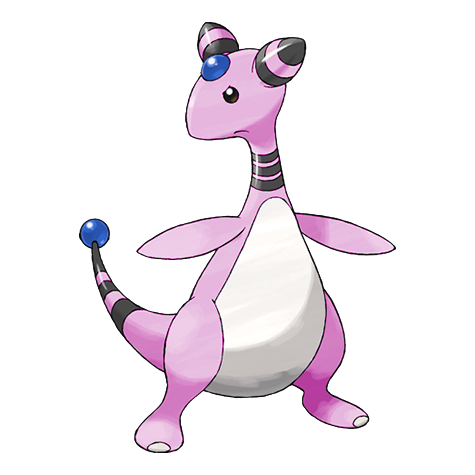
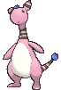
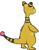
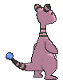

# #181 Ampharos (Light Pokémon)

| Official Artwork | Shiny Artwork |
|------------------|---------------|
|  |  |

Ampharos gives off so much light that it can be seen even from space. People in the old days used the light of this Pokémon to send signals back and forth with others far away.

---

## Media

### Default Sprites

| Front | Shiny | Back | Shiny |
|-------|-------|------|-------|
|  |  |  |  |

### Cries

Latest (Gen VI+):

<audio controls>
<source src='../../assets/cries/ampharos/latest.ogg' type='audio/ogg'>
  Your browser does not support the audio element.
</audio>

Legacy:

<audio controls>
<source src='../../assets/cries/ampharos/legacy.ogg' type='audio/ogg'>
  Your browser does not support the audio element.
</audio>

---

## Pokédex Data

| National № | Type(s) | Height | Weight | Abilities | Local № |
|------------|---------|--------|--------|-----------|---------|
| #181 | {: width="48"} | 1.4 m / 4.6 ft | 61.5 kg / 135.6 lbs | 1. Static 3. Plus | N/A |

---

## Base Stats
|   | HP | Attack | Defense | Sp. Atk | Sp. Def | Speed |
|---|----|--------|---------|---------|---------|-------|
| **Base** | 90 | 75 | 85 | 115 | 90 | 55 |
| **Min** | 290 | 139 | 157 | 211 | 166 | 103 |
| **Max** | 384 | 273 | 295 | 361 | 306 | 229 |

The ranges shown above are for a level 100 Pokémon. Maximum values are based on a beneficial nature, 252 EVs, 31 IVs; minimum values are based on a hindering nature, 0 EVs, 0 IVs.

---

## Forms & Evolutions

!!! warning "WARNING"

    Information on evolutions may not be 100% accurate; differences between evolution methods across generations are not accounted for.

### Forms

1. [Ampharos](ampharos.md/)

2. [Ampharos Mega](ampharos-mega.md/)

### Evolution Line

1. [Mareep](mareep.md/)
    1. Level Up: [Flaaffy](flaaffy.md/)
        1. Level Up: [Ampharos](ampharos.md/)

---

## Training

| EV Yield | Catch Rate | Base Friendship | Base Exp. | Growth Rate | Held Items |
|----------|------------|-----------------|-----------|-------------|------------|
| 3 Sp.-Atk | 45 | 70 | 230 | Medium Slow | N/A |

---

## Breeding

| Egg Groups | Egg Cycles | Gender | Dimorphic | Color | Shape |
|------------|------------|--------|-----------|-------|-------|
| 1. Monster 2. Ground | 20 | 50.0% Male 50.0% Female | False | Yellow | Upright |

---

## Moves

!!! warning "WARNING"

    Specific move information may be incorrect. However, the general movepool should be accurate; this includes changes made in Sacred Gold and Storm Silver.

### Level Up Moves

| Lv. | Move | Type | Cat. | Power | Acc. | PP |
| --- | --- | --- | --- | --- | --- | --- |
| 1 | Fire Punch | {: width="48"} | {: width="36"} | 75 | 100 | 15 |
| 1 | Growl | {: width="48"} | {: width="36"} | — | 100 | 40 |
| 1 | Ion Deluge | {: width="48"} | {: width="36"} | — | — | 25 |
| 1 | Magnetic Flux | {: width="48"} | {: width="36"} | — | — | 20 |
| 1 | Tackle | {: width="48"} | {: width="36"} | 40 | 100 | 35 |
| 1 | Thunder Punch | {: width="48"} | {: width="36"} | 75 | 100 | 15 |
| 1 | Zap Cannon | {: width="48"} | {: width="36"} | 120 | 50 | 5 |
| 4 | Thunder Wave | {: width="48"} | {: width="36"} | — | 90 | 20 |
| 7 | Thunder Shock | {: width="48"} | {: width="36"} | 40 | 100 | 30 |
| 10 | Cotton Spore | {: width="48"} | {: width="36"} | — | 100 | 40 |
| 13 | Shock Wave | {: width="48"} | {: width="36"} | 60 | — | 20 |
| 16 | Charge | {: width="48"} | {: width="36"} | — | — | 20 |
| 20 | Take Down | {: width="48"} | {: width="36"} | 90 | 85 | 20 |
| 24 | Electro Ball | {: width="48"} | {: width="36"} | — | 100 | 10 |
| 28 | Power Gem | {: width="48"} | {: width="36"} | 90 | 100 | 10 |
| 30 | Dragon Pulse | {: width="48"} | {: width="36"} | 85 | 100 | 10 |
| 33 | Discharge | {: width="48"} | {: width="36"} | 80 | 100 | 15 |
| 38 | Confuse Ray | {: width="48"} | {: width="36"} | — | 100 | 10 |
| 43 | Signal Beam | {: width="48"} | {: width="36"} | 75 | 100 | 15 |
| 48 | Thunderbolt | {: width="48"} | {: width="36"} | 90 | 100 | 15 |
| 53 | Cotton Guard | {: width="48"} | {: width="36"} | — | — | 10 |
| 58 | Light Screen | {: width="48"} | {: width="36"} | — | — | 30 |
| 63 | Thunder | {: width="48"} | {: width="36"} | 110 | 70 | 10 |
| 68 | Tail Glow | {: width="48"} | {: width="36"} | — | — | 20 |

### TM Moves

| TM | Move | Type | Cat. | Power | Acc. | PP |
| --- | --- | --- | --- | --- | --- | --- |
| HM04 | Strength | {: width="48"} | {: width="36"} | 100 | 100 | 10 |
| HM06 | Rock Smash | {: width="48"} | {: width="36"} | 65 | 100 | 15 |
| TM06 | Toxic | {: width="48"} | {: width="36"} | — | 90 | 10 |
| TM10 | Hidden Power | {: width="48"} | {: width="36"} | 60 | 100 | 15 |
| TM100 | Confide | {: width="48"} | {: width="36"} | — | — | 20 |
| TM15 | Hyper Beam | {: width="48"} | {: width="36"} | 150 | 90 | 5 |
| TM16 | Light Screen | {: width="48"} | {: width="36"} | — | — | 30 |
| TM17 | Protect | {: width="48"} | {: width="36"} | — | — | 10 |
| TM18 | Rain Dance | {: width="48"} | {: width="36"} | — | — | 5 |
| TM20 | Safeguard | {: width="48"} | {: width="36"} | — | — | 25 |
| TM21 | Frustration | {: width="48"} | {: width="36"} | — | 100 | 20 |
| TM24 | Thunderbolt | {: width="48"} | {: width="36"} | 90 | 100 | 15 |
| TM25 | Thunder | {: width="48"} | {: width="36"} | 110 | 70 | 10 |
| TM27 | Return | {: width="48"} | {: width="36"} | — | 100 | 20 |
| TM31 | Brick Break | {: width="48"} | {: width="36"} | 75 | 100 | 15 |
| TM32 | Double Team | {: width="48"} | {: width="36"} | — | — | 15 |
| TM42 | Facade | {: width="48"} | {: width="36"} | 70 | 100 | 20 |
| TM44 | Rest | {: width="48"} | {: width="36"} | — | — | 5 |
| TM45 | Attract | {: width="48"} | {: width="36"} | — | 100 | 15 |
| TM48 | Round | {: width="48"} | {: width="36"} | 60 | 100 | 15 |
| TM49 | Echoed Voice | {: width="48"} | {: width="36"} | 40 | 100 | 15 |
| TM52 | Focus Blast | {: width="48"} | {: width="36"} | 120 | 70 | 5 |
| TM56 | Fling | {: width="48"} | {: width="36"} | — | 100 | 10 |
| TM57 | Charge Beam | {: width="48"} | {: width="36"} | 50 | 90 | 10 |
| TM68 | Giga Impact | {: width="48"} | {: width="36"} | 150 | 90 | 5 |
| TM70 | Flash | {: width="48"} | {: width="36"} | — | 100 | 20 |
| TM72 | Volt Switch | {: width="48"} | {: width="36"} | 70 | 100 | 20 |
| TM73 | Thunder Wave | {: width="48"} | {: width="36"} | — | 90 | 20 |
| TM78 | Bulldoze | {: width="48"} | {: width="36"} | 60 | 100 | 20 |
| TM87 | Swagger | {: width="48"} | {: width="36"} | — | 85 | 15 |
| TM88 | Sleep Talk | {: width="48"} | {: width="36"} | — | — | 10 |
| TM90 | Substitute | {: width="48"} | {: width="36"} | — | — | 10 |
| TM93 | Wild Charge | {: width="48"} | {: width="36"} | 90 | 100 | 15 |
| TM94 | Secret Power | {: width="48"} | {: width="36"} | 70 | 100 | 20 |
| TM98 | Power Up Punch | {: width="48"} | {: width="36"} | 40 | 100 | 20 |

### Egg Moves

Ampharos cannot learn any moves by breeding.
### Tutor Moves

| Move | Type | Cat. | Power | Acc. | PP |
| --- | --- | --- | --- | --- | --- |
| After You | {: width="48"} | {: width="36"} | — | — | 15 |
| Dragon Pulse | {: width="48"} | {: width="36"} | 85 | 100 | 10 |
| Electroweb | {: width="48"} | {: width="36"} | 55 | 95 | 15 |
| Fire Punch | {: width="48"} | {: width="36"} | 75 | 100 | 15 |
| Focus Punch | {: width="48"} | {: width="36"} | 150 | 100 | 20 |
| Heal Bell | {: width="48"} | {: width="36"} | — | — | 5 |
| Iron Tail | {: width="48"} | {: width="36"} | 100 | 75 | 15 |
| Magnet Rise | {: width="48"} | {: width="36"} | — | — | 10 |
| Outrage | {: width="48"} | {: width="36"} | 120 | 100 | 10 |
| Shock Wave | {: width="48"} | {: width="36"} | 60 | — | 20 |
| Signal Beam | {: width="48"} | {: width="36"} | 75 | 100 | 15 |
| Snore | {: width="48"} | {: width="36"} | 50 | 100 | 15 |
| Thunder Punch | {: width="48"} | {: width="36"} | 75 | 100 | 15 |

