# #493 Arceus (Alpha Pokémon)

| Official Artwork | Shiny Artwork |
|------------------|---------------|
|  |  |

**Rising Ruby:** According to the legends of Sinnoh, this Pokémon emerged from an egg and shaped all there is in this world.

**Sinking Sapphire:** It is told in mythology that this Pokémon was born before the universe even existed.

---

## Media

### Default Sprites

| Front | Shiny | Back | Shiny |
|-------|-------|------|-------|
|  | 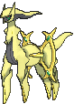 | 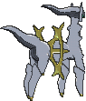 | 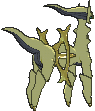 |

### Arceus Bug Sprites

| Front | Shiny | Back | Shiny |
|-------|-------|------|-------|
| 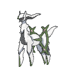 | 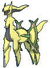 | 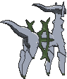 | 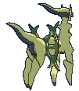 |

### Arceus Dark Sprites

| Front | Shiny | Back | Shiny |
|-------|-------|------|-------|
| 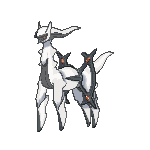 | 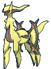 | 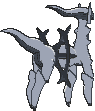 | 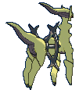 |

### Arceus Dragon Sprites

| Front | Shiny | Back | Shiny |
|-------|-------|------|-------|
| 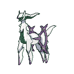 | 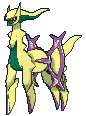 | 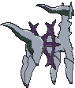 | 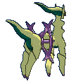 |

### Arceus Electric Sprites

| Front | Shiny | Back | Shiny |
|-------|-------|------|-------|
| 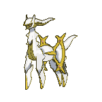 | 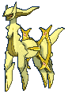 | 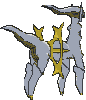 | 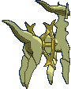 |

### Arceus Fighting Sprites

| Front | Shiny | Back | Shiny |
|-------|-------|------|-------|
| 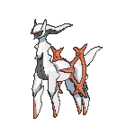 | 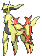 | 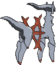 | 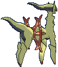 |

### Arceus Fire Sprites

| Front | Shiny | Back | Shiny |
|-------|-------|------|-------|
| 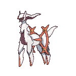 | 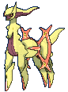 | 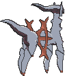 | 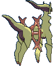 |

### Arceus Flying Sprites

| Front | Shiny | Back | Shiny |
|-------|-------|------|-------|
| 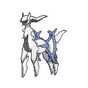 | 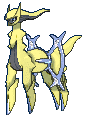 | 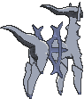 | 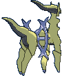 |

### Arceus Ghost Sprites

| Front | Shiny | Back | Shiny |
|-------|-------|------|-------|
| 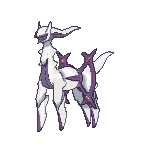 | 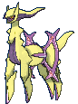 | 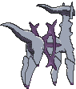 | 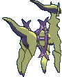 |

### Arceus Grass Sprites

| Front | Shiny | Back | Shiny |
|-------|-------|------|-------|
| 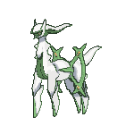 | 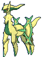 | 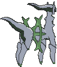 | 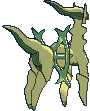 |

### Arceus Ground Sprites

| Front | Shiny | Back | Shiny |
|-------|-------|------|-------|
| 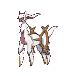 | 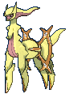 | 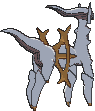 | 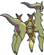 |

### Arceus Ice Sprites

| Front | Shiny | Back | Shiny |
|-------|-------|------|-------|
|  | 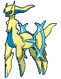 | 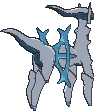 | 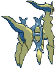 |

### Arceus Poison Sprites

| Front | Shiny | Back | Shiny |
|-------|-------|------|-------|
| 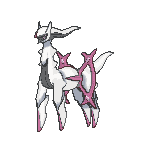 |  | 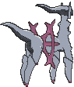 |  |

### Arceus Psychic Sprites

| Front | Shiny | Back | Shiny |
|-------|-------|------|-------|
| 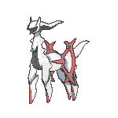 | 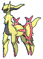 |  |  |

### Arceus Rock Sprites

| Front | Shiny | Back | Shiny |
|-------|-------|------|-------|
|  |  |  |  |

### Arceus Steel Sprites

| Front | Shiny | Back | Shiny |
|-------|-------|------|-------|
|  |  |  |  |

### Arceus Water Sprites

| Front | Shiny | Back | Shiny |
|-------|-------|------|-------|
|  |  |  |  |

### Arceus Unknown Sprites

| Front | Shiny | Back | Shiny |
|-------|-------|------|-------|
|  |  | N/A | N/A |

### Arceus Fairy Sprites

| Front | Shiny | Back | Shiny |
|-------|-------|------|-------|
|  |  |  |  |

### Cries

Latest (Gen VI+):

<audio controls>
<source src='../../assets/cries/arceus/latest.ogg' type='audio/ogg'>
  Your browser does not support the audio element.
</audio>

Legacy:

<audio controls>
<source src='../../assets/cries/arceus/legacy.ogg' type='audio/ogg'>
  Your browser does not support the audio element.
</audio>

---

## Pokédex Data

| National № | Type(s) | Height | Weight | Abilities | Local № |
|------------|---------|--------|--------|-----------|---------|
| #493 | {: width="48"} | 3.2 m / 10.5 ft | 320.0 kg / 705.5 lbs | 1. Multitype | N/A |

---

## Base Stats
|   | HP | Attack | Defense | Sp. Atk | Sp. Def | Speed |
|---|----|--------|---------|---------|---------|-------|
| **Base** | 120 | 120 | 120 | 120 | 120 | 120 |
| **Min** | 350 | 220 | 220 | 220 | 220 | 220 |
| **Max** | 444 | 372 | 372 | 372 | 372 | 372 |

The ranges shown above are for a level 100 Pokémon. Maximum values are based on a beneficial nature, 252 EVs, 31 IVs; minimum values are based on a hindering nature, 0 EVs, 0 IVs.

---

## Forms & Evolutions

!!! warning "WARNING"

    Information on evolutions may not be 100% accurate; differences between evolution methods across generations are not accounted for.

### Forms

Arceus has no alternate forms.

### Evolution Line

1. [Arceus](arceus.md/)

---

## Training

| EV Yield | Catch Rate | Base Friendship | Base Exp. | Growth Rate | Held Items |
|----------|------------|-----------------|-----------|-------------|------------|
| 3 HP | 3 | 0 | 324 | Slow | N/A |

---

## Breeding

| Egg Groups | Egg Cycles | Gender | Dimorphic | Color | Shape |
|------------|------------|--------|-----------|-------|-------|
| 1. No-Eggs | 120 | Genderless | False | White | Quadruped |

---

## Moves

!!! warning "WARNING"

    Specific move information may be incorrect. However, the general movepool should be accurate; this includes changes made in Sacred Gold and Storm Silver.

### Level Up Moves

| Lv. | Move | Type | Cat. | Power | Acc. | PP |
| --- | --- | --- | --- | --- | --- | --- |
| 1 | Seismic Toss | {: width="48"} | {: width="36"} | — | 100 | 20 |
| 5 | Cosmic Power | {: width="48"} | {: width="36"} | — | — | 20 |
| 10 | Natural Gift | {: width="48"} | {: width="36"} | — | 100 | 15 |
| 15 | Punishment | {: width="48"} | {: width="36"} | — | 100 | 5 |
| 20 | Gravity | {: width="48"} | {: width="36"} | — | — | 5 |
| 25 | Earth Power | {: width="48"} | {: width="36"} | 90 | 100 | 10 |
| 30 | Hyper Voice | {: width="48"} | {: width="36"} | 90 | 100 | 10 |
| 35 | Extreme Speed | {: width="48"} | {: width="36"} | 80 | 100 | 5 |
| 40 | Refresh | {: width="48"} | {: width="36"} | — | — | 20 |
| 45 | Future Sight | {: width="48"} | {: width="36"} | 120 | 100 | 10 |
| 50 | Recover | {: width="48"} | {: width="36"} | — | — | 5 |
| 55 | Hyper Beam | {: width="48"} | {: width="36"} | 150 | 90 | 5 |
| 60 | Perish Song | {: width="48"} | {: width="36"} | — | — | 5 |
| 65 | Judgment | {: width="48"} | {: width="36"} | 100 | 100 | 10 |

### TM Moves

| TM | Move | Type | Cat. | Power | Acc. | PP |
| --- | --- | --- | --- | --- | --- | --- |
| HM01 | Cut | {: width="48"} | {: width="36"} | 70 | 100 | 15 |
| HM02 | Fly | {: width="48"} | {: width="36"} | 100 | 100 | 10 |
| HM03 | Surf | {: width="48"} | {: width="36"} | 90 | 100 | 15 |
| HM04 | Strength | {: width="48"} | {: width="36"} | 100 | 100 | 10 |
| HM05 | Waterfall | {: width="48"} | {: width="36"} | 80 | 100 | 15 |
| HM06 | Rock Smash | {: width="48"} | {: width="36"} | 65 | 100 | 15 |
| HM07 | Dive | {: width="48"} | {: width="36"} | 80 | 100 | 10 |
| TM01 | Hone Claws | {: width="48"} | {: width="36"} | — | — | 15 |
| TM02 | Dragon Claw | {: width="48"} | {: width="36"} | 80 | 100 | 15 |
| TM03 | Psyshock | {: width="48"} | {: width="36"} | 80 | 100 | 10 |
| TM04 | Calm Mind | {: width="48"} | {: width="36"} | — | — | 20 |
| TM05 | Roar | {: width="48"} | {: width="36"} | — | — | 20 |
| TM06 | Toxic | {: width="48"} | {: width="36"} | — | 90 | 10 |
| TM07 | Hail | {: width="48"} | {: width="36"} | — | — | 10 |
| TM10 | Hidden Power | {: width="48"} | {: width="36"} | 60 | 100 | 15 |
| TM100 | Confide | {: width="48"} | {: width="36"} | — | — | 20 |
| TM11 | Sunny Day | {: width="48"} | {: width="36"} | — | — | 5 |
| TM13 | Ice Beam | {: width="48"} | {: width="36"} | 90 | 100 | 10 |
| TM14 | Blizzard | {: width="48"} | {: width="36"} | 110 | 70 | 5 |
| TM15 | Hyper Beam | {: width="48"} | {: width="36"} | 150 | 90 | 5 |
| TM16 | Light Screen | {: width="48"} | {: width="36"} | — | — | 30 |
| TM17 | Protect | {: width="48"} | {: width="36"} | — | — | 10 |
| TM18 | Rain Dance | {: width="48"} | {: width="36"} | — | — | 5 |
| TM20 | Safeguard | {: width="48"} | {: width="36"} | — | — | 25 |
| TM21 | Frustration | {: width="48"} | {: width="36"} | — | 100 | 20 |
| TM22 | Solar Beam | {: width="48"} | {: width="36"} | 120 | 100 | 10 |
| TM24 | Thunderbolt | {: width="48"} | {: width="36"} | 90 | 100 | 15 |
| TM25 | Thunder | {: width="48"} | {: width="36"} | 110 | 70 | 10 |
| TM26 | Earthquake | {: width="48"} | {: width="36"} | 100 | 100 | 10 |
| TM27 | Return | {: width="48"} | {: width="36"} | — | 100 | 20 |
| TM29 | Psychic | {: width="48"} | {: width="36"} | 90 | 100 | 10 |
| TM30 | Shadow Ball | {: width="48"} | {: width="36"} | 80 | 100 | 15 |
| TM31 | Brick Break | {: width="48"} | {: width="36"} | 75 | 100 | 15 |
| TM32 | Double Team | {: width="48"} | {: width="36"} | — | — | 15 |
| TM33 | Reflect | {: width="48"} | {: width="36"} | — | — | 20 |
| TM35 | Flamethrower | {: width="48"} | {: width="36"} | 90 | 100 | 15 |
| TM36 | Sludge Bomb | {: width="48"} | {: width="36"} | 90 | 100 | 10 |
| TM37 | Sandstorm | {: width="48"} | {: width="36"} | — | — | 10 |
| TM38 | Fire Blast | {: width="48"} | {: width="36"} | 110 | 85 | 5 |
| TM39 | Rock Tomb | {: width="48"} | {: width="36"} | 60 | 95 | 15 |
| TM40 | Aerial Ace | {: width="48"} | {: width="36"} | 60 | — | 20 |
| TM42 | Facade | {: width="48"} | {: width="36"} | 70 | 100 | 20 |
| TM44 | Rest | {: width="48"} | {: width="36"} | — | — | 5 |
| TM48 | Round | {: width="48"} | {: width="36"} | 60 | 100 | 15 |
| TM49 | Echoed Voice | {: width="48"} | {: width="36"} | 40 | 100 | 15 |
| TM50 | Overheat | {: width="48"} | {: width="36"} | 130 | 90 | 5 |
| TM52 | Focus Blast | {: width="48"} | {: width="36"} | 120 | 70 | 5 |
| TM53 | Energy Ball | {: width="48"} | {: width="36"} | 90 | 100 | 10 |
| TM57 | Charge Beam | {: width="48"} | {: width="36"} | 50 | 90 | 10 |
| TM59 | Incinerate | {: width="48"} | {: width="36"} | 60 | 100 | 15 |
| TM60 | Quash | {: width="48"} | {: width="36"} | — | 100 | 15 |
| TM61 | Will O Wisp | {: width="48"} | {: width="36"} | — | 85 | 15 |
| TM65 | Shadow Claw | {: width="48"} | {: width="36"} | 70 | 100 | 15 |
| TM66 | Payback | {: width="48"} | {: width="36"} | 50 | 100 | 10 |
| TM67 | Retaliate | {: width="48"} | {: width="36"} | 70 | 100 | 5 |
| TM68 | Giga Impact | {: width="48"} | {: width="36"} | 150 | 90 | 5 |
| TM70 | Flash | {: width="48"} | {: width="36"} | — | 100 | 20 |
| TM71 | Stone Edge | {: width="48"} | {: width="36"} | 100 | 80 | 5 |
| TM73 | Thunder Wave | {: width="48"} | {: width="36"} | — | 90 | 20 |
| TM75 | Swords Dance | {: width="48"} | {: width="36"} | — | — | 20 |
| TM77 | Psych Up | {: width="48"} | {: width="36"} | — | — | 10 |
| TM78 | Bulldoze | {: width="48"} | {: width="36"} | 60 | 100 | 20 |
| TM80 | Rock Slide | {: width="48"} | {: width="36"} | 75 | 90 | 10 |
| TM81 | X Scissor | {: width="48"} | {: width="36"} | 80 | 100 | 15 |
| TM84 | Poison Jab | {: width="48"} | {: width="36"} | 80 | 100 | 20 |
| TM85 | Dream Eater | {: width="48"} | {: width="36"} | 100 | 100 | 15 |
| TM86 | Grass Knot | {: width="48"} | {: width="36"} | — | 100 | 20 |
| TM87 | Swagger | {: width="48"} | {: width="36"} | — | 85 | 15 |
| TM88 | Sleep Talk | {: width="48"} | {: width="36"} | — | — | 10 |
| TM90 | Substitute | {: width="48"} | {: width="36"} | — | — | 10 |
| TM91 | Flash Cannon | {: width="48"} | {: width="36"} | 80 | 100 | 10 |
| TM92 | Trick Room | {: width="48"} | {: width="36"} | — | — | 5 |
| TM94 | Secret Power | {: width="48"} | {: width="36"} | 70 | 100 | 20 |
| TM95 | Snarl | {: width="48"} | {: width="36"} | 55 | 95 | 15 |
| TM97 | Dark Pulse | {: width="48"} | {: width="36"} | 80 | 100 | 15 |

### Egg Moves

Arceus cannot learn any moves by breeding.
### Tutor Moves

| Move | Type | Cat. | Power | Acc. | PP |
| --- | --- | --- | --- | --- | --- |
| Aqua Tail | {: width="48"} | {: width="36"} | 90 | 90 | 10 |
| Draco Meteor | {: width="48"} | {: width="36"} | 130 | 90 | 5 |
| Dragon Pulse | {: width="48"} | {: width="36"} | 85 | 100 | 10 |
| Earth Power | {: width="48"} | {: width="36"} | 90 | 100 | 10 |
| Giga Drain | {: width="48"} | {: width="36"} | 75 | 100 | 10 |
| Gravity | {: width="48"} | {: width="36"} | — | — | 5 |
| Heat Wave | {: width="48"} | {: width="36"} | 95 | 90 | 10 |
| Hyper Voice | {: width="48"} | {: width="36"} | 90 | 100 | 10 |
| Icy Wind | {: width="48"} | {: width="36"} | 55 | 95 | 15 |
| Iron Defense | {: width="48"} | {: width="36"} | — | — | 15 |
| Iron Head | {: width="48"} | {: width="36"} | 80 | 100 | 15 |
| Iron Tail | {: width="48"} | {: width="36"} | 100 | 75 | 15 |
| Last Resort | {: width="48"} | {: width="36"} | 140 | 100 | 5 |
| Magic Coat | {: width="48"} | {: width="36"} | — | — | 15 |
| Outrage | {: width="48"} | {: width="36"} | 120 | 100 | 10 |
| Recycle | {: width="48"} | {: width="36"} | — | — | 10 |
| Shock Wave | {: width="48"} | {: width="36"} | 60 | — | 20 |
| Signal Beam | {: width="48"} | {: width="36"} | 75 | 100 | 15 |
| Snore | {: width="48"} | {: width="36"} | 50 | 100 | 15 |
| Stealth Rock | {: width="48"} | {: width="36"} | — | — | 20 |
| Tailwind | {: width="48"} | {: width="36"} | — | — | 15 |
| Trick | {: width="48"} | {: width="36"} | — | 100 | 10 |
| Water Pulse | {: width="48"} | {: width="36"} | 60 | 100 | 20 |
| Zen Headbutt | {: width="48"} | {: width="36"} | 80 | 90 | 15 |

