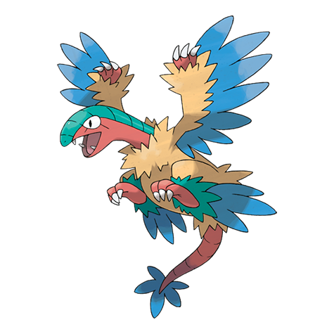

# #567 Archeops (First Bird Pokémon)

| Official Artwork | Shiny Artwork |
|------------------|---------------|
|  |  |

**Rising Ruby:** They are intelligent and will cooperate to catch prey. From the ground, they use a running start to take flight.

**Sinking Sapphire:** It runs better than it flies. It takes off into the sky by running at a speed of 25 mph.

---

## Media

### Default Sprites

| Front | Shiny | Back | Shiny |
|-------|-------|------|-------|
|  |  |  |  |

### Cries

Latest (Gen VI+):

<audio controls>
<source src='../../assets/cries/archeops/latest.ogg' type='audio/ogg'>
  Your browser does not support the audio element.
</audio>

Legacy:

<audio controls>
<source src='../../assets/cries/archeops/legacy.ogg' type='audio/ogg'>
  Your browser does not support the audio element.
</audio>

---

## Pokédex Data

| National № | Type(s) | Height | Weight | Abilities | Local № |
|------------|---------|--------|--------|-----------|---------|
| #567 | {: width="48"} {: width="48"} | 1.4 m / 4.6 ft | 32.0 kg / 70.5 lbs | 1. Defeatist | N/A |

---

## Base Stats
|   | HP | Attack | Defense | Sp. Atk | Sp. Def | Speed |
|---|----|--------|---------|---------|---------|-------|
| **Base** | 75 | 140 | 65 | 112 | 65 | 110 |
| **Min** | 260 | 256 | 121 | 206 | 121 | 202 |
| **Max** | 354 | 416 | 251 | 355 | 251 | 350 |

The ranges shown above are for a level 100 Pokémon. Maximum values are based on a beneficial nature, 252 EVs, 31 IVs; minimum values are based on a hindering nature, 0 EVs, 0 IVs.

---

## Forms & Evolutions

!!! warning "WARNING"

    Information on evolutions may not be 100% accurate; differences between evolution methods across generations are not accounted for.

### Forms

Archeops has no alternate forms.

### Evolution Line

1. [Archen](archen.md/)
    1. Level Up: [Archeops](archeops.md/)

---

## Training

| EV Yield | Catch Rate | Base Friendship | Base Exp. | Growth Rate | Held Items |
|----------|------------|-----------------|-----------|-------------|------------|
| 2 Atk | 45 | 50 | 177 | Medium | N/A |

---

## Breeding

| Egg Groups | Egg Cycles | Gender | Dimorphic | Color | Shape |
|------------|------------|--------|-----------|-------|-------|
| 1. Flying 2. Water3 | 30 | 87.5% Male 12.5% Female | False | Yellow | Wings |

---

## Moves

!!! warning "WARNING"

    Specific move information may be incorrect. However, the general movepool should be accurate; this includes changes made in Sacred Gold and Storm Silver.

### Level Up Moves

| Lv. | Move | Type | Cat. | Power | Acc. | PP |
| --- | --- | --- | --- | --- | --- | --- |
| 1 | Leer | {: width="48"} | {: width="36"} | — | 100 | 30 |
| 1 | Quick Attack | {: width="48"} | {: width="36"} | 40 | 100 | 30 |
| 1 | Wing Attack | {: width="48"} | {: width="36"} | 60 | 100 | 35 |
| 5 | Rock Throw | {: width="48"} | {: width="36"} | 50 | 90 | 15 |
| 8 | Double Team | {: width="48"} | {: width="36"} | — | — | 15 |
| 11 | Scary Face | {: width="48"} | {: width="36"} | — | 100 | 10 |
| 15 | Pluck | {: width="48"} | {: width="36"} | 60 | 100 | 20 |
| 18 | Ancient Power | {: width="48"} | {: width="36"} | 80 | 100 | 10 |
| 21 | Agility | {: width="48"} | {: width="36"} | — | — | 30 |
| 25 | Quick Guard | {: width="48"} | {: width="36"} | — | — | 15 |
| 28 | Acrobatics | {: width="48"} | {: width="36"} | 55 | 100 | 15 |
| 31 | Dragon Breath | {: width="48"} | {: width="36"} | 60 | 100 | 20 |
| 35 | Rock Slide | {: width="48"} | {: width="36"} | 75 | 90 | 10 |
| 40 | Crunch | {: width="48"} | {: width="36"} | 80 | 100 | 15 |
| 44 | Endeavor | {: width="48"} | {: width="36"} | — | 100 | 5 |
| 49 | U Turn | {: width="48"} | {: width="36"} | 70 | 100 | 20 |
| 54 | Stone Edge | {: width="48"} | {: width="36"} | 100 | 80 | 5 |
| 58 | Dragon Claw | {: width="48"} | {: width="36"} | 80 | 100 | 15 |
| 61 | Thrash | {: width="48"} | {: width="36"} | 120 | 100 | 10 |
| 65 | Earth Power | {: width="48"} | {: width="36"} | 90 | 100 | 10 |
| 68 | Head Smash | {: width="48"} | {: width="36"} | 150 | 80 | 5 |

### TM Moves

| TM | Move | Type | Cat. | Power | Acc. | PP |
| --- | --- | --- | --- | --- | --- | --- |
| HM01 | Cut | {: width="48"} | {: width="36"} | 70 | 100 | 15 |
| HM02 | Fly | {: width="48"} | {: width="36"} | 100 | 100 | 10 |
| HM06 | Rock Smash | {: width="48"} | {: width="36"} | 65 | 100 | 15 |
| TM01 | Hone Claws | {: width="48"} | {: width="36"} | — | — | 15 |
| TM02 | Dragon Claw | {: width="48"} | {: width="36"} | 80 | 100 | 15 |
| TM05 | Roar | {: width="48"} | {: width="36"} | — | — | 20 |
| TM06 | Toxic | {: width="48"} | {: width="36"} | — | 90 | 10 |
| TM10 | Hidden Power | {: width="48"} | {: width="36"} | 60 | 100 | 15 |
| TM100 | Confide | {: width="48"} | {: width="36"} | — | — | 20 |
| TM12 | Taunt | {: width="48"} | {: width="36"} | — | 100 | 20 |
| TM15 | Hyper Beam | {: width="48"} | {: width="36"} | 150 | 90 | 5 |
| TM17 | Protect | {: width="48"} | {: width="36"} | — | — | 10 |
| TM19 | Roost | {: width="48"} | {: width="36"} | — | — | 5 |
| TM21 | Frustration | {: width="48"} | {: width="36"} | — | 100 | 20 |
| TM23 | Smack Down | {: width="48"} | {: width="36"} | 50 | 100 | 15 |
| TM26 | Earthquake | {: width="48"} | {: width="36"} | 100 | 100 | 10 |
| TM27 | Return | {: width="48"} | {: width="36"} | — | 100 | 20 |
| TM28 | Dig | {: width="48"} | {: width="36"} | 80 | 100 | 10 |
| TM32 | Double Team | {: width="48"} | {: width="36"} | — | — | 15 |
| TM37 | Sandstorm | {: width="48"} | {: width="36"} | — | — | 10 |
| TM39 | Rock Tomb | {: width="48"} | {: width="36"} | 60 | 95 | 15 |
| TM40 | Aerial Ace | {: width="48"} | {: width="36"} | 60 | — | 20 |
| TM41 | Torment | {: width="48"} | {: width="36"} | — | 100 | 15 |
| TM42 | Facade | {: width="48"} | {: width="36"} | 70 | 100 | 20 |
| TM44 | Rest | {: width="48"} | {: width="36"} | — | — | 5 |
| TM45 | Attract | {: width="48"} | {: width="36"} | — | 100 | 15 |
| TM48 | Round | {: width="48"} | {: width="36"} | 60 | 100 | 15 |
| TM51 | Steel Wing | {: width="48"} | {: width="36"} | 70 | 90 | 25 |
| TM52 | Focus Blast | {: width="48"} | {: width="36"} | 120 | 70 | 5 |
| TM62 | Acrobatics | {: width="48"} | {: width="36"} | 55 | 100 | 15 |
| TM65 | Shadow Claw | {: width="48"} | {: width="36"} | 70 | 100 | 15 |
| TM68 | Giga Impact | {: width="48"} | {: width="36"} | 150 | 90 | 5 |
| TM69 | Rock Polish | {: width="48"} | {: width="36"} | — | — | 20 |
| TM71 | Stone Edge | {: width="48"} | {: width="36"} | 100 | 80 | 5 |
| TM78 | Bulldoze | {: width="48"} | {: width="36"} | 60 | 100 | 20 |
| TM80 | Rock Slide | {: width="48"} | {: width="36"} | 75 | 90 | 10 |
| TM82 | Dragon Tail | {: width="48"} | {: width="36"} | 60 | 90 | 10 |
| TM87 | Swagger | {: width="48"} | {: width="36"} | — | 85 | 15 |
| TM88 | Sleep Talk | {: width="48"} | {: width="36"} | — | — | 10 |
| TM89 | U Turn | {: width="48"} | {: width="36"} | 70 | 100 | 20 |
| TM90 | Substitute | {: width="48"} | {: width="36"} | — | — | 10 |
| TM94 | Secret Power | {: width="48"} | {: width="36"} | 70 | 100 | 20 |

### Egg Moves

Archeops cannot learn any moves by breeding.
### Tutor Moves

| Move | Type | Cat. | Power | Acc. | PP |
| --- | --- | --- | --- | --- | --- |
| Aqua Tail | {: width="48"} | {: width="36"} | 90 | 90 | 10 |
| Bounce | {: width="48"} | {: width="36"} | 85 | 85 | 5 |
| Dragon Pulse | {: width="48"} | {: width="36"} | 85 | 100 | 10 |
| Earth Power | {: width="48"} | {: width="36"} | 90 | 100 | 10 |
| Endeavor | {: width="48"} | {: width="36"} | — | 100 | 5 |
| Heat Wave | {: width="48"} | {: width="36"} | 95 | 90 | 10 |
| Iron Defense | {: width="48"} | {: width="36"} | — | — | 15 |
| Iron Tail | {: width="48"} | {: width="36"} | 100 | 75 | 15 |
| Knock Off | {: width="48"} | {: width="36"} | 65 | 100 | 20 |
| Outrage | {: width="48"} | {: width="36"} | 120 | 100 | 10 |
| Sky Attack | {: width="48"} | {: width="36"} | 140 | 90 | 5 |
| Snore | {: width="48"} | {: width="36"} | 50 | 100 | 15 |
| Stealth Rock | {: width="48"} | {: width="36"} | — | — | 20 |
| Tailwind | {: width="48"} | {: width="36"} | — | — | 15 |
| Uproar | {: width="48"} | {: width="36"} | 90 | 100 | 10 |
| Zen Headbutt | {: width="48"} | {: width="36"} | 80 | 90 | 15 |

