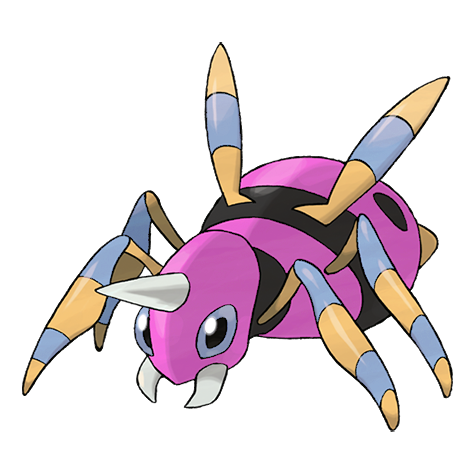

# #168 Ariados (Long Leg Pokémon)

| Official Artwork | Shiny Artwork |
|------------------|---------------|
|  |  |

Ariados’s feet are tipped with tiny hooked claws that enable it to scuttle on ceilings and vertical walls. This Pokémon constricts the foe with thin and strong silk webbing.

---

## Media

### Default Sprites

| Front | Shiny | Back | Shiny |
|-------|-------|------|-------|
|  |  |  |  |

### Cries

Latest (Gen VI+):

<audio controls>
<source src='../../assets/cries/ariados/latest.ogg' type='audio/ogg'>
  Your browser does not support the audio element.
</audio>

Legacy:

<audio controls>
<source src='../../assets/cries/ariados/legacy.ogg' type='audio/ogg'>
  Your browser does not support the audio element.
</audio>

---

## Pokédex Data

| National № | Type(s) | Height | Weight | Abilities | Local № |
|------------|---------|--------|--------|-----------|---------|
| #168 | {: width="48"} {: width="48"} | 1.1 m / 3.6 ft | 33.5 kg / 73.9 lbs | 1. Swarm 2. Insomnia | N/A |

---

## Base Stats
|   | HP | Attack | Defense | Sp. Atk | Sp. Def | Speed |
|---|----|--------|---------|---------|---------|-------|
| **Base** | 70 | 120 | 70 | 50 | 70 | 80 |
| **Min** | 250 | 220 | 130 | 94 | 130 | 148 |
| **Max** | 344 | 372 | 262 | 218 | 262 | 284 |

The ranges shown above are for a level 100 Pokémon. Maximum values are based on a beneficial nature, 252 EVs, 31 IVs; minimum values are based on a hindering nature, 0 EVs, 0 IVs.

---

## Forms & Evolutions

!!! warning "WARNING"

    Information on evolutions may not be 100% accurate; differences between evolution methods across generations are not accounted for.

### Forms

Ariados has no alternate forms.

### Evolution Line

1. [Spinarak](spinarak.md/)
    1. Level Up: [Ariados](ariados.md/)

---

## Training

| EV Yield | Catch Rate | Base Friendship | Base Exp. | Growth Rate | Held Items |
|----------|------------|-----------------|-----------|-------------|------------|
| 2 Atk | 90 | 70 | 140 | Fast | N/A |

---

## Breeding

| Egg Groups | Egg Cycles | Gender | Dimorphic | Color | Shape |
|------------|------------|--------|-----------|-------|-------|
| 1. Bug | 15 | 50.0% Male 50.0% Female | False | Red | Armor |

---

## Moves

!!! warning "WARNING"

    Specific move information may be incorrect. However, the general movepool should be accurate; this includes changes made in Sacred Gold and Storm Silver.

### Level Up Moves

| Lv. | Move | Type | Cat. | Power | Acc. | PP |
| --- | --- | --- | --- | --- | --- | --- |
| 1 | Electroweb | {: width="48"} | {: width="36"} | 55 | 95 | 15 |
| 1 | Fell Stinger | {: width="48"} | {: width="36"} | 50 | 100 | 25 |
| 1 | Poison Sting | {: width="48"} | {: width="36"} | 15 | 100 | 35 |
| 1 | String Shot | {: width="48"} | {: width="36"} | — | 95 | 40 |
| 1 | Venom Drench | {: width="48"} | {: width="36"} | — | 100 | 20 |
| 6 | Scary Face | {: width="48"} | {: width="36"} | — | 100 | 10 |
| 8 | Constrict | {: width="48"} | {: width="36"} | 10 | 100 | 35 |
| 10 | Leech Life | {: width="48"} | {: width="36"} | 80 | 100 | 10 |
| 12 | Bug Bite | {: width="48"} | {: width="36"} | 60 | 100 | 20 |
| 14 | Night Shade | {: width="48"} | {: width="36"} | — | 100 | 15 |
| 16 | Shadow Sneak | {: width="48"} | {: width="36"} | 40 | 100 | 30 |
| 18 | X Scissor | {: width="48"} | {: width="36"} | 80 | 100 | 15 |
| 20 | Fury Swipes | {: width="48"} | {: width="36"} | 18 | 80 | 15 |
| 23 | Cross Poison | {: width="48"} | {: width="36"} | 70 | 100 | 20 |
| 26 | Night Slash | {: width="48"} | {: width="36"} | 70 | 100 | 15 |
| 29 | Sucker Punch | {: width="48"} | {: width="36"} | 70 | 100 | 5 |
| 32 | Spider Web | {: width="48"} | {: width="36"} | — | — | 10 |
| 35 | Agility | {: width="48"} | {: width="36"} | — | — | 30 |
| 38 | Pin Missile | {: width="48"} | {: width="36"} | 25 | 95 | 20 |
| 41 | Psychic | {: width="48"} | {: width="36"} | 90 | 100 | 10 |
| 44 | Poison Jab | {: width="48"} | {: width="36"} | 80 | 100 | 20 |
| 47 | Sticky Web | {: width="48"} | {: width="36"} | — | — | 20 |
| 50 | Megahorn | {: width="48"} | {: width="36"} | 120 | 85 | 10 |

### TM Moves

| TM | Move | Type | Cat. | Power | Acc. | PP |
| --- | --- | --- | --- | --- | --- | --- |
| TM01 | Hone Claws | {: width="48"} | {: width="36"} | — | — | 15 |
| TM06 | Toxic | {: width="48"} | {: width="36"} | — | 90 | 10 |
| TM09 | Venoshock | {: width="48"} | {: width="36"} | 65 | 100 | 10 |
| TM10 | Hidden Power | {: width="48"} | {: width="36"} | 60 | 100 | 15 |
| TM100 | Confide | {: width="48"} | {: width="36"} | — | — | 20 |
| TM11 | Sunny Day | {: width="48"} | {: width="36"} | — | — | 5 |
| TM15 | Hyper Beam | {: width="48"} | {: width="36"} | 150 | 90 | 5 |
| TM17 | Protect | {: width="48"} | {: width="36"} | — | — | 10 |
| TM21 | Frustration | {: width="48"} | {: width="36"} | — | 100 | 20 |
| TM22 | Solar Beam | {: width="48"} | {: width="36"} | 120 | 100 | 10 |
| TM27 | Return | {: width="48"} | {: width="36"} | — | 100 | 20 |
| TM28 | Dig | {: width="48"} | {: width="36"} | 80 | 100 | 10 |
| TM29 | Psychic | {: width="48"} | {: width="36"} | 90 | 100 | 10 |
| TM32 | Double Team | {: width="48"} | {: width="36"} | — | — | 15 |
| TM36 | Sludge Bomb | {: width="48"} | {: width="36"} | 90 | 100 | 10 |
| TM42 | Facade | {: width="48"} | {: width="36"} | 70 | 100 | 20 |
| TM44 | Rest | {: width="48"} | {: width="36"} | — | — | 5 |
| TM45 | Attract | {: width="48"} | {: width="36"} | — | 100 | 15 |
| TM46 | Thief | {: width="48"} | {: width="36"} | 60 | 100 | 25 |
| TM48 | Round | {: width="48"} | {: width="36"} | 60 | 100 | 15 |
| TM68 | Giga Impact | {: width="48"} | {: width="36"} | 150 | 90 | 5 |
| TM70 | Flash | {: width="48"} | {: width="36"} | — | 100 | 20 |
| TM76 | Struggle Bug | {: width="48"} | {: width="36"} | 50 | 100 | 20 |
| TM81 | X Scissor | {: width="48"} | {: width="36"} | 80 | 100 | 15 |
| TM83 | Infestation | {: width="48"} | {: width="36"} | 20 | 100 | 20 |
| TM84 | Poison Jab | {: width="48"} | {: width="36"} | 80 | 100 | 20 |
| TM87 | Swagger | {: width="48"} | {: width="36"} | — | 85 | 15 |
| TM88 | Sleep Talk | {: width="48"} | {: width="36"} | — | — | 10 |
| TM90 | Substitute | {: width="48"} | {: width="36"} | — | — | 10 |
| TM94 | Secret Power | {: width="48"} | {: width="36"} | 70 | 100 | 20 |

### Egg Moves

Ariados cannot learn any moves by breeding.
### Tutor Moves

| Move | Type | Cat. | Power | Acc. | PP |
| --- | --- | --- | --- | --- | --- |
| Bounce | {: width="48"} | {: width="36"} | 85 | 85 | 5 |
| Bug Bite | {: width="48"} | {: width="36"} | 60 | 100 | 20 |
| Electroweb | {: width="48"} | {: width="36"} | 55 | 95 | 15 |
| Foul Play | {: width="48"} | {: width="36"} | 95 | 100 | 15 |
| Giga Drain | {: width="48"} | {: width="36"} | 75 | 100 | 10 |
| Signal Beam | {: width="48"} | {: width="36"} | 75 | 100 | 15 |
| Snore | {: width="48"} | {: width="36"} | 50 | 100 | 15 |

