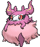

# #683 Aromatisse (Fragrance Pokémon)

| Official Artwork | Shiny Artwork |
|------------------|---------------|
|  |  |

**Rising Ruby:** It devises various scents, pleasant and unpleasant, and emits scents that its enemies dislike in order to gain an edge in battle.

**Sinking Sapphire:** Its scent is so overpowering that, unless a Trainer happens to really enjoy the smell, he or she will have a hard time walking alongside it.

---

## Media

### Default Sprites

| Front | Shiny | Back | Shiny |
|-------|-------|------|-------|
|  |  |  |  |

### Cries

Latest (Gen VI+):

<audio controls>
<source src='../../assets/cries/aromatisse/latest.ogg' type='audio/ogg'>
  Your browser does not support the audio element.
</audio>

Legacy:

<audio controls>
<source src='../../assets/cries/aromatisse/legacy.ogg' type='audio/ogg'>
  Your browser does not support the audio element.
</audio>

---

## Pokédex Data

| National № | Type(s) | Height | Weight | Abilities | Local № |
|------------|---------|--------|--------|-----------|---------|
| #683 | {: width="48"} | 0.8 m / 2.6 ft | 15.5 kg / 34.2 lbs | 1. Healer 2. Aroma Veil | N/A |

---

## Base Stats
|   | HP | Attack | Defense | Sp. Atk | Sp. Def | Speed |
|---|----|--------|---------|---------|---------|-------|
| **Base** | 101 | 72 | 72 | 99 | 89 | 29 |
| **Min** | 312 | 134 | 134 | 182 | 164 | 56 |
| **Max** | 406 | 267 | 267 | 326 | 304 | 172 |

The ranges shown above are for a level 100 Pokémon. Maximum values are based on a beneficial nature, 252 EVs, 31 IVs; minimum values are based on a hindering nature, 0 EVs, 0 IVs.

---

## Forms & Evolutions

!!! warning "WARNING"

    Information on evolutions may not be 100% accurate; differences between evolution methods across generations are not accounted for.

### Forms

Aromatisse has no alternate forms.

### Evolution Line

1. [Spritzee](spritzee.md/)
    1. Trade: [Aromatisse](aromatisse.md/)

---

## Training

| EV Yield | Catch Rate | Base Friendship | Base Exp. | Growth Rate | Held Items |
|----------|------------|-----------------|-----------|-------------|------------|
| 2 HP | 140 | 50 | 162 | Medium | N/A |

---

## Breeding

| Egg Groups | Egg Cycles | Gender | Dimorphic | Color | Shape |
|------------|------------|--------|-----------|-------|-------|
| 1. Fairy | 20 | 50.0% Male 50.0% Female | False | Pink | Humanoid |

---

## Moves

!!! warning "WARNING"

    Specific move information may be incorrect. However, the general movepool should be accurate; this includes changes made in Sacred Gold and Storm Silver.

### Level Up Moves

| Lv. | Move | Type | Cat. | Power | Acc. | PP |
| --- | --- | --- | --- | --- | --- | --- |
| 1 | Fairy Wind | {: width="48"} | {: width="36"} | 50 | 100 | 25 |
| 1 | Sweet Scent | {: width="48"} | {: width="36"} | — | 100 | 20 |
| 5 | Sweet Kiss | {: width="48"} | {: width="36"} | — | 75 | 10 |
| 8 | Odor Sleuth | {: width="48"} | {: width="36"} | — | — | 40 |
| 11 | Echoed Voice | {: width="48"} | {: width="36"} | 40 | 100 | 15 |
| 14 | Calm Mind | {: width="48"} | {: width="36"} | — | — | 20 |
| 17 | Draining Kiss | {: width="48"} | {: width="36"} | 75 | 100 | 10 |
| 20 | Aromatherapy | {: width="48"} | {: width="36"} | — | — | 5 |
| 23 | Attract | {: width="48"} | {: width="36"} | — | 100 | 15 |
| 26 | Moonblast | {: width="48"} | {: width="36"} | 95 | 100 | 15 |
| 29 | Charm | {: width="48"} | {: width="36"} | — | 100 | 20 |
| 32 | Flail | {: width="48"} | {: width="36"} | — | 100 | 15 |
| 35 | Misty Terrain | {: width="48"} | {: width="36"} | — | — | 10 |
| 38 | Skill Swap | {: width="48"} | {: width="36"} | — | — | 10 |
| 41 | Psychic | {: width="48"} | {: width="36"} | 90 | 100 | 10 |
| 44 | Disarming Voice | {: width="48"} | {: width="36"} | 60 | — | 20 |
| 47 | Trick Room | {: width="48"} | {: width="36"} | — | — | 5 |
| 50 | Aromatic Mist | {: width="48"} | {: width="36"} | — | — | 20 |
| 53 | Heal Pulse | {: width="48"} | {: width="36"} | — | — | 10 |
| 56 | Reflect | {: width="48"} | {: width="36"} | — | — | 20 |
| 59 | Psych Up | {: width="48"} | {: width="36"} | — | — | 10 |

### TM Moves

| TM | Move | Type | Cat. | Power | Acc. | PP |
| --- | --- | --- | --- | --- | --- | --- |
| TM03 | Psyshock | {: width="48"} | {: width="36"} | 80 | 100 | 10 |
| TM04 | Calm Mind | {: width="48"} | {: width="36"} | — | — | 20 |
| TM06 | Toxic | {: width="48"} | {: width="36"} | — | 90 | 10 |
| TM10 | Hidden Power | {: width="48"} | {: width="36"} | 60 | 100 | 15 |
| TM100 | Confide | {: width="48"} | {: width="36"} | — | — | 20 |
| TM11 | Sunny Day | {: width="48"} | {: width="36"} | — | — | 5 |
| TM15 | Hyper Beam | {: width="48"} | {: width="36"} | 150 | 90 | 5 |
| TM16 | Light Screen | {: width="48"} | {: width="36"} | — | — | 30 |
| TM17 | Protect | {: width="48"} | {: width="36"} | — | — | 10 |
| TM18 | Rain Dance | {: width="48"} | {: width="36"} | — | — | 5 |
| TM21 | Frustration | {: width="48"} | {: width="36"} | — | 100 | 20 |
| TM24 | Thunderbolt | {: width="48"} | {: width="36"} | 90 | 100 | 15 |
| TM25 | Thunder | {: width="48"} | {: width="36"} | 110 | 70 | 10 |
| TM27 | Return | {: width="48"} | {: width="36"} | — | 100 | 20 |
| TM29 | Psychic | {: width="48"} | {: width="36"} | 90 | 100 | 10 |
| TM32 | Double Team | {: width="48"} | {: width="36"} | — | — | 15 |
| TM33 | Reflect | {: width="48"} | {: width="36"} | — | — | 20 |
| TM41 | Torment | {: width="48"} | {: width="36"} | — | 100 | 15 |
| TM42 | Facade | {: width="48"} | {: width="36"} | 70 | 100 | 20 |
| TM44 | Rest | {: width="48"} | {: width="36"} | — | — | 5 |
| TM45 | Attract | {: width="48"} | {: width="36"} | — | 100 | 15 |
| TM48 | Round | {: width="48"} | {: width="36"} | 60 | 100 | 15 |
| TM49 | Echoed Voice | {: width="48"} | {: width="36"} | 40 | 100 | 15 |
| TM53 | Energy Ball | {: width="48"} | {: width="36"} | 90 | 100 | 10 |
| TM57 | Charge Beam | {: width="48"} | {: width="36"} | 50 | 90 | 10 |
| TM68 | Giga Impact | {: width="48"} | {: width="36"} | 150 | 90 | 5 |
| TM70 | Flash | {: width="48"} | {: width="36"} | — | 100 | 20 |
| TM74 | Gyro Ball | {: width="48"} | {: width="36"} | — | 100 | 5 |
| TM77 | Psych Up | {: width="48"} | {: width="36"} | — | — | 10 |
| TM85 | Dream Eater | {: width="48"} | {: width="36"} | 100 | 100 | 15 |
| TM87 | Swagger | {: width="48"} | {: width="36"} | — | 85 | 15 |
| TM88 | Sleep Talk | {: width="48"} | {: width="36"} | — | — | 10 |
| TM90 | Substitute | {: width="48"} | {: width="36"} | — | — | 10 |
| TM91 | Flash Cannon | {: width="48"} | {: width="36"} | 80 | 100 | 10 |
| TM92 | Trick Room | {: width="48"} | {: width="36"} | — | — | 5 |
| TM94 | Secret Power | {: width="48"} | {: width="36"} | 70 | 100 | 20 |
| TM99 | Dazzling Gleam | {: width="48"} | {: width="36"} | 80 | 100 | 10 |

### Egg Moves

Aromatisse cannot learn any moves by breeding.
### Tutor Moves

| Move | Type | Cat. | Power | Acc. | PP |
| --- | --- | --- | --- | --- | --- |
| After You | {: width="48"} | {: width="36"} | — | — | 15 |
| Covet | {: width="48"} | {: width="36"} | 60 | 100 | 25 |
| Drain Punch | {: width="48"} | {: width="36"} | 75 | 100 | 10 |
| Endeavor | {: width="48"} | {: width="36"} | — | 100 | 5 |
| Heal Bell | {: width="48"} | {: width="36"} | — | — | 5 |
| Helping Hand | {: width="48"} | {: width="36"} | — | — | 20 |
| Magic Coat | {: width="48"} | {: width="36"} | — | — | 15 |
| Skill Swap | {: width="48"} | {: width="36"} | — | — | 10 |
| Snore | {: width="48"} | {: width="36"} | 50 | 100 | 15 |

