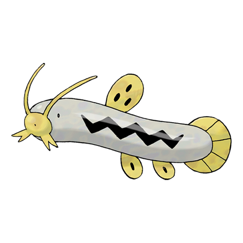
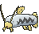
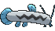
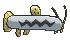

# #339 Barboach (Whiskers Pokémon)

| Official Artwork | Shiny Artwork |
|------------------|---------------|
|  |  |

**Rising Ruby:** Barboach’s sensitive whiskers serve as a superb radar system. This Pokémon hides in mud, leaving only its two whiskers exposed while it waits for prey to come along.

**Sinking Sapphire:** Barboach’s body is covered with a slimy film. If a foe grabs it, this Pokémon just slips out of the enemy’s grip. This Pokémon grows weak if the slimy coating dries up.

---

## Media

### Default Sprites

| Front | Shiny | Back | Shiny |
|-------|-------|------|-------|
|  |  |  |  |

### Cries

Latest (Gen VI+):

<audio controls>
<source src='../../assets/cries/barboach/latest.ogg' type='audio/ogg'>
  Your browser does not support the audio element.
</audio>

Legacy:

<audio controls>
<source src='../../assets/cries/barboach/legacy.ogg' type='audio/ogg'>
  Your browser does not support the audio element.
</audio>

---

## Pokédex Data

| National № | Type(s) | Height | Weight | Abilities | Local № |
|------------|---------|--------|--------|-----------|---------|
| #339 | {: width="48"} {: width="48"} | 0.4 m / 1.3 ft | 1.9 kg / 4.2 lbs | 1. Oblivious 2. Anticipation | #80 |

---

## Base Stats
|   | HP | Attack | Defense | Sp. Atk | Sp. Def | Speed |
|---|----|--------|---------|---------|---------|-------|
| **Base** | 50 | 48 | 43 | 46 | 41 | 60 |
| **Min** | 210 | 90 | 81 | 87 | 78 | 112 |
| **Max** | 304 | 214 | 203 | 210 | 199 | 240 |

The ranges shown above are for a level 100 Pokémon. Maximum values are based on a beneficial nature, 252 EVs, 31 IVs; minimum values are based on a hindering nature, 0 EVs, 0 IVs.

---

## Forms & Evolutions

!!! warning "WARNING"

    Information on evolutions may not be 100% accurate; differences between evolution methods across generations are not accounted for.

### Forms

Barboach has no alternate forms.

### Evolution Line

1. [Barboach](barboach.md/)
    1. Level Up: [Whiscash](whiscash.md/)

---

## Training

| EV Yield | Catch Rate | Base Friendship | Base Exp. | Growth Rate | Held Items |
|----------|------------|-----------------|-----------|-------------|------------|
| 1 HP | 190 | 50 | 58 | Medium | N/A |

---

## Breeding

| Egg Groups | Egg Cycles | Gender | Dimorphic | Color | Shape |
|------------|------------|--------|-----------|-------|-------|
| 1. Water2 | 20 | 50.0% Male 50.0% Female | False | Gray | Fish |

---

## Moves

!!! warning "WARNING"

    Specific move information may be incorrect. However, the general movepool should be accurate; this includes changes made in Sacred Gold and Storm Silver.

### Level Up Moves

| Lv. | Move | Type | Cat. | Power | Acc. | PP |
| --- | --- | --- | --- | --- | --- | --- |
| 1 | Mud Slap | {: width="48"} | {: width="36"} | 20 | 100 | 10 |
| 1 | Mud Sport | {: width="48"} | {: width="36"} | — | — | 15 |
| 1 | Water Sport | {: width="48"} | {: width="36"} | — | — | 15 |
| 6 | Water Gun | {: width="48"} | {: width="36"} | 40 | 100 | 25 |
| 9 | Mud Bomb | {: width="48"} | {: width="36"} | 65 | 85 | 10 |
| 12 | Amnesia | {: width="48"} | {: width="36"} | — | — | 20 |
| 15 | Water Pulse | {: width="48"} | {: width="36"} | 60 | 100 | 20 |
| 18 | Magnitude | {: width="48"} | {: width="36"} | — | 100 | 30 |
| 21 | Spark | {: width="48"} | {: width="36"} | 65 | 100 | 20 |
| 24 | Aqua Tail | {: width="48"} | {: width="36"} | 90 | 90 | 10 |
| 27 | Rest | {: width="48"} | {: width="36"} | — | — | 5 |
| 27 | Snore | {: width="48"} | {: width="36"} | 50 | 100 | 15 |
| 30 | Earthquake | {: width="48"} | {: width="36"} | 100 | 100 | 10 |
| 33 | Thrash | {: width="48"} | {: width="36"} | 120 | 100 | 10 |
| 36 | Muddy Water | {: width="48"} | {: width="36"} | 90 | 85 | 10 |
| 39 | Dragon Dance | {: width="48"} | {: width="36"} | — | — | 20 |
| 42 | Future Sight | {: width="48"} | {: width="36"} | 120 | 100 | 10 |
| 45 | Earth Power | {: width="48"} | {: width="36"} | 90 | 100 | 10 |
| 48 | Fissure | {: width="48"} | {: width="36"} | — | 30 | 5 |
| 51 | Hydro Pump | {: width="48"} | {: width="36"} | 110 | 80 | 5 |

### TM Moves

| TM | Move | Type | Cat. | Power | Acc. | PP |
| --- | --- | --- | --- | --- | --- | --- |
| HM03 | Surf | {: width="48"} | {: width="36"} | 90 | 100 | 15 |
| HM05 | Waterfall | {: width="48"} | {: width="36"} | 80 | 100 | 15 |
| HM07 | Dive | {: width="48"} | {: width="36"} | 80 | 100 | 10 |
| TM06 | Toxic | {: width="48"} | {: width="36"} | — | 90 | 10 |
| TM07 | Hail | {: width="48"} | {: width="36"} | — | — | 10 |
| TM10 | Hidden Power | {: width="48"} | {: width="36"} | 60 | 100 | 15 |
| TM100 | Confide | {: width="48"} | {: width="36"} | — | — | 20 |
| TM13 | Ice Beam | {: width="48"} | {: width="36"} | 90 | 100 | 10 |
| TM14 | Blizzard | {: width="48"} | {: width="36"} | 110 | 70 | 5 |
| TM17 | Protect | {: width="48"} | {: width="36"} | — | — | 10 |
| TM18 | Rain Dance | {: width="48"} | {: width="36"} | — | — | 5 |
| TM21 | Frustration | {: width="48"} | {: width="36"} | — | 100 | 20 |
| TM26 | Earthquake | {: width="48"} | {: width="36"} | 100 | 100 | 10 |
| TM27 | Return | {: width="48"} | {: width="36"} | — | 100 | 20 |
| TM32 | Double Team | {: width="48"} | {: width="36"} | — | — | 15 |
| TM37 | Sandstorm | {: width="48"} | {: width="36"} | — | — | 10 |
| TM39 | Rock Tomb | {: width="48"} | {: width="36"} | 60 | 95 | 15 |
| TM42 | Facade | {: width="48"} | {: width="36"} | 70 | 100 | 20 |
| TM44 | Rest | {: width="48"} | {: width="36"} | — | — | 5 |
| TM45 | Attract | {: width="48"} | {: width="36"} | — | 100 | 15 |
| TM48 | Round | {: width="48"} | {: width="36"} | 60 | 100 | 15 |
| TM55 | Scald | {: width="48"} | {: width="36"} | 80 | 100 | 15 |
| TM78 | Bulldoze | {: width="48"} | {: width="36"} | 60 | 100 | 20 |
| TM87 | Swagger | {: width="48"} | {: width="36"} | — | 85 | 15 |
| TM88 | Sleep Talk | {: width="48"} | {: width="36"} | — | — | 10 |
| TM90 | Substitute | {: width="48"} | {: width="36"} | — | — | 10 |
| TM94 | Secret Power | {: width="48"} | {: width="36"} | 70 | 100 | 20 |

### Egg Moves

| Move | Type | Cat. | Power | Acc. | PP |
| --- | --- | --- | --- | --- | --- |
| Dragon Dance | {: width="48"} | {: width="36"} | — | — | 20 |
| Earth Power | {: width="48"} | {: width="36"} | 90 | 100 | 10 |
| Flail | {: width="48"} | {: width="36"} | — | 100 | 15 |
| Hydro Pump | {: width="48"} | {: width="36"} | 110 | 80 | 5 |
| Mud Shot | {: width="48"} | {: width="36"} | 55 | 95 | 15 |
| Muddy Water | {: width="48"} | {: width="36"} | 90 | 85 | 10 |
| Spark | {: width="48"} | {: width="36"} | 65 | 100 | 20 |
| Take Down | {: width="48"} | {: width="36"} | 90 | 85 | 20 |
| Thrash | {: width="48"} | {: width="36"} | 120 | 100 | 10 |
| Whirlpool | {: width="48"} | {: width="36"} | 35 | 85 | 15 |

### Tutor Moves

| Move | Type | Cat. | Power | Acc. | PP |
| --- | --- | --- | --- | --- | --- |
| Aqua Tail | {: width="48"} | {: width="36"} | 90 | 90 | 10 |
| Bounce | {: width="48"} | {: width="36"} | 85 | 85 | 5 |
| Earth Power | {: width="48"} | {: width="36"} | 90 | 100 | 10 |
| Icy Wind | {: width="48"} | {: width="36"} | 55 | 95 | 15 |
| Snore | {: width="48"} | {: width="36"} | 50 | 100 | 15 |
| Water Pulse | {: width="48"} | {: width="36"} | 60 | 100 | 20 |

