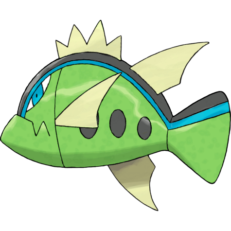
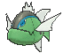
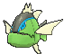
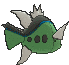
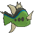

# Basculin Blue Striped (Hostile Pokémon)

| Official Artwork | Shiny Artwork |
|------------------|---------------|
|  |  |

**Rising Ruby:** Red- and blue-striped Basculin are very violent and always fighting. They are also remarkably tasty.

**Sinking Sapphire:** Red and blue Basculin usually do not get along, but sometimes members of one school mingle with the other’s school.

---

## Media

### Default Sprites

| Front | Shiny | Back | Shiny |
|-------|-------|------|-------|
|  |  |  |  |

### Cries

Latest (Gen VI+):

<audio controls>
<source src='../../assets/cries/basculin-blue-striped/latest.ogg' type='audio/ogg'>
  Your browser does not support the audio element.
</audio>

Legacy:

<audio controls>
<source src='../../assets/cries/basculin-blue-striped/legacy.ogg' type='audio/ogg'>
  Your browser does not support the audio element.
</audio>

---

## Pokédex Data

| National № | Type(s) | Height | Weight | Abilities | Local № |
|------------|---------|--------|--------|-----------|---------|
| #10016 | {: width="48"} | 1.0 m / 3.3 ft | 18.0 kg / 39.7 lbs | 1. Rock Head 2. Adaptability | N/A |

---

## Base Stats
|   | HP | Attack | Defense | Sp. Atk | Sp. Def | Speed |
|---|----|--------|---------|---------|---------|-------|
| **Base** | 70 | 92 | 65 | 80 | 55 | 98 |
| **Min** | 250 | 170 | 121 | 148 | 103 | 180 |
| **Max** | 344 | 311 | 251 | 284 | 229 | 324 |

The ranges shown above are for a level 100 Pokémon. Maximum values are based on a beneficial nature, 252 EVs, 31 IVs; minimum values are based on a hindering nature, 0 EVs, 0 IVs.

---

## Forms & Evolutions

!!! warning "WARNING"

    Information on evolutions may not be 100% accurate; differences between evolution methods across generations are not accounted for.

### Forms

1. [Basculin Red Striped](basculin-red-striped.md/)

2. [Basculin Blue Striped](basculin-blue-striped.md/)

### Evolution Line

1. [Basculin Blue Striped](basculin-blue-striped.md/)

1. [Basculin Red Striped](basculin-red-striped.md/)

---

## Training

| EV Yield | Catch Rate | Base Friendship | Base Exp. | Growth Rate | Held Items |
|----------|------------|-----------------|-----------|-------------|------------|
| 2 Spd | 25 | 50 | 161 | Medium | Deep Sea Scale (5%) |

---

## Breeding

| Egg Groups | Egg Cycles | Gender | Dimorphic | Color | Shape |
|------------|------------|--------|-----------|-------|-------|
| 1. Water2 | 40 | 50.0% Male 50.0% Female | False | Green | Fish |

---

## Moves

!!! warning "WARNING"

    Specific move information may be incorrect. However, the general movepool should be accurate; this includes changes made in Sacred Gold and Storm Silver.

### Level Up Moves

| Lv. | Move | Type | Cat. | Power | Acc. | PP |
| --- | --- | --- | --- | --- | --- | --- |
| 1 | Flail | {: width="48"} | {: width="36"} | — | 100 | 15 |
| 1 | Tackle | {: width="48"} | {: width="36"} | 40 | 100 | 35 |
| 1 | Tail Whip | {: width="48"} | {: width="36"} | — | 100 | 30 |
| 1 | Thrash | {: width="48"} | {: width="36"} | 120 | 100 | 10 |
| 1 | Water Gun | {: width="48"} | {: width="36"} | 40 | 100 | 25 |
| 4 | Uproar | {: width="48"} | {: width="36"} | 90 | 100 | 10 |
| 7 | Headbutt | {: width="48"} | {: width="36"} | 70 | 100 | 15 |
| 10 | Bite | {: width="48"} | {: width="36"} | 60 | 100 | 25 |
| 13 | Aqua Jet | {: width="48"} | {: width="36"} | 40 | 100 | 20 |
| 16 | Chip Away | {: width="48"} | {: width="36"} | 70 | 100 | 20 |
| 20 | Take Down | {: width="48"} | {: width="36"} | 90 | 85 | 20 |
| 24 | Crunch | {: width="48"} | {: width="36"} | 80 | 100 | 15 |
| 28 | Aqua Tail | {: width="48"} | {: width="36"} | 90 | 90 | 10 |
| 32 | Soak | {: width="48"} | {: width="36"} | — | 100 | 20 |
| 36 | Double Edge | {: width="48"} | {: width="36"} | 120 | 100 | 15 |
| 41 | Scary Face | {: width="48"} | {: width="36"} | — | 100 | 10 |
| 46 | Flail | {: width="48"} | {: width="36"} | — | 100 | 15 |
| 50 | Final Gambit | {: width="48"} | {: width="36"} | — | 100 | 5 |
| 56 | Thrash | {: width="48"} | {: width="36"} | 120 | 100 | 10 |

### TM Moves

| TM | Move | Type | Cat. | Power | Acc. | PP |
| --- | --- | --- | --- | --- | --- | --- |
| HM01 | Cut | {: width="48"} | {: width="36"} | 70 | 100 | 15 |
| HM03 | Surf | {: width="48"} | {: width="36"} | 90 | 100 | 15 |
| HM05 | Waterfall | {: width="48"} | {: width="36"} | 80 | 100 | 15 |
| HM07 | Dive | {: width="48"} | {: width="36"} | 80 | 100 | 10 |
| TM06 | Toxic | {: width="48"} | {: width="36"} | — | 90 | 10 |
| TM07 | Hail | {: width="48"} | {: width="36"} | — | — | 10 |
| TM10 | Hidden Power | {: width="48"} | {: width="36"} | 60 | 100 | 15 |
| TM100 | Confide | {: width="48"} | {: width="36"} | — | — | 20 |
| TM12 | Taunt | {: width="48"} | {: width="36"} | — | 100 | 20 |
| TM13 | Ice Beam | {: width="48"} | {: width="36"} | 90 | 100 | 10 |
| TM17 | Protect | {: width="48"} | {: width="36"} | — | — | 10 |
| TM18 | Rain Dance | {: width="48"} | {: width="36"} | — | — | 5 |
| TM21 | Frustration | {: width="48"} | {: width="36"} | — | 100 | 20 |
| TM27 | Return | {: width="48"} | {: width="36"} | — | 100 | 20 |
| TM32 | Double Team | {: width="48"} | {: width="36"} | — | — | 15 |
| TM42 | Facade | {: width="48"} | {: width="36"} | 70 | 100 | 20 |
| TM44 | Rest | {: width="48"} | {: width="36"} | — | — | 5 |
| TM45 | Attract | {: width="48"} | {: width="36"} | — | 100 | 15 |
| TM48 | Round | {: width="48"} | {: width="36"} | 60 | 100 | 15 |
| TM55 | Scald | {: width="48"} | {: width="36"} | 80 | 100 | 15 |
| TM87 | Swagger | {: width="48"} | {: width="36"} | — | 85 | 15 |
| TM88 | Sleep Talk | {: width="48"} | {: width="36"} | — | — | 10 |
| TM90 | Substitute | {: width="48"} | {: width="36"} | — | — | 10 |
| TM94 | Secret Power | {: width="48"} | {: width="36"} | 70 | 100 | 20 |

### Egg Moves

| Move | Type | Cat. | Power | Acc. | PP |
| --- | --- | --- | --- | --- | --- |
| Agility | {: width="48"} | {: width="36"} | — | — | 30 |
| Brine | {: width="48"} | {: width="36"} | 65 | 100 | 10 |
| Bubble Beam | {: width="48"} | {: width="36"} | 65 | 100 | 20 |
| Mud Shot | {: width="48"} | {: width="36"} | 55 | 95 | 15 |
| Muddy Water | {: width="48"} | {: width="36"} | 90 | 85 | 10 |
| Rage | {: width="48"} | {: width="36"} | 20 | 100 | 20 |
| Revenge | {: width="48"} | {: width="36"} | 60 | 100 | 10 |
| Swift | {: width="48"} | {: width="36"} | 60 | — | 20 |
| Whirlpool | {: width="48"} | {: width="36"} | 35 | 85 | 15 |

### Tutor Moves

| Move | Type | Cat. | Power | Acc. | PP |
| --- | --- | --- | --- | --- | --- |
| Aqua Tail | {: width="48"} | {: width="36"} | 90 | 90 | 10 |
| Bounce | {: width="48"} | {: width="36"} | 85 | 85 | 5 |
| Endeavor | {: width="48"} | {: width="36"} | — | 100 | 5 |
| Icy Wind | {: width="48"} | {: width="36"} | 55 | 95 | 15 |
| Snore | {: width="48"} | {: width="36"} | 50 | 100 | 15 |
| Superpower | {: width="48"} | {: width="36"} | 120 | 100 | 5 |
| Uproar | {: width="48"} | {: width="36"} | 90 | 100 | 10 |
| Zen Headbutt | {: width="48"} | {: width="36"} | 80 | 90 | 15 |

