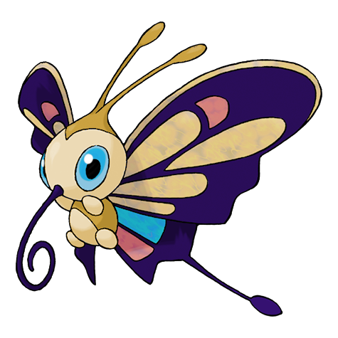

# #267 Beautifly (Butterfly Pokémon)

| Official Artwork | Shiny Artwork |
|------------------|---------------|
|  |  |

**Rising Ruby:** Beautifly’s favorite food is the sweet pollen of flowers. If you want to see this Pokémon, just leave a potted flower by an open window. Beautifly is sure to come looking for pollen.

**Sinking Sapphire:** Beautifly has a long mouth like a coiled needle, which is very convenient for collecting pollen from flowers. This Pokémon rides the spring winds as it flits around gathering pollen.

---

## Media

### Default Sprites

| Front | Shiny | Back | Shiny |
|-------|-------|------|-------|
|  |  | N/A | N/A |

### Female Sprites

| Front | Shiny | Back | Shiny |
|-------|-------|------|-------|
|  |  |  |  |

### Cries

Latest (Gen VI+):

<audio controls>
<source src='../../assets/cries/beautifly/latest.ogg' type='audio/ogg'>
  Your browser does not support the audio element.
</audio>

Legacy:

<audio controls>
<source src='../../assets/cries/beautifly/legacy.ogg' type='audio/ogg'>
  Your browser does not support the audio element.
</audio>

---

## Pokédex Data

| National № | Type(s) | Height | Weight | Abilities | Local № |
|------------|---------|--------|--------|-----------|---------|
| #267 | {: width="48"} {: width="48"} | 1.0 m / 3.3 ft | 28.4 kg / 62.6 lbs | 1. Swarm 2. Rivalry | #50 |

---

## Base Stats
|   | HP | Attack | Defense | Sp. Atk | Sp. Def | Speed |
|---|----|--------|---------|---------|---------|-------|
| **Base** | 65 | 70 | 55 | 120 | 55 | 85 |
| **Min** | 240 | 130 | 103 | 220 | 103 | 157 |
| **Max** | 334 | 262 | 229 | 372 | 229 | 295 |

The ranges shown above are for a level 100 Pokémon. Maximum values are based on a beneficial nature, 252 EVs, 31 IVs; minimum values are based on a hindering nature, 0 EVs, 0 IVs.

---

## Forms & Evolutions

!!! warning "WARNING"

    Information on evolutions may not be 100% accurate; differences between evolution methods across generations are not accounted for.

### Forms

Beautifly has no alternate forms.

### Evolution Line

1. [Wurmple](wurmple.md/)
    1. Level Up: [Silcoon](silcoon.md/)
        1. Level Up: [Beautifly](beautifly.md/)

    2. Level Up: [Cascoon](cascoon.md/)
        1. Level Up: [Dustox](dustox.md/)

---

## Training

| EV Yield | Catch Rate | Base Friendship | Base Exp. | Growth Rate | Held Items |
|----------|------------|-----------------|-----------|-------------|------------|
| 3 Sp.-Atk | 45 | 70 | 178 | Medium | Shed Shell (5%) |

---

## Breeding

| Egg Groups | Egg Cycles | Gender | Dimorphic | Color | Shape |
|------------|------------|--------|-----------|-------|-------|
| 1. Bug | 15 | 50.0% Male 50.0% Female | True | Yellow | Bug-Wings |

---

## Moves

!!! warning "WARNING"

    Specific move information may be incorrect. However, the general movepool should be accurate; this includes changes made in Sacred Gold and Storm Silver.

### Level Up Moves

| Lv. | Move | Type | Cat. | Power | Acc. | PP |
| --- | --- | --- | --- | --- | --- | --- |
| 1 | Gust | {: width="48"} | {: width="36"} | 40 | 100 | 35 |
| 10 | Gust | {: width="48"} | {: width="36"} | 40 | 100 | 35 |
| 12 | Absorb | {: width="48"} | {: width="36"} | 20 | 100 | 25 |
| 14 | Struggle Bug | {: width="48"} | {: width="36"} | 50 | 100 | 20 |
| 16 | Stun Spore | {: width="48"} | {: width="36"} | — | 75 | 30 |
| 18 | Morning Sun | {: width="48"} | {: width="36"} | — | — | 5 |
| 20 | Air Cutter | {: width="48"} | {: width="36"} | 60 | 95 | 25 |
| 22 | Mega Drain | {: width="48"} | {: width="36"} | 40 | 100 | 15 |
| 24 | Silver Wind | {: width="48"} | {: width="36"} | 60 | 100 | 5 |
| 26 | Attract | {: width="48"} | {: width="36"} | — | 100 | 15 |
| 28 | Giga Drain | {: width="48"} | {: width="36"} | 75 | 100 | 10 |
| 30 | Bug Buzz | {: width="48"} | {: width="36"} | 90 | 100 | 10 |
| 32 | Whirlwind | {: width="48"} | {: width="36"} | — | — | 20 |
| 34 | Rage | {: width="48"} | {: width="36"} | 20 | 100 | 20 |
| 36 | Energy Ball | {: width="48"} | {: width="36"} | 90 | 100 | 10 |
| 38 | Psychic | {: width="48"} | {: width="36"} | 90 | 100 | 10 |
| 40 | Air Slash | {: width="48"} | {: width="36"} | 75 | 95 | 15 |
| 42 | Quiver Dance | {: width="48"} | {: width="36"} | — | — | 20 |
| 44 | Hurricane | {: width="48"} | {: width="36"} | 110 | 70 | 10 |

### TM Moves

| TM | Move | Type | Cat. | Power | Acc. | PP |
| --- | --- | --- | --- | --- | --- | --- |
| HM02 | Fly | {: width="48"} | {: width="36"} | 100 | 100 | 10 |
| TM06 | Toxic | {: width="48"} | {: width="36"} | — | 90 | 10 |
| TM09 | Venoshock | {: width="48"} | {: width="36"} | 65 | 100 | 10 |
| TM10 | Hidden Power | {: width="48"} | {: width="36"} | 60 | 100 | 15 |
| TM100 | Confide | {: width="48"} | {: width="36"} | — | — | 20 |
| TM11 | Sunny Day | {: width="48"} | {: width="36"} | — | — | 5 |
| TM15 | Hyper Beam | {: width="48"} | {: width="36"} | 150 | 90 | 5 |
| TM17 | Protect | {: width="48"} | {: width="36"} | — | — | 10 |
| TM19 | Roost | {: width="48"} | {: width="36"} | — | — | 5 |
| TM20 | Safeguard | {: width="48"} | {: width="36"} | — | — | 25 |
| TM21 | Frustration | {: width="48"} | {: width="36"} | — | 100 | 20 |
| TM22 | Solar Beam | {: width="48"} | {: width="36"} | 120 | 100 | 10 |
| TM27 | Return | {: width="48"} | {: width="36"} | — | 100 | 20 |
| TM29 | Psychic | {: width="48"} | {: width="36"} | 90 | 100 | 10 |
| TM30 | Shadow Ball | {: width="48"} | {: width="36"} | 80 | 100 | 15 |
| TM32 | Double Team | {: width="48"} | {: width="36"} | — | — | 15 |
| TM40 | Aerial Ace | {: width="48"} | {: width="36"} | 60 | — | 20 |
| TM42 | Facade | {: width="48"} | {: width="36"} | 70 | 100 | 20 |
| TM44 | Rest | {: width="48"} | {: width="36"} | — | — | 5 |
| TM45 | Attract | {: width="48"} | {: width="36"} | — | 100 | 15 |
| TM46 | Thief | {: width="48"} | {: width="36"} | 60 | 100 | 25 |
| TM48 | Round | {: width="48"} | {: width="36"} | 60 | 100 | 15 |
| TM53 | Energy Ball | {: width="48"} | {: width="36"} | 90 | 100 | 10 |
| TM62 | Acrobatics | {: width="48"} | {: width="36"} | 55 | 100 | 15 |
| TM68 | Giga Impact | {: width="48"} | {: width="36"} | 150 | 90 | 5 |
| TM70 | Flash | {: width="48"} | {: width="36"} | — | 100 | 20 |
| TM76 | Struggle Bug | {: width="48"} | {: width="36"} | 50 | 100 | 20 |
| TM83 | Infestation | {: width="48"} | {: width="36"} | 20 | 100 | 20 |
| TM87 | Swagger | {: width="48"} | {: width="36"} | — | 85 | 15 |
| TM88 | Sleep Talk | {: width="48"} | {: width="36"} | — | — | 10 |
| TM89 | U Turn | {: width="48"} | {: width="36"} | 70 | 100 | 20 |
| TM90 | Substitute | {: width="48"} | {: width="36"} | — | — | 10 |
| TM94 | Secret Power | {: width="48"} | {: width="36"} | 70 | 100 | 20 |

### Egg Moves

Beautifly cannot learn any moves by breeding.
### Tutor Moves

| Move | Type | Cat. | Power | Acc. | PP |
| --- | --- | --- | --- | --- | --- |
| Bug Bite | {: width="48"} | {: width="36"} | 60 | 100 | 20 |
| Electroweb | {: width="48"} | {: width="36"} | 55 | 95 | 15 |
| Giga Drain | {: width="48"} | {: width="36"} | 75 | 100 | 10 |
| Signal Beam | {: width="48"} | {: width="36"} | 75 | 100 | 15 |
| Snore | {: width="48"} | {: width="36"} | 50 | 100 | 15 |
| Tailwind | {: width="48"} | {: width="36"} | — | — | 15 |

