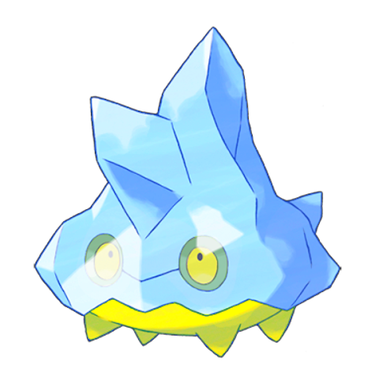
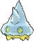
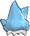
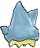

# #712 Bergmite (Ice Chunk Pokémon)

| Official Artwork | Shiny Artwork |
|------------------|---------------|
|  |  |

**Rising Ruby:** It blocks opponents’ attacks with the ice that shields its body. It uses cold air to repair any cracks with new ice.

**Sinking Sapphire:** Using air of -150 degrees Fahrenheit, they freeze opponents solid. They live in herds above the snow line on mountains.

---

## Media

### Default Sprites

| Front | Shiny | Back | Shiny |
|-------|-------|------|-------|
|  |  |  |  |

### Cries

Latest (Gen VI+):

<audio controls>
<source src='../../assets/cries/bergmite/latest.ogg' type='audio/ogg'>
  Your browser does not support the audio element.
</audio>

Legacy:

<audio controls>
<source src='../../assets/cries/bergmite/legacy.ogg' type='audio/ogg'>
  Your browser does not support the audio element.
</audio>

---

## Pokédex Data

| National № | Type(s) | Height | Weight | Abilities | Local № |
|------------|---------|--------|--------|-----------|---------|
| #712 | {: width="48"} | 1.0 m / 3.3 ft | 99.5 kg / 219.4 lbs | 1. Own Tempo 2. Ice Body | N/A |

---

## Base Stats
|   | HP | Attack | Defense | Sp. Atk | Sp. Def | Speed |
|---|----|--------|---------|---------|---------|-------|
| **Base** | 55 | 69 | 85 | 32 | 35 | 28 |
| **Min** | 220 | 128 | 157 | 62 | 67 | 54 |
| **Max** | 314 | 260 | 295 | 179 | 185 | 170 |

The ranges shown above are for a level 100 Pokémon. Maximum values are based on a beneficial nature, 252 EVs, 31 IVs; minimum values are based on a hindering nature, 0 EVs, 0 IVs.

---

## Forms & Evolutions

!!! warning "WARNING"

    Information on evolutions may not be 100% accurate; differences between evolution methods across generations are not accounted for.

### Forms

Bergmite has no alternate forms.

### Evolution Line

1. [Bergmite](bergmite.md/)
    1. Level Up: [Avalugg](avalugg.md/)

---

## Training

| EV Yield | Catch Rate | Base Friendship | Base Exp. | Growth Rate | Held Items |
|----------|------------|-----------------|-----------|-------------|------------|
| 1 Def | 190 | 50 | 61 | Medium | N/A |

---

## Breeding

| Egg Groups | Egg Cycles | Gender | Dimorphic | Color | Shape |
|------------|------------|--------|-----------|-------|-------|
| 1. Monster 2. Mineral | 20 | 50.0% Male 50.0% Female | False | Blue | Quadruped |

---

## Moves

!!! warning "WARNING"

    Specific move information may be incorrect. However, the general movepool should be accurate; this includes changes made in Sacred Gold and Storm Silver.

### Level Up Moves

| Lv. | Move | Type | Cat. | Power | Acc. | PP |
| --- | --- | --- | --- | --- | --- | --- |
| 1 | Bite | {: width="48"} | {: width="36"} | 60 | 100 | 25 |
| 1 | Harden | {: width="48"} | {: width="36"} | — | — | 30 |
| 1 | Tackle | {: width="48"} | {: width="36"} | 40 | 100 | 35 |
| 9 | Powder Snow | {: width="48"} | {: width="36"} | 40 | 100 | 25 |
| 12 | Icy Wind | {: width="48"} | {: width="36"} | 55 | 95 | 15 |
| 15 | Take Down | {: width="48"} | {: width="36"} | 90 | 85 | 20 |
| 18 | Sharpen | {: width="48"} | {: width="36"} | — | — | 30 |
| 21 | Curse | {: width="48"} | {: width="36"} | — | — | 10 |
| 24 | Ice Fang | {: width="48"} | {: width="36"} | 65 | 95 | 15 |
| 27 | Ice Ball | {: width="48"} | {: width="36"} | 30 | 90 | 20 |
| 30 | Rapid Spin | {: width="48"} | {: width="36"} | 50 | 100 | 40 |
| 33 | Rock Slide | {: width="48"} | {: width="36"} | 75 | 90 | 10 |
| 36 | Avalanche | {: width="48"} | {: width="36"} | 60 | 100 | 10 |
| 39 | Recover | {: width="48"} | {: width="36"} | — | — | 5 |
| 42 | Blizzard | {: width="48"} | {: width="36"} | 110 | 70 | 5 |
| 45 | Stone Edge | {: width="48"} | {: width="36"} | 100 | 80 | 5 |
| 48 | Double Edge | {: width="48"} | {: width="36"} | 120 | 100 | 15 |

### TM Moves

| TM | Move | Type | Cat. | Power | Acc. | PP |
| --- | --- | --- | --- | --- | --- | --- |
| HM03 | Surf | {: width="48"} | {: width="36"} | 90 | 100 | 15 |
| HM04 | Strength | {: width="48"} | {: width="36"} | 100 | 100 | 10 |
| HM06 | Rock Smash | {: width="48"} | {: width="36"} | 65 | 100 | 15 |
| TM06 | Toxic | {: width="48"} | {: width="36"} | — | 90 | 10 |
| TM07 | Hail | {: width="48"} | {: width="36"} | — | — | 10 |
| TM10 | Hidden Power | {: width="48"} | {: width="36"} | 60 | 100 | 15 |
| TM100 | Confide | {: width="48"} | {: width="36"} | — | — | 20 |
| TM13 | Ice Beam | {: width="48"} | {: width="36"} | 90 | 100 | 10 |
| TM14 | Blizzard | {: width="48"} | {: width="36"} | 110 | 70 | 5 |
| TM17 | Protect | {: width="48"} | {: width="36"} | — | — | 10 |
| TM18 | Rain Dance | {: width="48"} | {: width="36"} | — | — | 5 |
| TM20 | Safeguard | {: width="48"} | {: width="36"} | — | — | 25 |
| TM21 | Frustration | {: width="48"} | {: width="36"} | — | 100 | 20 |
| TM27 | Return | {: width="48"} | {: width="36"} | — | 100 | 20 |
| TM32 | Double Team | {: width="48"} | {: width="36"} | — | — | 15 |
| TM39 | Rock Tomb | {: width="48"} | {: width="36"} | 60 | 95 | 15 |
| TM42 | Facade | {: width="48"} | {: width="36"} | 70 | 100 | 20 |
| TM44 | Rest | {: width="48"} | {: width="36"} | — | — | 5 |
| TM45 | Attract | {: width="48"} | {: width="36"} | — | 100 | 15 |
| TM48 | Round | {: width="48"} | {: width="36"} | 60 | 100 | 15 |
| TM69 | Rock Polish | {: width="48"} | {: width="36"} | — | — | 20 |
| TM70 | Flash | {: width="48"} | {: width="36"} | — | 100 | 20 |
| TM71 | Stone Edge | {: width="48"} | {: width="36"} | 100 | 80 | 5 |
| TM74 | Gyro Ball | {: width="48"} | {: width="36"} | — | 100 | 5 |
| TM79 | Frost Breath | {: width="48"} | {: width="36"} | 60 | 90 | 10 |
| TM80 | Rock Slide | {: width="48"} | {: width="36"} | 75 | 90 | 10 |
| TM87 | Swagger | {: width="48"} | {: width="36"} | — | 85 | 15 |
| TM88 | Sleep Talk | {: width="48"} | {: width="36"} | — | — | 10 |
| TM90 | Substitute | {: width="48"} | {: width="36"} | — | — | 10 |
| TM91 | Flash Cannon | {: width="48"} | {: width="36"} | 80 | 100 | 10 |
| TM94 | Secret Power | {: width="48"} | {: width="36"} | 70 | 100 | 20 |

### Egg Moves

| Move | Type | Cat. | Power | Acc. | PP |
| --- | --- | --- | --- | --- | --- |
| Barrier | {: width="48"} | {: width="36"} | — | — | 20 |
| Mirror Coat | {: width="48"} | {: width="36"} | — | 100 | 20 |
| Mist | {: width="48"} | {: width="36"} | — | — | 30 |
| Recover | {: width="48"} | {: width="36"} | — | — | 5 |

### Tutor Moves

| Move | Type | Cat. | Power | Acc. | PP |
| --- | --- | --- | --- | --- | --- |
| After You | {: width="48"} | {: width="36"} | — | — | 15 |
| Icy Wind | {: width="48"} | {: width="36"} | 55 | 95 | 15 |
| Iron Defense | {: width="48"} | {: width="36"} | — | — | 15 |
| Snore | {: width="48"} | {: width="36"} | 50 | 100 | 15 |
| Water Pulse | {: width="48"} | {: width="36"} | 60 | 100 | 20 |

