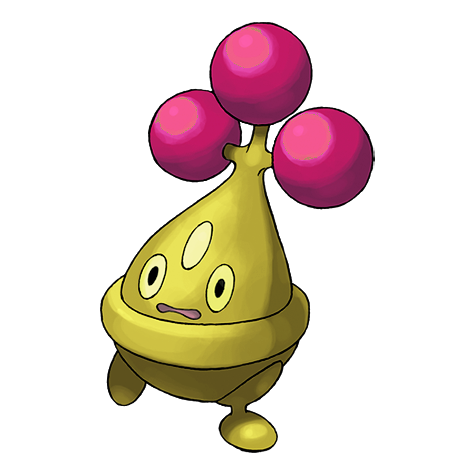

# #438 Bonsly (Bonsai Pokémon)

| Official Artwork | Shiny Artwork |
|------------------|---------------|
|  |  |

**Rising Ruby:** It prefers arid environments. It leaks water from its eyes to adjust its body’s fluid levels.

**Sinking Sapphire:** It prefers an arid atmosphere. It leaks water that looks like tears when adjusting its moisture level.

---

## Media

### Default Sprites

| Front | Shiny | Back | Shiny |
|-------|-------|------|-------|
|  |  |  |  |

### Cries

Latest (Gen VI+):

<audio controls>
<source src='../../assets/cries/bonsly/latest.ogg' type='audio/ogg'>
  Your browser does not support the audio element.
</audio>

Legacy:

<audio controls>
<source src='../../assets/cries/bonsly/legacy.ogg' type='audio/ogg'>
  Your browser does not support the audio element.
</audio>

---

## Pokédex Data

| National № | Type(s) | Height | Weight | Abilities | Local № |
|------------|---------|--------|--------|-----------|---------|
| #438 | {: width="48"} | 0.5 m / 1.6 ft | 15.0 kg / 33.1 lbs | 1. Sturdy 2. Rock Head | #92 |

---

## Base Stats
|   | HP | Attack | Defense | Sp. Atk | Sp. Def | Speed |
|---|----|--------|---------|---------|---------|-------|
| **Base** | 50 | 80 | 95 | 10 | 45 | 10 |
| **Min** | 210 | 148 | 175 | 22 | 85 | 22 |
| **Max** | 304 | 284 | 317 | 130 | 207 | 130 |

The ranges shown above are for a level 100 Pokémon. Maximum values are based on a beneficial nature, 252 EVs, 31 IVs; minimum values are based on a hindering nature, 0 EVs, 0 IVs.

---

## Forms & Evolutions

!!! warning "WARNING"

    Information on evolutions may not be 100% accurate; differences between evolution methods across generations are not accounted for.

### Forms

Bonsly has no alternate forms.

### Evolution Line

1. [Bonsly](bonsly.md/)
    1. Level Up: [Sudowoodo](sudowoodo.md/)

---

## Training

| EV Yield | Catch Rate | Base Friendship | Base Exp. | Growth Rate | Held Items |
|----------|------------|-----------------|-----------|-------------|------------|
| 1 Def | 255 | 50 | 58 | Medium | N/A |

---

## Breeding

| Egg Groups | Egg Cycles | Gender | Dimorphic | Color | Shape |
|------------|------------|--------|-----------|-------|-------|
| 1. No-Eggs | 20 | 50.0% Male 50.0% Female | False | Brown | Legs |

---

## Moves

!!! warning "WARNING"

    Specific move information may be incorrect. However, the general movepool should be accurate; this includes changes made in Sacred Gold and Storm Silver.

### Level Up Moves

| Lv. | Move | Type | Cat. | Power | Acc. | PP |
| --- | --- | --- | --- | --- | --- | --- |
| 1 | Copycat | {: width="48"} | {: width="36"} | — | — | 20 |
| 1 | Fake Tears | {: width="48"} | {: width="36"} | — | 100 | 20 |
| 5 | Flail | {: width="48"} | {: width="36"} | — | 100 | 15 |
| 8 | Low Kick | {: width="48"} | {: width="36"} | — | 100 | 20 |
| 12 | Rock Throw | {: width="48"} | {: width="36"} | 50 | 90 | 15 |
| 15 | Mimic | {: width="48"} | {: width="36"} | — | — | 10 |
| 19 | Feint Attack | {: width="48"} | {: width="36"} | 60 | — | 20 |
| 22 | Rock Tomb | {: width="48"} | {: width="36"} | 60 | 95 | 15 |
| 26 | Block | {: width="48"} | {: width="36"} | — | — | 5 |
| 29 | Rock Slide | {: width="48"} | {: width="36"} | 75 | 90 | 10 |
| 33 | Counter | {: width="48"} | {: width="36"} | — | 100 | 20 |
| 36 | Sucker Punch | {: width="48"} | {: width="36"} | 70 | 100 | 5 |
| 40 | Double Edge | {: width="48"} | {: width="36"} | 120 | 100 | 15 |

### TM Moves

| TM | Move | Type | Cat. | Power | Acc. | PP |
| --- | --- | --- | --- | --- | --- | --- |
| TM04 | Calm Mind | {: width="48"} | {: width="36"} | — | — | 20 |
| TM06 | Toxic | {: width="48"} | {: width="36"} | — | 90 | 10 |
| TM10 | Hidden Power | {: width="48"} | {: width="36"} | 60 | 100 | 15 |
| TM100 | Confide | {: width="48"} | {: width="36"} | — | — | 20 |
| TM11 | Sunny Day | {: width="48"} | {: width="36"} | — | — | 5 |
| TM17 | Protect | {: width="48"} | {: width="36"} | — | — | 10 |
| TM21 | Frustration | {: width="48"} | {: width="36"} | — | 100 | 20 |
| TM23 | Smack Down | {: width="48"} | {: width="36"} | 50 | 100 | 15 |
| TM27 | Return | {: width="48"} | {: width="36"} | — | 100 | 20 |
| TM28 | Dig | {: width="48"} | {: width="36"} | 80 | 100 | 10 |
| TM31 | Brick Break | {: width="48"} | {: width="36"} | 75 | 100 | 15 |
| TM32 | Double Team | {: width="48"} | {: width="36"} | — | — | 15 |
| TM37 | Sandstorm | {: width="48"} | {: width="36"} | — | — | 10 |
| TM39 | Rock Tomb | {: width="48"} | {: width="36"} | 60 | 95 | 15 |
| TM42 | Facade | {: width="48"} | {: width="36"} | 70 | 100 | 20 |
| TM44 | Rest | {: width="48"} | {: width="36"} | — | — | 5 |
| TM45 | Attract | {: width="48"} | {: width="36"} | — | 100 | 15 |
| TM46 | Thief | {: width="48"} | {: width="36"} | 60 | 100 | 25 |
| TM48 | Round | {: width="48"} | {: width="36"} | 60 | 100 | 15 |
| TM64 | Explosion | {: width="48"} | {: width="36"} | 250 | 100 | 5 |
| TM69 | Rock Polish | {: width="48"} | {: width="36"} | — | — | 20 |
| TM77 | Psych Up | {: width="48"} | {: width="36"} | — | — | 10 |
| TM80 | Rock Slide | {: width="48"} | {: width="36"} | 75 | 90 | 10 |
| TM87 | Swagger | {: width="48"} | {: width="36"} | — | 85 | 15 |
| TM88 | Sleep Talk | {: width="48"} | {: width="36"} | — | — | 10 |
| TM90 | Substitute | {: width="48"} | {: width="36"} | — | — | 10 |
| TM94 | Secret Power | {: width="48"} | {: width="36"} | 70 | 100 | 20 |
| TM96 | Nature Power | {: width="48"} | {: width="36"} | — | — | 20 |

### Egg Moves

| Move | Type | Cat. | Power | Acc. | PP |
| --- | --- | --- | --- | --- | --- |
| Curse | {: width="48"} | {: width="36"} | — | — | 10 |
| Defense Curl | {: width="48"} | {: width="36"} | — | — | 40 |
| Endure | {: width="48"} | {: width="36"} | — | — | 10 |
| Harden | {: width="48"} | {: width="36"} | — | — | 30 |
| Headbutt | {: width="48"} | {: width="36"} | 70 | 100 | 15 |
| Rollout | {: width="48"} | {: width="36"} | 30 | 90 | 20 |
| Sand Tomb | {: width="48"} | {: width="36"} | 35 | 85 | 15 |
| Self Destruct | {: width="48"} | {: width="36"} | 200 | 100 | 5 |
| Stealth Rock | {: width="48"} | {: width="36"} | — | — | 20 |

### Tutor Moves

| Move | Type | Cat. | Power | Acc. | PP |
| --- | --- | --- | --- | --- | --- |
| After You | {: width="48"} | {: width="36"} | — | — | 15 |
| Block | {: width="48"} | {: width="36"} | — | — | 5 |
| Covet | {: width="48"} | {: width="36"} | 60 | 100 | 25 |
| Earth Power | {: width="48"} | {: width="36"} | 90 | 100 | 10 |
| Foul Play | {: width="48"} | {: width="36"} | 95 | 100 | 15 |
| Helping Hand | {: width="48"} | {: width="36"} | — | — | 20 |
| Low Kick | {: width="48"} | {: width="36"} | — | 100 | 20 |
| Role Play | {: width="48"} | {: width="36"} | — | — | 10 |
| Snore | {: width="48"} | {: width="36"} | 50 | 100 | 15 |
| Stealth Rock | {: width="48"} | {: width="36"} | — | — | 20 |
| Uproar | {: width="48"} | {: width="36"} | 90 | 100 | 10 |

