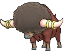
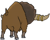
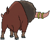

# #626 Bouffalant (Bash Buffalo Pokémon)

| Official Artwork | Shiny Artwork |
|------------------|---------------|
|  |  |

**Rising Ruby:** They charge wildly and headbutt everything. Their headbutts have enough destructive force to derail a train.

**Sinking Sapphire:** Their fluffy fur absorbs damage, even if they strike foes with a fierce headbutt.

---

## Media

### Default Sprites

| Front | Shiny | Back | Shiny |
|-------|-------|------|-------|
|  |  |  |  |

### Cries

Latest (Gen VI+):

<audio controls>
<source src='../../assets/cries/bouffalant/latest.ogg' type='audio/ogg'>
  Your browser does not support the audio element.
</audio>

Legacy:

<audio controls>
<source src='../../assets/cries/bouffalant/legacy.ogg' type='audio/ogg'>
  Your browser does not support the audio element.
</audio>

---

## Pokédex Data

| National № | Type(s) | Height | Weight | Abilities | Local № |
|------------|---------|--------|--------|-----------|---------|
| #626 | {: width="48"} | 1.6 m / 5.2 ft | 94.6 kg / 208.6 lbs | 1. Reckless 2. Sap Sipper | N/A |

---

## Base Stats
|   | HP | Attack | Defense | Sp. Atk | Sp. Def | Speed |
|---|----|--------|---------|---------|---------|-------|
| **Base** | 95 | 110 | 95 | 40 | 95 | 55 |
| **Min** | 300 | 202 | 175 | 76 | 175 | 103 |
| **Max** | 394 | 350 | 317 | 196 | 317 | 229 |

The ranges shown above are for a level 100 Pokémon. Maximum values are based on a beneficial nature, 252 EVs, 31 IVs; minimum values are based on a hindering nature, 0 EVs, 0 IVs.

---

## Forms & Evolutions

!!! warning "WARNING"

    Information on evolutions may not be 100% accurate; differences between evolution methods across generations are not accounted for.

### Forms

Bouffalant has no alternate forms.

### Evolution Line

1. [Bouffalant](bouffalant.md/)

---

## Training

| EV Yield | Catch Rate | Base Friendship | Base Exp. | Growth Rate | Held Items |
|----------|------------|-----------------|-----------|-------------|------------|
| 2 Atk | 45 | 50 | 172 | Medium | N/A |

---

## Breeding

| Egg Groups | Egg Cycles | Gender | Dimorphic | Color | Shape |
|------------|------------|--------|-----------|-------|-------|
| 1. Ground | 20 | 50.0% Male 50.0% Female | False | Brown | Quadruped |

---

## Moves

!!! warning "WARNING"

    Specific move information may be incorrect. However, the general movepool should be accurate; this includes changes made in Sacred Gold and Storm Silver.

### Level Up Moves

| Lv. | Move | Type | Cat. | Power | Acc. | PP |
| --- | --- | --- | --- | --- | --- | --- |
| 1 | Leer | {: width="48"} | {: width="36"} | — | 100 | 30 |
| 1 | Pursuit | {: width="48"} | {: width="36"} | 40 | 100 | 20 |
| 6 | Rage | {: width="48"} | {: width="36"} | 20 | 100 | 20 |
| 10 | Fury Attack | {: width="48"} | {: width="36"} | 15 | 85 | 20 |
| 14 | Horn Attack | {: width="48"} | {: width="36"} | 65 | 100 | 25 |
| 18 | Scary Face | {: width="48"} | {: width="36"} | — | 100 | 10 |
| 22 | Revenge | {: width="48"} | {: width="36"} | 60 | 100 | 10 |
| 26 | Focus Energy | {: width="48"} | {: width="36"} | — | — | 30 |
| 30 | Head Charge | {: width="48"} | {: width="36"} | 120 | 100 | 15 |
| 34 | Zen Headbutt | {: width="48"} | {: width="36"} | 80 | 90 | 15 |
| 38 | Megahorn | {: width="48"} | {: width="36"} | 120 | 85 | 10 |
| 42 | Skull Bash | {: width="48"} | {: width="36"} | 130 | 100 | 10 |
| 46 | Reversal | {: width="48"} | {: width="36"} | — | 100 | 15 |
| 50 | Thrash | {: width="48"} | {: width="36"} | 120 | 100 | 10 |
| 54 | Wild Charge | {: width="48"} | {: width="36"} | 90 | 100 | 15 |
| 58 | Swords Dance | {: width="48"} | {: width="36"} | — | — | 20 |
| 62 | Outrage | {: width="48"} | {: width="36"} | 120 | 100 | 10 |
| 66 | Giga Impact | {: width="48"} | {: width="36"} | 150 | 90 | 5 |

### TM Moves

| TM | Move | Type | Cat. | Power | Acc. | PP |
| --- | --- | --- | --- | --- | --- | --- |
| HM01 | Cut | {: width="48"} | {: width="36"} | 70 | 100 | 15 |
| HM03 | Surf | {: width="48"} | {: width="36"} | 90 | 100 | 15 |
| HM04 | Strength | {: width="48"} | {: width="36"} | 100 | 100 | 10 |
| HM06 | Rock Smash | {: width="48"} | {: width="36"} | 65 | 100 | 15 |
| TM06 | Toxic | {: width="48"} | {: width="36"} | — | 90 | 10 |
| TM10 | Hidden Power | {: width="48"} | {: width="36"} | 60 | 100 | 15 |
| TM100 | Confide | {: width="48"} | {: width="36"} | — | — | 20 |
| TM11 | Sunny Day | {: width="48"} | {: width="36"} | — | — | 5 |
| TM12 | Taunt | {: width="48"} | {: width="36"} | — | 100 | 20 |
| TM17 | Protect | {: width="48"} | {: width="36"} | — | — | 10 |
| TM18 | Rain Dance | {: width="48"} | {: width="36"} | — | — | 5 |
| TM21 | Frustration | {: width="48"} | {: width="36"} | — | 100 | 20 |
| TM26 | Earthquake | {: width="48"} | {: width="36"} | 100 | 100 | 10 |
| TM27 | Return | {: width="48"} | {: width="36"} | — | 100 | 20 |
| TM32 | Double Team | {: width="48"} | {: width="36"} | — | — | 15 |
| TM39 | Rock Tomb | {: width="48"} | {: width="36"} | 60 | 95 | 15 |
| TM40 | Aerial Ace | {: width="48"} | {: width="36"} | 60 | — | 20 |
| TM42 | Facade | {: width="48"} | {: width="36"} | 70 | 100 | 20 |
| TM44 | Rest | {: width="48"} | {: width="36"} | — | — | 5 |
| TM45 | Attract | {: width="48"} | {: width="36"} | — | 100 | 15 |
| TM48 | Round | {: width="48"} | {: width="36"} | 60 | 100 | 15 |
| TM66 | Payback | {: width="48"} | {: width="36"} | 50 | 100 | 10 |
| TM67 | Retaliate | {: width="48"} | {: width="36"} | 70 | 100 | 5 |
| TM68 | Giga Impact | {: width="48"} | {: width="36"} | 150 | 90 | 5 |
| TM71 | Stone Edge | {: width="48"} | {: width="36"} | 100 | 80 | 5 |
| TM75 | Swords Dance | {: width="48"} | {: width="36"} | — | — | 20 |
| TM78 | Bulldoze | {: width="48"} | {: width="36"} | 60 | 100 | 20 |
| TM80 | Rock Slide | {: width="48"} | {: width="36"} | 75 | 90 | 10 |
| TM84 | Poison Jab | {: width="48"} | {: width="36"} | 80 | 100 | 20 |
| TM87 | Swagger | {: width="48"} | {: width="36"} | — | 85 | 15 |
| TM88 | Sleep Talk | {: width="48"} | {: width="36"} | — | — | 10 |
| TM90 | Substitute | {: width="48"} | {: width="36"} | — | — | 10 |
| TM93 | Wild Charge | {: width="48"} | {: width="36"} | 90 | 100 | 15 |
| TM94 | Secret Power | {: width="48"} | {: width="36"} | 70 | 100 | 20 |

### Egg Moves

| Move | Type | Cat. | Power | Acc. | PP |
| --- | --- | --- | --- | --- | --- |
| Amnesia | {: width="48"} | {: width="36"} | — | — | 20 |
| Belch | {: width="48"} | {: width="36"} | 120 | 90 | 10 |
| Headbutt | {: width="48"} | {: width="36"} | 70 | 100 | 15 |
| Iron Head | {: width="48"} | {: width="36"} | 80 | 100 | 15 |
| Mud Shot | {: width="48"} | {: width="36"} | 55 | 95 | 15 |
| Mud Slap | {: width="48"} | {: width="36"} | 20 | 100 | 10 |
| Rock Climb | {: width="48"} | {: width="36"} | 90 | 85 | 20 |
| Skull Bash | {: width="48"} | {: width="36"} | 130 | 100 | 10 |
| Stomp | {: width="48"} | {: width="36"} | 65 | 100 | 20 |

### Tutor Moves

| Move | Type | Cat. | Power | Acc. | PP |
| --- | --- | --- | --- | --- | --- |
| Endeavor | {: width="48"} | {: width="36"} | — | 100 | 5 |
| Iron Head | {: width="48"} | {: width="36"} | 80 | 100 | 15 |
| Outrage | {: width="48"} | {: width="36"} | 120 | 100 | 10 |
| Snore | {: width="48"} | {: width="36"} | 50 | 100 | 15 |
| Superpower | {: width="48"} | {: width="36"} | 120 | 100 | 5 |
| Uproar | {: width="48"} | {: width="36"} | 90 | 100 | 10 |
| Zen Headbutt | {: width="48"} | {: width="36"} | 80 | 90 | 15 |

