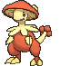
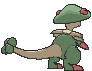
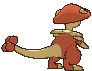

# #286 Breloom (Mushroom Pokémon)

| Official Artwork | Shiny Artwork |
|------------------|---------------|
|  |  |

**Rising Ruby:** Breloom closes in on its foe with light and sprightly footwork, then throws punches with its stretchy arms. This Pokémon’s fighting technique puts boxers to shame.

**Sinking Sapphire:** The seeds ringing Breloom’s tail are made of hardened toxic spores. It is horrible to eat the seeds. Just taking a bite of this Pokémon’s seed will cause your stomach to rumble.

---

## Media

### Default Sprites

| Front | Shiny | Back | Shiny |
|-------|-------|------|-------|
|  |  |  |  |

### Cries

Latest (Gen VI+):

<audio controls>
<source src='../../assets/cries/breloom/latest.ogg' type='audio/ogg'>
  Your browser does not support the audio element.
</audio>

Legacy:

<audio controls>
<source src='../../assets/cries/breloom/legacy.ogg' type='audio/ogg'>
  Your browser does not support the audio element.
</audio>

---

## Pokédex Data

| National № | Type(s) | Height | Weight | Abilities | Local № |
|------------|---------|--------|--------|-----------|---------|
| #286 | {: width="48"} {: width="48"} | 1.2 m / 3.9 ft | 39.2 kg / 86.4 lbs | 1. Effect Spore 2. Poison Heal | N/A |

---

## Base Stats
|   | HP | Attack | Defense | Sp. Atk | Sp. Def | Speed |
|---|----|--------|---------|---------|---------|-------|
| **Base** | 60 | 130 | 80 | 60 | 60 | 70 |
| **Min** | 230 | 238 | 148 | 112 | 112 | 130 |
| **Max** | 324 | 394 | 284 | 240 | 240 | 262 |

The ranges shown above are for a level 100 Pokémon. Maximum values are based on a beneficial nature, 252 EVs, 31 IVs; minimum values are based on a hindering nature, 0 EVs, 0 IVs.

---

## Forms & Evolutions

!!! warning "WARNING"

    Information on evolutions may not be 100% accurate; differences between evolution methods across generations are not accounted for.

### Forms

Breloom has no alternate forms.

### Evolution Line

1. [Shroomish](shroomish.md/)
    1. Level Up: [Breloom](breloom.md/)

---

## Training

| EV Yield | Catch Rate | Base Friendship | Base Exp. | Growth Rate | Held Items |
|----------|------------|-----------------|-----------|-------------|------------|
| 2 Atk | 90 | 70 | 161 | Fast Then Very Slow | Tiny Mushroom (50%) Big Mushroom (5%) |

---

## Breeding

| Egg Groups | Egg Cycles | Gender | Dimorphic | Color | Shape |
|------------|------------|--------|-----------|-------|-------|
| 1. Fairy 2. Plant | 15 | 50.0% Male 50.0% Female | False | Green | Upright |

---

## Moves

!!! warning "WARNING"

    Specific move information may be incorrect. However, the general movepool should be accurate; this includes changes made in Sacred Gold and Storm Silver.

### Level Up Moves

| Lv. | Move | Type | Cat. | Power | Acc. | PP |
| --- | --- | --- | --- | --- | --- | --- |
| 1 | Absorb | {: width="48"} | {: width="36"} | 20 | 100 | 25 |
| 1 | Superpower | {: width="48"} | {: width="36"} | 120 | 100 | 5 |
| 1 | Tackle | {: width="48"} | {: width="36"} | 40 | 100 | 35 |
| 1 | Thunder Punch | {: width="48"} | {: width="36"} | 75 | 100 | 15 |
| 5 | Stun Spore | {: width="48"} | {: width="36"} | — | 75 | 30 |
| 8 | Leech Seed | {: width="48"} | {: width="36"} | — | 90 | 10 |
| 11 | Mega Drain | {: width="48"} | {: width="36"} | 40 | 100 | 15 |
| 14 | Headbutt | {: width="48"} | {: width="36"} | 70 | 100 | 15 |
| 17 | Bullet Seed | {: width="48"} | {: width="36"} | 25 | 100 | 30 |
| 20 | Feint | {: width="48"} | {: width="36"} | 30 | 100 | 10 |
| 23 | Counter | {: width="48"} | {: width="36"} | — | 100 | 20 |
| 23 | Mach Punch | {: width="48"} | {: width="36"} | 40 | 100 | 30 |
| 27 | Force Palm | {: width="48"} | {: width="36"} | 60 | 100 | 10 |
| 31 | Mind Reader | {: width="48"} | {: width="36"} | — | — | 5 |
| 35 | Drain Punch | {: width="48"} | {: width="36"} | 75 | 100 | 10 |
| 39 | Sky Uppercut | {: width="48"} | {: width="36"} | 85 | 90 | 15 |
| 43 | Seed Bomb | {: width="48"} | {: width="36"} | 80 | 100 | 15 |
| 47 | Dynamic Punch | {: width="48"} | {: width="36"} | 100 | 50 | 5 |
| 51 | Superpower | {: width="48"} | {: width="36"} | 120 | 100 | 5 |

### TM Moves

| TM | Move | Type | Cat. | Power | Acc. | PP |
| --- | --- | --- | --- | --- | --- | --- |
| HM01 | Cut | {: width="48"} | {: width="36"} | 70 | 100 | 15 |
| HM04 | Strength | {: width="48"} | {: width="36"} | 100 | 100 | 10 |
| HM06 | Rock Smash | {: width="48"} | {: width="36"} | 65 | 100 | 15 |
| TM06 | Toxic | {: width="48"} | {: width="36"} | — | 90 | 10 |
| TM08 | Bulk Up | {: width="48"} | {: width="36"} | — | — | 20 |
| TM09 | Venoshock | {: width="48"} | {: width="36"} | 65 | 100 | 10 |
| TM10 | Hidden Power | {: width="48"} | {: width="36"} | 60 | 100 | 15 |
| TM100 | Confide | {: width="48"} | {: width="36"} | — | — | 20 |
| TM11 | Sunny Day | {: width="48"} | {: width="36"} | — | — | 5 |
| TM15 | Hyper Beam | {: width="48"} | {: width="36"} | 150 | 90 | 5 |
| TM17 | Protect | {: width="48"} | {: width="36"} | — | — | 10 |
| TM20 | Safeguard | {: width="48"} | {: width="36"} | — | — | 25 |
| TM21 | Frustration | {: width="48"} | {: width="36"} | — | 100 | 20 |
| TM22 | Solar Beam | {: width="48"} | {: width="36"} | 120 | 100 | 10 |
| TM27 | Return | {: width="48"} | {: width="36"} | — | 100 | 20 |
| TM31 | Brick Break | {: width="48"} | {: width="36"} | 75 | 100 | 15 |
| TM32 | Double Team | {: width="48"} | {: width="36"} | — | — | 15 |
| TM36 | Sludge Bomb | {: width="48"} | {: width="36"} | 90 | 100 | 10 |
| TM39 | Rock Tomb | {: width="48"} | {: width="36"} | 60 | 95 | 15 |
| TM42 | Facade | {: width="48"} | {: width="36"} | 70 | 100 | 20 |
| TM44 | Rest | {: width="48"} | {: width="36"} | — | — | 5 |
| TM45 | Attract | {: width="48"} | {: width="36"} | — | 100 | 15 |
| TM47 | Low Sweep | {: width="48"} | {: width="36"} | 65 | 100 | 20 |
| TM48 | Round | {: width="48"} | {: width="36"} | 60 | 100 | 15 |
| TM52 | Focus Blast | {: width="48"} | {: width="36"} | 120 | 70 | 5 |
| TM53 | Energy Ball | {: width="48"} | {: width="36"} | 90 | 100 | 10 |
| TM54 | False Swipe | {: width="48"} | {: width="36"} | 40 | 100 | 40 |
| TM56 | Fling | {: width="48"} | {: width="36"} | — | 100 | 10 |
| TM67 | Retaliate | {: width="48"} | {: width="36"} | 70 | 100 | 5 |
| TM68 | Giga Impact | {: width="48"} | {: width="36"} | 150 | 90 | 5 |
| TM70 | Flash | {: width="48"} | {: width="36"} | — | 100 | 20 |
| TM71 | Stone Edge | {: width="48"} | {: width="36"} | 100 | 80 | 5 |
| TM75 | Swords Dance | {: width="48"} | {: width="36"} | — | — | 20 |
| TM80 | Rock Slide | {: width="48"} | {: width="36"} | 75 | 90 | 10 |
| TM86 | Grass Knot | {: width="48"} | {: width="36"} | — | 100 | 20 |
| TM87 | Swagger | {: width="48"} | {: width="36"} | — | 85 | 15 |
| TM88 | Sleep Talk | {: width="48"} | {: width="36"} | — | — | 10 |
| TM90 | Substitute | {: width="48"} | {: width="36"} | — | — | 10 |
| TM94 | Secret Power | {: width="48"} | {: width="36"} | 70 | 100 | 20 |
| TM98 | Power Up Punch | {: width="48"} | {: width="36"} | 40 | 100 | 20 |

### Egg Moves

Breloom cannot learn any moves by breeding.
### Tutor Moves

| Move | Type | Cat. | Power | Acc. | PP |
| --- | --- | --- | --- | --- | --- |
| Drain Punch | {: width="48"} | {: width="36"} | 75 | 100 | 10 |
| Focus Punch | {: width="48"} | {: width="36"} | 150 | 100 | 20 |
| Giga Drain | {: width="48"} | {: width="36"} | 75 | 100 | 10 |
| Helping Hand | {: width="48"} | {: width="36"} | — | — | 20 |
| Iron Tail | {: width="48"} | {: width="36"} | 100 | 75 | 15 |
| Seed Bomb | {: width="48"} | {: width="36"} | 80 | 100 | 15 |
| Snatch | {: width="48"} | {: width="36"} | — | — | 10 |
| Snore | {: width="48"} | {: width="36"} | 50 | 100 | 15 |
| Superpower | {: width="48"} | {: width="36"} | 120 | 100 | 5 |
| Synthesis | {: width="48"} | {: width="36"} | — | — | 5 |
| Thunder Punch | {: width="48"} | {: width="36"} | 75 | 100 | 15 |
| Worry Seed | {: width="48"} | {: width="36"} | — | 100 | 10 |

