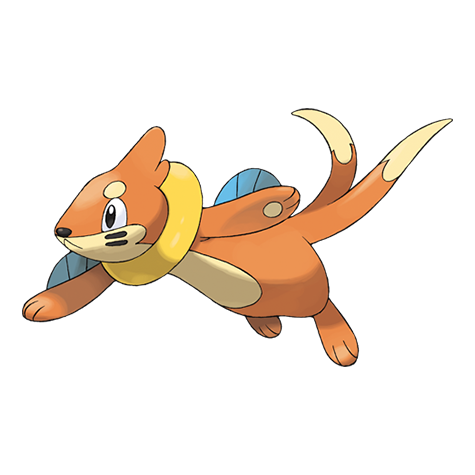
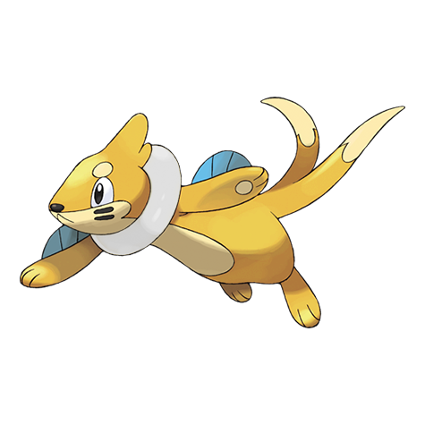
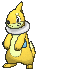
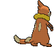
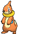
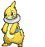
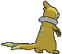

# #418 Buizel (Sea Weasel Pokémon)

| Official Artwork | Shiny Artwork |
|------------------|---------------|
|  |  |

**Rising Ruby:** It swims by rotating its two tails like a screw. When it dives, its flotation sac collapses.

**Sinking Sapphire:** It inflates the flotation sac around its neck and pokes its head out of the water to see what is going on.

---

## Media

### Default Sprites

| Front | Shiny | Back | Shiny |
|-------|-------|------|-------|
|  |  |  | N/A |

### Female Sprites

| Front | Shiny | Back | Shiny |
|-------|-------|------|-------|
|  |  | N/A |  |

### Cries

Latest (Gen VI+):

<audio controls>
<source src='../../assets/cries/buizel/latest.ogg' type='audio/ogg'>
  Your browser does not support the audio element.
</audio>

Legacy:

<audio controls>
<source src='../../assets/cries/buizel/legacy.ogg' type='audio/ogg'>
  Your browser does not support the audio element.
</audio>

---

## Pokédex Data

| National № | Type(s) | Height | Weight | Abilities | Local № |
|------------|---------|--------|--------|-----------|---------|
| #418 | {: width="48"} | 0.7 m / 2.3 ft | 29.5 kg / 65.0 lbs | 1. Swift Swim 2. Water Veil | #56 |

---

## Base Stats
|   | HP | Attack | Defense | Sp. Atk | Sp. Def | Speed |
|---|----|--------|---------|---------|---------|-------|
| **Base** | 55 | 65 | 35 | 60 | 30 | 85 |
| **Min** | 220 | 121 | 67 | 112 | 58 | 157 |
| **Max** | 314 | 251 | 185 | 240 | 174 | 295 |

The ranges shown above are for a level 100 Pokémon. Maximum values are based on a beneficial nature, 252 EVs, 31 IVs; minimum values are based on a hindering nature, 0 EVs, 0 IVs.

---

## Forms & Evolutions

!!! warning "WARNING"

    Information on evolutions may not be 100% accurate; differences between evolution methods across generations are not accounted for.

### Forms

Buizel has no alternate forms.

### Evolution Line

1. [Buizel](buizel.md/)
    1. Level Up: [Floatzel](floatzel.md/)

---

## Training

| EV Yield | Catch Rate | Base Friendship | Base Exp. | Growth Rate | Held Items |
|----------|------------|-----------------|-----------|-------------|------------|
| 1 Spd | 190 | 70 | 66 | Mediu |

---

## Breeding

| Egg Groups | Egg Cycles | Gender | Dimorphic | Color | Shape |
|------------|------------|--------|-----------|-------|-------|
| 1. Water1 2. Ground | 20 | 50.0% Male 50.0% Female | True | Brown | Quadruped |

---

## Moves

!!! warning "WARNING"

    Specific move information may be incorrect. However, the general movepool should be accurate; this includes changes made in Sacred Gold and Storm Silver.

### Level Up Moves

| Lv. | Move | Type | Cat. | Power | Acc. | PP |
| --- | --- | --- | --- | --- | --- | --- |
| 1 | Sonic Boom | {: width="48"} | {: width="36"} | — | 90 | 20 |
| 4 | Growl | {: width="48"} | {: width="36"} | — | 100 | 40 |
| 7 | Water Sport | {: width="48"} | {: width="36"} | — | — | 15 |
| 10 | Quick Attack | {: width="48"} | {: width="36"} | 40 | 100 | 30 |
| 13 | Water Gun | {: width="48"} | {: width="36"} | 40 | 100 | 25 |
| 16 | Pursuit | {: width="48"} | {: width="36"} | 40 | 100 | 20 |
| 19 | Swift | {: width="48"} | {: width="36"} | 60 | — | 20 |
| 22 | Headbutt | {: width="48"} | {: width="36"} | 70 | 100 | 15 |
| 25 | Aqua Jet | {: width="48"} | {: width="36"} | 40 | 100 | 20 |
| 28 | Double Hit | {: width="48"} | {: width="36"} | 35 | 90 | 10 |
| 31 | Aqua Tail | {: width="48"} | {: width="36"} | 90 | 90 | 10 |
| 34 | Whirlpool | {: width="48"} | {: width="36"} | 35 | 85 | 15 |
| 37 | Razor Wind | {: width="48"} | {: width="36"} | 80 | 100 | 10 |
| 40 | Agility | {: width="48"} | {: width="36"} | — | — | 30 |
| 43 | Hydro Pump | {: width="48"} | {: width="36"} | 110 | 80 | 5 |

### TM Moves

| TM | Move | Type | Cat. | Power | Acc. | PP |
| --- | --- | --- | --- | --- | --- | --- |
| HM03 | Surf | {: width="48"} | {: width="36"} | 90 | 100 | 15 |
| HM04 | Strength | {: width="48"} | {: width="36"} | 100 | 100 | 10 |
| HM05 | Waterfall | {: width="48"} | {: width="36"} | 80 | 100 | 15 |
| HM06 | Rock Smash | {: width="48"} | {: width="36"} | 65 | 100 | 15 |
| HM07 | Dive | {: width="48"} | {: width="36"} | 80 | 100 | 10 |
| TM06 | Toxic | {: width="48"} | {: width="36"} | — | 90 | 10 |
| TM07 | Hail | {: width="48"} | {: width="36"} | — | — | 10 |
| TM08 | Bulk Up | {: width="48"} | {: width="36"} | — | — | 20 |
| TM10 | Hidden Power | {: width="48"} | {: width="36"} | 60 | 100 | 15 |
| TM100 | Confide | {: width="48"} | {: width="36"} | — | — | 20 |
| TM13 | Ice Beam | {: width="48"} | {: width="36"} | 90 | 100 | 10 |
| TM14 | Blizzard | {: width="48"} | {: width="36"} | 110 | 70 | 5 |
| TM17 | Protect | {: width="48"} | {: width="36"} | — | — | 10 |
| TM18 | Rain Dance | {: width="48"} | {: width="36"} | — | — | 5 |
| TM21 | Frustration | {: width="48"} | {: width="36"} | — | 100 | 20 |
| TM27 | Return | {: width="48"} | {: width="36"} | — | 100 | 20 |
| TM28 | Dig | {: width="48"} | {: width="36"} | 80 | 100 | 10 |
| TM31 | Brick Break | {: width="48"} | {: width="36"} | 75 | 100 | 15 |
| TM32 | Double Team | {: width="48"} | {: width="36"} | — | — | 15 |
| TM39 | Rock Tomb | {: width="48"} | {: width="36"} | 60 | 95 | 15 |
| TM42 | Facade | {: width="48"} | {: width="36"} | 70 | 100 | 20 |
| TM44 | Rest | {: width="48"} | {: width="36"} | — | — | 5 |
| TM45 | Attract | {: width="48"} | {: width="36"} | — | 100 | 15 |
| TM48 | Round | {: width="48"} | {: width="36"} | 60 | 100 | 15 |
| TM49 | Echoed Voice | {: width="48"} | {: width="36"} | 40 | 100 | 15 |
| TM55 | Scald | {: width="48"} | {: width="36"} | 80 | 100 | 15 |
| TM87 | Swagger | {: width="48"} | {: width="36"} | — | 85 | 15 |
| TM88 | Sleep Talk | {: width="48"} | {: width="36"} | — | — | 10 |
| TM90 | Substitute | {: width="48"} | {: width="36"} | — | — | 10 |
| TM94 | Secret Power | {: width="48"} | {: width="36"} | 70 | 100 | 20 |
| TM98 | Power Up Punch | {: width="48"} | {: width="36"} | 40 | 100 | 20 |

### Egg Moves

| Move | Type | Cat. | Power | Acc. | PP |
| --- | --- | --- | --- | --- | --- |
| Aqua Ring | {: width="48"} | {: width="36"} | — | — | 20 |
| Aqua Tail | {: width="48"} | {: width="36"} | 90 | 90 | 10 |
| Baton Pass | {: width="48"} | {: width="36"} | — | — | 40 |
| Double Slap | {: width="48"} | {: width="36"} | 15 | 85 | 10 |
| Fury Cutter | {: width="48"} | {: width="36"} | 40 | 95 | 20 |
| Fury Swipes | {: width="48"} | {: width="36"} | 18 | 80 | 15 |
| Headbutt | {: width="48"} | {: width="36"} | 70 | 100 | 15 |
| Me First | {: width="48"} | {: width="36"} | — | — | 20 |
| Mud Slap | {: width="48"} | {: width="36"} | 20 | 100 | 10 |
| Odor Sleuth | {: width="48"} | {: width="36"} | — | — | 40 |
| Slash | {: width="48"} | {: width="36"} | 70 | 100 | 20 |
| Soak | {: width="48"} | {: width="36"} | — | 100 | 20 |
| Switcheroo | {: width="48"} | {: width="36"} | — | 100 | 10 |
| Tail Slap | {: width="48"} | {: width="36"} | 25 | 85 | 10 |

### Tutor Moves

| Move | Type | Cat. | Power | Acc. | PP |
| --- | --- | --- | --- | --- | --- |
| Aqua Tail | {: width="48"} | {: width="36"} | 90 | 90 | 10 |
| Focus Punch | {: width="48"} | {: width="36"} | 150 | 100 | 20 |
| Ice Punch | {: width="48"} | {: width="36"} | 75 | 100 | 15 |
| Icy Wind | {: width="48"} | {: width="36"} | 55 | 95 | 15 |
| Iron Tail | {: width="48"} | {: width="36"} | 100 | 75 | 15 |
| Snore | {: width="48"} | {: width="36"} | 50 | 100 | 15 |
| Water Pulse | {: width="48"} | {: width="36"} | 60 | 100 | 20 |

