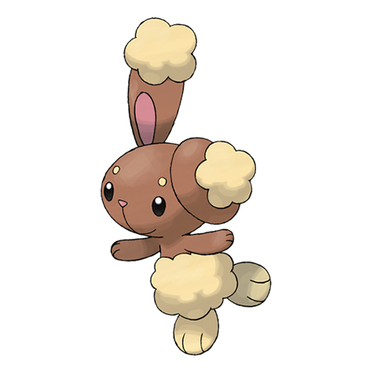

# #427 Buneary (Rabbit Pokémon)

| Official Artwork | Shiny Artwork |
|------------------|---------------|
|  |  |

**Rising Ruby:** Its ears are always rolled up. They can be forcefully extended to shatter even a large boulder.

**Sinking Sapphire:** When it senses danger, it perks up its ears. On cold nights, it sleeps with its head tucked into its fur.

---

## Media

### Default Sprites

| Front | Shiny | Back | Shiny |
|-------|-------|------|-------|
|  |  |  |  |

### Cries

Latest (Gen VI+):

<audio controls>
<source src='../../assets/cries/buneary/latest.ogg' type='audio/ogg'>
  Your browser does not support the audio element.
</audio>

Legacy:

<audio controls>
<source src='../../assets/cries/buneary/legacy.ogg' type='audio/ogg'>
  Your browser does not support the audio element.
</audio>

---

## Pokédex Data

| National № | Type(s) | Height | Weight | Abilities | Local № |
|------------|---------|--------|--------|-----------|---------|
| #427 | {: width="48"} | 0.4 m / 1.3 ft | 5.5 kg / 12.1 lbs | 1. Run Away 2. Klutz | #67 |

---

## Base Stats
|   | HP | Attack | Defense | Sp. Atk | Sp. Def | Speed |
|---|----|--------|---------|---------|---------|-------|
| **Base** | 55 | 66 | 44 | 44 | 56 | 85 |
| **Min** | 220 | 123 | 83 | 83 | 105 | 157 |
| **Max** | 314 | 254 | 205 | 205 | 232 | 295 |

The ranges shown above are for a level 100 Pokémon. Maximum values are based on a beneficial nature, 252 EVs, 31 IVs; minimum values are based on a hindering nature, 0 EVs, 0 IVs.

---

## Forms & Evolutions

!!! warning "WARNING"

    Information on evolutions may not be 100% accurate; differences between evolution methods across generations are not accounted for.

### Forms

Buneary has no alternate forms.

### Evolution Line

1. [Buneary](buneary.md/)
    1. Level Up: [Lopunny](lopunny.md/)

---

## Training

| EV Yield | Catch Rate | Base Friendship | Base Exp. | Growth Rate | Held Items |
|----------|------------|-----------------|-----------|-------------|------------|
| 1 Spd | 190 | 140 | 70 | Mediu |

---

## Breeding

| Egg Groups | Egg Cycles | Gender | Dimorphic | Color | Shape |
|------------|------------|--------|-----------|-------|-------|
| 1. Ground 2. Humanshape | 20 | 50.0% Male 50.0% Female | False | Brown | Upright |

---

## Moves

!!! warning "WARNING"

    Specific move information may be incorrect. However, the general movepool should be accurate; this includes changes made in Sacred Gold and Storm Silver.

### Level Up Moves

| Lv. | Move | Type | Cat. | Power | Acc. | PP |
| --- | --- | --- | --- | --- | --- | --- |
| 1 | Defense Curl | {: width="48"} | {: width="36"} | — | — | 40 |
| 1 | Foresight | {: width="48"} | {: width="36"} | — | — | 40 |
| 1 | Pound | {: width="48"} | {: width="36"} | 50 | 100 | 35 |
| 1 | Splash | {: width="48"} | {: width="36"} | — | — | 40 |
| 5 | Endure | {: width="48"} | {: width="36"} | — | — | 10 |
| 8 | Baby Doll Eyes | {: width="48"} | {: width="36"} | — | 100 | 30 |
| 11 | Frustration | {: width="48"} | {: width="36"} | — | 100 | 20 |
| 14 | Quick Attack | {: width="48"} | {: width="36"} | 40 | 100 | 30 |
| 17 | Jump Kick | {: width="48"} | {: width="36"} | 100 | 95 | 10 |
| 20 | Baton Pass | {: width="48"} | {: width="36"} | — | — | 40 |
| 23 | Dizzy Punch | {: width="48"} | {: width="36"} | 70 | 100 | 10 |
| 26 | Agility | {: width="48"} | {: width="36"} | — | — | 30 |
| 29 | Bounce | {: width="48"} | {: width="36"} | 85 | 85 | 5 |
| 32 | After You | {: width="48"} | {: width="36"} | — | — | 15 |
| 35 | Charm | {: width="48"} | {: width="36"} | — | 100 | 20 |
| 38 | Fake Out | {: width="48"} | {: width="36"} | 40 | 100 | 10 |
| 41 | Entrainment | {: width="48"} | {: width="36"} | — | 100 | 15 |
| 44 | Healing Wish | {: width="48"} | {: width="36"} | — | — | 10 |

### TM Moves

| TM | Move | Type | Cat. | Power | Acc. | PP |
| --- | --- | --- | --- | --- | --- | --- |
| HM01 | Cut | {: width="48"} | {: width="36"} | 70 | 100 | 15 |
| HM06 | Rock Smash | {: width="48"} | {: width="36"} | 65 | 100 | 15 |
| TM06 | Toxic | {: width="48"} | {: width="36"} | — | 90 | 10 |
| TM10 | Hidden Power | {: width="48"} | {: width="36"} | 60 | 100 | 15 |
| TM100 | Confide | {: width="48"} | {: width="36"} | — | — | 20 |
| TM11 | Sunny Day | {: width="48"} | {: width="36"} | — | — | 5 |
| TM13 | Ice Beam | {: width="48"} | {: width="36"} | 90 | 100 | 10 |
| TM17 | Protect | {: width="48"} | {: width="36"} | — | — | 10 |
| TM18 | Rain Dance | {: width="48"} | {: width="36"} | — | — | 5 |
| TM21 | Frustration | {: width="48"} | {: width="36"} | — | 100 | 20 |
| TM22 | Solar Beam | {: width="48"} | {: width="36"} | 120 | 100 | 10 |
| TM24 | Thunderbolt | {: width="48"} | {: width="36"} | 90 | 100 | 15 |
| TM27 | Return | {: width="48"} | {: width="36"} | — | 100 | 20 |
| TM28 | Dig | {: width="48"} | {: width="36"} | 80 | 100 | 10 |
| TM30 | Shadow Ball | {: width="48"} | {: width="36"} | 80 | 100 | 15 |
| TM32 | Double Team | {: width="48"} | {: width="36"} | — | — | 15 |
| TM42 | Facade | {: width="48"} | {: width="36"} | 70 | 100 | 20 |
| TM44 | Rest | {: width="48"} | {: width="36"} | — | — | 5 |
| TM45 | Attract | {: width="48"} | {: width="36"} | — | 100 | 15 |
| TM48 | Round | {: width="48"} | {: width="36"} | 60 | 100 | 15 |
| TM56 | Fling | {: width="48"} | {: width="36"} | — | 100 | 10 |
| TM57 | Charge Beam | {: width="48"} | {: width="36"} | 50 | 90 | 10 |
| TM67 | Retaliate | {: width="48"} | {: width="36"} | 70 | 100 | 5 |
| TM73 | Thunder Wave | {: width="48"} | {: width="36"} | — | 90 | 20 |
| TM86 | Grass Knot | {: width="48"} | {: width="36"} | — | 100 | 20 |
| TM87 | Swagger | {: width="48"} | {: width="36"} | — | 85 | 15 |
| TM88 | Sleep Talk | {: width="48"} | {: width="36"} | — | — | 10 |
| TM90 | Substitute | {: width="48"} | {: width="36"} | — | — | 10 |
| TM94 | Secret Power | {: width="48"} | {: width="36"} | 70 | 100 | 20 |
| TM98 | Power Up Punch | {: width="48"} | {: width="36"} | 40 | 100 | 20 |

### Egg Moves

| Move | Type | Cat. | Power | Acc. | PP |
| --- | --- | --- | --- | --- | --- |
| Circle Throw | {: width="48"} | {: width="36"} | 60 | 90 | 10 |
| Copycat | {: width="48"} | {: width="36"} | — | — | 20 |
| Cosmic Power | {: width="48"} | {: width="36"} | — | — | 20 |
| Double Hit | {: width="48"} | {: width="36"} | 35 | 90 | 10 |
| Encore | {: width="48"} | {: width="36"} | — | 100 | 5 |
| Fake Out | {: width="48"} | {: width="36"} | 40 | 100 | 10 |
| Fake Tears | {: width="48"} | {: width="36"} | — | 100 | 20 |
| Fire Punch | {: width="48"} | {: width="36"} | 75 | 100 | 15 |
| Flail | {: width="48"} | {: width="36"} | — | 100 | 15 |
| Focus Punch | {: width="48"} | {: width="36"} | 150 | 100 | 20 |
| Ice Punch | {: width="48"} | {: width="36"} | 75 | 100 | 15 |
| Low Kick | {: width="48"} | {: width="36"} | — | 100 | 20 |
| Mud Sport | {: width="48"} | {: width="36"} | — | — | 15 |
| Sky Uppercut | {: width="48"} | {: width="36"} | 85 | 90 | 15 |
| Sweet Kiss | {: width="48"} | {: width="36"} | — | 75 | 10 |
| Switcheroo | {: width="48"} | {: width="36"} | — | 100 | 10 |
| Teeter Dance | {: width="48"} | {: width="36"} | — | 100 | 20 |
| Thunder Punch | {: width="48"} | {: width="36"} | 75 | 100 | 15 |

### Tutor Moves

| Move | Type | Cat. | Power | Acc. | PP |
| --- | --- | --- | --- | --- | --- |
| After You | {: width="48"} | {: width="36"} | — | — | 15 |
| Bounce | {: width="48"} | {: width="36"} | 85 | 85 | 5 |
| Covet | {: width="48"} | {: width="36"} | 60 | 100 | 25 |
| Drain Punch | {: width="48"} | {: width="36"} | 75 | 100 | 10 |
| Endeavor | {: width="48"} | {: width="36"} | — | 100 | 5 |
| Fire Punch | {: width="48"} | {: width="36"} | 75 | 100 | 15 |
| Focus Punch | {: width="48"} | {: width="36"} | 150 | 100 | 20 |
| Heal Bell | {: width="48"} | {: width="36"} | — | — | 5 |
| Helping Hand | {: width="48"} | {: width="36"} | — | — | 20 |
| Hyper Voice | {: width="48"} | {: width="36"} | 90 | 100 | 10 |
| Ice Punch | {: width="48"} | {: width="36"} | 75 | 100 | 15 |
| Iron Tail | {: width="48"} | {: width="36"} | 100 | 75 | 15 |
| Last Resort | {: width="48"} | {: width="36"} | 140 | 100 | 5 |
| Low Kick | {: width="48"} | {: width="36"} | — | 100 | 20 |
| Magic Coat | {: width="48"} | {: width="36"} | — | — | 15 |
| Shock Wave | {: width="48"} | {: width="36"} | 60 | — | 20 |
| Snore | {: width="48"} | {: width="36"} | 50 | 100 | 15 |
| Thunder Punch | {: width="48"} | {: width="36"} | 75 | 100 | 15 |
| Uproar | {: width="48"} | {: width="36"} | 90 | 100 | 10 |
| Water Pulse | {: width="48"} | {: width="36"} | 60 | 100 | 20 |

