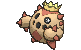
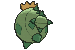
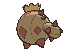

# #331 Cacnea (Cactus Pokémon)

| Official Artwork | Shiny Artwork |
|------------------|---------------|
|  |  |

**Rising Ruby:** Cacnea lives in arid locations such as deserts. It releases a strong aroma from its flower to attract prey. When prey comes near, this Pokémon shoots sharp thorns from its body to bring the victim down.

**Sinking Sapphire:** The more arid and harsh the environment, the more pretty and fragrant a flower Cacnea grows. This Pokémon battles by wildly swinging its thorny arms.

---

## Media

### Default Sprites

| Front | Shiny | Back | Shiny |
|-------|-------|------|-------|
|  |  |  |  |

### Cries

Latest (Gen VI+):

<audio controls>
<source src='../../assets/cries/cacnea/latest.ogg' type='audio/ogg'>
  Your browser does not support the audio element.
</audio>

Legacy:

<audio controls>
<source src='../../assets/cries/cacnea/legacy.ogg' type='audio/ogg'>
  Your browser does not support the audio element.
</audio>

---

## Pokédex Data

| National № | Type(s) | Height | Weight | Abilities | Local № |
|------------|---------|--------|--------|-----------|---------|
| #331 | {: width="48"} | 0.4 m / 1.3 ft | 51.3 kg / 113.1 lbs | 1. Sand Veil 2. Water Absorb | N/A |

---

## Base Stats
|   | HP | Attack | Defense | Sp. Atk | Sp. Def | Speed |
|---|----|--------|---------|---------|---------|-------|
| **Base** | 50 | 85 | 40 | 85 | 40 | 35 |
| **Min** | 210 | 157 | 76 | 157 | 76 | 67 |
| **Max** | 304 | 295 | 196 | 295 | 196 | 185 |

The ranges shown above are for a level 100 Pokémon. Maximum values are based on a beneficial nature, 252 EVs, 31 IVs; minimum values are based on a hindering nature, 0 EVs, 0 IVs.

---

## Forms & Evolutions

!!! warning "WARNING"

    Information on evolutions may not be 100% accurate; differences between evolution methods across generations are not accounted for.

### Forms

Cacnea has no alternate forms.

### Evolution Line

1. [Cacnea](cacnea.md/)
    1. Level Up: [Cacturne](cacturne.md/)

---

## Training

| EV Yield | Catch Rate | Base Friendship | Base Exp. | Growth Rate | Held Items |
|----------|------------|-----------------|-----------|-------------|------------|
| 1 Sp.-Atk | 190 | 35 | 67 | Medium Slow | Sticky Barb (5%) Root Fossil (50%) |

---

## Breeding

| Egg Groups | Egg Cycles | Gender | Dimorphic | Color | Shape |
|------------|------------|--------|-----------|-------|-------|
| 1. Plant 2. Humanshape | 20 | 50.0% Male 50.0% Female | False | Green | Humanoid |

---

## Moves

!!! warning "WARNING"

    Specific move information may be incorrect. However, the general movepool should be accurate; this includes changes made in Sacred Gold and Storm Silver.

### Level Up Moves

| Lv. | Move | Type | Cat. | Power | Acc. | PP |
| --- | --- | --- | --- | --- | --- | --- |
| 1 | Leer | {: width="48"} | {: width="36"} | — | 100 | 30 |
| 1 | Poison Sting | {: width="48"} | {: width="36"} | 15 | 100 | 35 |
| 4 | Absorb | {: width="48"} | {: width="36"} | 20 | 100 | 25 |
| 7 | Growth | {: width="48"} | {: width="36"} | — | — | 20 |
| 10 | Leech Seed | {: width="48"} | {: width="36"} | — | 90 | 10 |
| 13 | Sand Attack | {: width="48"} | {: width="36"} | — | 100 | 15 |
| 16 | Ingrain | {: width="48"} | {: width="36"} | — | — | 20 |
| 19 | Feint Attack | {: width="48"} | {: width="36"} | 60 | — | 20 |
| 22 | Needle Arm | {: width="48"} | {: width="36"} | 80 | 100 | 15 |
| 25 | Payback | {: width="48"} | {: width="36"} | 50 | 100 | 10 |
| 28 | Spikes | {: width="48"} | {: width="36"} | — | — | 20 |
| 31 | Seed Bomb | {: width="48"} | {: width="36"} | 80 | 100 | 15 |
| 34 | Poison Jab | {: width="48"} | {: width="36"} | 80 | 100 | 20 |
| 37 | Sucker Punch | {: width="48"} | {: width="36"} | 70 | 100 | 5 |
| 40 | Pin Missile | {: width="48"} | {: width="36"} | 25 | 95 | 20 |
| 43 | Energy Ball | {: width="48"} | {: width="36"} | 90 | 100 | 10 |
| 46 | Cotton Spore | {: width="48"} | {: width="36"} | — | 100 | 40 |
| 49 | Sandstorm | {: width="48"} | {: width="36"} | — | — | 10 |
| 52 | Destiny Bond | {: width="48"} | {: width="36"} | — | — | 5 |
| 55 | Fell Stinger | {: width="48"} | {: width="36"} | 50 | 100 | 25 |

### TM Moves

| TM | Move | Type | Cat. | Power | Acc. | PP |
| --- | --- | --- | --- | --- | --- | --- |
| HM01 | Cut | {: width="48"} | {: width="36"} | 70 | 100 | 15 |
| TM06 | Toxic | {: width="48"} | {: width="36"} | — | 90 | 10 |
| TM09 | Venoshock | {: width="48"} | {: width="36"} | 65 | 100 | 10 |
| TM10 | Hidden Power | {: width="48"} | {: width="36"} | 60 | 100 | 15 |
| TM100 | Confide | {: width="48"} | {: width="36"} | — | — | 20 |
| TM11 | Sunny Day | {: width="48"} | {: width="36"} | — | — | 5 |
| TM17 | Protect | {: width="48"} | {: width="36"} | — | — | 10 |
| TM21 | Frustration | {: width="48"} | {: width="36"} | — | 100 | 20 |
| TM22 | Solar Beam | {: width="48"} | {: width="36"} | 120 | 100 | 10 |
| TM27 | Return | {: width="48"} | {: width="36"} | — | 100 | 20 |
| TM31 | Brick Break | {: width="48"} | {: width="36"} | 75 | 100 | 15 |
| TM32 | Double Team | {: width="48"} | {: width="36"} | — | — | 15 |
| TM37 | Sandstorm | {: width="48"} | {: width="36"} | — | — | 10 |
| TM42 | Facade | {: width="48"} | {: width="36"} | 70 | 100 | 20 |
| TM44 | Rest | {: width="48"} | {: width="36"} | — | — | 5 |
| TM45 | Attract | {: width="48"} | {: width="36"} | — | 100 | 15 |
| TM48 | Round | {: width="48"} | {: width="36"} | 60 | 100 | 15 |
| TM53 | Energy Ball | {: width="48"} | {: width="36"} | 90 | 100 | 10 |
| TM56 | Fling | {: width="48"} | {: width="36"} | — | 100 | 10 |
| TM66 | Payback | {: width="48"} | {: width="36"} | 50 | 100 | 10 |
| TM70 | Flash | {: width="48"} | {: width="36"} | — | 100 | 20 |
| TM75 | Swords Dance | {: width="48"} | {: width="36"} | — | — | 20 |
| TM84 | Poison Jab | {: width="48"} | {: width="36"} | 80 | 100 | 20 |
| TM86 | Grass Knot | {: width="48"} | {: width="36"} | — | 100 | 20 |
| TM87 | Swagger | {: width="48"} | {: width="36"} | — | 85 | 15 |
| TM88 | Sleep Talk | {: width="48"} | {: width="36"} | — | — | 10 |
| TM90 | Substitute | {: width="48"} | {: width="36"} | — | — | 10 |
| TM94 | Secret Power | {: width="48"} | {: width="36"} | 70 | 100 | 20 |
| TM96 | Nature Power | {: width="48"} | {: width="36"} | — | — | 20 |
| TM97 | Dark Pulse | {: width="48"} | {: width="36"} | 80 | 100 | 15 |
| TM98 | Power Up Punch | {: width="48"} | {: width="36"} | 40 | 100 | 20 |

### Egg Moves

| Move | Type | Cat. | Power | Acc. | PP |
| --- | --- | --- | --- | --- | --- |
| Acid | {: width="48"} | {: width="36"} | 40 | 100 | 30 |
| Belch | {: width="48"} | {: width="36"} | 120 | 90 | 10 |
| Block | {: width="48"} | {: width="36"} | — | — | 5 |
| Counter | {: width="48"} | {: width="36"} | — | 100 | 20 |
| Disable | {: width="48"} | {: width="36"} | — | 100 | 20 |
| Dynamic Punch | {: width="48"} | {: width="36"} | 100 | 50 | 5 |
| Fell Stinger | {: width="48"} | {: width="36"} | 50 | 100 | 25 |
| Grass Whistle | {: width="48"} | {: width="36"} | — | 55 | 15 |
| Low Kick | {: width="48"} | {: width="36"} | — | 100 | 20 |
| Magical Leaf | {: width="48"} | {: width="36"} | 60 | — | 20 |
| Nasty Plot | {: width="48"} | {: width="36"} | — | — | 20 |
| Rototiller | {: width="48"} | {: width="36"} | — | — | 10 |
| Seed Bomb | {: width="48"} | {: width="36"} | 80 | 100 | 15 |
| Smelling Salts | {: width="48"} | {: width="36"} | 70 | 100 | 10 |
| Switcheroo | {: width="48"} | {: width="36"} | — | 100 | 10 |
| Teeter Dance | {: width="48"} | {: width="36"} | — | 100 | 20 |
| Worry Seed | {: width="48"} | {: width="36"} | — | 100 | 10 |

### Tutor Moves

| Move | Type | Cat. | Power | Acc. | PP |
| --- | --- | --- | --- | --- | --- |
| Block | {: width="48"} | {: width="36"} | — | — | 5 |
| Drain Punch | {: width="48"} | {: width="36"} | 75 | 100 | 10 |
| Focus Punch | {: width="48"} | {: width="36"} | 150 | 100 | 20 |
| Giga Drain | {: width="48"} | {: width="36"} | 75 | 100 | 10 |
| Low Kick | {: width="48"} | {: width="36"} | — | 100 | 20 |
| Role Play | {: width="48"} | {: width="36"} | — | — | 10 |
| Seed Bomb | {: width="48"} | {: width="36"} | 80 | 100 | 15 |
| Snore | {: width="48"} | {: width="36"} | 50 | 100 | 15 |
| Spite | {: width="48"} | {: width="36"} | — | 100 | 10 |
| Synthesis | {: width="48"} | {: width="36"} | — | — | 5 |
| Thunder Punch | {: width="48"} | {: width="36"} | 75 | 100 | 15 |
| Worry Seed | {: width="48"} | {: width="36"} | — | 100 | 10 |

