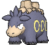
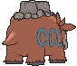
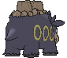
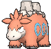
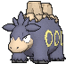

# #323 Camerupt (Eruption Pokémon)

| Official Artwork | Shiny Artwork |
|------------------|---------------|
|  |  |

**Rising Ruby:** Camerupt has a volcano inside its body. Magma of 18,000 degrees Fahrenheit courses through its body. Occasionally, the humps on this Pokémon’s back erupt, spewing the superheated magma.

**Sinking Sapphire:** The humps on Camerupt’s back are formed by a transformation of its bones. They sometimes blast out molten magma. This Pokémon apparently erupts often when it is enraged.

---

## Media

### Default Sprites

| Front | Shiny | Back | Shiny |
|-------|-------|------|-------|
|  |  |  |  |

### Female Sprites

| Front | Shiny | Back | Shiny |
|-------|-------|------|-------|
|  |  | N/A | N/A |

### Cries

Latest (Gen VI+):

<audio controls>
<source src='../../assets/cries/camerupt/latest.ogg' type='audio/ogg'>
  Your browser does not support the audio element.
</audio>

Legacy:

<audio controls>
<source src='../../assets/cries/camerupt/legacy.ogg' type='audio/ogg'>
  Your browser does not support the audio element.
</audio>

---

## Pokédex Data

| National № | Type(s) | Height | Weight | Abilities | Local № |
|------------|---------|--------|--------|-----------|---------|
| #323 | {: width="48"} {: width="48"} | 1.9 m / 6.2 ft | 220.0 kg / 485.0 lbs | 1. Magma Armor 2. Solid Rock | N/A |

---

## Base Stats
|   | HP | Attack | Defense | Sp. Atk | Sp. Def | Speed |
|---|----|--------|---------|---------|---------|-------|
| **Base** | 70 | 100 | 70 | 105 | 75 | 40 |
| **Min** | 250 | 184 | 130 | 193 | 139 | 76 |
| **Max** | 344 | 328 | 262 | 339 | 273 | 196 |

The ranges shown above are for a level 100 Pokémon. Maximum values are based on a beneficial nature, 252 EVs, 31 IVs; minimum values are based on a hindering nature, 0 EVs, 0 IVs.

---

## Forms & Evolutions

!!! warning "WARNING"

    Information on evolutions may not be 100% accurate; differences between evolution methods across generations are not accounted for.

### Forms

1. [Camerupt](camerupt.md/)

2. [Camerupt Mega](camerupt-mega.md/)

### Evolution Line

1. [Numel](numel.md/)
    1. Level Up: [Camerupt](camerupt.md/)

---

## Training

| EV Yield | Catch Rate | Base Friendship | Base Exp. | Growth Rate | Held Items |
|----------|------------|-----------------|-----------|-------------|------------|
| 1 Atk 1 Sp.-Atk | 150 | 70 | 161 | Mediu |

---

## Breeding

| Egg Groups | Egg Cycles | Gender | Dimorphic | Color | Shape |
|------------|------------|--------|-----------|-------|-------|
| 1. Ground | 20 | 50.0% Male 50.0% Female | True | Red | Quadruped |

---

## Moves

!!! warning "WARNING"

    Specific move information may be incorrect. However, the general movepool should be accurate; this includes changes made in Sacred Gold and Storm Silver.

### Level Up Moves

| Lv. | Move | Type | Cat. | Power | Acc. | PP |
| --- | --- | --- | --- | --- | --- | --- |
| 1 | Ember | {: width="48"} | {: width="36"} | 40 | 100 | 25 |
| 1 | Eruption | {: width="48"} | {: width="36"} | 150 | 100 | 5 |
| 1 | Fissure | {: width="48"} | {: width="36"} | — | 30 | 5 |
| 1 | Focus Energy | {: width="48"} | {: width="36"} | — | — | 30 |
| 1 | Growl | {: width="48"} | {: width="36"} | — | 100 | 40 |
| 1 | Tackle | {: width="48"} | {: width="36"} | 40 | 100 | 35 |
| 5 | Ember | {: width="48"} | {: width="36"} | 40 | 100 | 25 |
| 8 | Focus Energy | {: width="48"} | {: width="36"} | — | — | 30 |
| 12 | Magnitude | {: width="48"} | {: width="36"} | — | 100 | 30 |
| 15 | Flame Burst | {: width="48"} | {: width="36"} | 70 | 100 | 15 |
| 19 | Amnesia | {: width="48"} | {: width="36"} | — | — | 20 |
| 22 | Lava Plume | {: width="48"} | {: width="36"} | 80 | 100 | 15 |
| 26 | Earth Power | {: width="48"} | {: width="36"} | 90 | 100 | 10 |
| 29 | Curse | {: width="48"} | {: width="36"} | — | — | 10 |
| 31 | Take Down | {: width="48"} | {: width="36"} | 90 | 85 | 20 |
| 33 | Rock Slide | {: width="48"} | {: width="36"} | 75 | 90 | 10 |
| 39 | Yawn | {: width="48"} | {: width="36"} | — | — | 10 |
| 46 | Earthquake | {: width="48"} | {: width="36"} | 100 | 100 | 10 |
| 52 | Flamethrower | {: width="48"} | {: width="36"} | 90 | 100 | 15 |
| 59 | Double Edge | {: width="48"} | {: width="36"} | 120 | 100 | 15 |

### TM Moves

| TM | Move | Type | Cat. | Power | Acc. | PP |
| --- | --- | --- | --- | --- | --- | --- |
| HM04 | Strength | {: width="48"} | {: width="36"} | 100 | 100 | 10 |
| HM06 | Rock Smash | {: width="48"} | {: width="36"} | 65 | 100 | 15 |
| TM05 | Roar | {: width="48"} | {: width="36"} | — | — | 20 |
| TM06 | Toxic | {: width="48"} | {: width="36"} | — | 90 | 10 |
| TM10 | Hidden Power | {: width="48"} | {: width="36"} | 60 | 100 | 15 |
| TM100 | Confide | {: width="48"} | {: width="36"} | — | — | 20 |
| TM11 | Sunny Day | {: width="48"} | {: width="36"} | — | — | 5 |
| TM15 | Hyper Beam | {: width="48"} | {: width="36"} | 150 | 90 | 5 |
| TM17 | Protect | {: width="48"} | {: width="36"} | — | — | 10 |
| TM21 | Frustration | {: width="48"} | {: width="36"} | — | 100 | 20 |
| TM22 | Solar Beam | {: width="48"} | {: width="36"} | 120 | 100 | 10 |
| TM26 | Earthquake | {: width="48"} | {: width="36"} | 100 | 100 | 10 |
| TM27 | Return | {: width="48"} | {: width="36"} | — | 100 | 20 |
| TM28 | Dig | {: width="48"} | {: width="36"} | 80 | 100 | 10 |
| TM32 | Double Team | {: width="48"} | {: width="36"} | — | — | 15 |
| TM35 | Flamethrower | {: width="48"} | {: width="36"} | 90 | 100 | 15 |
| TM37 | Sandstorm | {: width="48"} | {: width="36"} | — | — | 10 |
| TM38 | Fire Blast | {: width="48"} | {: width="36"} | 110 | 85 | 5 |
| TM39 | Rock Tomb | {: width="48"} | {: width="36"} | 60 | 95 | 15 |
| TM42 | Facade | {: width="48"} | {: width="36"} | 70 | 100 | 20 |
| TM43 | Flame Charge | {: width="48"} | {: width="36"} | 50 | 100 | 20 |
| TM44 | Rest | {: width="48"} | {: width="36"} | — | — | 5 |
| TM45 | Attract | {: width="48"} | {: width="36"} | — | 100 | 15 |
| TM48 | Round | {: width="48"} | {: width="36"} | 60 | 100 | 15 |
| TM49 | Echoed Voice | {: width="48"} | {: width="36"} | 40 | 100 | 15 |
| TM50 | Overheat | {: width="48"} | {: width="36"} | 130 | 90 | 5 |
| TM59 | Incinerate | {: width="48"} | {: width="36"} | 60 | 100 | 15 |
| TM61 | Will O Wisp | {: width="48"} | {: width="36"} | — | 85 | 15 |
| TM64 | Explosion | {: width="48"} | {: width="36"} | 250 | 100 | 5 |
| TM68 | Giga Impact | {: width="48"} | {: width="36"} | 150 | 90 | 5 |
| TM69 | Rock Polish | {: width="48"} | {: width="36"} | — | — | 20 |
| TM71 | Stone Edge | {: width="48"} | {: width="36"} | 100 | 80 | 5 |
| TM78 | Bulldoze | {: width="48"} | {: width="36"} | 60 | 100 | 20 |
| TM80 | Rock Slide | {: width="48"} | {: width="36"} | 75 | 90 | 10 |
| TM87 | Swagger | {: width="48"} | {: width="36"} | — | 85 | 15 |
| TM88 | Sleep Talk | {: width="48"} | {: width="36"} | — | — | 10 |
| TM90 | Substitute | {: width="48"} | {: width="36"} | — | — | 10 |
| TM91 | Flash Cannon | {: width="48"} | {: width="36"} | 80 | 100 | 10 |
| TM94 | Secret Power | {: width="48"} | {: width="36"} | 70 | 100 | 20 |
| TM96 | Nature Power | {: width="48"} | {: width="36"} | — | — | 20 |

### Egg Moves

Camerupt cannot learn any moves by breeding.
### Tutor Moves

| Move | Type | Cat. | Power | Acc. | PP |
| --- | --- | --- | --- | --- | --- |
| After You | {: width="48"} | {: width="36"} | — | — | 15 |
| Earth Power | {: width="48"} | {: width="36"} | 90 | 100 | 10 |
| Heat Wave | {: width="48"} | {: width="36"} | 95 | 90 | 10 |
| Iron Head | {: width="48"} | {: width="36"} | 80 | 100 | 15 |
| Snore | {: width="48"} | {: width="36"} | 50 | 100 | 15 |
| Stealth Rock | {: width="48"} | {: width="36"} | — | — | 20 |

