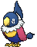
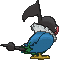
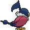

# #441 Chatot (Music Note Pokémon)

| Official Artwork | Shiny Artwork |
|------------------|---------------|
|  |  |

**Rising Ruby:** It mimics the cries of other Pokémon to trick them into thinking it’s one of them. This way they won’t attack it.

**Sinking Sapphire:** It can learn and speak human words. If they gather, they all learn the same saying.

---

## Media

### Default Sprites

| Front | Shiny | Back | Shiny |
|-------|-------|------|-------|
|  |  |  |  |

### Cries

Latest (Gen VI+):

<audio controls>
<source src='../../assets/cries/chatot/latest.ogg' type='audio/ogg'>
  Your browser does not support the audio element.
</audio>

Legacy:

<audio controls>
<source src='../../assets/cries/chatot/legacy.ogg' type='audio/ogg'>
  Your browser does not support the audio element.
</audio>

---

## Pokédex Data

| National № | Type(s) | Height | Weight | Abilities | Local № |
|------------|---------|--------|--------|-----------|---------|
| #441 | {: width="48"} {: width="48"} | 0.5 m / 1.6 ft | 1.9 kg / 4.2 lbs | 1. Gale Wings 2. Tangled Feet | #102 |

---

## Base Stats
|   | HP | Attack | Defense | Sp. Atk | Sp. Def | Speed |
|---|----|--------|---------|---------|---------|-------|
| **Base** | 80 | 65 | 55 | 110 | 55 | 110 |
| **Min** | 270 | 121 | 103 | 202 | 103 | 202 |
| **Max** | 364 | 251 | 229 | 350 | 229 | 350 |

The ranges shown above are for a level 100 Pokémon. Maximum values are based on a beneficial nature, 252 EVs, 31 IVs; minimum values are based on a hindering nature, 0 EVs, 0 IVs.

---

## Forms & Evolutions

!!! warning "WARNING"

    Information on evolutions may not be 100% accurate; differences between evolution methods across generations are not accounted for.

### Forms

Chatot has no alternate forms.

### Evolution Line

1. [Chatot](chatot.md/)

---

## Training

| EV Yield | Catch Rate | Base Friendship | Base Exp. | Growth Rate | Held Items |
|----------|------------|-----------------|-----------|-------------|------------|
| 1 Atk 1 Sp.-Atk 1 Spd | 30 | 35 | 144 | Medium Slow | Metronome (5%) |

---

## Breeding

| Egg Groups | Egg Cycles | Gender | Dimorphic | Color | Shape |
|------------|------------|--------|-----------|-------|-------|
| 1. Flying | 20 | 50.0% Male 50.0% Female | False | Black | Wings |

---

## Moves

!!! warning "WARNING"

    Specific move information may be incorrect. However, the general movepool should be accurate; this includes changes made in Sacred Gold and Storm Silver.

### Level Up Moves

| Lv. | Move | Type | Cat. | Power | Acc. | PP |
| --- | --- | --- | --- | --- | --- | --- |
| 1 | Boomburst | {: width="48"} | {: width="36"} | 140 | 100 | 10 |
| 1 | Chatter | {: width="48"} | {: width="36"} | 90 | 100 | 20 |
| 1 | Confide | {: width="48"} | {: width="36"} | — | — | 20 |
| 1 | Heat Wave | {: width="48"} | {: width="36"} | 95 | 90 | 10 |
| 1 | Hurricane | {: width="48"} | {: width="36"} | 110 | 70 | 10 |
| 1 | Peck | {: width="48"} | {: width="36"} | 35 | 100 | 35 |
| 1 | Taunt | {: width="48"} | {: width="36"} | — | 100 | 20 |
| 5 | Growl | {: width="48"} | {: width="36"} | — | 100 | 40 |
| 8 | Mirror Move | {: width="48"} | {: width="36"} | — | — | 20 |
| 11 | Sing | {: width="48"} | {: width="36"} | — | 55 | 15 |
| 14 | Fury Attack | {: width="48"} | {: width="36"} | 15 | 85 | 20 |
| 17 | Echoed Voice | {: width="48"} | {: width="36"} | 40 | 100 | 15 |
| 20 | Taunt | {: width="48"} | {: width="36"} | — | 100 | 20 |
| 23 | Round | {: width="48"} | {: width="36"} | 60 | 100 | 15 |
| 26 | Mimic | {: width="48"} | {: width="36"} | — | — | 10 |
| 29 | Chatter | {: width="48"} | {: width="36"} | 90 | 100 | 20 |
| 32 | Roost | {: width="48"} | {: width="36"} | — | — | 5 |
| 35 | Uproar | {: width="48"} | {: width="36"} | 90 | 100 | 10 |
| 38 | Synchronoise | {: width="48"} | {: width="36"} | 120 | 100 | 10 |
| 41 | Hyper Voice | {: width="48"} | {: width="36"} | 90 | 100 | 10 |
| 44 | Feather Dance | {: width="48"} | {: width="36"} | — | 100 | 15 |
| 47 | Nasty Plot | {: width="48"} | {: width="36"} | — | — | 20 |
| 50 | Hurricane | {: width="48"} | {: width="36"} | 110 | 70 | 10 |
| 53 | Boomburst | {: width="48"} | {: width="36"} | 140 | 100 | 10 |

### TM Moves

| TM | Move | Type | Cat. | Power | Acc. | PP |
| --- | --- | --- | --- | --- | --- | --- |
| HM02 | Fly | {: width="48"} | {: width="36"} | 100 | 100 | 10 |
| TM06 | Toxic | {: width="48"} | {: width="36"} | — | 90 | 10 |
| TM10 | Hidden Power | {: width="48"} | {: width="36"} | 60 | 100 | 15 |
| TM100 | Confide | {: width="48"} | {: width="36"} | — | — | 20 |
| TM11 | Sunny Day | {: width="48"} | {: width="36"} | — | — | 5 |
| TM12 | Taunt | {: width="48"} | {: width="36"} | — | 100 | 20 |
| TM17 | Protect | {: width="48"} | {: width="36"} | — | — | 10 |
| TM18 | Rain Dance | {: width="48"} | {: width="36"} | — | — | 5 |
| TM19 | Roost | {: width="48"} | {: width="36"} | — | — | 5 |
| TM21 | Frustration | {: width="48"} | {: width="36"} | — | 100 | 20 |
| TM27 | Return | {: width="48"} | {: width="36"} | — | 100 | 20 |
| TM32 | Double Team | {: width="48"} | {: width="36"} | — | — | 15 |
| TM40 | Aerial Ace | {: width="48"} | {: width="36"} | 60 | — | 20 |
| TM41 | Torment | {: width="48"} | {: width="36"} | — | 100 | 15 |
| TM42 | Facade | {: width="48"} | {: width="36"} | 70 | 100 | 20 |
| TM44 | Rest | {: width="48"} | {: width="36"} | — | — | 5 |
| TM45 | Attract | {: width="48"} | {: width="36"} | — | 100 | 15 |
| TM46 | Thief | {: width="48"} | {: width="36"} | 60 | 100 | 25 |
| TM48 | Round | {: width="48"} | {: width="36"} | 60 | 100 | 15 |
| TM49 | Echoed Voice | {: width="48"} | {: width="36"} | 40 | 100 | 15 |
| TM51 | Steel Wing | {: width="48"} | {: width="36"} | 70 | 90 | 25 |
| TM87 | Swagger | {: width="48"} | {: width="36"} | — | 85 | 15 |
| TM88 | Sleep Talk | {: width="48"} | {: width="36"} | — | — | 10 |
| TM89 | U Turn | {: width="48"} | {: width="36"} | 70 | 100 | 20 |
| TM90 | Substitute | {: width="48"} | {: width="36"} | — | — | 10 |
| TM94 | Secret Power | {: width="48"} | {: width="36"} | 70 | 100 | 20 |

### Egg Moves

| Move | Type | Cat. | Power | Acc. | PP |
| --- | --- | --- | --- | --- | --- |
| Agility | {: width="48"} | {: width="36"} | — | — | 30 |
| Air Cutter | {: width="48"} | {: width="36"} | 60 | 95 | 25 |
| Boomburst | {: width="48"} | {: width="36"} | 140 | 100 | 10 |
| Defog | {: width="48"} | {: width="36"} | — | — | 15 |
| Encore | {: width="48"} | {: width="36"} | — | 100 | 5 |
| Nasty Plot | {: width="48"} | {: width="36"} | — | — | 20 |
| Night Shade | {: width="48"} | {: width="36"} | — | 100 | 15 |
| Sleep Talk | {: width="48"} | {: width="36"} | — | — | 10 |
| Steel Wing | {: width="48"} | {: width="36"} | 70 | 90 | 25 |
| Supersonic | {: width="48"} | {: width="36"} | — | 55 | 20 |

### Tutor Moves

| Move | Type | Cat. | Power | Acc. | PP |
| --- | --- | --- | --- | --- | --- |
| Heat Wave | {: width="48"} | {: width="36"} | 95 | 90 | 10 |
| Hyper Voice | {: width="48"} | {: width="36"} | 90 | 100 | 10 |
| Role Play | {: width="48"} | {: width="36"} | — | — | 10 |
| Sky Attack | {: width="48"} | {: width="36"} | 140 | 90 | 5 |
| Snore | {: width="48"} | {: width="36"} | 50 | 100 | 15 |
| Tailwind | {: width="48"} | {: width="36"} | — | — | 15 |
| Uproar | {: width="48"} | {: width="36"} | 90 | 100 | 10 |

