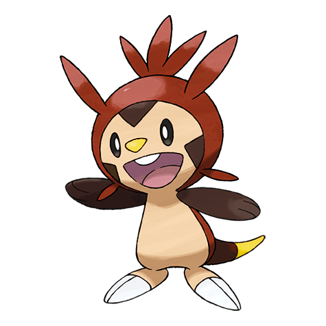
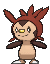
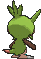
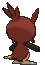

# #650 Chespin (Spiny Nut Pokémon)

| Official Artwork | Shiny Artwork |
|------------------|---------------|
|  |  |

**Rising Ruby:** The quills on its head are usually soft. When it flexes them, the points become so hard and sharp that they can pierce rock.

**Sinking Sapphire:** Such a thick shell of wood covers its head and back that even a direct hit from a truck wouldn’t faze it.

---

## Media

### Default Sprites

| Front | Shiny | Back | Shiny |
|-------|-------|------|-------|
|  |  |  |  |

### Cries

Latest (Gen VI+):

<audio controls>
<source src='../../assets/cries/chespin/latest.ogg' type='audio/ogg'>
  Your browser does not support the audio element.
</audio>

Legacy:

<audio controls>
<source src='../../assets/cries/chespin/legacy.ogg' type='audio/ogg'>
  Your browser does not support the audio element.
</audio>

---

## Pokédex Data

| National № | Type(s) | Height | Weight | Abilities | Local № |
|------------|---------|--------|--------|-----------|---------|
| #650 | {: width="48"} | 0.4 m / 1.3 ft | 9.0 kg / 19.8 lbs | 1. Overgrow 2. Bulletproof | N/A |

---

## Base Stats
|   | HP | Attack | Defense | Sp. Atk | Sp. Def | Speed |
|---|----|--------|---------|---------|---------|-------|
| **Base** | 56 | 61 | 65 | 48 | 45 | 38 |
| **Min** | 222 | 114 | 121 | 90 | 85 | 72 |
| **Max** | 316 | 243 | 251 | 214 | 207 | 192 |

The ranges shown above are for a level 100 Pokémon. Maximum values are based on a beneficial nature, 252 EVs, 31 IVs; minimum values are based on a hindering nature, 0 EVs, 0 IVs.

---

## Forms & Evolutions

!!! warning "WARNING"

    Information on evolutions may not be 100% accurate; differences between evolution methods across generations are not accounted for.

### Forms

Chespin has no alternate forms.

### Evolution Line

1. [Chespin](chespin.md/)
    1. Level Up: [Quilladin](quilladin.md/)
        1. Level Up: [Chesnaught](chesnaught.md/)

---

## Training

| EV Yield | Catch Rate | Base Friendship | Base Exp. | Growth Rate | Held Items |
|----------|------------|-----------------|-----------|-------------|------------|
| 1 Def | 45 | 70 | 63 | Medium Slow | N/A |

---

## Breeding

| Egg Groups | Egg Cycles | Gender | Dimorphic | Color | Shape |
|------------|------------|--------|-----------|-------|-------|
| 1. Ground | 20 | 87.5% Male 12.5% Female | False | Green | Upright |

---

## Moves

!!! warning "WARNING"

    Specific move information may be incorrect. However, the general movepool should be accurate; this includes changes made in Sacred Gold and Storm Silver.

### Level Up Moves

| Lv. | Move | Type | Cat. | Power | Acc. | PP |
| --- | --- | --- | --- | --- | --- | --- |
| 1 | Growl | {: width="48"} | {: width="36"} | — | 100 | 40 |
| 1 | Tackle | {: width="48"} | {: width="36"} | 40 | 100 | 35 |
| 5 | Vine Whip | {: width="48"} | {: width="36"} | 45 | 100 | 25 |
| 7 | Rollout | {: width="48"} | {: width="36"} | 30 | 90 | 20 |
| 9 | Bite | {: width="48"} | {: width="36"} | 60 | 100 | 25 |
| 12 | Leech Seed | {: width="48"} | {: width="36"} | — | 90 | 10 |
| 14 | Dual Chop | {: width="48"} | {: width="36"} | 40 | 90 | 15 |
| 17 | Pin Missile | {: width="48"} | {: width="36"} | 25 | 95 | 20 |
| 19 | Take Down | {: width="48"} | {: width="36"} | 90 | 85 | 20 |
| 22 | Seed Bomb | {: width="48"} | {: width="36"} | 80 | 100 | 15 |
| 25 | Mud Shot | {: width="48"} | {: width="36"} | 55 | 95 | 15 |
| 28 | Drain Punch | {: width="48"} | {: width="36"} | 75 | 100 | 10 |
| 31 | Bulk Up | {: width="48"} | {: width="36"} | — | — | 20 |
| 34 | Body Slam | {: width="48"} | {: width="36"} | 85 | 100 | 15 |
| 37 | Iron Head | {: width="48"} | {: width="36"} | 80 | 100 | 15 |
| 40 | Pain Split | {: width="48"} | {: width="36"} | — | — | 20 |
| 43 | Wood Hammer | {: width="48"} | {: width="36"} | 120 | 100 | 15 |

### TM Moves

| TM | Move | Type | Cat. | Power | Acc. | PP |
| --- | --- | --- | --- | --- | --- | --- |
| HM01 | Cut | {: width="48"} | {: width="36"} | 70 | 100 | 15 |
| HM04 | Strength | {: width="48"} | {: width="36"} | 100 | 100 | 10 |
| HM06 | Rock Smash | {: width="48"} | {: width="36"} | 65 | 100 | 15 |
| TM05 | Roar | {: width="48"} | {: width="36"} | — | — | 20 |
| TM06 | Toxic | {: width="48"} | {: width="36"} | — | 90 | 10 |
| TM08 | Bulk Up | {: width="48"} | {: width="36"} | — | — | 20 |
| TM10 | Hidden Power | {: width="48"} | {: width="36"} | 60 | 100 | 15 |
| TM100 | Confide | {: width="48"} | {: width="36"} | — | — | 20 |
| TM11 | Sunny Day | {: width="48"} | {: width="36"} | — | — | 5 |
| TM12 | Taunt | {: width="48"} | {: width="36"} | — | 100 | 20 |
| TM17 | Protect | {: width="48"} | {: width="36"} | — | — | 10 |
| TM21 | Frustration | {: width="48"} | {: width="36"} | — | 100 | 20 |
| TM22 | Solar Beam | {: width="48"} | {: width="36"} | 120 | 100 | 10 |
| TM23 | Smack Down | {: width="48"} | {: width="36"} | 50 | 100 | 15 |
| TM27 | Return | {: width="48"} | {: width="36"} | — | 100 | 20 |
| TM28 | Dig | {: width="48"} | {: width="36"} | 80 | 100 | 10 |
| TM31 | Brick Break | {: width="48"} | {: width="36"} | 75 | 100 | 15 |
| TM32 | Double Team | {: width="48"} | {: width="36"} | — | — | 15 |
| TM33 | Reflect | {: width="48"} | {: width="36"} | — | — | 20 |
| TM36 | Sludge Bomb | {: width="48"} | {: width="36"} | 90 | 100 | 10 |
| TM39 | Rock Tomb | {: width="48"} | {: width="36"} | 60 | 95 | 15 |
| TM40 | Aerial Ace | {: width="48"} | {: width="36"} | 60 | — | 20 |
| TM42 | Facade | {: width="48"} | {: width="36"} | 70 | 100 | 20 |
| TM44 | Rest | {: width="48"} | {: width="36"} | — | — | 5 |
| TM45 | Attract | {: width="48"} | {: width="36"} | — | 100 | 15 |
| TM47 | Low Sweep | {: width="48"} | {: width="36"} | 65 | 100 | 20 |
| TM48 | Round | {: width="48"} | {: width="36"} | 60 | 100 | 15 |
| TM53 | Energy Ball | {: width="48"} | {: width="36"} | 90 | 100 | 10 |
| TM56 | Fling | {: width="48"} | {: width="36"} | — | 100 | 10 |
| TM65 | Shadow Claw | {: width="48"} | {: width="36"} | 70 | 100 | 15 |
| TM66 | Payback | {: width="48"} | {: width="36"} | 50 | 100 | 10 |
| TM67 | Retaliate | {: width="48"} | {: width="36"} | 70 | 100 | 5 |
| TM70 | Flash | {: width="48"} | {: width="36"} | — | 100 | 20 |
| TM71 | Stone Edge | {: width="48"} | {: width="36"} | 100 | 80 | 5 |
| TM74 | Gyro Ball | {: width="48"} | {: width="36"} | — | 100 | 5 |
| TM75 | Swords Dance | {: width="48"} | {: width="36"} | — | — | 20 |
| TM78 | Bulldoze | {: width="48"} | {: width="36"} | 60 | 100 | 20 |
| TM80 | Rock Slide | {: width="48"} | {: width="36"} | 75 | 90 | 10 |
| TM84 | Poison Jab | {: width="48"} | {: width="36"} | 80 | 100 | 20 |
| TM86 | Grass Knot | {: width="48"} | {: width="36"} | — | 100 | 20 |
| TM87 | Swagger | {: width="48"} | {: width="36"} | — | 85 | 15 |
| TM88 | Sleep Talk | {: width="48"} | {: width="36"} | — | — | 10 |
| TM90 | Substitute | {: width="48"} | {: width="36"} | — | — | 10 |
| TM94 | Secret Power | {: width="48"} | {: width="36"} | 70 | 100 | 20 |
| TM96 | Nature Power | {: width="48"} | {: width="36"} | — | — | 20 |
| TM98 | Power Up Punch | {: width="48"} | {: width="36"} | 40 | 100 | 20 |

### Egg Moves

| Move | Type | Cat. | Power | Acc. | PP |
| --- | --- | --- | --- | --- | --- |
| Belly Drum | {: width="48"} | {: width="36"} | — | — | 10 |
| Curse | {: width="48"} | {: width="36"} | — | — | 10 |
| Defense Curl | {: width="48"} | {: width="36"} | — | — | 40 |
| Quick Guard | {: width="48"} | {: width="36"} | — | — | 15 |
| Rollout | {: width="48"} | {: width="36"} | 30 | 90 | 20 |
| Spikes | {: width="48"} | {: width="36"} | — | — | 20 |
| Synthesis | {: width="48"} | {: width="36"} | — | — | 5 |

### Tutor Moves

| Move | Type | Cat. | Power | Acc. | PP |
| --- | --- | --- | --- | --- | --- |
| Drain Punch | {: width="48"} | {: width="36"} | 75 | 100 | 10 |
| Dual Chop | {: width="48"} | {: width="36"} | 40 | 90 | 15 |
| Endeavor | {: width="48"} | {: width="36"} | — | 100 | 5 |
| Focus Punch | {: width="48"} | {: width="36"} | 150 | 100 | 20 |
| Giga Drain | {: width="48"} | {: width="36"} | 75 | 100 | 10 |
| Grass Pledge | {: width="48"} | {: width="36"} | 85 | 100 | 10 |
| Helping Hand | {: width="48"} | {: width="36"} | — | — | 20 |
| Iron Defense | {: width="48"} | {: width="36"} | — | — | 15 |
| Iron Head | {: width="48"} | {: width="36"} | 80 | 100 | 15 |
| Iron Tail | {: width="48"} | {: width="36"} | 100 | 75 | 15 |
| Low Kick | {: width="48"} | {: width="36"} | — | 100 | 20 |
| Pain Split | {: width="48"} | {: width="36"} | — | — | 20 |
| Seed Bomb | {: width="48"} | {: width="36"} | 80 | 100 | 15 |
| Snore | {: width="48"} | {: width="36"} | 50 | 100 | 15 |
| Super Fang | {: width="48"} | {: width="36"} | — | 90 | 10 |
| Superpower | {: width="48"} | {: width="36"} | 120 | 100 | 5 |
| Synthesis | {: width="48"} | {: width="36"} | — | — | 5 |
| Thunder Punch | {: width="48"} | {: width="36"} | 75 | 100 | 15 |
| Worry Seed | {: width="48"} | {: width="36"} | — | 100 | 10 |
| Zen Headbutt | {: width="48"} | {: width="36"} | 80 | 90 | 15 |

