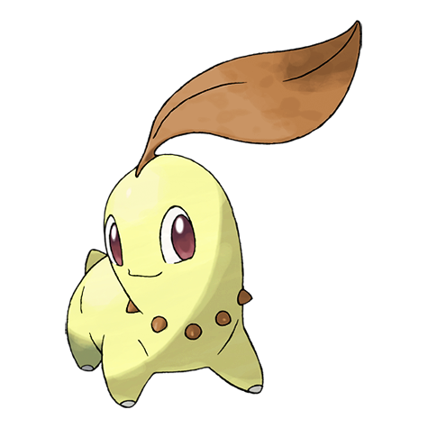
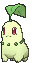
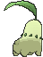
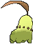

# #152 Chikorita (Leaf Pokémon)

| Official Artwork | Shiny Artwork |
|------------------|---------------|
|  |  |

In battle, Chikorita waves its leaf around to keep the foe at bay. However, a sweet fragrance also wafts from the leaf, becalming the battling Pokémon and creating a cozy, friendly atmosphere all around.

---

## Media

### Default Sprites

| Front | Shiny | Back | Shiny |
|-------|-------|------|-------|
|  |  |  |  |

### Cries

Latest (Gen VI+):

<audio controls>
<source src='../../assets/cries/chikorita/latest.ogg' type='audio/ogg'>
  Your browser does not support the audio element.
</audio>

Legacy:

<audio controls>
<source src='../../assets/cries/chikorita/legacy.ogg' type='audio/ogg'>
  Your browser does not support the audio element.
</audio>

---

## Pokédex Data

| National № | Type(s) | Height | Weight | Abilities | Local № |
|------------|---------|--------|--------|-----------|---------|
| #152 | {: width="48"} | 0.9 m / 3.0 ft | 6.4 kg / 14.1 lbs | 1. Overgrow 2. Natural Cure | N/A |

---

## Base Stats
|   | HP | Attack | Defense | Sp. Atk | Sp. Def | Speed |
|---|----|--------|---------|---------|---------|-------|
| **Base** | 45 | 49 | 65 | 49 | 65 | 45 |
| **Min** | 200 | 92 | 121 | 92 | 121 | 85 |
| **Max** | 294 | 216 | 251 | 216 | 251 | 207 |

The ranges shown above are for a level 100 Pokémon. Maximum values are based on a beneficial nature, 252 EVs, 31 IVs; minimum values are based on a hindering nature, 0 EVs, 0 IVs.

---

## Forms & Evolutions

!!! warning "WARNING"

    Information on evolutions may not be 100% accurate; differences between evolution methods across generations are not accounted for.

### Forms

Chikorita has no alternate forms.

### Evolution Line

1. [Chikorita](chikorita.md/)
    1. Level Up: [Bayleef](bayleef.md/)
        1. Level Up: [Meganium](meganium.md/)

---

## Training

| EV Yield | Catch Rate | Base Friendship | Base Exp. | Growth Rate | Held Items |
|----------|------------|-----------------|-----------|-------------|------------|
| 1 Sp.-Def | 45 | 70 | 64 | Medium Slo |

---

## Breeding

| Egg Groups | Egg Cycles | Gender | Dimorphic | Color | Shape |
|------------|------------|--------|-----------|-------|-------|
| 1. Monster 2. Plant | 20 | 87.5% Male 12.5% Female | False | Green | Quadruped |

---

## Moves

!!! warning "WARNING"

    Specific move information may be incorrect. However, the general movepool should be accurate; this includes changes made in Sacred Gold and Storm Silver.

### Level Up Moves

| Lv. | Move | Type | Cat. | Power | Acc. | PP |
| --- | --- | --- | --- | --- | --- | --- |
| 1 | Growl | {: width="48"} | {: width="36"} | — | 100 | 40 |
| 1 | Tackle | {: width="48"} | {: width="36"} | 40 | 100 | 35 |
| 5 | Razor Leaf | {: width="48"} | {: width="36"} | 55 | 95 | 25 |
| 7 | Poison Powder | {: width="48"} | {: width="36"} | — | 75 | 35 |
| 9 | Synthesis | {: width="48"} | {: width="36"} | — | — | 5 |
| 11 | Grass Whistle | {: width="48"} | {: width="36"} | — | 55 | 15 |
| 13 | Nature Power | {: width="48"} | {: width="36"} | — | — | 20 |
| 15 | Magical Leaf | {: width="48"} | {: width="36"} | 60 | — | 20 |
| 17 | Reflect | {: width="48"} | {: width="36"} | — | — | 20 |
| 19 | Natural Gift | {: width="48"} | {: width="36"} | — | 100 | 15 |
| 21 | Giga Drain | {: width="48"} | {: width="36"} | 75 | 100 | 10 |
| 23 | Ancient Power | {: width="48"} | {: width="36"} | 80 | 100 | 10 |
| 25 | Body Slam | {: width="48"} | {: width="36"} | 85 | 100 | 15 |
| 28 | Sweet Scent | {: width="48"} | {: width="36"} | — | 100 | 20 |
| 31 | Light Screen | {: width="48"} | {: width="36"} | — | — | 30 |
| 34 | Safeguard | {: width="48"} | {: width="36"} | — | — | 25 |
| 37 | Aromatherapy | {: width="48"} | {: width="36"} | — | — | 5 |
| 40 | Solar Beam | {: width="48"} | {: width="36"} | 120 | 100 | 10 |
| 43 | Leaf Storm | {: width="48"} | {: width="36"} | 130 | 90 | 5 |

### TM Moves

| TM | Move | Type | Cat. | Power | Acc. | PP |
| --- | --- | --- | --- | --- | --- | --- |
| HM01 | Cut | {: width="48"} | {: width="36"} | 70 | 100 | 15 |
| TM06 | Toxic | {: width="48"} | {: width="36"} | — | 90 | 10 |
| TM10 | Hidden Power | {: width="48"} | {: width="36"} | 60 | 100 | 15 |
| TM100 | Confide | {: width="48"} | {: width="36"} | — | — | 20 |
| TM11 | Sunny Day | {: width="48"} | {: width="36"} | — | — | 5 |
| TM16 | Light Screen | {: width="48"} | {: width="36"} | — | — | 30 |
| TM17 | Protect | {: width="48"} | {: width="36"} | — | — | 10 |
| TM20 | Safeguard | {: width="48"} | {: width="36"} | — | — | 25 |
| TM21 | Frustration | {: width="48"} | {: width="36"} | — | 100 | 20 |
| TM22 | Solar Beam | {: width="48"} | {: width="36"} | 120 | 100 | 10 |
| TM27 | Return | {: width="48"} | {: width="36"} | — | 100 | 20 |
| TM32 | Double Team | {: width="48"} | {: width="36"} | — | — | 15 |
| TM33 | Reflect | {: width="48"} | {: width="36"} | — | — | 20 |
| TM42 | Facade | {: width="48"} | {: width="36"} | 70 | 100 | 20 |
| TM44 | Rest | {: width="48"} | {: width="36"} | — | — | 5 |
| TM45 | Attract | {: width="48"} | {: width="36"} | — | 100 | 15 |
| TM48 | Round | {: width="48"} | {: width="36"} | 60 | 100 | 15 |
| TM49 | Echoed Voice | {: width="48"} | {: width="36"} | 40 | 100 | 15 |
| TM53 | Energy Ball | {: width="48"} | {: width="36"} | 90 | 100 | 10 |
| TM70 | Flash | {: width="48"} | {: width="36"} | — | 100 | 20 |
| TM75 | Swords Dance | {: width="48"} | {: width="36"} | — | — | 20 |
| TM86 | Grass Knot | {: width="48"} | {: width="36"} | — | 100 | 20 |
| TM87 | Swagger | {: width="48"} | {: width="36"} | — | 85 | 15 |
| TM88 | Sleep Talk | {: width="48"} | {: width="36"} | — | — | 10 |
| TM90 | Substitute | {: width="48"} | {: width="36"} | — | — | 10 |
| TM94 | Secret Power | {: width="48"} | {: width="36"} | 70 | 100 | 20 |
| TM96 | Nature Power | {: width="48"} | {: width="36"} | — | — | 20 |

### Egg Moves

| Move | Type | Cat. | Power | Acc. | PP |
| --- | --- | --- | --- | --- | --- |
| Ancient Power | {: width="48"} | {: width="36"} | 80 | 100 | 10 |
| Aromatherapy | {: width="48"} | {: width="36"} | — | — | 5 |
| Body Slam | {: width="48"} | {: width="36"} | 85 | 100 | 15 |
| Counter | {: width="48"} | {: width="36"} | — | 100 | 20 |
| Flail | {: width="48"} | {: width="36"} | — | 100 | 15 |
| Grass Whistle | {: width="48"} | {: width="36"} | — | 55 | 15 |
| Grassy Terrain | {: width="48"} | {: width="36"} | — | — | 10 |
| Heal Pulse | {: width="48"} | {: width="36"} | — | — | 10 |
| Ingrain | {: width="48"} | {: width="36"} | — | — | 20 |
| Leaf Storm | {: width="48"} | {: width="36"} | 130 | 90 | 5 |
| Leech Seed | {: width="48"} | {: width="36"} | — | 90 | 10 |
| Nature Power | {: width="48"} | {: width="36"} | — | — | 20 |
| Refresh | {: width="48"} | {: width="36"} | — | — | 20 |
| Vine Whip | {: width="48"} | {: width="36"} | 45 | 100 | 25 |
| Wring Out | {: width="48"} | {: width="36"} | — | 100 | 5 |

### Tutor Moves

| Move | Type | Cat. | Power | Acc. | PP |
| --- | --- | --- | --- | --- | --- |
| Giga Drain | {: width="48"} | {: width="36"} | 75 | 100 | 10 |
| Grass Pledge | {: width="48"} | {: width="36"} | 85 | 100 | 10 |
| Iron Tail | {: width="48"} | {: width="36"} | 100 | 75 | 15 |
| Magic Coat | {: width="48"} | {: width="36"} | — | — | 15 |
| Seed Bomb | {: width="48"} | {: width="36"} | 80 | 100 | 15 |
| Snore | {: width="48"} | {: width="36"} | 50 | 100 | 15 |
| Synthesis | {: width="48"} | {: width="36"} | — | — | 5 |
| Worry Seed | {: width="48"} | {: width="36"} | — | 100 | 10 |

