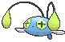
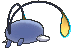
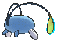

# #170 Chinchou (Angler Pokémon)

| Official Artwork | Shiny Artwork |
|------------------|---------------|
|  |  |

**Rising Ruby:** Chinchou lets loose positive and negative electrical charges from its two antennas to make its prey faint. This Pokémon flashes its electric lights to exchange signals with others.

**Sinking Sapphire:** Chinchou’s two antennas are filled with cells that generate strong electricity. This Pokémon’s cells create so much electrical power, it even makes itself tingle slightly.

---

## Media

### Default Sprites

| Front | Shiny | Back | Shiny |
|-------|-------|------|-------|
|  |  |  |  |

### Cries

Latest (Gen VI+):

<audio controls>
<source src='../../assets/cries/chinchou/latest.ogg' type='audio/ogg'>
  Your browser does not support the audio element.
</audio>

Legacy:

<audio controls>
<source src='../../assets/cries/chinchou/legacy.ogg' type='audio/ogg'>
  Your browser does not support the audio element.
</audio>

---

## Pokédex Data

| National № | Type(s) | Height | Weight | Abilities | Local № |
|------------|---------|--------|--------|-----------|---------|
| #170 | {: width="48"} {: width="48"} | 0.5 m / 1.6 ft | 12.0 kg / 26.5 lbs | 1. Volt Absorb 2. Illuminate | N/A |

---

## Base Stats
|   | HP | Attack | Defense | Sp. Atk | Sp. Def | Speed |
|---|----|--------|---------|---------|---------|-------|
| **Base** | 75 | 38 | 38 | 56 | 56 | 67 |
| **Min** | 260 | 72 | 72 | 105 | 105 | 125 |
| **Max** | 354 | 192 | 192 | 232 | 232 | 256 |

The ranges shown above are for a level 100 Pokémon. Maximum values are based on a beneficial nature, 252 EVs, 31 IVs; minimum values are based on a hindering nature, 0 EVs, 0 IVs.

---

## Forms & Evolutions

!!! warning "WARNING"

    Information on evolutions may not be 100% accurate; differences between evolution methods across generations are not accounted for.

### Forms

Chinchou has no alternate forms.

### Evolution Line

1. [Chinchou](chinchou.md/)
    1. Level Up: [Lanturn](lanturn.md/)

---

## Training

| EV Yield | Catch Rate | Base Friendship | Base Exp. | Growth Rate | Held Items |
|----------|------------|-----------------|-----------|-------------|------------|
| 1 HP | 190 | 50 | 66 | Slow | Deep Sea Scale (5%) |

---

## Breeding

| Egg Groups | Egg Cycles | Gender | Dimorphic | Color | Shape |
|------------|------------|--------|-----------|-------|-------|
| 1. Water2 | 20 | 50.0% Male 50.0% Female | False | Blue | Fish |

---

## Moves

!!! warning "WARNING"

    Specific move information may be incorrect. However, the general movepool should be accurate; this includes changes made in Sacred Gold and Storm Silver.

### Level Up Moves

| Lv. | Move | Type | Cat. | Power | Acc. | PP |
| --- | --- | --- | --- | --- | --- | --- |
| 1 | Bubble | {: width="48"} | {: width="36"} | 40 | 100 | 30 |
| 1 | Supersonic | {: width="48"} | {: width="36"} | — | 55 | 20 |
| 6 | Thunder Wave | {: width="48"} | {: width="36"} | — | 90 | 20 |
| 9 | Electro Ball | {: width="48"} | {: width="36"} | — | 100 | 10 |
| 12 | Water Gun | {: width="48"} | {: width="36"} | 40 | 100 | 25 |
| 17 | Confuse Ray | {: width="48"} | {: width="36"} | — | 100 | 10 |
| 20 | Bubble Beam | {: width="48"} | {: width="36"} | 65 | 100 | 20 |
| 23 | Spark | {: width="48"} | {: width="36"} | 65 | 100 | 20 |
| 28 | Signal Beam | {: width="48"} | {: width="36"} | 75 | 100 | 15 |
| 31 | Discharge | {: width="48"} | {: width="36"} | 80 | 100 | 15 |
| 34 | Flail | {: width="48"} | {: width="36"} | — | 100 | 15 |
| 39 | Take Down | {: width="48"} | {: width="36"} | 90 | 85 | 20 |
| 42 | Thunderbolt | {: width="48"} | {: width="36"} | 90 | 100 | 15 |
| 45 | Aqua Ring | {: width="48"} | {: width="36"} | — | — | 20 |
| 47 | Hydro Pump | {: width="48"} | {: width="36"} | 110 | 80 | 5 |
| 50 | Ion Deluge | {: width="48"} | {: width="36"} | — | — | 25 |
| 52 | Charge | {: width="48"} | {: width="36"} | — | — | 20 |

### TM Moves

| TM | Move | Type | Cat. | Power | Acc. | PP |
| --- | --- | --- | --- | --- | --- | --- |
| HM03 | Surf | {: width="48"} | {: width="36"} | 90 | 100 | 15 |
| HM05 | Waterfall | {: width="48"} | {: width="36"} | 80 | 100 | 15 |
| HM07 | Dive | {: width="48"} | {: width="36"} | 80 | 100 | 10 |
| TM06 | Toxic | {: width="48"} | {: width="36"} | — | 90 | 10 |
| TM07 | Hail | {: width="48"} | {: width="36"} | — | — | 10 |
| TM10 | Hidden Power | {: width="48"} | {: width="36"} | 60 | 100 | 15 |
| TM100 | Confide | {: width="48"} | {: width="36"} | — | — | 20 |
| TM13 | Ice Beam | {: width="48"} | {: width="36"} | 90 | 100 | 10 |
| TM14 | Blizzard | {: width="48"} | {: width="36"} | 110 | 70 | 5 |
| TM17 | Protect | {: width="48"} | {: width="36"} | — | — | 10 |
| TM18 | Rain Dance | {: width="48"} | {: width="36"} | — | — | 5 |
| TM21 | Frustration | {: width="48"} | {: width="36"} | — | 100 | 20 |
| TM24 | Thunderbolt | {: width="48"} | {: width="36"} | 90 | 100 | 15 |
| TM25 | Thunder | {: width="48"} | {: width="36"} | 110 | 70 | 10 |
| TM27 | Return | {: width="48"} | {: width="36"} | — | 100 | 20 |
| TM32 | Double Team | {: width="48"} | {: width="36"} | — | — | 15 |
| TM42 | Facade | {: width="48"} | {: width="36"} | 70 | 100 | 20 |
| TM44 | Rest | {: width="48"} | {: width="36"} | — | — | 5 |
| TM45 | Attract | {: width="48"} | {: width="36"} | — | 100 | 15 |
| TM48 | Round | {: width="48"} | {: width="36"} | 60 | 100 | 15 |
| TM55 | Scald | {: width="48"} | {: width="36"} | 80 | 100 | 15 |
| TM57 | Charge Beam | {: width="48"} | {: width="36"} | 50 | 90 | 10 |
| TM70 | Flash | {: width="48"} | {: width="36"} | — | 100 | 20 |
| TM72 | Volt Switch | {: width="48"} | {: width="36"} | 70 | 100 | 20 |
| TM73 | Thunder Wave | {: width="48"} | {: width="36"} | — | 90 | 20 |
| TM87 | Swagger | {: width="48"} | {: width="36"} | — | 85 | 15 |
| TM88 | Sleep Talk | {: width="48"} | {: width="36"} | — | — | 10 |
| TM90 | Substitute | {: width="48"} | {: width="36"} | — | — | 10 |
| TM93 | Wild Charge | {: width="48"} | {: width="36"} | 90 | 100 | 15 |
| TM94 | Secret Power | {: width="48"} | {: width="36"} | 70 | 100 | 20 |
| TM99 | Dazzling Gleam | {: width="48"} | {: width="36"} | 80 | 100 | 10 |

### Egg Moves

| Move | Type | Cat. | Power | Acc. | PP |
| --- | --- | --- | --- | --- | --- |
| Agility | {: width="48"} | {: width="36"} | — | — | 30 |
| Amnesia | {: width="48"} | {: width="36"} | — | — | 20 |
| Brine | {: width="48"} | {: width="36"} | 65 | 100 | 10 |
| Flail | {: width="48"} | {: width="36"} | — | 100 | 15 |
| Mist | {: width="48"} | {: width="36"} | — | — | 30 |
| Psybeam | {: width="48"} | {: width="36"} | 65 | 100 | 20 |
| Screech | {: width="48"} | {: width="36"} | — | 85 | 40 |
| Shock Wave | {: width="48"} | {: width="36"} | 60 | — | 20 |
| Soak | {: width="48"} | {: width="36"} | — | 100 | 20 |
| Water Pulse | {: width="48"} | {: width="36"} | 60 | 100 | 20 |
| Whirlpool | {: width="48"} | {: width="36"} | 35 | 85 | 15 |

### Tutor Moves

| Move | Type | Cat. | Power | Acc. | PP |
| --- | --- | --- | --- | --- | --- |
| Bounce | {: width="48"} | {: width="36"} | 85 | 85 | 5 |
| Heal Bell | {: width="48"} | {: width="36"} | — | — | 5 |
| Icy Wind | {: width="48"} | {: width="36"} | 55 | 95 | 15 |
| Shock Wave | {: width="48"} | {: width="36"} | 60 | — | 20 |
| Signal Beam | {: width="48"} | {: width="36"} | 75 | 100 | 15 |
| Snore | {: width="48"} | {: width="36"} | 50 | 100 | 15 |
| Water Pulse | {: width="48"} | {: width="36"} | 60 | 100 | 20 |

