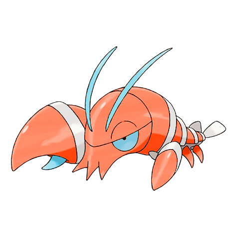
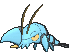
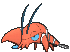
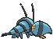
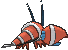

# #692 Clauncher (Water Gun Pokémon)

| Official Artwork | Shiny Artwork |
|------------------|---------------|
|  |  |

**Rising Ruby:** They knock down flying prey by firing compressed water from their massive claws like shooting a pistol.

**Sinking Sapphire:** Through controlled explosions of internal gas, it can expel water like a pistol shot. At close distances, it can shatter rock.

---

## Media

### Default Sprites

| Front | Shiny | Back | Shiny |
|-------|-------|------|-------|
|  |  |  |  |

### Cries

Latest (Gen VI+):

<audio controls>
<source src='../../assets/cries/clauncher/latest.ogg' type='audio/ogg'>
  Your browser does not support the audio element.
</audio>

Legacy:

<audio controls>
<source src='../../assets/cries/clauncher/legacy.ogg' type='audio/ogg'>
  Your browser does not support the audio element.
</audio>

---

## Pokédex Data

| National № | Type(s) | Height | Weight | Abilities | Local № |
|------------|---------|--------|--------|-----------|---------|
| #692 | {: width="48"} | 0.5 m / 1.6 ft | 8.3 kg / 18.3 lbs | 1. Mega Launcher | N/A |

---

## Base Stats
|   | HP | Attack | Defense | Sp. Atk | Sp. Def | Speed |
|---|----|--------|---------|---------|---------|-------|
| **Base** | 50 | 53 | 62 | 58 | 63 | 44 |
| **Min** | 210 | 99 | 116 | 108 | 117 | 83 |
| **Max** | 304 | 225 | 245 | 236 | 247 | 205 |

The ranges shown above are for a level 100 Pokémon. Maximum values are based on a beneficial nature, 252 EVs, 31 IVs; minimum values are based on a hindering nature, 0 EVs, 0 IVs.

---

## Forms & Evolutions

!!! warning "WARNING"

    Information on evolutions may not be 100% accurate; differences between evolution methods across generations are not accounted for.

### Forms

Clauncher has no alternate forms.

### Evolution Line

1. [Clauncher](clauncher.md/)
    1. Level Up: [Clawitzer](clawitzer.md/)

---

## Training

| EV Yield | Catch Rate | Base Friendship | Base Exp. | Growth Rate | Held Items |
|----------|------------|-----------------|-----------|-------------|------------|
| 1 Sp.-Atk | 225 | 50 | 66 | Slow | N/A |

---

## Breeding

| Egg Groups | Egg Cycles | Gender | Dimorphic | Color | Shape |
|------------|------------|--------|-----------|-------|-------|
| 1. Water1 2. Water3 | 15 | 50.0% Male 50.0% Female | False | Blue | Armor |

---

## Moves

!!! warning "WARNING"

    Specific move information may be incorrect. However, the general movepool should be accurate; this includes changes made in Sacred Gold and Storm Silver.

### Level Up Moves

| Lv. | Move | Type | Cat. | Power | Acc. | PP |
| --- | --- | --- | --- | --- | --- | --- |
| 1 | Splash | {: width="48"} | {: width="36"} | — | — | 40 |
| 1 | Water Gun | {: width="48"} | {: width="36"} | 40 | 100 | 25 |
| 6 | Water Sport | {: width="48"} | {: width="36"} | — | — | 15 |
| 9 | Vice Grip | {: width="48"} | {: width="36"} | 55 | 100 | 30 |
| 12 | Bubble | {: width="48"} | {: width="36"} | 40 | 100 | 30 |
| 15 | Smack Down | {: width="48"} | {: width="36"} | 50 | 100 | 15 |
| 18 | Bubble Beam | {: width="48"} | {: width="36"} | 65 | 100 | 20 |
| 21 | Flail | {: width="48"} | {: width="36"} | — | 100 | 15 |
| 24 | Water Pulse | {: width="48"} | {: width="36"} | 60 | 100 | 20 |
| 27 | Crabhammer | {: width="48"} | {: width="36"} | 100 | 90 | 10 |
| 30 | Swords Dance | {: width="48"} | {: width="36"} | — | — | 20 |
| 33 | Aqua Jet | {: width="48"} | {: width="36"} | 40 | 100 | 20 |
| 36 | Flash Cannon | {: width="48"} | {: width="36"} | 80 | 100 | 10 |
| 39 | Muddy Water | {: width="48"} | {: width="36"} | 90 | 85 | 10 |

### TM Moves

| TM | Move | Type | Cat. | Power | Acc. | PP |
| --- | --- | --- | --- | --- | --- | --- |
| HM01 | Cut | {: width="48"} | {: width="36"} | 70 | 100 | 15 |
| HM03 | Surf | {: width="48"} | {: width="36"} | 90 | 100 | 15 |
| HM05 | Waterfall | {: width="48"} | {: width="36"} | 80 | 100 | 15 |
| HM07 | Dive | {: width="48"} | {: width="36"} | 80 | 100 | 10 |
| TM06 | Toxic | {: width="48"} | {: width="36"} | — | 90 | 10 |
| TM09 | Venoshock | {: width="48"} | {: width="36"} | 65 | 100 | 10 |
| TM10 | Hidden Power | {: width="48"} | {: width="36"} | 60 | 100 | 15 |
| TM100 | Confide | {: width="48"} | {: width="36"} | — | — | 20 |
| TM13 | Ice Beam | {: width="48"} | {: width="36"} | 90 | 100 | 10 |
| TM17 | Protect | {: width="48"} | {: width="36"} | — | — | 10 |
| TM18 | Rain Dance | {: width="48"} | {: width="36"} | — | — | 5 |
| TM21 | Frustration | {: width="48"} | {: width="36"} | — | 100 | 20 |
| TM23 | Smack Down | {: width="48"} | {: width="36"} | 50 | 100 | 15 |
| TM27 | Return | {: width="48"} | {: width="36"} | — | 100 | 20 |
| TM32 | Double Team | {: width="48"} | {: width="36"} | — | — | 15 |
| TM34 | Sludge Wave | {: width="48"} | {: width="36"} | 95 | 100 | 10 |
| TM36 | Sludge Bomb | {: width="48"} | {: width="36"} | 90 | 100 | 10 |
| TM42 | Facade | {: width="48"} | {: width="36"} | 70 | 100 | 20 |
| TM44 | Rest | {: width="48"} | {: width="36"} | — | — | 5 |
| TM45 | Attract | {: width="48"} | {: width="36"} | — | 100 | 15 |
| TM48 | Round | {: width="48"} | {: width="36"} | 60 | 100 | 15 |
| TM55 | Scald | {: width="48"} | {: width="36"} | 80 | 100 | 15 |
| TM75 | Swords Dance | {: width="48"} | {: width="36"} | — | — | 20 |
| TM80 | Rock Slide | {: width="48"} | {: width="36"} | 75 | 90 | 10 |
| TM87 | Swagger | {: width="48"} | {: width="36"} | — | 85 | 15 |
| TM88 | Sleep Talk | {: width="48"} | {: width="36"} | — | — | 10 |
| TM89 | U Turn | {: width="48"} | {: width="36"} | 70 | 100 | 20 |
| TM90 | Substitute | {: width="48"} | {: width="36"} | — | — | 10 |
| TM91 | Flash Cannon | {: width="48"} | {: width="36"} | 80 | 100 | 10 |
| TM94 | Secret Power | {: width="48"} | {: width="36"} | 70 | 100 | 20 |

### Egg Moves

| Move | Type | Cat. | Power | Acc. | PP |
| --- | --- | --- | --- | --- | --- |
| Aqua Jet | {: width="48"} | {: width="36"} | 40 | 100 | 20 |
| Crabhammer | {: width="48"} | {: width="36"} | 100 | 90 | 10 |
| Endure | {: width="48"} | {: width="36"} | — | — | 10 |
| Entrainment | {: width="48"} | {: width="36"} | — | 100 | 15 |
| Helping Hand | {: width="48"} | {: width="36"} | — | — | 20 |

### Tutor Moves

| Move | Type | Cat. | Power | Acc. | PP |
| --- | --- | --- | --- | --- | --- |
| Aqua Tail | {: width="48"} | {: width="36"} | 90 | 90 | 10 |
| Bounce | {: width="48"} | {: width="36"} | 85 | 85 | 5 |
| Dragon Pulse | {: width="48"} | {: width="36"} | 85 | 100 | 10 |
| Helping Hand | {: width="48"} | {: width="36"} | — | — | 20 |
| Icy Wind | {: width="48"} | {: width="36"} | 55 | 95 | 15 |
| Iron Tail | {: width="48"} | {: width="36"} | 100 | 75 | 15 |
| Snore | {: width="48"} | {: width="36"} | 50 | 100 | 15 |
| Water Pulse | {: width="48"} | {: width="36"} | 60 | 100 | 20 |

