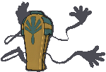
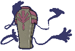

# #563 Cofagrigus (Coffin Pokémon)

| Official Artwork | Shiny Artwork |
|------------------|---------------|
|  |  |

**Rising Ruby:** It has been said that they swallow those who get too close and turn them into mummies. They like to eat gold nuggets.

**Sinking Sapphire:** Grave robbers who mistake them for real coffins and get too close end up trapped inside their bodies.

---

## Media

### Default Sprites

| Front | Shiny | Back | Shiny |
|-------|-------|------|-------|
|  |  |  |  |

### Cries

Latest (Gen VI+):

<audio controls>
<source src='../../assets/cries/cofagrigus/latest.ogg' type='audio/ogg'>
  Your browser does not support the audio element.
</audio>

Legacy:

<audio controls>
<source src='../../assets/cries/cofagrigus/legacy.ogg' type='audio/ogg'>
  Your browser does not support the audio element.
</audio>

---

## Pokédex Data

| National № | Type(s) | Height | Weight | Abilities | Local № |
|------------|---------|--------|--------|-----------|---------|
| #563 | {: width="48"} | 1.7 m / 5.6 ft | 76.5 kg / 168.7 lbs | 1. Mummy | N/A |

---

## Base Stats
|   | HP | Attack | Defense | Sp. Atk | Sp. Def | Speed |
|---|----|--------|---------|---------|---------|-------|
| **Base** | 58 | 50 | 145 | 95 | 105 | 30 |
| **Min** | 226 | 94 | 265 | 175 | 193 | 58 |
| **Max** | 320 | 218 | 427 | 317 | 339 | 174 |

The ranges shown above are for a level 100 Pokémon. Maximum values are based on a beneficial nature, 252 EVs, 31 IVs; minimum values are based on a hindering nature, 0 EVs, 0 IVs.

---

## Forms & Evolutions

!!! warning "WARNING"

    Information on evolutions may not be 100% accurate; differences between evolution methods across generations are not accounted for.

### Forms

Cofagrigus has no alternate forms.

### Evolution Line

1. [Yamask](yamask.md/)
    1. Level Up: [Cofagrigus](cofagrigus.md/)

---

## Training

| EV Yield | Catch Rate | Base Friendship | Base Exp. | Growth Rate | Held Items |
|----------|------------|-----------------|-----------|-------------|------------|
| 2 Def | 90 | 50 | 169 | Medium | Spell Tag (5%) |

---

## Breeding

| Egg Groups | Egg Cycles | Gender | Dimorphic | Color | Shape |
|------------|------------|--------|-----------|-------|-------|
| 1. Mineral 2. Indeterminate | 25 | 50.0% Male 50.0% Female | False | Yellow | Blob |

---

## Moves

!!! warning "WARNING"

    Specific move information may be incorrect. However, the general movepool should be accurate; this includes changes made in Sacred Gold and Storm Silver.

### Level Up Moves

| Lv. | Move | Type | Cat. | Power | Acc. | PP |
| --- | --- | --- | --- | --- | --- | --- |
| 1 | Astonish | {: width="48"} | {: width="36"} | 30 | 100 | 15 |
| 1 | Disable | {: width="48"} | {: width="36"} | — | 100 | 20 |
| 1 | Haze | {: width="48"} | {: width="36"} | — | — | 30 |
| 1 | Nasty Plot | {: width="48"} | {: width="36"} | — | — | 20 |
| 1 | Protect | {: width="48"} | {: width="36"} | — | — | 10 |
| 5 | Disable | {: width="48"} | {: width="36"} | — | 100 | 20 |
| 9 | Haze | {: width="48"} | {: width="36"} | — | — | 30 |
| 13 | Night Shade | {: width="48"} | {: width="36"} | — | 100 | 15 |
| 17 | Hex | {: width="48"} | {: width="36"} | 65 | 100 | 10 |
| 21 | Will O Wisp | {: width="48"} | {: width="36"} | — | 85 | 15 |
| 25 | Ominous Wind | {: width="48"} | {: width="36"} | 60 | 100 | 5 |
| 29 | Curse | {: width="48"} | {: width="36"} | — | — | 10 |
| 33 | Guard Split | {: width="48"} | {: width="36"} | — | — | 10 |
| 33 | Power Split | {: width="48"} | {: width="36"} | — | — | 10 |
| 34 | Scary Face | {: width="48"} | {: width="36"} | — | 100 | 10 |
| 39 | Shadow Ball | {: width="48"} | {: width="36"} | 80 | 100 | 15 |
| 45 | Grudge | {: width="48"} | {: width="36"} | — | — | 5 |
| 51 | Mean Look | {: width="48"} | {: width="36"} | — | — | 5 |
| 57 | Destiny Bond | {: width="48"} | {: width="36"} | — | — | 5 |
| 63 | Pain Split | {: width="48"} | {: width="36"} | — | — | 20 |
| 69 | Metal Burst | {: width="48"} | {: width="36"} | — | 100 | 10 |

### TM Moves

| TM | Move | Type | Cat. | Power | Acc. | PP |
| --- | --- | --- | --- | --- | --- | --- |
| TM04 | Calm Mind | {: width="48"} | {: width="36"} | — | — | 20 |
| TM06 | Toxic | {: width="48"} | {: width="36"} | — | 90 | 10 |
| TM10 | Hidden Power | {: width="48"} | {: width="36"} | 60 | 100 | 15 |
| TM100 | Confide | {: width="48"} | {: width="36"} | — | — | 20 |
| TM15 | Hyper Beam | {: width="48"} | {: width="36"} | 150 | 90 | 5 |
| TM17 | Protect | {: width="48"} | {: width="36"} | — | — | 10 |
| TM18 | Rain Dance | {: width="48"} | {: width="36"} | — | — | 5 |
| TM20 | Safeguard | {: width="48"} | {: width="36"} | — | — | 25 |
| TM21 | Frustration | {: width="48"} | {: width="36"} | — | 100 | 20 |
| TM27 | Return | {: width="48"} | {: width="36"} | — | 100 | 20 |
| TM29 | Psychic | {: width="48"} | {: width="36"} | 90 | 100 | 10 |
| TM30 | Shadow Ball | {: width="48"} | {: width="36"} | 80 | 100 | 15 |
| TM32 | Double Team | {: width="48"} | {: width="36"} | — | — | 15 |
| TM42 | Facade | {: width="48"} | {: width="36"} | 70 | 100 | 20 |
| TM44 | Rest | {: width="48"} | {: width="36"} | — | — | 5 |
| TM45 | Attract | {: width="48"} | {: width="36"} | — | 100 | 15 |
| TM46 | Thief | {: width="48"} | {: width="36"} | 60 | 100 | 25 |
| TM48 | Round | {: width="48"} | {: width="36"} | 60 | 100 | 15 |
| TM53 | Energy Ball | {: width="48"} | {: width="36"} | 90 | 100 | 10 |
| TM61 | Will O Wisp | {: width="48"} | {: width="36"} | — | 85 | 15 |
| TM63 | Embargo | {: width="48"} | {: width="36"} | — | 100 | 15 |
| TM66 | Payback | {: width="48"} | {: width="36"} | 50 | 100 | 10 |
| TM68 | Giga Impact | {: width="48"} | {: width="36"} | 150 | 90 | 5 |
| TM70 | Flash | {: width="48"} | {: width="36"} | — | 100 | 20 |
| TM77 | Psych Up | {: width="48"} | {: width="36"} | — | — | 10 |
| TM83 | Infestation | {: width="48"} | {: width="36"} | 20 | 100 | 20 |
| TM85 | Dream Eater | {: width="48"} | {: width="36"} | 100 | 100 | 15 |
| TM86 | Grass Knot | {: width="48"} | {: width="36"} | — | 100 | 20 |
| TM87 | Swagger | {: width="48"} | {: width="36"} | — | 85 | 15 |
| TM88 | Sleep Talk | {: width="48"} | {: width="36"} | — | — | 10 |
| TM90 | Substitute | {: width="48"} | {: width="36"} | — | — | 10 |
| TM92 | Trick Room | {: width="48"} | {: width="36"} | — | — | 5 |
| TM94 | Secret Power | {: width="48"} | {: width="36"} | 70 | 100 | 20 |
| TM97 | Dark Pulse | {: width="48"} | {: width="36"} | 80 | 100 | 15 |

### Egg Moves

Cofagrigus cannot learn any moves by breeding.
### Tutor Moves

| Move | Type | Cat. | Power | Acc. | PP |
| --- | --- | --- | --- | --- | --- |
| After You | {: width="48"} | {: width="36"} | — | — | 15 |
| Block | {: width="48"} | {: width="36"} | — | — | 5 |
| Iron Defense | {: width="48"} | {: width="36"} | — | — | 15 |
| Knock Off | {: width="48"} | {: width="36"} | 65 | 100 | 20 |
| Magic Coat | {: width="48"} | {: width="36"} | — | — | 15 |
| Pain Split | {: width="48"} | {: width="36"} | — | — | 20 |
| Role Play | {: width="48"} | {: width="36"} | — | — | 10 |
| Shock Wave | {: width="48"} | {: width="36"} | 60 | — | 20 |
| Skill Swap | {: width="48"} | {: width="36"} | — | — | 10 |
| Snatch | {: width="48"} | {: width="36"} | — | — | 10 |
| Snore | {: width="48"} | {: width="36"} | 50 | 100 | 15 |
| Spite | {: width="48"} | {: width="36"} | — | 100 | 10 |
| Trick | {: width="48"} | {: width="36"} | — | 100 | 10 |
| Wonder Room | {: width="48"} | {: width="36"} | — | — | 10 |
| Zen Headbutt | {: width="48"} | {: width="36"} | 80 | 90 | 15 |

