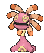
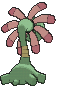
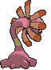

# #346 Cradily (Barnacle Pokémon)

| Official Artwork | Shiny Artwork |
|------------------|---------------|
|  |  |

**Rising Ruby:** Cradily roams around the ocean floor in search of food. This Pokémon freely extends its tree trunk-like neck and captures unwary prey using its eight tentacles.

**Sinking Sapphire:** Cradily’s body serves as an anchor, preventing it from being washed away in rough seas. This Pokémon secretes a strong digestive fluid from its tentacles.

---

## Media

### Default Sprites

| Front | Shiny | Back | Shiny |
|-------|-------|------|-------|
|  |  |  |  |

### Cries

Latest (Gen VI+):

<audio controls>
<source src='../../assets/cries/cradily/latest.ogg' type='audio/ogg'>
  Your browser does not support the audio element.
</audio>

Legacy:

<audio controls>
<source src='../../assets/cries/cradily/legacy.ogg' type='audio/ogg'>
  Your browser does not support the audio element.
</audio>

---

## Pokédex Data

| National № | Type(s) | Height | Weight | Abilities | Local № |
|------------|---------|--------|--------|-----------|---------|
| #346 | {: width="48"} {: width="48"} | 1.5 m / 4.9 ft | 60.4 kg / 133.2 lbs | 1. Suction Cups 2. Storm Drain | N/A |

---

## Base Stats
|   | HP | Attack | Defense | Sp. Atk | Sp. Def | Speed |
|---|----|--------|---------|---------|---------|-------|
| **Base** | 86 | 81 | 97 | 81 | 107 | 43 |
| **Min** | 282 | 150 | 179 | 150 | 197 | 81 |
| **Max** | 376 | 287 | 322 | 287 | 344 | 203 |

The ranges shown above are for a level 100 Pokémon. Maximum values are based on a beneficial nature, 252 EVs, 31 IVs; minimum values are based on a hindering nature, 0 EVs, 0 IVs.

---

## Forms & Evolutions

!!! warning "WARNING"

    Information on evolutions may not be 100% accurate; differences between evolution methods across generations are not accounted for.

### Forms

Cradily has no alternate forms.

### Evolution Line

1. [Lileep](lileep.md/)
    1. Level Up: [Cradily](cradily.md/)

---

## Training

| EV Yield | Catch Rate | Base Friendship | Base Exp. | Growth Rate | Held Items |
|----------|------------|-----------------|-----------|-------------|------------|
| 2 Sp.-Def | 45 | 50 | 173 | Slow Then Very Fast | Big Root (5%) |

---

## Breeding

| Egg Groups | Egg Cycles | Gender | Dimorphic | Color | Shape |
|------------|------------|--------|-----------|-------|-------|
| 1. Water3 | 30 | 87.5% Male 12.5% Female | False | Green | Blob |

---

## Moves

!!! warning "WARNING"

    Specific move information may be incorrect. However, the general movepool should be accurate; this includes changes made in Sacred Gold and Storm Silver.

### Level Up Moves

| Lv. | Move | Type | Cat. | Power | Acc. | PP |
| --- | --- | --- | --- | --- | --- | --- |
| 1 | Astonish | {: width="48"} | {: width="36"} | 30 | 100 | 15 |
| 1 | Constrict | {: width="48"} | {: width="36"} | 10 | 100 | 35 |
| 1 | Wring Out | {: width="48"} | {: width="36"} | — | 100 | 5 |
| 4 | Acid | {: width="48"} | {: width="36"} | 40 | 100 | 30 |
| 8 | Ingrain | {: width="48"} | {: width="36"} | — | — | 20 |
| 12 | Confuse Ray | {: width="48"} | {: width="36"} | — | 100 | 10 |
| 16 | Ancient Power | {: width="48"} | {: width="36"} | 80 | 100 | 10 |
| 20 | Brine | {: width="48"} | {: width="36"} | 65 | 100 | 10 |
| 24 | Giga Drain | {: width="48"} | {: width="36"} | 75 | 100 | 10 |
| 28 | Gastro Acid | {: width="48"} | {: width="36"} | — | 100 | 10 |
| 32 | Amnesia | {: width="48"} | {: width="36"} | — | — | 20 |
| 36 | Energy Ball | {: width="48"} | {: width="36"} | 90 | 100 | 10 |
| 41 | Earth Power | {: width="48"} | {: width="36"} | 90 | 100 | 10 |
| 46 | Spit Up | {: width="48"} | {: width="36"} | — | 100 | 10 |
| 46 | Stockpile | {: width="48"} | {: width="36"} | — | — | 20 |
| 46 | Swallow | {: width="48"} | {: width="36"} | — | — | 10 |
| 51 | Recover | {: width="48"} | {: width="36"} | — | — | 5 |
| 56 | Wring Out | {: width="48"} | {: width="36"} | — | 100 | 5 |

### TM Moves

| TM | Move | Type | Cat. | Power | Acc. | PP |
| --- | --- | --- | --- | --- | --- | --- |
| HM04 | Strength | {: width="48"} | {: width="36"} | 100 | 100 | 10 |
| HM06 | Rock Smash | {: width="48"} | {: width="36"} | 65 | 100 | 15 |
| TM06 | Toxic | {: width="48"} | {: width="36"} | — | 90 | 10 |
| TM10 | Hidden Power | {: width="48"} | {: width="36"} | 60 | 100 | 15 |
| TM100 | Confide | {: width="48"} | {: width="36"} | — | — | 20 |
| TM11 | Sunny Day | {: width="48"} | {: width="36"} | — | — | 5 |
| TM15 | Hyper Beam | {: width="48"} | {: width="36"} | 150 | 90 | 5 |
| TM17 | Protect | {: width="48"} | {: width="36"} | — | — | 10 |
| TM21 | Frustration | {: width="48"} | {: width="36"} | — | 100 | 20 |
| TM22 | Solar Beam | {: width="48"} | {: width="36"} | 120 | 100 | 10 |
| TM23 | Smack Down | {: width="48"} | {: width="36"} | 50 | 100 | 15 |
| TM26 | Earthquake | {: width="48"} | {: width="36"} | 100 | 100 | 10 |
| TM27 | Return | {: width="48"} | {: width="36"} | — | 100 | 20 |
| TM32 | Double Team | {: width="48"} | {: width="36"} | — | — | 15 |
| TM34 | Sludge Wave | {: width="48"} | {: width="36"} | 95 | 100 | 10 |
| TM36 | Sludge Bomb | {: width="48"} | {: width="36"} | 90 | 100 | 10 |
| TM37 | Sandstorm | {: width="48"} | {: width="36"} | — | — | 10 |
| TM39 | Rock Tomb | {: width="48"} | {: width="36"} | 60 | 95 | 15 |
| TM42 | Facade | {: width="48"} | {: width="36"} | 70 | 100 | 20 |
| TM44 | Rest | {: width="48"} | {: width="36"} | — | — | 5 |
| TM45 | Attract | {: width="48"} | {: width="36"} | — | 100 | 15 |
| TM48 | Round | {: width="48"} | {: width="36"} | 60 | 100 | 15 |
| TM53 | Energy Ball | {: width="48"} | {: width="36"} | 90 | 100 | 10 |
| TM68 | Giga Impact | {: width="48"} | {: width="36"} | 150 | 90 | 5 |
| TM69 | Rock Polish | {: width="48"} | {: width="36"} | — | — | 20 |
| TM70 | Flash | {: width="48"} | {: width="36"} | — | 100 | 20 |
| TM71 | Stone Edge | {: width="48"} | {: width="36"} | 100 | 80 | 5 |
| TM75 | Swords Dance | {: width="48"} | {: width="36"} | — | — | 20 |
| TM78 | Bulldoze | {: width="48"} | {: width="36"} | 60 | 100 | 20 |
| TM80 | Rock Slide | {: width="48"} | {: width="36"} | 75 | 90 | 10 |
| TM83 | Infestation | {: width="48"} | {: width="36"} | 20 | 100 | 20 |
| TM86 | Grass Knot | {: width="48"} | {: width="36"} | — | 100 | 20 |
| TM87 | Swagger | {: width="48"} | {: width="36"} | — | 85 | 15 |
| TM88 | Sleep Talk | {: width="48"} | {: width="36"} | — | — | 10 |
| TM90 | Substitute | {: width="48"} | {: width="36"} | — | — | 10 |
| TM94 | Secret Power | {: width="48"} | {: width="36"} | 70 | 100 | 20 |

### Egg Moves

Cradily cannot learn any moves by breeding.
### Tutor Moves

| Move | Type | Cat. | Power | Acc. | PP |
| --- | --- | --- | --- | --- | --- |
| Bind | {: width="48"} | {: width="36"} | 15 | 85 | 20 |
| Block | {: width="48"} | {: width="36"} | — | — | 5 |
| Earth Power | {: width="48"} | {: width="36"} | 90 | 100 | 10 |
| Gastro Acid | {: width="48"} | {: width="36"} | — | 100 | 10 |
| Giga Drain | {: width="48"} | {: width="36"} | 75 | 100 | 10 |
| Pain Split | {: width="48"} | {: width="36"} | — | — | 20 |
| Seed Bomb | {: width="48"} | {: width="36"} | 80 | 100 | 15 |
| Snore | {: width="48"} | {: width="36"} | 50 | 100 | 15 |
| Stealth Rock | {: width="48"} | {: width="36"} | — | — | 20 |
| Synthesis | {: width="48"} | {: width="36"} | — | — | 5 |
| Worry Seed | {: width="48"} | {: width="36"} | — | 100 | 10 |

