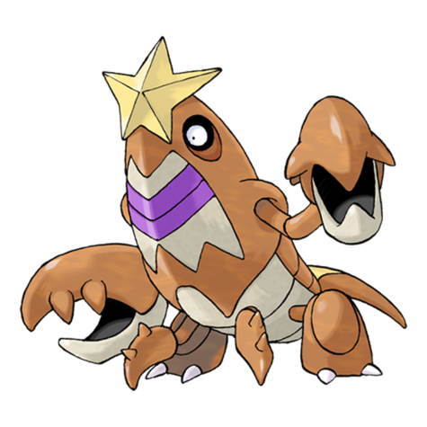

# #342 Crawdaunt (Rogue Pokémon)

| Official Artwork | Shiny Artwork |
|------------------|---------------|
|  |  |

**Rising Ruby:** Crawdaunt has an extremely violent nature that compels it to challenge other living things to battle. Other life-forms refuse to live in ponds inhabited by this Pokémon, making them desolate places.

**Sinking Sapphire:** Crawdaunt molts (sheds) its shell regularly. Immediately after molting, its shell is soft and tender. Until the shell hardens, this Pokémon hides in its streambed burrow to avoid attack from its foes.

---

## Media

### Default Sprites

| Front | Shiny | Back | Shiny |
|-------|-------|------|-------|
|  its shell regularly. Immediately after molting, its shell is soft and tender. Until the shell hardens, this Pokémon hides in its streambed burrow to avoid attack from its foes.") |  its shell regularly. Immediately after molting, its shell is soft and tender. Until the shell hardens, this Pokémon hides in its streambed burrow to avoid attack from its foes.") |  its shell regularly. Immediately after molting, its shell is soft and tender. Until the shell hardens, this Pokémon hides in its streambed burrow to avoid attack from its foes.") |  its shell regularly. Immediately after molting, its shell is soft and tender. Until the shell hardens, this Pokémon hides in its streambed burrow to avoid attack from its foes.") |

### Cries

Latest (Gen VI+):

<audio controls>
<source src='../../assets/cries/crawdaunt/latest.ogg' type='audio/ogg'>
  Your browser does not support the audio element.
</audio>

Legacy:

<audio controls>
<source src='../../assets/cries/crawdaunt/legacy.ogg' type='audio/ogg'>
  Your browser does not support the audio element.
</audio>

---

## Pokédex Data

| National № | Type(s) | Height | Weight | Abilities | Local № |
|------------|---------|--------|--------|-----------|---------|
| #342 | {: width="48"} {: width="48"} | 1.1 m / 3.6 ft | 32.8 kg / 72.3 lbs | 1. Hyper Cutter 2. Shell Armor | N/A |

---

## Base Stats
|   | HP | Attack | Defense | Sp. Atk | Sp. Def | Speed |
|---|----|--------|---------|---------|---------|-------|
| **Base** | 63 | 120 | 85 | 90 | 55 | 55 |
| **Min** | 236 | 220 | 157 | 166 | 103 | 103 |
| **Max** | 330 | 372 | 295 | 306 | 229 | 229 |

The ranges shown above are for a level 100 Pokémon. Maximum values are based on a beneficial nature, 252 EVs, 31 IVs; minimum values are based on a hindering nature, 0 EVs, 0 IVs.

---

## Forms & Evolutions

!!! warning "WARNING"

    Information on evolutions may not be 100% accurate; differences between evolution methods across generations are not accounted for.

### Forms

Crawdaunt has no alternate forms.

### Evolution Line

1. [Corphish](corphish.md/)
    1. Level Up: [Crawdaunt](crawdaunt.md/)

---

## Training

| EV Yield | Catch Rate | Base Friendship | Base Exp. | Growth Rate | Held Items |
|----------|------------|-----------------|-----------|-------------|------------|
| 2 Atk | 155 | 50 | 164 | Fast Then Very Slow | N/A |

---

## Breeding

| Egg Groups | Egg Cycles | Gender | Dimorphic | Color | Shape |
|------------|------------|--------|-----------|-------|-------|
| 1. Water1 2. Water3 | 15 | 50.0% Male 50.0% Female | False | Red | Armor |

---

## Moves

!!! warning "WARNING"

    Specific move information may be incorrect. However, the general movepool should be accurate; this includes changes made in Sacred Gold and Storm Silver.

### Level Up Moves

| Lv. | Move | Type | Cat. | Power | Acc. | PP |
| --- | --- | --- | --- | --- | --- | --- |
| 1 | Avalanche | {: width="48"} | {: width="36"} | 60 | 100 | 10 |
| 1 | Bubble | {: width="48"} | {: width="36"} | 40 | 100 | 30 |
| 1 | Harden | {: width="48"} | {: width="36"} | — | — | 30 |
| 1 | Superpower | {: width="48"} | {: width="36"} | 120 | 100 | 5 |
| 4 | Vice Grip | {: width="48"} | {: width="36"} | 55 | 100 | 30 |
| 7 | Aqua Jet | {: width="48"} | {: width="36"} | 40 | 100 | 20 |
| 10 | Leer | {: width="48"} | {: width="36"} | — | 100 | 30 |
| 13 | Bubble Beam | {: width="48"} | {: width="36"} | 65 | 100 | 20 |
| 16 | Razor Shell | {: width="48"} | {: width="36"} | 75 | 95 | 10 |
| 19 | Protect | {: width="48"} | {: width="36"} | — | — | 10 |
| 22 | Crabhammer | {: width="48"} | {: width="36"} | 100 | 90 | 10 |
| 25 | Knock Off | {: width="48"} | {: width="36"} | 65 | 100 | 20 |
| 28 | Double Hit | {: width="48"} | {: width="36"} | 35 | 90 | 10 |
| 30 | Swift | {: width="48"} | {: width="36"} | 60 | — | 20 |
| 32 | Night Slash | {: width="48"} | {: width="36"} | 70 | 100 | 15 |
| 36 | Taunt | {: width="48"} | {: width="36"} | — | 100 | 20 |
| 40 | Crunch | {: width="48"} | {: width="36"} | 80 | 100 | 15 |
| 44 | Swords Dance | {: width="48"} | {: width="36"} | — | — | 20 |
| 48 | Superpower | {: width="48"} | {: width="36"} | 120 | 100 | 5 |
| 52 | Guillotine | {: width="48"} | {: width="36"} | — | 30 | 5 |
| 56 | Dragon Dance | {: width="48"} | {: width="36"} | — | — | 20 |

### TM Moves

| TM | Move | Type | Cat. | Power | Acc. | PP |
| --- | --- | --- | --- | --- | --- | --- |
| HM01 | Cut | {: width="48"} | {: width="36"} | 70 | 100 | 15 |
| HM03 | Surf | {: width="48"} | {: width="36"} | 90 | 100 | 15 |
| HM04 | Strength | {: width="48"} | {: width="36"} | 100 | 100 | 10 |
| HM05 | Waterfall | {: width="48"} | {: width="36"} | 80 | 100 | 15 |
| HM06 | Rock Smash | {: width="48"} | {: width="36"} | 65 | 100 | 15 |
| HM07 | Dive | {: width="48"} | {: width="36"} | 80 | 100 | 10 |
| TM01 | Hone Claws | {: width="48"} | {: width="36"} | — | — | 15 |
| TM06 | Toxic | {: width="48"} | {: width="36"} | — | 90 | 10 |
| TM07 | Hail | {: width="48"} | {: width="36"} | — | — | 10 |
| TM10 | Hidden Power | {: width="48"} | {: width="36"} | 60 | 100 | 15 |
| TM100 | Confide | {: width="48"} | {: width="36"} | — | — | 20 |
| TM12 | Taunt | {: width="48"} | {: width="36"} | — | 100 | 20 |
| TM13 | Ice Beam | {: width="48"} | {: width="36"} | 90 | 100 | 10 |
| TM14 | Blizzard | {: width="48"} | {: width="36"} | 110 | 70 | 5 |
| TM15 | Hyper Beam | {: width="48"} | {: width="36"} | 150 | 90 | 5 |
| TM17 | Protect | {: width="48"} | {: width="36"} | — | — | 10 |
| TM18 | Rain Dance | {: width="48"} | {: width="36"} | — | — | 5 |
| TM21 | Frustration | {: width="48"} | {: width="36"} | — | 100 | 20 |
| TM27 | Return | {: width="48"} | {: width="36"} | — | 100 | 20 |
| TM28 | Dig | {: width="48"} | {: width="36"} | 80 | 100 | 10 |
| TM31 | Brick Break | {: width="48"} | {: width="36"} | 75 | 100 | 15 |
| TM32 | Double Team | {: width="48"} | {: width="36"} | — | — | 15 |
| TM34 | Sludge Wave | {: width="48"} | {: width="36"} | 95 | 100 | 10 |
| TM36 | Sludge Bomb | {: width="48"} | {: width="36"} | 90 | 100 | 10 |
| TM39 | Rock Tomb | {: width="48"} | {: width="36"} | 60 | 95 | 15 |
| TM40 | Aerial Ace | {: width="48"} | {: width="36"} | 60 | — | 20 |
| TM42 | Facade | {: width="48"} | {: width="36"} | 70 | 100 | 20 |
| TM44 | Rest | {: width="48"} | {: width="36"} | — | — | 5 |
| TM45 | Attract | {: width="48"} | {: width="36"} | — | 100 | 15 |
| TM48 | Round | {: width="48"} | {: width="36"} | 60 | 100 | 15 |
| TM54 | False Swipe | {: width="48"} | {: width="36"} | 40 | 100 | 40 |
| TM55 | Scald | {: width="48"} | {: width="36"} | 80 | 100 | 15 |
| TM56 | Fling | {: width="48"} | {: width="36"} | — | 100 | 10 |
| TM66 | Payback | {: width="48"} | {: width="36"} | 50 | 100 | 10 |
| TM67 | Retaliate | {: width="48"} | {: width="36"} | 70 | 100 | 5 |
| TM68 | Giga Impact | {: width="48"} | {: width="36"} | 150 | 90 | 5 |
| TM75 | Swords Dance | {: width="48"} | {: width="36"} | — | — | 20 |
| TM80 | Rock Slide | {: width="48"} | {: width="36"} | 75 | 90 | 10 |
| TM81 | X Scissor | {: width="48"} | {: width="36"} | 80 | 100 | 15 |
| TM87 | Swagger | {: width="48"} | {: width="36"} | — | 85 | 15 |
| TM88 | Sleep Talk | {: width="48"} | {: width="36"} | — | — | 10 |
| TM90 | Substitute | {: width="48"} | {: width="36"} | — | — | 10 |
| TM94 | Secret Power | {: width="48"} | {: width="36"} | 70 | 100 | 20 |
| TM95 | Snarl | {: width="48"} | {: width="36"} | 55 | 95 | 15 |
| TM96 | Nature Power | {: width="48"} | {: width="36"} | — | — | 20 |
| TM97 | Dark Pulse | {: width="48"} | {: width="36"} | 80 | 100 | 15 |

### Egg Moves

Crawdaunt cannot learn any moves by breeding.
### Tutor Moves

| Move | Type | Cat. | Power | Acc. | PP |
| --- | --- | --- | --- | --- | --- |
| Endeavor | {: width="48"} | {: width="36"} | — | 100 | 5 |
| Icy Wind | {: width="48"} | {: width="36"} | 55 | 95 | 15 |
| Iron Defense | {: width="48"} | {: width="36"} | — | — | 15 |
| Knock Off | {: width="48"} | {: width="36"} | 65 | 100 | 20 |
| Snore | {: width="48"} | {: width="36"} | 50 | 100 | 15 |
| Spite | {: width="48"} | {: width="36"} | — | 100 | 10 |
| Superpower | {: width="48"} | {: width="36"} | 120 | 100 | 5 |
| Water Pulse | {: width="48"} | {: width="36"} | 60 | 100 | 20 |

