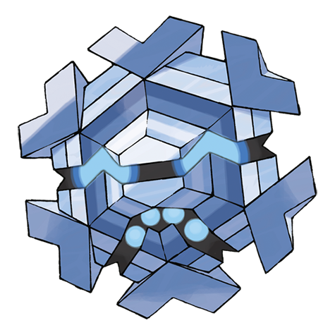

# #615 Cryogonal (Crystallizing Pokémon)

| Official Artwork | Shiny Artwork |
|------------------|---------------|
|  |  |

**Rising Ruby:** They are born in snow clouds. They use chains made of ice crystals to capture prey.

**Sinking Sapphire:** They are composed of ice crystals. They capture prey with chains of ice, freezing the prey at -148 degrees Fahrenheit.

---

## Media

### Default Sprites

| Front | Shiny | Back | Shiny |
|-------|-------|------|-------|
|  |  |  |  |

### Cries

Latest (Gen VI+):

<audio controls>
<source src='../../assets/cries/cryogonal/latest.ogg' type='audio/ogg'>
  Your browser does not support the audio element.
</audio>

Legacy:

<audio controls>
<source src='../../assets/cries/cryogonal/legacy.ogg' type='audio/ogg'>
  Your browser does not support the audio element.
</audio>

---

## Pokédex Data

| National № | Type(s) | Height | Weight | Abilities | Local № |
|------------|---------|--------|--------|-----------|---------|
| #615 | {: width="48"} | 1.1 m / 3.6 ft | 148.0 kg / 326.3 lbs | 1. Levitate | N/A |

---

## Base Stats
|   | HP | Attack | Defense | Sp. Atk | Sp. Def | Speed |
|---|----|--------|---------|---------|---------|-------|
| **Base** | 80 | 50 | 50 | 95 | 135 | 105 |
| **Min** | 270 | 94 | 94 | 175 | 247 | 193 |
| **Max** | 364 | 218 | 218 | 317 | 405 | 339 |

The ranges shown above are for a level 100 Pokémon. Maximum values are based on a beneficial nature, 252 EVs, 31 IVs; minimum values are based on a hindering nature, 0 EVs, 0 IVs.

---

## Forms & Evolutions

!!! warning "WARNING"

    Information on evolutions may not be 100% accurate; differences between evolution methods across generations are not accounted for.

### Forms

Cryogonal has no alternate forms.

### Evolution Line

1. [Cryogonal](cryogonal.md/)

---

## Training

| EV Yield | Catch Rate | Base Friendship | Base Exp. | Growth Rate | Held Items |
|----------|------------|-----------------|-----------|-------------|------------|
| 2 Sp.-Def | 25 | 50 | 180 | Medium | Never Melt Ice (5%) |

---

## Breeding

| Egg Groups | Egg Cycles | Gender | Dimorphic | Color | Shape |
|------------|------------|--------|-----------|-------|-------|
| 1. Mineral | 25 | Genderless | False | Blue | Ball |

---

## Moves

!!! warning "WARNING"

    Specific move information may be incorrect. However, the general movepool should be accurate; this includes changes made in Sacred Gold and Storm Silver.

### Level Up Moves

| Lv. | Move | Type | Cat. | Power | Acc. | PP |
| --- | --- | --- | --- | --- | --- | --- |
| 1 | Bind | {: width="48"} | {: width="36"} | 15 | 85 | 20 |
| 1 | Haze | {: width="48"} | {: width="36"} | — | — | 30 |
| 1 | Ice Shard | {: width="48"} | {: width="36"} | 40 | 100 | 30 |
| 1 | Mist | {: width="48"} | {: width="36"} | — | — | 30 |
| 1 | Night Slash | {: width="48"} | {: width="36"} | 70 | 100 | 15 |
| 1 | Sheer Cold | {: width="48"} | {: width="36"} | — | 30 | 5 |
| 5 | Ice Shard | {: width="48"} | {: width="36"} | 40 | 100 | 30 |
| 9 | Sharpen | {: width="48"} | {: width="36"} | — | — | 30 |
| 13 | Rapid Spin | {: width="48"} | {: width="36"} | 50 | 100 | 40 |
| 17 | Icy Wind | {: width="48"} | {: width="36"} | 55 | 95 | 15 |
| 21 | Haze | {: width="48"} | {: width="36"} | — | — | 30 |
| 21 | Mist | {: width="48"} | {: width="36"} | — | — | 30 |
| 25 | Aurora Beam | {: width="48"} | {: width="36"} | 65 | 100 | 20 |
| 29 | Acid Armor | {: width="48"} | {: width="36"} | — | — | 20 |
| 33 | Ice Beam | {: width="48"} | {: width="36"} | 90 | 100 | 10 |
| 37 | Light Screen | {: width="48"} | {: width="36"} | — | — | 30 |
| 37 | Reflect | {: width="48"} | {: width="36"} | — | — | 20 |
| 41 | Slash | {: width="48"} | {: width="36"} | 70 | 100 | 20 |
| 45 | Confuse Ray | {: width="48"} | {: width="36"} | — | 100 | 10 |
| 49 | Recover | {: width="48"} | {: width="36"} | — | — | 5 |
| 50 | Freeze Dry | {: width="48"} | {: width="36"} | 70 | 100 | 20 |
| 53 | Solar Beam | {: width="48"} | {: width="36"} | 120 | 100 | 10 |
| 57 | Night Slash | {: width="48"} | {: width="36"} | 70 | 100 | 15 |
| 61 | Sheer Cold | {: width="48"} | {: width="36"} | — | 30 | 5 |

### TM Moves

| TM | Move | Type | Cat. | Power | Acc. | PP |
| --- | --- | --- | --- | --- | --- | --- |
| TM06 | Toxic | {: width="48"} | {: width="36"} | — | 90 | 10 |
| TM07 | Hail | {: width="48"} | {: width="36"} | — | — | 10 |
| TM10 | Hidden Power | {: width="48"} | {: width="36"} | 60 | 100 | 15 |
| TM100 | Confide | {: width="48"} | {: width="36"} | — | — | 20 |
| TM13 | Ice Beam | {: width="48"} | {: width="36"} | 90 | 100 | 10 |
| TM14 | Blizzard | {: width="48"} | {: width="36"} | 110 | 70 | 5 |
| TM15 | Hyper Beam | {: width="48"} | {: width="36"} | 150 | 90 | 5 |
| TM16 | Light Screen | {: width="48"} | {: width="36"} | — | — | 30 |
| TM17 | Protect | {: width="48"} | {: width="36"} | — | — | 10 |
| TM18 | Rain Dance | {: width="48"} | {: width="36"} | — | — | 5 |
| TM21 | Frustration | {: width="48"} | {: width="36"} | — | 100 | 20 |
| TM22 | Solar Beam | {: width="48"} | {: width="36"} | 120 | 100 | 10 |
| TM27 | Return | {: width="48"} | {: width="36"} | — | 100 | 20 |
| TM32 | Double Team | {: width="48"} | {: width="36"} | — | — | 15 |
| TM33 | Reflect | {: width="48"} | {: width="36"} | — | — | 20 |
| TM42 | Facade | {: width="48"} | {: width="36"} | 70 | 100 | 20 |
| TM44 | Rest | {: width="48"} | {: width="36"} | — | — | 5 |
| TM45 | Attract | {: width="48"} | {: width="36"} | — | 100 | 15 |
| TM48 | Round | {: width="48"} | {: width="36"} | 60 | 100 | 15 |
| TM62 | Acrobatics | {: width="48"} | {: width="36"} | 55 | 100 | 15 |
| TM64 | Explosion | {: width="48"} | {: width="36"} | 250 | 100 | 5 |
| TM79 | Frost Breath | {: width="48"} | {: width="36"} | 60 | 90 | 10 |
| TM84 | Poison Jab | {: width="48"} | {: width="36"} | 80 | 100 | 20 |
| TM87 | Swagger | {: width="48"} | {: width="36"} | — | 85 | 15 |
| TM88 | Sleep Talk | {: width="48"} | {: width="36"} | — | — | 10 |
| TM90 | Substitute | {: width="48"} | {: width="36"} | — | — | 10 |
| TM91 | Flash Cannon | {: width="48"} | {: width="36"} | 80 | 100 | 10 |
| TM94 | Secret Power | {: width="48"} | {: width="36"} | 70 | 100 | 20 |

### Egg Moves

Cryogonal cannot learn any moves by breeding.
### Tutor Moves

| Move | Type | Cat. | Power | Acc. | PP |
| --- | --- | --- | --- | --- | --- |
| Bind | {: width="48"} | {: width="36"} | 15 | 85 | 20 |
| Icy Wind | {: width="48"} | {: width="36"} | 55 | 95 | 15 |
| Iron Defense | {: width="48"} | {: width="36"} | — | — | 15 |
| Knock Off | {: width="48"} | {: width="36"} | 65 | 100 | 20 |
| Magic Coat | {: width="48"} | {: width="36"} | — | — | 15 |
| Signal Beam | {: width="48"} | {: width="36"} | 75 | 100 | 15 |
| Snore | {: width="48"} | {: width="36"} | 50 | 100 | 15 |
| Water Pulse | {: width="48"} | {: width="36"} | 60 | 100 | 20 |

