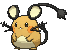

# #702 Dedenne (Antenna Pokémon)

| Official Artwork | Shiny Artwork |
|------------------|---------------|
|  |  |

**Rising Ruby:** Its whiskers serve as antennas. By sending and receiving electrical waves, it can communicate with others over vast distances.

**Sinking Sapphire:** It uses its tail to absorb electricity from power plants or from outlets in houses, and then it fires the electricity from its whiskers.

---

## Media

### Default Sprites

| Front | Shiny | Back | Shiny |
|-------|-------|------|-------|
|  |  |  |  |

### Cries

Latest (Gen VI+):

<audio controls>
<source src='../../assets/cries/dedenne/latest.ogg' type='audio/ogg'>
  Your browser does not support the audio element.
</audio>

Legacy:

<audio controls>
<source src='../../assets/cries/dedenne/legacy.ogg' type='audio/ogg'>
  Your browser does not support the audio element.
</audio>

---

## Pokédex Data

| National № | Type(s) | Height | Weight | Abilities | Local № |
|------------|---------|--------|--------|-----------|---------|
| #702 | {: width="48"} {: width="48"} | 0.2 m / 0.7 ft | 2.2 kg / 4.9 lbs | 1. Cheek Pouch 2. Pickup | N/A |

---

## Base Stats
|   | HP | Attack | Defense | Sp. Atk | Sp. Def | Speed |
|---|----|--------|---------|---------|---------|-------|
| **Base** | 75 | 60 | 60 | 90 | 70 | 110 |
| **Min** | 260 | 112 | 112 | 166 | 130 | 202 |
| **Max** | 354 | 240 | 240 | 306 | 262 | 350 |

The ranges shown above are for a level 100 Pokémon. Maximum values are based on a beneficial nature, 252 EVs, 31 IVs; minimum values are based on a hindering nature, 0 EVs, 0 IVs.

---

## Forms & Evolutions

!!! warning "WARNING"

    Information on evolutions may not be 100% accurate; differences between evolution methods across generations are not accounted for.

### Forms

Dedenne has no alternate forms.

### Evolution Line

1. [Dedenne](dedenne.md/)

---

## Training

| EV Yield | Catch Rate | Base Friendship | Base Exp. | Growth Rate | Held Items |
|----------|------------|-----------------|-----------|-------------|------------|
| 2 Spd | 180 | 50 | 151 | Medium | N/A |

---

## Breeding

| Egg Groups | Egg Cycles | Gender | Dimorphic | Color | Shape |
|------------|------------|--------|-----------|-------|-------|
| 1. Ground 2. Fairy | 20 | 50.0% Male 50.0% Female | False | Yellow | Upright |

---

## Moves

!!! warning "WARNING"

    Specific move information may be incorrect. However, the general movepool should be accurate; this includes changes made in Sacred Gold and Storm Silver.

### Level Up Moves

| Lv. | Move | Type | Cat. | Power | Acc. | PP |
| --- | --- | --- | --- | --- | --- | --- |
| 1 | Covet | {: width="48"} | {: width="36"} | 60 | 100 | 25 |
| 1 | Super Fang | {: width="48"} | {: width="36"} | — | 90 | 10 |
| 1 | Tackle | {: width="48"} | {: width="36"} | 40 | 100 | 35 |
| 1 | Tail Whip | {: width="48"} | {: width="36"} | — | 100 | 30 |
| 6 | Thunder Shock | {: width="48"} | {: width="36"} | 40 | 100 | 30 |
| 9 | Charge | {: width="48"} | {: width="36"} | — | — | 20 |
| 12 | Charm | {: width="48"} | {: width="36"} | — | 100 | 20 |
| 15 | Parabolic Charge | {: width="48"} | {: width="36"} | 65 | 100 | 20 |
| 18 | Nuzzle | {: width="48"} | {: width="36"} | 20 | 100 | 20 |
| 21 | Thunder Wave | {: width="48"} | {: width="36"} | — | 90 | 20 |
| 24 | Volt Switch | {: width="48"} | {: width="36"} | 70 | 100 | 20 |
| 27 | Rest | {: width="48"} | {: width="36"} | — | — | 5 |
| 27 | Sleep Talk | {: width="48"} | {: width="36"} | — | — | 10 |
| 27 | Snore | {: width="48"} | {: width="36"} | 50 | 100 | 15 |
| 30 | Charge Beam | {: width="48"} | {: width="36"} | 50 | 90 | 10 |
| 33 | Play Rough | {: width="48"} | {: width="36"} | 90 | 90 | 10 |
| 36 | Discharge | {: width="48"} | {: width="36"} | 80 | 100 | 15 |
| 39 | Entrainment | {: width="48"} | {: width="36"} | — | 100 | 15 |
| 42 | Moonblast | {: width="48"} | {: width="36"} | 95 | 100 | 15 |
| 45 | Thunder | {: width="48"} | {: width="36"} | 110 | 70 | 10 |

### TM Moves

| TM | Move | Type | Cat. | Power | Acc. | PP |
| --- | --- | --- | --- | --- | --- | --- |
| HM01 | Cut | {: width="48"} | {: width="36"} | 70 | 100 | 15 |
| TM06 | Toxic | {: width="48"} | {: width="36"} | — | 90 | 10 |
| TM10 | Hidden Power | {: width="48"} | {: width="36"} | 60 | 100 | 15 |
| TM100 | Confide | {: width="48"} | {: width="36"} | — | — | 20 |
| TM11 | Sunny Day | {: width="48"} | {: width="36"} | — | — | 5 |
| TM17 | Protect | {: width="48"} | {: width="36"} | — | — | 10 |
| TM18 | Rain Dance | {: width="48"} | {: width="36"} | — | — | 5 |
| TM21 | Frustration | {: width="48"} | {: width="36"} | — | 100 | 20 |
| TM24 | Thunderbolt | {: width="48"} | {: width="36"} | 90 | 100 | 15 |
| TM25 | Thunder | {: width="48"} | {: width="36"} | 110 | 70 | 10 |
| TM27 | Return | {: width="48"} | {: width="36"} | — | 100 | 20 |
| TM28 | Dig | {: width="48"} | {: width="36"} | 80 | 100 | 10 |
| TM32 | Double Team | {: width="48"} | {: width="36"} | — | — | 15 |
| TM40 | Aerial Ace | {: width="48"} | {: width="36"} | 60 | — | 20 |
| TM42 | Facade | {: width="48"} | {: width="36"} | 70 | 100 | 20 |
| TM44 | Rest | {: width="48"} | {: width="36"} | — | — | 5 |
| TM45 | Attract | {: width="48"} | {: width="36"} | — | 100 | 15 |
| TM46 | Thief | {: width="48"} | {: width="36"} | 60 | 100 | 25 |
| TM48 | Round | {: width="48"} | {: width="36"} | 60 | 100 | 15 |
| TM56 | Fling | {: width="48"} | {: width="36"} | — | 100 | 10 |
| TM57 | Charge Beam | {: width="48"} | {: width="36"} | 50 | 90 | 10 |
| TM67 | Retaliate | {: width="48"} | {: width="36"} | 70 | 100 | 5 |
| TM68 | Giga Impact | {: width="48"} | {: width="36"} | 150 | 90 | 5 |
| TM70 | Flash | {: width="48"} | {: width="36"} | — | 100 | 20 |
| TM72 | Volt Switch | {: width="48"} | {: width="36"} | 70 | 100 | 20 |
| TM73 | Thunder Wave | {: width="48"} | {: width="36"} | — | 90 | 20 |
| TM86 | Grass Knot | {: width="48"} | {: width="36"} | — | 100 | 20 |
| TM87 | Swagger | {: width="48"} | {: width="36"} | — | 85 | 15 |
| TM88 | Sleep Talk | {: width="48"} | {: width="36"} | — | — | 10 |
| TM89 | U Turn | {: width="48"} | {: width="36"} | 70 | 100 | 20 |
| TM90 | Substitute | {: width="48"} | {: width="36"} | — | — | 10 |
| TM93 | Wild Charge | {: width="48"} | {: width="36"} | 90 | 100 | 15 |
| TM94 | Secret Power | {: width="48"} | {: width="36"} | 70 | 100 | 20 |
| TM99 | Dazzling Gleam | {: width="48"} | {: width="36"} | 80 | 100 | 10 |

### Egg Moves

| Move | Type | Cat. | Power | Acc. | PP |
| --- | --- | --- | --- | --- | --- |
| Covet | {: width="48"} | {: width="36"} | 60 | 100 | 25 |
| Eerie Impulse | {: width="48"} | {: width="36"} | — | 100 | 15 |
| Helping Hand | {: width="48"} | {: width="36"} | — | — | 20 |
| Natural Gift | {: width="48"} | {: width="36"} | — | 100 | 15 |

### Tutor Moves

| Move | Type | Cat. | Power | Acc. | PP |
| --- | --- | --- | --- | --- | --- |
| Covet | {: width="48"} | {: width="36"} | 60 | 100 | 25 |
| Electroweb | {: width="48"} | {: width="36"} | 55 | 95 | 15 |
| Helping Hand | {: width="48"} | {: width="36"} | — | — | 20 |
| Iron Tail | {: width="48"} | {: width="36"} | 100 | 75 | 15 |
| Last Resort | {: width="48"} | {: width="36"} | 140 | 100 | 5 |
| Magnet Rise | {: width="48"} | {: width="36"} | — | — | 10 |
| Recycle | {: width="48"} | {: width="36"} | — | — | 10 |
| Shock Wave | {: width="48"} | {: width="36"} | 60 | — | 20 |
| Signal Beam | {: width="48"} | {: width="36"} | 75 | 100 | 15 |
| Snore | {: width="48"} | {: width="36"} | 50 | 100 | 15 |
| Super Fang | {: width="48"} | {: width="36"} | — | 90 | 10 |
| Thunder Punch | {: width="48"} | {: width="36"} | 75 | 100 | 15 |

