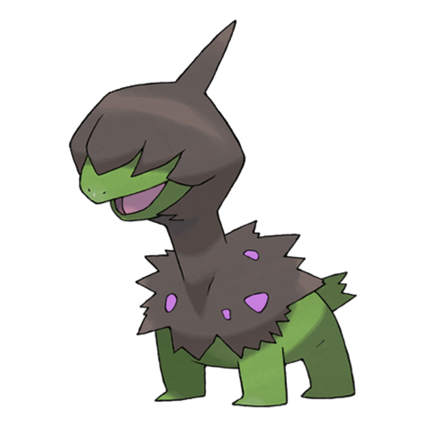
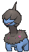

# #633 Deino (Irate Pokémon)

| Official Artwork | Shiny Artwork |
|------------------|---------------|
|  |  |

**Rising Ruby:** They cannot see, so they tackle and bite to learn about their surroundings. Their bodies are covered in wounds.

**Sinking Sapphire:** Lacking sight, it’s unaware of its surroundings, so it bumps into things and eats anything that moves.

---

## Media

### Default Sprites

| Front | Shiny | Back | Shiny |
|-------|-------|------|-------|
|  |  |  |  |

### Cries

Latest (Gen VI+):

<audio controls>
<source src='../../assets/cries/deino/latest.ogg' type='audio/ogg'>
  Your browser does not support the audio element.
</audio>

Legacy:

<audio controls>
<source src='../../assets/cries/deino/legacy.ogg' type='audio/ogg'>
  Your browser does not support the audio element.
</audio>

---

## Pokédex Data

| National № | Type(s) | Height | Weight | Abilities | Local № |
|------------|---------|--------|--------|-----------|---------|
| #633 | {: width="48"} {: width="48"} | 0.8 m / 2.6 ft | 17.3 kg / 38.1 lbs | 1. Hustle | N/A |

---

## Base Stats
|   | HP | Attack | Defense | Sp. Atk | Sp. Def | Speed |
|---|----|--------|---------|---------|---------|-------|
| **Base** | 52 | 65 | 50 | 45 | 50 | 38 |
| **Min** | 214 | 121 | 94 | 85 | 94 | 72 |
| **Max** | 308 | 251 | 218 | 207 | 218 | 192 |

The ranges shown above are for a level 100 Pokémon. Maximum values are based on a beneficial nature, 252 EVs, 31 IVs; minimum values are based on a hindering nature, 0 EVs, 0 IVs.

---

## Forms & Evolutions

!!! warning "WARNING"

    Information on evolutions may not be 100% accurate; differences between evolution methods across generations are not accounted for.

### Forms

Deino has no alternate forms.

### Evolution Line

1. [Deino](deino.md/)
    1. Level Up: [Zweilous](zweilous.md/)
        1. Level Up: [Hydreigon](hydreigon.md/)

---

## Training

| EV Yield | Catch Rate | Base Friendship | Base Exp. | Growth Rate | Held Items |
|----------|------------|-----------------|-----------|-------------|------------|
| 1 Atk | 45 | 35 | 60 | Slow | N/A |

---

## Breeding

| Egg Groups | Egg Cycles | Gender | Dimorphic | Color | Shape |
|------------|------------|--------|-----------|-------|-------|
| 1. Dragon | 40 | 50.0% Male 50.0% Female | False | Blue | Quadruped |

---

## Moves

!!! warning "WARNING"

    Specific move information may be incorrect. However, the general movepool should be accurate; this includes changes made in Sacred Gold and Storm Silver.

### Level Up Moves

| Lv. | Move | Type | Cat. | Power | Acc. | PP |
| --- | --- | --- | --- | --- | --- | --- |
| 1 | Bite | {: width="48"} | {: width="36"} | 60 | 100 | 25 |
| 1 | Dragon Rage | {: width="48"} | {: width="36"} | — | 100 | 10 |
| 1 | Tackle | {: width="48"} | {: width="36"} | 40 | 100 | 35 |
| 5 | Focus Energy | {: width="48"} | {: width="36"} | — | — | 30 |
| 9 | Headbutt | {: width="48"} | {: width="36"} | 70 | 100 | 15 |
| 13 | Dragon Breath | {: width="48"} | {: width="36"} | 60 | 100 | 20 |
| 17 | Roar | {: width="48"} | {: width="36"} | — | — | 20 |
| 21 | Fire Fang | {: width="48"} | {: width="36"} | 65 | 95 | 15 |
| 21 | Ice Fang | {: width="48"} | {: width="36"} | 65 | 95 | 15 |
| 21 | Thunder Fang | {: width="48"} | {: width="36"} | 65 | 95 | 15 |
| 25 | Crunch | {: width="48"} | {: width="36"} | 80 | 100 | 15 |
| 29 | Slam | {: width="48"} | {: width="36"} | 80 | 75 | 20 |
| 33 | Dragon Rush | {: width="48"} | {: width="36"} | 100 | 75 | 10 |
| 37 | Body Slam | {: width="48"} | {: width="36"} | 85 | 100 | 15 |
| 41 | Outrage | {: width="48"} | {: width="36"} | 120 | 100 | 10 |
| 45 | Work Up | {: width="48"} | {: width="36"} | — | — | 30 |
| 49 | Dragon Pulse | {: width="48"} | {: width="36"} | 85 | 100 | 10 |
| 53 | Scary Face | {: width="48"} | {: width="36"} | — | 100 | 10 |
| 57 | Hyper Voice | {: width="48"} | {: width="36"} | 90 | 100 | 10 |
| 61 | Dark Pulse | {: width="48"} | {: width="36"} | 80 | 100 | 15 |

### TM Moves

| TM | Move | Type | Cat. | Power | Acc. | PP |
| --- | --- | --- | --- | --- | --- | --- |
| HM04 | Strength | {: width="48"} | {: width="36"} | 100 | 100 | 10 |
| HM06 | Rock Smash | {: width="48"} | {: width="36"} | 65 | 100 | 15 |
| TM05 | Roar | {: width="48"} | {: width="36"} | — | — | 20 |
| TM06 | Toxic | {: width="48"} | {: width="36"} | — | 90 | 10 |
| TM10 | Hidden Power | {: width="48"} | {: width="36"} | 60 | 100 | 15 |
| TM100 | Confide | {: width="48"} | {: width="36"} | — | — | 20 |
| TM11 | Sunny Day | {: width="48"} | {: width="36"} | — | — | 5 |
| TM12 | Taunt | {: width="48"} | {: width="36"} | — | 100 | 20 |
| TM17 | Protect | {: width="48"} | {: width="36"} | — | — | 10 |
| TM18 | Rain Dance | {: width="48"} | {: width="36"} | — | — | 5 |
| TM21 | Frustration | {: width="48"} | {: width="36"} | — | 100 | 20 |
| TM27 | Return | {: width="48"} | {: width="36"} | — | 100 | 20 |
| TM32 | Double Team | {: width="48"} | {: width="36"} | — | — | 15 |
| TM41 | Torment | {: width="48"} | {: width="36"} | — | 100 | 15 |
| TM42 | Facade | {: width="48"} | {: width="36"} | 70 | 100 | 20 |
| TM44 | Rest | {: width="48"} | {: width="36"} | — | — | 5 |
| TM45 | Attract | {: width="48"} | {: width="36"} | — | 100 | 15 |
| TM46 | Thief | {: width="48"} | {: width="36"} | 60 | 100 | 25 |
| TM48 | Round | {: width="48"} | {: width="36"} | 60 | 100 | 15 |
| TM59 | Incinerate | {: width="48"} | {: width="36"} | 60 | 100 | 15 |
| TM73 | Thunder Wave | {: width="48"} | {: width="36"} | — | 90 | 20 |
| TM77 | Psych Up | {: width="48"} | {: width="36"} | — | — | 10 |
| TM82 | Dragon Tail | {: width="48"} | {: width="36"} | 60 | 90 | 10 |
| TM87 | Swagger | {: width="48"} | {: width="36"} | — | 85 | 15 |
| TM88 | Sleep Talk | {: width="48"} | {: width="36"} | — | — | 10 |
| TM90 | Substitute | {: width="48"} | {: width="36"} | — | — | 10 |
| TM94 | Secret Power | {: width="48"} | {: width="36"} | 70 | 100 | 20 |
| TM97 | Dark Pulse | {: width="48"} | {: width="36"} | 80 | 100 | 15 |

### Egg Moves

| Move | Type | Cat. | Power | Acc. | PP |
| --- | --- | --- | --- | --- | --- |
| Assurance | {: width="48"} | {: width="36"} | 60 | 100 | 10 |
| Astonish | {: width="48"} | {: width="36"} | 30 | 100 | 15 |
| Dark Pulse | {: width="48"} | {: width="36"} | 80 | 100 | 15 |
| Double Hit | {: width="48"} | {: width="36"} | 35 | 90 | 10 |
| Earth Power | {: width="48"} | {: width="36"} | 90 | 100 | 10 |
| Fire Fang | {: width="48"} | {: width="36"} | 65 | 95 | 15 |
| Head Smash | {: width="48"} | {: width="36"} | 150 | 80 | 5 |
| Ice Fang | {: width="48"} | {: width="36"} | 65 | 95 | 15 |
| Screech | {: width="48"} | {: width="36"} | — | 85 | 40 |
| Thunder Fang | {: width="48"} | {: width="36"} | 65 | 95 | 15 |

### Tutor Moves

| Move | Type | Cat. | Power | Acc. | PP |
| --- | --- | --- | --- | --- | --- |
| Aqua Tail | {: width="48"} | {: width="36"} | 90 | 90 | 10 |
| Draco Meteor | {: width="48"} | {: width="36"} | 130 | 90 | 5 |
| Dragon Pulse | {: width="48"} | {: width="36"} | 85 | 100 | 10 |
| Earth Power | {: width="48"} | {: width="36"} | 90 | 100 | 10 |
| Hyper Voice | {: width="48"} | {: width="36"} | 90 | 100 | 10 |
| Outrage | {: width="48"} | {: width="36"} | 120 | 100 | 10 |
| Shock Wave | {: width="48"} | {: width="36"} | 60 | — | 20 |
| Snore | {: width="48"} | {: width="36"} | 50 | 100 | 15 |
| Spite | {: width="48"} | {: width="36"} | — | 100 | 10 |
| Superpower | {: width="48"} | {: width="36"} | 120 | 100 | 5 |
| Uproar | {: width="48"} | {: width="36"} | 90 | 100 | 10 |
| Zen Headbutt | {: width="48"} | {: width="36"} | 80 | 90 | 15 |

