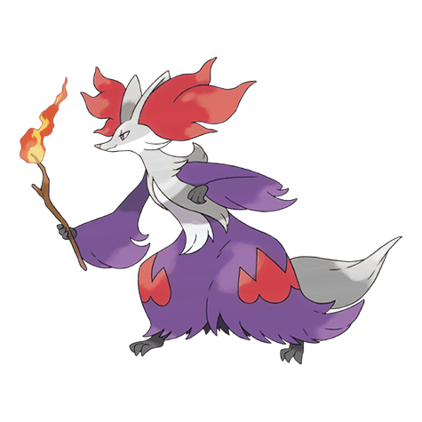
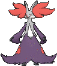
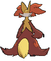
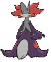

# #655 Delphox (Fox Pokémon)

| Official Artwork | Shiny Artwork |
|------------------|---------------|
|  |  |

**Rising Ruby:** It gazes into the flame at the tip of its branch to achieve a focused state, which allows it to see into the future.

**Sinking Sapphire:** Using psychic power, it generates a fiery vortex of 5,400 degrees Fahrenheit, incinerating foes swept into this whirl of flame.

---

## Media

### Default Sprites

| Front | Shiny | Back | Shiny |
|-------|-------|------|-------|
|  |  |  |  |

### Cries

Latest (Gen VI+):

<audio controls>
<source src='../../assets/cries/delphox/latest.ogg' type='audio/ogg'>
  Your browser does not support the audio element.
</audio>

Legacy:

<audio controls>
<source src='../../assets/cries/delphox/legacy.ogg' type='audio/ogg'>
  Your browser does not support the audio element.
</audio>

---

## Pokédex Data

| National № | Type(s) | Height | Weight | Abilities | Local № |
|------------|---------|--------|--------|-----------|---------|
| #655 | {: width="48"} {: width="48"} | 1.5 m / 4.9 ft | 39.0 kg / 86.0 lbs | 1. Blaze 2. Magician | N/A |

---

## Base Stats
|   | HP | Attack | Defense | Sp. Atk | Sp. Def | Speed |
|---|----|--------|---------|---------|---------|-------|
| **Base** | 75 | 69 | 72 | 114 | 100 | 104 |
| **Min** | 260 | 128 | 134 | 209 | 184 | 191 |
| **Max** | 354 | 260 | 267 | 359 | 328 | 337 |

The ranges shown above are for a level 100 Pokémon. Maximum values are based on a beneficial nature, 252 EVs, 31 IVs; minimum values are based on a hindering nature, 0 EVs, 0 IVs.

---

## Forms & Evolutions

!!! warning "WARNING"

    Information on evolutions may not be 100% accurate; differences between evolution methods across generations are not accounted for.

### Forms

Delphox has no alternate forms.

### Evolution Line

1. [Fennekin](fennekin.md/)
    1. Level Up: [Braixen](braixen.md/)
        1. Level Up: [Delphox](delphox.md/)

---

## Training

| EV Yield | Catch Rate | Base Friendship | Base Exp. | Growth Rate | Held Items |
|----------|------------|-----------------|-----------|-------------|------------|
| 3 Sp.-Atk | 45 | 70 | 240 | Medium Slow | N/A |

---

## Breeding

| Egg Groups | Egg Cycles | Gender | Dimorphic | Color | Shape |
|------------|------------|--------|-----------|-------|-------|
| 1. Ground | 20 | 87.5% Male 12.5% Female | False | Red | Upright |

---

## Moves

!!! warning "WARNING"

    Specific move information may be incorrect. However, the general movepool should be accurate; this includes changes made in Sacred Gold and Storm Silver.

### Level Up Moves

| Lv. | Move | Type | Cat. | Power | Acc. | PP |
| --- | --- | --- | --- | --- | --- | --- |
| 1 | Future Sight | {: width="48"} | {: width="36"} | 120 | 100 | 10 |
| 1 | Role Play | {: width="48"} | {: width="36"} | — | — | 10 |
| 1 | Scratch | {: width="48"} | {: width="36"} | 50 | 100 | 35 |
| 1 | Shadow Ball | {: width="48"} | {: width="36"} | 80 | 100 | 15 |
| 1 | Switcheroo | {: width="48"} | {: width="36"} | — | 100 | 10 |
| 1 | Tail Whip | {: width="48"} | {: width="36"} | — | 100 | 30 |
| 5 | Ember | {: width="48"} | {: width="36"} | 40 | 100 | 25 |
| 7 | Howl | {: width="48"} | {: width="36"} | — | — | 40 |
| 9 | Flame Charge | {: width="48"} | {: width="36"} | 50 | 100 | 20 |
| 12 | Psybeam | {: width="48"} | {: width="36"} | 65 | 100 | 20 |
| 14 | Fire Spin | {: width="48"} | {: width="36"} | 35 | 85 | 15 |
| 16 | Incinerate | {: width="48"} | {: width="36"} | 60 | 100 | 15 |
| 18 | Lucky Chant | {: width="48"} | {: width="36"} | — | — | 30 |
| 21 | Psyshock | {: width="48"} | {: width="36"} | 80 | 100 | 10 |
| 25 | Light Screen | {: width="48"} | {: width="36"} | — | — | 30 |
| 29 | Flamethrower | {: width="48"} | {: width="36"} | 90 | 100 | 15 |
| 33 | Hypnosis | {: width="48"} | {: width="36"} | — | 60 | 20 |
| 36 | Mystical Fire | {: width="48"} | {: width="36"} | 80 | 100 | 10 |
| 38 | Will O Wisp | {: width="48"} | {: width="36"} | — | 85 | 15 |
| 43 | Psychic | {: width="48"} | {: width="36"} | 90 | 100 | 10 |
| 48 | Sunny Day | {: width="48"} | {: width="36"} | — | — | 5 |
| 53 | Magic Room | {: width="48"} | {: width="36"} | — | — | 10 |
| 58 | Fire Blast | {: width="48"} | {: width="36"} | 110 | 85 | 5 |
| 63 | Future Sight | {: width="48"} | {: width="36"} | 120 | 100 | 10 |

### TM Moves

| TM | Move | Type | Cat. | Power | Acc. | PP |
| --- | --- | --- | --- | --- | --- | --- |
| HM01 | Cut | {: width="48"} | {: width="36"} | 70 | 100 | 15 |
| TM03 | Psyshock | {: width="48"} | {: width="36"} | 80 | 100 | 10 |
| TM04 | Calm Mind | {: width="48"} | {: width="36"} | — | — | 20 |
| TM06 | Toxic | {: width="48"} | {: width="36"} | — | 90 | 10 |
| TM10 | Hidden Power | {: width="48"} | {: width="36"} | 60 | 100 | 15 |
| TM100 | Confide | {: width="48"} | {: width="36"} | — | — | 20 |
| TM11 | Sunny Day | {: width="48"} | {: width="36"} | — | — | 5 |
| TM15 | Hyper Beam | {: width="48"} | {: width="36"} | 150 | 90 | 5 |
| TM16 | Light Screen | {: width="48"} | {: width="36"} | — | — | 30 |
| TM17 | Protect | {: width="48"} | {: width="36"} | — | — | 10 |
| TM18 | Rain Dance | {: width="48"} | {: width="36"} | — | — | 5 |
| TM20 | Safeguard | {: width="48"} | {: width="36"} | — | — | 25 |
| TM21 | Frustration | {: width="48"} | {: width="36"} | — | 100 | 20 |
| TM22 | Solar Beam | {: width="48"} | {: width="36"} | 120 | 100 | 10 |
| TM27 | Return | {: width="48"} | {: width="36"} | — | 100 | 20 |
| TM29 | Psychic | {: width="48"} | {: width="36"} | 90 | 100 | 10 |
| TM30 | Shadow Ball | {: width="48"} | {: width="36"} | 80 | 100 | 15 |
| TM32 | Double Team | {: width="48"} | {: width="36"} | — | — | 15 |
| TM35 | Flamethrower | {: width="48"} | {: width="36"} | 90 | 100 | 15 |
| TM38 | Fire Blast | {: width="48"} | {: width="36"} | 110 | 85 | 5 |
| TM42 | Facade | {: width="48"} | {: width="36"} | 70 | 100 | 20 |
| TM43 | Flame Charge | {: width="48"} | {: width="36"} | 50 | 100 | 20 |
| TM44 | Rest | {: width="48"} | {: width="36"} | — | — | 5 |
| TM45 | Attract | {: width="48"} | {: width="36"} | — | 100 | 15 |
| TM46 | Thief | {: width="48"} | {: width="36"} | 60 | 100 | 25 |
| TM48 | Round | {: width="48"} | {: width="36"} | 60 | 100 | 15 |
| TM49 | Echoed Voice | {: width="48"} | {: width="36"} | 40 | 100 | 15 |
| TM50 | Overheat | {: width="48"} | {: width="36"} | 130 | 90 | 5 |
| TM59 | Incinerate | {: width="48"} | {: width="36"} | 60 | 100 | 15 |
| TM61 | Will O Wisp | {: width="48"} | {: width="36"} | — | 85 | 15 |
| TM63 | Embargo | {: width="48"} | {: width="36"} | — | 100 | 15 |
| TM68 | Giga Impact | {: width="48"} | {: width="36"} | 150 | 90 | 5 |
| TM77 | Psych Up | {: width="48"} | {: width="36"} | — | — | 10 |
| TM85 | Dream Eater | {: width="48"} | {: width="36"} | 100 | 100 | 15 |
| TM86 | Grass Knot | {: width="48"} | {: width="36"} | — | 100 | 20 |
| TM87 | Swagger | {: width="48"} | {: width="36"} | — | 85 | 15 |
| TM88 | Sleep Talk | {: width="48"} | {: width="36"} | — | — | 10 |
| TM90 | Substitute | {: width="48"} | {: width="36"} | — | — | 10 |
| TM92 | Trick Room | {: width="48"} | {: width="36"} | — | — | 5 |
| TM94 | Secret Power | {: width="48"} | {: width="36"} | 70 | 100 | 20 |
| TM98 | Power Up Punch | {: width="48"} | {: width="36"} | 40 | 100 | 20 |
| TM99 | Dazzling Gleam | {: width="48"} | {: width="36"} | 80 | 100 | 10 |

### Egg Moves

Delphox cannot learn any moves by breeding.
### Tutor Moves

| Move | Type | Cat. | Power | Acc. | PP |
| --- | --- | --- | --- | --- | --- |
| Blast Burn | {: width="48"} | {: width="36"} | 150 | 90 | 5 |
| Covet | {: width="48"} | {: width="36"} | 60 | 100 | 25 |
| Fire Pledge | {: width="48"} | {: width="36"} | 85 | 100 | 10 |
| Fire Punch | {: width="48"} | {: width="36"} | 75 | 100 | 15 |
| Foul Play | {: width="48"} | {: width="36"} | 95 | 100 | 15 |
| Heat Wave | {: width="48"} | {: width="36"} | 95 | 90 | 10 |
| Iron Tail | {: width="48"} | {: width="36"} | 100 | 75 | 15 |
| Low Kick | {: width="48"} | {: width="36"} | — | 100 | 20 |
| Magic Coat | {: width="48"} | {: width="36"} | — | — | 15 |
| Magic Room | {: width="48"} | {: width="36"} | — | — | 10 |
| Recycle | {: width="48"} | {: width="36"} | — | — | 10 |
| Role Play | {: width="48"} | {: width="36"} | — | — | 10 |
| Shock Wave | {: width="48"} | {: width="36"} | 60 | — | 20 |
| Signal Beam | {: width="48"} | {: width="36"} | 75 | 100 | 15 |
| Skill Swap | {: width="48"} | {: width="36"} | — | — | 10 |
| Snatch | {: width="48"} | {: width="36"} | — | — | 10 |
| Snore | {: width="48"} | {: width="36"} | 50 | 100 | 15 |
| Thunder Punch | {: width="48"} | {: width="36"} | 75 | 100 | 15 |
| Trick | {: width="48"} | {: width="36"} | — | 100 | 10 |
| Wonder Room | {: width="48"} | {: width="36"} | — | — | 10 |
| Zen Headbutt | {: width="48"} | {: width="36"} | 80 | 90 | 15 |

