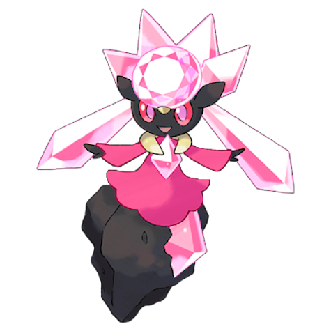
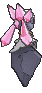
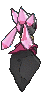

# #719 Diancie (Jewel Pokémon)

| Official Artwork | Shiny Artwork |
|------------------|---------------|
|  |  |

**Rising Ruby:** A sudden transformation of Carbink, its pink, glimmering body is said to be the loveliest sight in the whole world.

**Sinking Sapphire:** It can instantly create many diamonds by compressing the carbon in the air between its hands.

---

## Media

### Default Sprites

| Front | Shiny | Back | Shiny |
|-------|-------|------|-------|
|  |  |  |  |

### Cries

Latest (Gen VI+):

<audio controls>
<source src='../../assets/cries/diancie/latest.ogg' type='audio/ogg'>
  Your browser does not support the audio element.
</audio>

Legacy:

<audio controls>
<source src='../../assets/cries/diancie/legacy.ogg' type='audio/ogg'>
  Your browser does not support the audio element.
</audio>

---

## Pokédex Data

| National № | Type(s) | Height | Weight | Abilities | Local № |
|------------|---------|--------|--------|-----------|---------|
| #719 | {: width="48"} {: width="48"} | 0.7 m / 2.3 ft | 8.8 kg / 19.4 lbs | 1. Clear Body | N/A |

---

## Base Stats
|   | HP | Attack | Defense | Sp. Atk | Sp. Def | Speed |
|---|----|--------|---------|---------|---------|-------|
| **Base** | 50 | 100 | 150 | 100 | 150 | 50 |
| **Min** | 210 | 184 | 274 | 184 | 274 | 94 |
| **Max** | 304 | 328 | 438 | 328 | 438 | 218 |

The ranges shown above are for a level 100 Pokémon. Maximum values are based on a beneficial nature, 252 EVs, 31 IVs; minimum values are based on a hindering nature, 0 EVs, 0 IVs.

---

## Forms & Evolutions

!!! warning "WARNING"

    Information on evolutions may not be 100% accurate; differences between evolution methods across generations are not accounted for.

### Forms

1. [Diancie](diancie.md/)

2. [Diancie Mega](diancie-mega.md/)

### Evolution Line

1. [Diancie](diancie.md/)

---

## Training

| EV Yield | Catch Rate | Base Friendship | Base Exp. | Growth Rate | Held Items |
|----------|------------|-----------------|-----------|-------------|------------|
| 1 Def 2 Sp.-Def | 3 | 50 | 300 | Slo |

---

## Breeding

| Egg Groups | Egg Cycles | Gender | Dimorphic | Color | Shape |
|------------|------------|--------|-----------|-------|-------|
| 1. No-Eggs | 25 | Genderless | False | Pink | Arms |

---

## Moves

!!! warning "WARNING"

    Specific move information may be incorrect. However, the general movepool should be accurate; this includes changes made in Sacred Gold and Storm Silver.

### Level Up Moves

| Lv. | Move | Type | Cat. | Power | Acc. | PP |
| --- | --- | --- | --- | --- | --- | --- |
| 1 | Harden | {: width="48"} | {: width="36"} | — | — | 30 |
| 1 | Tackle | {: width="48"} | {: width="36"} | 40 | 100 | 35 |
| 5 | Rock Throw | {: width="48"} | {: width="36"} | 50 | 90 | 15 |
| 8 | Sharpen | {: width="48"} | {: width="36"} | — | — | 30 |
| 12 | Smack Down | {: width="48"} | {: width="36"} | 50 | 100 | 15 |
| 18 | Reflect | {: width="48"} | {: width="36"} | — | — | 20 |
| 21 | Stealth Rock | {: width="48"} | {: width="36"} | — | — | 20 |
| 27 | Guard Split | {: width="48"} | {: width="36"} | — | — | 10 |
| 31 | Ancient Power | {: width="48"} | {: width="36"} | 80 | 100 | 10 |
| 35 | Flail | {: width="48"} | {: width="36"} | — | 100 | 15 |
| 40 | Skill Swap | {: width="48"} | {: width="36"} | — | — | 10 |
| 46 | Trick Room | {: width="48"} | {: width="36"} | — | — | 5 |
| 49 | Stone Edge | {: width="48"} | {: width="36"} | 100 | 80 | 5 |
| 50 | Diamond Storm | {: width="48"} | {: width="36"} | 100 | 95 | 5 |
| 50 | Moonblast | {: width="48"} | {: width="36"} | 95 | 100 | 15 |
| 60 | Light Screen | {: width="48"} | {: width="36"} | — | — | 30 |
| 70 | Safeguard | {: width="48"} | {: width="36"} | — | — | 25 |

### TM Moves

| TM | Move | Type | Cat. | Power | Acc. | PP |
| --- | --- | --- | --- | --- | --- | --- |
| TM03 | Psyshock | {: width="48"} | {: width="36"} | 80 | 100 | 10 |
| TM04 | Calm Mind | {: width="48"} | {: width="36"} | — | — | 20 |
| TM06 | Toxic | {: width="48"} | {: width="36"} | — | 90 | 10 |
| TM07 | Hail | {: width="48"} | {: width="36"} | — | — | 10 |
| TM10 | Hidden Power | {: width="48"} | {: width="36"} | 60 | 100 | 15 |
| TM100 | Confide | {: width="48"} | {: width="36"} | — | — | 20 |
| TM11 | Sunny Day | {: width="48"} | {: width="36"} | — | — | 5 |
| TM15 | Hyper Beam | {: width="48"} | {: width="36"} | 150 | 90 | 5 |
| TM16 | Light Screen | {: width="48"} | {: width="36"} | — | — | 30 |
| TM17 | Protect | {: width="48"} | {: width="36"} | — | — | 10 |
| TM20 | Safeguard | {: width="48"} | {: width="36"} | — | — | 25 |
| TM21 | Frustration | {: width="48"} | {: width="36"} | — | 100 | 20 |
| TM23 | Smack Down | {: width="48"} | {: width="36"} | 50 | 100 | 15 |
| TM27 | Return | {: width="48"} | {: width="36"} | — | 100 | 20 |
| TM29 | Psychic | {: width="48"} | {: width="36"} | 90 | 100 | 10 |
| TM32 | Double Team | {: width="48"} | {: width="36"} | — | — | 15 |
| TM33 | Reflect | {: width="48"} | {: width="36"} | — | — | 20 |
| TM37 | Sandstorm | {: width="48"} | {: width="36"} | — | — | 10 |
| TM39 | Rock Tomb | {: width="48"} | {: width="36"} | 60 | 95 | 15 |
| TM42 | Facade | {: width="48"} | {: width="36"} | 70 | 100 | 20 |
| TM44 | Rest | {: width="48"} | {: width="36"} | — | — | 5 |
| TM48 | Round | {: width="48"} | {: width="36"} | 60 | 100 | 15 |
| TM64 | Explosion | {: width="48"} | {: width="36"} | 250 | 100 | 5 |
| TM68 | Giga Impact | {: width="48"} | {: width="36"} | 150 | 90 | 5 |
| TM69 | Rock Polish | {: width="48"} | {: width="36"} | — | — | 20 |
| TM70 | Flash | {: width="48"} | {: width="36"} | — | 100 | 20 |
| TM71 | Stone Edge | {: width="48"} | {: width="36"} | 100 | 80 | 5 |
| TM74 | Gyro Ball | {: width="48"} | {: width="36"} | — | 100 | 5 |
| TM77 | Psych Up | {: width="48"} | {: width="36"} | — | — | 10 |
| TM80 | Rock Slide | {: width="48"} | {: width="36"} | 75 | 90 | 10 |
| TM87 | Swagger | {: width="48"} | {: width="36"} | — | 85 | 15 |
| TM88 | Sleep Talk | {: width="48"} | {: width="36"} | — | — | 10 |
| TM90 | Substitute | {: width="48"} | {: width="36"} | — | — | 10 |
| TM92 | Trick Room | {: width="48"} | {: width="36"} | — | — | 5 |
| TM94 | Secret Power | {: width="48"} | {: width="36"} | 70 | 100 | 20 |
| TM96 | Nature Power | {: width="48"} | {: width="36"} | — | — | 20 |
| TM99 | Dazzling Gleam | {: width="48"} | {: width="36"} | 80 | 100 | 10 |

### Egg Moves

Diancie cannot learn any moves by breeding.
### Tutor Moves

| Move | Type | Cat. | Power | Acc. | PP |
| --- | --- | --- | --- | --- | --- |
| After You | {: width="48"} | {: width="36"} | — | — | 15 |
| Covet | {: width="48"} | {: width="36"} | 60 | 100 | 25 |
| Earth Power | {: width="48"} | {: width="36"} | 90 | 100 | 10 |
| Endeavor | {: width="48"} | {: width="36"} | — | 100 | 5 |
| Gravity | {: width="48"} | {: width="36"} | — | — | 5 |
| Heal Bell | {: width="48"} | {: width="36"} | — | — | 5 |
| Helping Hand | {: width="48"} | {: width="36"} | — | — | 20 |
| Iron Defense | {: width="48"} | {: width="36"} | — | — | 15 |
| Last Resort | {: width="48"} | {: width="36"} | 140 | 100 | 5 |
| Magnet Rise | {: width="48"} | {: width="36"} | — | — | 10 |
| Skill Swap | {: width="48"} | {: width="36"} | — | — | 10 |
| Snore | {: width="48"} | {: width="36"} | 50 | 100 | 15 |
| Stealth Rock | {: width="48"} | {: width="36"} | — | — | 20 |
| Wonder Room | {: width="48"} | {: width="36"} | — | — | 10 |

