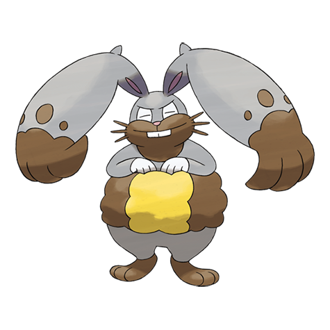
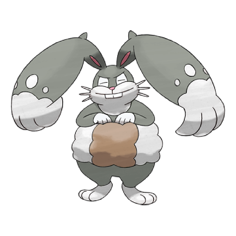
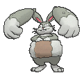
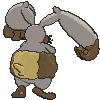
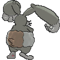

# #660 Diggersby (Digging Pokémon)

| Official Artwork | Shiny Artwork |
|------------------|---------------|
|  |  |

**Rising Ruby:** With their powerful ears, they can heft boulders of a ton or more with ease. They can be a big help at construction sites.

**Sinking Sapphire:** As powerful as an excavator, its ears can reduce dense bedrock to rubble. When it’s finished digging, it lounges lazily.

---

## Media

### Default Sprites

| Front | Shiny | Back | Shiny |
|-------|-------|------|-------|
|  |  |  |  |

### Cries

Latest (Gen VI+):

<audio controls>
<source src='../../assets/cries/diggersby/latest.ogg' type='audio/ogg'>
  Your browser does not support the audio element.
</audio>

Legacy:

<audio controls>
<source src='../../assets/cries/diggersby/legacy.ogg' type='audio/ogg'>
  Your browser does not support the audio element.
</audio>

---

## Pokédex Data

| National № | Type(s) | Height | Weight | Abilities | Local № |
|------------|---------|--------|--------|-----------|---------|
| #660 | {: width="48"} {: width="48"} | 1.0 m / 3.3 ft | 42.4 kg / 93.5 lbs | 1. Pickup 2. Cheek Pouch | N/A |

---

## Base Stats
|   | HP | Attack | Defense | Sp. Atk | Sp. Def | Speed |
|---|----|--------|---------|---------|---------|-------|
| **Base** | 96 | 56 | 80 | 50 | 80 | 78 |
| **Min** | 302 | 105 | 148 | 94 | 148 | 144 |
| **Max** | 396 | 232 | 284 | 218 | 284 | 280 |

The ranges shown above are for a level 100 Pokémon. Maximum values are based on a beneficial nature, 252 EVs, 31 IVs; minimum values are based on a hindering nature, 0 EVs, 0 IVs.

---

## Forms & Evolutions

!!! warning "WARNING"

    Information on evolutions may not be 100% accurate; differences between evolution methods across generations are not accounted for.

### Forms

Diggersby has no alternate forms.

### Evolution Line

1. [Bunnelby](bunnelby.md/)
    1. Level Up: [Diggersby](diggersby.md/)

---

## Training

| EV Yield | Catch Rate | Base Friendship | Base Exp. | Growth Rate | Held Items |
|----------|------------|-----------------|-----------|-------------|------------|
| 2 HP | 127 | 50 | 148 | Medium | N/A |

---

## Breeding

| Egg Groups | Egg Cycles | Gender | Dimorphic | Color | Shape |
|------------|------------|--------|-----------|-------|-------|
| 1. Ground | 15 | 50.0% Male 50.0% Female | False | Brown | Upright |

---

## Moves

!!! warning "WARNING"

    Specific move information may be incorrect. However, the general movepool should be accurate; this includes changes made in Sacred Gold and Storm Silver.

### Level Up Moves

| Lv. | Move | Type | Cat. | Power | Acc. | PP |
| --- | --- | --- | --- | --- | --- | --- |
| 1 | Agility | {: width="48"} | {: width="36"} | — | — | 30 |
| 1 | Hammer Arm | {: width="48"} | {: width="36"} | 100 | 90 | 10 |
| 1 | Leer | {: width="48"} | {: width="36"} | — | 100 | 30 |
| 1 | Rototiller | {: width="48"} | {: width="36"} | — | — | 10 |
| 1 | Swords Dance | {: width="48"} | {: width="36"} | — | — | 20 |
| 1 | Tackle | {: width="48"} | {: width="36"} | 40 | 100 | 35 |
| 4 | Quick Attack | {: width="48"} | {: width="36"} | 40 | 100 | 30 |
| 7 | Defense Curl | {: width="48"} | {: width="36"} | — | — | 40 |
| 10 | Double Slap | {: width="48"} | {: width="36"} | 15 | 85 | 10 |
| 12 | Mud Slap | {: width="48"} | {: width="36"} | 20 | 100 | 10 |
| 14 | Rollout | {: width="48"} | {: width="36"} | 30 | 90 | 20 |
| 16 | Take Down | {: width="48"} | {: width="36"} | 90 | 85 | 20 |
| 19 | Mud Shot | {: width="48"} | {: width="36"} | 55 | 95 | 15 |
| 20 | Bulldoze | {: width="48"} | {: width="36"} | 60 | 100 | 20 |
| 22 | Double Kick | {: width="48"} | {: width="36"} | 30 | 100 | 30 |
| 26 | Dig | {: width="48"} | {: width="36"} | 80 | 100 | 10 |
| 30 | Odor Sleuth | {: width="48"} | {: width="36"} | — | — | 40 |
| 34 | Flail | {: width="48"} | {: width="36"} | — | 100 | 15 |
| 38 | Bounce | {: width="48"} | {: width="36"} | 85 | 85 | 5 |
| 42 | Earthquake | {: width="48"} | {: width="36"} | 100 | 100 | 10 |
| 46 | Facade | {: width="48"} | {: width="36"} | 70 | 100 | 20 |
| 50 | Super Fang | {: width="48"} | {: width="36"} | — | 90 | 10 |
| 54 | Hammer Arm | {: width="48"} | {: width="36"} | 100 | 90 | 10 |

### TM Moves

| TM | Move | Type | Cat. | Power | Acc. | PP |
| --- | --- | --- | --- | --- | --- | --- |
| HM01 | Cut | {: width="48"} | {: width="36"} | 70 | 100 | 15 |
| HM03 | Surf | {: width="48"} | {: width="36"} | 90 | 100 | 15 |
| HM04 | Strength | {: width="48"} | {: width="36"} | 100 | 100 | 10 |
| HM06 | Rock Smash | {: width="48"} | {: width="36"} | 65 | 100 | 15 |
| TM06 | Toxic | {: width="48"} | {: width="36"} | — | 90 | 10 |
| TM08 | Bulk Up | {: width="48"} | {: width="36"} | — | — | 20 |
| TM10 | Hidden Power | {: width="48"} | {: width="36"} | 60 | 100 | 15 |
| TM100 | Confide | {: width="48"} | {: width="36"} | — | — | 20 |
| TM15 | Hyper Beam | {: width="48"} | {: width="36"} | 150 | 90 | 5 |
| TM17 | Protect | {: width="48"} | {: width="36"} | — | — | 10 |
| TM21 | Frustration | {: width="48"} | {: width="36"} | — | 100 | 20 |
| TM23 | Smack Down | {: width="48"} | {: width="36"} | 50 | 100 | 15 |
| TM26 | Earthquake | {: width="48"} | {: width="36"} | 100 | 100 | 10 |
| TM27 | Return | {: width="48"} | {: width="36"} | — | 100 | 20 |
| TM28 | Dig | {: width="48"} | {: width="36"} | 80 | 100 | 10 |
| TM31 | Brick Break | {: width="48"} | {: width="36"} | 75 | 100 | 15 |
| TM32 | Double Team | {: width="48"} | {: width="36"} | — | — | 15 |
| TM36 | Sludge Bomb | {: width="48"} | {: width="36"} | 90 | 100 | 10 |
| TM37 | Sandstorm | {: width="48"} | {: width="36"} | — | — | 10 |
| TM39 | Rock Tomb | {: width="48"} | {: width="36"} | 60 | 95 | 15 |
| TM41 | Torment | {: width="48"} | {: width="36"} | — | 100 | 15 |
| TM42 | Facade | {: width="48"} | {: width="36"} | 70 | 100 | 20 |
| TM44 | Rest | {: width="48"} | {: width="36"} | — | — | 5 |
| TM45 | Attract | {: width="48"} | {: width="36"} | — | 100 | 15 |
| TM46 | Thief | {: width="48"} | {: width="36"} | 60 | 100 | 25 |
| TM48 | Round | {: width="48"} | {: width="36"} | 60 | 100 | 15 |
| TM56 | Fling | {: width="48"} | {: width="36"} | — | 100 | 10 |
| TM66 | Payback | {: width="48"} | {: width="36"} | 50 | 100 | 10 |
| TM68 | Giga Impact | {: width="48"} | {: width="36"} | 150 | 90 | 5 |
| TM71 | Stone Edge | {: width="48"} | {: width="36"} | 100 | 80 | 5 |
| TM75 | Swords Dance | {: width="48"} | {: width="36"} | — | — | 20 |
| TM78 | Bulldoze | {: width="48"} | {: width="36"} | 60 | 100 | 20 |
| TM80 | Rock Slide | {: width="48"} | {: width="36"} | 75 | 90 | 10 |
| TM86 | Grass Knot | {: width="48"} | {: width="36"} | — | 100 | 20 |
| TM87 | Swagger | {: width="48"} | {: width="36"} | — | 85 | 15 |
| TM88 | Sleep Talk | {: width="48"} | {: width="36"} | — | — | 10 |
| TM89 | U Turn | {: width="48"} | {: width="36"} | 70 | 100 | 20 |
| TM90 | Substitute | {: width="48"} | {: width="36"} | — | — | 10 |
| TM93 | Wild Charge | {: width="48"} | {: width="36"} | 90 | 100 | 15 |
| TM94 | Secret Power | {: width="48"} | {: width="36"} | 70 | 100 | 20 |
| TM96 | Nature Power | {: width="48"} | {: width="36"} | — | — | 20 |
| TM98 | Power Up Punch | {: width="48"} | {: width="36"} | 40 | 100 | 20 |

### Egg Moves

Diggersby cannot learn any moves by breeding.
### Tutor Moves

| Move | Type | Cat. | Power | Acc. | PP |
| --- | --- | --- | --- | --- | --- |
| Bounce | {: width="48"} | {: width="36"} | 85 | 85 | 5 |
| Earth Power | {: width="48"} | {: width="36"} | 90 | 100 | 10 |
| Endeavor | {: width="48"} | {: width="36"} | — | 100 | 5 |
| Fire Punch | {: width="48"} | {: width="36"} | 75 | 100 | 15 |
| Focus Punch | {: width="48"} | {: width="36"} | 150 | 100 | 20 |
| Foul Play | {: width="48"} | {: width="36"} | 95 | 100 | 15 |
| Gastro Acid | {: width="48"} | {: width="36"} | — | 100 | 10 |
| Gunk Shot | {: width="48"} | {: width="36"} | 120 | 80 | 5 |
| Ice Punch | {: width="48"} | {: width="36"} | 75 | 100 | 15 |
| Iron Head | {: width="48"} | {: width="36"} | 80 | 100 | 15 |
| Iron Tail | {: width="48"} | {: width="36"} | 100 | 75 | 15 |
| Knock Off | {: width="48"} | {: width="36"} | 65 | 100 | 20 |
| Last Resort | {: width="48"} | {: width="36"} | 140 | 100 | 5 |
| Low Kick | {: width="48"} | {: width="36"} | — | 100 | 20 |
| Recycle | {: width="48"} | {: width="36"} | — | — | 10 |
| Snatch | {: width="48"} | {: width="36"} | — | — | 10 |
| Snore | {: width="48"} | {: width="36"} | 50 | 100 | 15 |
| Super Fang | {: width="48"} | {: width="36"} | — | 90 | 10 |
| Superpower | {: width="48"} | {: width="36"} | 120 | 100 | 5 |
| Thunder Punch | {: width="48"} | {: width="36"} | 75 | 100 | 15 |
| Uproar | {: width="48"} | {: width="36"} | 90 | 100 | 10 |

