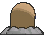

# #050 Diglett (Mole Pokémon)

| Official Artwork | Shiny Artwork |
|------------------|---------------|
|  |  |

Diglett are raised in most farms. The reason is simple— wherever this Pokémon burrows, the soil is left perfectly tilled for planting crops. This soil is made ideal for growing delicious vegetables.

---

## Media

### Default Sprites

| Front | Shiny | Back | Shiny |
|-------|-------|------|-------|
|  |  |  |  |

### Cries

Latest (Gen VI+):

<audio controls>
<source src='../../assets/cries/diglett/latest.ogg' type='audio/ogg'>
  Your browser does not support the audio element.
</audio>

Legacy:

<audio controls>
<source src='../../assets/cries/diglett/legacy.ogg' type='audio/ogg'>
  Your browser does not support the audio element.
</audio>

---

## Pokédex Data

| National № | Type(s) | Height | Weight | Abilities | Local № |
|------------|---------|--------|--------|-----------|---------|
| #50 | {: width="48"} | 0.2 m / 0.7 ft | 0.8 kg / 1.8 lbs | 1. Sand Veil 2. Arena Trap | N/A |

---

## Base Stats
|   | HP | Attack | Defense | Sp. Atk | Sp. Def | Speed |
|---|----|--------|---------|---------|---------|-------|
| **Base** | 10 | 55 | 25 | 35 | 45 | 95 |
| **Min** | 130 | 103 | 49 | 67 | 85 | 175 |
| **Max** | 224 | 229 | 163 | 185 | 207 | 317 |

The ranges shown above are for a level 100 Pokémon. Maximum values are based on a beneficial nature, 252 EVs, 31 IVs; minimum values are based on a hindering nature, 0 EVs, 0 IVs.

---

## Forms & Evolutions

!!! warning "WARNING"

    Information on evolutions may not be 100% accurate; differences between evolution methods across generations are not accounted for.

### Forms

Diglett has no alternate forms.

### Evolution Line

1. [Diglett](diglett.md/)
    1. Level Up: [Dugtrio](dugtrio.md/)

---

## Training

| EV Yield | Catch Rate | Base Friendship | Base Exp. | Growth Rate | Held Items |
|----------|------------|-----------------|-----------|-------------|------------|
| 1 Spd | 255 | 50 | 53 | Medium | Soft Sand (5%) |

---

## Breeding

| Egg Groups | Egg Cycles | Gender | Dimorphic | Color | Shape |
|------------|------------|--------|-----------|-------|-------|
| 1. Ground | 20 | 50.0% Male 50.0% Female | False | Brown | Blob |

---

## Moves

!!! warning "WARNING"

    Specific move information may be incorrect. However, the general movepool should be accurate; this includes changes made in Sacred Gold and Storm Silver.

### Level Up Moves

| Lv. | Move | Type | Cat. | Power | Acc. | PP |
| --- | --- | --- | --- | --- | --- | --- |
| 1 | Sand Attack | {: width="48"} | {: width="36"} | — | 100 | 15 |
| 1 | Scratch | {: width="48"} | {: width="36"} | 50 | 100 | 35 |
| 4 | Growl | {: width="48"} | {: width="36"} | — | 100 | 40 |
| 7 | Astonish | {: width="48"} | {: width="36"} | 30 | 100 | 15 |
| 10 | Mud Slap | {: width="48"} | {: width="36"} | 20 | 100 | 10 |
| 13 | Magnitude | {: width="48"} | {: width="36"} | — | 100 | 30 |
| 16 | Bulldoze | {: width="48"} | {: width="36"} | 60 | 100 | 20 |
| 19 | Sucker Punch | {: width="48"} | {: width="36"} | 70 | 100 | 5 |
| 22 | Mud Bomb | {: width="48"} | {: width="36"} | 65 | 85 | 10 |
| 25 | Dig | {: width="48"} | {: width="36"} | 80 | 100 | 10 |
| 28 | Earth Power | {: width="48"} | {: width="36"} | 90 | 100 | 10 |
| 31 | Slash | {: width="48"} | {: width="36"} | 70 | 100 | 20 |
| 34 | Earthquake | {: width="48"} | {: width="36"} | 100 | 100 | 10 |
| 37 | Rock Slide | {: width="48"} | {: width="36"} | 75 | 90 | 10 |
| 40 | Night Slash | {: width="48"} | {: width="36"} | 70 | 100 | 15 |
| 43 | Fissure | {: width="48"} | {: width="36"} | — | 30 | 5 |

### TM Moves

| TM | Move | Type | Cat. | Power | Acc. | PP |
| --- | --- | --- | --- | --- | --- | --- |
| HM01 | Cut | {: width="48"} | {: width="36"} | 70 | 100 | 15 |
| HM06 | Rock Smash | {: width="48"} | {: width="36"} | 65 | 100 | 15 |
| TM01 | Hone Claws | {: width="48"} | {: width="36"} | — | — | 15 |
| TM06 | Toxic | {: width="48"} | {: width="36"} | — | 90 | 10 |
| TM10 | Hidden Power | {: width="48"} | {: width="36"} | 60 | 100 | 15 |
| TM100 | Confide | {: width="48"} | {: width="36"} | — | — | 20 |
| TM11 | Sunny Day | {: width="48"} | {: width="36"} | — | — | 5 |
| TM17 | Protect | {: width="48"} | {: width="36"} | — | — | 10 |
| TM21 | Frustration | {: width="48"} | {: width="36"} | — | 100 | 20 |
| TM26 | Earthquake | {: width="48"} | {: width="36"} | 100 | 100 | 10 |
| TM27 | Return | {: width="48"} | {: width="36"} | — | 100 | 20 |
| TM28 | Dig | {: width="48"} | {: width="36"} | 80 | 100 | 10 |
| TM32 | Double Team | {: width="48"} | {: width="36"} | — | — | 15 |
| TM36 | Sludge Bomb | {: width="48"} | {: width="36"} | 90 | 100 | 10 |
| TM37 | Sandstorm | {: width="48"} | {: width="36"} | — | — | 10 |
| TM39 | Rock Tomb | {: width="48"} | {: width="36"} | 60 | 95 | 15 |
| TM40 | Aerial Ace | {: width="48"} | {: width="36"} | 60 | — | 20 |
| TM42 | Facade | {: width="48"} | {: width="36"} | 70 | 100 | 20 |
| TM44 | Rest | {: width="48"} | {: width="36"} | — | — | 5 |
| TM45 | Attract | {: width="48"} | {: width="36"} | — | 100 | 15 |
| TM46 | Thief | {: width="48"} | {: width="36"} | 60 | 100 | 25 |
| TM48 | Round | {: width="48"} | {: width="36"} | 60 | 100 | 15 |
| TM49 | Echoed Voice | {: width="48"} | {: width="36"} | 40 | 100 | 15 |
| TM65 | Shadow Claw | {: width="48"} | {: width="36"} | 70 | 100 | 15 |
| TM78 | Bulldoze | {: width="48"} | {: width="36"} | 60 | 100 | 20 |
| TM80 | Rock Slide | {: width="48"} | {: width="36"} | 75 | 90 | 10 |
| TM87 | Swagger | {: width="48"} | {: width="36"} | — | 85 | 15 |
| TM88 | Sleep Talk | {: width="48"} | {: width="36"} | — | — | 10 |
| TM90 | Substitute | {: width="48"} | {: width="36"} | — | — | 10 |
| TM94 | Secret Power | {: width="48"} | {: width="36"} | 70 | 100 | 20 |

### Egg Moves

| Move | Type | Cat. | Power | Acc. | PP |
| --- | --- | --- | --- | --- | --- |
| Ancient Power | {: width="48"} | {: width="36"} | 80 | 100 | 10 |
| Astonish | {: width="48"} | {: width="36"} | 30 | 100 | 15 |
| Beat Up | {: width="48"} | {: width="36"} | — | 100 | 10 |
| Endure | {: width="48"} | {: width="36"} | — | — | 10 |
| Feint Attack | {: width="48"} | {: width="36"} | 60 | — | 20 |
| Final Gambit | {: width="48"} | {: width="36"} | — | 100 | 5 |
| Headbutt | {: width="48"} | {: width="36"} | 70 | 100 | 15 |
| Memento | {: width="48"} | {: width="36"} | — | 100 | 10 |
| Mud Bomb | {: width="48"} | {: width="36"} | 65 | 85 | 10 |
| Pursuit | {: width="48"} | {: width="36"} | 40 | 100 | 20 |
| Reversal | {: width="48"} | {: width="36"} | — | 100 | 15 |
| Screech | {: width="48"} | {: width="36"} | — | 85 | 40 |
| Uproar | {: width="48"} | {: width="36"} | 90 | 100 | 10 |

### Tutor Moves

| Move | Type | Cat. | Power | Acc. | PP |
| --- | --- | --- | --- | --- | --- |
| Earth Power | {: width="48"} | {: width="36"} | 90 | 100 | 10 |
| Snore | {: width="48"} | {: width="36"} | 50 | 100 | 15 |
| Stealth Rock | {: width="48"} | {: width="36"} | — | — | 20 |

