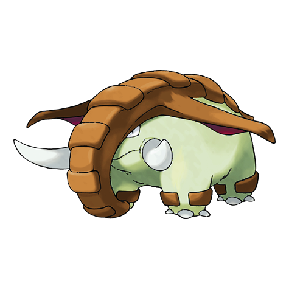
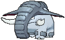

# #232 Donphan (Armor Pokémon)

| Official Artwork | Shiny Artwork |
|------------------|---------------|
|  |  |

**Rising Ruby:** Donphan’s favorite attack is curling its body into a ball, then charging at its foe while rolling at high speed. Once it starts rolling, this Pokémon can’t stop very easily.

**Sinking Sapphire:** If Donphan were to tackle with its hard body, even a house could be destroyed. Using its massive strength, the Pokémon helps clear rock and mud slides that block mountain trails.

---

## Media

### Default Sprites

| Front | Shiny | Back | Shiny |
|-------|-------|------|-------|
|  |  |  |  |

### Female Sprites

| Front | Shiny | Back | Shiny |
|-------|-------|------|-------|
|  |  |  |  |

### Cries

Latest (Gen VI+):

<audio controls>
<source src='../../assets/cries/donphan/latest.ogg' type='audio/ogg'>
  Your browser does not support the audio element.
</audio>

Legacy:

<audio controls>
<source src='../../assets/cries/donphan/legacy.ogg' type='audio/ogg'>
  Your browser does not support the audio element.
</audio>

---

## Pokédex Data

| National № | Type(s) | Height | Weight | Abilities | Local № |
|------------|---------|--------|--------|-----------|---------|
| #232 | {: width="48"} | 1.1 m / 3.6 ft | 120.0 kg / 264.6 lbs | 1. Sturdy 2. Sand Veil | N/A |

---

## Base Stats
|   | HP | Attack | Defense | Sp. Atk | Sp. Def | Speed |
|---|----|--------|---------|---------|---------|-------|
| **Base** | 90 | 120 | 120 | 60 | 60 | 50 |
| **Min** | 290 | 220 | 220 | 112 | 112 | 94 |
| **Max** | 384 | 372 | 372 | 240 | 240 | 218 |

The ranges shown above are for a level 100 Pokémon. Maximum values are based on a beneficial nature, 252 EVs, 31 IVs; minimum values are based on a hindering nature, 0 EVs, 0 IVs.

---

## Forms & Evolutions

!!! warning "WARNING"

    Information on evolutions may not be 100% accurate; differences between evolution methods across generations are not accounted for.

### Forms

Donphan has no alternate forms.

### Evolution Line

1. [Phanpy](phanpy.md/)
    1. Level Up: [Donphan](donphan.md/)

---

## Training

| EV Yield | Catch Rate | Base Friendship | Base Exp. | Growth Rate | Held Items |
|----------|------------|-----------------|-----------|-------------|------------|
| 1 Atk 1 Def | 60 | 70 | 175 | Mediu |

---

## Breeding

| Egg Groups | Egg Cycles | Gender | Dimorphic | Color | Shape |
|------------|------------|--------|-----------|-------|-------|
| 1. Ground | 20 | 50.0% Male 50.0% Female | True | Gray | Quadruped |

---

## Moves

!!! warning "WARNING"

    Specific move information may be incorrect. However, the general movepool should be accurate; this includes changes made in Sacred Gold and Storm Silver.

### Level Up Moves

| Lv. | Move | Type | Cat. | Power | Acc. | PP |
| --- | --- | --- | --- | --- | --- | --- |
| 1 | Bulldoze | {: width="48"} | {: width="36"} | 60 | 100 | 20 |
| 1 | Defense Curl | {: width="48"} | {: width="36"} | — | — | 40 |
| 1 | Fire Fang | {: width="48"} | {: width="36"} | 65 | 95 | 15 |
| 1 | Growl | {: width="48"} | {: width="36"} | — | 100 | 40 |
| 1 | Horn Attack | {: width="48"} | {: width="36"} | 65 | 100 | 25 |
| 1 | Thunder Fang | {: width="48"} | {: width="36"} | 65 | 95 | 15 |
| 6 | Rapid Spin | {: width="48"} | {: width="36"} | 50 | 100 | 40 |
| 9 | Rollout | {: width="48"} | {: width="36"} | 30 | 90 | 20 |
| 12 | Assurance | {: width="48"} | {: width="36"} | 60 | 100 | 10 |
| 15 | Knock Off | {: width="48"} | {: width="36"} | 65 | 100 | 20 |
| 18 | Body Slam | {: width="48"} | {: width="36"} | 85 | 100 | 15 |
| 21 | Ice Shard | {: width="48"} | {: width="36"} | 40 | 100 | 30 |
| 24 | Slam | {: width="48"} | {: width="36"} | 80 | 75 | 20 |
| 25 | Fury Attack | {: width="48"} | {: width="36"} | 15 | 85 | 20 |
| 28 | Magnitude | {: width="48"} | {: width="36"} | — | 100 | 30 |
| 32 | Play Rough | {: width="48"} | {: width="36"} | 90 | 90 | 10 |
| 36 | Scary Face | {: width="48"} | {: width="36"} | — | 100 | 10 |
| 40 | Earthquake | {: width="48"} | {: width="36"} | 100 | 100 | 10 |
| 44 | Head Smash | {: width="48"} | {: width="36"} | 150 | 80 | 5 |
| 48 | Giga Impact | {: width="48"} | {: width="36"} | 150 | 90 | 5 |

### TM Moves

| TM | Move | Type | Cat. | Power | Acc. | PP |
| --- | --- | --- | --- | --- | --- | --- |
| HM04 | Strength | {: width="48"} | {: width="36"} | 100 | 100 | 10 |
| HM06 | Rock Smash | {: width="48"} | {: width="36"} | 65 | 100 | 15 |
| TM05 | Roar | {: width="48"} | {: width="36"} | — | — | 20 |
| TM06 | Toxic | {: width="48"} | {: width="36"} | — | 90 | 10 |
| TM10 | Hidden Power | {: width="48"} | {: width="36"} | 60 | 100 | 15 |
| TM100 | Confide | {: width="48"} | {: width="36"} | — | — | 20 |
| TM11 | Sunny Day | {: width="48"} | {: width="36"} | — | — | 5 |
| TM15 | Hyper Beam | {: width="48"} | {: width="36"} | 150 | 90 | 5 |
| TM17 | Protect | {: width="48"} | {: width="36"} | — | — | 10 |
| TM21 | Frustration | {: width="48"} | {: width="36"} | — | 100 | 20 |
| TM26 | Earthquake | {: width="48"} | {: width="36"} | 100 | 100 | 10 |
| TM27 | Return | {: width="48"} | {: width="36"} | — | 100 | 20 |
| TM32 | Double Team | {: width="48"} | {: width="36"} | — | — | 15 |
| TM37 | Sandstorm | {: width="48"} | {: width="36"} | — | — | 10 |
| TM39 | Rock Tomb | {: width="48"} | {: width="36"} | 60 | 95 | 15 |
| TM42 | Facade | {: width="48"} | {: width="36"} | 70 | 100 | 20 |
| TM44 | Rest | {: width="48"} | {: width="36"} | — | — | 5 |
| TM45 | Attract | {: width="48"} | {: width="36"} | — | 100 | 15 |
| TM48 | Round | {: width="48"} | {: width="36"} | 60 | 100 | 15 |
| TM49 | Echoed Voice | {: width="48"} | {: width="36"} | 40 | 100 | 15 |
| TM68 | Giga Impact | {: width="48"} | {: width="36"} | 150 | 90 | 5 |
| TM69 | Rock Polish | {: width="48"} | {: width="36"} | — | — | 20 |
| TM71 | Stone Edge | {: width="48"} | {: width="36"} | 100 | 80 | 5 |
| TM74 | Gyro Ball | {: width="48"} | {: width="36"} | — | 100 | 5 |
| TM78 | Bulldoze | {: width="48"} | {: width="36"} | 60 | 100 | 20 |
| TM80 | Rock Slide | {: width="48"} | {: width="36"} | 75 | 90 | 10 |
| TM84 | Poison Jab | {: width="48"} | {: width="36"} | 80 | 100 | 20 |
| TM87 | Swagger | {: width="48"} | {: width="36"} | — | 85 | 15 |
| TM88 | Sleep Talk | {: width="48"} | {: width="36"} | — | — | 10 |
| TM90 | Substitute | {: width="48"} | {: width="36"} | — | — | 10 |
| TM94 | Secret Power | {: width="48"} | {: width="36"} | 70 | 100 | 20 |

### Egg Moves

Donphan cannot learn any moves by breeding.
### Tutor Moves

| Move | Type | Cat. | Power | Acc. | PP |
| --- | --- | --- | --- | --- | --- |
| Block | {: width="48"} | {: width="36"} | — | — | 5 |
| Bounce | {: width="48"} | {: width="36"} | 85 | 85 | 5 |
| Earth Power | {: width="48"} | {: width="36"} | 90 | 100 | 10 |
| Endeavor | {: width="48"} | {: width="36"} | — | 100 | 5 |
| Gunk Shot | {: width="48"} | {: width="36"} | 120 | 80 | 5 |
| Hyper Voice | {: width="48"} | {: width="36"} | 90 | 100 | 10 |
| Iron Defense | {: width="48"} | {: width="36"} | — | — | 15 |
| Iron Tail | {: width="48"} | {: width="36"} | 100 | 75 | 15 |
| Knock Off | {: width="48"} | {: width="36"} | 65 | 100 | 20 |
| Last Resort | {: width="48"} | {: width="36"} | 140 | 100 | 5 |
| Seed Bomb | {: width="48"} | {: width="36"} | 80 | 100 | 15 |
| Snore | {: width="48"} | {: width="36"} | 50 | 100 | 15 |
| Stealth Rock | {: width="48"} | {: width="36"} | — | — | 20 |
| Superpower | {: width="48"} | {: width="36"} | 120 | 100 | 5 |

