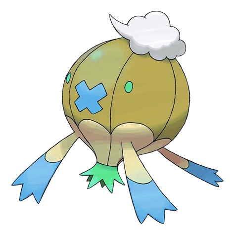
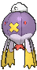

# #426 Drifblim (Blimp Pokémon)

| Official Artwork | Shiny Artwork |
|------------------|---------------|
|  |  |

**Rising Ruby:** It carries people and Pokémon when it flies. But since it only drifts, it can end up anywhere.

**Sinking Sapphire:** It’s drowsy in daytime, but flies off in the evening in big groups. No one knows where they go.

---

## Media

### Default Sprites

| Front | Shiny | Back | Shiny |
|-------|-------|------|-------|
|  |  |  |  |

### Cries

Latest (Gen VI+):

<audio controls>
<source src='../../assets/cries/drifblim/latest.ogg' type='audio/ogg'>
  Your browser does not support the audio element.
</audio>

Legacy:

<audio controls>
<source src='../../assets/cries/drifblim/legacy.ogg' type='audio/ogg'>
  Your browser does not support the audio element.
</audio>

---

## Pokédex Data

| National № | Type(s) | Height | Weight | Abilities | Local № |
|------------|---------|--------|--------|-----------|---------|
| #426 | {: width="48"} {: width="48"} | 1.2 m / 3.9 ft | 15.0 kg / 33.1 lbs | 1. Aftermath 2. Unburden | #66 |

---

## Base Stats
|   | HP | Attack | Defense | Sp. Atk | Sp. Def | Speed |
|---|----|--------|---------|---------|---------|-------|
| **Base** | 150 | 80 | 44 | 90 | 54 | 80 |
| **Min** | 410 | 148 | 83 | 166 | 101 | 148 |
| **Max** | 504 | 284 | 205 | 306 | 227 | 284 |

The ranges shown above are for a level 100 Pokémon. Maximum values are based on a beneficial nature, 252 EVs, 31 IVs; minimum values are based on a hindering nature, 0 EVs, 0 IVs.

---

## Forms & Evolutions

!!! warning "WARNING"

    Information on evolutions may not be 100% accurate; differences between evolution methods across generations are not accounted for.

### Forms

Drifblim has no alternate forms.

### Evolution Line

1. [Drifloon](drifloon.md/)
    1. Level Up: [Drifblim](drifblim.md/)

---

## Training

| EV Yield | Catch Rate | Base Friendship | Base Exp. | Growth Rate | Held Items |
|----------|------------|-----------------|-----------|-------------|------------|
| 2 HP | 60 | 50 | 174 | Fast Then Very Slo |

---

## Breeding

| Egg Groups | Egg Cycles | Gender | Dimorphic | Color | Shape |
|------------|------------|--------|-----------|-------|-------|
| 1. Indeterminate | 30 | 50.0% Male 50.0% Female | False | Purple | Arms |

---

## Moves

!!! warning "WARNING"

    Specific move information may be incorrect. However, the general movepool should be accurate; this includes changes made in Sacred Gold and Storm Silver.

### Level Up Moves

| Lv. | Move | Type | Cat. | Power | Acc. | PP |
| --- | --- | --- | --- | --- | --- | --- |
| 1 | Constrict | {: width="48"} | {: width="36"} | 10 | 100 | 35 |
| 1 | Hurricane | {: width="48"} | {: width="36"} | 110 | 70 | 10 |
| 1 | Icy Wind | {: width="48"} | {: width="36"} | 55 | 95 | 15 |
| 1 | Minimize | {: width="48"} | {: width="36"} | — | — | 10 |
| 1 | Phantom Force | {: width="48"} | {: width="36"} | 90 | 100 | 10 |
| 1 | Weather Ball | {: width="48"} | {: width="36"} | 50 | 100 | 10 |
| 3 | Astonish | {: width="48"} | {: width="36"} | 30 | 100 | 15 |
| 6 | Gust | {: width="48"} | {: width="36"} | 40 | 100 | 35 |
| 9 | Focus Energy | {: width="48"} | {: width="36"} | — | — | 30 |
| 12 | Payback | {: width="48"} | {: width="36"} | 50 | 100 | 10 |
| 15 | Ominous Wind | {: width="48"} | {: width="36"} | 60 | 100 | 5 |
| 18 | Air Cutter | {: width="48"} | {: width="36"} | 60 | 95 | 25 |
| 21 | Hex | {: width="48"} | {: width="36"} | 65 | 100 | 10 |
| 24 | Acrobatics | {: width="48"} | {: width="36"} | 55 | 100 | 15 |
| 27 | Clear Smog | {: width="48"} | {: width="36"} | 50 | — | 15 |
| 31 | Spit Up | {: width="48"} | {: width="36"} | — | 100 | 10 |
| 31 | Stockpile | {: width="48"} | {: width="36"} | — | — | 20 |
| 31 | Swallow | {: width="48"} | {: width="36"} | — | — | 10 |
| 35 | Shadow Ball | {: width="48"} | {: width="36"} | 80 | 100 | 15 |
| 39 | Hypnosis | {: width="48"} | {: width="36"} | — | 60 | 20 |
| 43 | Amnesia | {: width="48"} | {: width="36"} | — | — | 20 |
| 47 | Baton Pass | {: width="48"} | {: width="36"} | — | — | 40 |
| 51 | Explosion | {: width="48"} | {: width="36"} | 250 | 100 | 5 |
| 55 | Phantom Force | {: width="48"} | {: width="36"} | 90 | 100 | 10 |
| 59 | Hurricane | {: width="48"} | {: width="36"} | 110 | 70 | 10 |

### TM Moves

| TM | Move | Type | Cat. | Power | Acc. | PP |
| --- | --- | --- | --- | --- | --- | --- |
| HM01 | Cut | {: width="48"} | {: width="36"} | 70 | 100 | 15 |
| HM02 | Fly | {: width="48"} | {: width="36"} | 100 | 100 | 10 |
| TM04 | Calm Mind | {: width="48"} | {: width="36"} | — | — | 20 |
| TM06 | Toxic | {: width="48"} | {: width="36"} | — | 90 | 10 |
| TM10 | Hidden Power | {: width="48"} | {: width="36"} | 60 | 100 | 15 |
| TM100 | Confide | {: width="48"} | {: width="36"} | — | — | 20 |
| TM11 | Sunny Day | {: width="48"} | {: width="36"} | — | — | 5 |
| TM15 | Hyper Beam | {: width="48"} | {: width="36"} | 150 | 90 | 5 |
| TM17 | Protect | {: width="48"} | {: width="36"} | — | — | 10 |
| TM18 | Rain Dance | {: width="48"} | {: width="36"} | — | — | 5 |
| TM21 | Frustration | {: width="48"} | {: width="36"} | — | 100 | 20 |
| TM24 | Thunderbolt | {: width="48"} | {: width="36"} | 90 | 100 | 15 |
| TM25 | Thunder | {: width="48"} | {: width="36"} | 110 | 70 | 10 |
| TM27 | Return | {: width="48"} | {: width="36"} | — | 100 | 20 |
| TM29 | Psychic | {: width="48"} | {: width="36"} | 90 | 100 | 10 |
| TM30 | Shadow Ball | {: width="48"} | {: width="36"} | 80 | 100 | 15 |
| TM32 | Double Team | {: width="48"} | {: width="36"} | — | — | 15 |
| TM42 | Facade | {: width="48"} | {: width="36"} | 70 | 100 | 20 |
| TM44 | Rest | {: width="48"} | {: width="36"} | — | — | 5 |
| TM45 | Attract | {: width="48"} | {: width="36"} | — | 100 | 15 |
| TM46 | Thief | {: width="48"} | {: width="36"} | 60 | 100 | 25 |
| TM48 | Round | {: width="48"} | {: width="36"} | 60 | 100 | 15 |
| TM57 | Charge Beam | {: width="48"} | {: width="36"} | 50 | 90 | 10 |
| TM61 | Will O Wisp | {: width="48"} | {: width="36"} | — | 85 | 15 |
| TM62 | Acrobatics | {: width="48"} | {: width="36"} | 55 | 100 | 15 |
| TM63 | Embargo | {: width="48"} | {: width="36"} | — | 100 | 15 |
| TM64 | Explosion | {: width="48"} | {: width="36"} | 250 | 100 | 5 |
| TM66 | Payback | {: width="48"} | {: width="36"} | 50 | 100 | 10 |
| TM68 | Giga Impact | {: width="48"} | {: width="36"} | 150 | 90 | 5 |
| TM70 | Flash | {: width="48"} | {: width="36"} | — | 100 | 20 |
| TM73 | Thunder Wave | {: width="48"} | {: width="36"} | — | 90 | 20 |
| TM74 | Gyro Ball | {: width="48"} | {: width="36"} | — | 100 | 5 |
| TM77 | Psych Up | {: width="48"} | {: width="36"} | — | — | 10 |
| TM85 | Dream Eater | {: width="48"} | {: width="36"} | 100 | 100 | 15 |
| TM87 | Swagger | {: width="48"} | {: width="36"} | — | 85 | 15 |
| TM88 | Sleep Talk | {: width="48"} | {: width="36"} | — | — | 10 |
| TM90 | Substitute | {: width="48"} | {: width="36"} | — | — | 10 |
| TM94 | Secret Power | {: width="48"} | {: width="36"} | 70 | 100 | 20 |

### Egg Moves

Drifblim cannot learn any moves by breeding.
### Tutor Moves

| Move | Type | Cat. | Power | Acc. | PP |
| --- | --- | --- | --- | --- | --- |
| Bind | {: width="48"} | {: width="36"} | 15 | 85 | 20 |
| Icy Wind | {: width="48"} | {: width="36"} | 55 | 95 | 15 |
| Knock Off | {: width="48"} | {: width="36"} | 65 | 100 | 20 |
| Magic Coat | {: width="48"} | {: width="36"} | — | — | 15 |
| Pain Split | {: width="48"} | {: width="36"} | — | — | 20 |
| Recycle | {: width="48"} | {: width="36"} | — | — | 10 |
| Shock Wave | {: width="48"} | {: width="36"} | 60 | — | 20 |
| Skill Swap | {: width="48"} | {: width="36"} | — | — | 10 |
| Snore | {: width="48"} | {: width="36"} | 50 | 100 | 15 |
| Spite | {: width="48"} | {: width="36"} | — | 100 | 10 |
| Tailwind | {: width="48"} | {: width="36"} | — | — | 15 |
| Trick | {: width="48"} | {: width="36"} | — | 100 | 10 |

