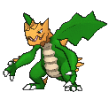
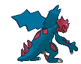
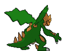

# #621 Druddigon (Cave Pokémon)

| Official Artwork | Shiny Artwork |
|------------------|---------------|
|  |  |

**Rising Ruby:** It races through narrow caves, using its sharp claws to catch prey. The skin on its face is harder than a rock.

**Sinking Sapphire:** It warms its body by absorbing sunlight with its wings. When its body temperature falls, it can no longer move.

---

## Media

### Default Sprites

| Front | Shiny | Back | Shiny |
|-------|-------|------|-------|
|  |  |  |  |

### Cries

Latest (Gen VI+):

<audio controls>
<source src='../../assets/cries/druddigon/latest.ogg' type='audio/ogg'>
  Your browser does not support the audio element.
</audio>

Legacy:

<audio controls>
<source src='../../assets/cries/druddigon/legacy.ogg' type='audio/ogg'>
  Your browser does not support the audio element.
</audio>

---

## Pokédex Data

| National № | Type(s) | Height | Weight | Abilities | Local № |
|------------|---------|--------|--------|-----------|---------|
| #621 | {: width="48"} | 1.6 m / 5.2 ft | 139.0 kg / 306.4 lbs | 1. Rough Skin 2. Sheer Force | N/A |

---

## Base Stats
|   | HP | Attack | Defense | Sp. Atk | Sp. Def | Speed |
|---|----|--------|---------|---------|---------|-------|
| **Base** | 77 | 120 | 90 | 60 | 90 | 48 |
| **Min** | 264 | 220 | 166 | 112 | 166 | 90 |
| **Max** | 358 | 372 | 306 | 240 | 306 | 214 |

The ranges shown above are for a level 100 Pokémon. Maximum values are based on a beneficial nature, 252 EVs, 31 IVs; minimum values are based on a hindering nature, 0 EVs, 0 IVs.

---

## Forms & Evolutions

!!! warning "WARNING"

    Information on evolutions may not be 100% accurate; differences between evolution methods across generations are not accounted for.

### Forms

Druddigon has no alternate forms.

### Evolution Line

1. [Druddigon](druddigon.md/)

---

## Training

| EV Yield | Catch Rate | Base Friendship | Base Exp. | Growth Rate | Held Items |
|----------|------------|-----------------|-----------|-------------|------------|
| 2 Atk | 45 | 50 | 170 | Medium | Dragon Fang (5%) |

---

## Breeding

| Egg Groups | Egg Cycles | Gender | Dimorphic | Color | Shape |
|------------|------------|--------|-----------|-------|-------|
| 1. Dragon 2. Monster | 30 | 50.0% Male 50.0% Female | False | Red | Upright |

---

## Moves

!!! warning "WARNING"

    Specific move information may be incorrect. However, the general movepool should be accurate; this includes changes made in Sacred Gold and Storm Silver.

### Level Up Moves

| Lv. | Move | Type | Cat. | Power | Acc. | PP |
| --- | --- | --- | --- | --- | --- | --- |
| 1 | Leer | {: width="48"} | {: width="36"} | — | 100 | 30 |
| 1 | Scratch | {: width="48"} | {: width="36"} | 50 | 100 | 35 |
| 5 | Hone Claws | {: width="48"} | {: width="36"} | — | — | 15 |
| 8 | Bite | {: width="48"} | {: width="36"} | 60 | 100 | 25 |
| 11 | Scary Face | {: width="48"} | {: width="36"} | — | 100 | 10 |
| 14 | Dragon Rage | {: width="48"} | {: width="36"} | — | 100 | 10 |
| 18 | Slash | {: width="48"} | {: width="36"} | 70 | 100 | 20 |
| 21 | Glare | {: width="48"} | {: width="36"} | — | 100 | 30 |
| 23 | Fire Fang | {: width="48"} | {: width="36"} | 65 | 95 | 15 |
| 23 | Thunder Fang | {: width="48"} | {: width="36"} | 65 | 95 | 15 |
| 26 | Night Slash | {: width="48"} | {: width="36"} | 70 | 100 | 15 |
| 28 | Dragon Claw | {: width="48"} | {: width="36"} | 80 | 100 | 15 |
| 30 | Poison Tail | {: width="48"} | {: width="36"} | 50 | 100 | 25 |
| 32 | Chip Away | {: width="48"} | {: width="36"} | 70 | 100 | 20 |
| 35 | Revenge | {: width="48"} | {: width="36"} | 60 | 100 | 10 |
| 38 | Crunch | {: width="48"} | {: width="36"} | 80 | 100 | 15 |
| 41 | Dragon Tail | {: width="48"} | {: width="36"} | 60 | 90 | 10 |
| 45 | Gunk Shot | {: width="48"} | {: width="36"} | 120 | 80 | 5 |
| 49 | Rock Climb | {: width="48"} | {: width="36"} | 90 | 85 | 20 |
| 53 | Superpower | {: width="48"} | {: width="36"} | 120 | 100 | 5 |
| 59 | Outrage | {: width="48"} | {: width="36"} | 120 | 100 | 10 |

### TM Moves

| TM | Move | Type | Cat. | Power | Acc. | PP |
| --- | --- | --- | --- | --- | --- | --- |
| HM01 | Cut | {: width="48"} | {: width="36"} | 70 | 100 | 15 |
| HM03 | Surf | {: width="48"} | {: width="36"} | 90 | 100 | 15 |
| HM04 | Strength | {: width="48"} | {: width="36"} | 100 | 100 | 10 |
| HM06 | Rock Smash | {: width="48"} | {: width="36"} | 65 | 100 | 15 |
| TM01 | Hone Claws | {: width="48"} | {: width="36"} | — | — | 15 |
| TM02 | Dragon Claw | {: width="48"} | {: width="36"} | 80 | 100 | 15 |
| TM05 | Roar | {: width="48"} | {: width="36"} | — | — | 20 |
| TM06 | Toxic | {: width="48"} | {: width="36"} | — | 90 | 10 |
| TM10 | Hidden Power | {: width="48"} | {: width="36"} | 60 | 100 | 15 |
| TM100 | Confide | {: width="48"} | {: width="36"} | — | — | 20 |
| TM11 | Sunny Day | {: width="48"} | {: width="36"} | — | — | 5 |
| TM12 | Taunt | {: width="48"} | {: width="36"} | — | 100 | 20 |
| TM15 | Hyper Beam | {: width="48"} | {: width="36"} | 150 | 90 | 5 |
| TM17 | Protect | {: width="48"} | {: width="36"} | — | — | 10 |
| TM18 | Rain Dance | {: width="48"} | {: width="36"} | — | — | 5 |
| TM21 | Frustration | {: width="48"} | {: width="36"} | — | 100 | 20 |
| TM23 | Smack Down | {: width="48"} | {: width="36"} | 50 | 100 | 15 |
| TM26 | Earthquake | {: width="48"} | {: width="36"} | 100 | 100 | 10 |
| TM27 | Return | {: width="48"} | {: width="36"} | — | 100 | 20 |
| TM28 | Dig | {: width="48"} | {: width="36"} | 80 | 100 | 10 |
| TM32 | Double Team | {: width="48"} | {: width="36"} | — | — | 15 |
| TM35 | Flamethrower | {: width="48"} | {: width="36"} | 90 | 100 | 15 |
| TM36 | Sludge Bomb | {: width="48"} | {: width="36"} | 90 | 100 | 10 |
| TM39 | Rock Tomb | {: width="48"} | {: width="36"} | 60 | 95 | 15 |
| TM40 | Aerial Ace | {: width="48"} | {: width="36"} | 60 | — | 20 |
| TM41 | Torment | {: width="48"} | {: width="36"} | — | 100 | 15 |
| TM42 | Facade | {: width="48"} | {: width="36"} | 70 | 100 | 20 |
| TM44 | Rest | {: width="48"} | {: width="36"} | — | — | 5 |
| TM45 | Attract | {: width="48"} | {: width="36"} | — | 100 | 15 |
| TM48 | Round | {: width="48"} | {: width="36"} | 60 | 100 | 15 |
| TM52 | Focus Blast | {: width="48"} | {: width="36"} | 120 | 70 | 5 |
| TM56 | Fling | {: width="48"} | {: width="36"} | — | 100 | 10 |
| TM57 | Charge Beam | {: width="48"} | {: width="36"} | 50 | 90 | 10 |
| TM59 | Incinerate | {: width="48"} | {: width="36"} | 60 | 100 | 15 |
| TM65 | Shadow Claw | {: width="48"} | {: width="36"} | 70 | 100 | 15 |
| TM66 | Payback | {: width="48"} | {: width="36"} | 50 | 100 | 10 |
| TM67 | Retaliate | {: width="48"} | {: width="36"} | 70 | 100 | 5 |
| TM68 | Giga Impact | {: width="48"} | {: width="36"} | 150 | 90 | 5 |
| TM78 | Bulldoze | {: width="48"} | {: width="36"} | 60 | 100 | 20 |
| TM80 | Rock Slide | {: width="48"} | {: width="36"} | 75 | 90 | 10 |
| TM82 | Dragon Tail | {: width="48"} | {: width="36"} | 60 | 90 | 10 |
| TM87 | Swagger | {: width="48"} | {: width="36"} | — | 85 | 15 |
| TM88 | Sleep Talk | {: width="48"} | {: width="36"} | — | — | 10 |
| TM90 | Substitute | {: width="48"} | {: width="36"} | — | — | 10 |
| TM91 | Flash Cannon | {: width="48"} | {: width="36"} | 80 | 100 | 10 |
| TM94 | Secret Power | {: width="48"} | {: width="36"} | 70 | 100 | 20 |
| TM95 | Snarl | {: width="48"} | {: width="36"} | 55 | 95 | 15 |
| TM97 | Dark Pulse | {: width="48"} | {: width="36"} | 80 | 100 | 15 |
| TM98 | Power Up Punch | {: width="48"} | {: width="36"} | 40 | 100 | 20 |

### Egg Moves

| Move | Type | Cat. | Power | Acc. | PP |
| --- | --- | --- | --- | --- | --- |
| Crush Claw | {: width="48"} | {: width="36"} | 75 | 95 | 10 |
| Feint Attack | {: width="48"} | {: width="36"} | 60 | — | 20 |
| Fire Fang | {: width="48"} | {: width="36"} | 65 | 95 | 15 |
| Glare | {: width="48"} | {: width="36"} | — | 100 | 30 |
| Iron Tail | {: width="48"} | {: width="36"} | 100 | 75 | 15 |
| Metal Claw | {: width="48"} | {: width="36"} | 50 | 95 | 35 |
| Poison Tail | {: width="48"} | {: width="36"} | 50 | 100 | 25 |
| Pursuit | {: width="48"} | {: width="36"} | 40 | 100 | 20 |
| Snatch | {: width="48"} | {: width="36"} | — | — | 10 |
| Sucker Punch | {: width="48"} | {: width="36"} | 70 | 100 | 5 |
| Thunder Fang | {: width="48"} | {: width="36"} | 65 | 95 | 15 |

### Tutor Moves

| Move | Type | Cat. | Power | Acc. | PP |
| --- | --- | --- | --- | --- | --- |
| Aqua Tail | {: width="48"} | {: width="36"} | 90 | 90 | 10 |
| Draco Meteor | {: width="48"} | {: width="36"} | 130 | 90 | 5 |
| Dragon Pulse | {: width="48"} | {: width="36"} | 85 | 100 | 10 |
| Fire Punch | {: width="48"} | {: width="36"} | 75 | 100 | 15 |
| Gunk Shot | {: width="48"} | {: width="36"} | 120 | 80 | 5 |
| Heat Wave | {: width="48"} | {: width="36"} | 95 | 90 | 10 |
| Iron Head | {: width="48"} | {: width="36"} | 80 | 100 | 15 |
| Iron Tail | {: width="48"} | {: width="36"} | 100 | 75 | 15 |
| Outrage | {: width="48"} | {: width="36"} | 120 | 100 | 10 |
| Shock Wave | {: width="48"} | {: width="36"} | 60 | — | 20 |
| Snatch | {: width="48"} | {: width="36"} | — | — | 10 |
| Snore | {: width="48"} | {: width="36"} | 50 | 100 | 15 |
| Stealth Rock | {: width="48"} | {: width="36"} | — | — | 20 |
| Superpower | {: width="48"} | {: width="36"} | 120 | 100 | 5 |
| Thunder Punch | {: width="48"} | {: width="36"} | 75 | 100 | 15 |

